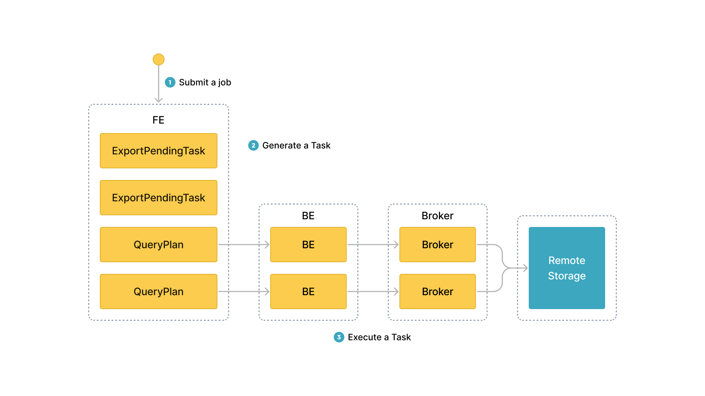

# Export data using EXPORT

This topic describes how to export data from specified tables or partitions in your StarRocks cluster as CSV data files to an external storage system, which can be a distributed file system HDFS or a cloud storage system such as AWS S3.

## Background information

In v2.4 and earlier, StarRocks depends on brokers to set up connections between your StarRocks cluster and your external storage system when it uses the EXPORT statement to export data. Therefore, you need to input `WITH BROKER "<broker_name>"` to specify the broker you want to use in the EXPORT statement. This is called "broker-based unloading." A broker is an independent, stateless service that is integrated with a file-system interface, helping StarRocks export data to your external storage system.

From v2.5 onwards, StarRocks no longer depends on brokers to set up connections between your StarRocks cluster and your external storage system when it uses the EXPORT statement to export data. Therefore, you no longer need to specify a broker in the EXPORT statement, but you still need to retain the `WITH BROKER` keyword. This is called "broker-free unloading."

When your data is stored in HDFS, however, broker-free unloading may not work and you can resort to broker-based unloading:

- If you export data to multiple HDFS clusters, you need to deploy and configure an independent broker for each of these HDFS clusters.
- If you export data to a single HDFS cluster and you have configured multiple Kerberos users, you need to deploy one independent broker.

> **NOTE**
>
> You can use the [SHOW BROKER](../sql-reference/sql-statements/Administration/SHOW_BROKER.md) statement to check for brokers that are deployed in your StarRocks cluster. If no brokers are deployed, you can deploy brokers by following the instructions provided in [Deploy a broker](../deployment/deploy_broker.md).

## Supported storage systems

- Distributed file system HDFS
- Cloud storage system such as AWS S3

## Precautions

- We recommend that the data you export at a time do not exceed a few dozen GB. If you export an exceedingly large amount of data at a time, the export may fail and the cost of retrying the export increases.

- If the source StarRocks table contains a large amount of data, we recommend that you export data from only a few partitions of the table each time until all data from the table is exported.

- If the FEs in your StarRocks cluster restart or a new leader FE is elected when an export job is running, the export job fails. In this situation, you must submit the export job again.

- If the FEs in your StarRocks cluster restart or a new leader FE is elected after an export job finishes, some of the job information returned by the [SHOW EXPORT](../sql-reference/sql-statements/data-manipulation/SHOW_EXPORT.md) statement may be lost.

- StarRocks exports only the data of base tables. StarRocks does not export the data of materialized views created on base tables.

- Export jobs require data scans, which occupy I/O resources and consequently increase query latency.

## Workflow

After you submit an export job, StarRocks identifies all tablets involved in the export job. Then, StarRocks divides the involved tablets into groups and generates query plans. The query plans are used to read data from the involved tablets and to write the data to a specified path of the destination storage system.

The following figure shows the general workflow.



The general workflow consists of the following three steps:

1. The user submits an export job to the leader FE.

2. The leader FE issues `snapshot` instructions to all BEs in the StarRocks cluster, so the BEs can take snapshots of the involved tablets to ensure the consistency of the data to be exported. The leader FE also generates multiple export tasks. Each export task is a query plan, and each query plan is used to process a portion of the involved tablets.

3. The leader FE distributes the export tasks to the BEs.

## Principles

When StarRocks execute query plans, it first creates a temporary folder named `__starrocks_export_tmp_xxx` in the specified path of the destination storage system. In the name of the temporary folder, `xxx` represents the ID of the export job. An example name for the temporary folder is `__starrocks_export_tmp_921d8f80-7c9d-11eb-9342-acde48001122`. After StarRocks successfully executes a query plan, it generates a temporary file in the temporary folder and writes the exported data into the generated temporary file.

After all data is exported, StarRocks uses the RENAME statement to save the generated temporary files to a specified path.

## Related parameters

This section describes some export-related parameters that you can configure in the FEs of your StarRocks cluster.

- `export_checker_interval_second`: the interval at which export jobs are scheduled. The default interval is 5 seconds. After you reconfigure this parameter for an FE, you need to restart the FE to make the new parameter setting take effect.

- `export_running_job_num_limit`: the maximum number of running export jobs that are allowed. If the number of running export jobs exceeds this limit, excessive export jobs enter a waiting state after `snapshot` is run. The default maximum number is 5. You can reconfigure this parameter when export jobs are running.

- `export_task_default_timeout_second`: the timeout period for export jobs. The default timeout period is 2 hours. You can reconfigure this parameter when export jobs are running.

- `export_max_bytes_per_be_per_task`: the maximum amount of data as compressed that can be exported per export task from each BE. This parameter provides a policy based on which StarRocks splits export jobs into export tasks that can be concurrently run. The default maximum amount is 256 MB.

- `export_task_pool_size`: the maximum number of export tasks that can be concurrently run by the thread pool. The default maximum number is 5.

## Basic operations

### Submit an export job

Suppose that your StarRocks database `db1` contains a table named `tbl1`. To export the data of columns `col1` and `col3` from partitions `p1` and `p2` of `tbl1` to the `export` path of your HDFS cluster, run the following command:

```SQL
EXPORT TABLE db1.tbl1 
PARTITION (p1,p2)
(col1, col3)
TO "hdfs://HDFS_IP:HDFS_Port/export/lineorder_" 
PROPERTIES
(
    "column_separator"=",",
    "load_mem_limit"="2147483648",
    "timeout" = "3600"
)
WITH BROKER
(
    "username" = "user",
    "password" = "passwd"
);
```

For detailed syntax and parameter descriptions as well as the command examples of exporting data to AWS S3, see [EXPORT](../sql-reference/sql-statements/data-manipulation/EXPORT.md).

### Obtain the query ID of an export job

After you submit an export job, you can use the SELECT LAST_QUERY_ID() statement to query the query ID of the export job. With the query ID, you can view or cancel the export job.

For the detailed syntax and parameter descriptions, see [last_query_id](../sql-reference/sql-functions/utility-functions/last_query_id.md).

### View the status of an export job

After you submit an export job, you can use the SHOW EXPORT statement to view the status of the export job. Example:

```SQL
SHOW EXPORT WHERE queryid = "edee47f0-abe1-11ec-b9d1-00163e1e238f";
```

> **NOTE**
>
> In the preceding example, `queryid` is the query ID of the export job.

Information similar to the following output is returned:

```Plain
JobId: 14008
State: FINISHED
Progress: 100%
TaskInfo: {"partitions":["*"],"mem limit":2147483648,"column separator":",","line delimiter":"\n","tablet num":1,"broker":"hdfs","coord num":1,"db":"default_cluster:db1","tbl":"tbl3",columns:["col1", "col3"]}
Path: oss://bj-test/export/
CreateTime: 2019-06-25 17:08:24
StartTime: 2019-06-25 17:08:28
FinishTime: 2019-06-25 17:08:34
Timeout: 3600
ErrorMsg: N/A
```

For detailed syntax and parameter descriptions, see [SHOW EXPORT](../sql-reference/sql-statements/data-manipulation/SHOW_EXPORT.md).

### Cancel an export job

You can use the CANCEL EXPORT statement to cancel an export job that you have submitted. Example:

```SQL
CANCEL EXPORT WHERE queryid = "921d8f80-7c9d-11eb-9342-acde48001122";
```

> **NOTE**
>
> In the preceding example, `queryid` is the query ID of the export job.

For detailed syntax and parameter descriptions, see [CANCEL EXPORT](../sql-reference/sql-statements/data-manipulation/CANCEL_EXPORT.md).

## Best practices

### Query plan splitting

The number of query plans into which an export job is split varies depending on the number of tablets involved in the export job and on the maximum amount of data that can be processed per query plan. Export jobs are retried as query plans. If the amount of data processed by a query plan exceeds the maximum amount allowed, the query plan encounters errors such as jitters in remote storage. As a result, the cost of retrying the query plan increases. The maximum amount of data that can be processed per query plan by each BE is specified by the `export_max_bytes_per_be_per_task` parameter, which defaults to 256 MB. In a query plan, each BE is allocated at least one tablet and can export a data amount that does not exceed the limit specified by the `export_max_bytes_per_be_per_task` parameter.

The multiple query plans of an export job are concurrently executed. You can use the FE parameter `export_task_pool_size` to specify the maximum number of export tasks that are allowed to concurrently run by the thread pool. This parameter defaults to `5`.

In normal cases, each query plan of an export job consists of only two parts: scanning and exporting. The logic for performing computations required by query plans does not consume much memory. Therefore, the default memory limit of 2 GB can meet most of your business requirements. However, in certain circumstances, such as when a query plan requires scanning many tablets on a BE or a tablet has many versions, the 2-GB memory capacity may be insufficient. In these circumstances, you need to use the `load_mem_limit` parameter to specify a higher memory capacity limit, such as 4 GB or 8 GB.
