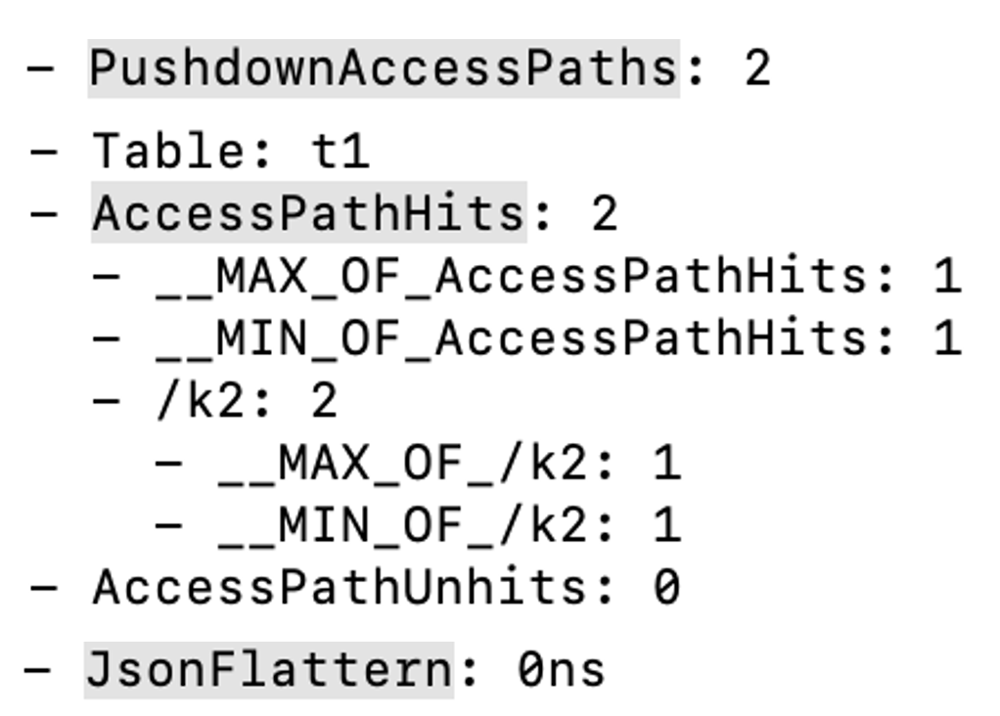

# [Preview] Flat JSON

This topic introduces the basic concepts of the Flat JSON feature and how to use this feature.

Since v2.2.0, StarRocks supports storing JSON data, which allows for more flexible data storage. However, in most query scenarios, users access only the JSON data in the specified path, instead of complete JSON data. The following example stores mandatory fields as fixed fields and packages fields that frequently change with business as JSON data.

```SQL
SELECT
    time,
    event,
    user,
    get_json_string(remain_json, "$.from_system"),
    get_json_string(remain_json, "$.tag")
FROM logs;
```

However, during queries, the performance of JSON data is not as good as standard data types such as INT and STRING due to the following reasons:

- JSON is a semi-structured data type for which the structure of each row of data must be stored. This occupies a lot of storage and has low compression efficiency.
- When querying JSON data, the data structure must be detected based on runtime data, which makes it difficult to achieve vectorized optimization.
- When querying JSON data, the complete JSON data must be read, including a large number of redundant fields.

StarRocks introduces the Flat JSON feature in v3.3 to optimize the query performance of JSON data and reduce the cost of using JSON.

## What is Flat JSON?

The core principle of Flat JSON is to detect JSON data during data loading and extract common fields from the JSON data as standard data types for storage. During querying, these common fields can be directly queried to accelerate the query speed of JSON. Example data:

```Plaintext
1, {"a": 1, "b": 21, "c": 3, "d": 4}
2, {"a": 2, "b": 22, "d": 4}
3, {"a": 3, "b": 23, "d": [1, 2, 3, 4]}
4, {"a": 4, "b": 24, "d": null}
5, {"a": 5, "b": 25, "d": null}
6, {"c": 6, "d": 1}
```

The `a` and `b` fields exist in most rows and their data types are similar (both INT). Therefore, the data of the `a` and `b` fields can be read from the JSON data and stored separately as two INT columns. If a query is destined for these two columns, the data can be directly read without the need to read other columns, reducing the processing overhead of JSON structure during computation.

## Usage notes

- Currently, only StarRocks shared-nothing clusters support Flat JSON. All StarRocks table types support Flat JSON.
- During data loading, this feature extracts common fields and stores them separately as JSON data. However, type inference is not supported. StarRocks will continuously iterate the Flat JSON feature to support type inference and storage optimization in future versions.
- Currently, only the top-level JSON fields can be extracted.
- Both the extracted columns and the original JSON data will be stored. The extracted data is removed when the original data is deleted.
- Flat JSON is compatible with historical JSON data. Historical data that have been loaded before will not be overwritten after Flat JSON is enabled. It will coexist with the flattened JSON data.
- When new data is written, the Flat JSON operation is automatically completed through Compaction.

## How to use Flat JSON

- To use Flat JSON, you need to enable the BE dynamic parameter `enable_json_flat` (Default: `false`). Once enabled, newly loaded JSON data will be automatically flattened.

   ```Bash
   curl -XPOST http://<be_host>:<be_http_port>/api/update_config?enable_json_flat=true
   ```

- Before querying JSON data, enable the session variable `cbo_prune_json_subfield` (Default: `false`).

   ```SQL
   SET cbo_prune_json_subfield = true;
   ```

## Verify whether Flat JSON takes effect

- After loading the data, you can run the following SQL command to query the sub-fields extracted from the corresponding field.

    ```SQL
    SELECT flat_json_meta(json_column), count(1)
    FROM tableA[_META];
    ```

- During data query, you can view related metrics through the [Query Profile](https://docs.starrocks.io/docs/administration/query_profile_overview/):
  - `PushdownAccessPaths`: the number of paths to which the sub-fields are pushed down.
  - `AccessPathHits`: the number of Flat JSON hits, whose sub-metrics print the hit JSON data.
  - `AccessPathUnhits`: the number of Flat JSON misses, whose sub-metrics print the missed JSON data.
  - `JsonFlattern`: the time used to extract JSON sub-fields when there are Flat JSON misses.

## Usage example

1. Turn on `enable_json_flat`.
2. Create a table containing JSON columns. This example uses INSERT INTO to load JSON data into the table.

   ```SQL
   CREATE TABLE `t1` (
        `k1` int,
        `k2` JSON,
        `k3` VARCHAR(20),
        `k4` JSON
    )             
    DUPLICATE KEY(`k1`)
    COMMENT "OLAP"
    DISTRIBUTED BY HASH(`k1`) BUCKETS 2
    PROPERTIES ("replication_num" = "3");
      
    INSERT INTO t1 (k1,k2) VALUES
    (11,parse_json('{"str":"test_flat_json","Integer":123456,"Double":3.14158,"Object":{"c":"d"},"arr":[10,20,30],"Bool":false,"null":null}')),
    (15,parse_json('{"str":"test_str0","Integer":11,"Double":3.14,"Object":{"a":"b"},"arr":[1,2,3],"Bool":true,"null":null}')),
    (15,parse_json('{"str":"test_str1","Integer":111,"Double":3.14,"Object":{"a":"b"},"arr":[1,2,3],"Bool":true,"null":null}')),
    (15,parse_json('{"str":"test_str2","Integer":222,"Double":3.14,"Object":{"a":"b"},"arr":[1,2,3],"Bool":true,"null":null}')),
    (15,parse_json('{"str":"test_str2","Integer":222,"Double":3.14,"Object":{"a":"b"},"arr":[1,2,3],"Bool":true,"null":null}')),
    (16,parse_json('{"str":"test_str3","Integer":333,"Double":3.14,"Object":{"a":"b"},"arr":[1,2,3],"Bool":true,"null":null}')),
    (17,parse_json('{"str":"test_str3","Integer":333,"Double":3.14,"Object":{"a":"b"},"arr":[1,2,3],"Bool":true,"null":null}')),
    (18,parse_json('{"str":"test_str5","Integer":444,"Double":3.14,"Object":{"a":"b"},"arr":[1,2,3],"Bool":true,"null":null}')),
    (19,parse_json('{"str":"test_str6","Integer":444,"Double":3.14,"Object":{"a":"b"},"arr":[1,2,3],"Bool":true,"null":null}')),
    (20,parse_json('{"str":"test_str6","Integer":444,"Double":3.14,"Object":{"a":"b"},"arr":[1,2,3],"Bool":true,"null":null}'));
    ```

3. Query sub-fields extracted from `k2`.

   ```Plaintext
   SELECT flat_json_meta(k2) FROM t1[_META_];
   +---------------------------------------------------------------------------------------------------------------------------+
   | flat_json_meta(k2)                                                                                                        |
   +---------------------------------------------------------------------------------------------------------------------------+
   | ["nulls(TINYINT)","Integer(BIGINT)","Double(DOUBLE)","str(VARCHAR)","Bool(JSON)","Object(JSON)","arr(JSON)","null(JSON)"] |
   +---------------------------------------------------------------------------------------------------------------------------+
   ```

4. Enable the session variable `cbo_prune_json_subfield`.

   ```SQL
   SET cbo_prune_json_subfield = true;
   ```

5. Enable the Query Profile feature.

   ```SQL
   SET enable_profile = true;
   ```

6. Run data queries.

   ```Bash
   SELECT * FROM t1;
   SELECT get_json_string(k2,'\$.Integer') FROM t1 WHERE k2->'str' = 'test_flat_json';
   SELECT get_json_string(k2,'\$.Double') FROM t1 WHERE k2->'Integer' = 123456;
   SELECT get_json_string(k2,'\$.Object') FROM t1 WHERE k2->'Double' = 3.14158;
   SELECT get_json_string(k2,'\$.arr') FROM t1 WHERE k2->'Object' = to_json(map{'c':'d'});
   SELECT get_json_string(k2,'\$.Bool') FROM t1 WHERE k2->'arr' = '[10,20,30]';
   ```

7. Obtain the ID of the most recent query.

   ```Bash
   SELECT last_query_id();
   +--------------------------------------+
   | last_query_id()                      |
   +--------------------------------------+
   | a5d0d795-037c-11ef-93ca-00163e13a1ba |
   +--------------------------------------+
   ```

8. View the Query Profile to check metrics related to Flat JSON.

   You can view the profile of this query using either of the following methods:

   1. Get the profile using the `get_query_profile` function.

      ```SQL
       SELECT get_query_profile('a5d0d795-037c-11ef-93ca-00163e13a1ba')\G
       ```

   2. [View the metrics of the profile through the web page.](https://docs.starrocks.io/docs/administration/query_profile_overview/#obtain-query-profile-via-web-ui)

   The complete profile is long and the following figure shows only Flat JSON-related metrics.

   

## Other optional BE configurations

- [json_flat_null_factor](../administration/management/BE_configuration.md#json_flat_null_factor)
- [json_flat_internal_column_min_limit](../administration/management/BE_configuration.md#json_flat_internal_column_min_limit)
- [json_flat_column_max](../administration/management/BE_configuration.md#json_flat_column_max)
- [json_flat_sparsity_factor](../administration/management/BE_configuration.md#json_flat_sparsity_factor)

## Cautions

- After Flat JSON is enabled, column extraction will consume additional storage resources.
- Enabling Flat JSON will increase the time consumption of JSON data loading. The more JSON sub-fields are extracted, the longer the time consumption.
- Enabling Flat JSON will increase the time consumption and memory usage of Compaction.
- The system variable `cbo_prune_json_subfield` only works when Flat JSON is hit. Otherwise, there may be negative performance gains.
