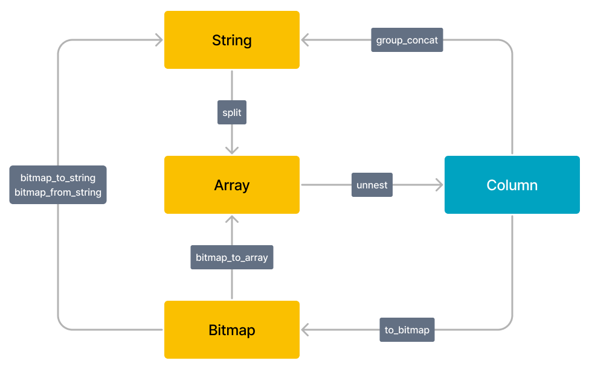

# Use Lateral Join for column-to-row conversion

Column-to-row conversion is a common operation in ETL processing. Lateral is a special Join keyword that can associate a row with an internal subquery or table function. By using Lateral in conjunction with unnest(), you can expand one row into multiple rows. For more information, see [unnest](../sql-reference/sql-functions/array-functions/unnest.md).

## Limits

* Currently, Lateral Join is only used with unnest() to achieve column-to-row conversion. Other table functions and UDTFs will be supported later.
* Currently, Lateral Join does not support subqueries.

## Use Lateral Join

Syntax:

~~~SQL
from table_reference join [lateral] table_reference;
~~~

Examples:

~~~SQL
SELECT student, score
FROM tests
CROSS JOIN LATERAL UNNEST(scores) AS t (score);

SELECT student, score
FROM tests, UNNEST(scores) AS t (score);
~~~

The second syntax here is a shortened version of the first one, where the Lateral keyword can be omitted using the UNNEST keyword. The UNNEST keyword is a table function that converts an array into multiple rows. Together with Lateral Join, it can implement common row expansion logic.

> **NOTE**
>
> If you want to perform unnest on multiple columns, you must specify an alias for each column, for example, `select v1, t1.unnest as v2, t2.unnest as v3 from lateral_test, unnest(v2) t1, unnest(v3) t2;`.

StarRocks supports type conversion among BITMAP, STRING, ARRAY, and Column.

## Usage examples

Together with unnest(), you can achieve the following column-to-row conversion features:

### Expand a string into multiple rows

1. Create a table and insert data into this table.

    ~~~SQL
    CREATE TABLE lateral_test2 (
        `v1` bigint(20) NULL COMMENT "",
        `v2` string NULL COMMENT ""
    )
    DUPLICATE KEY(v1)
    DISTRIBUTED BY HASH(`v1`) BUCKETS 1
    PROPERTIES (
        "replication_num" = "3",
        "storage_format" = "DEFAULT"
    );

    INSERT INTO lateral_test2 VALUES (1, "1,2,3"), (2, "1,3");
    ~~~

2. Query data before expansion.

    ~~~Plain Text
    select * from lateral_test2;

    +------+-------+
    | v1   | v2    |
    +------+-------+
    |    1 | 1,2,3 |
    |    2 | 1,3   |
    +------+-------+
    ~~~

3. Expand `v2` into multiple rows.

    ~~~Plain Text
    -- Perform unnest on a single column.

    select v1,unnest from lateral_test2, unnest(split(v2, ","));

    +------+--------+
    | v1   | unnest |
    +------+--------+
    |    1 | 1      |
    |    1 | 2      |
    |    1 | 3      |
    |    2 | 1      |
    |    2 | 3      |
    +------+--------+

    -- Perform unnest on multiple columns. You must specify an alias for each operation.

    select v1, t1.unnest as v2, t2.unnest as v3 from lateral_test2, unnest(split(v2, ",")) t1, unnest(split(v3, ",")) t2;

    +------+------+------+
    | v1   | v2   | v3   |
    +------+------+------+
    |    1 | 1    | 1    |
    |    1 | 1    | 2    |
    |    1 | 2    | 1    |
    |    1 | 2    | 2    |
    |    1 | 3    | 1    |
    |    1 | 3    | 2    |
    |    2 | 1    | 1    |
    |    2 | 1    | 3    |
    |    2 | 3    | 1    |
    |    2 | 3    | 3    |
    +------+------+------+
    ~~~

### Expand an array into multiple rows

 **From v2.5, unnest() can take multiple arrays of different types and lengths.** For more information, see [unnest()](../sql-reference/sql-functions/array-functions/unnest.md).

1. Create a table and insert data into this table.

    ~~~SQL
    CREATE TABLE lateral_test (
        `v1` bigint(20) NULL COMMENT "",
        `v2` ARRAY NULL COMMENT ""
    ) 
    DUPLICATE KEY(v1)
    DISTRIBUTED BY HASH(`v1`) BUCKETS 1
    PROPERTIES (
        "replication_num" = "3",
        "storage_format" = "DEFAULT"
    );

    INSERT INTO lateral_test VALUES (1, [1,2]), (2, [1, null, 3]), (3, null);
    ~~~

2. Query data before expansion.

    ~~~Plain Text
    select * from lateral_test;

    +------+------------+
    | v1   | v2         |
    +------+------------+
    |    1 | [1,2]      |
    |    2 | [1,null,3] |
    |    3 | NULL       |
    +------+------------+
    ~~~

3. Expand `v2` into multiple rows.

    ~~~Plain Text
    select v1,v2,unnest from lateral_test , unnest(v2) ;

    +------+------------+--------+
    | v1   | v2         | unnest |
    +------+------------+--------+
    |    1 | [1,2]      |      1 |
    |    1 | [1,2]      |      2 |
    |    2 | [1,null,3] |      1 |
    |    2 | [1,null,3] |   NULL |
    |    2 | [1,null,3] |      3 |
    +------+------------+--------+
    ~~~

### Expand Bitmap data

1. Create a table and insert data into this table.

    ~~~SQL
    CREATE TABLE lateral_test3 (
    `v1` bigint(20) NULL COMMENT "",
    `v2` Bitmap BITMAP_UNION COMMENT ""
    )
    AGGREGATE KEY(v1)
    DISTRIBUTED BY HASH(`v1`) BUCKETS 1;

    INSERT INTO lateral_test3 VALUES (1, bitmap_from_string('1, 2')), (2, to_bitmap(3));
    ~~~

2. Query data before expansion.

    ~~~Plain Text
    select v1, bitmap_to_string(v2) from lateral_test3;

    +------+------------------------+
    | v1   | bitmap_to_string(`v2`) |
    +------+------------------------+
    |    1 | 1,2                    |
    |    2 | 3                      |
    +------+------------------------+

3. Insert a new row.

    ~~~Plain Text
    insert into lateral_test3 values (1, to_bitmap(3));

    select v1, bitmap_to_string(v2) from lateral_test3;

    +------+------------------------+
    | v1   | bitmap_to_string(`v2`) |
    +------+------------------------+
    |    1 | 1,2,3                  |
    |    2 | 3                      |
    +------+------------------------+
    ~~~

4. Expand data in `v2` into multiple rows.

    ~~~Plain Text
    select v1,unnest from lateral_test3 , unnest(bitmap_to_array(v2));

    +------+--------+
    | v1   | unnest |
    +------+--------+
    |    1 |      1 |
    |    1 |      2 |
    |    1 |      3 |
    |    2 |      3 |
    +------+--------+
    ~~~
