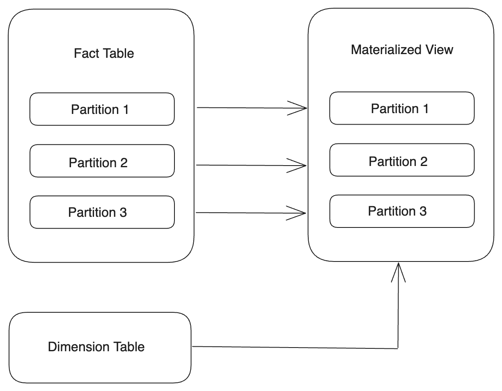
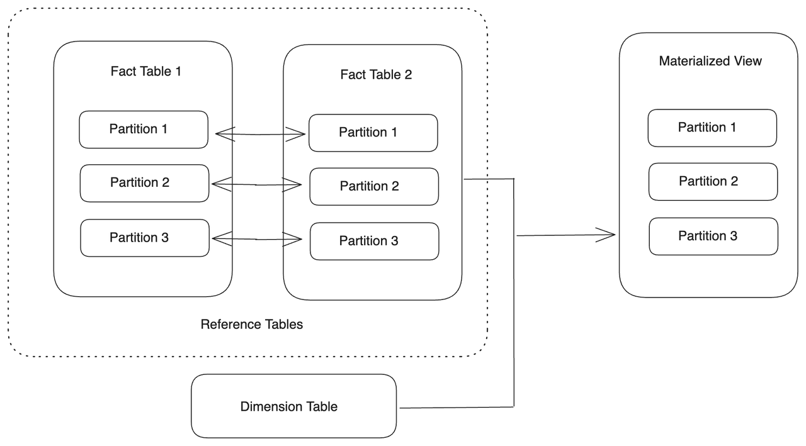

# Create a partitioned materialized view

This topic introduces how to create a partitioned materialized view to accommodate different use cases.

## Overview

StarRocks' asynchronous materialized views support a variety of partitioning strategies and functions that allow you to achieve the following effects:

- **Incremental construction**

  When creating a partitioned materialized view, you can set the creation task to refresh partitions in batches to avoid excessive resource consumption.

- **Incremental refresh**

  You can set the refresh task to update only the corresponding partitions of the materialized view when it detects data changes in certain partitions of the base table. Partition-level refresh can significantly prevent the waste of resources used to refresh the entire materialized view.

- **Partial materialization**

  You can set TTL for materialized view partitions, allowing for partial materialization of the data.

- **Transparent query rewrite**

  Queries can be rewritten transparently based on only those updated materialized view partitions. Partitions that are deemed outdated will not be involved in the query plan, and the query will be executed on the base tables to guarantee the consistency of data.

## Limitations

A partitioned materialized view can be created only on a partitioned base table (usually a fact table). Only by mapping the partition relationship between the base table and the materialized view can you build the synergy between them.

Currently, StarRocks supports building partitioned materialized views on tables from the following data sources:

- **StarRocks OLAP tables in the default catalog**
  - Supported partitioning strategy: Range partitioning
  - Supported data types for Partitioning Key: INT, DATE, DATETIME, and STRING
  - Supported table types: Primary Key, Duplicate Key, Aggregate Key, and Unique Key
  - Supported both in shared-nothing cluster and shared-data cluster
- **Tables in Hive Catalog, Hudi Catalog, Iceberg Catalog, and Paimon Catalog**
  - Supported partitioning level: Primary level
  - Supported data types for Partitioning Key: INT, DATE, DATETIME, and STRING

:::note

- You cannot create a partitioned materialized view based on a non-partitioned base (fact) table.
- For StarRocks OLAP tables:
  - Currently, list partitioning and expression partitioning are not supported.
  - The two adjacent partitions of the base table must have consecutive ranges.
- For multi-level partitioned base tables in external catalogs, only the primary level partitioning path can be used to create a partitioned materialized view. For example,  for a table partitioned in the `yyyyMMdd/hour` format, you can only build the materialized view partitioned by `yyyyMMdd`.
- From v3.2.3, StarRocks supports creating partitioned materialized views upon Iceberg tables with [Partition Transforms](https://iceberg.apache.org/spec/#partition-transforms), and the materialized views are partitioned by the column after the transformation. For more information, see [Data lake query acceleration with materialized views - Choose a suitable refresh strategy](./data_lake_query_acceleration_with_materialized_views.md#choose-a-suitable-refresh-strategy).

:::

## Use cases

Suppose there are base tables as follows:

```SQL
CREATE TABLE IF NOT EXISTS par_tbl1 (
  datekey      DATE,       -- DATE type date column used as the Partitioning Key.
  k1           STRING,
  v1           INT,
  v2           INT
)
ENGINE=olap
PARTITION BY RANGE (datekey) (
  START ("2021-01-01") END ("2021-01-04") EVERY (INTERVAL 1 DAY)
)
DISTRIBUTED BY HASH(k1);

CREATE TABLE IF NOT EXISTS par_tbl2 (
  datekey      STRING,     -- STRING type date column used as the Partitioning Key.
  k1           STRING,
  v1           INT,
  v2           INT
)
ENGINE=olap
PARTITION BY RANGE (str2date(datekey, '%Y-%m-%d')) (
  START ("2021-01-01") END ("2021-01-04") EVERY (INTERVAL 1 DAY)
)
DISTRIBUTED BY HASH(k1);

CREATE TABLE IF NOT EXISTS par_tbl3 (
  datekey_new  DATE,       -- Equivalent column with par_tbl1.datekey.
  k1           STRING,
  v1           INT,
  v2           INT
)
ENGINE=olap
PARTITION BY RANGE (datekey_new) (
  START ("2021-01-01") END ("2021-01-04") EVERY (INTERVAL 1 DAY)
)
DISTRIBUTED BY HASH(k1);
```

### Align partitions one-to-one

You can create a materialized view whose partitions correspond to the partitions of the base table one-to-one by using the same Partitioning Key.



- If the Partitioning Key of the base table is the DATE or DATETIME type, you can directly specify the same Partitioning Key for the materialized view.

  ```SQL
  PARTITION BY <base_table_partitioning_column>
  ```

  Example:

  ```SQL
  CREATE MATERIALIZED VIEW par_mv1
  REFRESH ASYNC
  PARTITION BY datekey
  AS 
  SELECT 
    k1, 
    sum(v1) AS SUM, 
    datekey 
  FROM par_tbl1 
  GROUP BY datekey, k1;
  ```

- If the Partitioning Key of the base table is the STRING type, you can use the [str2date](../sql-reference/sql-functions/date-time-functions/str2date.md) function to convert the date string into the DATE or DATETIME type.

  ```SQL
  PARTITION BY str2date(<base_table_partitioning_column>, <format>)
  ```

  Example:

  ```SQL
  CREATE MATERIALIZED VIEW par_mv2
  REFRESH ASYNC
  PARTITION BY str2date(datekey, '%Y-%m-%d')
  AS 
  SELECT 
    k1, 
    sum(v1) AS SUM, 
    datekey 
  FROM par_tbl2 
  GROUP BY datekey, k1;
  ```

### Align partitions with time granularity rollup

You can create a materialized view whose partitioning granularity is larger than that of the base table by using the [date_trunc](../sql-reference/sql-functions/date-time-functions/date_trunc.md) function on the Partitioning Key. When data changes are detected in the partitions of the base table, StarRocks refreshes the corresponding rollup partitions in the materialized view.


- If the Partitioning Key of the base table is the DATE or DATETIME type, you can directly use the date_trunc function on the Partitioning Key of the base table.

  ```SQL
  PARTITION BY date_trunc(<format>, <base_table_partitioning_column>)
  ```

  Example:

  ```SQL
  CREATE MATERIALIZED VIEW par_mv3
  REFRESH ASYNC
  PARTITION BY date_trunc('month', datekey)
  AS 
  SELECT 
    k1, 
    sum(v1) AS SUM, 
    datekey 
  FROM par_tbl1 
  GROUP BY datekey, k1;
  ```

- If the Partitioning Key of the base table is the STRING type, you must convert the Partitioning Key of the base table into the DATE or DATETIME type in the SELECT list, set an alias for it, and use it in the date_trunc function to specify the Partitioning Key of the materialized view.

  ```SQL
  PARTITION BY 
  date_trunc(<format>, <mv_partitioning_column>)
  AS
  SELECT 
    str2date(<base_table_partitioning_column>, <format>) AS <mv_partitioning_column>
  ```

  Example:

  ```SQL
  CREATE MATERIALIZED VIEW par_mv4
  REFRESH ASYNC
  PARTITION BY date_trunc('month', mv_datekey)
  AS 
  SELECT 
    datekey,
    k1, 
    sum(v1) AS SUM, 
    str2date(datekey, '%Y-%m-%d') AS mv_datekey
  FROM par_tbl2 
  GROUP BY datekey, k1;
  ```

### Align partitions at a customized time granularity

The partition rollup method mentioned above only allows partitioning the materialized view based on specific time granularities and does not permit customizing the partition time range. If your business scenario requires partitioning using a customized time granularity, you can create a materialized view and define the time granularity for its partitions by using the date_trunc function with the [time_slice](../sql-reference/sql-functions/date-time-functions/time_slice.md) or [date_slice](../sql-reference/sql-functions/date-time-functions/date_slice.md) function, which can convert a given time into the beginning or end of a time interval based on the specified time granularity.

You need to define the new time granularity (interval) by using the time_slice or date_slice function on the Partitioning Key of the base table in the SELECT list, set an alias for it, and use it in the date_trunc function to specify the Partitioning Key of the materialized view.

```SQL
PARTITION BY
date_trunc(<format>, <mv_partitioning_column>)
AS
SELECT 
  -- You can use time_slice or date_slice.
  date_slice(<base_table_partitioning_column>, <interval>) AS <mv_partitioning_column>
```

Example:

```SQL
CREATE MATERIALIZED VIEW par_mv5
REFRESH ASYNC
PARTITION BY date_trunc('day', mv_datekey)
AS 
SELECT 
  k1, 
  sum(v1) AS SUM, 
  time_slice(datekey, INTERVAL 5 MINUTE) AS mv_datekey 
FROM par_tbl1 
GROUP BY datekey, k1;
```

### Align partitions with multiple base tables



You can create a materialized view whose partitions are aligned with those of multiple base tables, as long as the partitions of the base tables can align with each other, that is, the base tables use the same type of Partitioning Key. You can use JOIN to connect the base tables, and set the Partition Key as the common column. Alternatively, you can connect them with UNION. The base tables with aligned partitions are called reference tables. Data changes in any of the reference tables will trigger the refresh task on the corresponding partitions of the materialized view.

This feature is supported from v3.3 onwards.

```SQL
-- Connect tables with JOIN.
CREATE MATERIALIZED VIEW par_mv6
REFRESH ASYNC
PARTITION BY datekey
AS SELECT 
  par_tbl1.datekey,
  par_tbl1.k1 AS t1k1,
  par_tbl3.k1 AS t2k1, 
  sum(par_tbl1.v1) AS SUM1, 
  sum(par_tbl3.v1) AS SUM2
FROM par_tbl1 JOIN par_tbl3 ON par_tbl1.datekey = par_tbl3.datekey_new
GROUP BY par_tbl1.datekey, t1k1, t2k1;

-- Connect tables with UNION.
CREATE MATERIALIZED VIEW par_mv7
REFRESH ASYNC
PARTITION BY datekey
AS SELECT 
  par_tbl1.datekey,
  par_tbl1.k1 AS t1k1,
  sum(par_tbl1.v1) AS SUM1
FROM par_tbl1
GROUP BY 
  par_tbl1.datekey,
  par_tbl1.k1
UNION ALL
SELECT
  par_tbl3.datekey_new,
  par_tbl3.k1 AS t2k1, 
  sum(par_tbl3.v1) AS SUM2
FROM par_tbl3
GROUP BY 
  par_tbl3.datekey_new,
  par_tbl3.k1;
```

### Achieve incremental refresh and transparent rewrite

You can create a partitioned materialized view that refreshes by partitions to achieve incremental updates of the materialized view and transparent rewrite of queries with partial data materialization.

To achieve these goals, you must consider the following aspects when creating a materialized view:

- **Refresh granularity**

  You can use the property `partition_refresh_number` to specify the granularity of each refresh operation. `partition_refresh_number` controls the maximum number of partitions to be refreshed in a refresh task when a refresh is triggered. If the number of partitions to be refreshed exceeds this value, StarRocks will split the refresh task and complete it in batches. The partitions are refreshed in chronological order from the least recent partition to the most recent partition (excluding partitions created dynamically for the future). The default value of `partition_refresh_number` is `-1`, indicating the refresh task will not be split.

- **Materialization scope**

  The scope of the materialized data is controlled by the properties `partition_ttl_number` (for versions earlier than v3.1.5) or `partition_ttl` (recommended for v3.1.5 and later). `partition_ttl_number` specifies the number of the most recent partitions to retain, and `partition_ttl` specifies the time range of the materialized view data to retain. During each refresh, StarRocks arranges the partitions in chronological order, and retains only those who satisfy the TTL requirements.

- **Refresh strategy**

  - Materialized views with automatic refresh strategies (`REFRESH ASYNC`) are automatically refreshed each time the base table data changes.
  - Materialized views with regular refresh strategies (`REFRESH ASYNC [START (<start_time>)] EVERY (INTERVAL <interval>)`) are refreshed regularly at the interval defined.

  :::note

  Materialized views with automatic refresh strategies and regular refresh strategies are refreshed automatically once the refresh tasks are triggered. StarRocks records and compares the data versions of each partition of the base table. A change in the data version indicates a data change in the partition. Once StarRocks detects a data change in the partition of the base table, it refreshes the corresponding partition of the materialized view. When no data changes are detected on the base table partition, the refresh for the corresponding materialized view partition is skipped.

  :::

  - Materialized views with manual refresh strategies (`REFRESH MANUAL`) can be refreshed only by manually executing the REFRESH MATERIALIZED VIEW statement. You can specify the time range of the partitions to be refreshed to avoid refreshing the whole materialized view. If you specify `FORCE` in the statement, StarRocks forcibly refreshes the corresponding materialized view or partitions regardless of whether the data in the base table is changed. By adding `WITH SYNC MODE` to the statement, you can make a synchronous call of the refresh task, and StarRocks returns the task result only when the task succeeds or fails.

The following example creates a partitioned materialized view `par_mv8`. If StarRocks detects data changes in a partition of the base table, it refreshes the corresponding partition in the materialized view. A refresh task is split into batches, each of which only refreshes one partition (`"partition_refresh_number" = "1"`). Only two most recent partitions are retained (`"partition_ttl_number" = "2"`), the others are deleted during the refresh.

```SQL
CREATE MATERIALIZED VIEW par_mv8
REFRESH ASYNC
PARTITION BY datekey
PROPERTIES(
  "partition_ttl_number" = "2",
  "partition_refresh_number" = "1"
)
AS 
SELECT 
  k1, 
  sum(v1) AS SUM, 
  datekey 
FROM par_tbl1 
GROUP BY datekey, k1;
```

You can use the REFRESH MATERIALIZED VIEW statement to refresh this materialized view. The following example makes a synchronous call to forcibly refresh some partitions of `par_mv8` within a certain time range.

```SQL
REFRESH MATERIALIZED VIEW par_mv8
PARTITION START ("2021-01-03") END ("2021-01-04")
FORCE WITH SYNC MODE;
```

Output:

```Plain
+--------------------------------------+
| QUERY_ID                             |
+--------------------------------------+
| 1d1c24b8-bf4b-11ee-a3cf-00163e0e23c9 |
+--------------------------------------+
1 row in set (1.12 sec)
```

With the TTL feature, only some of the partitions are retained in `par_mv8`. You have thus achieved the materialization of partial data, which is important in scenarios where most queries are against the recent data. The TTL feature allows you to transparently accelerate queries on new data (for example, within a week or month) with the materialized view while significantly saving storage costs. Queries that do not fall into this time range are routed to the base table.

In the following example, Query 1 will be accelerated by the materialized view because it hits the partition that is retained in `par_mv8`, while Query 2 will be routed to the base table because it does not fall into the time range where the partitions are retained.

```SQL
-- Query 1
SELECT 
  k1, 
  sum(v1) AS SUM, 
  datekey 
FROM par_tbl1
WHERE datekey='2021-01-04'
GROUP BY datekey, k1;

-- Query 2
SELECT 
  k1, 
  sum(v1) AS SUM, 
  datekey 
FROM par_tbl1
WHERE datekey='2021-01-01'
GROUP BY datekey, k1;
```


