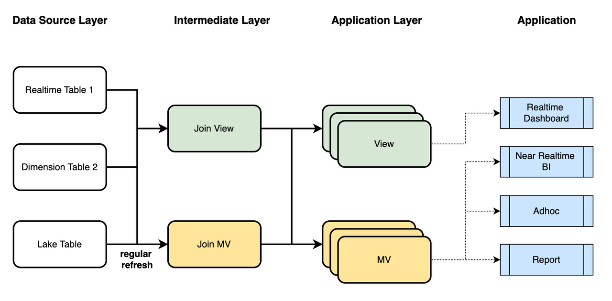
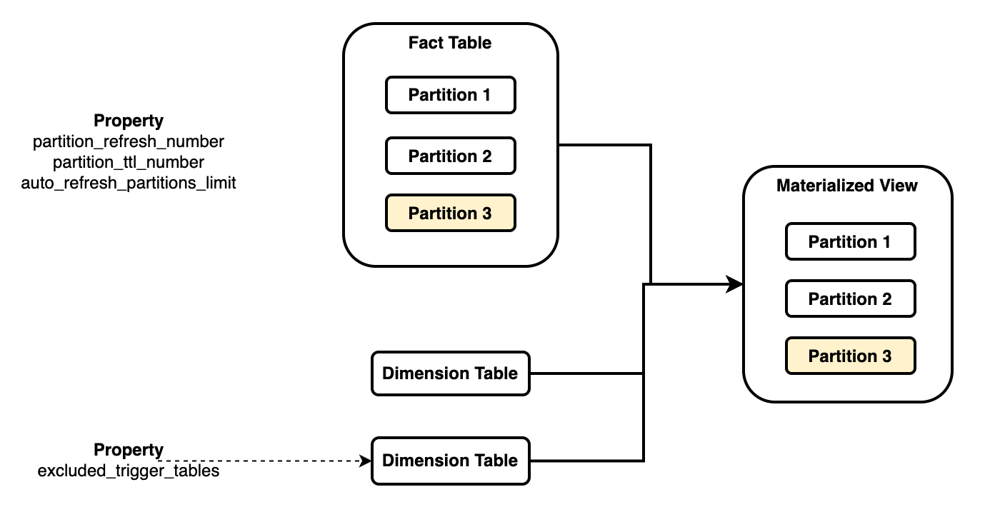

# Data modeling with materialized views

This topic describes how to perform data modeling with the help of StarRocks' asynchronous materialized views. By doing so, you can greatly simplify the ETL pipeline of your data warehouses, and significantly improve data quality and query performance.

## Overview

Data modeling is the process of cleaning, layering, aggregating, and associating data with rational methodologies. It can create a comprehensible representation of the raw data that is too rough, too complicated, or too costly to analyze directly, and provide actionable insights into the data.

However, the common challenge in real-world data modeling is that the modeling process struggles to keep up with the pace of business development, and it is difficult to measure the return on investment for data modeling efforts. Despite the fact that the modeling methodologies are simple, business experts are required to have a solid background in data organization and governance, which is a complex process. In the early stages of business, decision-makers rarely spare sufficient resources for data modeling, and it is challenging to see the value that data modeling can bring. Moreover, business models can change rapidly, and the modeling methodologies themselves need iteration and evolution. Therefore, many data analysts tend to avoid modeling and use raw data directly, thus inevitably leading to issues of data quality and query performance. When the need for modeling arises, it becomes difficult to restructure data analytics patterns that have already been established to match those of the data models.

Using materialized views for data modeling can effectively address these problems. StarRocks' asynchronous materialized views can:

- **Simplify the  data warehouse  architecture**: Because StarRocks can provide a one-stop data governance experience, you do not need to maintain other data processing systems, saving the human and system resources spent on them.
- **Ease the data modeling experience**: Any data analyst with only basic SQL knowledge is capable of data modeling with StarRocks. Data modeling is no longer the exclusive province of experienced data engineers.
- **Reduce maintenance complexity**: StarRocks' asynchronous materialized views can automatically manage the lineage relationships and dependencies across data layers, eliminating the need for an entire data platform to handle this task.



In real-world situations, you can perform data modeling by combining the usage of StarRocks' views (logical views) and asynchronous materialized views as follows:

1. Use views to associate real-time data with dimension data, and use materialized views to associate historical data from the data lake with dimension data. Perform necessary data cleaning and semantic mapping to obtain the detail data for the Intermediate Layer, which reflects the semantics required in your business scenarios.
2. In the Application Layer, perform data Join, Aggregation, Union, and Window calculations tailored to different business scenarios. This will yield views for real-time pipelines and materialized views for near-real-time pipelines.
3. On the Application side, choose an appropriate Analytical Data Store (ADS) for query analysis based on your timeliness and performance requirements. These ADS can serve real-time dashboards, near-real-time BI, ad-hoc queries, and scheduled reports.

During this process, you will leverage several built-in capabilities of StarRocks, which will be elaborated in the following section.

## Capabilities of asynchronous materialized view

StarRocks' asynchronous materialized view possesses the following atomic functions that can aid in data modeling:

- **Automatic refresh**: After data is loaded into base tables, materialized views can be automatically refreshed. You do not need to maintain a scheduling task externally.
- **Partitioned refresh**: Near-real-time calculations can be achieved through the partitioned refresh of the materialized views built on tables featuring time series.
- **Synergy with views**: You can achieve multi-layer modeling by using materialized views and logical views, thus enabling the reuse of the Intermediate Layer and simplification of data models.
- **Schema change**: You can alter the calculation results through simple SQL statements, without the need to modify the complex data pipelines.

With these features, you can design comprehensive and adaptable data models to meet various business needs and scenarios.

### Automatic refresh

When creating an asynchronous materialized view, you can specify the refresh strategy using the REFRESH clause. Currently, StarRocks supports the following refresh strategies of asynchronous materialized views:

- **Automatic Refresh** (`REFRESH ASYNC`): Refresh tasks are triggered each time data in the base tables changes. Data dependencies are automatically managed by the materialized view.
- **Scheduled Refresh** (`REFRESH ASYNC EVERY (INTERVAL <refresh_interval>)`): Refresh tasks are triggered at regular intervals, for example, every minute, day, or month. If there are no data changes in the base tables, the refresh task will not be triggered.
- **Manual Refresh** (`REFRESH MANUAL`): Refresh tasks are triggered only by executing REFRESH MATERIALIZED VIEW manually. This refresh strategy can be used when you maintain an external scheduling framework to trigger refresh tasks.

Syntax:

```SQL
CREATE MATERIALIZED VIEW <name>
REFRESH 
    [ ASYNC | 
      ASYNC [START <time>] EVERY(<interval>) | 
      MANUAL
    ]
AS <query>
```

### Partitioned refresh

When creating an asynchronous materialized view, you can specify the PARTITION BY clause to associate the partitions of the base table with those of the materialized view, thus achieving partition-level refresh.

- `PARTITION BY <column>`: You can reference the same partitioning column for the base table and the materialized view. As a result, the base table and the materialized view are partitioned on the same granularity.
- `PARTITION BY date_trunc(<column>)`: You can use the date_trunc function to assign a different partition strategy (on the level of granularity) for the materialized view by truncating the time unit.
- `PARTITION BY { time_slice | date_slice }(<column>)`: In comparison to date_trunc, time_slice and date_slice offer more flexible time granularity adjustments, allowing for finer control over partitioning based on time.

Syntax:

```SQL
CREATE MATERIALIZED VIEW <name>
REFRESH ASYNC
PARTITION BY 
    [
        <base_table_column> | 
        date_trunc(<granularity>, <base_table_column>) |
        time_slice(<base_table_column>, <granularity>) | 
        date_slice(<base_table_column>, <granularity>)
    ]
AS <query>
```

### Synergy with views

- Materialized views can be created based on views. In this case, when the base tables referenced by the view undergo data changes, the materialized view can be automatically refreshed.
- You can also create materialized views based on other materialized views, enabling multi-level cascading refresh mechanisms.
- Views can be created based on materialized views, which are equivalent to regular tables.

### Schema change

- You can perform an atomic exchange between two asynchronous materialized views using the ALTER MATERIALIZED VIEW SWAP statement. This allows you to create a new materialized view with added columns or changed column types and then replace the old one with it.
- The definition of views can be directly modified using the ALTER VIEW statement.
- Regular tables in StarRocks can be modified using either SWAP or ALTER operations.
- Furthermore, when there are changes in the base tables (which can be materialized views, views, or regular tables), it triggers cascading changes in the corresponding materialized views.

## Layered modeling

In many real-world business scenarios, there are various forms of data sources, including real-time detail data, dimension data, and historical data from data lakes. On the other hand, business requirements call for diverse analytical methods, such as real-time dashboards, near-real-time BI queries, ad-hoc queries, and scheduled reports. Different scenarios have different demands - some require flexibility, some prioritize performance, while others emphasize cost-effectiveness.

Clearly, a single solution cannot adequately address such versatile demands. StarRocks can efficiently address these needs by combining the usage of views and materialized views. Because views maintain no physical data, each time a view is queried, the query is parsed and executed according to the definition of the view. In comparison, materialized views, which hold the pre-computed results, can prevent the overhead of repetitive execution. Views are suitable for expressing business semantics and simplifying SQL complexity, but they cannot reduce the costs of query execution. Materialized Views, on the other hand, optimize the query performance through pre-computation and are suitable for streamlining ETL pipelines.

Below is a summary of the differences between views and materialized views:

|                                      | **View**                                                     | **Materialized view**                                        |
| ------------------------------------ | ------------------------------------------------------------ | ------------------------------------------------------------ |
| **Use cases**                        | Business modeling, data governance                           | Data modeling, transparent acceleration, data lake integration |
| **Storage cost**                     | No storage cost                                              | Storage cost incurred by storing pre-computed results        |
| **Update cost**                      | No update cost                                               | Refresh cost incurred when base table data updates           |
| **Performance benefits**             | No performance benefit                                       | Query acceleration introduced by reusing pre-computes results |
| **Data  real-time  attribute** | The latest data is returned because queries against views are computed in real-time. | Data may not be up-to-date because results are pre-computed. |
| **Dependency**                       | Views become invalid if base table names are changed because they reference base tables by name. | Changes of base table names do not affect the availability of the materialized views, which reference base tables by ID. |
| **Creation  Syntax**              | CREATE VIEW                                                  | CREATE MATERIALIZED VIEW                                     |
| **Modification  Syntax**          | ALTER VIEW                                                   | ALTER MATERIALIZED VIEW                                      |

You can use the following statements to modify your views, materialized views, and base tables:

```SQL
-- Modify a table.
ALTER TABLE <table_name> ADD COLUMN <column_desc>;

-- Swap two tables.
ALTER TABLE <table1> SWAP WITH <table2>;

-- Modify the definition of a view.
ALTER VIEW <view_name> AS <query>;

-- Swap two materialized views 
-- (by swapping the name of the two materialized views without affecting the data within).
ALTER MATERIALIZED VIEW <mv1> SWAP WITH <mv2>;

-- Re-activate a materialized view.
ALTER MATERIALIZED VIEW <mv_name> ACTIVE;
```

Schema changes follow these principles:

- Rename and Swap operations on a table will set the dependent materialized views inactive. For Schema Change operations, the dependent materialized views are set inactive only when Schema Change operations are performed on the base table columns referenced by the materialized views.
- If you change the definition of a view, the dependent materialized views are set to inactive.
- If a materialized view is swapped, any nested materialized views built on it are set to inactive.
- The inactive status cascades upwards until there are no materialized view dependencies.
- Inactive materialized views cannot be refreshed or used for automatic query rewrite.
- Inactive materialized views can still be queried directly, but data consistency is not guaranteed until they are active again.

Whereas the data consistency of inactive materialized views cannot be guaranteed, you can restore the functionality of them using the following methods:

- **Manual activation**: You can manually repair an inactive materialized view by executing `ALTER MATERIALIZED VIEW <mv_name> ACTIVE`. This statement will recreate the materialized view based on its original SQL definition. Please note that the SQL definition must still be valid after the underlying schema changes. Otherwise, the operation will fail.
- **Activation before refresh**: StarRocks will attempt to activate the inactive materialized view before refreshing it.
- **Automatic Activation**: StarRocks will attempt to automatically activate the inactive materialized views. However, the timeliness of this process cannot be guaranteed. You can disable this feature by executing `ADMIN SET FRONTEND CONFIG('enable_mv_automatic_active_check'='false')`. This feature is available from v3.1.4 and v3.2.0 onwards.

## Partitioned modeling

In addition to layered modeling, partitioned modeling is also an essential aspect of data modeling. Data modeling often involves associating data based on business semantics and setting data's Time-To-Live (TTL) as per timeliness requirements. Partitioned modeling plays a significant role in this process.

Partitioned modeling is an essential aspect of data modeling, complementing layered modeling. It involves associating data based on business semantics and setting Time-To-Live (TTL) for data as per timeliness requirements. Data partitioning plays a significant role in this process.

Different ways of associating data give rise to various modeling approaches, such as star schemas and snowflake schemas. These models have something in common - they all use fact tables and dimension tables. Some business scenarios require multiple large fact tables, while others deal with complex dimension tables and the relationships among them. StarRocks' materialized views support partition association for fact tables, meaning that the fact table is partitioned, and the materialized view's join results are partitioned in the same way.



As the above figure shows, a materialized view associates a fact table with multiple dimension tables:

- You need to reference the partition key of a specific base table (usually the fact table) as the materialized view's partitioning key (`PARTITION BY fact_tbl.col`) to associate their partitioning strategies. Each materialized view can only be associated with one base table.
- When the data in a partition of the referenced table changes, the corresponding partition in the materialized view is refreshed without affecting other partitions.
- When the data in the non-referenced tables changes, the entire materialized view is refreshed by default. However, you can choose to ignore the data changes in certain non-referenced base tables so that the materialized view will not be refreshed when data in these tables changes.

Such partition association supports various business scenarios:

- **Fact table updates**: You can partition the fact table at a fine-grained level, such as daily or hourly. After the fact table is updated, the corresponding partitions in the materialized view are automatically refreshed.
- **Dimension  table updates**: Usually, data updates in dimension tables will lead to the refresh of all associated results, which can be costly. You can choose to ignore the data updates in some dimension tables to avoid refreshing the entire materialized view, or you can specify a time range so that only the partitions within the time range can be refreshed.
- **External table automatic refresh**: In external data sources like Apache Hive or Apache Iceberg, data changes at the partition level. StarRocks' materialized views can subscribe to changes in external catalogs at the partition level, and only refresh the corresponding partition of the materialized view.
- **TTL**: When setting the partitioning strategy for a materialized view, you can set the number of recent partitions to retain, thus keeping only the most recent data. This is useful in business scenarios when analysts only query up-to-date data from a certain window of time, and they do not need to retain all the historical data.

Several parameters can be used to control refresh behavior:

- `partition_refresh_number`: the number of partitions to refresh in each refresh operation.
- `partition_ttl_number`: the number of recent partitions to retain.
- `excluded_trigger_tables`: the table whose data changes can be ignored to avoid triggering the automatic refresh.
- `auto_refresh_partitions_limit`: the number of partitions to refresh in each automatic refresh operation.

For more information, see [CREATE MATERIALIZED VIEW](../sql-reference/sql-statements/materialized_view/CREATE_MATERIALIZED_VIEW.md).

Currently, partitioned materialized views have the following limitations:

- You can only build a partitioned materialized view based on a partitioned table.
- You can only use the DATE or DATETIME type columns as the partitioning key. The STRING data type is not supported.
- You can only perform partition roll-up using the date_trunc, time_slice, and date_slice functions.
- You can only specify a single column as the partitioning key. Multiple partitioning columns are not supported.

## Summary

Utilizing StarRocks' asynchronous materialized views for data modeling offers the advantage of simplifying pipeline management and enhancing the efficiency and flexibility of data modeling through a declarative modeling language.

Apart from the data modeling, StarRocks' asynchronous materialized views find application in various scenarios involving transparent acceleration and data lake integration. This facilitates further exploration of data value and improves data efficiency.
