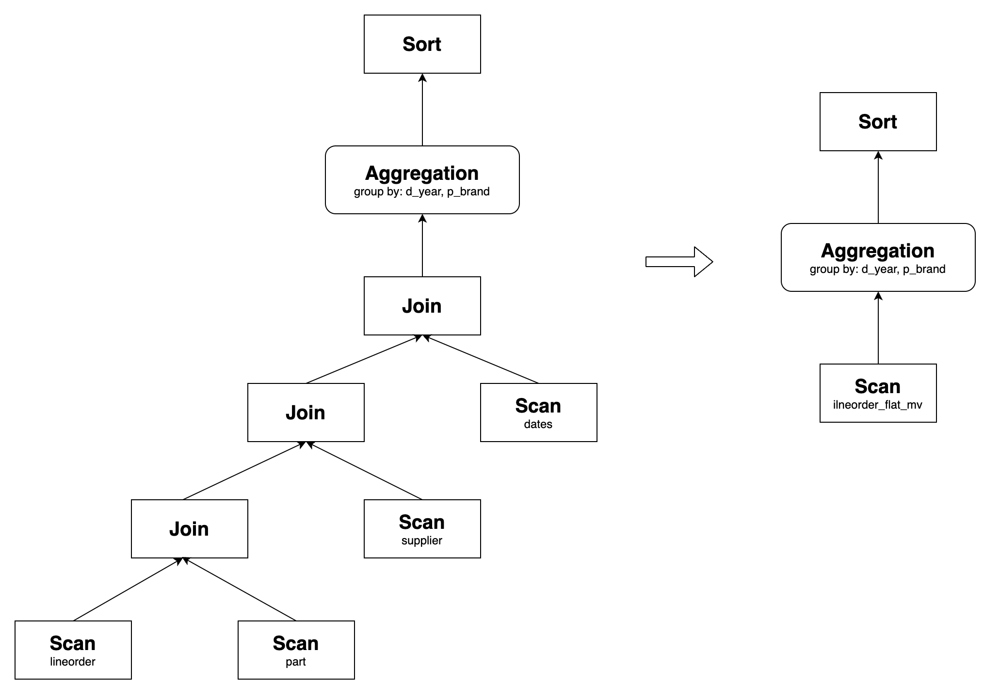

# Query rewrite with materialized views

This topic describes how to leverage StarRocks' asynchronous materialized views to rewrite and accelerate queries.

## Overview

StarRocks' asynchronous materialized view uses a widely adopted transparent query rewrite algorithm based on the SPJG (select-project-join-group-by) form. Without the need to modify the query statement, StarRocks can automatically rewrite queries against the base tables into queries against the corresponding materialized view that contains the pre-computed results. As a result, materialized views can help you significantly reduce computational costs, and substantially accelerate query execution.

The query rewrite feature based on asynchronous materialized views is particularly useful in the following scenarios:

- **Pre-aggregation of metrics**

  You can use materialized views to create a pre-aggregated metric layer if you are dealing with a high dimensionality of data.

- **Joins of wide tables**

  Materialized views allow you to transparently accelerate queries with joins of multiple large wide tables in complex scenarios.

- **Query acceleration in the data lake**

  Building an external catalog-based materialized view can easily accelerate queries against data in your data lake.

  > **NOTE**
  >
  > Asynchronous materialized views created on base tables in a JDBC catalog do not support query rewrite.

### Features

StarRocks' asynchronous materialized view-based automatic query rewrite features the following attributes:

- **Strong data consistency**: If the base tables are native tables, StarRocks ensures that the results obtained through the materialized view-based query rewrite are consistent with the results returned from the direct query against the base tables.
- **Staleness rewrite**: StarRocks supports staleness rewrite, allowing you to tolerate a certain level of data expiration to cope with scenarios with frequent data changes.
- **Multi-table joins**: StarRocks' asynchronous materialized view supports various types of joins, including some complex join scenarios like View Delta Joins and Derivable Joins, allowing you to accelerate queries in scenarios involving large wide tables.
- **Aggregation rewrite**: StarRocks can rewrite queries with aggregations to improve report performance.
- **Nested materialized view**: StarRocks supports rewriting complex queries based on nested materialized views, expanding the scope of queries that can be rewritten.
- **Union rewrite**: You can combine the Union rewrite feature with the TTL (Time-to-Live) of the materialized view's partitions to achieve the separation of the hot and cold data, which allows you to query hot data from materialized views and historical data from the base table.
- **Materialized views on views**: You can accelerate the queries in scenarios with data modeling based on views.
- **Materialized views on external catalogs**: You can accelerate queries in data lakes.
- **Complex expression rewrite**: It can handle complex expressions, including function calls and arithmetic operations, catering to advanced analytical and calculation requirements.

These features will be elaborated in the following sections.

## Join rewrite

StarRocks supports rewriting queries with various types of joins, including Inner Join, Cross Join, Left Outer Join, Full Outer Join, Right Outer Join, Semi Join, and Anti Join.

The following is an example of rewriting queries with joins. Create two base tables as follows:

```SQL
CREATE TABLE customer (
  c_custkey     INT(11)     NOT NULL,
  c_name        VARCHAR(26) NOT NULL,
  c_address     VARCHAR(41) NOT NULL,
  c_city        VARCHAR(11) NOT NULL,
  c_nation      VARCHAR(16) NOT NULL,
  c_region      VARCHAR(13) NOT NULL,
  c_phone       VARCHAR(16) NOT NULL,
  c_mktsegment  VARCHAR(11) NOT NULL
) ENGINE=OLAP
DUPLICATE KEY(c_custkey)
DISTRIBUTED BY HASH(c_custkey) BUCKETS 12;

CREATE TABLE lineorder (
  lo_orderkey         INT(11) NOT NULL,
  lo_linenumber       INT(11) NOT NULL,
  lo_custkey          INT(11) NOT NULL,
  lo_partkey          INT(11) NOT NULL,
  lo_suppkey          INT(11) NOT NULL,
  lo_orderdate        INT(11) NOT NULL,
  lo_orderpriority    VARCHAR(16) NOT NULL,
  lo_shippriority     INT(11) NOT NULL,
  lo_quantity         INT(11) NOT NULL,
  lo_extendedprice    INT(11) NOT NULL,
  lo_ordtotalprice    INT(11) NOT NULL,
  lo_discount         INT(11) NOT NULL,
  lo_revenue          INT(11) NOT NULL,
  lo_supplycost       INT(11) NOT NULL,
  lo_tax              INT(11) NOT NULL,
  lo_commitdate       INT(11) NOT NULL,
  lo_shipmode         VARCHAR(11) NOT NULL
) ENGINE=OLAP
DUPLICATE KEY(lo_orderkey)
DISTRIBUTED BY HASH(lo_orderkey) BUCKETS 48;
```

With the above base tables, you can create a materialized view as follows:

```SQL
CREATE MATERIALIZED VIEW join_mv1
DISTRIBUTED BY HASH(lo_orderkey)
AS
SELECT lo_orderkey, lo_linenumber, lo_revenue, lo_partkey, c_name, c_address
FROM lineorder INNER JOIN customer
ON lo_custkey = c_custkey;
```

Such a materialized view can rewrite the following query:

```SQL
SELECT lo_orderkey, lo_linenumber, lo_revenue, c_name, c_address
FROM lineorder INNER JOIN customer
ON lo_custkey = c_custkey;
```


StarRocks supports rewriting join queries with complex expressions, such as arithmetic operations, string functions, date functions, CASE WHEN expressions, and OR predicates. For example, the above materialized view can rewrite the following query:

```SQL
SELECT 
    lo_orderkey, 
    lo_linenumber, 
    (2 * lo_revenue + 1) * lo_linenumber, 
    upper(c_name), 
    substr(c_address, 3)
FROM lineorder INNER JOIN customer
ON lo_custkey = c_custkey;
```

In addition to the conventional scenario, StarRocks further supports rewriting join queries in more complicated scenarios.

### Query Delta Join rewrite

Query Delta Join refers to a scenario in which the tables joined in a query are a superset of the tables joined in a materialized view. For instance, consider the following query that involves joins of three tables: `lineorder`, `customer`, and `part`. If the materialized view `join_mv1` contains only the join of `lineorder` and `customer`, StarRocks can rewrite the query using `join_mv1`.

Example:

```SQL
SELECT lo_orderkey, lo_linenumber, lo_revenue, c_name, c_address, p_name
FROM
    lineorder INNER JOIN customer ON lo_custkey = c_custkey
    INNER JOIN part ON lo_partkey = p_partkey;
```

Its original query plan and the one after the rewrite are as follows:


### View Delta Join rewrite

View Delta Join refers to a scenario in which the tables joined in a query are a subset of the tables joined in a materialized view. This feature is typically used in scenarios involving large wide tables. For example, in the context of the Star Schema Benchmark (SSB), you can create a materialized view that joins all tables to improve query performance. Through testing, it has been found that query performance for multi-table joins can achieve the same level of performance as querying the corresponding large wide table after transparently rewriting the queries through the materialized view.

To perform a View Delta Join rewrite, the materialized view must contain the 1:1 cardinality preservation join that does not exist in the query. Here are the nine types of joins that are considered cardinality preservation joins, and satisfying any one of them enables View Delta Join rewriting:


Take SSB tests as an example, create the following base tables:

```SQL
CREATE TABLE customer (
  c_custkey         INT(11)       NOT NULL,
  c_name            VARCHAR(26)   NOT NULL,
  c_address         VARCHAR(41)   NOT NULL,
  c_city            VARCHAR(11)   NOT NULL,
  c_nation          VARCHAR(16)   NOT NULL,
  c_region          VARCHAR(13)   NOT NULL,
  c_phone           VARCHAR(16)   NOT NULL,
  c_mktsegment      VARCHAR(11)   NOT NULL
) ENGINE=OLAP
DUPLICATE KEY(c_custkey)
DISTRIBUTED BY HASH(c_custkey) BUCKETS 12
PROPERTIES (
"unique_constraints" = "c_custkey"   -- Specify the unique constraints.
);

CREATE TABLE dates (
  d_datekey          DATE          NOT NULL,
  d_date             VARCHAR(20)   NOT NULL,
  d_dayofweek        VARCHAR(10)   NOT NULL,
  d_month            VARCHAR(11)   NOT NULL,
  d_year             INT(11)       NOT NULL,
  d_yearmonthnum     INT(11)       NOT NULL,
  d_yearmonth        VARCHAR(9)    NOT NULL,
  d_daynuminweek     INT(11)       NOT NULL,
  d_daynuminmonth    INT(11)       NOT NULL,
  d_daynuminyear     INT(11)       NOT NULL,
  d_monthnuminyear   INT(11)       NOT NULL,
  d_weeknuminyear    INT(11)       NOT NULL,
  d_sellingseason    VARCHAR(14)   NOT NULL,
  d_lastdayinweekfl  INT(11)       NOT NULL,
  d_lastdayinmonthfl INT(11)       NOT NULL,
  d_holidayfl        INT(11)       NOT NULL,
  d_weekdayfl        INT(11)       NOT NULL
) ENGINE=OLAP
DUPLICATE KEY(d_datekey)
DISTRIBUTED BY HASH(d_datekey) BUCKETS 1
PROPERTIES (
"unique_constraints" = "d_datekey"   -- Specify the unique constraints.
);

CREATE TABLE supplier (
  s_suppkey          INT(11)       NOT NULL,
  s_name             VARCHAR(26)   NOT NULL,
  s_address          VARCHAR(26)   NOT NULL,
  s_city             VARCHAR(11)   NOT NULL,
  s_nation           VARCHAR(16)   NOT NULL,
  s_region           VARCHAR(13)   NOT NULL,
  s_phone            VARCHAR(16)   NOT NULL
) ENGINE=OLAP
DUPLICATE KEY(s_suppkey)
DISTRIBUTED BY HASH(s_suppkey) BUCKETS 12
PROPERTIES (
"unique_constraints" = "s_suppkey"   -- Specify the unique constraints.
);

CREATE TABLE part (
  p_partkey          INT(11)       NOT NULL,
  p_name             VARCHAR(23)   NOT NULL,
  p_mfgr             VARCHAR(7)    NOT NULL,
  p_category         VARCHAR(8)    NOT NULL,
  p_brand            VARCHAR(10)   NOT NULL,
  p_color            VARCHAR(12)   NOT NULL,
  p_type             VARCHAR(26)   NOT NULL,
  p_size             TINYINT(11)   NOT NULL,
  p_container        VARCHAR(11)   NOT NULL
) ENGINE=OLAP
DUPLICATE KEY(p_partkey)
DISTRIBUTED BY HASH(p_partkey) BUCKETS 12
PROPERTIES (
"unique_constraints" = "p_partkey"   -- Specify the unique constraints.
);

CREATE TABLE lineorder (
  lo_orderdate       DATE          NOT NULL, -- Specify it as NOT NULL.
  lo_orderkey        INT(11)       NOT NULL,
  lo_linenumber      TINYINT       NOT NULL,
  lo_custkey         INT(11)       NOT NULL, -- Specify it as NOT NULL.
  lo_partkey         INT(11)       NOT NULL, -- Specify it as NOT NULL.
  lo_suppkey         INT(11)       NOT NULL, -- Specify it as NOT NULL.
  lo_orderpriority   VARCHAR(100)  NOT NULL,
  lo_shippriority    TINYINT       NOT NULL,
  lo_quantity        TINYINT       NOT NULL,
  lo_extendedprice   INT(11)       NOT NULL,
  lo_ordtotalprice   INT(11)       NOT NULL,
  lo_discount        TINYINT       NOT NULL,
  lo_revenue         INT(11)       NOT NULL,
  lo_supplycost      INT(11)       NOT NULL,
  lo_tax             TINYINT       NOT NULL,
  lo_commitdate      DATE          NOT NULL,
  lo_shipmode        VARCHAR(100)  NOT NULL
) ENGINE=OLAP
DUPLICATE KEY(lo_orderdate,lo_orderkey)
PARTITION BY RANGE(lo_orderdate)
(PARTITION p1 VALUES [("0000-01-01"), ("1993-01-01")),
PARTITION p2 VALUES [("1993-01-01"), ("1994-01-01")),
PARTITION p3 VALUES [("1994-01-01"), ("1995-01-01")),
PARTITION p4 VALUES [("1995-01-01"), ("1996-01-01")),
PARTITION p5 VALUES [("1996-01-01"), ("1997-01-01")),
PARTITION p6 VALUES [("1997-01-01"), ("1998-01-01")),
PARTITION p7 VALUES [("1998-01-01"), ("1999-01-01")))
DISTRIBUTED BY HASH(lo_orderkey) BUCKETS 48
PROPERTIES (
"foreign_key_constraints" = "
    (lo_custkey) REFERENCES customer(c_custkey);
    (lo_partkey) REFERENCES part(p_partkey);
    (lo_suppkey) REFERENCES supplier(s_suppkey)" -- Specify the Foreign Keys.
);
```

Create the materialized view `lineorder_flat_mv` that joins `lineorder`, `customer`, `supplier`, `part`, and `dates`:

```SQL
CREATE MATERIALIZED VIEW lineorder_flat_mv
DISTRIBUTED BY HASH(LO_ORDERDATE, LO_ORDERKEY) BUCKETS 48
PARTITION BY LO_ORDERDATE
REFRESH MANUAL
PROPERTIES (
    "partition_refresh_number"="1"
)
AS SELECT /*+ SET_VAR(query_timeout = 7200) */     -- Set timeout for the refresh operation.
       l.LO_ORDERDATE        AS LO_ORDERDATE,
       l.LO_ORDERKEY         AS LO_ORDERKEY,
       l.LO_LINENUMBER       AS LO_LINENUMBER,
       l.LO_CUSTKEY          AS LO_CUSTKEY,
       l.LO_PARTKEY          AS LO_PARTKEY,
       l.LO_SUPPKEY          AS LO_SUPPKEY,
       l.LO_ORDERPRIORITY    AS LO_ORDERPRIORITY,
       l.LO_SHIPPRIORITY     AS LO_SHIPPRIORITY,
       l.LO_QUANTITY         AS LO_QUANTITY,
       l.LO_EXTENDEDPRICE    AS LO_EXTENDEDPRICE,
       l.LO_ORDTOTALPRICE    AS LO_ORDTOTALPRICE,
       l.LO_DISCOUNT         AS LO_DISCOUNT,
       l.LO_REVENUE          AS LO_REVENUE,
       l.LO_SUPPLYCOST       AS LO_SUPPLYCOST,
       l.LO_TAX              AS LO_TAX,
       l.LO_COMMITDATE       AS LO_COMMITDATE,
       l.LO_SHIPMODE         AS LO_SHIPMODE,
       c.C_NAME              AS C_NAME,
       c.C_ADDRESS           AS C_ADDRESS,
       c.C_CITY              AS C_CITY,
       c.C_NATION            AS C_NATION,
       c.C_REGION            AS C_REGION,
       c.C_PHONE             AS C_PHONE,
       c.C_MKTSEGMENT        AS C_MKTSEGMENT,
       s.S_NAME              AS S_NAME,
       s.S_ADDRESS           AS S_ADDRESS,
       s.S_CITY              AS S_CITY,
       s.S_NATION            AS S_NATION,
       s.S_REGION            AS S_REGION,
       s.S_PHONE             AS S_PHONE,
       p.P_NAME              AS P_NAME,
       p.P_MFGR              AS P_MFGR,
       p.P_CATEGORY          AS P_CATEGORY,
       p.P_BRAND             AS P_BRAND,
       p.P_COLOR             AS P_COLOR,
       p.P_TYPE              AS P_TYPE,
       p.P_SIZE              AS P_SIZE,
       p.P_CONTAINER         AS P_CONTAINER,
       d.D_DATE              AS D_DATE,
       d.D_DAYOFWEEK         AS D_DAYOFWEEK,
       d.D_MONTH             AS D_MONTH,
       d.D_YEAR              AS D_YEAR,
       d.D_YEARMONTHNUM      AS D_YEARMONTHNUM,
       d.D_YEARMONTH         AS D_YEARMONTH,
       d.D_DAYNUMINWEEK      AS D_DAYNUMINWEEK,
       d.D_DAYNUMINMONTH     AS D_DAYNUMINMONTH,
       d.D_DAYNUMINYEAR      AS D_DAYNUMINYEAR,
       d.D_MONTHNUMINYEAR    AS D_MONTHNUMINYEAR,
       d.D_WEEKNUMINYEAR     AS D_WEEKNUMINYEAR,
       d.D_SELLINGSEASON     AS D_SELLINGSEASON,
       d.D_LASTDAYINWEEKFL   AS D_LASTDAYINWEEKFL,
       d.D_LASTDAYINMONTHFL  AS D_LASTDAYINMONTHFL,
       d.D_HOLIDAYFL         AS D_HOLIDAYFL,
       d.D_WEEKDAYFL         AS D_WEEKDAYFL
   FROM lineorder            AS l
       INNER JOIN customer   AS c ON c.C_CUSTKEY = l.LO_CUSTKEY
       INNER JOIN supplier   AS s ON s.S_SUPPKEY = l.LO_SUPPKEY
       INNER JOIN part       AS p ON p.P_PARTKEY = l.LO_PARTKEY
       INNER JOIN dates      AS d ON l.LO_ORDERDATE = d.D_DATEKEY;    
```

SSB Q2.1 involves joining four tables, but it lacks the `customer` table compared to the materialized view `lineorder_flat_mv`. In `lineorder_flat_mv`, `lineorder INNER JOIN customer` is essentially a cardinality preservation join. Therefore, logically, this join can be eliminated without affecting the query results. As a result, Q2.1 can be rewritten using `lineorder_flat_mv`.

SSB Q2.1:

```SQL
SELECT sum(lo_revenue) AS lo_revenue, d_year, p_brand
FROM lineorder
JOIN dates ON lo_orderdate = d_datekey
JOIN part ON lo_partkey = p_partkey
JOIN supplier ON lo_suppkey = s_suppkey
WHERE p_category = 'MFGR#12' AND s_region = 'AMERICA'
GROUP BY d_year, p_brand
ORDER BY d_year, p_brand;
```

Its original query plan and the one after the rewrite are as follows:



Similarly, other queries in the SSB can also be transparently rewritten using `lineorder_flat_mv`, thus optimizing query performance.

### Join Derivability rewrite

Join Derivability refers to a scenario in which the join types in the materialized view and the query are not consistent, but the materialized view's join results contain the results of the query's join. Currently, it supports two scenarios - joining three or more tables, and  joining two tables.

- **Scenario one: Joining three or more tables**

  Suppose the materialized view contains a Left Outer Join between tables `t1` and `t2` and an Inner Join between tables `t2` and `t3`. In both joins, the join condition includes columns from `t2`.

  The query, on the other hand, contains an Inner Join between t1 and t2, and an Inner Join between t2 and t3. In both joins, the join condition includes columns from t2.

  In this case, the query can be rewritten using the materialized view. This is because in the materialized view, the Left Outer Join is executed first, followed by the Inner Join. The right table generated by the Left Outer Join has no results for the matching (that is, columns in the right table are NULL). These results are subsequently filtered out during the Inner Join. Therefore, the logic of the materialized view and the query is equivalent, and the query can be rewritten.

  Example:

  Create the materialized view `join_mv5`:

  ```SQL
  CREATE MATERIALIZED VIEW join_mv5
  PARTITION BY lo_orderdate
  DISTRIBUTED BY hash(lo_orderkey)
  PROPERTIES (
    "partition_refresh_number" = "1"
  )
  AS
  SELECT lo_orderkey, lo_orderdate, lo_linenumber, lo_revenue, c_custkey, c_address, p_name
  FROM customer LEFT OUTER JOIN lineorder
  ON c_custkey = lo_custkey
  INNER JOIN part
  ON p_partkey = lo_partkey;
  ```

  `join_mv5` can rewrite the following query:

  ```SQL
  SELECT lo_orderkey, lo_orderdate, lo_linenumber, lo_revenue, c_custkey, c_address, p_name
  FROM customer INNER JOIN lineorder
  ON c_custkey = lo_custkey
  INNER JOIN part
  ON p_partkey = lo_partkey;
  ```

  Its original query plan and the one after the rewrite are as follows:

  

  Similarly, if the materialized view is defined as `t1 INNER JOIN t2 INNER JOIN t3`, and the query is `LEFT OUTER JOIN t2 INNER JOIN t3`, the query can also be rewritten. Furthermore, this rewriting capability extends to scenarios involving more than three tables.

- **Scenario two: Joining two tables**

  The Join Derivability Rewrite feature involving two tables supports the following specific cases:

  

  In cases 1 to 9, filtering predicates must be added to the rewritten result to ensure semantic equivalence. For example, create a materialized view as follows:

  ```SQL
  CREATE MATERIALIZED VIEW join_mv3
  DISTRIBUTED BY hash(lo_orderkey)
  AS
  SELECT lo_orderkey, lo_linenumber, lo_revenue, c_custkey, c_address
  FROM lineorder LEFT OUTER JOIN customer
  ON lo_custkey = c_custkey;
  ```

  The following query can be rewritten using `join_mv3`, and the predicate `c_custkey IS NOT NULL` is added to the rewritten result:

  ```SQL
  SELECT lo_orderkey, lo_linenumber, lo_revenue, c_custkey, c_address
  FROM lineorder INNER JOIN customer
  ON lo_custkey = c_custkey;
  ```

  Its original query plan and the one after the rewrite are as follows:

  

  In case 10, the Left Outer Join query must include the filtering predicate `IS NOT NULL` in the right table, for example, `=`, `<>`, `>`, `<`, `<=`, `>=`, `LIKE`, `IN`, `NOT LIKE`, or `NOT IN`. For example, create a materialized view as follows:

  ```SQL
  CREATE MATERIALIZED VIEW join_mv4
  DISTRIBUTED BY hash(lo_orderkey)
  AS
  SELECT lo_orderkey, lo_linenumber, lo_revenue, c_custkey, c_address
  FROM lineorder INNER JOIN customer
  ON lo_custkey = c_custkey;
  ```

  `join_mv4` can rewrite the following query, where `customer.c_address = "Sb4gxKs7"` is the filtering predicate `IS NOT NULL`:

  ```SQL
  SELECT lo_orderkey, lo_linenumber, lo_revenue, c_custkey, c_address
  FROM lineorder LEFT OUTER JOIN customer
  ON lo_custkey = c_custkey
  WHERE customer.c_address = "Sb4gxKs7";
  ```

  Its original query plan and the one after the rewrite are as follows:

  

## Aggregation rewrite

StarRocks' asynchronous materialized view supports rewriting multi-table aggregate queries with all available aggregate functions, including bitmap_union, hll_union, and percentile_union. For example, create a materialized view as follows:

```SQL
CREATE MATERIALIZED VIEW agg_mv1
DISTRIBUTED BY hash(lo_orderkey)
AS
SELECT 
  lo_orderkey, 
  lo_linenumber, 
  c_name, 
  sum(lo_revenue) AS total_revenue, 
  max(lo_discount) AS max_discount 
FROM lineorder INNER JOIN customer
ON lo_custkey = c_custkey
GROUP BY lo_orderkey, lo_linenumber, c_name;
```

It can rewrite the following query:

```SQL
SELECT 
  lo_orderkey, 
  lo_linenumber, 
  c_name, 
  sum(lo_revenue) AS total_revenue, 
  max(lo_discount) AS max_discount 
FROM lineorder INNER JOIN customer
ON lo_custkey = c_custkey
GROUP BY lo_orderkey, lo_linenumber, c_name;
```

Its original query plan and the one after the rewrite are as follows:


The following sections expound on the scenarios where the Aggregation Rewrite feature can be useful.

### Aggregation Rollup rewrite

StarRocks supports rewriting queries with Aggregation Rollup, that is, StarRocks can rewrite aggregate queries with a `GROUP BY a` clause using an asynchronous materialized view created with a `GROUP BY a,b` clause. For example, the following query can be rewritten using `agg_mv1`:

```SQL
SELECT 
  lo_orderkey, 
  c_name, 
  sum(lo_revenue) AS total_revenue, 
  max(lo_discount) AS max_discount 
FROM lineorder INNER JOIN customer
ON lo_custkey = c_custkey
GROUP BY lo_orderkey, c_name;
```

Its original query plan and the one after the rewrite are as follows:


> **NOTE**
>
> Currently, rewriting the grouping set, grouping set with rollup, or grouping set with cube is not supported.

Only certain aggregate functions support query rewrite with Aggregate Rollup. In the preceding example, if the materialized view `order_agg_mv` uses `count(distinct client_id)` instead of `bitmap_union(to_bitmap(client_id))`, StarRocks cannot rewrite the queries with Aggregate Rollup.

The following table shows the correspondence between the aggregate functions in the original query and the aggregate function used to build the materialized view. You can select the corresponding aggregate functions to build a materialized view according to your business scenario.

| **Aggregate function suppprted in original queries**   | **Function supported Aggregate Rollup in materialized view** |
| ------------------------------------------------------ | ------------------------------------------------------------ |
| sum                                                    | sum                                                          |
| count                                                  | count                                                        |
| min                                                    | min                                                          |
| max                                                    | max                                                          |
| avg                                                    | sum / count                                                  |
| bitmap_union, bitmap_union_count, count(distinct)      | bitmap_union                                                 |
| hll_raw_agg, hll_union_agg, ndv, approx_count_distinct | hll_union                                                    |
| percentile_approx, percentile_union                    | percentile_union                                             |

DISTINCT aggregates without the corresponding GROUP BY column cannot be rewritten with Aggregate Rollup. However, from StarRocks v3.1 onwards, if a query with an Aggregate Rollup DISTINCT aggregate function does not have a GROUP BY column but an equal predicate, it can also be rewritten by the relevant materialized view because StarRocks can convert the equal predicates into a GROUP BY constant expression.

In the following example, StarRocks can rewrite the query with the materialized view `order_agg_mv1`.

```SQL
CREATE MATERIALIZED VIEW order_agg_mv1
DISTRIBUTED BY HASH(`order_id`) BUCKETS 12
REFRESH ASYNC START('2022-09-01 10:00:00') EVERY (interval 1 day)
AS
SELECT
    order_date,
    count(distinct client_id) 
FROM order_list 
GROUP BY order_date;


-- Query
SELECT
    order_date,
    count(distinct client_id) 
FROM order_list WHERE order_date='2023-07-03';
```

### Aggregation pushdown

From v3.3.0, StarRocks supports aggregation pushdown for materialized view query rewrite. When this feature is enabled, aggregate functions will be pushed down to the Scan Operator during query execution and rewritten by the materialized view before the Join Operator is executed. This will relieve the data expansion caused by Join and thereby improve the query performance.

This feature is disabled by default, To enable this feature, you must set the system variable `enable_materialized_view_agg_pushdown_rewrite` to `true`.

Suppose you want to accelerate the following SSB-based query `SQL1`:

```sql
-- SQL1
SELECT 
    LO_ORDERDATE, sum(LO_REVENUE), max(LO_REVENUE), count(distinct LO_REVENUE)
FROM lineorder l JOIN dates d 
ON l.LO_ORDERDATE = d.d_date 
GROUP BY LO_ORDERDATE 
ORDER BY LO_ORDERDATE;
```

`SQL1` consists of aggregations on the table `lineorder` and a Join of `lineorder` and `dates`. Because aggregations happen within `lineorder` and the Join with `dates` is only used for data filtering, `SQL1` is logically equivalent to the following `SQL2`:

```sql
-- SQL2
SELECT 
    LO_ORDERDATE, sum(sum1), max(max1), bitmap_union_count(bitmap1)
FROM 
 (SELECT
  LO_ORDERDATE,  sum(LO_REVENUE) AS sum1, max(LO_REVENUE) AS max1, bitmap_union(to_bitmap(LO_REVENUE)) AS bitmap1
  FROM lineorder 
  GROUP BY LO_ORDERDATE) l JOIN dates d 
ON l.LO_ORDERDATE = d.d_date 
GROUP BY LO_ORDERDATE 
ORDER BY LO_ORDERDATE;
```

`SQL2` brings aggregations forward, thus shrinking the data size of Join. You can create a materialized view based on the sub-query of `SQL2`, and enable aggregation pushdown to rewrite and accelerate the aggregations:

```sql
-- Create the materialized view mv0
CREATE MATERIALIZED VIEW mv0 REFRESH MANUAL AS
SELECT
  LO_ORDERDATE, 
  sum(LO_REVENUE) AS sum1, 
  max(LO_REVENUE) AS max1, 
  bitmap_union(to_bitmap(LO_REVENUE)) AS bitmap1
FROM lineorder 
GROUP BY LO_ORDERDATE;

-- Enable aggregation pushdown for materialized view query rewrite
SET enable_materialized_view_agg_pushdown_rewrite=true;
```

Then, `SQL1` will be rewritten and accelerated by the materialized view. It is rewritten to the following query:

```sql
SELECT 
    LO_ORDERDATE, sum(sum1), max(max1), bitmap_union_count(bitmap1)
FROM 
 (SELECT LO_ORDERDATE, sum1, max1, bitmap1 FROM mv0) l JOIN dates d 
ON l.LO_ORDERDATE = d.d_date 
GROUP BY LO_ORDERDATE
ORDER BY LO_ORDERDATE;
```

Please note that only certain aggregate functions that support Aggregate Rollup rewrite are eligible for pushdown. They are:

- MIN
- MAX
- COUNT
- COUNT DISTINCT
- SUM
- BITMAP_UNION
- HLL_UNION
- PERCENTILE_UNION
- BITMAP_AGG
- ARRAY_AGG_DISTINCT

:::note
- After pushdown, the aggregate functions need to be rolled up to align with the original semantics. For more instructions on Aggregation Rollup, Please refer to [Aggregation Rollup Rewrite](#aggregation-rollup-rewrite).
- Aggregation pushdown supports Rollup rewrite of Count Distinct based on Bitmap or HLL functions.
- Aggregation pushdown only supports pushing aggregate functions down to the Scan Operator before Join, Filter, or Where operators.
- Aggregation pushdown only supports query rewrite and acceleration based on materialized view built on a single table.
:::

### COUNT DISTINCT rewrite

StarRocks supports rewriting COUNT DISTINCT calculations into bitmap-based calculations, enabling high-performance, precise deduplication using materialized views. For example, create a materialized view as follows:

```SQL
CREATE MATERIALIZED VIEW distinct_mv
DISTRIBUTED BY hash(lo_orderkey)
AS
SELECT lo_orderkey, bitmap_union(to_bitmap(lo_custkey)) AS distinct_customer
FROM lineorder
GROUP BY lo_orderkey;
```

It can rewrite the following query:

```SQL
SELECT lo_orderkey, count(distinct lo_custkey) 
FROM lineorder 
GROUP BY lo_orderkey;
```

## Nested materialized view rewrite

StarRocks supports rewriting queries using nested materialized view. For example, create the materialized views `join_mv2`, `agg_mv2`, and `agg_mv3` as follows:

```SQL
CREATE MATERIALIZED VIEW join_mv2
DISTRIBUTED BY hash(lo_orderkey)
AS
SELECT lo_orderkey, lo_linenumber, lo_revenue, c_name, c_address
FROM lineorder INNER JOIN customer
ON lo_custkey = c_custkey;


CREATE MATERIALIZED VIEW agg_mv2
DISTRIBUTED BY hash(lo_orderkey)
AS
SELECT 
  lo_orderkey, 
  lo_linenumber, 
  c_name, 
  sum(lo_revenue) AS total_revenue, 
  max(lo_discount) AS max_discount 
FROM join_mv2
GROUP BY lo_orderkey, lo_linenumber, c_name;

CREATE MATERIALIZED VIEW agg_mv3
DISTRIBUTED BY hash(lo_orderkey)
AS
SELECT 
  lo_orderkey, 
  sum(total_revenue) AS total_revenue, 
  max(max_discount) AS max_discount 
FROM agg_mv2
GROUP BY lo_orderkey;
```

Their relationship is as follows:


`agg_mv3` can rewrite the following query:

```SQL
SELECT 
  lo_orderkey, 
  sum(lo_revenue) AS total_revenue, 
  max(lo_discount) AS max_discount 
FROM lineorder INNER JOIN customer
ON lo_custkey = c_custkey
GROUP BY lo_orderkey;
```

Its original query plan and the one after the rewrite are as follows:


## Union rewrite

### Predicate Union rewrite

When the predicate scope of a materialized view is a subset of the predicate scope of a query, the query can be rewritten using a UNION operation.

For example, create a materialized view as follows:

```SQL
CREATE MATERIALIZED VIEW agg_mv4
DISTRIBUTED BY hash(lo_orderkey)
AS
SELECT 
  lo_orderkey, 
  sum(lo_revenue) AS total_revenue, 
  max(lo_discount) AS max_discount 
FROM lineorder
WHERE lo_orderkey < 300000000
GROUP BY lo_orderkey;
```

It can rewrite the following query:

```SQL
select 
  lo_orderkey, 
  sum(lo_revenue) AS total_revenue, 
  max(lo_discount) AS max_discount 
FROM lineorder
GROUP BY lo_orderkey;
```

Its original query plan and the one after the rewrite are as follows:


In this context, `agg_mv5` contains data where `lo_orderkey < 300000000`. Data where `lo_orderkey >= 300000000` is directly obtained from the base table `lineorder`. Finally, these two sets of data are combined using a UNION operation and then aggregated to obtain the final result.

### Partition Union rewrite

Suppose you created a partitioned materialized view based on a partitioned table. When the partition range that a rewritable query scanned is a superset of the most recent partition range of the materialized view, the query will be rewritten using a UNION operation.

For example, consider the following materialized view `agg_mv4`. Its base table `lineorder` currently contains partitions from `p1` to `p7`, and the materialized view also contains partitions from `p1` to `p7`.

```SQL
CREATE MATERIALIZED VIEW agg_mv5
DISTRIBUTED BY hash(lo_orderkey)
PARTITION BY RANGE(lo_orderdate)
REFRESH MANUAL
AS
SELECT 
  lo_orderdate, 
  lo_orderkey, 
  sum(lo_revenue) AS total_revenue, 
  max(lo_discount) AS max_discount 
FROM lineorder
GROUP BY lo_orderkey;
```

If a new partition `p8`, with a partition range of `[("19990101"), ("20000101"))`,  is added to `lineorder`, the following query can be rewritten using a UNION operation:

```SQL
SELECT 
  lo_orderdate, 
  lo_orderkey, 
  sum(lo_revenue) AS total_revenue, 
  max(lo_discount) AS max_discount 
FROM lineorder
GROUP BY lo_orderkey;
```

Its original query plan and the one after the rewrite are as follows:


As shown above, `agg_mv5` contains the data from partitions `p1` to `p7`, and the data from partition `p8` is directly queried from `lineorder`. Finally, these two sets of data are combined using a UNION operation.

## View-based materialized view rewrite

From v3.1.0 onwards, StarRocks supports creating materialized views based on views. Subsequent queries against the views can be rewritten if they are of the SPJG pattern. By default, queries against views are automatically transcribed into queries against the base tables of the views and then transparently matched and rewritten.

However, in real-world scenarios, data analysts may perform data modeling upon complex, nested views, which cannot be directly transcribed. As a result, materialized views created based on such views cannot rewrite queries. To improve its capability in the preceding scenario, StarRocks optimizes the view-based materialized view query rewrite logic from v3.3.0 onwards.

### Fundamentals

In the previous query rewrite logic, StarRocks will transcribe queries against a view into queries against the base tables of the view. Query rewrite will encounter failures if the execution plan of the transcribed query mismatches the SPJG pattern.

To solve this problem, StarRocks introduces a new operator - LogicalViewScanOperator, to simplify the structure of the execution plan tree without transcribing the query. This operator seeks to match the execution plan tree with the SPJG pattern, therefore facilitating query rewrite.

The following example lists a query with an AGGREGATE sub-query, a view built upon the sub-query, the transcribed query based on the view, and the materialized view built upon the view:

```SQL
-- Original query:
SELECT 
  v1.a,
  t2.b,
  v1.total
FROM(
  SELECT 
    a,
    sum(c) AS total
  FROM t1
  GROUP BY a
) v1
INNER JOIN t2 ON v1.a = t2.a;

-- View: 
CREATE VIEW view_1 AS
SELECT 
  t1.a,
  sum(t1.c) AS total
FROM t1
GROUP BY t1.a;
    
-- Transcribed query:
SELECT 
  v1.a,
  t2.b,
  v1.total
FROM view_1 v1
JOIN t2 ON v1.a = t2.a;
    
-- Materialized view:
CREATE MATERIALIZED VIEW mv1
DISTRIBUTED BY hash(a)
REFRESH MANUAL
AS
SELECT 
  v1.a,
  t2.b,
  v1.total
FROM view_1 v1
JOIN t2 ON v1.a = t2.a;
```

The execution plan of the original query, as shown on the left of the following diagram, mismatches the SPJG pattern due to the LogicalAggregateOperator within the JOIN. StarRocks does not support query rewrite for such cases. However, by defining a view based on the sub-query, the original query can be transcribed into a query against the view. With the LogicalViewScanOperator, StarRocks can transfer the mismatched part into the SPJG pattern, therefore allowing query rewrite under this circumstance.


### Usage

View-based materialized view query rewrite is disabled by default.

To enable this feature, you must set the following variable:

```SQL
SET enable_view_based_mv_rewrite = true;
```

### Use cases

#### Rewrite queries using single-view-based materialized views

StarRocks supports rewriting queries with a materialized view built upon a single view, including queries with aggregations.

For example, you can build the following view and materialized view for the TPC-H Query 18:

```SQL
CREATE VIEW q18_view
AS
SELECT
  c_name,
  c_custkey,
  o_orderkey,
  o_orderdate,
  o_totalprice,
  sum(l_quantity)
FROM
  customer,
  orders,
  lineitem
WHERE
  o_orderkey IN (
    SELECT
      l_orderkey
    FROM
      lineitem
    GROUP BY
      l_orderkey having
        sum(l_quantity) > 315
  )
  AND c_custkey = o_custkey
  AND o_orderkey = l_orderkey
GROUP BY
    c_name,
    c_custkey,
    o_orderkey,
    o_orderdate,
    o_totalprice;

CREATE MATERIALIZED VIEW q18_mv
DISTRIBUTED BY hash(c_custkey, o_orderkey)
REFRESH MANUAL
AS
SELECT * FROM q18_view;
```

The materialized view can rewrite both the following queries:

```Plain
mysql> EXPLAIN LOGICAL SELECT * FROM q18_view;
+-------------------------------------------------------------------------------------------------------+
| Explain String                                                                                        |
+-------------------------------------------------------------------------------------------------------+
| - Output => [2:c_name, 1:c_custkey, 9:o_orderkey, 10:o_orderdate, 13:o_totalprice, 52:sum]            |
|     - SCAN [q18_mv] => [1:c_custkey, 2:c_name, 52:sum, 9:o_orderkey, 10:o_orderdate, 13:o_totalprice] |
              # highlight-start
|             MaterializedView: true                                                                    |
              # highlight-end
|             Estimates: {row: 9, cpu: 486.00, memory: 0.00, network: 0.00, cost: 243.00}               |
|             partitionRatio: 1/1, tabletRatio: 96/96                                                   |
|             1:c_custkey := 60:c_custkey                                                               |
|             2:c_name := 59:c_name                                                                     |
|             52:sum := 64:sum(l_quantity)                                                              |
|             9:o_orderkey := 61:o_orderkey                                                             |
|             10:o_orderdate := 62:o_orderdate                                                          |
|             13:o_totalprice := 63:o_totalprice                                                        |
+-------------------------------------------------------------------------------------------------------+
```

```Plain
mysql> EXPLAIN LOGICAL SELECT c_name, sum(`sum(l_quantity)`) FROM q18_view GROUP BY c_name;
+-----------------------------------------------------------------------------------------------------+
| Explain String                                                                                      |
+-----------------------------------------------------------------------------------------------------+
| - Output => [2:c_name, 59:sum]                                                                      |
|     - AGGREGATE(GLOBAL) [2:c_name]                                                                  |
|             Estimates: {row: 9, cpu: 306.00, memory: 306.00, network: 0.00, cost: 1071.00}          |
|             59:sum := sum(59:sum)                                                                   |
|         - EXCHANGE(SHUFFLE) [2]                                                                     |
|                 Estimates: {row: 9, cpu: 30.60, memory: 0.00, network: 30.60, cost: 306.00}         |
|             - AGGREGATE(LOCAL) [2:c_name]                                                           |
|                     Estimates: {row: 9, cpu: 61.20, memory: 30.60, network: 0.00, cost: 244.80}     |
|                     59:sum := sum(52:sum)                                                           |
|                 - SCAN [q18_mv] => [2:c_name, 52:sum]                                               |
                          # highlight-start
|                         MaterializedView: true                                                      |
                          # highlight-end
|                         Estimates: {row: 9, cpu: 306.00, memory: 0.00, network: 0.00, cost: 153.00} |
|                         partitionRatio: 1/1, tabletRatio: 96/96                                     |
|                         2:c_name := 60:c_name                                                       |
|                         52:sum := 65:sum(l_quantity)                                                |
+-----------------------------------------------------------------------------------------------------+
```

#### Rewrite queries with JOIN using view-based materialized views

StarRocks supports rewriting queries with JOINs between views or between views and tables, including aggregations upon JOINs.

For example, you can create the following views and materialized view:

```SQL
CREATE VIEW view_1 AS
SELECT 
  l_partkey,
  l_suppkey,
  sum(l_quantity) AS total_quantity
FROM lineitem
GROUP BY 
  l_partkey,
  l_suppkey;


CREATE VIEW view_2 AS
SELECT 
  l_partkey,
  l_suppkey,
   sum(l_tax) AS total_tax
FROM lineitem
GROUP BY 
  l_partkey,
  l_suppkey;


CREATE MATERIALIZED VIEW mv_1 
DISTRIBUTED BY hash(l_partkey, l_suppkey) 
REFRESH MANUAL AS
SELECT 
  v1.l_partkey,
  v2.l_suppkey,
  total_quantity,
  total_tax
FROM view_1 v1
JOIN view_2 v2 ON v1.l_partkey = v2.l_partkey
AND v1.l_suppkey = v2.l_suppkey;
```

The materialized view can rewrite both the following queries:

```Plain
mysql>  EXPLAIN LOGICAL
    -> SELECT v1.l_partkey,
    ->        v2.l_suppkey,
    ->        total_quantity,
    ->        total_tax
    -> FROM view_1 v1
    -> JOIN view_2 v2 ON v1.l_partkey = v2.l_partkey
    -> AND v1.l_suppkey = v2.l_suppkey;
+--------------------------------------------------------------------------------------------------------+
| Explain String                                                                                         |
+--------------------------------------------------------------------------------------------------------+
| - Output => [4:l_partkey, 25:l_suppkey, 17:sum, 37:sum]                                                |
|     - SCAN [mv_1] => [17:sum, 4:l_partkey, 37:sum, 25:l_suppkey]                                       |
              # highlight-start
|             MaterializedView: true                                                                     |
              # highlight-end
|             Estimates: {row: 799541, cpu: 31981640.00, memory: 0.00, network: 0.00, cost: 15990820.00} |
|             partitionRatio: 1/1, tabletRatio: 96/96                                                    |
|             17:sum := 43:total_quantity                                                                |
|             4:l_partkey := 41:l_partkey                                                                |
|             37:sum := 44:total_tax                                                                     |
|             25:l_suppkey := 42:l_suppkey                                                               |
+--------------------------------------------------------------------------------------------------------+
```

```Plain
mysql> EXPLAIN LOGICAL
    -> SELECT v1.l_partkey,
    ->        sum(total_quantity),
    ->        sum(total_tax)
    -> FROM view_1 v1
    -> JOIN view_2 v2 ON v1.l_partkey = v2.l_partkey
    -> AND v1.l_suppkey = v2.l_suppkey
    -> group by v1.l_partkey;
+--------------------------------------------------------------------------------------------------------------------+
| Explain String                                                                                                     |
+--------------------------------------------------------------------------------------------------------------------+
| - Output => [4:l_partkey, 41:sum, 42:sum]                                                                          |
|     - AGGREGATE(GLOBAL) [4:l_partkey]                                                                              |
|             Estimates: {row: 196099, cpu: 4896864.00, memory: 3921980.00, network: 0.00, cost: 29521223.20}        |
|             41:sum := sum(41:sum)                                                                                  |
|             42:sum := sum(42:sum)                                                                                  |
|         - EXCHANGE(SHUFFLE) [4]                                                                                    |
|                 Estimates: {row: 136024, cpu: 489686.40, memory: 0.00, network: 489686.40, cost: 19228831.20}      |
|             - AGGREGATE(LOCAL) [4:l_partkey]                                                                       |
|                     Estimates: {row: 136024, cpu: 5756695.20, memory: 489686.40, network: 0.00, cost: 18249458.40} |
|                     41:sum := sum(17:sum)                                                                          |
|                     42:sum := sum(37:sum)                                                                          |
|                 - SCAN [mv_1] => [17:sum, 4:l_partkey, 37:sum]                                                     |
                          # highlight-start
|                         MaterializedView: true                                                                     |
                          # highlight-end
|                         Estimates: {row: 799541, cpu: 28783476.00, memory: 0.00, network: 0.00, cost: 14391738.00} |
|                         partitionRatio: 1/1, tabletRatio: 96/96                                                    |
|                         17:sum := 45:total_quantity                                                                |
|                         4:l_partkey := 43:l_partkey                                                                |
|                         37:sum := 46:total_tax                                                                     |
+--------------------------------------------------------------------------------------------------------------------+
```

#### Rewrite queries using materialized views built upon external table-based views

You can build views upon tables in external catalogs and then materialized views upon the views to rewrite queries. The usage is similar to that for internal tables.

## External catalog-based materialized view rewrite

StarRocks supports building asynchronous materialized views on Hive catalogs, Hudi catalogs, Iceberg catalogs, and Paimon catalogs, and transparently rewriting queries with them. External catalog-based materialized views support most of the query rewrite capabilities, but there are some limitations:

- Hudi, Paimon, or JDBC catalog-based materialized views do not support Union rewrite.
- Hudi, Paimon, or JDBC catalog-based materialized views do not support View Delta Join rewrite.
- Hudi or JDBC catalog-based materialized views do not support the incremental refresh of partitions.

## Text-based materialized view rewrite

From v3.3.0 onwards, StarRocks supports text-based materialized view rewrite, which significantly extends its query rewrite capability.

### Fundamentals

To achieve text-based materialized view rewrite, StarRocks compares the abstract syntax tree of the query (or its sub-queries) with that of the materialized view's definition. When they match each other, StarRocks will rewrite the query based on the materialized view. Text-based materialized view rewrite is simple, efficient, and has fewer limitations than regular SPJG-type materialized view query rewrite. When used correctly, this feature can significantly accelerate query performance.

Text-based materialized view rewrite is not limited to the SPJG-type operators. It also supports operators such as Union, Window, Order, Limit, and CTE.

### Usage

Text-based materialized view rewrite is enabled by default. You can manually disable this feature by setting the variable `enable_materialized_view_text_match_rewrite` to `false`.

The FE configuration item `enable_materialized_view_text_based_rewrite` controls whether to build the abstract syntax tree while creating an asynchronous materialized view. This feature is also enabled by default. Setting this item to `false` will disable text-based materialized view rewrite on the system level.

The variable `materialized_view_subuqery_text_match_max_count` controls the maximum number of times to compare the abstract syntax trees of the materialized view and the sub-queries. The default value is `4`. Increasing this value will also increase the time consumption of the optimizer.

Please note that, only when the materialized view meets the timeliness (data consistency) requirement can it be used for text-based query rewrite. You can manually set the consistency check rule using the property `query_rewrite_consistency` when creating the materialized view. For more information, see [CREATE MATERIALIZED VIEW](../sql-reference/sql-statements/materialized_view/CREATE_MATERIALIZED_VIEW.md).

### Use cases

Queries are eligible for text-based materialized view rewrite in the following scenarios:

- The original query matches the definition of the materialized view.
- The original query's sub-query matches the definition of the materialized view.

Compared to the regular SPJG-type materialized view query rewrite, text-based materialized view rewrite supports more complex queries, for example, multi-layer aggregations.

:::info

- It is recommended to encapsulate the query to match in the sub-query of the original query.
- Please do not encapsulate ORDER BY clauses in the definition of the materialized view or the sub-query of the original query. Otherwise, the query cannot be rewritten because the ORDER BY clauses in the sub-query are eliminated by default.

:::

For example, you can create the following materialized view:

```SQL
CREATE MATERIALIZED VIEW mv1 REFRESH MANUAL AS
SELECT 
  user_id, 
  count(1) 
FROM (
  SELECT 
    user_id, 
    time, 
    bitmap_union(to_bitmap(tag_id)) AS a
  FROM user_tags 
  GROUP BY 
    user_id, 
    time) t
GROUP BY user_id;
```

The materialized view can rewrite both the following queries:

```SQL
SELECT 
  user_id, 
  count(1) 
FROM (
  SELECT 
    user_id, 
    time, 
    bitmap_union(to_bitmap(tag_id)) AS a
  FROM user_tags 
  GROUP BY 
    user_id, 
    time) t
GROUP BY user_id;
SELECT count(1)
FROM
（
    SELECT 
      user_id, 
      count(1) 
    FROM (
      SELECT 
        user_id, 
        time, 
        bitmap_union(to_bitmap(tag_id)) AS a
      FROM user_tags 
      GROUP BY 
        user_id, 
        time) t
    GROUP BY user_id
）m;
```

However, the materialized view cannot rewrite the following query because the original query contains an ORDER BY clause:

```SQL
SELECT 
  user_id, 
  count(1) 
FROM (
  SELECT 
    user_id, 
    time, 
    bitmap_union(to_bitmap(tag_id)) AS a
  FROM user_tags 
  GROUP BY 
    user_id, 
    time) t
GROUP BY user_id
ORDER BY user_id;
```

## Configure query rewrite

You can configure the asynchronous materialized view query rewrite through the following session variables:

| **Variable**                                | **Default** | **Description**                                              |
| ------------------------------------------- | ----------- | ------------------------------------------------------------ |
| enable_materialized_view_union_rewrite      | true        | Boolean value to control if to enable materialized view Union query rewrite. |
| enable_rule_based_materialized_view_rewrite | true        | Boolean value to control if to enable rule-based materialized view query rewrite. This variable is mainly used in single-table query rewrite. |
| nested_mv_rewrite_max_level                 | 3           | The maximum levels of nested materialized views that can be used for query rewrite. Type: INT. Range: [1, +∞). The value of `1` indicates that materialized views created on other materialized views will not be used for query rewrite. |

## Check if a query is rewritten

You can check if your query is rewritten by viewing its query plan using the EXPLAIN statement. If the field `TABLE` under the section `OlapScanNode` shows the name of the corresponding materialized view, it means that the query has been rewritten based on the materialized view.

```Plain
mysql> EXPLAIN SELECT 
    order_id, sum(goods.price) AS total 
    FROM order_list INNER JOIN goods 
    ON goods.item_id1 = order_list.item_id2 
    GROUP BY order_id;
+------------------------------------+
| Explain String                     |
+------------------------------------+
| PLAN FRAGMENT 0                    |
|  OUTPUT EXPRS:1: order_id | 8: sum |
|   PARTITION: RANDOM                |
|                                    |
|   RESULT SINK                      |
|                                    |
|   1:Project                        |
|   |  <slot 1> : 9: order_id        |
|   |  <slot 8> : 10: total          |
|   |                                |
|   0:OlapScanNode                   |
|      TABLE: order_mv               |
|      PREAGGREGATION: ON            |
|      partitions=1/1                |
|      rollup: order_mv              |
|      tabletRatio=0/12              |
|      tabletList=                   |
|      cardinality=3                 |
|      avgRowSize=4.0                |
|      numNodes=0                    |
+------------------------------------+
20 rows in set (0.01 sec)
```

## Disable query rewrite

By default, StarRocks enables query rewrite for asynchronous materialized views created based on the default catalog. You can disable this feature by setting the session variable `enable_materialized_view_rewrite` to `false`.

For asynchronous materialized views created based on an external catalog, you can disable this feature by setting the materialized view property `force_external_table_query_rewrite` to `false` using [ALTER MATERIALIZED VIEW](../sql-reference/sql-statements/materialized_view/ALTER_MATERIALIZED_VIEW.md).

## Limitations

In terms of materialized view query rewrite, StarRocks currently has the following limitations:

- StarRocks does not support rewriting queries with non-deterministic functions, including rand, random, uuid, and sleep.
- StarRocks does not support rewriting queries with window functions.
- Materialized views defined with statements containing LIMIT, ORDER BY, UNION, EXCEPT, INTERSECT, MINUS, GROUPING SETS, WITH CUBE, or WITH ROLLUP cannot be used for query rewrite.
- Strong consistency of query results is not guaranteed between base tables and materialized views built on external catalogs.
- Asynchronous materialized views created on base tables in a JDBC catalog do not support query rewrite.

In terms of view-based materialized view query rewrite, StarRocks currently has the following limitations:

- Currently, StarRocks does not support Partition Union rewrite.
- Query rewrite is not supported if the view contains random functions, including rand(), random(), uuid(), and sleep().
- Query rewrite is not supported if the view contains columns with same names. You must assign different aliases for columns with the same names.
- Views that are used to create a materialized view must contain at least one column of the following data types: integer types, date types, and string types. For example, you cannot create a materialized that queries the view, because `total_cost` is a DOUBLE-type column.

  ```SQL
  CREATE VIEW v1 
  AS 
  SELECT sum(cost) AS total_cost
  FROM t1;
  ```
