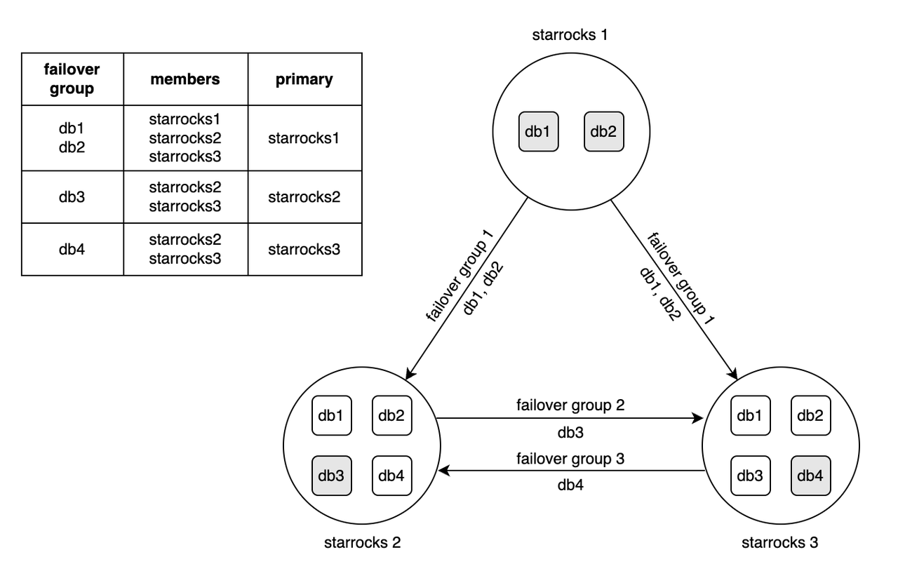
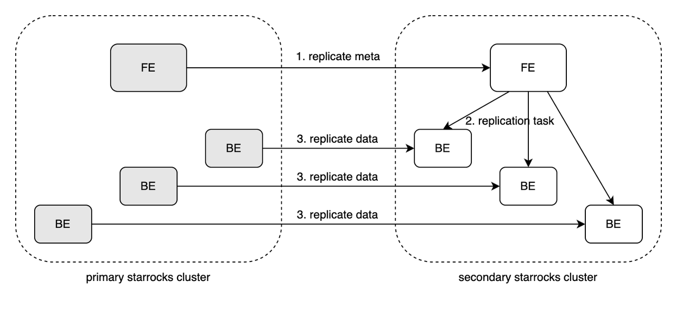

# Disaster Recovery

This topic introduces the Failover Group feature of the StarRocks Enterprise Edition.

## Overview

From v3.3.5 onwards, the StarRocks Enterprise Edition supports system failover across multiple clusters via the Failover Group feature to accommodate demands for disaster recovery, cluster migration, system high availability, and cross-cloud data sharing.

Currently, StarRocks only supports replication of data, loading task records, and Routine Load tasks (which can be resumed in the new Primary cluster) of the specified tables. Other objects, such as users, privileges, and materialized views, are not supported.

### Benefits

Failover Group can serve the following purposes:

- **Data redundancy**
  -  Failover Group allows for the redundancy of critical data by synchronizing data from the primary cluster to a secondary cluster, ensuring high availability. In the event of a primary cluster failure, services can be quickly switched to the secondary cluster.
- **Load balancing**
  -  With Failover Group, StarRocks can distribute read operations to the secondary cluster, thereby enhancing the overall system's throughput. This approach is useful in scenarios involving read/write separation.
- **Cross-cloud or cross-region data synchronization**
  -  Failover Group enables real-time synchronization of data between different cloud services or regions, typically for disaster recovery or to meet demands for separate region access.
- **Cluster migration**
  -  Data can be migrated from one cluster to another, facilitating the seamless decommissioning of the old cluster with zero downtime.
- **Data accretion**
  -  Data from various functional clusters can be gathered into a single cluster, enabling data gathering and unified analysis.
- **Data integration**
  -  Failover Group facilitates the integration of heterogeneous data from multiple sources, enabling unified data utilization.
- **Staging** **environment for A/B testing**
  -  Data can be synchronized between staging and production environments, allowing for A/B testing.

### Concepts

- **Failover group**: A collection of objects defined within the StarRocks cluster to be replicated. This collection acts as a whole and undergoes one-way replication between clusters.
- **Member**: A member (cluster) in data synchronization in the failover group, with the source cluster being the primary and the target cluster being the secondary.
- **Primary**: The source cluster of data synchronization. A failover group has only one primary cluster, whose data is both readable and writable.
- **Secondary**: The target cluster of data synchronization. A failover group can have multiple secondary clusters, whose data is read-only.
- **Failover**: The process of transferring the primary duty to a selected secondary cluster when the primary cluster experiences a failure.
- **Replicated object**: An object that can be included in a failover group and replicated across clusters. The object's type and instance need to be specified.
- **Replication schedule**: A replication scheduling strategy that triggers replication at specified intervals or times. Replication can also be manually triggered through executing SQL commands.

### Architecture



Failover Group involves multiple clusters and allows for flexible replication relationships to be established between them using failover groups.

A failover group is a collection of objects within a StarRocks cluster, such as catalogs, databases, tables, and more. This collection acts as a whole and undergoes one-way replication between clusters, synchronizing data from the primary cluster to the secondary cluster.

The primary cluster serves as the source cluster of data synchronization within a failover group, and each failover group has only one primary cluster, whose data is both readable and writable. The secondary cluster, on the other hand, acts as the target cluster of data synchronization, and a failover group can have multiple secondary clusters, whose data is read-only.

A single StarRocks cluster can participate in multiple failover groups, taking on the role of the primary cluster in one failover group while acting as a secondary cluster in another.

In the event of a primary cluster failure, failover can be initiated by selecting a secondary cluster to be promoted as the new primary cluster, ensuring continued service.

### Workflow



Data synchronization between the primary and secondary clusters occurs periodically, with each synchronization requiring the completion of the previous one before initiating the next. Data synchronization is initiated by the secondary cluster, which pulls data from the primary cluster, following these specific steps:

1. The leader FE of the secondary cluster requests the latest full metadata from any FE in the primary cluster. It compares this metadata with its local copy to identify the differences.
2. The FE in the secondary cluster selects the BE whose data is lagging behind and issues a replication task. This task includes the address of the BE in the primary cluster where the corresponding data resides and the target version number to be replicated. The respective tablet replicas in the secondary cluster search for the lagged-behind data, cloning only the missing portions from the target version.
3. The BE in the secondary cluster requests the corresponding BE in the primary cluster to replicate the snapshots.
4. The BE in the primary cluster replicates snapshot files to the BE in the secondary cluster.
5. The BE in the secondary cluster returns task success to the FE when the replication task is complete. Upon receiving the report, the FE updates the version of the corresponding tablet replica.

## Create failover group

You need to create the failover group from both the primary cluster side and the secondary cluster side.

### Prerequisites

Before creating a Failover Group, you must ensure that all FE nodes from the Primary and Secondary clusters have access to each other's `http_port` and `rpc_port`, and all BE nodes have access to each other's `be_http_port` and `be_port`。

| Component | Port         | Default |
| :-------- | :----------- | :------ |
| FE        | http_port    | 8030    |
| FE        | rpc_port     | 9020    |
| BE        | be_http_port | 8040    |
| BE        | be_port      | 9060    |

### Create failover group in the primary cluster

To create a functional failover group, you must first create it in the primary cluster.

Use the following syntax to create a failover group in the primary cluster:

```SQL
CREATE FAILOVER GROUP [ IF NOT EXISTS ] <failover_group_name>
    [ INCLUDE_TABLES = 
        [catalog_name].[database_name].<table_name>, 
        [catalog_name].[database_name].<table_name>, ... ]
    [ EXCLUDE_TABLES = 
        [catalog_name].[database_name].<table_name>, 
        [catalog_name].[database_name].<table_name>, ... ]
    MEMBERS = 
        '<member_name>:SELF', -- 'SELF' indicates the current cluster.
        '<member_name>:<fe_host>:<fe_port>'
        [ , '<member_name>:<fe_host>:<fe_port>', ...]
    SCHEDULE = '{<num>{s | m | h | d} | <cron_expr>'
    [ COMMENT '<string_literal>' ]
    [ PROPERTIES ("key"="value", ...) ]
```

**Parameters**:

- `failover_group_name`: The name of the failover group to create.
- `INCLUDE_TABLES`: The tables to be included in the failover group.
  - `catalog_name`: The name of the catalog that contains the table.
  - `db_name`: The name of the database that contains the table. Wildcard is supported.
  - `table_name`: The name of the table to replicate. Wildcard is supported.
- `EXCLUDE_TABLES`: The tables to be excluded in the failover group.
  - `catalog_name`: The name of the catalog that contains the table.
  - `db_name`: The name of the database that contains the table.  Wildcard is supported.
  - `table_name`: The name of the table to be excluded. Wildcard is supported.
- `MEMBERS`: The member of the failover group. The primarily cluster is required. You can define multiple secondary clusters. You can use `SELF` to represent the FE node in the current cluster.
  - `member_name`: The name of the member (primary or secondary cluster) in the failover group.
  - `fe_host`: The IP address or FQDN of any FE in the secondary cluster.
  - `fe_port`: The Thrift server port (`rpc_port`) of any FE in the secondary cluster.
- `SCHEDULE`: The schedule of replication tasks. You can specify the time interval between tasks using units including `s` (seconds), `m` (minutes), `h` (hours), and `d` (days). For example, `SCHEDULE = '15m'` indicates replication tasks are triggered every 15 minutes.
- `COMMENT`: The comment for the failover group.
- `PROPERTIES`: The properties of the failover group.

**Example**:

```SQL
CREATE FAILOVER GROUP test_failover_group
INCLUDE_TABLES = default_catalog.*.*
MEMBERS = 'test_1:SELF','test_2:xxx.xxx.xxx.xxx:xxxxx'
SCHEDULE = '10m';
```

### Create failover group in the secondary cluster

After the failover group in the primary cluster is created, you must create the corresponding failover group in the secondary cluster. When creating the failover group in the secondary cluster, you only need to specify the name of the failover group and the address of the primary cluster FE.

Use the following syntax to create a failover group in the secondary cluster:

```SQL
CREATE FAILOVER GROUP [ IF NOT EXISTS ] <failover_group_name>
AS REPLICA OF '<primary_fe_host>:<primary_fe_port>'
```

**Parameters**:

- `failover_group_name`: The name of the failover group to create. It must be identical to what you have defined in the corresponding primary cluster.
- `primary_fe_host`: The IP address or FQDN of the FE in the primary cluster. It must be identical to what you have defined in the corresponding primary cluster.
- `primary_fe_port`: The Thrift server port (`rpc_port`) of the FE in the primary cluster. It must be identical to what you have defined in the corresponding primary cluster.

**Example**:

```SQL
CREATE FAILOVER GROUP test_failover_group 
AS REPLICA OF 'xxx.xxx.xxx.xxx:xxxxx';
```

After creating a failover group on the primary cluster, the FE in the primary cluster initiates handshake requests to the FEs of all secondary clusters. These handshake requests carry the metadata of the failover group. If there is no corresponding failover group created on the secondary cluster or if the primary cluster is not listed in the member list of the failover group on the secondary cluster, the handshake request will be rejected.

Upon rejection, the primary cluster continues attempting to send handshakes until the secondary cluster accepts the handshake and updates the failover group's metadata. Once this is done, the failover group is considered established.

## Manage failover group

### View failover group

- You can view all failover groups created in a cluster using the following syntax:

  - ```SQL
    SHOW FAILOVER GROUPS [ LIKE '<pattern>' ]
    ```

  -  **Example**:

  - ```SQL
    SHOW FAILOVER GROUPS;
    ```

- You can view the details of a specified failover group using the following syntax:

  - ```SQL
    DESC[RIBE] FAILOVER GROUP <failover_group_name>
    ```

  -  **Example**:

  - ```SQL
    DESC FAILOVER GROUP test_failover_group;
    ```

### Alter failover group

To alter the definition, objects, or members of a failover group, you must execute the following statements from the primary cluster.

- You can alter the definition of a failover group using the following syntax:

  - ```SQL
    ALTER FAILOVER GROUP [ IF EXISTS ] <failover_group_name> SET
        [ INCLUDE_TABLES = 
            [catalog_name].[database_name].<table_name>, 
            [catalog_name].[database_name].<table_name>, ... ]
        [ EXCLUDE_TABLES = 
            [catalog_name].[database_name].<table_name>, 
            [catalog_name].[database_name].<table_name>, ... ]
        [ MEMBERS = 
            '<member_name>:SELF', -- 'SELF' indicates the current cluster.
            '<member_name>:<fe_host>:<fe_port>'
            [ , '<member_name>:<fe_host>:<fe_port>', ...] ]
        [ SCHEDULE = '{<num>{s | m | h | d} | <cron_expr>' ]
        [ COMMENT '<string_literal>' ]
        [ PROPERTIES ("key"="value", ...) ]
    ```

  -  **Example**:

  - ```SQL
    ALTER FAILOVER GROUP test_failover_group SET
    INCLUDE_TABLES = default_catalog.*.*
    MEMBERS = 'test_1:SELF','test_2:xxx.xxx.xxx.xxx:xxxxx'
    SCHEDULE = '15m';
    ```

- You can add objects or members to a failover group using the following syntax:

  - ```SQL
    ALTER FAILOVER GROUP [ IF EXISTS ] <failover_group_name> ADD
        [ [catalog_name].[database_name].<table_name>, ... ] TO INCLUDE_TABLES ]
        [ [catalog_name].[database_name].<table_name>, ... ] TO EXCLUDE_TABLES ]
        [ '<member_name>:<fe_host>:<fe_port>'
            [ , '<member_name>:<fe_host>:<fe_port>', ...] TO MEMBERS ]
        [ ... ]
    ```

  -  **Example**:

  - ```SQL
    ALTER FAILOVER GROUP test_failover_group 
    ADD 'test_3:xxx.xxx.xxx.xxx:xxxxx' TO MEMBERS;
    ```

- You can remove objects or members from a failover group using the following syntax:

  - ```SQL
    ALTER FAILOVER GROUP [ IF EXISTS ] <failover_group_name> REMOVE
        [ [catalog_name].[database_name].<table_name>, ... ] FROM INCLUDE_TABLES ]
        [ [catalog_name].[database_name].<table_name>, ... ] FROM EXCLUDE_TABLES ]
        [ '<member_name>' [ , '<member_name>' , ... ] FROM MEMBERS ]
        [ ... ]
    ```

  -  **Example**:

  - ```SQL
    ALTER FAILOVER GROUP test_failover_group 
    REMOVE 'test_2' FROM MEMBERS;
    ```

### Operate failover group

To operate a failover group to suspend, resume, refresh replication, or shift the primary cluster, you must execute the following statements from the **secondary cluster**.

#### Refresh replication

You can manually refresh the data replication in the secondary cluster using the following syntax:

```SQL
ALTER FAILOVER GROUP [ IF EXISTS ] <failover_group_name> REFRESH
```

**Example**:

```SQL
ALTER FAILOVER GROUP test_failover_group REFRESH;
```

#### Shift primary cluster

You can set the current secondary cluster as the new primary cluster using the following syntax:

```SQL
ALTER FAILOVER GROUP [ IF EXISTS ] <failover_group_name> PRIMARY
```

**Example**:

```SQL
ALTER FAILOVER GROUP test_failover_group PRIMARY;
```

#### Suspend failover group

You can suspend a failover group using the following syntax:

```SQL
ALTER FAILOVER GROUP [ IF EXISTS ] <failover_group_name> SUSPEND
```

**Example**:

```SQL
ALTER FAILOVER GROUP test_failover_group SUSPEND;
```

#### Resume failover group

You can resume a suspended failover group using the following syntax:

```SQL
ALTER FAILOVER GROUP [ IF EXISTS ] <failover_group_name> RESUME
```

**Example**:

```SQL
ALTER FAILOVER GROUP test_failover_group RESUME;
```

### Drop failover group

You can drop a failover group using the following syntax:

```SQL
DROP FAILOVER GROUP [ IF EXISTS ] <failover_group_name>
```

**Example**:

```SQL
DROP FAILOVER GROUP test_failover_group;
```

### Configure failover group

You can configure failover groups using these FE and BE parameters.

#### FE parameters

##### failover_group_interval_ms

- Default: 100
- Type: Int
- Unit: Milliseconds
- Is mutable: No
- Description: The minimum time interval at which the Failover Group tasks are scheduled.
- Introduced in: v3.3.5

##### failover_group_job_threads

- Default: 4
- Type: Int
- Unit: -
- Is mutable: No
- Description: The number of threads in the secondary cluster performing metadata synchronization tasks.
- Introduced in: v3.3.5

##### failover_group_pull_image_timeout_sec

- Default: 30
- Type: Int
- Unit: Seconds
- Is mutable: Yes
- Description: The timeout for the secondary cluster to pull images from the primary cluster.
- Introduced in: v3.3.5

##### failover_group_trigger_new_image_interval_sec

- Default: 600
- Type: Int
- Unit: Seconds
- Is mutable: Yes
- Description: The minimum time interval at which the primary cluster actively triggers image generation.
- Introduced in: v3.3.5

##### failover_group_allow_drop_extra_table

- Default: false
- Type: Boolean
- Unit: -
- Is mutable: Yes
- Description: Whether to allow extra tables and databases in the secondary cluster to be dropped.
- Introduced in: v3.3.5

##### failover_group_allow_drop_extra_partition

- Default: true
- Type: Boolean
- Unit: -
- Is mutable: Yes
- Description: Whether to allow extra partitions in tables of the secondary cluster to be dropped.
- Introduced in: v3.3.5

##### failover_group_allow_drop_inconsistent_table

- Default: true
- Type: Boolean
- Unit: -
- Is mutable: Yes
- Description: Whether to allow inconsistent tables and databases in the secondary cluster to be dropped.
- Introduced in: v3.3.5

##### failover_group_allow_drop_inconsistent_partition

- Default: true
- Type: Boolean
- Unit: -
- Is mutable: Yes
- Description: Whether to allow inconsistent partitions in tables of the secondary cluster to be dropped.
- Introduced in: v3.3.5

##### failover_group_error_message_keep_max_num

- Default: 10
- Type: Int
- Unit: -
- Is mutable: No
- Description: The maximum number of error messages retained in the Failover Group.
- Introduced in: v3.3.5

##### replication_interval_ms

- Default: 100
- Type: Int
- Unit: -
- Is mutable: No
- Description: The minimum time interval at which the replication tasks are scheduled.
- Introduced in: v3.3.5

##### replication_max_parallel_table_count

- Default: 100
- Type: Int
- Unit: -
- Is mutable: Yes
- Description: The maximum number of concurrent data synchronization tasks allowed. StarRocks creates one synchronization task for each table.
- Introduced in: v3.3.5

##### replication_max_parallel_replica_count

- Default: 10240
- Type: Int
- Unit: -
- Is mutable: Yes
- Description: The maximum number of tablet replicas allowed for concurrent synchronization.
- Introduced in: v3.3.5

##### replication_max_parallel_data_size_mb

- Default: 1048576
- Type: Int
- Unit: MB
- Is mutable: Yes
- Description: The maximum size of data allowed for concurrent synchronization.
- Introduced in: v3.3.5

##### replication_transaction_timeout_sec

- Default: 86400
- Type: Int
- Unit: Seconds
- Is mutable: Yes
- Description: The timeout duration for synchronization tasks.
- Introduced in: v3.3.5

#### BE parameters

##### replication_threads

- Default: 0
- Type: Int
- Unit: -
- Is mutable: Yes
- Description: The maximum number of threads used for replication. `0` indicates setting the thread number to four times the BE CPU core count.
- Introduced in: v3.3.5

##### replication_max_speed_limit_kbps

- Default: 50000
- Type: Int
- Unit: KB/s
- Is mutable: Yes
- Description: The maximum speed of each replication thread.
- Introduced in: v3.3.5

##### replication_min_speed_limit_kbps

- Default: 50
- Type: Int
- Unit: KB/s
- Is mutable: Yes
- Description: The minimum speed of each replication thread.
- Introduced in: v3.3.5

##### replication_min_speed_time_seconds

- Default: 300
- Type: Int
- Unit: Seconds
- Is mutable: Yes
- Description: The time duration allowed for a replication thread to be under the minimum speed. Replication will fail if the time when the actual speed is lower than `replication_min_speed_limit_kbps` exceeds this value.
- Introduced in: v3.3.5

##### clear_expired_replication_snapshots_interval_seconds

- Default: 3600
- Type: Int
- Unit: Seconds
- Is mutable: Yes
- Description: The time interval at which the system clears the expired snapshots left by abnormal replications.
- Introduced in: v3.3.5

## Limitations

- StarRocks only supports Failover Group for shared-nothing clusters of v3.3.5 or later.
- Currently, StarRocks supports replication of the following objects:
  - Data from specified tables
  - Loading task records
  - Routine Load tasks (which can be resumed in the new Primary cluster)
- Currently, StarRocks does not support replication of objects including but not limited to:
  - PIPE loading tasks
  - Users and privileges
  - Other objects such as materialized views