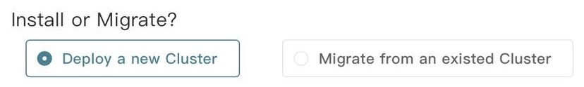
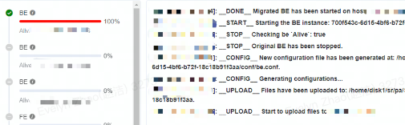
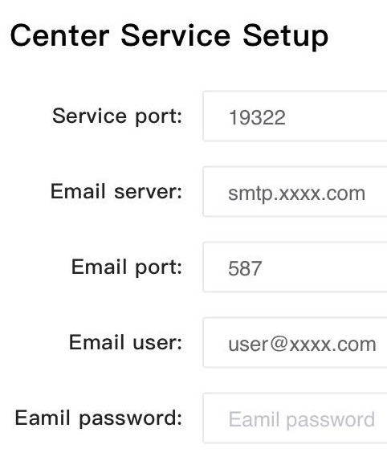
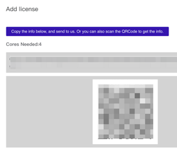

# Migrate an existing cluster

:::note
This step is required if you upgrade your cluster from Community Edition to Enterprise Edition. If you want to install a new cluster, perform the steps in 1.2.2 "Install a new cluster."
:::

1. **Obtain the information of the original cluster.**

If you connect to StarRocks via the MySQL client, run the following SQL commands to view and confirm the information of the FE , BE, and broker.

```bash
show frontends;
show backends;
show broker;
```

Pay special attention to the following information:

- Quantity, IP address, and version of FE , BE, and broker
- Information of leader, follower, and observer FEs

1. Disable the daemon (such as Supervisor) of the original StarRocks cluster and start it using a script. 

:::warning
If this step is not performed, the Supervisor of the new Celerdata Manager will conflict with the old Supervisor, causing the installation to fail.
:::

Assume that the installation directories are all under `~/Celerdata`. If the actual directories are different from this, modify the directories.

```bash
### Use a script to start BE.
# Check whether BE and Supervisor are started.
echo -e "\n==== BE ====" && ps aux | grep be && echo -e "\n==== supervisor ====" && ps aux | grep supervisor

cd ~/Celerdata/be
# Turn off Supervisor and start it using a script.
./control.sh stop && sleep 3 && bin/start_be.sh --daemon

# Use the above echo command to check whether BE and Supervisor are started.

# Check BE startup on your MySQL client.
mysql> show backends;


### Use a script to start FE.
echo -e "\n==== FE ====" && ps aux | grep fe && echo -e "\n==== supervisor ====" && ps aux | grep supervisor

cd ~/Celerdata/fe 
# Turn off Supervisor and start it using a script.
./control.sh stop && sleep 2 && bin/start_fe.sh --daemon

# Use the echo command to check whether FE and Supervisor are started.

# Modify the configuration file and run it again.
sed -i 's/DATE = `date +%Y%m%d-%H%M%S`/DATE = "$(date +%Y%m%d-%H%M%S)"/g' conf/fe.conf

# Check FE startup in your MySQL client.
mysql> show frontends;


### Use a script to start broker.
echo -e "\n==== broker ====" && ps aux | grep broker &&
echo -e "\n==== supervisor ====" && ps aux | grep supervisor

cd ~/Celerdata/apache_hdfs_broker
./control.sh stop && sleep 2 && bin/start_broker.sh --daemon

# Check broker startup in MySQL.
mysql> show broker;

### Check Supervisor again.
ps aux | grep supervisor
```

1. Ensure that the cluster enters the "non-supervisor daemons" state before you continue with the following steps.
2. Fill in the FE, BE, and broker installation directories. 

This operation reinstalls FE and BE, and the configuration files are obtained from the metadata of the original FE.

FE meta and BE storage retain the original data path.

LOG uses the path in the new directory.

Udf, syslog, audit log, small_files, and plugin_dir use the paths in the new directory.

When you migrate FE, BE, and broker, configure the upgrade paths respectively. (The paths and installation directories of the original instance are required) .

- Path before upgrade: full path to FE, BE, and broker, such as `/home/Celerdata/fe`. 
- Installation directory: the overall installation directory, such as `/home/Celerdata-manager-xxx`. 

You can also perform the configurations in batches.

1. Click **Next.** On the page that is displayed, click **Migrate All** to perform automatic migration. You can also click **Migrate Next** to migrate the nodes one by one. 

 



1. Click **Next** to configure **Center service**. 

**Center service** pulls information from the Agent, summarizes and stores the information, and provides monitoring and alarming services. **Mail service** is the mailbox that receives notifications, which can be left blank and configured later.



Time zone errors may occur when you configure **Center service**.

### UTC error

If there is a UTC time zone error during the configuration of **Center service**, add **`export TZ = 'Asia/`****`Shanghai`****`';`** to the **~/.bashrc** file and run the file**.** This operation sets the environment variable **TZ** to **Asia/Shanghai** and adds this setting to system variables.

Before installing the **Web** service, confirm that the time zone is **cst.**

```bash
[ycg@StarRocks-sandbox04 ~]# export TZ=Asia/Shanghai
[ycg@StarRocks-sandbox04 ~]# date
Sat Apr 10 10:04:46 CST 2021
```

1. Click **Finish.** You will be automatically redirected to the web login page. The default account is **root** and the password is empty. The following page will be displayed after the login. 
   
2. Copy the code string in the figure and send it to the StarRocks technical support personnel, who will return a license string. After you enter the license string, click **OK** to use Celerdata Manager. 

After this operation is complete, Celerdata Manager is successfully installed and you can use the default user **root** and an empty password to log in to Celerdata Manager console (you can change the password and add a user by referring to the related operations in MySQL).

From v2.13 onwards, Celerdata Manager will generate a temporary root user and a random password. In the last step of deployment, a prompt displays that the password is ****** and you need to record the password. If you did not obtain the password in time, you can query it in the log, which records the temporary password. The command is as follows:

```bash
grep -r password manager/center/log/web/*
```

## Install a new cluster

1. Install FE**.** In the **Configure FE Instance** dialog box, configure the following parameters:
   1. **FE** **Followers**: We recommend that you configure 1 or 3 follower FEs. 
   2. **FE** **Observers:** You can leave observer FEs unspecified. You can also add observer FEs when the query pressure increases.   
   3. **Meta Dir:** metadata directory of StarRocks. Similar to manual installation, we recommend that you configure separate metadata and FE log directories. 
   4. Use default values for the installation directory, log directory, and port numbers. 
   

1. Install BE**.**

1. Install broker. We recommend that you install a broker for all nodes. 

1. Install **Center service.**

**Center service** pulls information from the Agent, summarizes and stores the information, and provides monitoring and alarming services. **Mail service** is the mailbox that receives notifications, which can be left blank and configured later.


Time zone errors may occur when you configure **Center service**, refer to [UTC errors ](https://starrocks.feishu.cn/docx/QZQgdjVskod4JBx0RwTc8Lrpndc)for solutions. 

After this operation is complete, the StarRocks cluster is successfully installed and you can use the default user **root** and an empty password to log in to Celerdata Manager (you can change the password and add an account by referring to the related operations in MySQL).

From v2.13 onwards, Celerdata Manager will generate a temporary root user and a random password. In the last step of deployment, a prompt displays that the password is ****** and you need to record the password. If you did not obtain the password in time, you can query it in the log, which records the temporary password. The command is as follows:

```bash
grep -r password manager/center/log/web/*
```
