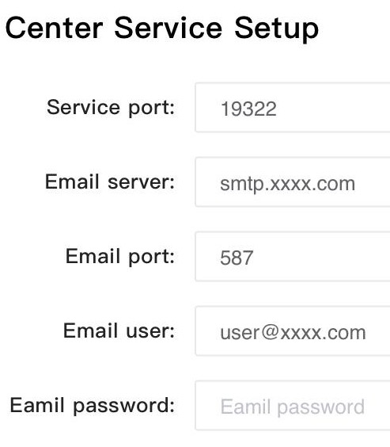

## Enable SSL

You can skip this step if you do not need SSL configuration.

1. Add the following two lines to `<celerdata-manager installation directory>/center/conf/web.conf`:



`ssl_key` is the absolute path of `PEM encoded certificate private key`.

`ssl_cert` is the absolute path of `PEM encoded certificate body`.

1. In the installation directory of Celerdata Manager, run `./centerctl.sh restart web` to restart Web UI and run `./centerctl.sh status web` to check the status of Web UI. If the state displays RUNNING, the restart succeeds.
2. Access https://mgr_host:port in your browser.

:::note
If you configured an *SSL certificate for* Nginx,

```bash
ssl_key = xxx.key
ssl_cert = xxx.pem
```
:::
