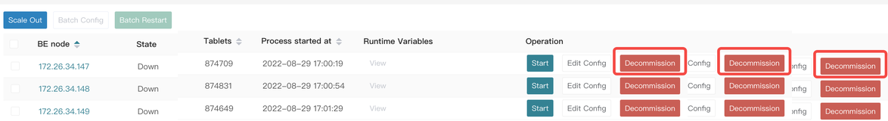

# Scale in/out

## BE scale-out

1. Choose **Nodes** > **Add Host.** Click **Add Host** to deploy a new Agent to manage the node. (Adding nodes requires re-signing the License.) 

After the node is added, it will be displayed in the **Add Host** section. 

1. In the **BE node** section, click **Scale Out** and enter the required information in the **BE Setup** dialog box. 

1. Click **Confirm** to complete the scale-out. Load balancing will be automatically triggered after the scale-out is complete. 

If you need to increase the license quota, contact StarRocks technical support.

## BE scale-in

Find the BE node to be removed. In the **Operation** column, click **Decommision** to remove the node. The decommissioning process takes a few minutes. After data migration is complete, you can see that the number of tablets on the BE gradually drops to 0, and then click **Stop.** The node becomes an idle node, waiting to be recycled.

During the decommission, you can view the progress by checking the number of tablets. If you need to cancel the decommission, click **Cancel Decommission**.

## FE scale-out

1. In the **Add Host** section of the **Nodes** page, click **Add Host** to deploy a new Agent to manage the node. (Adding nodes requires re-signing the License.) 

1. After the node is added, click **Scale Out** and enter the required information. Click **Confirm** to complete the scale-out.

## FE scale-in

Find the FE node to be removed. In the **Operation** column, click **Decommission** to remove the node. After the node is decommissioned, run `SHOW FRONTENDS;` on the **Editor** page to check whether the node exists.

