# Cluster information and monitoring

After logging in to CelerData Manager, you can view the status of your cluster on the **Dashboard** page, including **cluster basic information, Cluster overview,** **Query** **overview, and Alarm**.

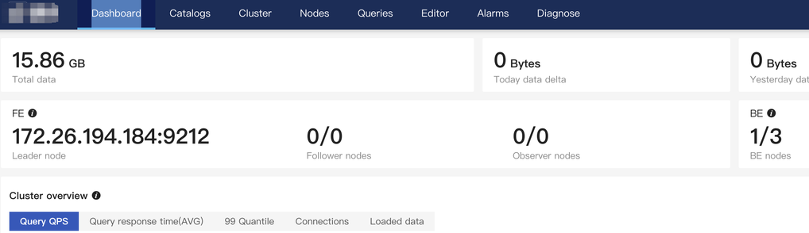

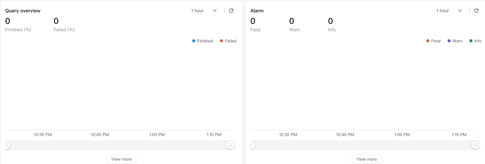

### Cluster basic information

Displays **data information** and **node information**.

- **Data information** includes the total data volume, today's added data volume, and yesterday's added data volume.
- **Cluster node information**
  -  Leader FE IP and port (the port is the BE heartbeat port, such as `9212` in the following figure). The following figure shows a cluster with one FE node (leader FE) and three BE nodes.
  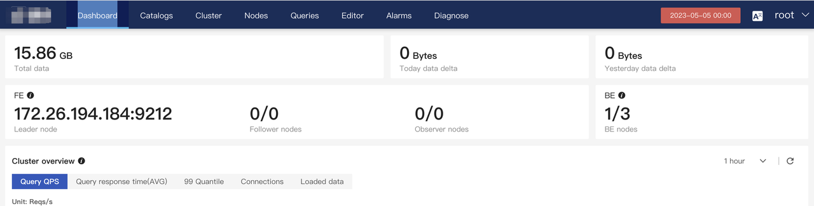

### Cluster overview

The **Cluster overview** section displays general information of the cluster.

It displays QPS, average query response time, 99 percentile response, number of database connections, and volume of loaded data. You can also specify a time interval in the upper right corner.

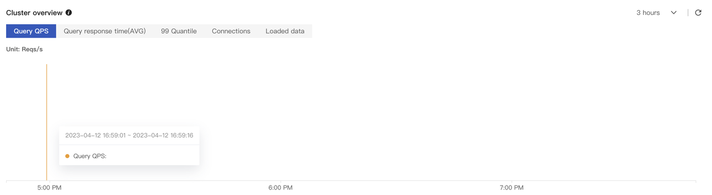

#### **Query** **QPS**

You can view the QPS to monitor cluster load.

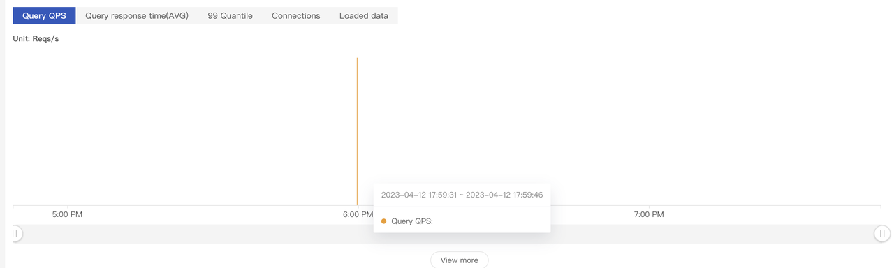

**Average** **query** **response time**

By querying the average response time, you can observe the average query latency of the cluster in the current time period to determine whether the query latency meets expectation, and whether some SQL needs to be tuned.

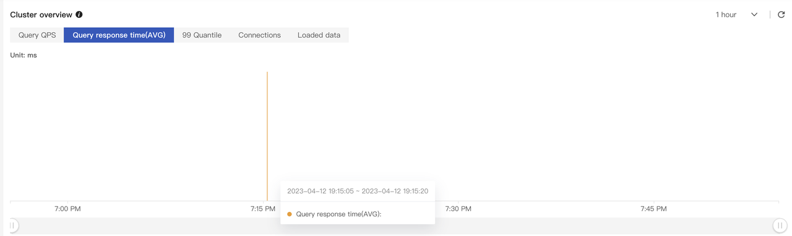

Click **View more** to view the 50 quantile response time, 75 quantile response time, 90 quantile response time, 95 quantile response time, 99 quantile response time, and 999 quantile response time.

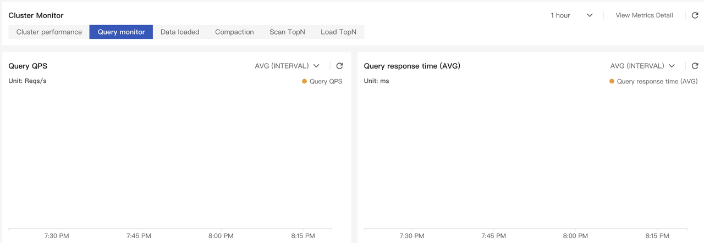

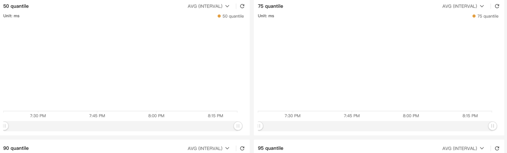

#### Query 99 quantile response

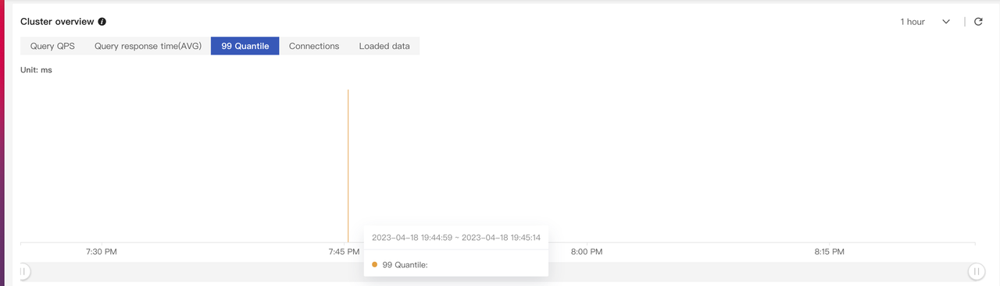

#### Number of database connections

You can view the number of connections in the current cluster. The statistics are not the number of connected users. Connections from the same account to the cluster are also counted.

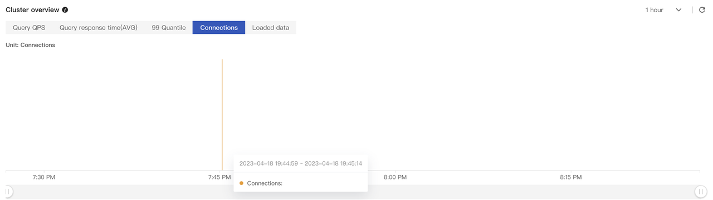

#### Data ingestion volume

You can view the data loading frequency of the cluster. The default unit of the y-coordinate is KB/second.

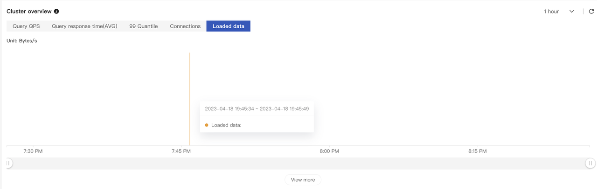

Click **View More** at the bottom to view the number of load tasks initiated, number of loaded rows, and amount of loaded data.

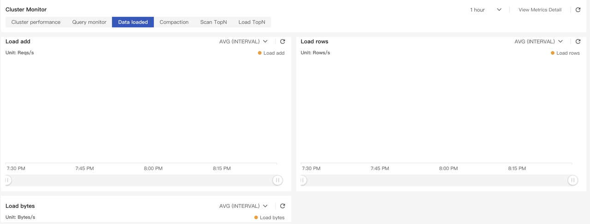

### Query overview

Choose **Dashboard** > **Query** **overview** to view the query execution success rate, number of successful queries, and number of failed queries.

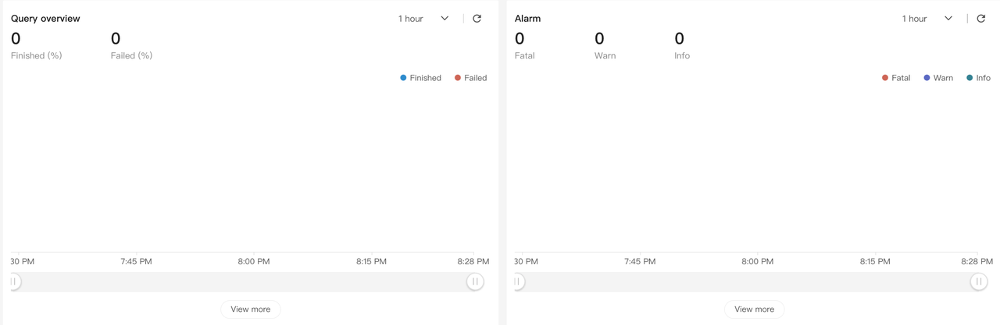

Click **View More** at the bottom to view **All Queries** and **Slow Queries**.

**All Queries** displays all the SQL statements that have been executed in the cluster, as well as the execution status, time consumption, and users who execute the SQL.

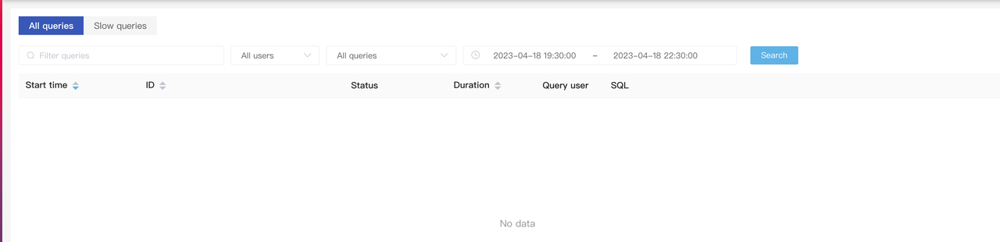

You can click a query ID to show SQL details, query plan, execution time, and execution details.

**Query** **plan** shows the result of the EXPLAIN statement.

**Query** **details** show the detailed profile of the query. If this tab is unclickable, query profile is not enabled. You can enable query profile using `set is_report_success = true` (for versions earlier than v2.5) or `set enable_profile = true` (for v2.5 and later) and later, and run EXPLAIN again.

### Alarm

:::note
To detect any exceptions and risks in your cluster in advance, you must configure alarms for your cluster. For more information, see the "Alarms and Diagnose" section.**
:::

In the Alarm area, you can view the number of alarms triggered. Alarms are classified into three types in descending order of severity: Fatal, Warning, and Info.

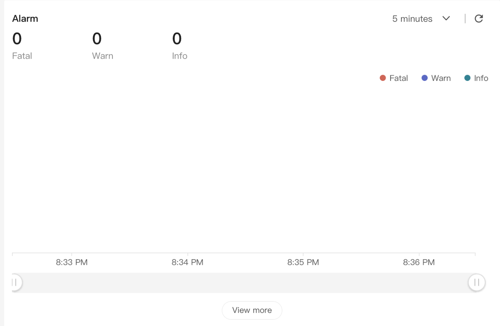

Click **View more** to go to the **Alarms** page.

You can view alarm records, configure alarm rules, block nodes from reporting alarms, and configure alarm notification recipients when an alarm is triggered.

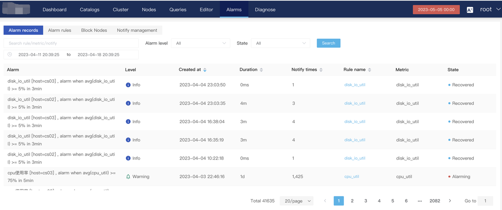

