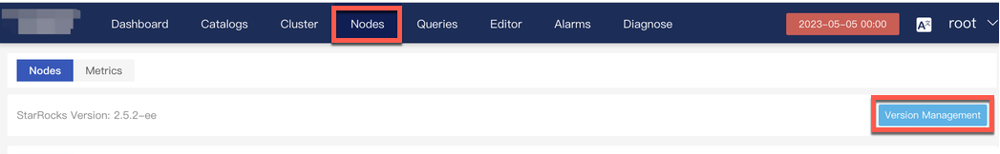
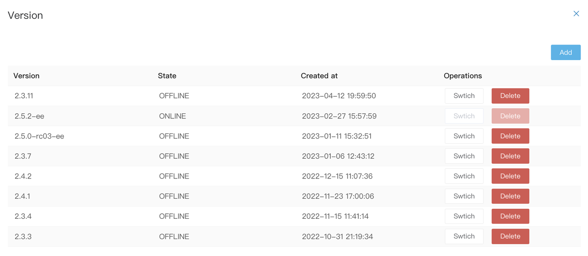
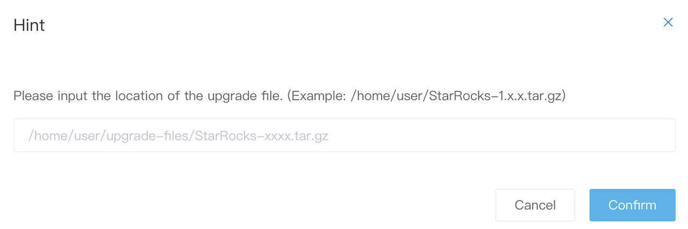
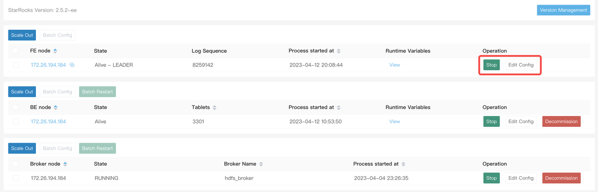
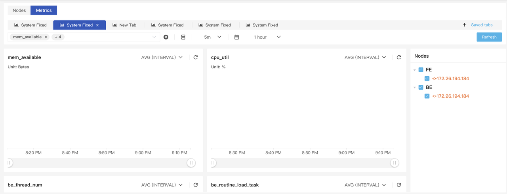
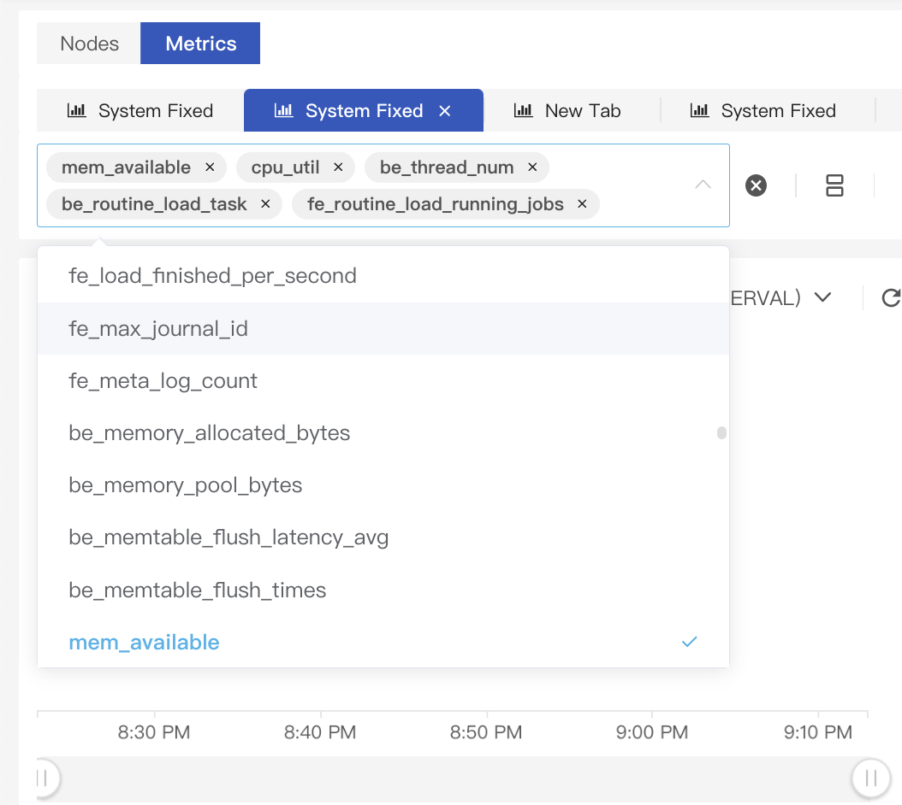

# Manage nodes

## Machine information

1. Click **Nodes** in the top navigation bar to display the cluster information, including FE node information, BE node information, and Broker node information.

    

1. Click **Version Management** in the upper-right corner to switch cluster versions.

    

1. Click **Add** and enter the path of the target StarRocks version to add a version.

    

1. After the version is added, click **Switch**.

    You can also start and stop a node, edit its configuration, or decommission the node.

    

## Metrics

Click the **Metrics** tab to display the monitoring information of the current cluster.

  

You can select metrics from the metrics list to monitor the cluster.

  

