# Manage databases

## View database information

### Catalogs

1. Click **Catalogs** in the top navigation bar to display catalog information, including catalog name, type, and comments.

    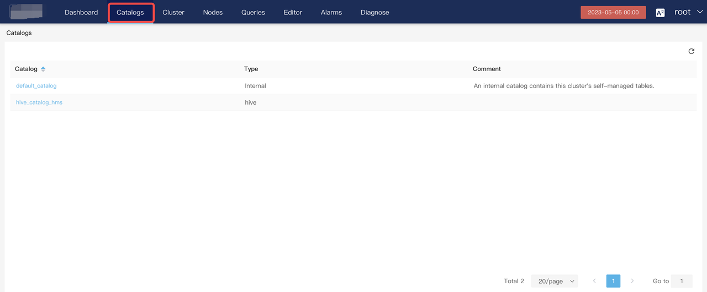

1. Click a catalog to view its detailed information, including database name, size, and comments.

    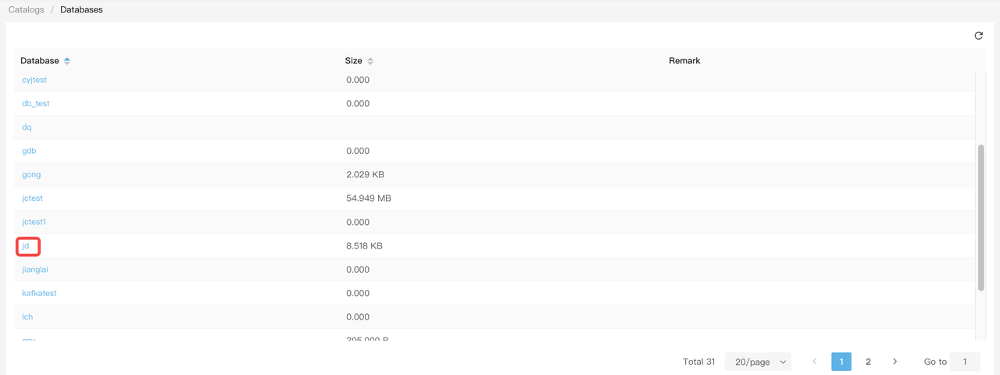

1. Click a database (for example, `jd`) and the **Database detail** page is displayed, which contains three tabs: **Tables**, **Tasks**, and **Statistics**.

    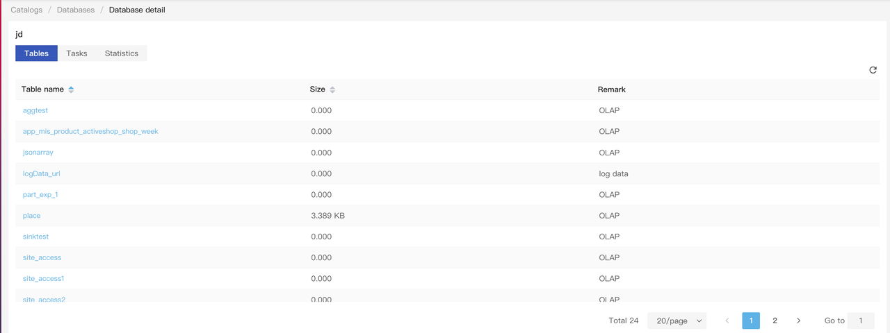

4. Click a table to view the table information, for example, `site_access`.

    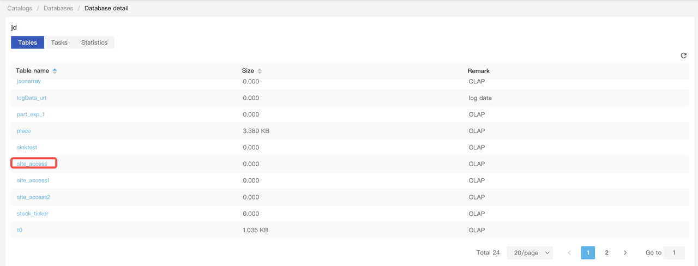

Note: If a materialized view is built on this table, the materialized view will also be displayed when you click this table.

Detailed information includes partition name, visible data version, partition status, partition key, partition range, bucketing column, number of buckets, number of replicas, and data size of the partition.

    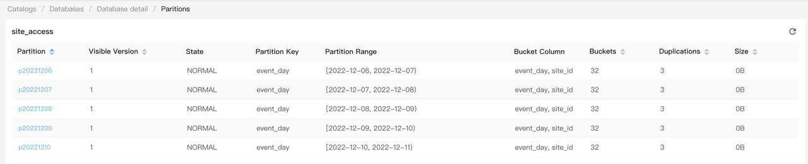

- **Visible version**: the number of data versions of the partition. The number varies depending on the number of load tasks. More load tasks result in a larger value of this parameter.
- **State**: The partition status must be **NORMAL**.

1. Click a partition (`p20221206`) to view the partition information.

    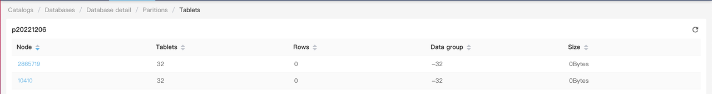

The lower level of **Partitions** is **Tablets.** This figure shows the number of tablets, data rows, data versions, and data size on a BE node.

**Data group**: The total number of data versions in the output of the SHOW PROC command.

1. Check details of tablets on a BE mode. Use BE node `10410` as an example.

    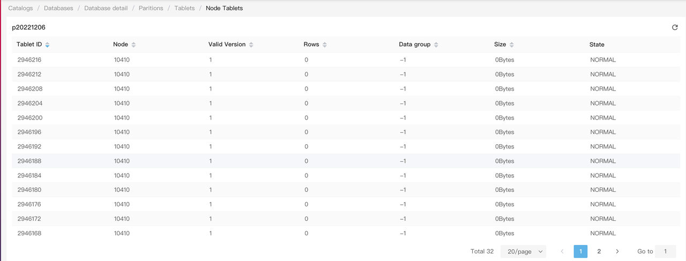

This figure shows information such as the tablet ID, the BE node on which the tablet is located, the valid versions, the number of data rows, the data version, the data size, and the status of the tablet.

**Valid version**: The cumulative number of versions of the tablet. A large number of load tasks results in a large value of this metric.

**Data group**: The number of versions of the tablet. The higher the load frequency, the larger the value. The default limit is 1000. A value greater than 1000 will affect load performance.

### Tasks

Use database `jd` as an example. On the **Tasks** tab, you can view detailed information of load tasks in this database, including **Kafka** **Import,** **Other Import**, **Export**, **Schema Change**, **Creating View**, and **Clone**.

-  **Kafka** **Import,** **Other Import**
  -  You can filter tasks by label name, table name, and task status. You can perform the following operations on the target task: resume tasks in the PAUSED state, stop a RUNNING task, and drop a task. In addition, you can view other task information.
    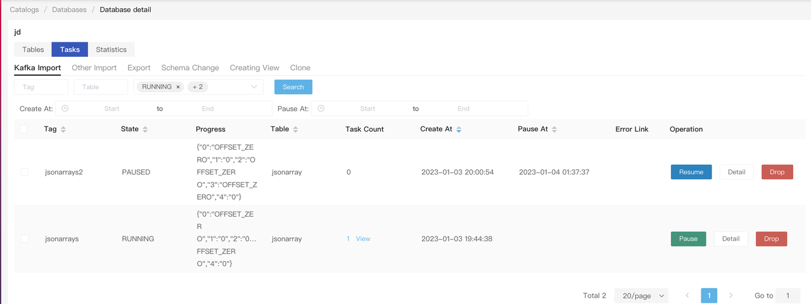

- **Export**
  -  Displays task status, progress, task type, start time, end time, and details.
    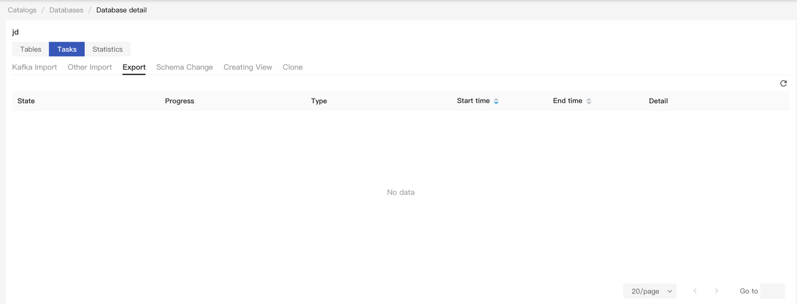
- **Schema Change**
  -  Displays table name, task execution status, progress, start time, end time, timeout duration, and details.
    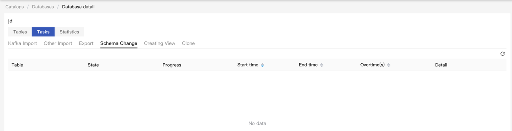
-  **Creating View**
  -  Displays materialized view name, base table name, creation status, progress, start time, end time, timeout duration, and details.
    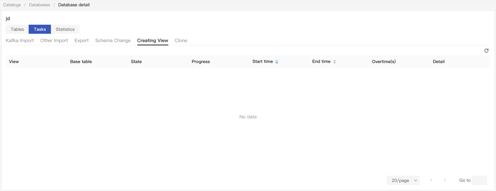
- **Clone**
  -  Displays information of replica cloning tasks in the cluster, including two types of tasks (running tasks and pending tasks).
  -  Details include tablet ID, database, table, partition, and start time.
    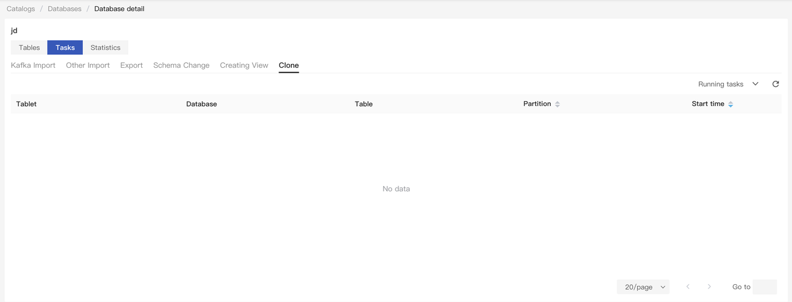

### Statistics

Click the **Statistics** tab to view information about tablets in the cluster, including tablets with inconsistent data and tablets with slow queries.

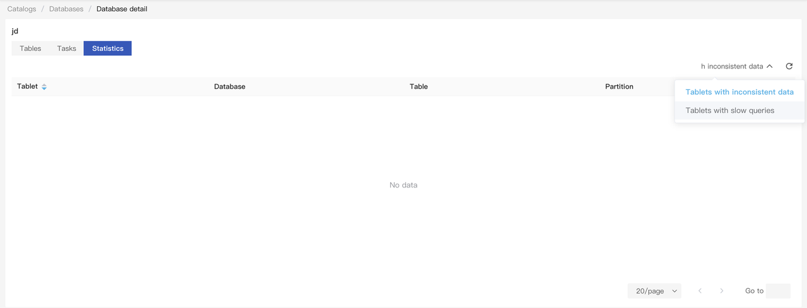

