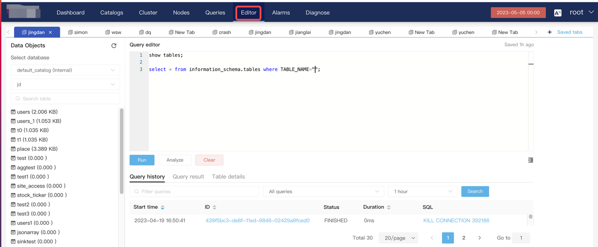
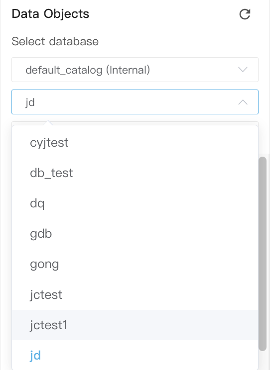
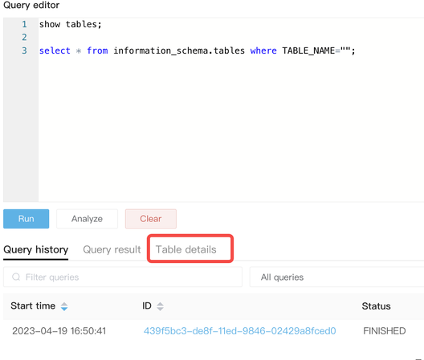
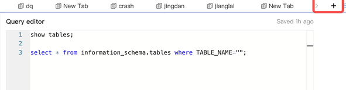
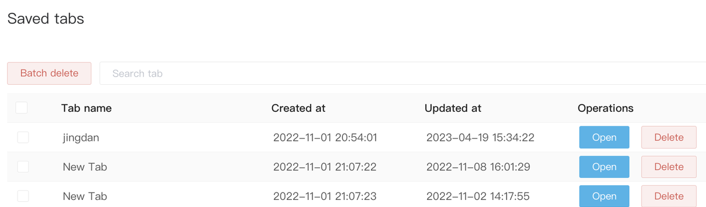
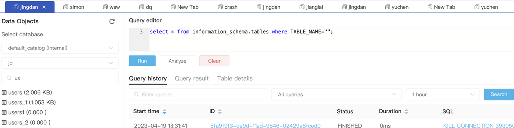
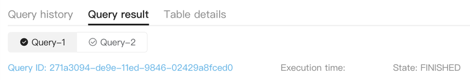
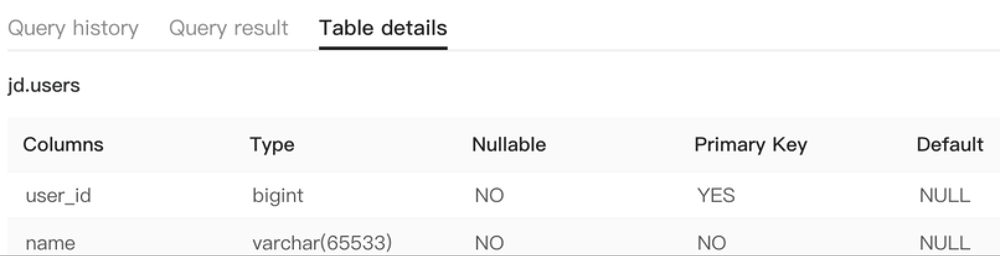
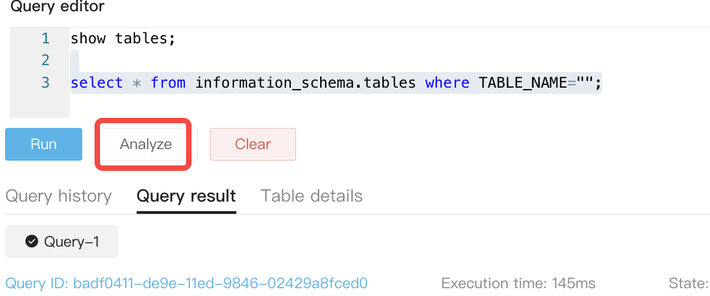

# Use the database editor

Click **Editor** in the top navigation bar to write SQL. This eliminates the need to use the MySQL client to connect to CelerData. You can directly run SQL in the web UI.

## Write SQL

## Select database

Click the drop-down list in the left pane to select a database you want to query.

## Search for table

You can enter a keyword in the search box to search for a table. In addition, you can click the **Table details** tab in the lower-right part to view the table structure and data in the table.

## Tabs
You can click **+** in the top area to add your own tab and open a new editor page. This way, you can have a separate operation page.

Click **Saved tabs** to view all tabs and manage the tabs, including open, delete, search, and batch delete operations.

## Use the Query editor
You can write SQL in the **Query** **editor** and then click **Run**. You can choose to execute a single SQL or execute SQL in batches. After execution, you can view the query history, query result, and table details.

### Query history

The **Query** **history** tab displays query ID, query start time, status, duration, and SQL.

### Query result

The **Query** **result** tab displays query ID, execution time, execution status, number of returned rows, and total number of result rows.

### Table details
The **Table details** tab displays column ID, column type, whether the column value can be nullable,  whether the table is a Primary Key table, the default value of the column, and comments. You can also query the table schema and view data in the table.

### Analyze

This function is equivalent to `set is_report_success = true`, that is, enabling profile reporting to analyze the SQL.

### Clear

Clears the **Query** **editor** pane to write new SQL.
