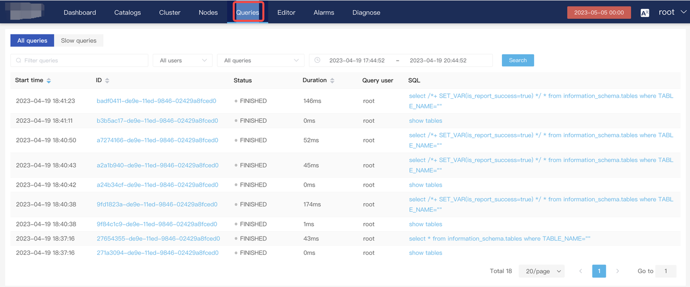
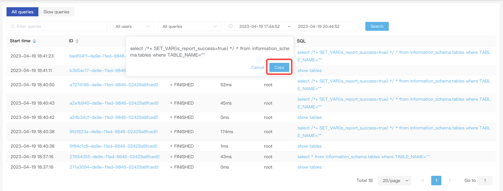
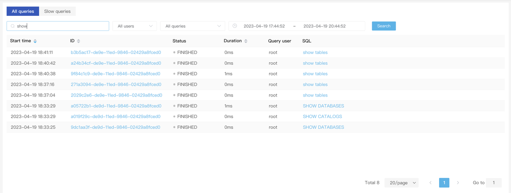
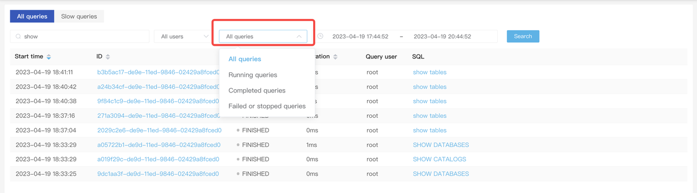
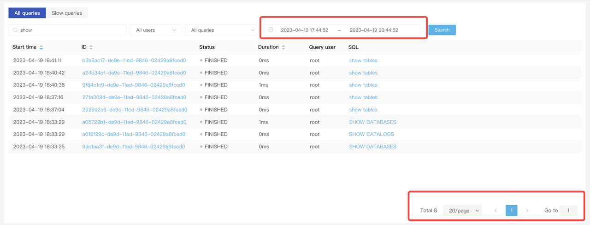
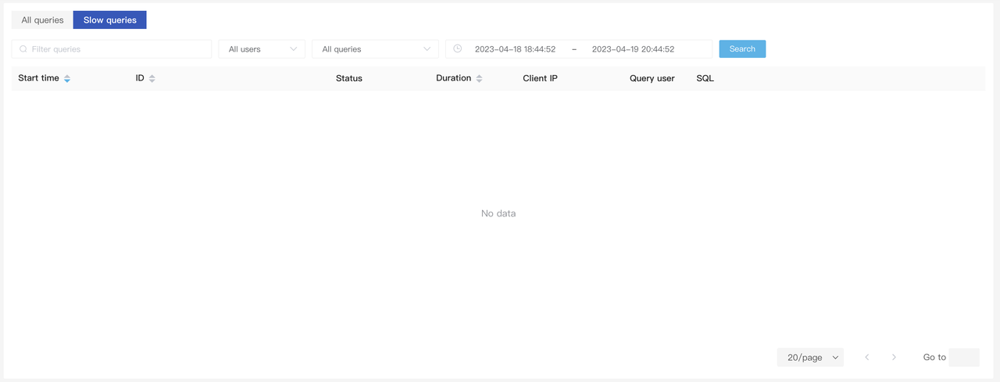

# Manage queries

Click **Queries** in the top navigation bar to view all the query records (a query that takes more than **5s** is regarded as a slow query).

## All queries

The **All queries** tab displays the start time, ID, status, duration, query user, and SQL statement of a query. If you have enabled the query profile feature (`set enable_profile = true` for v2.5 and later and `set is_report_success = true` for versions earlier than v2.5), click the corresponding query ID to view the query execution plan and query profile.

- You can click a SQL statement to copy it.

- You can enter a keyword in the search box to filter queries.

- You can click the **All queries** drop-down list to filter queries.

- You can filter query records by time range.

The query records are displayed by page. At the bottom of the page, you can choose the number of entries to display on each page. You can view query records following the sequence of page numbers or select a target page number.

## Slow queries

The **Slow queries** tab shows all the slow queries identified by the system. Similar to the **All queries** tab, you can filter queries using the search box, by execution status, or by specifying a time range.

