# Alarms and Diagnose

## Alarms

### Alarm records

Choose **Alarms** > **Alarm Record**. This tab displays historical alarm records. You can filter alarms based on time, alarm severity, and alarm status. You can also search for an alarm by entering a keyword in the search box.

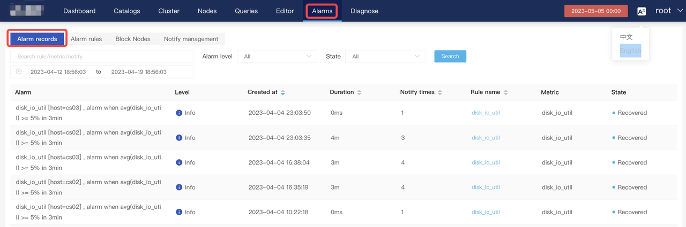

### Alarm rules

The **Alarm Rules** tab displays all the configured alarm rules. You can modify, delete, and disable an alarm metric on this page. You can also view the details of an alarm rule and historical alarms.

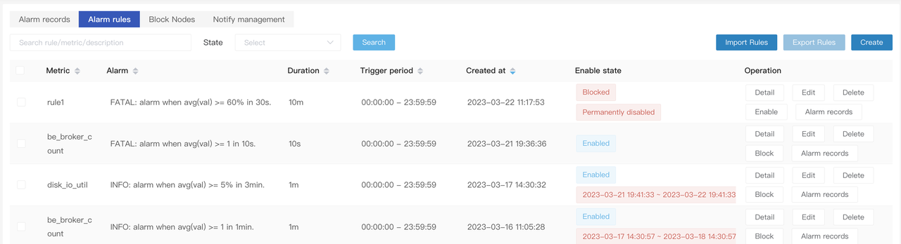

You can click **Create** in the upper-right corner to add an alarm rule.

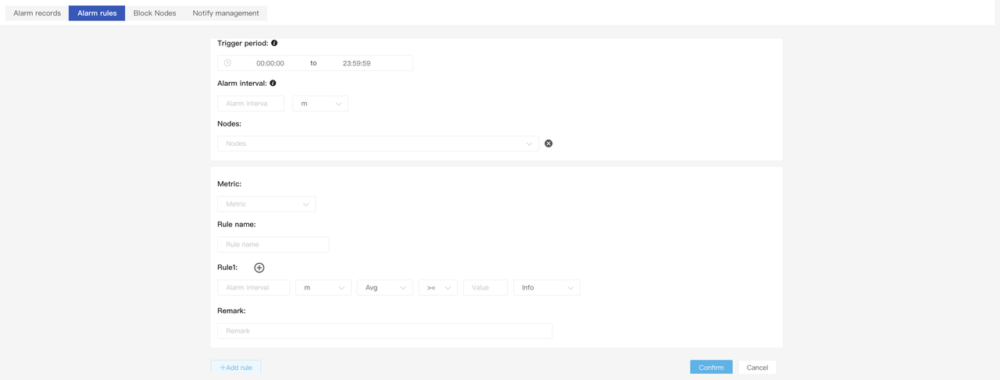

- **Trigger period**: You can configure the time range during which the alarm is effective, for example, 08:00:00--18:00:00.
- **Alarm interval**: the alarm reporting interval. An alarm cannot be repetitively reported within the period specified by this parameter.
- **Nodes**: the node on which the alarm is triggered. For example, you can configure an FE node.
- **Metric:** The alarm metric can be searched.
- **Rule name:** Generally, the name is the same as the alarm metric. You can also customize the name.
- **Rule1**
  - Alarm interval: value + time unit, for example, 1 hour.
  - Trigger condition: The supported conditions are average value and value. The comparison operators are `>=`, `>`, `=`, `<`, `<=`. You need to set a value threshold. Example: Average value < 80%.
  - Alarm severity in ascending order
    - **Info:** Cluster load or other functions exceed the normal range and you need to pay attention to this.
    - **Warning**: Some functions of the cluster are unavailable. You need to pay attention and fix it.
    - **Fatal**: The cluster is unavailable. You need to check related information at the earliest time and communicate with the business team to identify issues.
  -  You can add an alarm rule by clicking the plus sign (+) to the right of each rule.
- **Remarks**: You can add a remark for the alarm rule to describe the meaning of the metric and the severity.

## Block nodes

You can block alarms for specific nodes. This way, alarms related to this node will not be reported. This function avoids unnecessary alarm triggering when you perform node maintenance operations.

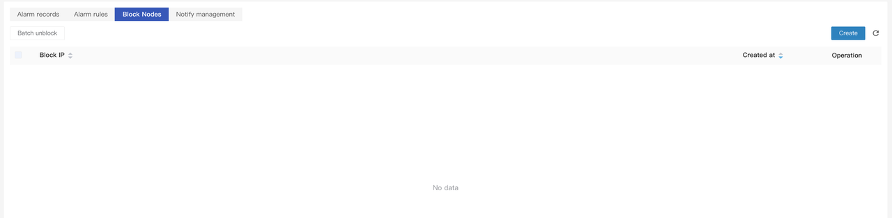

## Alarm notification

Currently, CelerData supports alarm notifications via email, DingTalk Robot, Feishu Robot, and Webhook. You can choose any method that suits your needs. The following parts describe how to configure email and webhook.

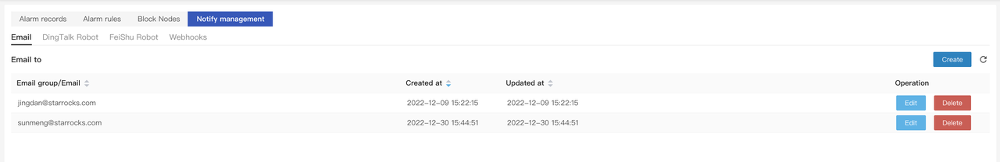

### Configure email

#### Configure the SMTP server

Versions later than v2.2 support online modification of SMTP server. You can click **Settings** under **root** to configure the mailbox and SMTP server.

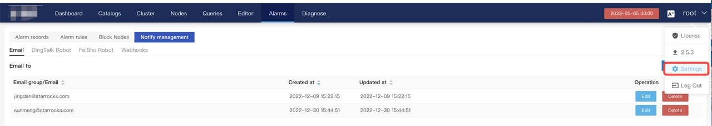

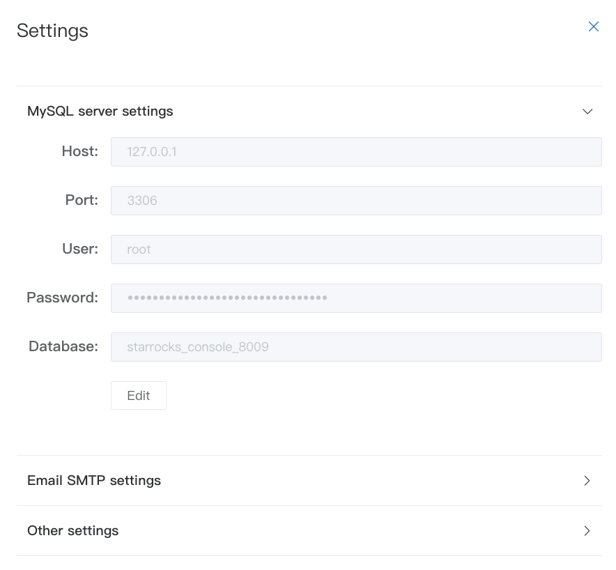

For v2.2 and earlier versions, you need to modify the `[notify]` option in the **center_service.conf** configuration file of the **center/conf** directory of the CelerData Manager installation directory and restart the center-service.

```SQL
email_user = user@xxxx.com
email_password = xxxx
email_addr = smtp.xxxx.com:587
```

Restart the center-service.

```bash
./centerctl.sh restart center-service
```

#### Configure mailbox

On the **Notify management tab**, click **Create** in the upper-right corner. In the **Create** dialog box, configure email.

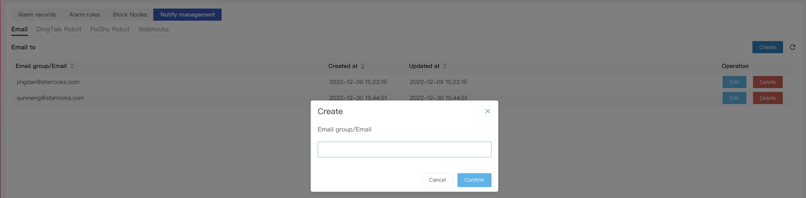

### Configure Webhook

On the **Webhooks** tab, click **Create** in the upper-right corner.

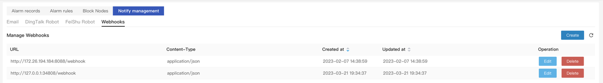

You need to develop an interface for receiving Webhook alarms from the server.

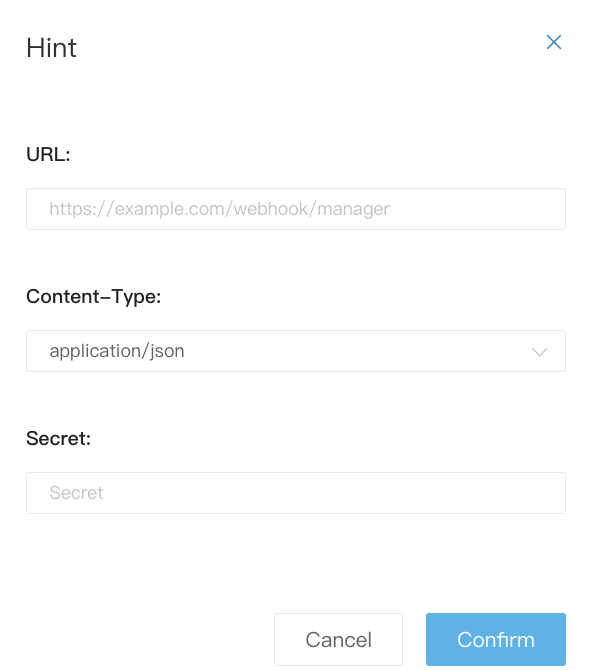

CelerData sends the following HTTP request to the configured URL:

```bash
method:
POST

header:
x-starrocks-db-signature = [signature: hex_str(sha1(secret+post_body))]
content-type = [req_header.content-type]

body:
{
 "level":        "Alarm severity",
 "ruleName":     "Alarm rule name",
 "alarmMessage": "Alarm message",
 "startTime":    "Alarm start time",
}

Note
1. The result of x-starrocks-db-signature must be verified by the receiver. The calculation method is as follows:
Use sha1 to encode the string (Secret + Received post body) and convert it into a hex string.

Example for Golang:
hash := shal.New()
hash.Write ([]byte(secret))
hash.Write(body)
signBytes := hash.Sum(nil)
sign := fmt.Sprintf("&x", signBytes)

2. content-type can be application/json or application/x-www-form-urlencoded.
3. Secret
```

## Diagnose

### Log

Choose **Diagnose** > **Log**. On the **Log** tab**,** you can view FE and BE logs. You can also search for a log in the search box or by specifying a time interval.

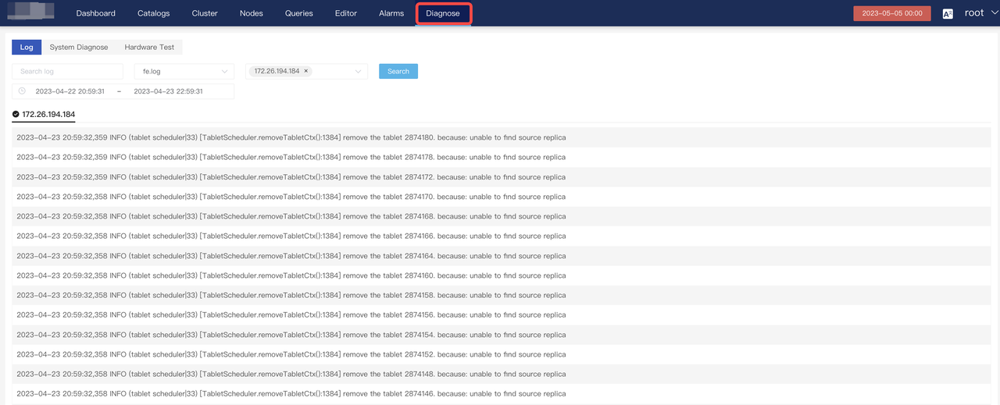

### System Diagnose

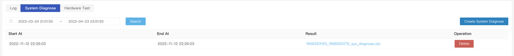

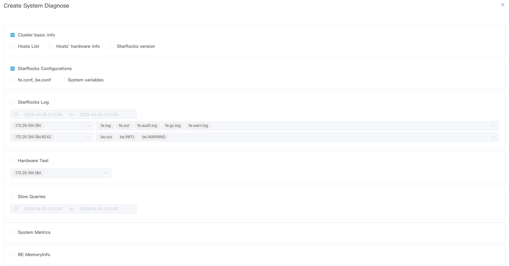

You can click **Create System Diagnose** in the upper-right corner to collect the following information for troubleshooting:

- **Cluster basic info**: including host list, hardware information, and StarRocks version.
- **StarRocks Configurations**: including items in the `fe.conf` and `be.conf` configuration files and session variables.
- **StarRocks Log**: including FE and BE logs.
- **Hardware Test**: CPU, environment variables, Iperf network interface test results, maximum number of opened files (ulimit -n), configuration of `/proc/sys/vm/overcommit_memory`, and configuration of `/proc/sys/vm/swappiness`.
- **Slow queries**: slow queries within a specific period (4 days by default) and the profile.
- **System Metrics**: metrics related to memory, CPU, and io.util.
- **BE Memory Info**: See [Memory management](https://docs.starrocks.io/en-us/latest/administration/Memory_management).

### Hardware Test

Hardware test will check the CPU, memory, maximum number of opened files (ulimit -n), configuration of `/proc/sys/vm/overcommit_memory`, configuration of `/proc/sys/vm/swappiness`, Iperf network interface test results, environment variables, and disk random I/O test results of the selected node.

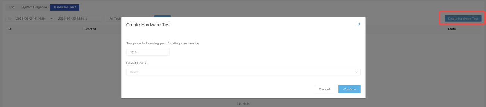

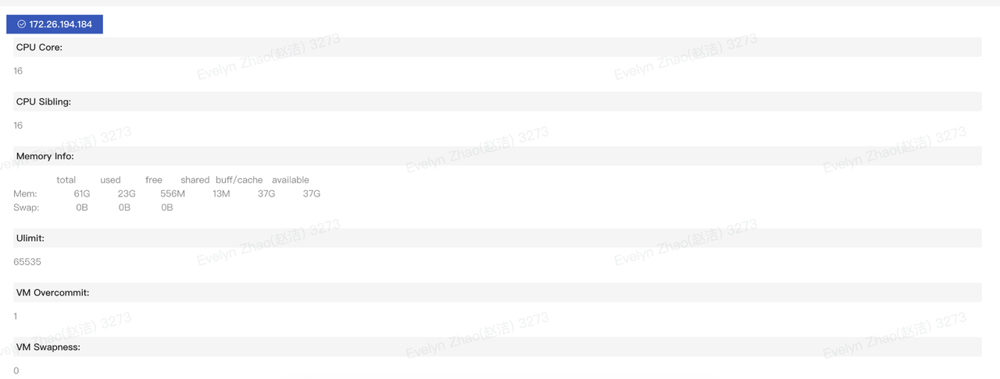

## Common errors
### UTC error

If there is a UTC time zone error during the configuration of **Center service**, add **`export TZ = 'Asia/`****`Shanghai`****`';`** to the **~/.bashrc** file and run the file**.** This operation sets the environment variable **TZ** to **Asia/Shanghai** and adds this setting to system variables.

Before installing the **Web** service, confirm that the time zone is **cst.**

```bash
[ycg@StarRocks-sandbox04 ~]# export TZ=Asia/Shanghai
[ycg@StarRocks-sandbox04 ~]# date
Sat Apr 10 10:04:46 CST 2021
```
