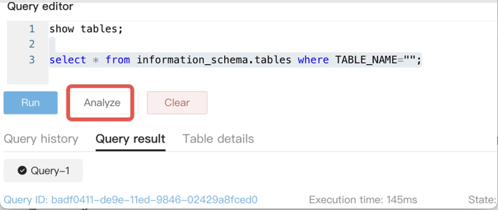

# Database Editor

The database editor ...

## Select the database

asdf

## Search for a table

asdf

## Organize your work with Tabs

asdf

xyzzy

## Write and run your SQL

asdf

## Query history

asdf

## Query results

asdf

## Table details

asdf

## Analyze

asdf

## Clear

asdf

