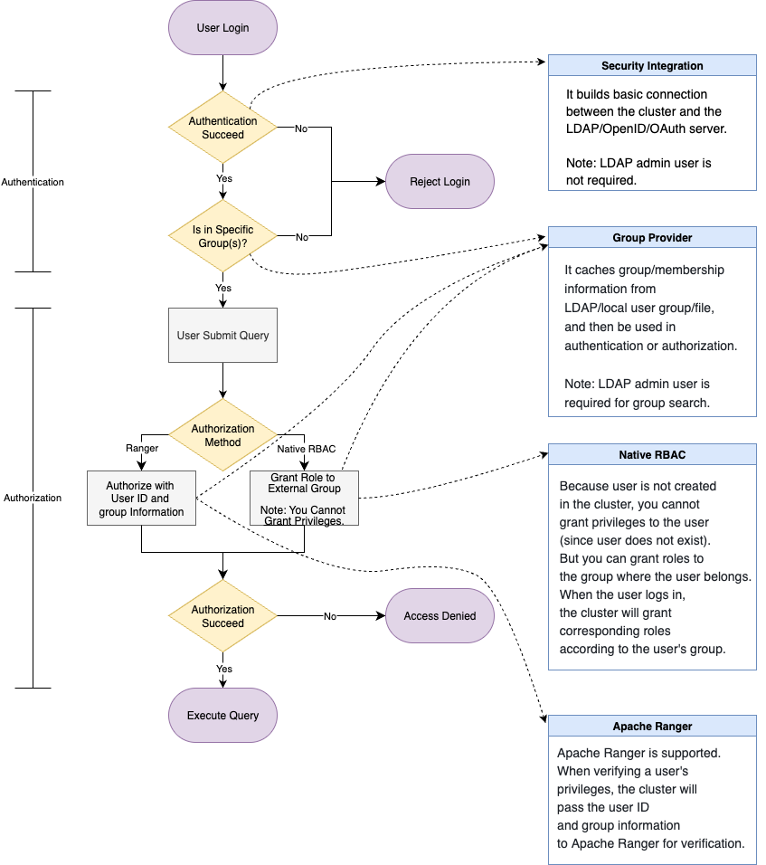

### Solution 3: External Authentication (External Identity) + Internal Authorization

If you prefer to use **StarRocks' built-in authorization system** while still relying on **external authentication**, you can follow this approach:

1. Use a **security integration** to establish a connection with the external authentication system.
2. Configure the necessary group information for authentication and authorization within the **group provider**.
3. Define the group(s) allowed to log in to the StarRocks cluster in the **security integration**. Users who belong to these groups will be granted login access.
4. **Create the necessary roles** within StarRocks and **grant them to external groups**.
5. When a user attempts to log in, they must both pass authentication and belong to an authorized group. Upon successful login, StarRocks will automatically assign the appropriate roles based on group membership.
6. During query execution, StarRocks will enforce **internal RBAC-based authorization** as usual.
7. Additionally, you can combine **Ranger** with this solution. For example, use **StarRocks' native RBAC** for internal table authorization, and use **Ranger** for external table authorization. When performing authorization via Ranger, StarRocks will still pass the **user ID and corresponding group information** to Ranger for access control.

