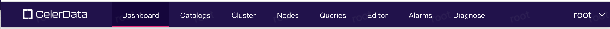
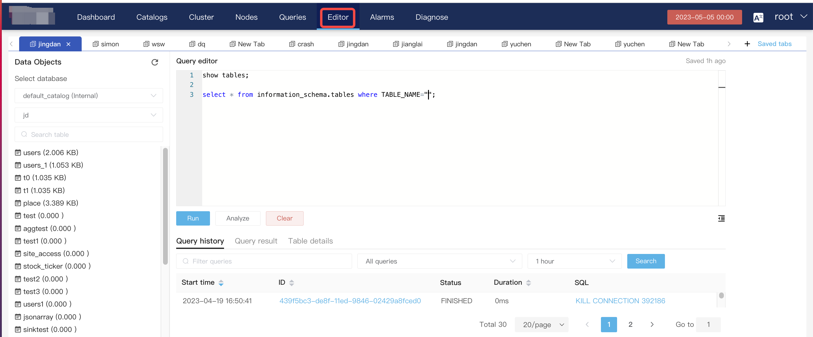
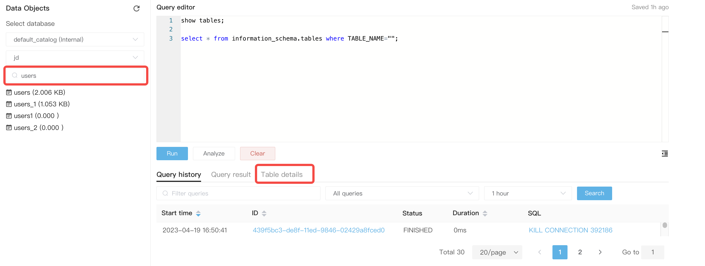
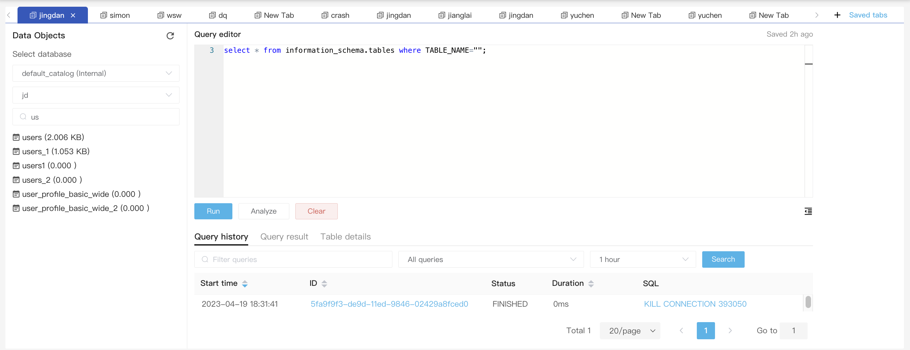
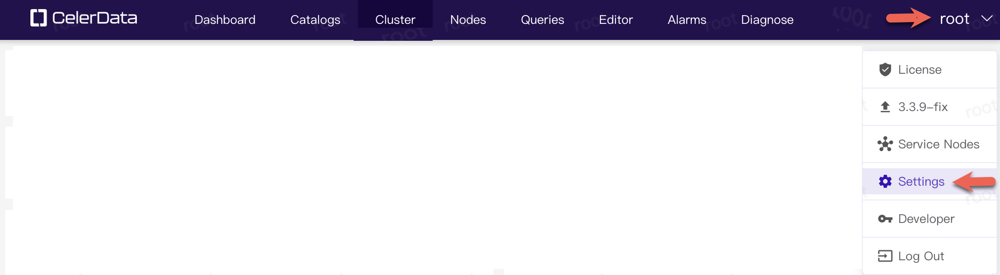

# Administration with CelerData Manager

import TimezoneError from '../../_assets/commonMarkdown/_timezone.mdx'

After logging in to CelerData Manager, you can view the status of your cluster on the **Dashboard** page, including Cluster performance, Query monitor, Data loaded, Compaction, Scan TopN, and Load TopN.

The menu system is in layers, in this guide we will start from the upper left corner and work across. **Dashboard** is first.

:::tip
If you are reading this document to become familiar with the navigation, then we recommend that you avoid clicking the **View more** buttons below the charts as this will take you to a deeper level of the navigation. If you follow along with the text below you will get to all the charts.
:::


## Dashboard


**Dashboard** has two summary charts, **Cluster overview** and **Query overview**.

### Cluster overview

The Cluster overview reports queries per second, average query response time, 99 Quantile, number of connections, and loaded data.

### Query overview
<!-- <h3 style="background-color: #1A0A3D; color: white;">
 Query overview
</h3>

<table border="0x solid black">
  <tr>
    <td style="background-color:#1A0A3D; color: white">Query overview</td>
  </tr>
</table>
-->

The Query overview reports the Finished and Failed query percentage.

## Catalogs


1. Click **Catalogs** in the top navigation bar to display catalog information, including catalog name, type, and comments.

:::tip
If you have not created any OLAP tables the rest of this **Catalogs** section may not be of interest to you until later when you do have some data.
:::

2. Click a catalog to view its detailed information, including database name, size, and comments.
3. Click a database and the **Database detail** page is displayed, containing three tabs: **Tables**, **Tasks**, and **Statistics**.
4. Click a table to view the table information.

:::note
If a materialized view is built on this table, the materialized view will also be displayed when you click this table.
:::

Detailed information includes partition name, visible data version, partition status, partition key, partition range, bucketing column, number of buckets, number of replicas, and data size of the partition.

- **Visible version**: the number of data versions of the partition. The number varies depending on the number of load tasks. More load tasks result in a larger value of this parameter.
- **State**: The partition status must be **NORMAL**.

## Cluster


### Cluster performance

The **Cluster performance** section displays general information for the cluster infrastructure.

It displays CPU, memory, disk, and network information.

### Query monitor

You can view the queries per second, response time, and 50 - 999 quantile response times to monitor cluster load. and determine whether or not queries need tuning to meet your requirements.

### Data loaded

You can view the data loading rate of the cluster in batches/sec, rows/sec, and bytes/sec.

### Compaction

Click the **Compaction** tab to display the query information of the cluster, including baseline merged data versions, cumulative merged data versions, baseline merged data volume, and cumulative merged data volume.

### Scan TopN

Click the **Scan TopN** tab to display the query information of the cluster, including the number of finished scans, the scanned data size, and the number of scanned rows.

### Load TopN

Click the **Load TopN** tab to display the load information of the cluster, including the number of finished load tasks, the size of data loaded, and the number of rows loaded.

You can select a table to query the real-time loading of a single table.

## Nodes


### Machine information

1. Click **Nodes** in the top navigation bar to display the cluster information, including FE node information, BE node information, and Broker node information.
2. Click **Version Management** in the upper-right corner to switch cluster versions.
3. Click **Add** and enter the path of the target StarRocks version to add a version.

1. After the version is added, click **Switch**.

You can also start and stop a node, edit its configuration, or decommission the node.

### Metrics

Click the **Metrics** tab to display the monitoring information of the current cluster.

You can select metrics from the metrics list to monitor the cluster.

## Queries


Click **Queries** in the top navigation bar to view all the query records (a query that takes more than **5s** is regarded as a slow query).

### All queries

The **All queries** tab displays the start time, ID, status, duration, query user, and SQL statement of a query. If you have enabled the query profile feature (`set enable_profile = true`), click the corresponding query ID to view the query execution plan and query profile.

- You can click a SQL statement to copy it.
- You can enter a keyword in the search box to filter queries.

- You can click the **All queries** drop-down list to filter queries.
- You can filter query records by time range.

The query records are displayed by page. At the bottom of the page, you can choose the number of entries to display on each page. You can view query records following the sequence of page numbers or select a target page number.

### Slow queries

The **Slow queries** tab shows all the slow queries identified by the system. Similar to the **All queries** tab, you can filter queries using the search box, by execution status, or by specifying a time range.

## Editor


Click **Editor** in the top navigation bar to write SQL. This eliminates the need to use the MySQL client to connect to CelerData. You can directly run SQL in the web UI.

- Write SQL



- Select database
  -  Click the drop-down list in the left pane to select a database you want to query.

- Search for table
  -  You can enter a keyword in the search box to search for a table. In addition, you can click the **Table details** tab in the lower-right part to view the table structure and data in the table.
  
- Tab
  -  You can click **+** in the top area to add your own tab and open a new editor page. This way, you can have a separate operation page.

Click **Saved tabs** to view all tabs and manage the tabs, including open, delete, search, and batch delete operations.

- Use the Query editor
  -  You can write SQL in the **Query** **editor** and then click **Run**. You can choose to execute a single query or execute SQL in batches. After execution, you can view the query history, query result, and table details.
  
  - The **Query** **history** tab displays query ID, query start time, status, duration, and SQL.
  - The **Query** **result** tab displays query ID, execution time, execution status, number of returned rows, and total number of result rows.
  - The **Table details** tab displays column ID, column type, whether the column value can be nullable,  whether the table is a Primary Key table, the default value of the column, and comments. You can also query the table schema and view data in the table.
  - 
- Analyze
  -  This function is equivalent to `set is_report_success = true`, that is, enabling profile reporting to analyze the SQL.
  - 
- Clear: Clears the **Query** **editor** pane to write new SQL.

## Alarms


> **To detect any exceptions and risks in your cluster in advance, you must configure alarms for your cluster. For more information, see the "Alarms and Diagnose" section.**

In the Alarm area, you can view the number of alarms triggered. Alarms are classified into three types in descending order of severity: Fatal, Warning, and Info.

Click **View more** to go to the **Alarms** page.

You can view alarm records, configure alarm rules, block nodes from reporting alarms, and configure alarm notification recipients when an alarm is triggered.

## Alarms


### Alarm records

Choose **Alarms** > **Alarm Record**. This tab displays historical alarm records. You can filter alarms based on time, alarm severity, and alarm status. You can also search for an alarm by entering a keyword in the search box.

### Alarm rules

The **Alarm Rules** tab displays all the configured alarm rules. You can modify, delete, and disable an alarm metric on this page. You can also view the details of an alarm rule and historical alarms.

You can click **Create** in the upper-right corner to add an alarm rule.

- **Trigger period**: You can configure the time range during which the alarm is effective, for example, 08:00:00--18:00:00.
- **Alarm interval**: the alarm reporting interval. An alarm cannot be repetitively reported within the period specified by this parameter.
- **Nodes**: the node on which the alarm is triggered. For example, you can configure an FE node.
- **Metric:** The alarm metric can be searched.
- **Rule name:** Generally, the name is the same as the alarm metric. You can also customize the name.
- **Rule1**
  - Alarm interval: value + time unit, for example, 1 hour.
  - Trigger condition: The supported conditions are average value and value. The comparison operators are `>=`, `>`, `=`, `<`, `<=`. You need to set a value threshold. Example: Average value < 80%.
  - Alarm severity in ascending order
    - **Info:** Cluster load or other functions exceed the normal range and you need to pay attention to this.
    - **Warning**: Some functions of the cluster are unavailable. You need to pay attention and fix it.
    - **Fatal**: The cluster is unavailable. You need to check related information at the earliest time and communicate with the business team to identify issues.
  -  You can add an alarm rule by clicking the plus sign (+) to the right of each rule.
- **Remarks**: You can add a remark for the alarm rule to describe the meaning of the metric and the severity.

### Block nodes

You can block alarms for specific nodes. This way, alarms related to this node will not be reported. This function avoids unnecessary alarm triggering when you perform node maintenance operations.

### Notification

Currently, CelerData supports alarm notifications via email and Webhook. You can choose any method that suits your needs.

### Webhooks

On the **Webhooks** tab, click **Create** in the upper-right corner.

You need to develop an interface to receive Webhook alarms from the server.

CelerData sends the following HTTP request to the configured URL:

```Plain
method:
POST

header:
x-starrocks-db-signature = [signature: hex_str(sha1(secret+post_body))]
content-type = [req_header.content-type]

body:
{
 "level":        "Alarm severity",
 "ruleName":     "Alarm rule name",
 "alarmMessage": "Alarm message",
 "startTime":    "Alarm start time",
}

Note
1. The result of x-starrocks-db-signature must be verified by the receiver. The calculation method is as follows:
Use sha1 to encode the string (Secret + Received post body) and convert it into a hex string.

Example for Golang:
hash := shal.New()
hash.Write ([]byte(secret))
hash.Write(body)
signBytes := hash.Sum(nil)
sign := fmt.Sprintf("&x", signBytes)

2. content-type can be application/json or application/x-www-form-urlencoded.
3. Secret
```

## Diagnose


### Log

Choose **Diagnose** > **Log**. On the **Log** tab** you can view FE and BE logs. You can also search for a log in the search box or by specifying a time interval.

### System Diagnose

You can click **Create System Diagnose** in the upper-right corner to collect the following information for troubleshooting:

- **Cluster basic info**: including host list, hardware information, and StarRocks version.
- **StarRocks Configurations**: including items in the `fe.conf` and `be.conf` configuration files and session variables.
- **StarRocks** **Log**: including FE and BE logs.
- **Hardware Test**: CPU, environment variables, Iperf network interface test results, maximum number of opened files (ulimit -n), configuration of `/proc/sys/vm/overcommit_memory`, and configuration of `/proc/sys/vm/swappiness`.
- **Slow queries**: slow queries within a specific period (4 days by default) and the profile.
- **System Metrics**: metrics related to memory, CPU, and io.util.
- **BE Memory Info**: See [Memory management](https://docs.starrocks.io/en-us/latest/administration/Memory_management).

### Hardware Test

The Hardware test will check the CPU, memory, maximum number of opened files (ulimit -n), configuration of `/proc/sys/vm/overcommit_memory`, configuration of `/proc/sys/vm/swappiness`, Iperf network interface test results, environment variables, and disk random I/O test results of the selected node.

Choose **Dashboard** > **Query** **overview** to view the query execution success rate, number of successful queries, and number of failed queries.

Click **View More** at the bottom to view **All Queries** and **Slow Queries**.

**All Queries** displays all the SQL statements that have been executed in the cluster, as well as the execution status, time consumption, and users who execute the SQL.

You can click a query ID to show SQL details, query plan, execution time, and execution details.

**Query** **plan** shows the result of the EXPLAIN statement.

**Query** **details** show the detailed profile of the query. If this tab is unclickable, query profile is not enabled. You can enable query profile using `set is_report_success = true` (for versions earlier than v2.5) or `set enable_profile = true` (for v2.5 and later) and later, and run EXPLAIN again.

## root

### Settings


#### Email SMTP settings

:::note
Click the **Edit** button to setup the email service.
:::

Specify these settings for the SMTP server:

- Host
- Port
- User
- Password

Specify these settings for the sender of the email notifications:

:::tip
The `From` setting can include a name in addition to the sending email if the format `name<from-user@example.com>`

The `AUTH Type` setting depends on the SMTP server that you are sending through.
:::

- From
- Auth Type

Specify this setting to test the SMTP settings:

:::tip
The destination for alarms is set in the **Alarms > Notifications > Create** dialog. The `To Email` set here is used when you test the SMTP settings.
:::

- To Email


Restart the Center service.

```Shell
./centerctl.sh restart center-service
```


