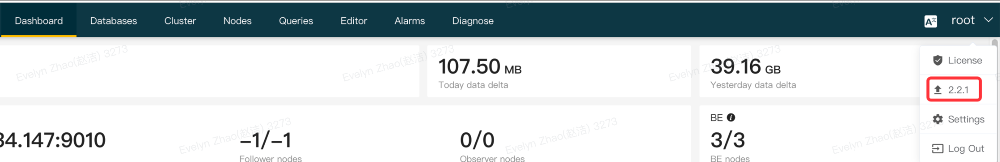

# Manage a StarRocks cluster

import TimezoneError from '../../_assets/commonMarkdown/_timezone.mdx'

## Upgrade/Rollback

### Upgrade

Obtain the CelerData Enterprise installation package for the target version from your CelerData sales manager and then decompress it.

```Shell
$ tar -zxvf  CelerData-EE-x.x.x.tar.gz
$ cd CelerData-EE-x.x.x/file
$ ls -l
```

After decompression, you can see two installation packages **StarRocks-x.x.x.tar.gz** and **Manager-x.x.x.targ.z** in the **file** directory.

**x.y.z** refers to the version numbering. The first digit is the major version. The second digit is a minor version, and the third set of digits is the patch version. Patch versions are generally released every two to four weeks. You can read the release notes of each version at the [official website](https://docs.starrocks.io/releasenotes/).

The files in the **file** directory are as follows. You must select packages in this directory when you perform an upgrade.

```Shell
file
   ├── Manager-3.3.9.tar.gz
   ├── STREAM
   ├── StarRocks-3.3.9-ee.tar.gz
   ├── iperf-3.1.3.tar.gz
   ├── openjdk-11.0.20.1_1-linux-x64.tar.gz
   ├── openjdk-8u322-b06-linux-x64.tar.gz
   ├── rg
   └── supervisor-4.2.0.tar.gz
```

## Upgrade CelerData Enterprise

The upgrade procedure is upgrading CelerData Manager first and then upgrading StarRocks. Upgrading CelerData Manager does not impact cluster services.

1. In the upper-right corner of the home page, click the **root** drop-down list and click the upgrade button indicated by a version. 



1. In the **Hint** dialog box, enter the path of **Manger-xxx.tar.gz** in the decompressed **file** folder. 

1. Confirm that all the files are successfully uploaded and click **Confirm** to perform an automatic upgrade.

1. After the upgrade is successful, you can check whether the version is correct in the **root** drop-down list.

1.  Make sure that version of CelerData Enterprise is the target version before you continue with subsequent operations.

## Upgrade the CelerData cluster

Before you upgrade the CelerData cluster, make sure that CelerData Manager has been upgraded.

1. Choose **Nodes** > **Version Management.** 
2. In the **Version** page that appears, click the **Add** button to add a StarRocks version. 
3. Enter the path of **StarRocks-x.x.x.tar.gz** in the decompressed **file** folder.  
4. Confirm the path is correct and click **Confirm.** The system automatically installs the new version (all the buttons in the **Operation** column become unclickable). 
5. After the new version is added, its state displays OFFLINE and the buttons in the **Operations** column become clickable.
6. Click the **Switch** button to perform the upgrade. 

1. After the first BE node is upgraded (100%), the system pauses for you to check. If no issues are found, you can click **Upgrade all** to upgrade all the other FE and BE nodes. You can also click **Upgrade next one** to upgrade the nodes one by one.
2. If the upgrade of the first node fails, you can click **Rollback all** or **Rollback next one**. If the upgrade fails and you want to resume services as quickly as possible, you can perform a rollback immediately. The cause of the failure is displayed in the edit box. If the issue persists, contact CelerData technical support.
3. If you click **Upgrade all**, a button **Rollback all** is displayed at the bottom of the page for you to suspend the upgrade.
4. After the upgrade succeeds, the upgrade page exits and you are redirected to the **Node** page where the target version is displayed and the start time of all FEs and BEs are the time of this upgrade.

## Rollback

The rollback operations are similar to upgrade operations, which involve replacing **lib** and **bin** folders and restarting the cluster.

If you want to perform a rollback during or after an upgrade, select a historical version and switch to that version (the current version becomes unclickable).

Example of rollback during an upgrade:

1. Click **Version Management**. 
2. On the **Version** page, click **Add** to add a new version.
3. Specify the path of the upgrade file and click **Confirm**. The new version is added to the **Version** page.
4. Click the **Switch** button next to the target version. The current version is dimmed and not clickable. Other versions are clickable.
5. In the dialog box that appears, click **Confirm**.
6. After a BE is upgraded, you can click **Roll back previous one** or **Roll back all**. 

After the rollback is complete, check the version on the **Nodes** tab.

