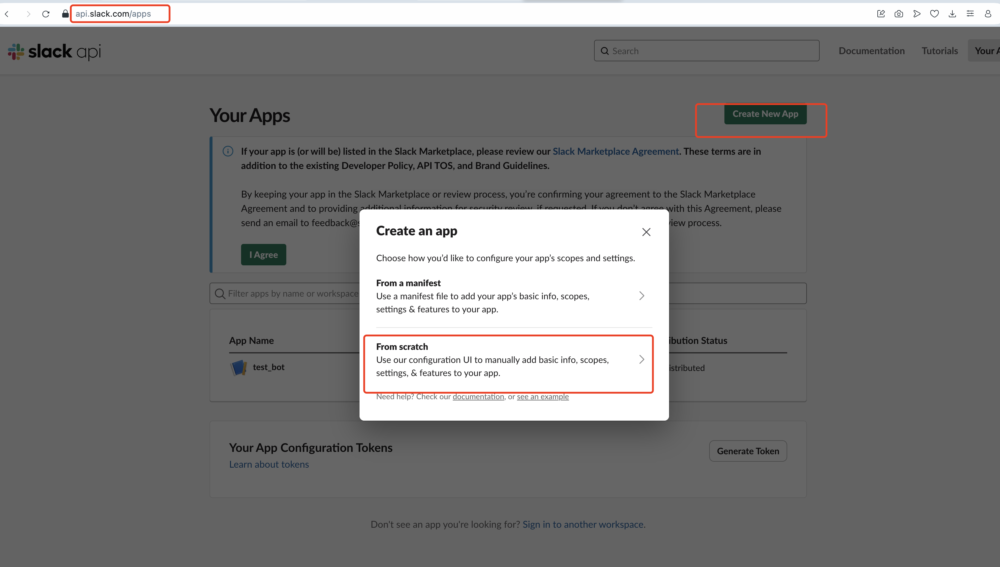
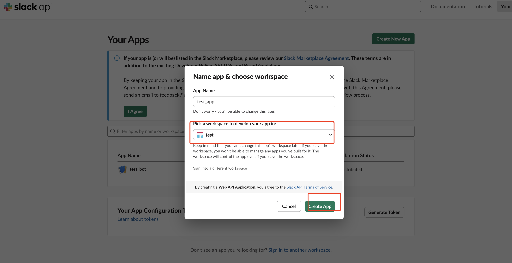
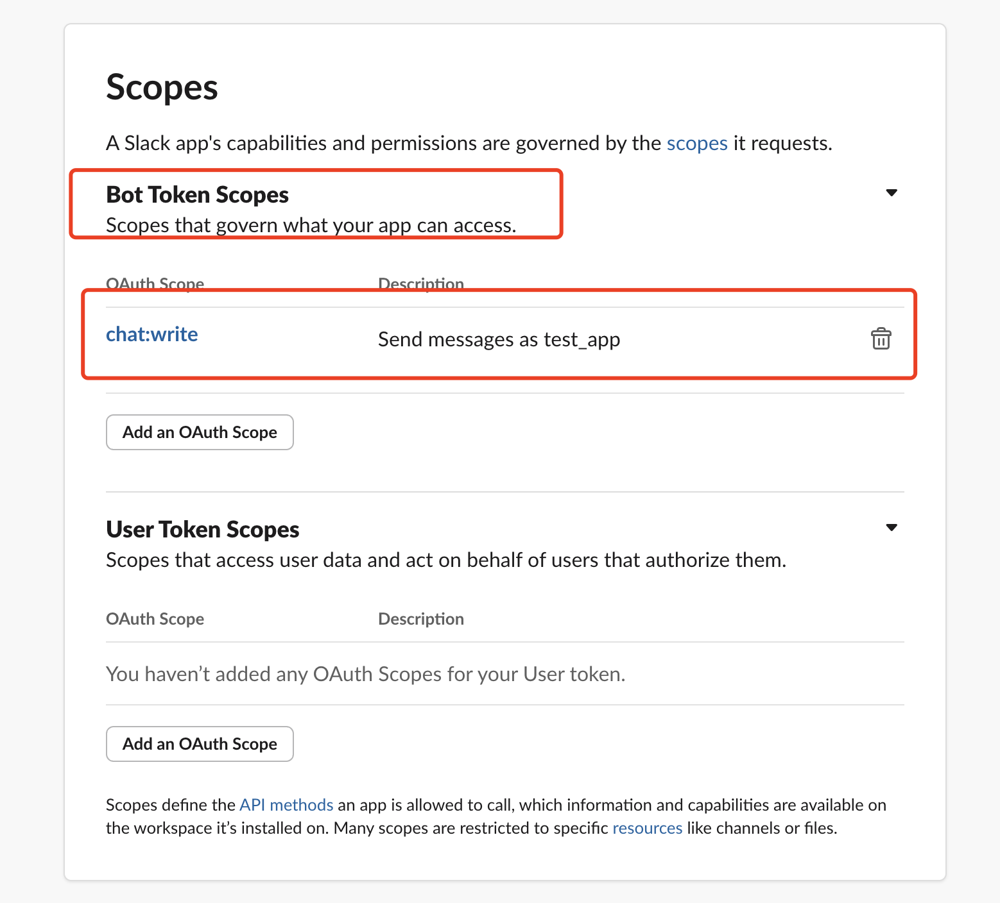
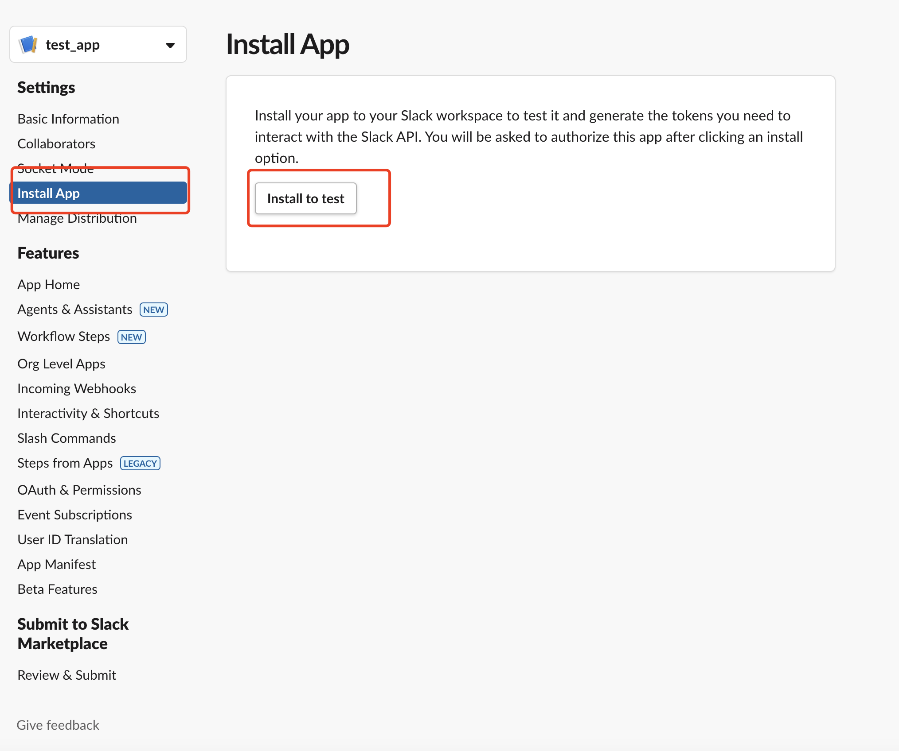
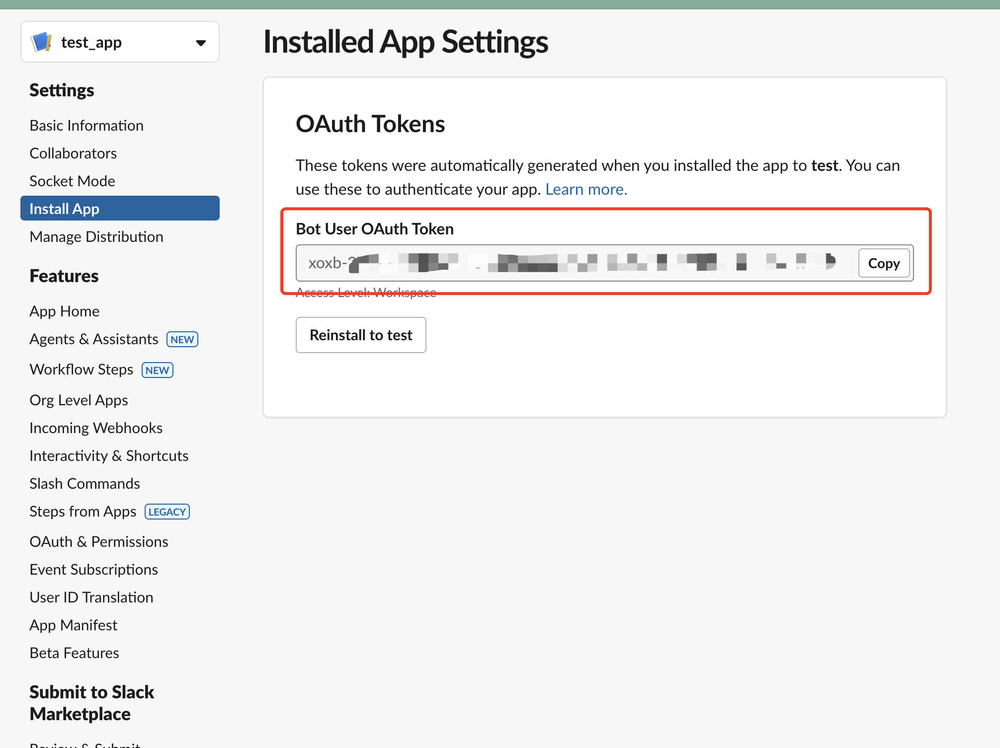
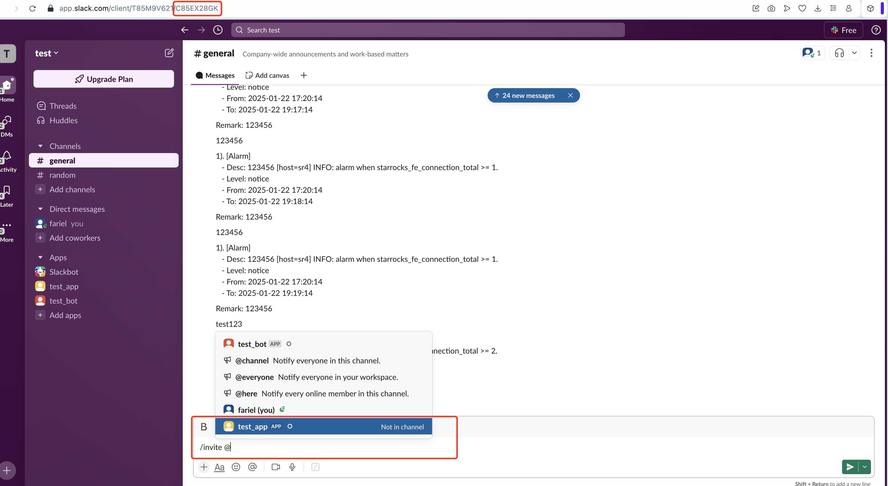
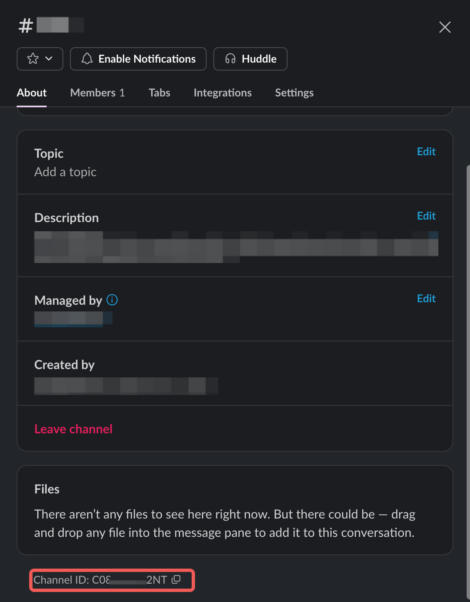
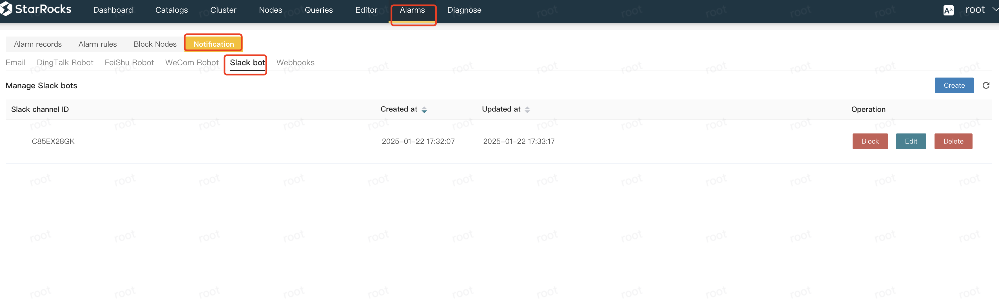
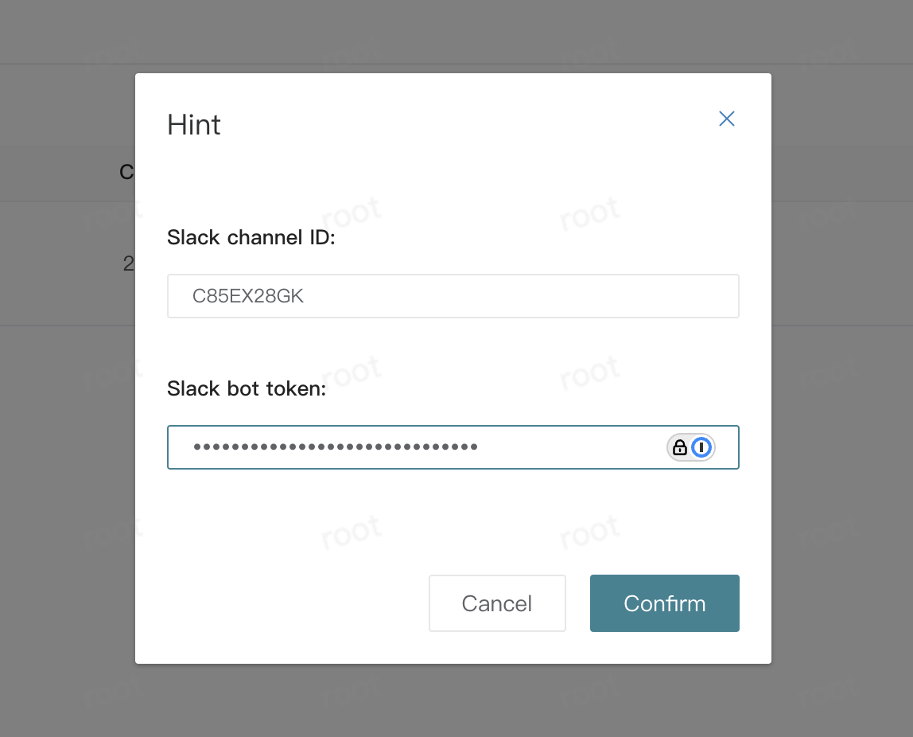

# Integrate Slack with CelerData for Alerts

Integrate Slack with CelerData Enterprise via webhook to receive alerts from your CelerData cluster.

## Configure Slack

Follow these steps to configure Slack:

1. Sign in to the [Slack API - App console](https://api.slack.com/apps).
2. Click **Create New App** on the top-right corner. On the dialog box that appears, select **From Scratch**.

   

3. On the dialog box that appears, enter a name for your App in the **App Name** field, and select the workspace from which you would like to receive the alerts from the **Pick a workspace to develop your app in** drop-down list. Then, click **Create App**.

   

4. Select the App you created. In the left-side navigation pane, choose **Oauth & Permissions**. On the **Scopes** tab of the **Oauth & Permissions** page, click the **Add an OAuth Scope** button in the **Bot Token Scopes** section, and select **chat:write** from the drop-down list.

   

5. In the left-side navigation pane, choose **Install App**. On the **Install App** page, click **Install to `{`your workspace`}`**. After the installation succeeds, copy the **Bot User OAuth Token** of your App.

   

   

6. Navigate to your workspace, and invite the bot to the channel that you want CelerData Manager to push alerts to by sending `/invite {your app name}` (for example, `/invite @test_app`) in the channel.

   

7. On the channel page, click the **More Actions** button on the top-right corner, and select **Open channel details**. On the channel detail tab, copy the **Channel ID**.

   

## Configure CelerData Enterprise

Follow these steps to configure CelerData Enterprise:

1. Navigate the **Notification** >  **Slack bot** on the **Alarms** tab of your CelerData Manager console, and click **Create**.

   

2. In the dialog box that appears, paste the channel ID to the **Slack channel ID** field, and the Bot User OAuth Token of your Slack App to the **Slack bot token** field, and click **Confirm**.

   

Now you can receive alerts from CelerData Enterprise in your Slack channel.
