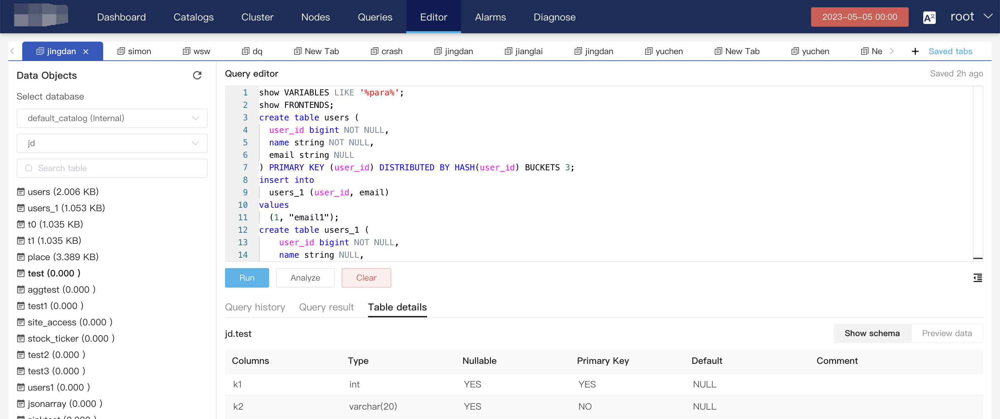

# Users and privileges
import TimezoneError from '../../../_assets/commonMarkdown/_timezone.mdx'

## Root password

CelerData Manager will generate a temporary root user and a random password. In the last step of deployment, a prompt displays that the password is ****** and you need to record the password. If you did not obtain the password in time, you can find it in the log, which records the temporary password. The command is as follows:

```Bash
cd  celerdata-manager-20201102/center
grep -r password /log/web/*
```

## SQL editor

You can connect to CelerData through a MySQL client, or use the Web UI of CelerData Manager to create cluster users and grant privileges to users. The following figure shows operations on the **Editor** page of the Web UI.



## Change password

We recommend that you change the root password after installation and keep the password safe. The following code snippet shows how to change the password.

```SQL
-- Syntax
ALTER USER user_identity [auth_option];

-- Parameters
user_identity: in the format of 'user_name'@'host'

auth_option: {
IDENTIFIED BY 'auth_string'
IDENTIFIED WITH auth_plugin
IDENTIFIED  WITH auth_plugin BY 'auth_string'
IDENTIFIED WITH auth_plugin AS 'auth_string'
}

--- Example
ALTER USER 'jack' IDENTIFIED BY '123456';
```

**Parameter description:**

- user_identity

  Consists of two parts, `user_name` and `host`, in the format of `username@'userhost'`. For the "host" part, you can use `%` for fuzzy match. If `host` is not specified, "%" is used by default, meaning that the user can connect from any host.

- auth_option

  Specifies the authentication method. Currently, the following authentication methods are supported: mysql_native_password and authentication_ldap_simple.

## Create roles/users

### Create role

You can grant privileges to a role and assign roles to a user. Users with the same role share the privileges granted to this role.

Create a role using the following command:

```SQL
--- Create role
CREATE ROLE role1;
--- Query the created roles
SHOW ROLES;
```

### Create user

```SQL
-- Syntax
CREATE USER user_identity [auth_option] 
[DEFAULT ROLE 'role_name'];

-- Parameters
user_identity:'user_name'@'host'

auth_option: {
    IDENTIFIED BY 'auth_string'
    IDENTIFIED WITH auth_plugin
    IDENTIFIED WITH auth_plugin BY 'auth_string'
    IDENTIFIED WITH auth_plugin AS 'auth_string'
}

-- Example: Create a user and assign a default role to the user.
CREATE USER 'jack'@'%' IDENTIFIED BY '12345' DEFAULT ROLE 'my_role';
```

### Parameter description:

- **CREATE USER**
  -  Creates a CelerData user. In CelerData, a user_identity uniquely identifies a user.
- **user_identity**
  -  Consists of two parts, `user_name` and `host`, in the format of `username@'userhost'`. For the "host" part, you can use `%` for fuzzy match. If `host` is not specified, "%" is used by default, meaning that the user can connect from any host.
- **auth_option**
  -  Specifies the authentication method. Currently, the following authentication methods are supported: mysql_native_password and authentication_ldap_simple.
- **DEFAULT ROLE**
  -  If a role is specified, the privileges of the role will be automatically granted to the newly created user. If not specified, the user does not have any privileges by default. The specified role must already exist. You can refer to [CREATE ROLE](https://docs.starrocks.io/en-us/3.0/sql-reference/sql-statements/account-management/CREATE ROLE) for more information.

## Delete roles/users

You can delete a role/user using the following command:

```SQL
  -- Delete a role.
  DROP ROLE role1;
  -- Delete a user.
  DROP USER 'jack'@'192.%'
```

## Grant privileges

You can grant privileges to a user or a role using the following commands:

```SQL
GRANT privilege_list ON db_name[.tbl_name] TO user_identity [ROLE role_name];

GRANT privilege_list ON RESOURCE resource_name TO user_identity [ROLE role_name];

-- Grant the USAGE privilege on 'spark_resource' to user 'jack'@'%'.
GRANT USAGE_PRIV ON RESOURCE 'spark_resource' TO 'jack'@'%';

-- Grant the USAGE_PRIV privilege on 'spark_resource' to role 'my_role'.
GRANT USAGE ON RESOURCE 'spark_resource' TO ROLE 'my_role';

-- Query privileges of all users.
SHOW ALL GRANTS; 

--- Query privileges of a specified user.
SHOW GRANTS FOR jack@'%';

-- Query privileges of the current user.
SHOW GRANTS;
```

**Parameter description:**

- **privilege_list**

The privileges that can be granted to a user or a role. If you want to grant multiple privileges at a time, separate the privileges with commas (`,`). The following privileges are supported:

- `NODE_PRIV`: the privilege to manage cluster nodes such as adding nodes and decommissioning nodes. Only the root user has this privilege. Do not grant this privilege to other users.
- `ADMIN_PRIV`: all privileges except `NODE_PRIV`.
- `GRANT_PRIV`: the privilege for performing operations such as creating users and roles, deleting users and roles, granting privileges, revoking privileges, and setting passwords.
- `SELECT_PRIV`: the privilege to read data from databases and tables.
- `LOAD_PRIV`: the privilege to load data into databases and tables.
- `ALTER_PRIV`: the privilege to change schemas of databases and tables.
- `CREATE_PRIV`: the privilege to create databases and tables.
- `DROP_PRIV`: the privilege to delete databases or tables.
- `USAGE_PRIV`: the privilege to use resources.

`ALL `and `READ_WRITE` in earlier versions will be converted to `SELECT_PRIV, LOAD_PRIV, ALTER_PRIV, CREATE_PRIV, DROP_PRIV`; `READ_ONLY `will be converted to `SELECT_PRIV`.

The preceding privileges can be classified into the following three categories:

- Node privilege: `NODE_PRIV`
- Database and table privilege: `SELECT_PRIV`, `LOAD_PRIV`, `ALTER_PRIV`, `CREATE_PRIV`, and `DROP_PRIV`
- Resource privilege: `USAGE_PRIV`

StarRocks implements a new role-based access control (RBAC) system from v3.0 in which the privileges are renamed and new privileges are addd. You can refer to [Privileges supported by StarRocks](https://docs.starrocks.io/en-us/3.0/administration/privilege_item).

**db_name [.tbl_name]**

The database and table name. This parameter supports the following three formats:

- `.`: indicates all databases and tables. If this format is specified, the global privilege is granted.
- `db.*`: indicates a specific database and all tables in this database.
- `db.tbl`: indicates a specific table in a specific database.

> Note: When you use the `db.*` or `db.tbl` format, you can specify a database or a table that does not exist.

**resource_name**

The resource name. This parameter supports the following two formats:

- `*`: indicates all the resources.
- `resource`: indicates a specific resource.

> Note: When you use the `resource` format, you can specify a resource that does not exist.

**user_identity**

This parameter contains two parts: `user_name` and `host`. `user_name` indicates the user name. `host` indicates the IP address of the user. You can leave `host` unspecified or you can specify a domain for `host`. If you leave `host` unspecified, `host` defaults to `%`, which means you can access from any host. If you specify a domain for `host`, it may take one minute for the privilege to take effect. The `user_identity` parameter must be created by the CREATE USER statement.

**role_name**

The role name.

## **Revoke privileges**

You can revoke privileges from specified users or roles.

```SQL
REVOKE privilege_list ON db_name[.tbl_name] FROM user_identity [ROLE role_name];

REVOKE privilege_list ON RESOURCE resource_name FROM user_identity [ROLE role_name];

-- Revoke a privilege on a database from a user.
REVOKE SELECT_PRIV ON db1.* FROM 'jack'@'192.%';

-- Revoke user jack's privilege to use a resource.
REVOKE USAGE_PRIV ON RESOURCE 'spark_resource' FROM 'jack'@'192.%';
```

**Parameter description:**

**user_identity**

The usage is the same as the preceding description. The `user_identity` parameter must be created by the CREATE USER statement.  If you specify a domain for `host`, it may take one minute for the privilege to take effect. You can also revoke a privilege from a specified ROLE, and the role must exist.

## **Set user properties**

You can set user properties, including resources allocated to users.

```SQL
SET PROPERTY [FOR 'user'] 'key' = 'value' [, 'key' = 'value'];
-- Modify the maximum number of connections of user jack to 1000.
SET PROPERTY FOR 'jack' 'max_user_connections' = '1000';
-- Modify cpu_share of jack to 1000.
SET PROPERTY FOR 'jack' 'resource.cpu_share' = '1000';
```

The user properties here mean the properties for users, not for user_identity. For example, if two users, 'jack'@'%' and 'jack'@'192.%', are created using CREATE USER, then the SET PROPERTY statement can only be used for user jack, not 'jack'@'%' or 'jack'@'192.%'.

**key:**

Properties for superuser:

- max_user_connections: maximum number of connections
- resource.cpu_share: CPU quota

Properties for common users:

- quota.normal: quotas for normal users
- quota.high: quotas for high-level users 
- quota.low: quotas for low-level users
