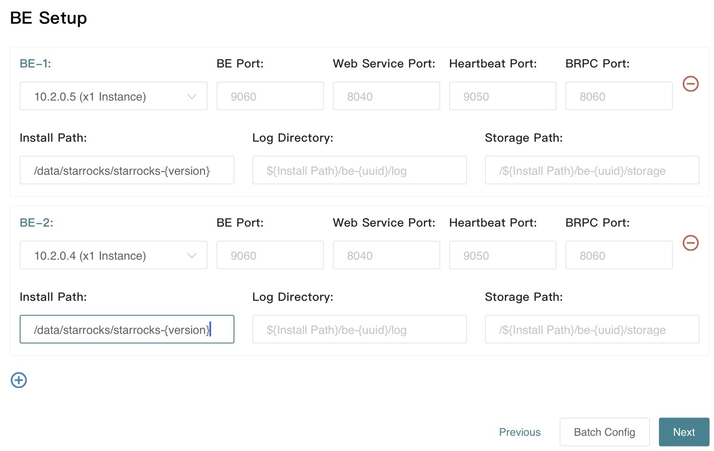

# Deploy a StarRocks cluster

import TimezoneError from '../_assets/commonMarkdown/_timezone.mdx'

1. Access the Web interface and configure a MySQL database for storing the management, query, and alerting information of CelerData Enterprise. 

:::note
If you have multiple CelerData clusters, we strongly recommend that you configure different MySQL accounts for different clusters to prevent unexpected issues caused by incorrect configurations.
:::

1. After the configuration is complete, click **Test Connection.** If the test is successful (**OK** is displayed at the top of the page), click **Next**.
2. Specify the nodes to deploy, and the installation directories of **Agent** and **Supervisor**. Enter the internal network IP addresses for **Host IP** and use the default values for other parameters.

- **Host** **IP**: You can configure multiple IP addresses at a time. Separate multiple IP addresses with semicolons (;).
- Supervisor is used to manage the start and stop of processes.
- Agent is responsible for collecting statistical information of the machine.

All the installations are performed in the user environment and will not affect system environment.

**Notes**

- The system has two types of **Supervisors**: one is used to manage Agent, BE, FE, and Broker; the other is used to manage **Web** and **Center service**. 
- If you want to deploy Agent, FE, BE, and Broker on the same machine where **Web** and **Center service** are deployed, check whether Supervisor ports conflict with an existing port. If there is a conflict, perform the following operations: Modify the previously configured `bin/install.sh -s ${new_port}` to specify the Supervisor port required by CelerData Enterprise, and make sure that all the Supervisors and Agents that manage FE, BE, and broker use the default ports.  

1. Click **Next**. In the displayed dialog box, select **Deploy a new Cluster** or **Migrate from an existing Cluster**. 

- If you have deployed FEs and BEs, but not CelerData Manager, click **Migrate from an existing Cluster**.
- If this is your first-time deployment, that is, no FE/BE programs are running on your machine, click **Deploy a new Cluster**.

## Migrate an existing cluster

:::note
This step is required if you upgrade your cluster from StarRocks open-source to Enterprise Edition. If you want to install a new cluster, perform the steps in 1.2.2 "Install a new cluster."
:::

1. **Obtain the information of the original cluster.**

If you connect to StarRocks via the MySQL client, run the following SQL commands to view and confirm the information of the FE, BE, and broker.

```SQL
SHOW frontends;
SHOW backends;
SHOW broker;
```

Pay special attention to the following information:

- Quantity, IP address, and version of FE, BE, and broker
- Information of leader, follower, and observer FEs

1. Disable the daemon (such as Supervisor) of the original StarRocks cluster and start it using a script. 

:::note Important
If this step is not performed, the Supervisor of the new CelerData Manager will conflict with the old Supervisor, causing the installation to fail.
:::

Assume that the installation directories are all under `~/CelerData`. If the actual directories are different from this, modify the directories.

```Bash
#### Use a script to start BE.
# Check whether BE and Supervisor are started.
echo -e "\n==== BE ====" && ps aux | grep be && echo -e "\n==== supervisor ====" && ps aux | grep supervisor

cd ~/CelerData/be
# Turn off Supervisor and start it using a script.
./control.sh stop && sleep 3 && bin/start_be.sh --daemon

# Use the above echo command to check whether BE and Supervisor are started.

# Check BE startup on your MySQL client.
mysql> SHOW backends;


#### Use a script to start FE.
echo -e "\n==== FE ====" && ps aux | grep fe && echo -e "\n==== supervisor ====" && ps aux | grep supervisor

cd ~/CelerData/fe 
# Turn off Supervisor and start it using a script.
./control.sh stop && sleep 2 && bin/start_fe.sh --daemon

# Use the echo command to check whether FE and Supervisor are started.

# Modify the configuration file and run it again.
sed -i 's/DATE = `date +%Y%m%d-%H%M%S`/DATE = "$(date +%Y%m%d-%H%M%S)"/g' conf/fe.conf

# Check FE startup in your MySQL client.
mysql> SHOW frontends;


#### Use a script to start broker.
echo -e "\n==== broker ====" && ps aux | grep broker &&
echo -e "\n==== supervisor ====" && ps aux | grep supervisor

cd ~/CelerData/apache_hdfs_broker
./control.sh stop && sleep 2 && bin/start_broker.sh --daemon

# Check broker startup in MySQL.
mysql> SHOW broker;

#### Check Supervisor again.
ps aux | grep supervisor
```

1. Ensure that the cluster enters the "non-supervisor daemons" state before you continue with the following steps.
2. Fill in the FE, BE, and broker installation directories. 

This operation reinstalls FE and BE, and the configuration files are obtained from the metadata of the original FE.

FE meta and BE storage retain the original data path.

LOG uses the path in the new directory.

Udf, syslog, audit log, small_files, and plugin_dir use the paths in the new directory.

When you migrate FE, BE, and broker, configure the upgrade paths respectively. (The paths and installation directories of the original instance are required) .

- Path before upgrade: full path to FE, BE, and broker, such as `/home/CelerData/fe`. 
- Installation directory: the overall installation directory, such as `/home/CelerData-manager-xxx`. 

You can also perform the configurations in batches.

1. Click **Next.** On the page that is displayed, click **Migrate All** to perform automatic migration. You can also click **Migrate Next** to migrate the nodes one by one. 
2. Click **Next** to configure **Center service**. 

**Center service** pulls information from the Agent, summarizes and stores the information, and provides monitoring and alarming services. **Mail service** is the mailbox that receives notifications, which can be left blank and configured later.

Time zone errors may occur when you configure **Center service**. If this error occurs:

<TimezoneError />

1. Click **Finish.** You will be automatically redirected to the web login page. The default account is **root** and the password is empty. The following page will be displayed after the login. 
2. Copy the code string in the figure and send it to the CelerData technical support personnel, who will return a license string. After you enter the license string, click **OK** to use CelerData Enterprise. 

After this operation is complete, CelerData Manager is successfully installed and you can use the default user `root`. The initial password for `root` is generated during the install and is displayed. The password is also in the log:

```bash
grep -r password manager/center/log/web/*
```

## Install a new cluster

:::tip Cluster architecture
Before you deploy a new cluster read about the [architecture differences](../introduction/Architecture.md) between shared-nothing and shared-data clusters.
:::


1. Install **FE** In the **Configure FE Instance** dialog box, configure the following parameters:
   1. **FE** **Followers**: We recommend that you configure 1 or 3 follower FEs. 
   2. **FE** **Observers:** You can leave observer FEs unspecified. You can also add observer FEs when the query pressure increases.   
   3. **Meta** **Dir:** metadata directory of StarRocks. Similar to manual installation, we recommend that you configure separate metadata and FE log directories. 
   4. Use default values for the installation directory, log directory, and port numbers. 

1. Install **BE**

  

1. Install broker if needed.

1. Install **Center service**

**Center service** pulls information from the Agent, summarizes and stores the information, and provides monitoring and alarming services. **Mail service** is the mailbox that receives notifications, which can be left blank and configured later.

Time zone errors may occur when you configure **Center service**. If this error occurs:

<TimezoneError />

After this operation is complete, the StarRocks cluster is successfully installed and you can use the default user **root** and an empty password to log in to CelerData Manager (you can change the password and add an account by referring to the related operations in MySQL).

CelerData Manager will generate a temporary root user and a random password. In the last step of deployment, a prompt displays that the password is ****** and you need to record the password. If you did not obtain the password in time, you can find it in the log, which records the temporary password. The command is as follows:

```SQL
grep -r password manager/center/log/web/*
```

## Enable SSL

You can skip this step if you do not need SSL configuration.

1. Add `ssl_cert` and `ssl_key` lines to:

   1.  `<celerdata-manager installation dir>/center/conf/web.conf`:

   2. ```Shell
      [web]
      port =
      session_secret =
      session_name =
      ssl_cert =
      ssl_key =
      ```

   3.  `ssl_key` is the absolute path of `PEM encoded certificate private key`.

   4.  `ssl_cert` is the absolute path of `PEM encoded certificate body`.

2. In the installation directory of CelerData Manager, run `./centerctl.sh restart web` to restart Web UI and run `./centerctl.sh status web` to check the status of Web UI. If the state displays RUNNING, the restart succeeds.

3. Access `https://mgr_host:port` in your browser.
