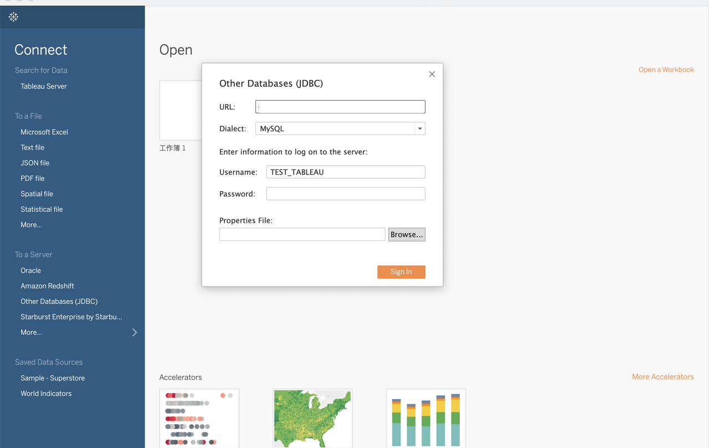

# Tableau Desktop

Tableau Desktop supports querying and visualizing both internal data and external data in StarRocks.

Create a database in Tableau Desktop:



Take note of the following points:

- Select **Other Databases(****JDBC****)** as the data source.
- For **Dialect**, select **MySQL**.
- For **URL**, enter a URL in the MySQL URI format as below:

  ```SQL
  jdbc:mysql://<Host>:<Port>/<Catalog>.<Databases>
  ```

  The parameters in the URL are described as follows:

  - `Host`: the FE host IP address of your StarRocks cluster.
  - `Port`: the FE query port of your StarRocks cluster, for example, `9030`.
  - `Catalog`: the target catalog in your StarRocks cluster. Both internal and external catalogs are supported.
  - `Database`: the target database in your StarRocks cluster. Both internal and external databases are supported.
- Configure **Username** and **Password**.
  - **Username**: the username that is used to log in to your StarRocks cluster, for example, `admin`.
  - **Password**: the password that is used to log in to your StarRocks cluster.
