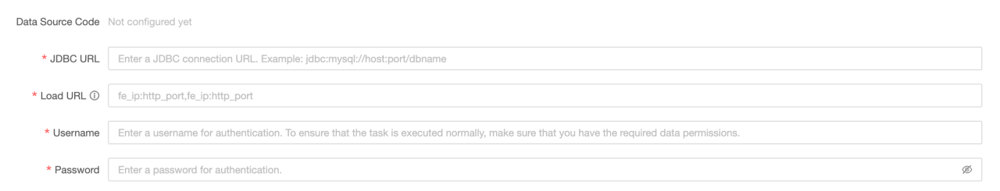
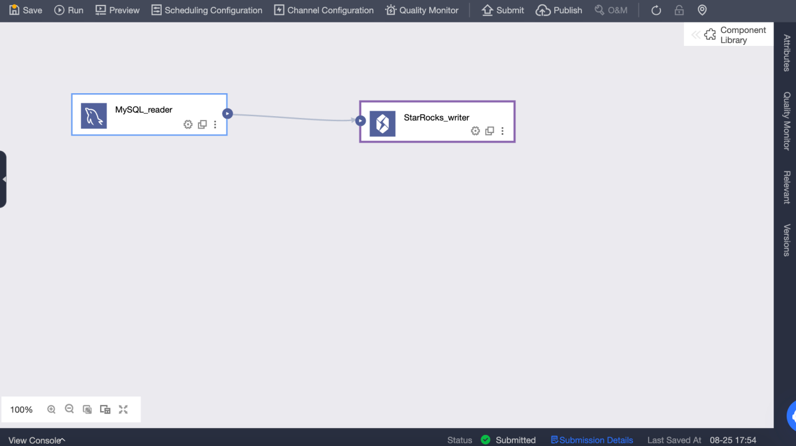
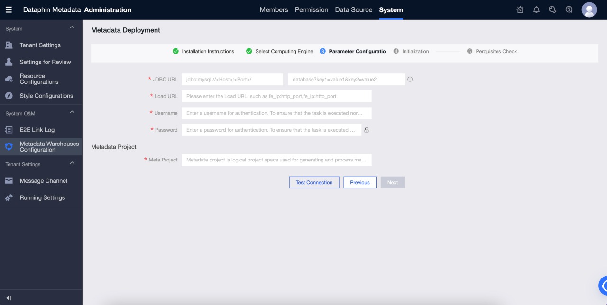
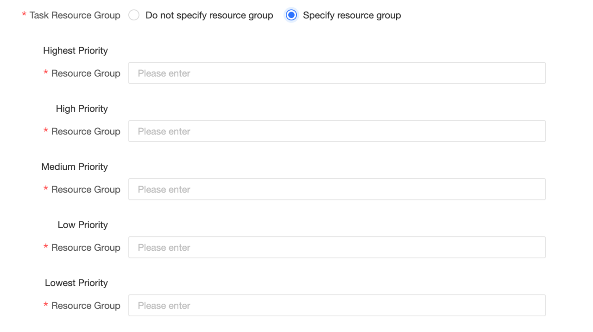

# Dataphin

Dataphin is a cloud-based output of the internal practices of Alibaba Group's OneData data governance methodology. It provides one-stop solution of data integration, construction, management and utilization throughout the entire lifecycle of big data, aming to helping enterprises significantly improve the level of data governance and build an enterprise-level data middle platform that is of high and reliable quality, convenience consumption, and safe and economical production. Dataphin provides a variety of computing platform support and scalable open capabilities to meet the platform technical architecture and specific requirements of enterprises in various industries.

There are several ways to integrate Dataphin with StarRocks:

- As the source or destination data source for data integration. Data can be read from StarRocks and push into other data sources, or data can be pull from other data sources and written into StarRocks.

- As a source table（unbounded scan）, dimension table (bounded scan), or result table(streaming sink and batch sink) of flink SQL and datastram development.

- As a data warehouse or a datamart. StarRocks can be registered as a compute source, which can be used for SQL scripts development, scheduling, data quality detection, security identification, and other data research and governance tasks.

## Data integration

You can create StarRocks data sources and use StarRocks data sources as source databases or destination databases in offline integration tasks. The procedure is as follows:

### Create a StarRocks data source

#### Basic information

- **Name**: Required. Enter a data source name. It can only contain Chinese characters, letters, numbers, underscores (_), and hyphens (-). It cannot exceed 64 characters in length.

- **Data source code**: Optional. After you configure the data source code, you can use the `data source code.table` or `data source code.schema.table` format to reference the Flink SQL in the data source. If you want to automatically access the data source in the corresponding environment, use `${data source code}.table` or `${data source code}.schema.table` format access.

  > **NOTE**
  >
  > Currently, only MySQL, Hologres, and MaxCompute data sources are supported.

- **Support scenerios**：The scenerios that data source can be applied in.

- **Description**: Optional. You can enter a brief description of the data source. A maximum of 128 characters are allowed.

- **Environment**: If the business data source distinguishes between production data source and development data source, choose **Prod and Dev**. If the business data source does not distinguish between production and development data sources, choose **Prod**.

- **Tags**: You can select tags to label data sources.

#### Configuration information

- **JDBC URL**: Required. The format is `jdbc:mysql://<host>:<port>/<dbname>`. `host` is the IP address of the FE (Front End) host in the StarRocks cluster, `port` is the query port of FE, and `dbname` is the database name.

- **Load URL**: Required. The format is `fe_ip:http_port;fe_ip:http_port`. `fe_ip` is the host of the FE (Front End), and `http_port` is th port of the FE.

- **Username**: Required. The username of the database.

- **Password**: Required. The password of the database.

#### Advanced settings

- **connectTimeout**: the connectTimeout  (in ms) of the database. The default value is 900000 milliseconds (15 minutes).

- **socketTimeout**: the socketTimeout  (in ms) of the database. The default value is 1800000 milliseconds (30 minutes).

### Read data from StarRocks data sources and write data to other data sources

#### Drag the StarRocks input component to the offline integration task canvas

#### StarRocks input component configuration

- **Step name**: Enter an appropriate name based on the scenario and location of the current component.

- **Data source**: Select the StarRocks data source or project created on Dataphin. Read permission of the data source is required. If there is no satisfied data source, you can add a data source or apply for relevant permissions.

- **Source table**: Select a single table or multiple tables with the same table structure as the input.

- **Table**: Select the table in the StarRocks data source from the drop-down list.

- **Split key**: Used with concurrency configuration. You can use a column in the source data table as the split key. It is recommended to use a primary key or an indexed column as the split key.

- **Batch number**: The number of data records extracted in a batch.

- **Input Filtering**: Optional.

  In the following two cases, you need to fill in the filter information:
  
  - If you want to filter a certain part of data.
  - If you need to incrementally append data on a daily basis or obtain full data, you need to fill in the date whose value is set as the system time of Dataphin console. For example, a transaction table in the StarRocks and the transaction creation date of it is set as `${bizdate}`.

- **Output fields**: List the related fields based on the input table information. You can rename, remove, add, and move the fields again. In general, fields are renamed to increase the readability of downstream data or facilitate mapping of fields during output. Fields can be removed during the input stage because relevant fields are not needed in application scenarios. The order of fields is changed to ensure that you can effectively merge data or map output data by mapping fields with different names in the same line when multiple input data are merged or output at the downstream side.

#### Select and configure an output component as the destination data source

### Read data from other data sources and write data to StarRocks data sources

#### Configure the input component in the offline integration task, and select and configure the StarRocks output component as the destination data source

#### Configure StarRocks output component

- **Step Name**: enter an appropriate name based on the scenario and location of the current component.

- **Data Source**: Select the Dataphin data source or project created in the StarRocks. The data source that the configuration personnel have the synchronous write permission. If the data source is not satisfied, you can add a data source or apply for relevant permissions.

- **Table**: Select the table in the StarRocks data source from the drop-down list.

- **Generate Target Table by One Click**: If you have not created a target table in StarRocks data source, you can automatically obtain the name, type, and remarks of the fields read from the upstream, and generate a table creation statement. Click to generate a target table with one click.

- **CSV import column delimiter**: Use StreamLoad CSV to import. You can configure the CSV import column delimiter. Default value `\t`. Do not specify the default value here. If the data itself contains `\t`, you must use other characters as delimiters.

- **CSV import row delimiter**: Use StreamLoad CSV to import. You can configure the CSV import row delimiter. Default value: `\n`. Do not specify the default value here. If the data itself contains `\n`, you must use other characters as delimiters.

- **Parse Solution**: Optional. It is some special processing before or after the data is written. The preparation statement is executed before the data is written to the StarRocks data source, and the completion Statement is executed after the data is written.

- **Field Mapping**: You can manually select fields for mapping, or use name-based or position-based mapping to process multiple fields at a time based on the fields from upstream input and those in the destination table.

## Real-time Development

### Brief introduction

StarRocks is a fast and scalable real-time analysis Database. It is commonly used in real-time computing to read and write data to meet the needs of real-time data analysis and query. It is widely used in enterprise real-time computing scenarios. It can be used in real-time business monitoring and analysis, real-time user behavior analysis, real-time advertising bidding system, real-time risk control, anti-fraud, real-time monitoring and early warning and other application scenarios. By analyzing and querying data in real time, enterprises can quickly understand business conditions, optimize decisions, provide better services and protect their interests.

### StarRocks Connector

The StarRocks connector supports the following information:

| **Category**                                           | **Facts and figures**                       |
| ------------------------------------------------------ | ------------------------------------------- |
| Supported types                                        | Source Table, dimension table, result table |
| Running mode                                           | Stream mode and batch mode                  |
| Data format                                            | JSON and CSV                                |
| Special Metrics                                        | None                                        |
| API type                                               | Datastream and SQL                          |
| Support updating or deleting data in the result table? | Yes                                         |

### How to use it?

Dataphin supports StarRocks data sources as read and write targets for realtime compute. You can create StarRocks meta tables and use them for realtime compute tasks:

#### Create StarRocks meta table

1. Go to **Dataphin** > **R & D** > **Develop** > **Tables**.

2. Click **Create** to select a real-time compute table.

   

   - **Table type**: Select **Metatable**.

   - **Metatable**: Input the name of the meta table. The name immutable.

   - **Datasource**: Select a StarRocks data source.

   - **Directory**: Select the directory where you want to create a table.

   - **Description**: Optional.

   

3. After creating a meta table, you can edit the meta table, including modifying data sources, source tables, meta table fields, and configuring meta table parameters.

   

4. Submit the meta table.

#### Create Flink SQL task to write data from Kafka to StarRocks in real time

1. Go to **Dataphin** > **R & D** > **Develop** > **Computing Tasks**.

2. Click **Create Flink SQL task**.

   

3. Edit Flink SQL code and precompile It. Kafka meta table is used as an input table and StarRocks meta table as an output table.

   
​   

4. After the precompilation is successful, you can debug and submit the code.

5. Testing in the development environment can be performed by printing logs and writing test tables. The test tables can be set in Meta Tables > Properties > debugging test configurations.

   
   

6. After a task in the development environment runs normally, you can publish the task and the meta table used to the production environment.

   

7. Start a task in the production environment to write data from Kafka to StarRocks in real time. You can view the status and logs of each metric in the running analysis to learn about the task running status, or configure monitoring alerts for the task.

   
   

## Data warehouse or data mart

### Prerequisites

- The StarRocks version is 3.0.6 or later.

- Dataphin is installed and the Dataphin version is 3.12 or later.

- Statistics collection must be enabled. After the StarRocks is installed, collection is enabled by default. For more information, see [Gather statistics for CBO](../../using_starrocks/Cost_based_optimizer.md).

- StarRocks internal catalog (default catalog) is supported, and external catalog is not supported.

### Connection configuration

#### Metadata warehouse settings

Dataphin can present and display information based on metadata, including table usage information and metadata changes. You can use StarRocks to process and calculate metadata. Therefore, you need to initialize the metadata Computing Engine (metadata warehouse) before using it. The procedure is as follows:

1. Use an administrator account to log on to Dataphin metadata warehouse tenant

2. Go to Administration > System > Metadata Warehouse Configuration

   a. Click Start

   b. Select StarRocks

   c. Configure the parameters. After passing the test connection, click next.

   d. Complete meta warehouse initialization

   

Parameters are described as follows:

- **JDBC URL**: JDBC connection string, which is divided into two parts. For more information, see [MySQL JDBC URL format](https://dev.mysql.com/doc/connector-j/8.1/en/connector-j-reference-jdbc-url-format.html).

  - Part I: The format is `jdbc:mysql://<Host>:<Port>/`. `Host` is the IP address of the FE host in the StarRocks cluster. `Port` is the query Port of FE. Default value: `9030`.

  - Part Two: format is `database? key1 = value1 & key2 = value2`, where `database` is the name of the StarRocks database used for metadata calculation, which is required. The parameter after '?' is optional.

- **Load URL**：The format is `fe_ip:http_port;fe_ip:http_port`. `fe_ip` is host of FE (Front End), and `http_port` is th port of FE.

- **Username**: The username used to connect to the StarRocks.

  The user need to have read and write permissions on the database specified in the JDBC URL, and must have access permissions on the following databases and tables:

  - All table in Information Schema

  - _statistics_.column_statistics

  - _statistics_.table_statistic_v1

- **Password**: the password of the link of StarRocks.

- **Meta Project**: The name of the project used for metadata processing in Dataphin. It is only used within the Dataphin system. We recommend that you use `dataphin_meta` as the project name.

#### Create StarRocks project and start data development

To start data development, follow these steps:

1. Computing settings.

2. Create StarRocks computing source.

3. Create a project.

4. Create StarRocks SQL task.

##### Computing settings

The computing settings set the computing engine type and cluster address of the tenant. The detailed steps are as follows:

1. Log on to the Dataphin as a System Administrator or Super Administrator.

2. Go to **Administration** > **System** > **Computation Configuration**.

3. Select **StarRocks** and click **Next**.

4. Enter the JDBC URL and verify it. The format of the JDBC URL is `jdbc:mysql://<Host>:<Port>/`. `Host` is the IP address of the FE Host in the StarRocks cluster. `Port` is the query Port of FE. Default value: `9030`.

##### StarRocks Computing source

Computing source is a concept of Dataphin. Its main purpose is to bind and register Dataphin project space with StarRocks storage computing space (database). You must create a computing source for each project. The detailed steps are as follows:

1. Log on to the Dataphin as a system administrator or Super Administrator.

2. Go to **Planning** > **Engine**.

3. Click **Add Computing Engine** in the upper-right corner to create a computing source.

The detailed configuration information is as follows:

1. **Essential information**

   

   - **Computing Engine Type**: Select **StarRocks**.

   - **Computing Engine Name**: We recommend that you use the same name as the project to be created. For development projects, add the suffix `_dev`.

   - **Description**: Optional. Enter the description of the computing source.

2. **Configuration information**

   

   - **JDBC URL**: The format is `jdbc:mysql://<Host>:<Port>/`. `Host` is the IP address of the FE Host in the StarRocks cluster. `Port` is the query Port of FE. Default value: `9030`.

   - **Load URL**：The format is `fe_ip:http_port;fe_ip:http_port`. `fe_ip` is host of FE (Front End), and `http_port` is th port of FE.

   - **Username**: The username used to connect to the StarRocks.

   - **Password**: The password of StarRocks.

   - **Task Resource Group**: you can specify different StarRocks resource groups for tasks with different priorities. When you select do not specify Resource Group, the StarRocks engine determines the resource group to be executed. When you select specify Resource Group, tasks with different priorities are assigned to the specified resource group by the Dataphin.If a resource group is specified in the code of an SQL task or in the materialized configuration of a logical table, the configuration of the Resource Group of the compute source task is ignored when the task is executed.

   

##### Dataphin project

After you create a computing source, you can bind it to a Dataphin project. Dataphin project manages project members, StarRocks storage and computing space, and manages and maintains computing tasks.

To create a Dataphin project, follow these steps:

1. Log on to the Dataphin as a System Administrator or Super Administrator.

2. Go to **Planning** > **Project Management**.

3. Click **Create project** in the upper-right corner to create a project.

4. Enter the basic information and select the StarRocks engine created in the previous step from the offline engine.

5. Click **Create**.

##### StarRocks SQL

After you create a project, you can create a StarRocks SQL task to perform DDL or DML operations on the StarRocks.

The detailed steps are as follows:

1. Go to **R & D** > **Develop**.

2. Click '+' in the upper-right corner to create StarRocks SQL task.

   

3. Enter the name and scheduling type to create an SQL task.

4. Enter SQL in the editor to start DDL and DML operations on StarRock.

   
