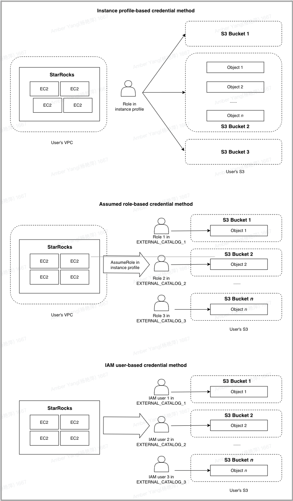

# Authenticate to AWS resources

## Understand credential methods used by StarRocks to authenticate AWS resources

### Instance profile-based credential

The instance profile-based credential method allows you to directly grant privileges on AWS resources to your StarRocks cluster. In theory, any cluster user who can log in to the cluster can perform permitted actions on your AWS resources according to the AWS IAM policies you have configured. The typical scenario for this use case is that you do not need any AWS resource access control between multiple cluster users in the cluster. This credential method means no isolation is required within the same cluster.

However, this credential method still can be seen as a cluster-level safe access control solution, because whoever can log in to the cluster is controlled by the cluster user `admin`.

### Assumed role-based credential

Unlike the instance profile-based credential method, which is a cluster-level access control solution, the assumed role-based credential method is a catalog-level data source access control solution that works based on the mechanism of assuming a role in AWS IAM. For more information, see [Assuming a role](https://docs.aws.amazon.com/awscloudtrail/latest/userguide/cloudtrail-sharing-logs-assume-role.html).

Specifically, you can create different catalogs which can access different AWS S3 resources, such as S3 buckets `S3-BUCKET-1` and `S3-BUCKET-2`. This means you can access a different data source by changing the catalog of the current SQL session.

Further, if `admin` grants privileges on different catalogs to different users, this will achieve an access control solution just like allowing different users within the same cluster to access different data sources.

### IAM user-based credential

The IAM user-based credential method is also a catalog-level data source access control solution, which works based on the mechanism of IAM user. You can configure different catalogs to assume different IAM users.

## Preparation about the credential in AWS IAM

### If you choose instance profile-based credential

You need to create an IAM policy like below to grant access to your AWS resource, and then attach the policy to the IAM role associated with the EC2 instance on which your StarRocks cluster runs.

#### Access AWS S3

If you choose AWS S3 as storage, StarRocks accesses your S3 bucket based on the following IAM policy:

> **NOTICE**
>
> Remember to specify the name of your S3 bucket in the `Resource` element.

```JSON
{
    "Version": "2012-10-17",
    "Statement": [
        {
            "Sid": "s3",
            "Effect": "Allow",
            "Action": ["s3:GetObject"],
            "Resource": ["arn:aws:s3:::<bucket_name>/*"]
        },
        {
            "Sid": "s3list",
            "Effect": "Allow",
            "Action": ["s3:ListBucket"],
            "Resource": ["arn:aws:s3:::<bucket_name>"]
        }
        ]
}
```

#### Access AWS Glue

If you choose AWS Glue as metastore, StarRocks accesses your AWS Glue Data Catalog based on the following IAM policy:

```JSON
{
     "Version": "2012-10-17",
     "Statement": [
         {
             "Effect": "Allow",
             "Action": [
                "glue:GetDatabase",
                "glue:GetDatabases",
                "glue:GetPartition",
                "glue:GetPartitions",
                "glue:GetTable",
                "glue:GetTableVersions",
                "glue:GetTables",
                "glue:GetConnection",
                "glue:GetConnections",
                "glue:GetDevEndpoint",
                "glue:GetDevEndpoints",
                "glue:BatchGetPartition"
            ],
            "Resource": [
                "*"
            ]
        }
    ]
}
```

### If you choose assumed role-based credential

You need to create an assumed role (for example, named `s3_role_test`) and attach the policy provided in the "[Access AWS S3](../integrations/authenticate_to_aws_resources.md#access-aws-s3)" section of this topic to it. This assumed role will be assumed by the IAM role associated with the EC2 instance on which your StarRocks cluster runs.

Also, if you choose AWS Glue as metastore, you can create another assumed role (for example, named `glue_role_test`) and attach the policy provided in the "[Access AWS Glue](../integrations/authenticate_to_aws_resources.md#access-aws-glue)" section of this topic to it.

After you finish this, you need to configure a trust relationship between the assumed role and the IAM role associated with the EC2 instance on which your StarRocks cluster runs.

#### Configure a trust relationship

First, create and attach a new IAM policy as shown below to your assumed role `s3_role_test`:

> **NOTICE**
>
> Remember to specify the ARN of the IAM role associated with the EC2 instance on which your StarRocks cluster runs in the `AWS` field under the `Principal` element.

```JSON
{
    "Version": "2012-10-17",
    "Statement": [
        {
            "Effect": "Allow",
            "Principal": {
                "AWS": "<cluster_EC2_iam_role_ARN>"
            },
            "Action": "sts:AssumeRole"
        }
    ]
}
```

Then, create and attach a new IAM policy as shown below to the IAM role associated with the EC2 instance on which your StarRocks cluster runs:

> **NOTICE**
>
> Remember to specify the ARN of your assumed role `s3_role_test` in the `Resource` element. You need to specify the ARN of your assumed role `glue_role_test` only when you choose AWS Glue as metastore and have created another assumed role named `glue_role_test` for AWS Glue.

```JSON
{
    "Version": "2012-10-17",
    "Statement": [
        {
            "Effect": "Allow",
            "Action": ["sts:AssumeRole"],
            "Resource": [
                "<ARN of s3_role_test>",
                "<ARN of glue_role_test>"
            ]
        }
    ]
}
```

### If you choose IAM user-based credential

You need to create an IAM user and attach the policy provided in the "[Access AWS S3](../integrations/authenticate_to_aws_resources.md#access-aws-s3)" or "[Access AWS Glue](../integrations/authenticate_to_aws_resources.md#access-aws-glue)" section of this topic to it.

## Comparison between credential methods

The following figure provides a high-level explanation of the differences in mechanism between instance profile-based credential, assumed role-based credential, and IAM user-based credential in StarRocks.



## Build connections with AWS resources

### Authentication parameters for accessing AWS S3

- If you use the instance profile-based credential method to access AWS S3, set `aws.s3.use_instance_profile` to `true` when you create external catalogs or file external tables or when you ingest, back up, or restore data from AWS S3.
- If you use the assumed role-based credential method to access AWS S3, set `aws.s3.use_instance_profile` to `true` and configure `aws.s3.iam_role_arn` as the assumed role's ARN that you use to access AWS S3 when you create external catalogs or file external tables or when you ingest, back up, or restore data from AWS S3.
- If you use the IAM user-based credential method to access AWS S3, set `aws.s3.use_instance_profile` to `false` and configure `aws.s3.access_key` and `aws.s3.secret_key` as the access key and secret key of your AWS IAM user when you create external catalogs or file external tables or when you ingest, back up, or restore data from AWS S3.

### Authentication parameters for accessing AWS Glue

- If you use the instance profile-based credential method to access AWS Glue, set `aws.s3.use_instance_profile` to `true` when you create external catalogs.
- If you use the assumed role-based credential method to access AWS Glue, set `aws.s3.use_instance_profile` to `true` and configure `aws.s3.iam_role_arn` as the assumed role's ARN that you use to access AWS S3 when you create external catalogs.
- If you use the IAM user-based credential method to access AWS Glue, set `aws.glue.use_instance_profile` to `false` and configure `aws.glue.access_key` and `aws.glue.secret_key` as the access key and secret key of your AWS IAM user when you create external catalogs.

## Integration examples

### External catalog

Creating an external catalog in your StarRocks cluster means building integration with the target data lake system, which is composed of two key components:

- File storage like AWS S3 to store table files
- Metastore like Hive metastore or AWS Glue to store the metadata and locations of table files

StarRocks supports the following types of catalogs:

- [Delta Lake catalog](../data_source/catalog/deltalake_catalog.md)
- [Hive catalog](../data_source/catalog/hive_catalog.md)
- [Hudi catalog](../data_source/catalog/hudi_catalog.md)
- [Iceberg catalog](../data_source/catalog/iceberg_catalog.md)

The following examples create a Hive catalog named `hive_catalog_hms` or `hive_catalog_glue`, depending on the type of metastore you use, to query data from your Hive cluster. For detailed syntax and parameters, see [Hive catalog](../data_source/catalog/hive_catalog.md).

#### If you choose instance profile-based credential

- If you use Hive metastore in your Hive cluster, run a command like below:

  ```SQL
  CREATE EXTERNAL CATALOG hive_catalog_hms
  PROPERTIES
  (
      "type" = "hive",
      "aws.s3.use_instance_profile" = "true",
      "aws.s3.region" = "us-west-2",
      "hive.metastore.uris" = "thrift://xx.xx.xx:9083"
  );
  ```

- If you use AWS Glue in your Amazon EMR Hive cluster, run a command like below:

  ```SQL
  CREATE EXTERNAL CATALOG hive_catalog_glue
  PROPERTIES
  (
      "type" = "hive",
      "aws.s3.use_instance_profile" = "true",
      "aws.s3.region" = "us-west-2",
      "hive.metastore.type" = "glue",
      "aws.glue.use_instance_profile" = "true",
      "aws.glue.region" = "us-west-2"
  );
  ```

#### If you choose assumed role-based credential

- If you use Hive metastore in your Hive cluster, run a command like below:

  ```SQL
  CREATE EXTERNAL CATALOG hive_catalog_hms
  PROPERTIES
  (
      "type" = "hive",
      "aws.s3.use_instance_profile" = "true",
      "aws.s3.iam_role_arn" = "<arn:aws:iam::081976408565:role/test_s3_role>",
      "aws.s3.region" = "us-west-2",
      "hive.metastore.uris" = "thrift://xx.xx.xx:9083"
  );
  ```

- If you use AWS Glue in your Amazon EMR Hive cluster, run a command like below:

  ```SQL
  CREATE EXTERNAL CATALOG hive_catalog_glue
  PROPERTIES
  (
      "type" = "hive",
      "aws.s3.use_instance_profile" = "true",
      "aws.s3.iam_role_arn" = "<arn:aws:iam::081976408565:role/test_s3_role>",
      "aws.s3.region" = "us-west-2",
      "hive.metastore.type" = "glue",
      "aws.glue.use_instance_profile" = "true",
      "aws.glue.iam_role_arn" = "<arn:aws:iam::081976408565:role/test_glue_role>",
      "aws.glue.region" = "us-west-2"
  );
  ```

#### If you choose IAM user-based credential

- If you use Hive metastore in your Hive cluster, run a command like below:

  ```SQL
  CREATE EXTERNAL CATALOG hive_catalog_hms
  PROPERTIES
  (
      "type" = "hive",
      "aws.s3.use_instance_profile" = "false",
      "aws.s3.access_key" = "<iam_user_access_key>",
      "aws.s3.secret_key" = "<iam_user_access_key>",
      "aws.s3.region" = "us-west-2",
      "hive.metastore.uris" = "thrift://xx.xx.xx:9083"
  );
  ```

- If you use AWS Glue in your Amazon EMR Hive cluster, run a command like below:

  ```SQL
  CREATE EXTERNAL CATALOG hive_catalog_glue
  PROPERTIES
  (
      "type" = "hive",
      "aws.s3.use_instance_profile" = "false",
      "aws.s3.access_key" = "<iam_user_access_key>",
      "aws.s3.secret_key" = "<iam_user_secret_key>",
      "aws.s3.region" = "us-west-2",
      "hive.metastore.type" = "glue",
      "aws.glue.use_instance_profile" = "false",
      "aws.glue.access_key" = "<iam_user_access_key>",
      "aws.glue.secret_key" = "<iam_user_secret_key>",
      "aws.glue.region" = "us-west-2"
  );
  ```

### File external table

File external tables must be created in your internal catalog named `default_catalog`.

The following examples create a file external table named `file_table` on an existing database named `test_s3_db`. For detailed syntax and parameters, see [File external table](../data_source/file_external_table.md).

#### If you choose instance profile-based credential

Run a command like below:

```SQL
CREATE EXTERNAL TABLE test_s3_db.file_table
(
    id varchar(65500),
    attributes map<varchar(100), varchar(2000)>
) 
ENGINE=FILE
PROPERTIES
(
    "path" = "s3://starrocks-test/",
    "format" = "ORC",
    "aws.s3.use_instance_profile"="true",
    "aws.s3.region"="us-west-2"
);
```

#### If you choose assumed role-based credential

Run a command like below:

```SQL
CREATE EXTERNAL TABLE test_s3_db.file_table
(
    id varchar(65500),
    attributes map<varchar(100), varchar(2000)>
) 
ENGINE=FILE
PROPERTIES
(
    "path" = "s3://starrocks-test/",
    "format" = "ORC",
    "aws.s3.use_instance_profile"="true",
    "aws.s3.iam_role_arn"="<arn:aws:iam::081976408565:role/test_s3_role>",
    "aws.s3.region"="us-west-2"
);
```

#### If you choose IAM user-based credential

Run a command like below:

```SQL
CREATE EXTERNAL TABLE test_s3_db.file_table
(
    id varchar(65500),
    attributes map<varchar(100), varchar(2000)>
) 
ENGINE=FILE
PROPERTIES
(
    "path" = "s3://starrocks-test/",
    "format" = "ORC",
    "aws.s3.use_instance_profile" = "false",
    "aws.s3.access_key" = "<iam_user_access_key>",
    "aws.s3.secret_key" = "<iam_user_secret_key>",
    "aws.s3.region"="us-west-2"
);
```

### Ingestion

You can use LOAD LABEL to load data from AWS S3.

The following examples load the data from all Parquet data files stored in the `s3a://test-bucket/test_brokerload_ingestion` path into the `test_ingestion_2` table in an existing database named `test_s3_db`. For detailed syntax and parameters, see [BROKER LOAD](../sql-reference/sql-statements/data-manipulation/BROKER%20LOAD.md).

#### If you choose instance profile-based credential

Run a command like below:

```SQL
LOAD LABEL test_s3_db.test_credential_instanceprofile_7
(
    DATA INFILE("s3a://test-bucket/test_brokerload_ingestion/*")
    INTO TABLE test_ingestion_2
    FORMAT AS "parquet"
)
WITH BROKER
(
    "aws.s3.use_instance_profile"= "true",
    "aws.s3.region"="us-west-1"
)
PROPERTIES
(
    "timeout"="1200"
);
```

#### If you choose assumed role-based credential

Run a command like below:

```SQL
LOAD LABEL test_s3_db.test_credential_instanceprofile_7
(
    DATA INFILE("s3a://test-bucket/test_brokerload_ingestion/*")
    INTO TABLE test_ingestion_2
    FORMAT AS "parquet"
)
WITH BROKER
(
    "aws.s3.use_instance_profile"= "true",
    "aws.s3.iam_role_arn" = "arn:aws:iam::081976408565:role/test_s3_role",
    "aws.s3.region"="us-west-1"
)
PROPERTIES
(
    "timeout"="1200"
);
```

#### If you choose IAM user-based credential

Run a command like below:

```SQL
LOAD LABEL test_s3_db.test_credential_instanceprofile_7
(
    DATA INFILE("s3a://test-bucket/test_brokerload_ingestion/*")
    INTO TABLE test_ingestion_2
    FORMAT AS "parquet"
)
WITH BROKER
(
    "aws.s3.use_instance_profile" = "false",
    "aws.s3.access_key" = "<iam_user_access_key>",
    "aws.s3.secret_key" = "<iam_user_secret_key>",
    "aws.s3.region"="us-west-1"
)
PROPERTIES
(
    "timeout"="1200"
);
```
