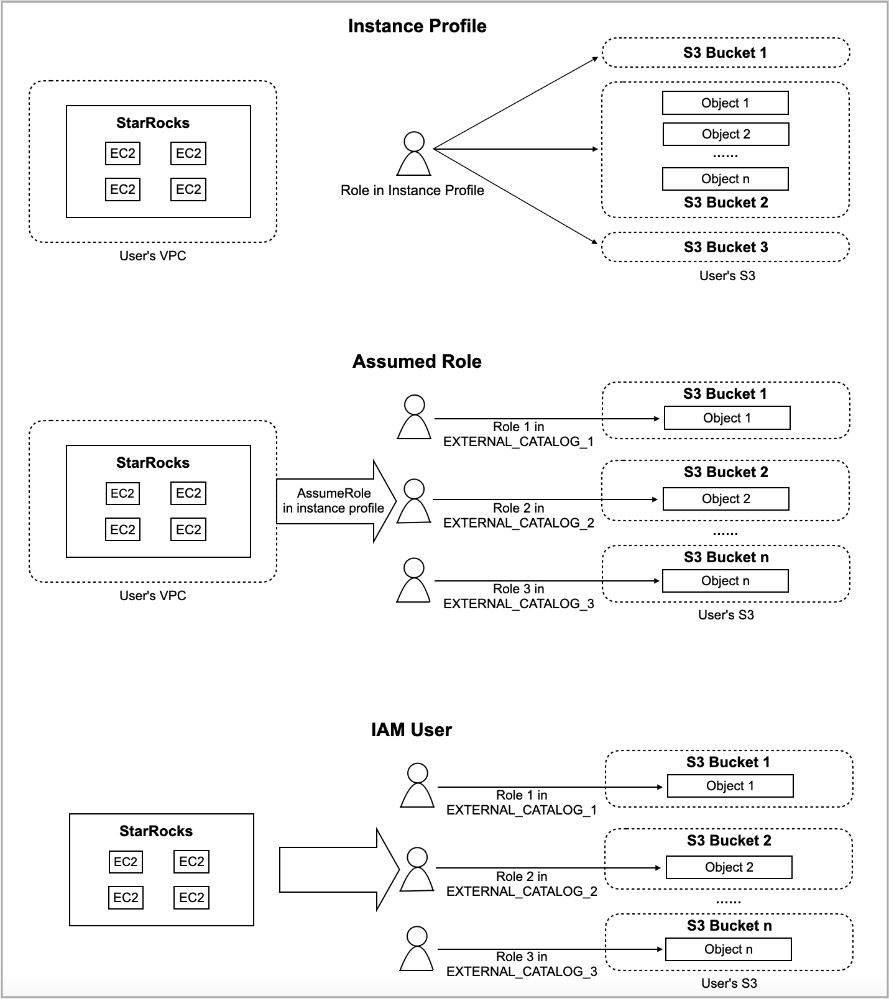

# Authenticate to AWS resources

## Authentication methods

### Instance profile-based authentication

The instance profile-based authentication method allows your StarRocks cluster to inherit the privileges specified in the instance profile of the EC2 instance on which the cluster runs. In theory, any cluster user who can log in to the cluster can perform permitted actions on your AWS resources according to the AWS IAM policies you have configured. The typical scenario for this use case is that you do not need any AWS resource access control between multiple cluster users in the cluster. This authentication method means no isolation is required within the same cluster.

However, this authentication method still can be seen as a cluster-level safe access control solution, because whoever can log in to the cluster is controlled by the cluster administrator.

### Assumed role-based authentication

Unlike the instance profile-based authentication method, which is a cluster-level access control solution, the assumed role-based authentication method is a catalog-level data source access control solution that works based on the mechanism of assuming a role in AWS IAM. For more information, see [Assuming a role](https://docs.aws.amazon.com/awscloudtrail/latest/userguide/cloudtrail-sharing-logs-assume-role.html).

Specifically, you can create different catalogs which can access different AWS S3 resources, such as S3 buckets `S3-BUCKET-1` and `S3-BUCKET-2`. This means you can access a different data source by changing the catalog of the current SQL session.

Further, if the cluster administrator grants privileges on different catalogs to different users, this will achieve an access control solution just like allowing different users within the same cluster to access different data sources.

### IAM user-based authentication

The IAM user-based authentication method is also a catalog-level data source access control solution, which works based on the mechanism of IAM user. You can configure different catalogs to assume different IAM users.

## Preparation for authentication in AWS IAM

### Instance profile-based authentication

You need to create an IAM policy like below to grant access to your AWS resource, and then attach the policy to the IAM role associated with the EC2 instance on which your StarRocks cluster runs.

#### Access AWS S3

If you choose AWS S3 as storage, StarRocks accesses your S3 bucket based on the following IAM policy:

> **NOTICE**
>
> Remember to replace `<bucket_name>` with the name of your S3 bucket.

```JSON
{
    "Version": "2012-10-17",
    "Statement": [
        {
            "Sid": "s3",
            "Effect": "Allow",
            "Action": ["s3:GetObject"],
            "Resource": ["arn:aws:s3:::<bucket_name>/*"]
        },
        {
            "Sid": "s3list",
            "Effect": "Allow",
            "Action": ["s3:ListBucket"],
            "Resource": ["arn:aws:s3:::<bucket_name>"]
        }
        ]
}
```

#### Access AWS Glue

If you choose AWS Glue as metastore, StarRocks accesses your AWS Glue Data Catalog based on the following IAM policy:

```JSON
{
     "Version": "2012-10-17",
     "Statement": [
         {
             "Effect": "Allow",
             "Action": [
                "glue:GetDatabase",
                "glue:GetDatabases",
                "glue:GetPartition",
                "glue:GetPartitions",
                "glue:GetTable",
                "glue:GetTableVersions",
                "glue:GetTables",
                "glue:GetConnection",
                "glue:GetConnections",
                "glue:GetDevEndpoint",
                "glue:GetDevEndpoints",
                "glue:BatchGetPartition"
            ],
            "Resource": [
                "*"
            ]
        }
    ]
}
```

### Assumed role-based authentication

You need to create an assumed role (for example, named `s3_role_test`) and attach the policy provided in the "[Access AWS S3](../integrations/authenticate_to_aws_resources.md#access-aws-s3)" section of this topic to it. This assumed role will be assumed by the IAM role associated with the EC2 instance on which your StarRocks cluster runs.

Also, if you choose AWS Glue as metastore, you can create another assumed role (for example, named `glue_role_test`) and attach the policy provided in the "[Access AWS Glue](../integrations/authenticate_to_aws_resources.md#access-aws-glue)" section of this topic to it. Otherwise, skip the step of creating an assumed role for AWS Glue and directly attach the policy to the above assumed role you have created (for example, `s3_role_test`).

After you finish this, you need to configure a trust relationship between the assumed role and the IAM role associated with the EC2 instance on which your StarRocks cluster runs.

#### Configure a trust relationship

First, edit the trust relationship as shown below to your assumed role `s3_role_test`:

> **NOTICE**
>
> Remember to replace `<cluster_EC2_iam_role_ARN>` with the ARN of the IAM role associated with the EC2 instance on which your StarRocks cluster runs.

```JSON
{
    "Version": "2012-10-17",
    "Statement": [
        {
            "Effect": "Allow",
            "Principal": {
                "AWS": "<cluster_EC2_iam_role_ARN>"
            },
            "Action": "sts:AssumeRole"
        }
    ]
}
```

Then, create and attach a new IAM policy as shown below to the IAM role associated with the EC2 instance on which your StarRocks cluster runs:

> **NOTICE**
>
> Remember to replace `<ARN of s3_role_test>` with the ARN of your assumed role `s3_role_test`. You need to replace `<ARN of glue_role_test>` with the ARN of your assumed role `glue_role_test` only when you choose AWS Glue as metastore and have created another assumed role named `glue_role_test` for AWS Glue.

```JSON
{
    "Version": "2012-10-17",
    "Statement": [
        {
            "Effect": "Allow",
            "Action": ["sts:AssumeRole"],
            "Resource": [
                "<ARN of s3_role_test>",
                "<ARN of glue_role_test>"
            ]
        }
    ]
}
```

### IAM user-based authentication

You need to create an IAM user and attach the policy provided in the "[Access AWS S3](../integrations/authenticate_to_aws_resources.md#access-aws-s3)" or "[Access AWS Glue](../integrations/authenticate_to_aws_resources.md#access-aws-glue)" section of this topic to it.

## Comparison between authentication methods

The following figure provides a high-level explanation of the differences in mechanism between instance profile-based authentication, assumed role-based authentication, and IAM user-based authentication in StarRocks.



## Build connections with AWS resources

### Authentication parameters for accessing AWS S3

In various scenarios in which StarRocks needs to integrate with AWS S3, for example, when you create external catalogs or file external tables or when you ingest, back up, or restore data from AWS S3, configure the authentication parameters for accessing AWS S3 as follows:

- If you use the instance profile-based authentication method to access AWS S3, set `aws.s3.use_instance_profile` to `true`.
- If you use the assumed role-based authentication method to access AWS S3, set `aws.s3.use_instance_profile` to `true` and configure `aws.s3.iam_role_arn` as the assumed role's ARN that you use to access AWS S3.
- If you use the IAM user-based authentication method to access AWS S3, set `aws.s3.use_instance_profile` to `false` and configure `aws.s3.access_key` and `aws.s3.secret_key` as the access key and secret key of your AWS IAM user.

The following table describes the parameters.

| Parameter                   | Required | Description                                                  |
| --------------------------- | -------- | ------------------------------------------------------------ |
| aws.s3.use_instance_profile | Yes      | Specifies whether to enable the instance profile-based authentication method and the assumed role-based authentication method. Valid values: `true` and `false`. Default value: `false`. |
| aws.s3.iam_role_arn         | No       | The ARN of the IAM role that has privileges on your AWS S3 bucket. If you use the assumed role-based authentication method to access AWS S3, you must specify this parameter.  |
| aws.s3.access_key           | No       | The access key of your IAM user. If you use the IAM user-based authentication method to access AWS S3, you must specify this parameter. |
| aws.s3.secret_key           | No       | The secret key of your IAM user. If you use the IAM user-based authentication method to access AWS S3, you must specify this parameter. |

### Authentication parameters for accessing AWS Glue

In various scenarios in which StarRocks needs to integrate with AWS Glue, for example, when you create external catalogs, configure the authentication parameters for accessing AWS Glue as follows:

- If you use the instance profile-based authentication method to access AWS Glue, set `aws.glue.use_instance_profile` to `true`.
- If you use the assumed role-based authentication method to access AWS Glue, set `aws.glue.use_instance_profile` to `true` and configure `aws.glue.iam_role_arn` as the assumed role's ARN that you use to access AWS Glue.
- If you use the IAM user-based authentication method to access AWS Glue, set `aws.glue.use_instance_profile` to `false` and configure `aws.glue.access_key` and `aws.glue.secret_key` as the access key and secret key of your AWS IAM user.

The following table describes the parameters.

| Parameter                     | Required | Description                                                  |
| ----------------------------- | -------- | ------------------------------------------------------------ |
| aws.glue.use_instance_profile | Yes      | Specifies whether to enable the instance profile-based authentication method and the assumed role-based authentication. Valid values: `true` and `false`. Default value: `false`. |
| aws.glue.iam_role_arn         | No       | The ARN of the IAM role that has privileges on your AWS Glue Data Catalog. If you use the assumed role-based authentication method to access AWS Glue, you must specify this parameter. |
| aws.glue.access_key           | No       | The access key of your AWS IAM user. If you use the IAM user-based authentication method to access AWS Glue, you must specify this parameter. |
| aws.glue.secret_key           | No       | The secret key of your AWS IAM user. If you use the IAM user-based authentication method to access AWS Glue, you must specify this parameter. |

## Integration examples

### External catalog

Creating an external catalog in your StarRocks cluster means building integration with the target data lake system, which is composed of two key components:

- File storage like AWS S3 to store table files
- Metastore like Hive metastore or AWS Glue to store the metadata and locations of table files

StarRocks supports the following types of catalogs:

- [Hive catalog](../data_source/catalog/hive_catalog.md)
- [Iceberg catalog](../data_source/catalog/iceberg_catalog.md)
- [Hudi catalog](../data_source/catalog/hudi_catalog.md)
- [Delta Lake catalog](../data_source/catalog/deltalake_catalog.md)

The following examples create a Hive catalog named `hive_catalog_hms` or `hive_catalog_glue`, depending on the type of metastore you use, to query data from your Hive cluster. For detailed syntax and parameters, see [Hive catalog](../data_source/catalog/hive_catalog.md).

#### Instance profile-based authentication

- If you use Hive metastore in your Hive cluster, run a command like below:

  ```SQL
  CREATE EXTERNAL CATALOG hive_catalog_hms
  PROPERTIES
  (
      "type" = "hive",
      "aws.s3.use_instance_profile" = "true",
      "aws.s3.region" = "us-west-2",
      "hive.metastore.uris" = "thrift://xx.xx.xx:9083"
  );
  ```

- If you use AWS Glue in your Amazon EMR Hive cluster, run a command like below:

  ```SQL
  CREATE EXTERNAL CATALOG hive_catalog_glue
  PROPERTIES
  (
      "type" = "hive",
      "aws.s3.use_instance_profile" = "true",
      "aws.s3.region" = "us-west-2",
      "hive.metastore.type" = "glue",
      "aws.glue.use_instance_profile" = "true",
      "aws.glue.region" = "us-west-2"
  );
  ```

#### Assumed role-based authentication

- If you use Hive metastore in your Hive cluster, run a command like below:

  ```SQL
  CREATE EXTERNAL CATALOG hive_catalog_hms
  PROPERTIES
  (
      "type" = "hive",
      "aws.s3.use_instance_profile" = "true",
      "aws.s3.iam_role_arn" = "arn:aws:iam::081976408565:role/test_s3_role",
      "aws.s3.region" = "us-west-2",
      "hive.metastore.uris" = "thrift://xx.xx.xx:9083"
  );
  ```

- If you use AWS Glue in your Amazon EMR Hive cluster, run a command like below:

  ```SQL
  CREATE EXTERNAL CATALOG hive_catalog_glue
  PROPERTIES
  (
      "type" = "hive",
      "aws.s3.use_instance_profile" = "true",
      "aws.s3.iam_role_arn" = "arn:aws:iam::081976408565:role/test_s3_role",
      "aws.s3.region" = "us-west-2",
      "hive.metastore.type" = "glue",
      "aws.glue.use_instance_profile" = "true",
      "aws.glue.iam_role_arn" = "arn:aws:iam::081976408565:role/test_glue_role",
      "aws.glue.region" = "us-west-2"
  );
  ```

#### IAM user-based authentication

- If you use Hive metastore in your Hive cluster, run a command like below:

  ```SQL
  CREATE EXTERNAL CATALOG hive_catalog_hms
  PROPERTIES
  (
      "type" = "hive",
      "aws.s3.use_instance_profile" = "false",
      "aws.s3.access_key" = "<iam_user_access_key>",
      "aws.s3.secret_key" = "<iam_user_access_key>",
      "aws.s3.region" = "us-west-2",
      "hive.metastore.uris" = "thrift://xx.xx.xx:9083"
  );
  ```

- If you use AWS Glue in your Amazon EMR Hive cluster, run a command like below:

  ```SQL
  CREATE EXTERNAL CATALOG hive_catalog_glue
  PROPERTIES
  (
      "type" = "hive",
      "aws.s3.use_instance_profile" = "false",
      "aws.s3.access_key" = "<iam_user_access_key>",
      "aws.s3.secret_key" = "<iam_user_secret_key>",
      "aws.s3.region" = "us-west-2",
      "hive.metastore.type" = "glue",
      "aws.glue.use_instance_profile" = "false",
      "aws.glue.access_key" = "<iam_user_access_key>",
      "aws.glue.secret_key" = "<iam_user_secret_key>",
      "aws.glue.region" = "us-west-2"
  );
  ```

### File external table

File external tables must be created in your internal catalog named `default_catalog`.

The following examples create a file external table named `file_table` on an existing database named `test_s3_db`. For detailed syntax and parameters, see [File external table](../data_source/file_external_table.md).

#### Instance profile-based authentication

Run a command like below:

```SQL
CREATE EXTERNAL TABLE test_s3_db.file_table
(
    id varchar(65500),
    attributes map<varchar(100), varchar(2000)>
) 
ENGINE=FILE
PROPERTIES
(
    "path" = "s3://starrocks-test/",
    "format" = "ORC",
    "aws.s3.use_instance_profile" = "true",
    "aws.s3.region" = "us-west-2"
);
```

#### Assumed role-based authentication

Run a command like below:

```SQL
CREATE EXTERNAL TABLE test_s3_db.file_table
(
    id varchar(65500),
    attributes map<varchar(100), varchar(2000)>
) 
ENGINE=FILE
PROPERTIES
(
    "path" = "s3://starrocks-test/",
    "format" = "ORC",
    "aws.s3.use_instance_profile" = "true",
    "aws.s3.iam_role_arn" = "arn:aws:iam::081976408565:role/test_s3_role",
    "aws.s3.region" = "us-west-2"
);
```

#### IAM user-based authentication

Run a command like below:

```SQL
CREATE EXTERNAL TABLE test_s3_db.file_table
(
    id varchar(65500),
    attributes map<varchar(100), varchar(2000)>
) 
ENGINE=FILE
PROPERTIES
(
    "path" = "s3://starrocks-test/",
    "format" = "ORC",
    "aws.s3.use_instance_profile" = "false",
    "aws.s3.access_key" = "<iam_user_access_key>",
    "aws.s3.secret_key" = "<iam_user_secret_key>",
    "aws.s3.region" = "us-west-2"
);
```

### Ingestion

You can use LOAD LABEL to load data from AWS S3.

The following examples load the data from all Parquet data files stored in the `s3a://test-bucket/test_brokerload_ingestion` path into the `test_ingestion_2` table in an existing database named `test_s3_db`. For detailed syntax and parameters, see [BROKER LOAD](../sql-reference/sql-statements/data-manipulation/BROKER%20LOAD.md).

#### Instance profile-based authentication

Run a command like below:

```SQL
LOAD LABEL test_s3_db.test_credential_instanceprofile_7
(
    DATA INFILE("s3a://test-bucket/test_brokerload_ingestion/*")
    INTO TABLE test_ingestion_2
    FORMAT AS "parquet"
)
WITH BROKER
(
    "aws.s3.use_instance_profile" = "true",
    "aws.s3.region" = "us-west-1"
)
PROPERTIES
(
    "timeout" = "1200"
);
```

#### Assumed role-based authentication

Run a command like below:

```SQL
LOAD LABEL test_s3_db.test_credential_instanceprofile_7
(
    DATA INFILE("s3a://test-bucket/test_brokerload_ingestion/*")
    INTO TABLE test_ingestion_2
    FORMAT AS "parquet"
)
WITH BROKER
(
    "aws.s3.use_instance_profile" = "true",
    "aws.s3.iam_role_arn" = "arn:aws:iam::081976408565:role/test_s3_role",
    "aws.s3.region" = "us-west-1"
)
PROPERTIES
(
    "timeout" = "1200"
);
```

#### IAM user-based authentication

Run a command like below:

```SQL
LOAD LABEL test_s3_db.test_credential_instanceprofile_7
(
    DATA INFILE("s3a://test-bucket/test_brokerload_ingestion/*")
    INTO TABLE test_ingestion_2
    FORMAT AS "parquet"
)
WITH BROKER
(
    "aws.s3.use_instance_profile" = "false",
    "aws.s3.access_key" = "<iam_user_access_key>",
    "aws.s3.secret_key" = "<iam_user_secret_key>",
    "aws.s3.region" = "us-west-1"
)
PROPERTIES
(
    "timeout" = "1200"
);
```
