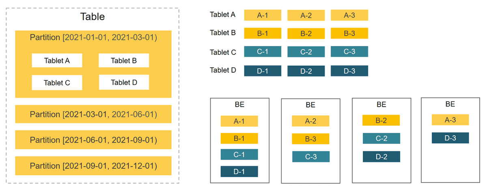

# Architecture

StarRocks has a simple architecture. The entire system consists of only two types of components, frontends (FEs) and backends (BEs). StarRocks does not rely on any external components, simplifying deployment and maintenance. FEs and BEs can be horizontally scaled without service downtime. In addition, StarRocks has a replica mechanism for metadata and service data, which increases data reliability and efficiently prevents single points of failure (SPOFs).

StarRocks is compatible with MySQL protocols and supports standard SQL. Users can easily connect to StarRocks from MySQL clients to gain instant and valuable insights.

The following figure shows the architecture of StarRocks.

## FE and BE

FEs are responsible for metadata management, client connection management, query planning, and query scheduling. Each FE stores and maintains a complete copy of metadata in its memory, which guarantees indiscriminate services among the FEs. FEs can work as the leader, followers, and observers. Followers can elect a leader according to the Paxos-like BDB JE protocol. BDB JE is short for Berkeley DB Java Edition.

- Leader
  - The leader FE is elected from follower FEs. To perform leader election, more than half of the follower FEs in the cluster must be active. When the leader FE fails, follower FEs will start another round of leader election.
  - The leader FE reads and writes metadata. Follower and observer FEs can only read metadata. They route metadata write requests to the leader FE. The leader FE updates the metadata and then uses BDE JE to synchronize the metadata changes to the follower and observer FEs. Data writes are considered successful only after the metadata changes are synchronized to more than half of the follower FEs.

- Follower
  - Followers can only read metadata. They synchronize and replay logs from the leader FE to update metadata.
  - Followers participate in leader election, which requires more than half of the followers in the cluster be active.

- Observer
  - Observers are mainly used to increase the query concurrency of the cluster.
  - Observers do not participate in leader election and therefore, will not add leader selection pressure to the cluster.
  - Observers synchronize and replay logs from the leader FE to update metadata.

BEs are responsible for data storage and SQL execution.

- Data storage: BEs have equivalent data storage capabilities. FEs distribute data to BEs based on predefined rules. BEs transform the ingested data, write the data into the required format, and generate indexes for the data.

- SQL execution: When an SQL query arrives, FEs parse it into a logical execution plan according to the semantics of the query, and then transform the logical plan into physical execution plans that can be executed on BEs. BEs that store the destination data execute the query. This eliminates the need for data transmission and copy, achieving high query performance.

## Data management

StarRocks is a column-oriented database system. It uses the partitioning and bucketing mechanism to manage data. Data in a table is first divided into multiple partitions and then into multiple tablets. Tablets are the basic logical units of data management in StarRocks. Each tablet can have multiple replicas that can be stored across different BEs. You can specify the number of tablets and leave StarRocks to take care of the tablets.

Partitions and tablets reduce table scans and increase query concurrency. Replicas facilitate data backup and restoration, preventing data loss.

In the following figure, the table is divided into four partitions based on time. Data in the first partition is further split into four tablets. Each tablet has three replicas, which are stored on three different BEs.

Since one table is split into multiple tablets, StarRocks can schedule one SQL statement to all the tablets for parallel processing, fully utilizing the computing power of multiple physical machines and cores. This also helps offload the query pressure to multiple nodes, increasing service availability. You can add physical machines on demand to achieve high concurrency.

The distribution of tablets is not affected or confined by physical nodes. If the number of BEs changes (for example, when you add or remove a BE), ongoing services can proceed without any interruption. Node changes will trigger automatic migration of tablets. If BEs are added, some tablets will be automatically migrated to the new BEs for more even data distribution. If BEs are removed, tablets on these BEs will be automatically migrated to other BEs, ensuring unchanged number of replicas. Auto tablet migration helps easily achieve auto scaling of StarRocks clusters, eliminating the need for manual data re-distribution.

StarRocks uses a multi-replica mechanism (3 by default) for tablets. Replicas ensure high data reliability and service availability. The failure of one node will not affect the availability of the overall services. You can also increase the number of replicas to achieve high query concurrency.
