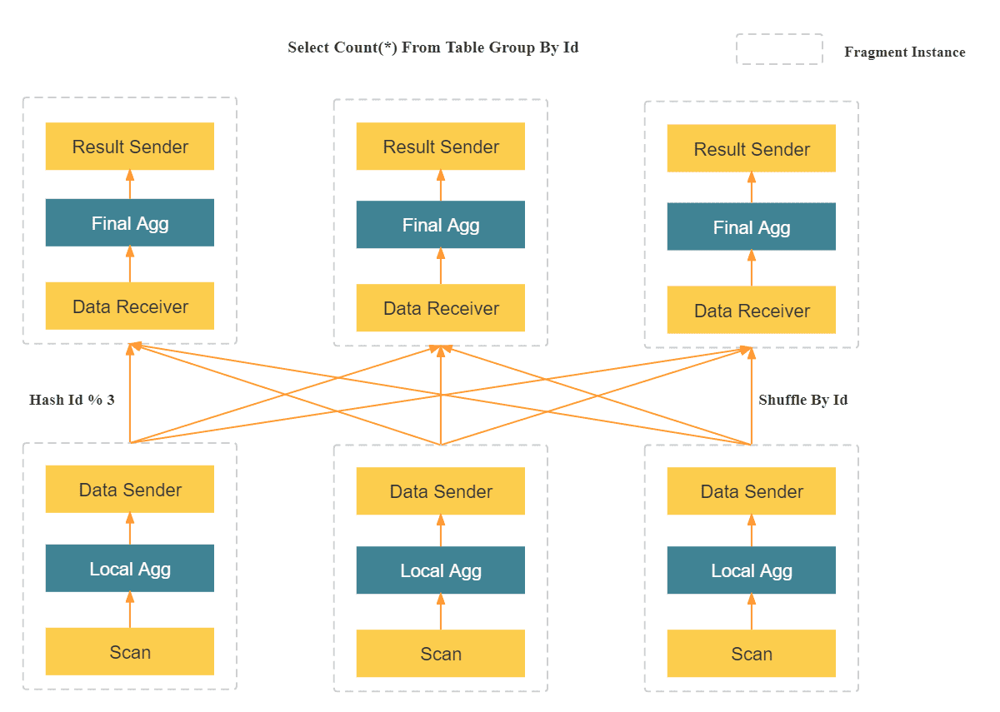
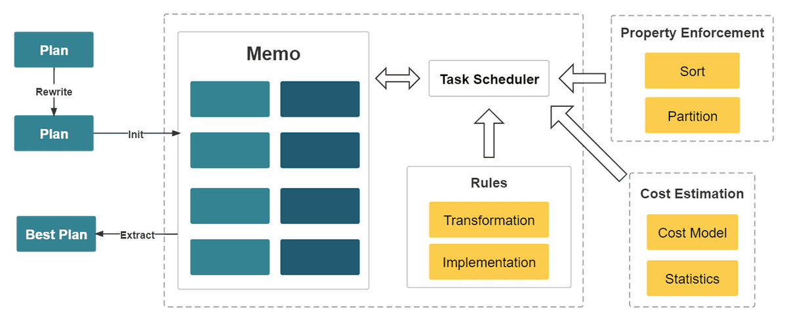
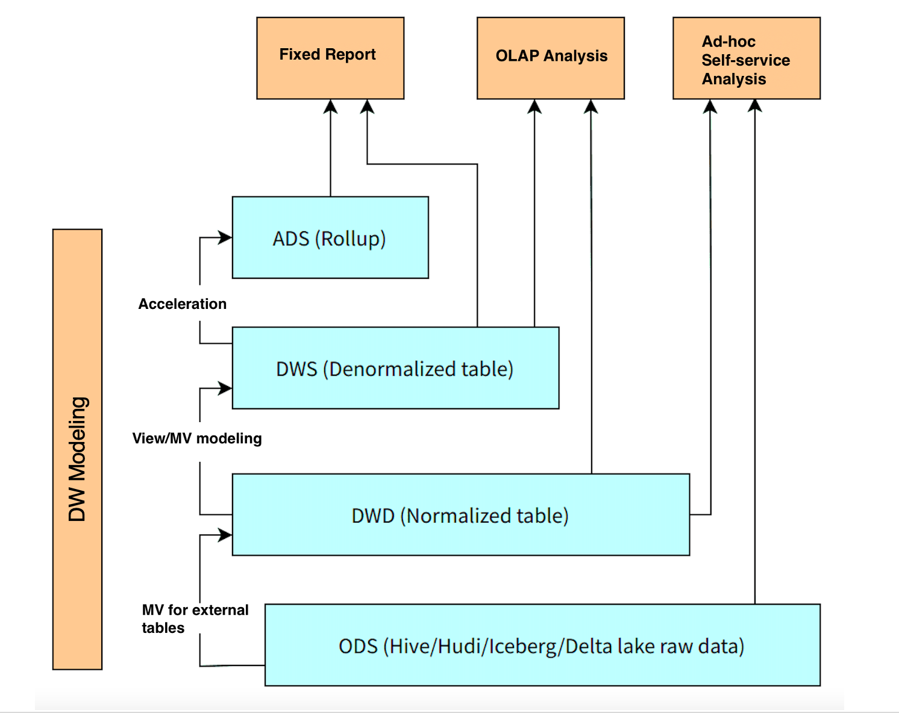

# Features

StarRocks offers a rich set of features to deliver a blazing-fast, real-time analytics experience on data at scale.

## MPP framework

StarRocks adopts the massively parallel processing (MPP) framework. One query request is split into multiple physical computing units that can be executed in parallel on multiple machines. Each machine has dedicated CPU and memory resources. The MPP framework fully uses the resources of all CPU cores and machines. The performance of a single query can continuously increase as the cluster is scaled out.

In the preceding figure, StarRocks parses an SQL statement into multiple logical execution units (query fragments) according to the semantics of the statement. Each fragment is then implemented by one or multiple physical execution units (fragment instances) based on the computing complexity. A physical execution unit is the smallest scheduling unit in StarRocks. They will be scheduled to backends (BEs) for execution. One logical execution unit can contain one or more operators, such as the Scan, Project, and Agg operators, as shown on the right side of the figure. Each physical execution unit processes only part of the data and the result will be merged to generate the final data. **Parallel execution of logical execution units fully utilizes the resources of all CPU cores and physical machines and accelerates the query speed.**

Unlike the Scatter-Gather framework used by many other data analytics systems, the MPP framework can utilize more resources to process query requests. In the Scatter-Gather framework, only the Gather node can perform the final merge operation. In the MPP framework, data is shuffled to multiple nodes for merge operations. For complex queries, such as Group By on high-cardinality fields and large table joins, StarRocks' MPP framework has noticeable performance advantages over the Scatter-Gather framework.

## Fully vectorized execution engine

The fully vectorized execution engine makes more efficient use of CPU processing power because this engine organizes and processes data in a columnar manner. Specifically, StarRocks stores data, organizes data in memory, and computes SQL operators all in a columnar manner. Columnar organization makes full use of CPU cache. Columnar computing reduces the number of virtual function calls and branch judgments, resulting in more sufficient CPU instruction flows.

The vectorized execution engine also makes full use of SIMD instructions. This engine can complete more data operations with fewer instructions. Tests against standard datasets show that this engine enhances the overall performance of operators by 3 to 10 times.

In addition to operator vectorization, StarRocks has implemented other optimizations for the query engine. For example, StarRocks uses the Operation on Encoded Data technology to directly execute operators on encoded strings, without the need for decoding. This noticeably reduces SQL complexity and increases the query speed by more than 2 times.

## Cost-based optimizer

Performance of multi-table join queries is difficult to optimize. Execution engines alone cannot deliver superior performance because the complexity of execution plans may vary by several orders of magnitude in multi-table join query scenarios. The more the associated tables, the more the execution plans, which makes it NP-hard to choose an optimal plan. Only a query optimizer excellent enough can choose a relatively optimal query plan for efficient multi-table analytics.

StarRocks designs a brand-new CBO from scratch. This CBO adopts the cascades-like framework and is deeply customized for the vectorized execution engine with a number of optimizations and innovations. These optimizations include the reuse of common table expressions (CTEs), rewriting of subqueries, Lateral Join, Join Reorder, strategy selection for distributed Join execution, and low-cardinality optimization. The CBO supports a total of 99 TPC-DS SQL statements.

The CBO enables StarRocks to deliver better multi-table join query performance than competitors, especially in complex multi-table join queries.

## Real-time, updatable columnar storage engine

StarRocks is a columnar storage engine that allows data of the same type to be stored continuously. In columnar storage, data can be encoded in a more efficient way, increasing the compression ratio and lowering the storage cost. Columnar storage also reduces the total data read I/Os, improving query performance. In addition, in most OLAP scenarios, only specific columns are queried. Columnar storage enables users to query only part of the columns, significantly reducing disk I/Os.

StarRocks can load data within seconds for near-real-time analytics. StarRocks' storage engine guarantees the atomicity, consistency, isolation, and durability (ACID) of each data ingestion operation. For a data loading transaction, the entire transaction either succeeds or fails. Concurrent transactions do not affect each other, providing transaction-level isolation.

StarRocks' storage engine uses the Delete-and-insert pattern, which allows for efficient Partial Update and Upsert operations. The storage engine can quickly filter data using primary key indexes,  eliminating the need for Sort and Merge operations at data reading. The engine can also make full use of secondary indexes. It delivers fast and predictable query performance even on huge volume of data updates.

## Intelligent materialized view

StarRocks uses intelligent materialized views to accelerate queries and data warehouse layering. Different from materialized views of other similar products that requires manual data synchronization with the base table, StarRocks' materialized views automatically update data according to the data changes in the base table without requiring additional maintenance operations. In addition, the selection of materialized views is also automatic. If StarRocks identifies a suitable materialized view (MV) to improve query performance, it will automatically rewrite the query to utilize the MV. This intelligent process significantly enhances query efficiency without requiring manual intervention.

 StarRocks' MV can replace the traditional ETL data modeling process: Instead of transforming data in the upstream applications, you now have the option to transform data with MV within StarRocks, simplifying the data processing pipeline.

For example, in the figure, raw data on data lake can be used to create a normalized table based on an external MV. A denormalized table can be created from normalized tables through asynchronous materialized views. Another MV can be created from normalized tables to support high-concurrency queries and better query performance.

## Data lake analytics

In addition to efficient analytics of local data, StarRocks can work as the compute engine to analyze data stored in data lakes such as Apache Hive, Apache Iceberg, Apache Hudi, and Delta Lake. One of the key features of StarRocks is its external catalog, which acts as a linkage to an externally maintained metastore. This functionality provides users with the capability to query external data sources seamlessly, eliminating the need for data migration. As such, users can analyze data from different systems such as HDFS and Amazon S3, in various file formats such as Parquet, ORC, and CSV, etc.

The preceding figure shows a data lake analytics scenario where StarRocks is responsible for data computing and analysis, and the data lake is responsible for data storage, organization, and maintenance. Data lakes allow users to store data in open storage formats and use flexible schemas to produce reports on "single source of truth" for various BI, AI, ad-hoc, and reporting use cases. StarRocks fully leverages the advantages of its vectorization engine and CBO, significantly improving the performance of data lake analytics.
