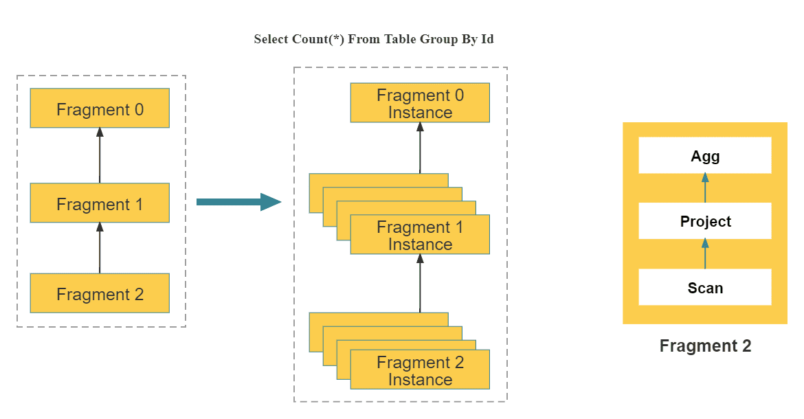
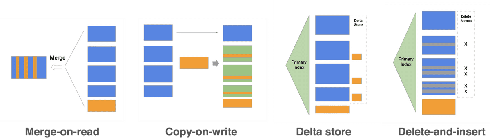
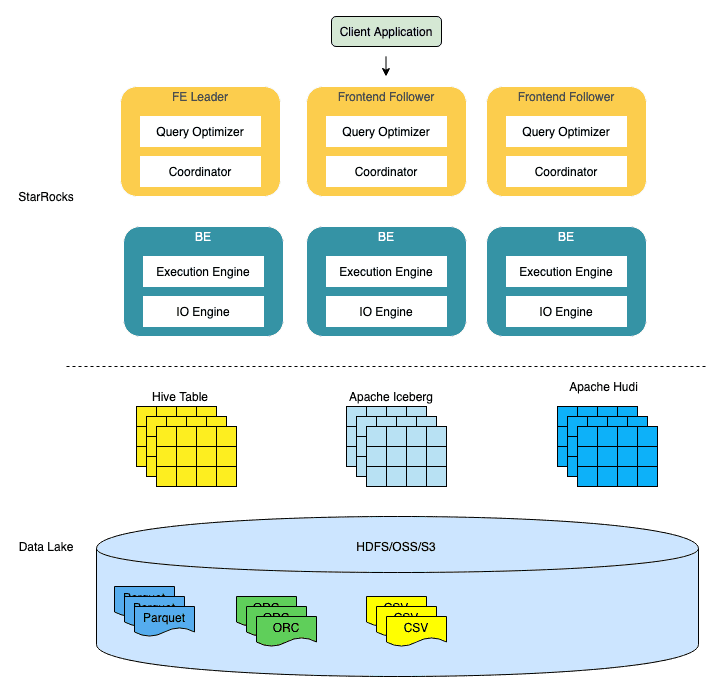

#امکانات

 استار راکت مجموعه ای غنی از ویژگی ها را برای ارائه یک تجربه تجزیه و تحلیل سریع و بی درنگ در داده ها در مقیاس ارائه می دهد.

 ## چارچوب ام پی پی

 استار راکت چارچوب پردازش انبوه موازی (MPP) را پذیرفته است.  یک درخواست پرس و جو به چندین واحد محاسباتی فیزیکی تقسیم می شود که می توانند به صورت موازی در چندین ماشین اجرا شوند.  هر دستگاه دارای CPU و منابع حافظه اختصاصی است.  چارچوب MPP به طور کامل از منابع تمام هسته‌ها و ماشین‌های CPU استفاده می‌کند.  عملکرد یک پرس و جو می تواند به طور مداوم با کوچک شدن خوشه افزایش یابد.

 

 در شکل قبل، استار راکت یک دستور SQL را به چند واحد اجرای منطقی (قطعات پرس و جو) با توجه به معنایی عبارت تجزیه می کند.  سپس هر قطعه توسط یک یا چند واحد اجرای فیزیکی (نمونه های قطعه) بر اساس پیچیدگی محاسبات پیاده سازی می شود.  واحد اجرای فیزیکی کوچکترین واحد زمانبندی در استار راکس است.  آنها برای اجرا در backends (BEs) برنامه ریزی خواهند شد.  همانطور که در سمت راست شکل نشان داده شده است، یک واحد اجرای منطقی می تواند شامل یک یا چند عملگر مانند عملگرهای Scan، Project و Agg باشد.  هر واحد اجرای فیزیکی تنها بخشی از داده ها را پردازش می کند و نتیجه برای تولید داده های نهایی ادغام می شود.  ** اجرای موازی واحدهای اجرای منطقی به طور کامل از منابع تمام هسته های CPU و ماشین های فیزیکی استفاده می کند و سرعت پرس و جو را افزایش می دهد.**

 

 برخلاف چارچوب Scatter-Gather که توسط بسیاری دیگر از سیستم های تحلیل داده استفاده می شود، چارچوب MPP می تواند از منابع بیشتری برای پردازش درخواست های پرس و جو استفاده کند.  در چارچوب Scatter-Gather، تنها گره Gather می تواند عملیات ادغام نهایی را انجام دهد.  در چارچوب MPP، داده ها برای عملیات ادغام به چندین گره تبدیل می شوند.  برای پرس و جوهای پیچیده، مانند Group By در فیلدهای با کاردینالیته بالا و پیوستن به جدول بزرگ، چارچوب MPP StarRocks دارای مزایای عملکرد قابل توجهی نسبت به چارچوب Scatter-Gather است.

 ## موتور اجرای کاملا برداری

 موتور اجرایی کاملاً برداری شده از قدرت پردازش CPU استفاده موثرتری می کند زیرا این موتور داده ها را به صورت ستونی سازماندهی و پردازش می کند.  به طور خاص، استارراکت داده ها را ذخیره می کند، داده ها را در حافظه سازماندهی می کند و عملگرهای SQL را به صورت ستونی محاسبه می کند.  سازماندهی ستونی به طور کامل از حافظه پنهان CPU استفاده می کند.  محاسبات ستونی تعداد فراخوانی‌های تابع مجازی و قضاوت‌های شاخه‌ای را کاهش می‌دهد و در نتیجه جریان‌های دستورالعمل CPU کافی‌تر می‌شود.

 موتور اجرای بردار نیز از دستورالعمل های SIMD استفاده کامل می کند.  این موتور می تواند عملیات داده های بیشتری را با دستورالعمل های کمتر تکمیل کند.  آزمایش‌ها در برابر مجموعه داده‌های استاندارد نشان می‌دهد که این موتور عملکرد کلی اپراتورها را 3 تا 10 برابر افزایش می‌دهد.
علاوه بر بردارسازی عملگر، استار راکت بهینه‌سازی‌های دیگری را برای موتور پرس و جو پیاده‌سازی کرده است.  به عنوان مثال، استارراکت از فناوری Operation on Encoded Data برای اجرای مستقیم عملگرها بر روی رشته های رمزگذاری شده، بدون نیاز به رمزگشایی استفاده می کند.  این به طور قابل توجهی پیچیدگی SQL را کاهش می دهد و سرعت پرس و جو را بیش از 2 برابر افزایش می دهد.

 ## بهینه سازی مبتنی بر هزینه

 

 بهینه سازی عملکرد پرس و جوهای پیوستن چند جدولی دشوار است.  موتورهای اجرا به تنهایی نمی توانند عملکرد برتر را ارائه دهند زیرا پیچیدگی برنامه های اجرایی ممکن است در سناریوهای پرس و جوی چند جدولی با چندین مرتبه بزرگی متفاوت باشد.  هر چه جداول مرتبط بیشتر باشد، برنامه های اجرایی بیشتر می شود، که انتخاب یک طرح بهینه را NP سخت می کند.  فقط یک بهینه ساز پرس و جو به اندازه کافی عالی می تواند یک طرح پرس و جو نسبتاً بهینه را برای تجزیه و تحلیل کارآمد چند جدولی انتخاب کند.

 استار راکت یک CBO کاملاً جدید را از ابتدا طراحی می کند.  این CBO چارچوبی شبیه آبشار را به کار می گیرد و عمیقاً برای موتور اجرایی بردار شده با تعدادی بهینه سازی و نوآوری سفارشی شده است.  این بهینه‌سازی‌ها شامل استفاده مجدد از عبارات جدول رایج (CTEs)، بازنویسی پرس‌و‌جوهای فرعی، پیوستن جانبی، ترتیب مجدد پیوستن، انتخاب استراتژی برای اجرای پیوستن توزیع‌شده و بهینه‌سازی با کاردینالیته پایین است.  CBO در مجموع از 99 عبارت TPC-DS SQL پشتیبانی می کند.

 CBO استارراکت را قادر می سازد تا عملکرد جستجوی پیوستن چند جدولی بهتری را نسبت به رقبا ارائه دهد، به خصوص در جستارهای پیوستن چند جدولی پیچیده.

 ## موتور ذخیره سازی ستونی در زمان واقعی و قابل به روز رسانی

 استار راکت یک موتور ذخیره سازی ستونی است که اجازه می دهد تا داده های یک نوع به طور مداوم ذخیره شوند.  در ذخیره سازی ستونی، داده ها را می توان به روشی کارآمدتر رمزگذاری کرد و نسبت فشرده سازی را افزایش داد و هزینه ذخیره سازی را کاهش داد.  ذخیره سازی ستونی همچنین کل داده های خوانده شده ورودی/خروجی را کاهش می دهد و عملکرد پرس و جو را بهبود می بخشد.  علاوه بر این، در اکثر سناریوهای OLAP، تنها ستون‌های خاص پرس و جو می‌شوند.  فضای ذخیره‌سازی ستونی به کاربران امکان می‌دهد تنها بخشی از ستون‌ها را جستجو کنند و ورودی/خروجی دیسک را به میزان قابل توجهی کاهش می‌دهد.

 استار راکت می‌تواند داده‌ها را در عرض چند ثانیه برای تجزیه و تحلیل در زمان واقعی بارگذاری کند.  موتور ذخیره سازی استار راکت اتمی بودن، سازگاری، جداسازی و دوام (ACID) هر عملیات جذب داده را تضمین می کند.  برای یک تراکنش بارگذاری داده، کل تراکنش یا موفق می شود یا ناموفق.  تراکنش‌های همزمان بر یکدیگر تأثیر نمی‌گذارند و انزوا در سطح تراکنش فراهم می‌کنند.

 

 موتور ذخیره سازی استار راکت از الگوی Delete-and-Insert (Merge on Read) استفاده می کند که امکان عملیات Append و UPSERT کارآمد را فراهم می کند.  موتور ذخیره‌سازی می‌تواند به سرعت داده‌ها را با استفاده از شاخص‌های کلید اصلی فیلتر کند و نیاز به عملیات مرتب‌سازی و ادغام در خواندن داده‌ها را از بین ببرد.  موتور همچنین می تواند به طور کامل از شاخص های ثانویه استفاده کند.  این عملکرد نهایی پرس و جو را حتی در حجم عظیمی از به روز رسانی داده ها ارائه می دهد.

 ## نمای مادی شده هوشمند

 استار راکت از نماهای مادی هوشمند برای سرعت بخشیدن به پرس و جوها استفاده می کند.  نماهای تحقق یافته  با توجه به تغییرات داده ها در جدول پایه، بدون نیاز به عملیات تعمیر و نگهداری اضافی، به طور خودکار داده ها را مطابق با تغییرات داده ها در جدول پایه، به روز می کنند که نیاز به همگام سازی ناهمزمان داده ها با جدول پایه دارند.  علاوه بر این، انتخاب نماهای تحقق یافته نیز به صورت خودکار است.  در طول برنامه ریزی پرس و جو، اگر  تشخیص دهد که یک نمای مادی مناسب می تواند برای سرعت بخشیدن به پرس و جو ایجاد شود، استارراکت به طور خودکار پرس و جو را بازنویسی می کند و یک نمای واقعی ایجاد می کند.

 نماهای تحقق یافته استار راکت را می توان در صورت تقاضا ایجاد یا حذف کرد.  هنگام ایجاد جدول پایه، نیازی به ایجاد نمای مادی شده ندارید.  درعوض، می‌توانید بر اساس نیازهای کسب‌وکارتان، تعیین کنید که آیا یک نمای واقعی ایجاد کنید یا حذف کنید.  استار راکت به طور خودکار نماهای واقعی را در پس زمینه ایجاد یا تنظیم می کند.

 

 ## تجزیه و تحلیل دریاچه داده

 

 علاوه بر تجزیه و تحلیل کارآمد داده های محلی، StarRocks می تواند به عنوان موتور محاسباتی برای تجزیه و تحلیل داده های ذخیره شده در دریاچه های داده مانند Apache Hive، Apache Iceberg و Apache Hudi کار کند.  کاربران می توانند از استار راکت برای تجزیه و تحلیل داده ها در فرمت های مختلف فایل از جمله Parquet، ORC و CSV استفاده کنند که می توانند در سیستم های مختلفی مانند HDFS، Amazon S3 و Alibaba Cloud OSS ذخیره شوند.

 شکل قبل یک سناریوی تجزیه و تحلیل دریاچه داده را نشان می دهد که در آن استار راکت مسئول محاسبه و تجزیه و تحلیل داده ها است و دریاچه داده مسئول ذخیره سازی، سازماندهی و نگهداری داده ها است.  دریاچه‌های داده به کاربران اجازه می‌دهند داده‌ها را در قالب‌های ذخیره‌سازی باز ذخیره کنند و از طرح‌واره‌های انعطاف‌پذیر برای تولید گزارش‌هایی درباره «منبع منفرد حقیقت» برای موارد مختلف BI، AI، ad-hoc و گزارش‌گیری استفاده کنند.  استارراکت به طور کامل از مزایای موتور برداری و CBO خود استفاده می کند و به طور قابل توجهی عملکرد تجزیه و تحلیل دریاچه داده را بهبود می بخشد.
