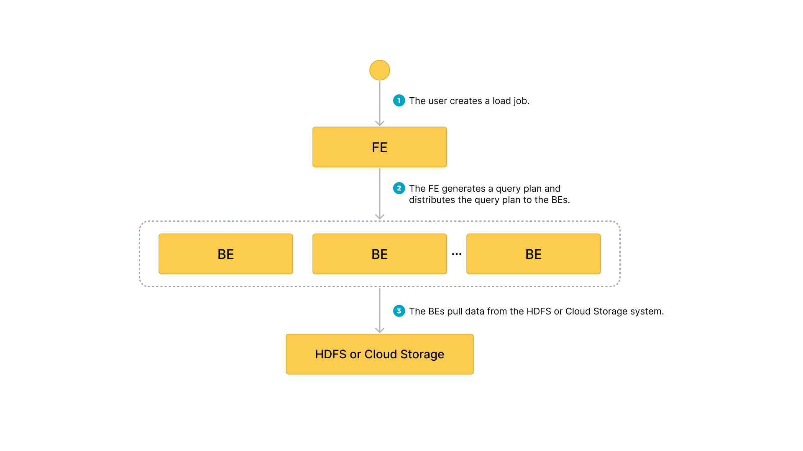

### Broker Load の利点

- Broker Load は、ロード中にデータ変換、UPSERT、および DELETE 操作をサポートします。
- Broker Load はバックグラウンドで実行され、クライアントはジョブが続行するために接続を維持する必要がありません。
- Broker Load は長時間実行されるジョブに適しており、デフォルトのタイムアウトは 4 時間です。
- Broker Load は Parquet、ORC、および CSV ファイル形式をサポートします。

### データフロー

1. ユーザーがロードジョブを作成します
2. フロントエンド (FE) がクエリプランを作成し、そのプランをバックエンドノード (BE) に配布します
3. バックエンド (BE) ノードがソースからデータを取得し、StarRocks にデータをロードします