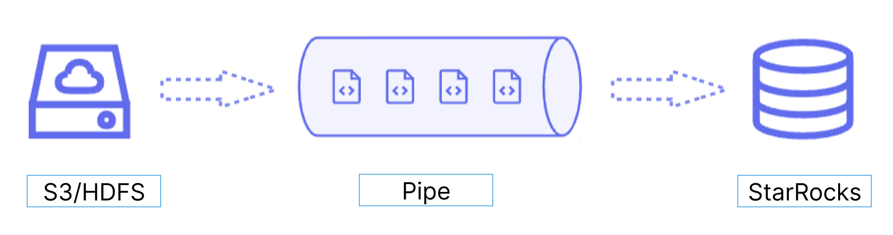

import Tabs from '@theme/Tabs';
import TabItem from '@theme/TabItem';

Pipe は、継続的なデータロードと大規模なデータロードに最適です。

- **マイクロバッチによる大規模なデータロードは、データエラーによるリトライのコストを削減します。**

  Pipe を利用することで、StarRocks は大量のデータファイルを効率的にロードできます。Pipe はファイルの数やサイズに基づいて自動的にファイルを分割し、ロードジョブを小さな連続タスクに分解します。このアプローチにより、1 つのファイルのエラーが全体のロードジョブに影響を与えません。各ファイルのロードステータスは Pipe によって記録され、エラーを含むファイルを簡単に特定して修正できます。データエラーによるリトライの必要性を最小限に抑えることで、コスト削減に寄与します。

- **継続的なデータロードは、人手を削減します。**

  Pipe は、新しいまたは更新されたデータファイルを特定の場所に書き込み、これらのファイルから新しいデータを継続的に StarRocks にロードします。`"AUTO_INGEST" = "TRUE"` を指定して Pipe ジョブを作成すると、指定されたパスに保存されたデータファイルの変更を常に監視し、データファイルから新しいまたは更新されたデータを自動的に目的の StarRocks テーブルにロードします。

さらに、Pipe はファイルの一意性チェックを行い、重複したデータロードを防ぎます。ロードプロセス中、Pipe はファイル名とダイジェストに基づいて各データファイルの一意性をチェックします。特定のファイル名とダイジェストを持つファイルがすでに Pipe ジョブによって処理されている場合、Pipe ジョブは同じファイル名とダイジェストを持つ後続のすべてのファイルをスキップします。{props.menu} をファイルダイジェストとして注意してください。

各データファイルのロードステータスは `information_schema.pipe_files` ビューに記録され保存されます。このビューに関連付けられた Pipe ジョブが削除されると、そのジョブでロードされたファイルに関する記録も削除されます。

### データフロー

