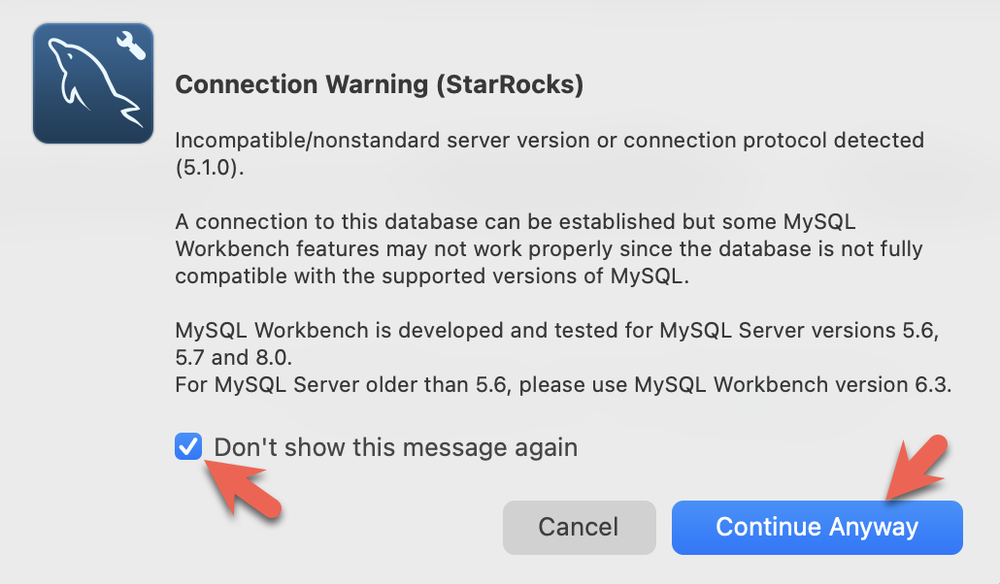

import Tabs from '@theme/Tabs';
import TabItem from '@theme/TabItem';

これらの3つのクライアントはこのチュートリアルでテストされています。どれか1つを使用してください。

- mysql CLI: Docker環境またはあなたのマシンから実行できます。
- [DBeaver](https://dbeaver.io/download/) はコミュニティ版とPro版があります。
- [MySQL Workbench](https://dev.mysql.com/downloads/workbench/)

#### クライアントの設定

<Tabs groupId="client">
<TabItem value="mysqlCLI" label="mysql CLI" default>

mysql CLIを使用する最も簡単な方法は、StarRocksコンテナ `starrocks-fe` から実行することです。

```bash
docker exec -it quickstart \
mysql -P 9030 -h 127.0.0.1 -u root --prompt="StarRocks > "
```

mysql CLIをインストールしたい場合は、以下の **mysql client install** を展開してください。

<details>

<summary>mysql client install</summary>

- macOS: Homebrewを使用していてMySQL Serverが不要な場合、`brew install mysql` を実行してCLIをインストールします。
- Linux: `mysql` クライアントのためにリポジトリシステムを確認してください。例えば、`yum install mariadb`。
- Microsoft Windows: [MySQL Community Server](https://dev.mysql.com/downloads/mysql/) をインストールし、提供されたクライアントを実行するか、WSLから `mysql` を実行します。

</details>

</TabItem>

<TabItem value="DBeaver" label="DBeaver" >

- [DBeaver](https://dbeaver.io/download/) をインストールし、接続を追加します。

- ポート、IP、ユーザー名を設定します。接続をテストし、テストが成功したらFinishをクリックします。


</TabItem>
<TabItem value="MySQLWorkbench" label="MySQL Workbench">

- [MySQL Workbench](https://dev.mysql.com/downloads/workbench/) をインストールし、接続を追加します。
- ポート、IP、ユーザー名を設定し、接続をテストします。

- Workbenchは特定のMySQLバージョンをチェックするため、警告が表示されます。警告を無視し、プロンプトが表示されたら、警告を表示しないようにWorkbenchを設定できます。

</TabItem>

</Tabs>