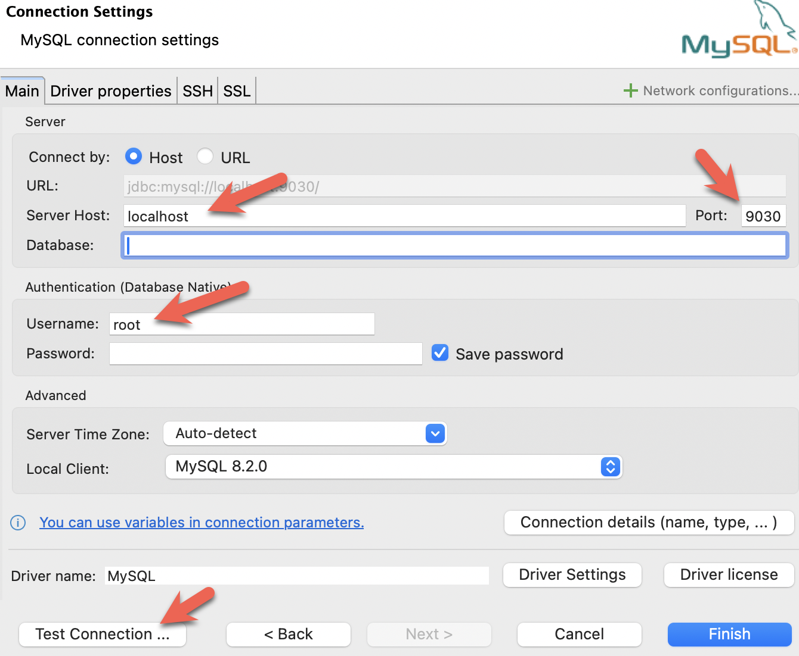

import Tabs from '@theme/Tabs';
import TabItem from '@theme/TabItem';

これらの3つのクライアントはこのチュートリアルでテストされていますが、1つだけ使用すれば大丈夫です。

- mysql CLI: Docker 環境またはあなたのマシンから実行できます。
- [DBeaver](https://dbeaver.io/download/) は、コミュニティ版と Pro 版があります。
- [MySQL Workbench](https://dev.mysql.com/downloads/workbench/)

#### クライアントの設定

<Tabs groupId="client">
<TabItem value="mysqlCLI" label="mysql CLI" default>

mysql CLI を使用する最も簡単な方法は、StarRocks コンテナ `starrocks-fe` から実行することです。

```bash
docker compose exec starrocks-fe \
mysql -P 9030 -h 127.0.0.1 -u root --prompt="StarRocks > "
```

:::tip
すべての `docker compose` コマンドは、`docker-compose.yml` ファイルを含むディレクトリから実行する必要があります。
:::

mysql CLI をインストールしたい場合は、以下の **mysql client install** を展開してください。

<details>

<summary>mysql client install</summary>

- macOS: Homebrew を使用していて MySQL Server が不要な場合、`brew install mysql` を実行して CLI をインストールします。
- Linux: `mysql` クライアントをリポジトリシステムで確認します。例えば、`yum install mariadb`。
- Microsoft Windows: [MySQL Community Server](https://dev.mysql.com/downloads/mysql/) をインストールして提供されたクライアントを実行するか、WSL から `mysql` を実行します。

</details>

</TabItem>

<TabItem value="DBeaver" label="DBeaver" >

- [DBeaver](https://dbeaver.io/download/) をインストールし、接続を追加します。

- ポート、IP、ユーザー名を設定します。接続をテストし、テストが成功したら Finish をクリックします。


</TabItem>
<TabItem value="MySQLWorkbench" label="MySQL Workbench">

- [MySQL Workbench](https://dev.mysql.com/downloads/workbench/) をインストールし、接続を追加します。
- ポート、IP、ユーザー名を設定し、接続をテストします。

- Workbench は特定の MySQL バージョンをチェックするため、警告が表示されます。警告を無視し、プロンプトが表示されたら、Workbench が警告を表示しないように設定できます。

</TabItem>

</Tabs>