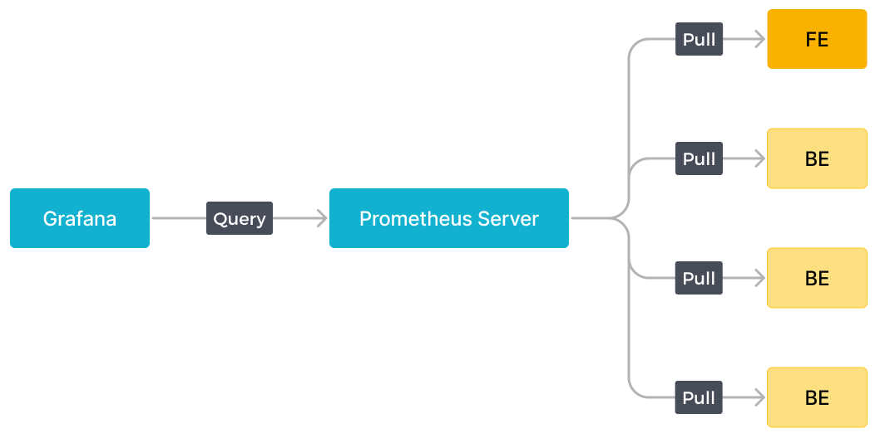
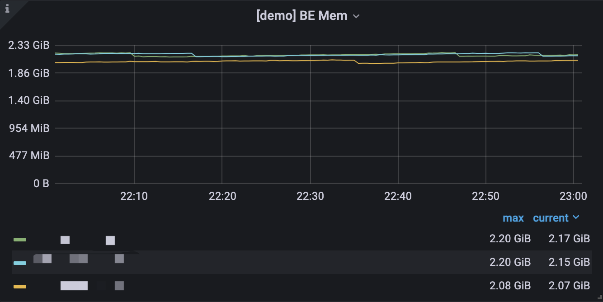

# Monitor and Alerting

独自のモニタリングサービスを構築することも、Prometheus + Grafana ソリューションを使用することもできます。StarRocks は、BE と FE の HTTP ポートに直接リンクする Prometheus 互換のインターフェースを提供し、クラスターからモニタリング情報を取得します。

## Monitoring Indicators

利用可能なメトリクスは次のとおりです。

|Indicator|Unit|Type|Meaning|
|---|:---:|:---:|---|
|be_broker_count|pcs|average|Number of brokers |
|be_brpc_endpoint_count|pcs|average|Number of StubCache in bRPC|
|be_bytes_read_per_second|bytes/s|average| Read speed of BE |
|be_bytes_written_per_second|bytes/s|average|Write speed of BE |
|be_base_compaction_bytes_per_second|bytes/s|average|Base compaction speed of BE|
|be_cumulative_compaction_bytes_per_second|bytes/s|average|Cumulative compaction speed of BE|
|be_base_compaction_rowsets_per_second|rowsets/s|average| Base compaction speed of BE rowsets|
|be_cumulative_compaction_rowsets_per_second|rowsets/s|average| Cumulative compaction speed of BE rowsets |
|be_base_compaction_failed|pcs/s|average|Base compaction failure of BE |
|be_clone_failed| pcs/s |average|BE clone failure |
|be_create_rollup_failed| pcs/s |average|Materialized view creation failure of BE |
|be_create_tablet_failed| pcs/s |average|Tablet creation failure of BE |
|be_cumulative_compaction_failed| pcs/s |average|Cumulative compaction failure of BE |
|be_delete_failed| pcs/s |average| Delete failure of BE |
|be_finish_task_failed| pcs/s |average|Task failure of BE |
|be_publish_failed| pcs/s |average| Version release failure of BE |
|be_report_tables_failed| pcs/s |average| Table report failure of BE |
|be_report_disk_failed| pcs/s |average|Disk report failure of BE |
|be_report_tablet_failed| pcs/s |average|Tablet report failure of BE |
|be_report_task_failed| pcs/s |average|Task report failure of BE |
|be_schema_change_failed| pcs/s |average|Schema change failure of BE |
|be_base_compaction_requests| pcs/s |average|Base compaction request of BE |
|be_clone_total_requests| pcs/s |average|Clone request of BE |
|be_create_rollup_requests| pcs/s |average| Materialized view creation request of BE |
|be_create_tablet_requests|pcs/s|average| Tablet creation request of BE |
|be_cumulative_compaction_requests|pcs/s|average|Cumulative compaction request of BE |
|be_delete_requests|pcs/s|average| Delete request of BE |
|be_finish_task_requests|pcs/s|average| Task finish request of BE |
|be_publish_requests|pcs/s|average| Version publish request of BE |
|be_report_tablets_requests|pcs/s|average|Tablet report request of BE |
|be_report_disk_requests|pcs/s|average|Disk report request of BE |
|be_report_tablet_requests|pcs/s|average|Tablet report request of BE |
|be_report_task_requests|pcs/s|average|Task report request of BE |
|be_schema_change_requests|pcs/s|average|Schema change report request of BE |
|be_storage_migrate_requests|pcs/s|average| Migration request of BE |
|be_fragment_endpoint_count|pcs|average|Number of BE DataStream |
|be_fragment_request_latency_avg|ms|average| Latency of fragment requests |
|be_fragment_requests_per_second|pcs/s|average|Number of fragment requests|
|be_http_request_latency_avg|ms|average|Latency of HTTP requests |
|be_http_requests_per_second|pcs/s|average|Number of HTTP requests|
|be_http_request_send_bytes_per_second|bytes/s|average| Number of bytes sent for HTTP requests |
|fe_connections_per_second|connections/s|average| New connection rate of FE |
|fe_connection_total|connections| cumulative | Total number of FE connections |
|fe_edit_log_read|operations/s|average|Read speed of FE edit log |
|fe_edit_log_size_bytes|bytes/s|average|Size of FE edit log |
|fe_edit_log_write|bytes/s|average|Write speed of FE edit log |
|fe_checkpoint_push_per_second|operations/s|average|Number of FE checkpoints |
|fe_pending_hadoop_load_job|pcs|average| Number of pending hadoop jobs|
|fe_committed_hadoop_load_job|pcs|average| Number of committed hadoop jobs|
|fe_loading_hadoop_load_job|pcs|average| Number of loading hadoop jobs|
|fe_finished_hadoop_load_job|pcs|average| Number of completed  hadoop jobs|
|fe_cancelled_hadoop_load_job|pcs|average| Number of cancelled hadoop jobs|
|fe_pending_insert_load_job|pcs|average| Number of pending insert jobs |
|fe_loading_insert_load_job|pcs|average| Number of loading insert jobs|
|fe_committed_insert_load_job|pcs|average| Number of committed insert jobs|
|fe_finished_insert_load_job|pcs|average| Number of completed insert jobs|
|fe_cancelled_insert_load_job|pcs|average| Number of cancelled insert jobs|
|fe_pending_broker_load_job|pcs|average| Number of pending broker jobs|
|fe_loading_broker_load_job|pcs|average| Number of loading broker jobs
|fe_committed_broker_load_job|pcs|average| Number of committed broker jobs|
|fe_finished_broker_load_job|pcs|average| Number of finished broker jobs|
|fe_cancelled_broker_load_job|pcs|average| Number of cancelled broker jobs |
|fe_pending_delete_load_job|pcs|average| Number of pending delete jobs|
|fe_loading_delete_load_job|pcs|average| Number of loading delete jobs|
|fe_committed_delete_load_job|pcs|average| Number of committed delete jobs|
|fe_finished_delete_load_job|pcs|average| Number of finished delete jobs|
|fe_cancelled_delete_load_job|pcs|average| Number of cancelled delete jobs|
|fe_rollup_running_alter_job|pcs|average| Number of jobs created in rollup |
|fe_schema_change_running_job|pcs|average| Number of jobs in schema change |
|cpu_util| percentage|average|CPU usage rate |
|cpu_system | percentage|average|cpu_system usage rate |
|cpu_user| percentage|average|cpu_user usage rate |
|cpu_idle| percentage|average|cpu_idle usage rate |
|cpu_guest| percentage|average|cpu_guest usage rate |
|cpu_iowait| percentage|average|cpu_iowait usage rate |
|cpu_irq| percentage|average|cpu_irq usage rate |
|cpu_nice| percentage|average|cpu_nice usage rate |
|cpu_softirq| percentage|average|cpu_softirq usage rate |
|cpu_steal| percentage|average|cpu_steal usage rate |
|disk_free|bytes|average| Free disk capacity |
|disk_io_svctm|Ms|average| Disk IO service time |
|disk_io_util|percentage|average| Disk usage |
|disk_used|bytes|average| Used disk capacity |
|starrocks_fe_meta_log_count|pcs|Instantaneous|The number of Edit Logs without a checkpoint. A value within `100000` is considered reasonable.|
|starrocks_fe_query_resource_group|pcs|cumulative|The number of queries for each resource group|
|starrocks_fe_query_resource_group_latency|second|average|the query latency percentile for each resource group|
|starrocks_fe_query_resource_group_err|pcs|cumulative|The number of incorrect queries for each resource group|
|starrocks_be_resource_group_cpu_limit_ratio|percentage|Instantaneous|Instantaneous value of resource group cpu quota ratio|
|starrocks_be_resource_group_cpu_use_ratio|percentage|average|The ratio of CPU time used by the resource group to the CPU time of all resource groups|
|starrocks_be_resource_group_mem_limit_bytes|Byte|Instantaneous|Instantaneous value of resource group memory quota|
|starrocks_be_resource_group_mem_allocated_bytes|Byte|Instantaneous|Instantaneous value of resource group memory usage|

## Monitoring Alarm Best Practices

モニタリングシステムに関する背景情報:

1. システムは15秒ごとに情報を収集します。
2. 一部の指標は15秒で割られ、単位は pcs/sec です。一部の指標は割られず、カウントは15秒のままです。
3. P90、P99 などの分位数は現在15秒以内でカウントされています。より大きな粒度（1分、5分など）で計算する場合、「特定の値を超えるアラームの数」を使用し、「平均値は何か」を使用しないでください。

### References

1. モニタリングの目的は、正常な状態ではなく異常な状態にのみアラートを出すことです。
2. 異なるクラスターは異なるリソース（メモリ、ディスクなど）を持ち、異なる使用法があり、異なる値に設定する必要があります。ただし、「パーセンテージ」は測定単位として普遍的です。
3. `number of failures` などの指標については、総数の変化を監視し、一定の割合に基づいてアラーム境界値を計算する必要があります（たとえば、P90、P99、P999 の量について）。
4. `2倍以上の値` または `ピークを超える値` は、通常、使用済み/クエリの成長の警告値として使用できます。

### Alarm settings

#### Low frequency alarms

1つ以上の障害が発生した場合にアラームをトリガーします。複数の障害がある場合は、より高度なアラームを設定します。

頻繁に実行されない操作（例: schema change）については、「失敗時にアラームを出す」だけで十分です。

#### No task started

モニタリングアラームがオンになると、多くの成功したタスクと失敗したタスクが発生する可能性があります。`failed > 1` を設定してアラートを出し、後で修正できます。

#### Fluctuation

##### Large fluctuations

異なる時間粒度のデータに注目する必要があります。大きな粒度のデータのピークと谷が平均化される可能性があります。通常、15日、3日、12時間、3時間、1時間（異なる時間範囲）を確認する必要があります。

モニタリング間隔は、変動によって引き起こされるアラームを遮るために、やや長くする必要があるかもしれません（例: 3分、5分、またはそれ以上）。

##### Small fluctuations

問題が発生したときにすぐにアラームを受け取るために、短い間隔を設定します。

##### High spikes

スパイクがアラームを必要とするかどうかに依存します。スパイクが多すぎる場合、長い間隔を設定することでスパイクを平滑化するのに役立つかもしれません。

#### Resource usage

##### High resource usage

少しリソースを予約するためにアラームを設定できます。たとえば、メモリアラートを `mem_avaliable<=20%` に設定します。

##### Low resource usage

「高リソース使用率」よりも厳しい値を設定できます。たとえば、低使用率（20%未満）の CPU に対して、アラームを `cpu_idle<60%` に設定します。

### Caution

通常、FE/BE は一緒に監視されますが、FE または BE のみが持つ値もあります。

モニタリングのためにバッチで設定する必要があるマシンがあるかもしれません。

### Additional information

#### P99 Batch calculation rules

ノードは15秒ごとにデータを収集し、値を計算します。99パーセンタイルは、その15秒間の99パーセンタイルです。QPS が高くない場合（例: QPS が10未満）、これらのパーセンタイルはあまり正確ではありません。また、1分間に生成された4つの値（4 x 15秒）を集約することは、合計または平均関数を使用しても意味がありません。

P50、P90 などにも同様のことが言えます。

#### Cluster Monitoring for errors

> 一部の望ましくないクラスターエラーは、クラスターを安定させるために時間内に見つけて解決する必要があります。エラーがそれほど重大でない場合（例: SQL 構文エラーなど）でも、**重要なエラー項目から除外できない場合**、最初に監視し、後でそれらを区別することをお勧めします。

## Using Prometheus+Grafana

StarRocks は [Prometheus](https://prometheus.io/) を使用してデータストレージを監視し、[Grafana](https://grafana.com/) を使用して結果を視覚化できます。

### Components

>このドキュメントは、Prometheus と Grafana の実装に基づく StarRocks の視覚的モニタリングソリューションについて説明しています。StarRocks は、これらのコンポーネントの保守や開発を担当していません。Prometheus と Grafana の詳細については、それぞれの公式ウェブサイトを参照してください。

#### Prometheus

Prometheus は、時系列データベースで、多次元データモデルと柔軟なクエリ文を持っています。監視対象システムからデータをプルまたはプッシュすることでデータを収集し、これらのデータを時系列データベースに保存します。その豊富な多次元データクエリ言語を通じて、異なるユーザーのニーズに応えます。

#### Grafana

Grafana は、オープンソースのメトリック分析および視覚化システムで、さまざまなデータソースをサポートしています。Grafana は、対応するクエリ文でデータソースからデータを取得します。ユーザーは、データを視覚化するためのチャートやダッシュボードを作成できます。

### Monitoring architecture



Prometheus は、FE/BE インターフェースからメトリクスをプルし、データを時系列データベースに保存します。

Grafana では、ユーザーが Prometheus をデータソースとして設定し、ダッシュボードをカスタマイズできます。

### Deployment

#### Prometheus

**1.** [Prometheus 公式ウェブサイト](https://prometheus.io/download/)から最新バージョンの Prometheus をダウンロードします。ここでは、prometheus-2.29.1.linux-amd64 バージョンを例にとります。

```bash
wget https://github.com/prometheus/prometheus/releases/download/v2.29.1/prometheus-2.29.1.linux-amd64.tar.gz
tar -xf prometheus-2.29.1.linux-amd64.tar.gz
```

**2.** `vi prometheus.yml` に設定を追加します。

```yml
# my global config
global:
  scrape_interval: 15s # global acquisition interval, 1m by default, here set to 15s
  evaluation_interval: 15s # global rule trigger interval, 1m by default, here set to 15s

scrape_configs:
  # The job name is added as a label `job=<job_name>` to any timeseries scraped from this config.
  - job_name: 'StarRocks_Cluster01' # Each cluster is called a job, job name is customizable
    metrics_path: '/metrics' # Specify the Restful API to get metrics

    static_configs:
      - targets: ['fe_host1:http_port','fe_host3:http_port','fe_host3:http_port']
        labels:
          group: fe # Here the group of FE is configured which contains 3 Frontends

      - targets: ['be_host1:http_port', 'be_host2:http_port', 'be_host3:http_port']
        labels:
          group: be # The group of BE is configured here which contains three Backends
  - job_name: 'StarRocks_Cluster02' # Multiple StarRocks clusters can be monitored in Prometheus
metrics_path: '/metrics'

    static_configs:
      - targets: ['fe_host1:http_port','fe_host3:http_port','fe_host3:http_port']
        labels:
          group: fe

      - targets: ['be_host1:http_port', 'be_host2:http_port', 'be_host3:http_port']
        labels:
          group: be
```

**3.** Prometheus を起動します。

```bash
nohup ./prometheus \
    --config.file="./prometheus.yml" \
    --web.listen-address=":9090" \
    --log.level="info" &
```

このコマンドは、Prometheus をバックグラウンドで実行し、その Web ポートを 9090 に指定します。設定が完了すると、Prometheus はデータを収集し、`. /data` ディレクトリに保存します。

**4.** Prometheus へのアクセス

Prometheus は BUI 経由でアクセスできます。ブラウザでポート 9090 を開くだけです。`Status -> Targets` に移動して、すべてのグループ化されたジョブの監視対象ホストノードを確認します。通常、すべてのノードは `UP` であるべきです。ノードの状態が `UP` でない場合は、StarRocks メトリクス（`http://fe_host:fe_http_port/metrics` または `http://be_host:be_http_port/metrics`）インターフェースに最初にアクセスして、アクセス可能かどうかを確認するか、Prometheus ドキュメントを参照してトラブルシューティングを行ってください。


シンプルな Prometheus が構築され、設定されました。より高度な使用法については、[公式ドキュメント](https://prometheus.io/docs/introduction/overview/)を参照してください。

#### Grafana

**1.** [Grafana 公式ウェブサイト](https://grafana.com/grafana/download)から最新バージョンの Grafana をダウンロードします。ここでは、grafana-8.0.6.linux-amd64 バージョンを例にとります。

```SHELL
wget https://dl.grafana.com/oss/release/grafana-8.0.6.linux-amd64.tar.gz
tar -zxf grafana-8.0.6.linux-amd64.tar.gz
```

**2.** `vi . /conf/defaults.ini` に設定を追加します。

```ini
...
[paths]
data = ./data
logs = ./data/log
plugins = ./data/plugins
[server]
http_port = 8000
domain = localhost
...
```

**3.** Grafana を起動します。

```Plain text
nohup ./bin/grafana-server \
    --config="./conf/grafana.ini" &
```

### Dashboard

#### DashBoard Configuration

前のステップで設定したアドレス `http://grafana_host:8000` を通じて Grafana にログインし、デフォルトのユーザー名、パスワード（例: admin, admin）を使用します。

**1.** データソースを追加します。

設定パス: `Configuration-->Data sources-->Add data source-->Prometheus`

データソース設定の紹介


* Name: データソースの名前。カスタマイズ可能です。例: starrocks_monitor
* URL: Prometheus の Web アドレス。例: `http://prometheus_host:9090`
* Access: サーバーメソッドを選択します。つまり、Grafana があるサーバーが Prometheus にアクセスします。
他のオプションはデフォルトです。

下部の Save & Test をクリックし、`Data source is working` と表示された場合、データソースが利用可能であることを意味します。

**2.** ダッシュボードを追加します。

ダッシュボードをダウンロードします。

> **NOTE**
>
> StarRocks v1.19.0 と v2.4.0 のメトリック名が変更されました。StarRocks のバージョンに基づいてダッシュボードテンプレートをダウンロードする必要があります:
>
> * [v1.19.0 より前のバージョン用ダッシュボードテンプレート](http://starrocks-thirdparty.oss-cn-zhangjiakou.aliyuncs.com/StarRocks-Overview.json)
> * [v1.19.0 から v2.4.0（排他的）までのバージョン用ダッシュボードテンプレート](http://starrocks-thirdparty.oss-cn-zhangjiakou.aliyuncs.com/StarRocks-Overview-19.json)
> * [v2.4.0 以降のバージョン用ダッシュボードテンプレート](http://starrocks-thirdparty.oss-cn-zhangjiakou.aliyuncs.com/StarRocks-Overview-24-new.json)

ダッシュボードテンプレートは随時更新されます。

データソースが利用可能であることを確認した後、`+` 記号をクリックして新しいダッシュボードを追加します。ここでは、上記でダウンロードした StarRocks ダッシュボードテンプレートを使用します。Import -> Upload Json File に移動して、ダウンロードした json ファイルを読み込みます。

読み込み後、ダッシュボードに名前を付けることができます。デフォルトの名前は StarRocks Overview です。その後、データソースとして `starrocks_monitor` を選択します。
`Import` をクリックしてインポートを完了します。すると、ダッシュボードが表示されるはずです。

#### Dashboard Description

ダッシュボードに説明を追加します。各バージョンの説明を更新します。

**1.** トップバー


左上にはダッシュボード名が表示されます。
右上には現在の時間範囲が表示されます。ドロップダウンを使用して異なる時間範囲を選択し、ページの更新間隔を指定します。
cluster_name: Prometheus 設定ファイル内の各ジョブの `job_name` で、StarRocks クラスターを表します。クラスターを選択し、そのモニタリング情報をチャートで確認できます。

* fe_master: クラスターのリーダーノード。
* fe_instance: 対応するクラスターのすべてのフロントエンドノード。選択してチャートでモニタリング情報を表示します。
* be_instance: 対応するクラスターのすべてのバックエンドノード。選択してチャートでモニタリング情報を表示します。
* interval: 一部のチャートはモニタリング項目に関連する間隔を表示します。間隔はカスタマイズ可能です（注意: 15秒間隔は一部のチャートが表示されない原因になるかもしれません）。

**2.** Row


Grafana では、`Row` の概念は図のコレクションです。クリックすると `Row` を折りたたむことができます。現在のダッシュボードには次の `Rows` があります:

* Overview: すべての StarRocks クラスターの表示。
* Cluster Overview: 選択したクラスターの表示。
* Query Statistic: 選択したクラスターのクエリのモニタリング。
* Jobs: インポートジョブのモニタリング。
* Transaction: トランザクションのモニタリング。
* FE JVM: 選択したフロントエンドの JVM のモニタリング。
* BE: 選択したクラスターのバックエンドの表示。
* BE Task: 選択したクラスターのバックエンドタスクの表示。

**3.** 典型的なチャートは次の部分に分かれています。



* 左上の i アイコンにカーソルを合わせると、チャートの説明が表示されます。
* 下の凡例をクリックして特定の項目を表示します。もう一度クリックするとすべて表示されます。
* チャート内でドラッグして時間範囲を選択します。
* タイトルの [] 内に選択したクラスターの名前が表示されます。
* 値は左の Y 軸または右の Y 軸に対応する場合があり、凡例の末尾に -right が付いていることで区別できます。
* チャート名をクリックして名前を編集します。

### Other

独自の Prometheus システムでモニタリングデータにアクセスする必要がある場合は、次のインターフェースを通じてアクセスします。

* FE: fe_host:fe_http_port/metrics
* BE: be_host:be_web_server_port/metrics

JSON 形式が必要な場合は、次のインターフェースを使用します。

* FE: fe_host:fe_http_port/metrics?type=json
* BE: be_host:be_web_server_port/metrics?type=json