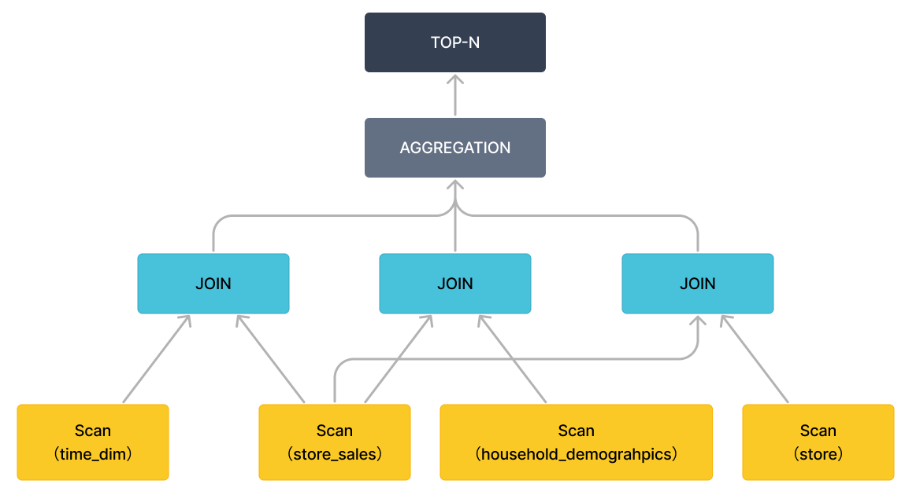
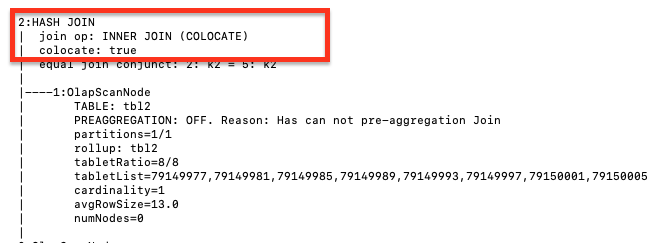

# クエリ分析

クエリパフォーマンスを最適化する方法は、よくある質問です。遅いクエリはユーザーエクスペリエンスやクラスターパフォーマンスに悪影響を与えます。クエリパフォーマンスを分析し、最適化することが重要です。

クエリ情報は `fe/log/fe.audit.log` で確認できます。各クエリには `QueryID` が対応しており、それを使用してクエリの `QueryPlan` と `Profile` を検索できます。`QueryPlan` は、FE が SQL 文を解析して生成した実行プランです。`Profile` は BE の実行結果で、各ステップで消費された時間や処理されたデータ量などの情報を含みます。

## プラン分析

StarRocks では、SQL 文のライフサイクルはクエリ解析、クエリ計画、クエリ実行の3つのフェーズに分けられます。分析ワークロードの必要な QPS は高くないため、クエリ解析は一般的にボトルネックにはなりません。

StarRocks のクエリパフォーマンスは、クエリ計画とクエリ実行によって決まります。クエリ計画はオペレーター (Join/Order/Aggregate) を調整し、クエリ実行は具体的な操作を実行します。

クエリプランは、DBA にクエリ情報をマクロ的にアクセスするための手段を提供します。クエリプランはクエリパフォーマンスの鍵であり、DBA が参照するための良いリソースです。以下のコードスニペットは、`TPCDS query96` を例にしてクエリプランの表示方法を示しています。

クエリのプランを表示するには、[EXPLAIN](../sql-reference/sql-statements/cluster-management/plan_profile/EXPLAIN.md) ステートメントを使用します。

~~~SQL
EXPLAIN select  count(*)
from store_sales
    ,household_demographics
    ,time_dim
    , store
where ss_sold_time_sk = time_dim.t_time_sk
    and ss_hdemo_sk = household_demographics.hd_demo_sk
    and ss_store_sk = s_store_sk
    and time_dim.t_hour = 8
    and time_dim.t_minute >= 30
    and household_demographics.hd_dep_count = 5
    and store.s_store_name = 'ese'
order by count(*) limit 100;
~~~

クエリプランには2種類あります。論理クエリプランと物理クエリプランです。ここで説明するクエリプランは論理クエリプランを指します。`TPCDS query96.sql` に対応するクエリプランは以下の通りです。

~~~sql
+------------------------------------------------------------------------------+
| Explain String                                                               |
+------------------------------------------------------------------------------+
| PLAN FRAGMENT 0                                                              |
|  OUTPUT EXPRS:<slot 11>                                                      |
|   PARTITION: UNPARTITIONED                                                   |
|   RESULT SINK                                                                |
|   12:MERGING-EXCHANGE                                                        |
|      limit: 100                                                              |
|      tuple ids: 5                                                            |
|                                                                              |
| PLAN FRAGMENT 1                                                              |
|  OUTPUT EXPRS:                                                               |
|   PARTITION: RANDOM                                                          |
|   STREAM DATA SINK                                                           |
|     EXCHANGE ID: 12                                                          |
|     UNPARTITIONED                                                            |
|                                                                              |
|   8:TOP-N                                                                    |
|   |  order by: <slot 11> ASC                                                 |
|   |  offset: 0                                                               |
|   |  limit: 100                                                              |
|   |  tuple ids: 5                                                            |
|   |                                                                          |
|   7:AGGREGATE (update finalize)                                              |
|   |  output: count(*)                                                        |
|   |  group by:                                                               |
|   |  tuple ids: 4                                                            |
|   |                                                                          |
|   6:HASH JOIN                                                                |
|   |  join op: INNER JOIN (BROADCAST)                                         |
|   |  hash predicates:                                                        |
|   |  colocate: false, reason: left hash join node can not do colocate        |
|   |  equal join conjunct: `ss_store_sk` = `s_store_sk`                       |
|   |  tuple ids: 0 2 1 3                                                      |
|   |                                                                          |
|   |----11:EXCHANGE                                                           |
|   |       tuple ids: 3                                                       |
|   |                                                                          |
|   4:HASH JOIN                                                                |
|   |  join op: INNER JOIN (BROADCAST)                                         |
|   |  hash predicates:                                                        |
|   |  colocate: false, reason: left hash join node can not do colocate        |
|   |  equal join conjunct: `ss_hdemo_sk`=`household_demographics`.`hd_demo_sk`|
|   |  tuple ids: 0 2 1                                                        |
|   |                                                                          |
|   |----10:EXCHANGE                                                           |
|   |       tuple ids: 1                                                       |
|   |                                                                          |
|   2:HASH JOIN                                                                |
|   |  join op: INNER JOIN (BROADCAST)                                         |
|   |  hash predicates:                                                        |
|   |  colocate: false, reason: table not in same group                        |
|   |  equal join conjunct: `ss_sold_time_sk` = `time_dim`.`t_time_sk`         |
|   |  tuple ids: 0 2                                                          |
|   |                                                                          |
|   |----9:EXCHANGE                                                            |
|   |       tuple ids: 2                                                       |
|   |                                                                          |
|   0:OlapScanNode                                                             |
|      TABLE: store_sales                                                      |
|      PREAGGREGATION: OFF. Reason: `ss_sold_time_sk` is value column          |
|      partitions=1/1                                                          |
|      rollup: store_sales                                                     |
|      tabletRatio=0/0                                                         |
|      tabletList=                                                             |
|      cardinality=-1                                                          |
|      avgRowSize=0.0                                                          |
|      numNodes=0                                                              |
|      tuple ids: 0                                                            |
|                                                                              |
| PLAN FRAGMENT 2                                                              |
|  OUTPUT EXPRS:                                                               |
|   PARTITION: RANDOM                                                          |
|                                                                              |
|   STREAM DATA SINK                                                           |
|     EXCHANGE ID: 11                                                          |
|     UNPARTITIONED                                                            |
|                                                                              |
|   5:OlapScanNode                                                             |
|      TABLE: store                                                            |
|      PREAGGREGATION: OFF. Reason: null                                       |
|      PREDICATES: `store`.`s_store_name` = 'ese'                              |
|      partitions=1/1                                                          |
|      rollup: store                                                           |
|      tabletRatio=0/0                                                         |
|      tabletList=                                                             |
|      cardinality=-1                                                          |
|      avgRowSize=0.0                                                          |
|      numNodes=0                                                              |
|      tuple ids: 3                                                            |
|                                                                              |
| PLAN FRAGMENT 3                                                              |
|  OUTPUT EXPRS:                                                               |
|   PARTITION: RANDOM                                                          |
|   STREAM DATA SINK                                                           |
|     EXCHANGE ID: 10                                                          |
|     UNPARTITIONED                                                            |
|                                                                              |
|   3:OlapScanNode                                                             |
|      TABLE: household_demographics                                           |
|      PREAGGREGATION: OFF. Reason: null                                       |
|      PREDICATES: `household_demographics`.`hd_dep_count` = 5                 |
|      partitions=1/1                                                          |
|      rollup: household_demographics                                          |
|      tabletRatio=0/0                                                         |
|      tabletList=                                                             |
|      cardinality=-1                                                          |
|      avgRowSize=0.0                                                          |
|      numNodes=0                                                              |
|      tuple ids: 1                                                            |
|                                                                              |
| PLAN FRAGMENT 4                                                              |
|  OUTPUT EXPRS:                                                               |
|   PARTITION: RANDOM                                                          |
|   STREAM DATA SINK                                                           |
|     EXCHANGE ID: 09                                                          |
|     UNPARTITIONED                                                            |
|                                                                              |
|   1:OlapScanNode                                                             |
|      TABLE: time_dim                                                         |
|      PREAGGREGATION: OFF. Reason: null                                       |
|      PREDICATES: `time_dim`.`t_hour` = 8, `time_dim`.`t_minute` >= 30        |
|      partitions=1/1                                                          |
|      rollup: time_dim                                                        |
|      tabletRatio=0/0                                                         |
|      tabletList=                                                             |
|      cardinality=-1                                                          |
|      avgRowSize=0.0                                                          |
|      numNodes=0                                                              |
|      tuple ids: 2                                                            |
+------------------------------------------------------------------------------+
128 rows in set (0.02 sec)
~~~

クエリ 96 は、いくつかの StarRocks の概念を含むクエリプランを示しています。

|名前|説明|
|--|--|
|avgRowSize|スキャンされたデータ行の平均サイズ|
|cardinality|スキャンされたテーブルのデータ行の総数|
|colocate|テーブルがコロケートモードかどうか|
|numNodes|スキャンされるノードの数|
|rollup|マテリアライズドビュー|
|preaggregation|事前集計|
|predicates|述語、クエリフィルター|

クエリ 96 のクエリプランは、0 から 4 までの5つのフラグメントに分かれています。クエリプランは、下から上に一つずつ読むことができます。

フラグメント 4 は `time_dim` テーブルをスキャンし、関連するクエリ条件（例えば、`time_dim.t_hour = 8 and time_dim.t_minute >= 30`）を事前に実行します。このステップは述語プッシュダウンとも呼ばれます。StarRocks は集計テーブルに対して `PREAGGREGATION` を有効にするかどうかを決定します。前の図では、`time_dim` の事前集計は無効になっています。この場合、`time_dim` のすべてのディメンション列が読み取られ、テーブルに多くのディメンション列がある場合、パフォーマンスに悪影響を与える可能性があります。`time_dim` テーブルがデータ分割に `range partition` を選択した場合、クエリプランでいくつかのパーティションがヒットし、関連のないパーティションは自動的にフィルタリングされます。マテリアライズドビューがある場合、StarRocks はクエリに基づいてマテリアライズドビューを自動的に選択します。マテリアライズドビューがない場合、クエリは自動的にベーステーブルにヒットします（例えば、前の図の `rollup: time_dim`）。

スキャンが完了すると、フラグメント 4 は終了します。データは、前の図で示されているように EXCHANGE ID : 09 によって他のフラグメントに渡され、受信ノードラベル 9 に送られます。

クエリ 96 のクエリプランでは、フラグメント 2、3、および 4 は同様の機能を持っていますが、異なるテーブルをスキャンする役割を担っています。具体的には、クエリ内の `Order/Aggregation/Join` 操作はフラグメント 1 で実行されます。

フラグメント 1 は `BROADCAST` メソッドを使用して `Order/Aggregation/Join` 操作を実行します。これは、小さなテーブルを大きなテーブルにブロードキャストすることを意味します。両方のテーブルが大きい場合は、`SHUFFLE` メソッドを使用することをお勧めします。現在、StarRocks は `HASH JOIN` のみをサポートしています。`colocate` フィールドは、結合された2つのテーブルが同じ方法でパーティション化およびバケット化されていることを示し、データを移動せずにローカルでジョイン操作を実行できることを示します。ジョイン操作が完了すると、上位レベルの `aggregation`、`order by`、および `top-n` 操作が実行されます。

特定の式を削除することで（オペレーターのみを保持）、クエリプランはよりマクロ的なビューで表示できます。以下の図に示されています。



## クエリヒント

クエリヒントは、クエリオプティマイザにクエリの実行方法を明示的に提案する指示またはコメントです。現在、StarRocks は3種類のヒントをサポートしています：システム変数ヒント (`SET_VAR`)、ユーザー定義変数ヒント (`SET_USER_VARIABLE`)、および Join ヒントです。ヒントは単一のクエリ内でのみ有効です。

### システム変数ヒント

`SET_VAR` ヒントを使用して、SELECT および SUBMIT TASK ステートメントで1つ以上の[システム変数](../sql-reference/System_variable.md)を設定し、その後ステートメントを実行できます。また、CREATE MATERIALIZED VIEW AS SELECT や CREATE VIEW AS SELECT などの他のステートメントに含まれる SELECT 句でも `SET_VAR` ヒントを使用できます。注意すべき点は、`SET_VAR` ヒントが CTE の SELECT 句で使用された場合、ステートメントが正常に実行されても `SET_VAR` ヒントは有効にならないことです。

[システム変数の一般的な使用法](../sql-reference/System_variable.md)と比較して、`SET_VAR` ヒントはステートメントレベルで有効であり、セッション全体には影響しません。

#### 構文

~~~SQL
[...] SELECT /*+ SET_VAR(key=value [, key = value]) */ ...
SUBMIT [/*+ SET_VAR(key=value [, key = value]) */] TASK ...
~~~

#### 例

集計クエリの集計モードを指定するには、`SET_VAR` ヒントを使用して、集計クエリでシステム変数 `streaming_preaggregation_mode` と `new_planner_agg_stage` を設定します。

~~~SQL
SELECT /*+ SET_VAR (streaming_preaggregation_mode = 'force_streaming',new_planner_agg_stage = '2') */ SUM(sales_amount) AS total_sales_amount FROM sales_orders;
~~~

SUBMIT TASK ステートメントの実行タイムアウトを指定するには、`SET_VAR` ヒントを使用して、SUBMIT TASK ステートメントでシステム変数 `query_timeout` を設定します。

~~~SQL
SUBMIT /*+ SET_VAR(query_timeout=3) */ TASK AS CREATE TABLE temp AS SELECT count(*) AS cnt FROM tbl1;
~~~

マテリアライズドビューを作成するためのサブクエリの実行タイムアウトを指定するには、`SET_VAR` ヒントを使用して、SELECT 句でシステム変数 `query_timeout` を設定します。

~~~SQL
CREATE MATERIALIZED VIEW mv 
PARTITION BY dt 
DISTRIBUTED BY HASH(`key`) 
BUCKETS 10 
REFRESH ASYNC 
AS SELECT /*+ SET_VAR(query_timeout=500) */ * from dual;
~~~

### ユーザー定義変数ヒント

`SET_USER_VARIABLE` ヒントを使用して、SELECT ステートメントまたは INSERT ステートメントで1つ以上の[ユーザー定義変数](../sql-reference/user_defined_variables.md)を設定できます。他のステートメントが SELECT 句を含む場合、その SELECT 句でも `SET_USER_VARIABLE` ヒントを使用できます。他のステートメントは SELECT ステートメントおよび INSERT ステートメントである必要がありますが、CREATE MATERIALIZED VIEW AS SELECT ステートメントおよび CREATE VIEW AS SELECT ステートメントでは使用できません。注意すべき点は、`SET_USER_VARIABLE` ヒントが CTE の SELECT 句で使用された場合、ステートメントが正常に実行されても `SET_USER_VARIABLE` ヒントは有効にならないことです。v3.2.4 以降、StarRocks はユーザー定義変数ヒントをサポートしています。

[ユーザー定義変数の一般的な使用法](../sql-reference/user_defined_variables.md)と比較して、`SET_USER_VARIABLE` ヒントはステートメントレベルで有効であり、セッション全体には影響しません。

#### 構文

```SQL
[...] SELECT /*+ SET_USER_VARIABLE(@var_name = expr [, @var_name = expr]) */ ...
INSERT /*+ SET_USER_VARIABLE(@var_name = expr [, @var_name = expr]) */ ...
```

#### 例

次の SELECT ステートメントは、スカラーサブクエリ `select max(age) from users` および `select min(name) from users` を参照しているため、`SET_USER_VARIABLE` ヒントを使用してこれらの2つのスカラーサブクエリをユーザー定義変数として設定し、その後クエリを実行できます。

~~~SQL
SELECT /*+ SET_USER_VARIABLE (@a = (select max(age) from users), @b = (select min(name) from users)) */ * FROM sales_orders where sales_orders.age = @a and sales_orders.name = @b;
~~~

### Join ヒント

複数テーブルの Join クエリにおいて、オプティマイザは通常、最適な Join 実行方法を選択します。特別な場合には、Join ヒントを使用してオプティマイザに Join 実行方法を明示的に提案したり、Join Reorder を無効にすることができます。現在、Join ヒントは Shuffle Join、Broadcast Join、Bucket Shuffle Join、または Colocate Join を Join 実行方法として提案することをサポートしています。Join ヒントが使用されると、オプティマイザは Join Reorder を実行しません。そのため、より小さなテーブルを右側のテーブルとして選択する必要があります。さらに、[Colocate Join](../using_starrocks/Colocate_join.md) または Bucket Shuffle Join を Join 実行方法として提案する場合、結合されるテーブルのデータ分布がこれらの Join 実行方法の要件を満たしていることを確認する必要があります。そうでない場合、提案された Join 実行方法は効果を発揮しません。

#### 構文

~~~SQL
... JOIN { [BROADCAST] | [SHUFFLE] | [BUCKET] | [COLOCATE] | [UNREORDER]} ...
~~~

> **注意**
>
> Join ヒントは大文字小文字を区別しません。

#### 例

- Shuffle Join

  Join 操作が実行される前に、テーブル A と B の同じバケッティングキー値を持つデータ行を同じマシンにシャッフルする必要がある場合、Join 実行方法を Shuffle Join としてヒントを与えることができます。

  ~~~SQL
  select k1 from t1 join [SHUFFLE] t2 on t1.k1 = t2.k2 group by t2.k2;
  ~~~

- Broadcast Join
  
  テーブル A が大きなテーブルで、テーブル B が小さなテーブルの場合、Join 実行方法を Broadcast Join としてヒントを与えることができます。テーブル B のデータは、テーブル A のデータが存在するマシンに完全にブロードキャストされ、その後 Join 操作が実行されます。Shuffle Join と比較して、Broadcast Join はテーブル A のデータのシャッフルコストを節約します。

  ~~~SQL
  select k1 from t1 join [BROADCAST] t2 on t1.k1 = t2.k2 group by t2.k2;
  ~~~

- Bucket Shuffle Join
  
  Join クエリの Join 等値結合式にテーブル A のバケッティングキーが含まれている場合、特にテーブル A と B の両方が大きなテーブルである場合、Join 実行方法を Bucket Shuffle Join としてヒントを与えることができます。テーブル B のデータは、テーブル A のデータ分布に従って、テーブル A のデータが存在するマシンにシャッフルされ、その後 Join 操作が実行されます。Broadcast Join と比較して、Bucket Shuffle Join はデータ転送を大幅に削減します。Bucket Shuffle Join に参加するテーブルは、非パーティション化されているか、コロケートされている必要があります。

  ~~~SQL
  select k1 from t1 join [BUCKET] t2 on t1.k1 = t2.k2 group by t2.k2;
  ~~~

- Colocate Join
  
  テーブル A と B がテーブル作成時に指定された同じ Colocation Group に属している場合、テーブル A と B の同じバケッティングキー値を持つデータ行は同じ BE ノードに分散されます。Join クエリの Join 等値結合式にテーブル A と B のバケッティングキーが含まれている場合、Join 実行方法を Colocate Join としてヒントを与えることができます。同じキー値を持つデータはローカルで直接結合され、ノード間のデータ転送にかかる時間を削減し、クエリパフォーマンスを向上させます。

  ~~~SQL
  select k1 from t1 join [COLOCATE] t2 on t1.k1 = t2.k2 group by t2.k2;
  ~~~

#### Join 実行方法の表示

`EXPLAIN` コマンドを使用して、実際の Join 実行方法を確認します。返された結果が Join ヒントと一致する場合、Join ヒントが有効であることを意味します。

~~~SQL
EXPLAIN select k1 from t1 join [COLOCATE] t2 on t1.k1 = t2.k2 group by t2.k2;
~~~



## SQL フィンガープリント

SQL フィンガープリントは、遅いクエリを最適化し、システムリソースの利用を改善するために使用されます。StarRocks は、遅いクエリログ (`fe.audit.log.slow_query`) 内の SQL 文を正規化し、SQL 文を異なるタイプに分類し、各 SQL タイプの MD5 ハッシュ値を計算して遅いクエリを識別します。MD5 ハッシュ値はフィールド `Digest` によって指定されます。

~~~SQL
2021-12-27 15:13:39,108 [slow_query] |Client=172.26.xx.xxx:54956|User=root|Db=default_cluster:test|State=EOF|Time=2469|ScanBytes=0|ScanRows=0|ReturnRows=6|StmtId=3|QueryId=824d8dc0-66e4-11ec-9fdc-00163e04d4c2|IsQuery=true|feIp=172.26.92.195|Stmt=select count(*) from test_basic group by id_bigint|Digest=51390da6b57461f571f0712d527320f4
~~~

SQL 文の正規化は、ステートメントテキストをより正規化された形式に変換し、重要なステートメント構造のみを保持します。

- データベース名やテーブル名などのオブジェクト識別子を保持します。

- 定数を疑問符（?）に変換します。

- コメントを削除し、スペースをフォーマットします。

例えば、以下の2つの SQL 文は、正規化後に同じタイプに属します。

- 正規化前の SQL 文

~~~SQL
SELECT * FROM orders WHERE customer_id=10 AND quantity>20


SELECT * FROM orders WHERE customer_id = 20 AND quantity > 100
~~~

- 正規化後の SQL 文

~~~SQL
SELECT * FROM orders WHERE customer_id=? AND quantity>?
~~~