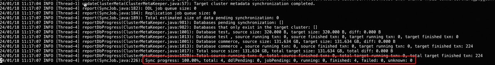
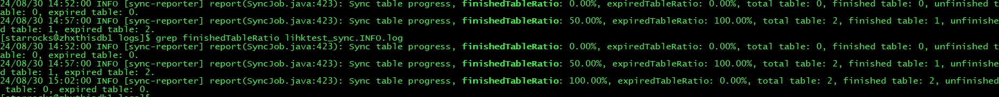

# クロスクラスタデータ移行ツール

StarRocks クロスクラスタデータ移行ツールは、StarRocks コミュニティによって提供されています。このツールを使用すると、ソースクラスタからターゲットクラスタへのデータ移行を簡単に行うことができます。

:::note

- StarRocks クロスクラスタデータ移行ツールは、共有なしクラスタから別の共有なしクラスタまたは共有データクラスタへのデータ移行のみをサポートします。
- ターゲットクラスタの StarRocks バージョンは v3.1.8、v3.2.3 以降である必要があります。

:::

## 準備

データ移行のために、ターゲットクラスタで以下の準備を行う必要があります。

### レプリケーションのレガシー互換性を有効にする

StarRocks は、古いバージョンと新しいバージョンで動作が異なる場合があり、クロスクラスタデータ移行中に問題を引き起こす可能性があります。そのため、データ移行の前にターゲットクラスタでレガシー互換性を有効にし、データ移行が完了した後に無効にする必要があります。

1. レプリケーションのレガシー互換性が有効かどうかを確認するには、次のステートメントを使用します。

   ```SQL
   ADMIN SHOW FRONTEND CONFIG LIKE 'enable_legacy_compatibility_for_replication';
   ```

   `true` が返された場合、レプリケーションのレガシー互換性が有効であることを示します。

2. レプリケーションのレガシー互換性を動的に有効にするには、次のステートメントを使用します。

   ```SQL
   ADMIN SET FRONTEND CONFIG("enable_legacy_compatibility_for_replication"="true");
   ```

3. クラスタの再起動時にデータ移行プロセス中にレガシー互換性が自動的に無効にならないようにするために、FE 設定ファイル **fe.conf** に次の設定項目を追加する必要があります。

   ```Properties
   enable_legacy_compatibility_for_replication = true
   ```

データ移行が完了したら、設定ファイルから `enable_legacy_compatibility_for_replication = true` を削除し、次のステートメントを使用してレプリケーションのレガシー互換性を動的に無効にする必要があります。

```SQL
ADMIN SET FRONTEND CONFIG("enable_legacy_compatibility_for_replication"="false");
```

### Compaction を無効にする

データ移行のターゲットクラスタが共有データクラスタである場合、データ移行を開始する前に手動で Compaction を無効にし、データ移行が完了した後に再度有効にする必要があります。

1. Compaction が有効かどうかを確認するには、次のステートメントを使用します。

   ```SQL
   ADMIN SHOW FRONTEND CONFIG LIKE 'lake_compaction_max_tasks';
   ```

   `0` が返された場合、Compaction が無効であることを示します。

2. Compaction を動的に無効にするには、次のステートメントを使用します。

   ```SQL
   ADMIN SET FRONTEND CONFIG("lake_compaction_max_tasks"="0");
   ```

3. クラスタの再起動時にデータ移行プロセス中に Compaction が自動的に有効にならないようにするために、FE 設定ファイル **fe.conf** に次の設定項目を追加する必要があります。

   ```Properties
   lake_compaction_max_tasks = 0
   ```

データ移行が完了したら、設定ファイルから `lake_compaction_max_tasks = 0` を削除し、次のステートメントを使用して Compaction を動的に有効にする必要があります。

```SQL
ADMIN SET FRONTEND CONFIG("lake_compaction_max_tasks"="-1");
```

### カラムフィルタリングを無効にする

Scan ステージでの未使用カラムフィルタリングの最適化は、移行されたデータに対するクエリ中にクラッシュを引き起こす可能性があります。データ移行の前にこの最適化を無効にする必要があります。

```SQL
SET GLOBAL enable_filter_unused_columns_in_scan_stage=false;
```

#### enable_filter_unused_columns_in_scan_stage

* **説明**: Scan ステージで未使用カラムをフィルタリングするかどうか。
* **デフォルト**: true
* **導入バージョン**: v3.1

### データ移行の設定 (オプション)

次の FE および BE パラメータを使用してデータ移行操作を設定できます。ほとんどの場合、デフォルトの設定で十分です。デフォルトの設定を使用する場合、このステップをスキップできます。

:::note

以下の設定項目の値を増やすと移行が加速しますが、ソースクラスタへの負荷も増加しますのでご注意ください。

:::

#### FE パラメータ

以下の FE パラメータは動的設定項目です。変更方法については、[Configure FE Dynamic Parameters](../administration/management/FE_configuration.md#configure-fe-dynamic-parameters) を参照してください。

| **パラメータ**                         | **デフォルト** | **単位** | **説明**                                              |
| ------------------------------------- | ----------- | -------- | ------------------------------------------------------------ |
| replication_max_parallel_table_count  | 100         | -        | 許可される同時データ同期タスクの最大数。StarRocks は各テーブルに対して 1 つの同期タスクを作成します。 |
| replication_max_parallel_replica_count| 10240       | -        | 同時同期のために許可される tablet レプリカの最大数。 |
| replication_max_parallel_data_size_mb | 1048576     | MB       | 同時同期のために許可されるデータの最大サイズ。 |
| replication_transaction_timeout_sec   | 86400       | 秒       | 同期タスクのタイムアウト時間。              |

#### BE パラメータ

以下の BE パラメータは動的設定項目です。変更方法については、[Configure BE Dynamic Parameters](../administration/management/BE_configuration.md) を参照してください。

| **パラメータ**       | **デフォルト** | **単位** | **説明**                                              |
| ------------------- | ----------- | -------- | ------------------------------------------------------------ |
| replication_threads | 0           | -        | 同期タスクを実行するためのスレッド数。`0` は、BE が存在するマシンの CPU コア数の 4 倍にスレッド数を設定することを示します。 |

## ステップ 1: ツールのインストール

移行ツールは、ターゲットクラスタが存在するサーバーにインストールすることをお勧めします。

1. ターミナルを起動し、ツールのバイナリパッケージをダウンロードします。

   ```Bash
   wget https://releases.starrocks.io/starrocks/starrocks-cluster-sync.tar.gz
   ```

2. パッケージを解凍します。

   ```Bash
   tar -xvzf starrocks-cluster-sync.tar.gz
   ```

## ステップ 2: ツールの設定

### 移行関連の設定

解凍したフォルダに移動し、設定ファイル **conf/sync.properties** を修正します。

```Bash
cd starrocks-cluster-sync
vi conf/sync.properties
```

ファイルの内容は次のとおりです。

```Properties
# true の場合、すべてのテーブルは一度だけ同期され、完了後にプログラムは自動的に終了します。
one_time_run_mode=false

source_fe_host=
source_fe_query_port=9030
source_cluster_user=root
source_cluster_password=
source_cluster_password_secret_key=
source_cluster_token=

target_fe_host=
target_fe_query_port=9030
target_cluster_user=root
target_cluster_password=
target_cluster_password_secret_key=

# カンマ区切りのデータベース名またはテーブル名のリスト <db_name> または <db_name.table_name>
# 例: db1,db2.tbl2,db3
# 有効な順序: 1. include 2. exclude
include_data_list=
exclude_data_list=

# 特別な要件がない場合、以下の設定のデフォルト値を維持してください。
target_cluster_storage_volume=
target_cluster_replication_num=-1
target_cluster_max_disk_used_percent=80

max_replication_data_size_per_job_in_gb=-1

meta_job_interval_seconds=180
meta_job_threads=4
ddl_job_interval_seconds=10
ddl_job_batch_size=10
ddl_job_allow_drop_target_only=false
ddl_job_allow_drop_schema_change_table=true
ddl_job_allow_drop_inconsistent_partition=true
ddl_job_allow_drop_partition_target_only=true
replication_job_interval_seconds=10
replication_job_batch_size=10
report_interval_seconds=300
```

パラメータの説明は次のとおりです。

| **パラメータ**                             | **説明**                                              |
| ----------------------------------------- | ------------------------------------------------------------ |
| one_time_run_mode                         | ワンタイム同期モードを有効にするかどうか。ワンタイム同期モードが有効な場合、移行ツールは増分同期ではなくフル同期のみを実行します。 |
| source_fe_host                            | ソースクラスタの FE の IP アドレスまたは FQDN (完全修飾ドメイン名)。 |
| source_fe_query_port                      | ソースクラスタの FE のクエリポート (`query_port`)。    |
| source_cluster_user                       | ソースクラスタにログインするために使用されるユーザー名。このユーザーは SYSTEM レベルで OPERATE 権限を付与されている必要があります。 |
| source_cluster_password                   | ソースクラスタにログインするために使用されるユーザーパスワード。      |
| source_cluster_password_secret_key        | ソースクラスタのログインユーザーのパスワードを暗号化するために使用される秘密鍵。デフォルト値は空文字列で、ログインパスワードが暗号化されていないことを意味します。`source_cluster_password` を暗号化したい場合、SQL ステートメント `SELECT TO_BASE64(AES_ENCRYPT('<source_cluster_password>','<source_cluster_password_ secret_key>'))` を使用して暗号化された `source_cluster_password` 文字列を取得できます。 |
| source_cluster_token                      | ソースクラスタのトークン。クラスタトークンの取得方法については、以下の [Obtain Cluster Token](#obtain-cluster-token) を参照してください。 |
| target_fe_host                            | ターゲットクラスタの FE の IP アドレスまたは FQDN (完全修飾ドメイン名)。 |
| target_fe_query_port                      | ターゲットクラスタの FE のクエリポート (`query_port`)。    |
| target_cluster_user                       | ターゲットクラスタにログインするために使用されるユーザー名。このユーザーは SYSTEM レベルで OPERATE 権限を付与されている必要があります。 |
| target_cluster_password                   | ターゲットクラスタにログインするために使用されるユーザーパスワード。      |
| target_cluster_password_secret_key        | ターゲットクラスタのログインユーザーのパスワードを暗号化するために使用される秘密鍵。デフォルト値は空文字列で、ログインパスワードが暗号化されていないことを意味します。`target_cluster_password` を暗号化したい場合、SQL ステートメント `SELECT TO_BASE64(AES_ENCRYPT('<target_cluster_password>','<target_cluster_password_ secret_key>'))` を使用して暗号化された `target_cluster_password` 文字列を取得できます。 |
| include_data_list                         | 移行が必要なデータベースおよびテーブルをカンマ (`,`) で区切って指定します。例: `db1, db2.tbl2, db3`。この項目は `exclude_data_list` よりも優先されます。クラスタ内のすべてのデータベースとテーブルを移行したい場合、この項目を設定する必要はありません。 |
| exclude_data_list                         | 移行が不要なデータベースおよびテーブルをカンマ (`,`) で区切って指定します。例: `db1, db2.tbl2, db3`。`include_data_list` がこの項目よりも優先されます。クラスタ内のすべてのデータベースとテーブルを移行したい場合、この項目を設定する必要はありません。 |
| target_cluster_storage_volume             | ターゲットクラスタが共有データクラスタである場合に、ターゲットクラスタでテーブルを保存するために使用されるストレージボリューム。デフォルトのストレージボリュームを使用したい場合、この項目を指定する必要はありません。 |
| target_cluster_replication_num            | ターゲットクラスタでテーブルを作成する際に指定されるレプリカの数。ソースクラスタと同じレプリカ数を使用したい場合、この項目を指定する必要はありません。 |
| target_cluster_max_disk_used_percent      | ターゲットクラスタが共有なしの場合の BE ノードのディスク使用率の閾値。ターゲットクラスタ内の任意の BE のディスク使用率がこの閾値を超えると、移行が終了します。デフォルト値は `80` で、80% を意味します。 |
| meta_job_interval_seconds                 | 移行ツールがソースおよびターゲットクラスタからメタデータを取得する間隔 (秒単位)。この項目にはデフォルト値を使用できます。 |
| meta_job_threads                          | 移行ツールがソースおよびターゲットクラスタからメタデータを取得するために使用するスレッド数。この項目にはデフォルト値を使用できます。 |
| ddl_job_interval_seconds                  | 移行ツールがターゲットクラスタで DDL ステートメントを実行する間隔 (秒単位)。この項目にはデフォルト値を使用できます。 |
| ddl_job_batch_size                        | ターゲットクラスタで DDL ステートメントを実行する際のバッチサイズ。この項目にはデフォルト値を使用できます。 |
| ddl_job_allow_drop_target_only            | 移行ツールがソースクラスタには存在せず、ターゲットクラスタにのみ存在するデータベースまたはテーブルを削除することを許可するかどうか。デフォルトは `false` で、削除されないことを意味します。この項目にはデフォルト値を使用できます。 |
| ddl_job_allow_drop_schema_change_table    | 移行ツールがソースクラスタとターゲットクラスタの間でスキーマが一致しないテーブルを削除することを許可するかどうか。デフォルトは `true` で、削除されることを意味します。この項目にはデフォルト値を使用できます。移行ツールは移行中に削除されたテーブルを自動的に同期します。 |
| ddl_job_allow_drop_inconsistent_partition | 移行ツールがソースクラスタとターゲットクラスタの間でデータ分布が一致しないパーティションを削除することを許可するかどうか。デフォルトは `true` で、削除されることを意味します。この項目にはデフォルト値を使用できます。移行ツールは移行中に削除されたパーティションを自動的に同期します。 |
| ddl_job_allow_drop_partition_target_only  | 移行ツールがソースクラスタで削除されたパーティションを削除して、ソースクラスタとターゲットクラスタのパーティションを一致させることを許可するかどうか。デフォルトは `true` で、削除されることを意味します。この項目にはデフォルト値を使用できます。 |
| replication_job_interval_seconds          | 移行ツールがデータ同期タスクをトリガーする間隔 (秒単位)。この項目にはデフォルト値を使用できます。 |
| replication_job_batch_size                | 移行ツールがデータ同期タスクをトリガーする際のバッチサイズ。この項目にはデフォルト値を使用できます。 |
| max_replication_data_size_per_job_in_gb   | 移行ツールがデータ同期タスクをトリガーするデータサイズの閾値。単位: GB。移行するパーティションのサイズがこの値を超える場合、複数のデータ同期タスクがトリガーされます。デフォルト値は `-1` で、制限がなく、テーブル内のすべてのパーティションが単一の同期タスクで移行されることを意味します。移行するテーブルのデータ量が多い場合、このパラメータを設定して各タスクのデータサイズを制限できます。 |
| report_interval_seconds                   | 移行ツールが進捗情報を出力する間隔。単位: 秒。デフォルト値: `300`。この項目にはデフォルト値を使用できます。 |

### クラスタトークンの取得

クラスタトークンは FE メタデータにあります。FE ノードがあるサーバーにログインし、次のコマンドを実行します。

```Bash
cat fe/meta/image/VERSION | grep token
```

出力:

```Properties
token=wwwwwwww-xxxx-yyyy-zzzz-uuuuuuuuuu
```

### ネットワーク関連の設定 (オプション)

データ移行中、移行ツールはソースおよびターゲットクラスタの**すべての** FE ノードにアクセスする必要があり、ターゲットクラスタはソースクラスタの**すべての** BE および CN ノードにアクセスする必要があります。

これらのノードのネットワークアドレスを取得するには、対応するクラスタで次のステートメントを実行します。

```SQL
-- クラスタ内の FE ノードのネットワークアドレスを取得します。
SHOW FRONTENDS;
-- クラスタ内の BE ノードのネットワークアドレスを取得します。
SHOW BACKENDS;
-- クラスタ内の CN ノードのネットワークアドレスを取得します。
SHOW COMPUTE NODES;
```

これらのノードが Kubernetes クラスタ内の内部ネットワークアドレスなど、クラスタ外からアクセスできないプライベートアドレスを使用している場合、これらのプライベートアドレスを外部からアクセス可能なアドレスにマッピングする必要があります。

ツールの解凍フォルダに移動し、設定ファイル **conf/hosts.properties** を修正します。

```Bash
cd starrocks-cluster-sync
vi conf/hosts.properties
```

ファイルのデフォルトの内容は次のとおりで、ネットワークアドレスのマッピングがどのように設定されているかを説明しています。

```Properties
# <SOURCE/TARGET>_<domain>=<IP>
```

次の例では、以下の操作を行います。

1. ソースクラスタのプライベートネットワークアドレス `192.1.1.1` と `192.1.1.2` を `10.1.1.1` と `10.1.1.2` にマッピングします。
2. ターゲットクラスタのプライベートネットワークアドレス `fe-0.starrocks.svc.cluster.local` を `10.1.2.1` にマッピングします。

```Properties
# <SOURCE/TARGET>_<domain>=<IP>
SOURCE_192.1.1.1=10.1.1.1
SOURCE_192.1.1.2=10.1.1.2
TARGET_fe-0.starrocks.svc.cluster.local=10.1.2.1
```

## ステップ 3: 移行ツールの起動

ツールを設定した後、移行ツールを起動してデータ移行プロセスを開始します。

```Bash
./bin/start.sh
```

:::note

- ソースおよびターゲットクラスタの BE ノードがネットワークを介して適切に通信できることを確認してください。
- 実行中、移行ツールはターゲットクラスタのデータがソースクラスタに遅れているかどうかを定期的にチェックします。遅れがある場合、データ移行タスクを開始します。
- ソースクラスタに新しいデータが継続的にロードされる場合、ターゲットクラスタのデータがソースクラスタと一致するまでデータ同期が続行されます。
- 移行中にターゲットクラスタのテーブルをクエリすることができますが、新しいデータをテーブルにロードしないでください。これにより、ターゲットクラスタとソースクラスタのデータが不一致になる可能性があります。現在、移行ツールは移行中にターゲットクラスタへのデータロードを禁止していません。
- データ移行は自動的に終了しないことに注意してください。移行の完了を手動で確認し、移行ツールを停止する必要があります。

:::

## 移行進捗の確認

### 移行ツールのログを確認

移行ツールのログ **log/sync.INFO.log** を通じて移行の進捗を確認できます。

例 1: タスクの進捗を確認。



重要な指標は次のとおりです。

- `Sync job progress`: データ移行の進捗。移行ツールはターゲットクラスタのデータがソースクラスタに遅れているかどうかを定期的にチェックします。そのため、進捗が 100% であることは、現在のチェック間隔内でデータ同期が完了したことを意味するだけです。ソースクラスタに新しいデータがロードされ続ける場合、次のチェック間隔で進捗が減少する可能性があります。
- `total`: この移行操作でのすべての種類のジョブの総数。
- `ddlPending`: 実行待ちの DDL ジョブの数。
- `jobPending`: 実行待ちのデータ同期ジョブの数。
- `sent`: ソースクラスタから送信されたがまだ開始されていないデータ同期ジョブの数。理論的には、この値はあまり大きくないはずです。この値が増え続ける場合、エンジニアに連絡してください。
- `running`: 現在実行中のデータ同期ジョブの数。
- `finished`: 完了したデータ同期ジョブの数。
- `failed`: 失敗したデータ同期ジョブの数。失敗したデータ同期ジョブは再送されます。そのため、ほとんどの場合、この指標を無視できます。この値が非常に大きい場合、エンジニアに連絡してください。
- `unknown`: ステータスが不明なジョブの数。理論的には、この値は常に `0` であるべきです。この値が `0` でない場合、エンジニアに連絡してください。

例 2: テーブル移行の進捗を確認。



- `Sync table progress`: テーブル移行の進捗、つまり、この移行タスクで移行されたテーブルの割合。
- `finishedTableRatio`: 少なくとも 1 つの同期タスクが成功したテーブルの割合。
- `expiredTableRatio`: データが期限切れのテーブルの割合。
- `total table`: このデータ移行進捗に関与するテーブルの総数。
- `finished table`: 少なくとも 1 つの同期タスクが成功したテーブルの数。
- `unfinished table`: 同期タスクが実行されていないテーブルの数。
- `expired table`: データが期限切れのテーブルの数。

### 移行トランザクションのステータスを確認

移行ツールは各テーブルに対してトランザクションを開きます。対応するトランザクションのステータスを確認することで、テーブルの移行ステータスを確認できます。

```SQL
SHOW PROC "/transactions/<db_name>/running";
```

`<db_name>` はテーブルが存在するデータベースの名前です。

### パーティションデータバージョンを確認

ソースクラスタとターゲットクラスタの対応するパーティションのデータバージョンを比較して、そのパーティションの移行ステータスを確認できます。

```SQL
SHOW PARTITIONS FROM <table_name>;
```

`<table_name>` はパーティションが属するテーブルの名前です。

### データ量を確認

ソースクラスタとターゲットクラスタのデータ量を比較して、移行ステータスを確認できます。

```SQL
SHOW DATA;
```

### テーブル行数を確認

ソースクラスタとターゲットクラスタのテーブルの行数を比較して、各テーブルの移行ステータスを確認できます。

```SQL
SELECT 
  TABLE_NAME, 
  TABLE_ROWS 
FROM INFORMATION_SCHEMA.TABLES 
WHERE TABLE_TYPE = 'BASE TABLE' 
ORDER BY TABLE_NAME;
```

## 制限

現在同期をサポートしているオブジェクトのリストは次のとおりです (含まれていないものは同期がサポートされていないことを示します)。

- データベース
- 内部テーブルとそのデータ
- マテリアライズドビューのスキーマとそのビルドステートメント (マテリアライズドビュー内のデータは同期されません。また、マテリアライズドビューのベーステーブルがターゲットクラスタに同期されていない場合、マテリアライズドビューのバックグラウンドリフレッシュタスクはエラーを報告します。)
- ビュー

## Q&A

### Q1: クラスタ間で開く必要のあるポートはどれですか？

ファイアウォールを有効にしている場合、これらのポートを開く必要があります。

| **コンポーネント** | **ポート**     | **デフォルト** |
| ----------- | -------------- | ----------- |
| FE          | query_port     | 9030 |
| FE          | http_port      | 8030 |
| FE          | rpc_port       | 9020 |
| BE          | be_http_port   | 8040 |
| BE          | be_port        | 9060 |