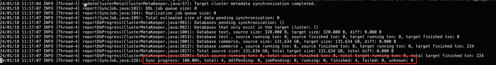
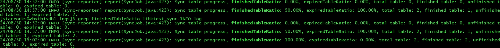

import Tabs from '@theme/Tabs';
import TabItem from '@theme/TabItem';

# クロスクラスターデータ移行ツール

StarRocks クロスクラスターデータ移行ツールは StarRocks コミュニティによって提供されています。このツールを使用することで、ソースクラスターからターゲットクラスターへのデータ移行を簡単に行うことができます。

| 移行パス                                        | サポート情報                     |
| ----------------------------------------------- | -------------------------------- |
| 共有なしから共有なし             | v3.1.8 および v3.2.3 以降        |
| 共有なしから共有データ                | v3.1.8 および v3.2.3 以降        |
| 共有データから共有データ                   | v4.1 以降                        |
| 共有データから共有なし                | 未サポート                       |

## 準備

<Tabs groupId="migrationPath">
<TabItem value="sourceNothing" label="共有なしからの移行" default>

### ソースクラスターでの操作

ソースクラスターで事前に行う準備作業はありません。

### ターゲットクラスターでの操作

データ移行のために、ターゲットクラスターで以下の準備を行う必要があります。

#### ポートの開放

ファイアウォールを有効にしている場合は、以下のポートを開放する必要があります。

| **コンポーネント** | **ポート**     | **デフォルト** |
| ------------------ | -------------- | -------------- |
| FE                 | query_port     | 9030           |
| FE                 | http_port      | 8030           |
| FE                 | rpc_port       | 9020           |
| BE/CN              | be_http_port   | 8040           |
| BE/CN              | be_port        | 9060           |

</TabItem>

<TabItem value="sourceData" label="共有データ間の移行">

### ソースクラスターでの操作

移行中に、ソースクラスターの Auto-Vacuum メカニズムが、ターゲット CN がまだ読み取る必要のある過去のデータバージョンを削除してしまう可能性があります。この状況を防ぐため、FE 設定項目 `lake_autovacuum_grace_period_minutes` を動的に非常に大きな値に設定して Auto-Vacuum の猶予期間を延長する必要があります。

```SQL
ADMIN SET FRONTEND CONFIG("lake_autovacuum_grace_period_minutes"="10000000");
```

:::important

この設定により、ソースクラスターが移行中に古いオブジェクトストレージファイルを回収できなくなり、ストレージの増幅が発生します。移行ウィンドウをできるだけ短くし、移行完了後にこの項目をデフォルト値の `30` にリセットすることを推奨します。

```SQL
ADMIN SET FRONTEND CONFIG("lake_autovacuum_grace_period_minutes"="30");
```

:::

### ターゲットクラスターでの操作

データ移行のために、ターゲットクラスターで以下の準備を行う必要があります。

#### ポートの開放

ファイアウォールを有効にしている場合は、以下のポートを開放する必要があります。

| **コンポーネント** | **ポート**     | **デフォルト** |
| ------------------ | -------------- | -------------- |
| FE                 | query_port     | 9030           |
| FE                 | http_port      | 8030           |
| FE                 | rpc_port       | 9020           |

#### Compaction の無効化

移行中にレプリケーションデータとの競合を防ぐため、ターゲットクラスターで Compaction を無効にする必要があります。

1. Compaction を動的に無効化します。

   ```SQL
   ADMIN SET FRONTEND CONFIG("lake_compaction_max_tasks"="0");
   ```

2. クラスター再起動後に Compaction が再度有効化されないよう、FE 設定ファイル **fe.conf** にも以下の設定を追加します。

   ```Properties
   lake_compaction_max_tasks = 0
   ```

:::important

移行完了後は、**fe.conf** から上記の設定を削除し、以下を実行して Compaction を動的に再度有効化してください。

```SQL
ADMIN SET FRONTEND CONFIG("lake_compaction_max_tasks"="-1");
```

:::

#### ターゲットクラスターにソースストレージボリュームを作成する

移行ツールは各ソーステーブルが使用するストレージボリュームを特定し、命名規則 `src_<source_volume_name>` を使用してターゲットクラスター上の対応するストレージボリュームを検索します。移行を開始する前に、これらのストレージボリュームを事前に作成する必要があります。

:::important
これらのストレージボリュームは、**移行中のみ**ターゲット CN がソースクラスターのオブジェクトストレージへの読み取りアクセスを行うために使用されます。移行完了後は不要となり、削除できます。
:::

1. **ソースクラスター**で、すべてのストレージボリュームを一覧表示します。

   ```SQL
   SHOW STORAGE VOLUMES;
   ```

2. 移行する予定のテーブルが使用する各ストレージボリュームについて、その設定を確認します。

   ```SQL
   DESCRIBE STORAGE VOLUME <volume_name>;
   ```

   出力例：

   ```
   +---------------------+------+-----------+-------------------------------+-----------------------------+
   | Name                | Type | IsDefault | Location                      | Params                      |
   +---------------------+------+-----------+-------------------------------+-----------------------------+
   | builtin_storage_vol | S3   | true      | s3://my-bucket                | {"aws.s3.region":"...",...} |
   +---------------------+------+-----------+-------------------------------+-----------------------------+
   ```

3. **ターゲットクラスター**で、同じオブジェクトストレージ認証情報を使用し、名前に `src_` プレフィックスを付けたミラーリングされたストレージボリュームを作成します。

   ```SQL
   CREATE STORAGE VOLUME src_<source_volume_name>
   TYPE = S3
   LOCATIONS = ("<same_location_as_source>")
   PROPERTIES
   (
       "enabled" = "true",
       "aws.s3.region" = "<region>",
       "aws.s3.endpoint" = "<endpoint>",
       "aws.s3.use_aws_sdk_default_behavior" = "false",
       "aws.s3.use_instance_profile" = "false",
       "aws.s3.access_key" = "<access_key>",
       "aws.s3.secret_key" = "<secret_key>",
       "aws.s3.enable_partitioned_prefix" = "false"
   );
   ```

   :::note
   - ソースクラスターの設定に関わらず、`aws.s3.enable_partitioned_prefix` は `false` に設定してください。移行ツールはソースパーティションのフルパスを使用して直接ファイルを読み取るため、ミラーリングされたボリュームにはパーティションプレフィックスを適用してはなりません。
   - 移行するテーブルが使用する**各**ストレージボリュームに対してこの手順を繰り返します。例えば、ソースが `builtin_storage_volume` を使用している場合、ターゲットクラスターに `src_builtin_storage_volume` を作成します。
   - ソースストレージボリュームには一時的な認証情報（アクセスキー / シークレットキー）を使用することを推奨します。移行完了後に失効させることができます。
   :::

</TabItem>
</Tabs>

#### レプリケーションのレガシー互換性を有効にする

StarRocks は旧バージョンと新バージョンで動作が異なる場合があり、クロスクラスターデータ移行中に問題が発生する可能性があります。そのため、データ移行前にターゲットクラスターのレガシー互換性を有効にし、データ移行完了後に無効にする必要があります。

1. 以下のステートメントを使用して、レプリケーションのレガシー互換性が有効かどうかを確認できます。

   ```SQL
   ADMIN SHOW FRONTEND CONFIG LIKE 'enable_legacy_compatibility_for_replication';
   ```

   `true` が返された場合、レプリケーションのレガシー互換性が有効であることを示します。

2. レプリケーションのレガシー互換性を動的に有効化します。

   ```SQL
   ADMIN SET FRONTEND CONFIG("enable_legacy_compatibility_for_replication"="true");
   ```

3. データ移行中にクラスターが再起動した場合にレプリケーションのレガシー互換性が自動的に無効化されないよう、FE 設定ファイル **fe.conf** にも以下の設定項目を追加する必要があります。

   ```Properties
   enable_legacy_compatibility_for_replication = true
   ```

:::important

データ移行が完了したら、設定ファイルから `enable_legacy_compatibility_for_replication = true` を削除し、以下のステートメントを使用してレプリケーションのレガシー互換性を動的に無効化する必要があります。

```SQL
ADMIN SET FRONTEND CONFIG("enable_legacy_compatibility_for_replication"="false");
```

:::

#### データ移行の設定（オプション）

以下の FE および BE パラメーターを使用してデータ移行操作を設定できます。ほとんどの場合、デフォルト設定で要件を満たすことができます。デフォルト設定を使用したい場合は、このステップをスキップできます。

:::note

以下の設定項目の値を増やすと移行を高速化できますが、ソースクラスターへの負荷も増加することに注意してください。

:::

#### FE パラメーター

以下の FE パラメーターは動的設定項目です。変更方法については、[FE 動的パラメーターの設定](../administration/management/FE_configuration.md#configure-fe-dynamic-parameters)を参照してください。

| **パラメーター**                              | **デフォルト** | **単位** | **説明**                                                     |
| --------------------------------------------- | -------------- | -------- | ------------------------------------------------------------ |
| replication_max_parallel_table_count          | 100            | -        | 許可される同時データ同期タスクの最大数。StarRocks は各テーブルに対して 1 つの同期タスクを作成します。 |
| replication_max_parallel_replica_count        | 10240          | -        | 同時同期に許可されるタブレットレプリカの最大数。             |
| replication_max_parallel_data_size_mb         | 1048576        | MB       | 同時同期に許可されるデータの最大サイズ。                     |
| replication_transaction_timeout_sec           | 86400          | 秒       | 同期タスクのタイムアウト時間。                               |

#### BE パラメーター

以下の BE パラメーターは動的設定項目です。変更方法については、[BE 動的パラメーターの設定](../administration/management/BE_configuration.md)を参照してください。

| **パラメーター**    | **デフォルト** | **単位** | **説明**                                                     |
| ------------------- | -------------- | -------- | ------------------------------------------------------------ |
| replication_threads | 0              | -        | 同期タスクを実行するスレッド数。`0` は、BE が配置されているマシンの CPU コア数の 4 倍にスレッド数を設定することを示します。 |

## ステップ 1：ツールのインストール

移行ツールはターゲットクラスターが配置されているサーバーにインストールすることを推奨します。

1. ターミナルを起動し、ツールのバイナリパッケージをダウンロードします。

   ```Bash
   wget https://releases.starrocks.io/starrocks/starrocks-cluster-sync.tar.gz
   ```

2. パッケージを解凍します。

   ```Bash
   tar -xvzf starrocks-cluster-sync.tar.gz
   ```

## ステップ 2：ツールの設定

### 移行関連の設定

解凍したフォルダに移動し、設定ファイル **conf/sync.properties** を編集します。

```Bash
cd starrocks-cluster-sync
vi conf/sync.properties
```

ファイルの内容は以下の通りです。

```Properties
# true の場合、すべてのテーブルが一度だけ同期され、完了後にプログラムが自動的に終了します。
one_time_run_mode=false

source_fe_host=
source_fe_query_port=9030
source_cluster_user=root
source_cluster_password=
source_cluster_password_secret_key=

# 共有データソースクラスター間でデータを移行する場合は、空のままにするか省略できます。
source_cluster_token=

target_fe_host=
target_fe_query_port=9030
target_cluster_user=root
target_cluster_password=
target_cluster_password_secret_key=

jdbc_connect_timeout_ms=30000
jdbc_socket_timeout_ms=60000

# <db_name> または <db_name.table_name> 形式のデータベース名またはテーブル名のカンマ区切りリスト
# 例: db1,db2.tbl2,db3
# 有効順序: 1. include 2. exclude
include_data_list=
exclude_data_list=

# 特別な要件がない場合は、以下の設定のデフォルト値を維持してください。
target_cluster_storage_volume=
# この設定項目は共有データクラスター間の移行にのみ使用されます。
target_cluster_use_builtin_storage_volume_only=false
target_cluster_replication_num=-1
target_cluster_max_disk_used_percent=80
# ソースクラスターとの整合性を保つには、null を使用してください。
target_cluster_enable_persistent_index=

max_replication_data_size_per_job_in_gb=1024

meta_job_interval_seconds=180
meta_job_threads=4
ddl_job_interval_seconds=10
ddl_job_batch_size=10

# table config
ddl_job_allow_drop_target_only=false
ddl_job_allow_drop_schema_change_table=true
ddl_job_allow_drop_inconsistent_partition=true
ddl_job_allow_drop_inconsistent_time_partition = true
ddl_job_allow_drop_partition_target_only=true
# index config
enable_bitmap_index_sync=false
ddl_job_allow_drop_inconsistent_bitmap_index=true
ddl_job_allow_drop_bitmap_index_target_only=true
# MV config
enable_materialized_view_sync=false
ddl_job_allow_drop_inconsistent_materialized_view=true
ddl_job_allow_drop_materialized_view_target_only=false
# View config
enable_view_sync=false
ddl_job_allow_drop_inconsistent_view=true
ddl_job_allow_drop_view_target_only=false

replication_job_interval_seconds=10
replication_job_batch_size=10
report_interval_seconds=300

enable_table_property_sync=false
```

パラメーターの説明は以下の通りです。

| **パラメーター**                                          | **説明**                                                     |
| --------------------------------------------------------- | ------------------------------------------------------------ |
| one_time_run_mode                                         | ワンタイム同期モードを有効にするかどうか。ワンタイム同期モードが有効な場合、移行ツールは増分同期ではなく、フル同期のみを実行します。 |
| source_fe_host                                            | ソースクラスターの FE の IP アドレスまたは FQDN（完全修飾ドメイン名）。 |
| source_fe_query_port                                      | ソースクラスターの FE のクエリポート（`query_port`）。       |
| source_cluster_user                                       | ソースクラスターへのログインに使用するユーザー名。このユーザーには SYSTEM レベルの OPERATE 権限が付与されている必要があります。 |
| source_cluster_password                                   | ソースクラスターへのログインに使用するユーザーパスワード。   |
| source_cluster_password_secret_key                        | ソースクラスターのログインユーザーパスワードを暗号化するために使用するシークレットキー。デフォルト値は空文字列で、ログインパスワードが暗号化されないことを意味します。`source_cluster_password` を暗号化したい場合は、SQL ステートメント `SELECT TO_BASE64(AES_ENCRYPT('<source_cluster_password>','<source_cluster_password_ secret_key>'))` を使用して暗号化された `source_cluster_password` 文字列を取得できます。 |
| source_cluster_token                                      | ソースクラスターのトークン。クラスタートークンの取得方法については、以下の[クラスタートークンの取得](#obtain-cluster-token)を参照してください。<br />**注意**<br />共有データクラスター間の移行では、ファイルがオブジェクトストレージから直接読み取られるため、クラスタートークンは必要ありません。共有データソースクラスター間でデータを移行する場合は、空のままにするか省略できます。 |
| target_fe_host                                            | ターゲットクラスターの FE の IP アドレスまたは FQDN（完全修飾ドメイン名）。 |
| target_fe_query_port                                      | ターゲットクラスターの FE のクエリポート（`query_port`）。   |
| target_cluster_user                                       | ターゲットクラスターへのログインに使用するユーザー名。このユーザーには SYSTEM レベルの OPERATE 権限が付与されている必要があります。 |
| target_cluster_password                                   | ターゲットクラスターへのログインに使用するユーザーパスワード。 |
| target_cluster_password_secret_key                        | ターゲットクラスターのログインユーザーパスワードを暗号化するために使用するシークレットキー。デフォルト値は空文字列で、ログインパスワードが暗号化されないことを意味します。`target_cluster_password` を暗号化したい場合は、SQL ステートメント `SELECT TO_BASE64(AES_ENCRYPT('<target_cluster_password>','<target_cluster_password_ secret_key>'))` を使用して暗号化された `target_cluster_password` 文字列を取得できます。 |
| jdbc_connect_timeout_ms                                   | FE クエリの JDBC 接続タイムアウト（ミリ秒）。デフォルト: `30000`。 |
| jdbc_socket_timeout_ms                                    | FE クエリの JDBC ソケットタイムアウト（ミリ秒）。デフォルト: `60000`。 |
| include_data_list                                         | 移行が必要なデータベースおよびテーブル。複数のオブジェクトはカンマ（`,`）で区切ります。例: `db1, db2.tbl2, db3`。この項目は `exclude_data_list` より優先して有効になります。クラスター内のすべてのデータベースおよびテーブルを移行する場合は、この項目を設定する必要はありません。 |
| exclude_data_list                                         | 移行が不要なデータベースおよびテーブル。複数のオブジェクトはカンマ（`,`）で区切ります。例: `db1, db2.tbl2, db3`。`include_data_list` はこの項目より優先して有効になります。クラスター内のすべてのデータベースおよびテーブルを移行する場合は、この項目を設定する必要はありません。 |
| target_cluster_storage_volume                             | ターゲットクラスターが共有データクラスターの場合に、ターゲットクラスターでテーブルを保存するために使用するストレージボリューム。デフォルトのストレージボリュームを使用したい場合は、この項目を指定する必要はありません。 |
| target_cluster_use_builtin_storage_volume_only            | ターゲットクラスターでの移行に `builtin_storage_volume` を使用するかどうか。共有データクラスター間の移行にのみ必要です。この項目を `true` に設定すると、ターゲットクラスターで作成されるテーブルはソースクラスターの `storage_volume` 設定を使用するのではなく、一律で `builtin_storage_volume` を使用します。これは、ソースクラスターに複数のカスタムストレージボリュームがあるが、ターゲットクラスターではすべてのテーブルを 1 つのストレージボリューム配下に統合したい場合に便利です。 |
| target_cluster_replication_num                            | ターゲットクラスターでテーブルを作成する際に指定するレプリカ数。ソースクラスターと同じレプリカ数を使用したい場合は、この項目を指定する必要はありません。 |
| target_cluster_max_disk_used_percent                      | ターゲットクラスターが共有なしの場合の、ターゲットクラスターの BE ノードのディスク使用率しきい値。ターゲットクラスター内のいずれかの BE のディスク使用率がこのしきい値を超えると、移行が終了します。デフォルト値は `80`（80% を意味します）。 |
| meta_job_interval_seconds                                 | 移行ツールがソースクラスターとターゲットクラスターからメタデータを取得する間隔（秒）。この項目にはデフォルト値を使用できます。 |
| meta_job_threads                                          | 移行ツールがソースクラスターとターゲットクラスターからメタデータを取得するために使用するスレッド数。この項目にはデフォルト値を使用できます。 |
| ddl_job_interval_seconds                                  | 移行ツールがターゲットクラスターで DDL ステートメントを実行する間隔（秒）。この項目にはデフォルト値を使用できます。 |
| ddl_job_batch_size                                        | ターゲットクラスターで DDL ステートメントを実行するバッチサイズ。この項目にはデフォルト値を使用できます。 |
| ddl_job_allow_drop_target_only                            | ターゲットクラスターにのみ存在し、ソースクラスターには存在しないデータベースやテーブルを移行ツールが削除することを許可するかどうか。デフォルトは `false`（削除しない）。この項目にはデフォルト値を使用できます。 |
| ddl_job_allow_drop_schema_change_table                    | ソースクラスターとターゲットクラスター間でスキーマが一致しないテーブルを移行ツールが削除することを許可するかどうか。デフォルトは `true`（削除する）。この項目にはデフォルト値を使用できます。移行ツールは移行中に削除されたテーブルを自動的に同期します。 |
| ddl_job_allow_drop_inconsistent_partition                 | ソースクラスターとターゲットクラスター間でデータ分散が一致しないパーティションを移行ツールが削除することを許可するかどうか。デフォルトは `true`（削除する）。この項目にはデフォルト値を使用できます。移行ツールは移行中に削除されたパーティションを自動的に同期します。 |
| ddl_job_allow_drop_partition_target_only                  | ソースクラスターで削除されたパーティションをターゲットクラスターでも削除して整合性を保つことを移行ツールに許可するかどうか。デフォルトは `true`（削除する）。この項目にはデフォルト値を使用できます。 |
| replication_job_interval_seconds                          | 移行ツールがデータ同期タスクをトリガーする間隔（秒）。この項目にはデフォルト値を使用できます。 |
| replication_job_batch_size                                | 移行ツールがデータ同期タスクをトリガーするバッチサイズ。この項目にはデフォルト値を使用できます。 |
| max_replication_data_size_per_job_in_gb                   | 移行ツールがデータ同期タスクをトリガーするデータサイズしきい値。単位: GB。移行するパーティションのサイズがこの値を超えると、複数のデータ同期タスクがトリガーされます。デフォルト値は `1024`。この項目にはデフォルト値を使用できます。 |
| report_interval_seconds                                   | 移行ツールが進捗情報を出力する時間間隔。単位: 秒。デフォルト値: `300`。この項目にはデフォルト値を使用できます。 |
| target_cluster_enable_persistent_index                    | ターゲットクラスターで persistent index を有効にするかどうか。この項目が指定されていない場合、ターゲットクラスターはソースクラスターと一致します。<br />**注意**<br />2 つの共有データクラスター間でデータを移行する場合、ツールはプライマリキーテーブルの CREATE TABLE ステートメント内の `persistent_index_type = LOCAL` を自動的に `CLOUD_NATIVE` に変換します。手動での操作は不要です。 |
| ddl_job_allow_drop_inconsistent_time_partition            | ソースクラスターとターゲットクラスター間で時刻が一致しないパーティションを移行ツールが削除することを許可するかどうか。デフォルトは `true`（削除する）。この項目にはデフォルト値を使用できます。移行ツールは移行中に削除されたパーティションを自動的に同期します。 |
| enable_bitmap_index_sync                                  | Bitmap インデックスの同期を有効にするかどうか。              |
| ddl_job_allow_drop_inconsistent_bitmap_index              | ソースクラスターとターゲットクラスター間で一致しない Bitmap インデックスを移行ツールが削除することを許可するかどうか。デフォルトは `true`（削除する）。この項目にはデフォルト値を使用できます。移行ツールは移行中に削除されたインデックスを自動的に同期します。 |
| ddl_job_allow_drop_bitmap_index_target_only               | ソースクラスターで削除された Bitmap インデックスをターゲットクラスターでも削除してインデックスの整合性を保つことを移行ツールに許可するかどうか。デフォルトは `true`（削除する）。この項目にはデフォルト値を使用できます。 |
| enable_materialized_view_sync                             | マテリアライズドビューの同期を有効にするかどうか。           |
| ddl_job_allow_drop_inconsistent_materialized_view         | ソースクラスターとターゲットクラスター間で一致しないマテリアライズドビューを移行ツールが削除することを許可するかどうか。デフォルトは `true`（削除する）。この項目にはデフォルト値を使用できます。移行ツールは移行中に削除されたマテリアライズドビューを自動的に同期します。 |
| ddl_job_allow_drop_materialized_view_target_only          | ソースクラスターで削除されたマテリアライズドビューをターゲットクラスターでも削除してマテリアライズドビューの整合性を保つことを移行ツールに許可するかどうか。デフォルトは `true`（削除する）。この項目にはデフォルト値を使用できます。 |
| enable_view_sync                                          | ビューの同期を有効にするかどうか。                           |
| ddl_job_allow_drop_inconsistent_view                      | ソースクラスターとターゲットクラスター間で一致しないビューを移行ツールが削除することを許可するかどうか。デフォルトは `true`（削除する）。この項目にはデフォルト値を使用できます。移行ツールは移行中に削除されたビューを自動的に同期します。 |
| ddl_job_allow_drop_view_target_only                       | ソースクラスターで削除されたビューをターゲットクラスターでも削除してビューの整合性を保つことを移行ツールに許可するかどうか。デフォルトは `true`（削除する）。この項目にはデフォルト値を使用できます。 |
| enable_table_property_sync                                | テーブルプロパティの同期を有効にするかどうか。               |

<Tabs groupId="migrationPath">
<TabItem value="sourceNothing" label="共有なしからの移行" default>

### クラスタートークンの取得

:::note
共有データクラスター間の移行にはクラスタートークンは不要です。共有データソースクラスター間でデータを移行する場合は、このステップをスキップできます。
:::

クラスタートークンは FE メタデータに含まれています。FE ノードが配置されているサーバーにログインして、以下のコマンドを実行します。

```Bash
cat fe/meta/image/VERSION | grep token
```

出力：

```Properties
token=wwwwwwww-xxxx-yyyy-zzzz-uuuuuuuuuu
```

</TabItem>

<TabItem value="sourceData" label="共有データ間の移行">

### ストレージボリュームのマッピング

移行ツールがターゲットクラスターにテーブルを作成する際、テーブルのストレージボリュームは以下の順序（優先度順）で決定されます。

1. `target_cluster_use_builtin_storage_volume_only` が `true` に設定されている場合、すべてのテーブルに `builtin_storage_volume` が使用されます。
2. `target_cluster_storage_volume` に特定のストレージボリュームが設定されている場合、すべてのテーブルに指定されたストレージボリュームが使用されます。
3. それ以外の場合、デフォルトではソーステーブルのストレージボリュームプロパティが引き継がれます。異なるソースストレージボリュームからのテーブルは、ターゲットクラスターに対応するストレージボリュームが存在する場合、そのストレージボリューム下に作成されます。

したがって、ソースクラスターの各テーブルのストレージボリュームプロパティを保持したい場合は、ターゲットクラスターに同じストレージボリュームを事前に作成できます。移行後、ターゲットクラスターの各テーブルはソースクラスターで持っていたストレージボリュームプロパティを引き継ぎます。

`src_` プレフィックス付きのストレージボリュームは異なる目的で使用されます。これらは**移行中のみ**、ターゲット CN がソースクラスターのオブジェクトストレージへの読み取りアクセスを行うために使用されます。移行完了後は、`src_<name>` ボリュームは不要となり、削除できます。

</TabItem>
</Tabs>

### ネットワーク関連の設定（オプション）

<Tabs groupId="migrationPath">
<TabItem value="sourceNothing" label="共有なしからの移行" default>

データ移行中、移行ツールはソースクラスターとターゲットクラスターの**すべての** FE ノードにアクセスする必要があり、ターゲットクラスターはソースクラスターの**すべての** BE および CN ノードにアクセスする必要があります。

これらのノードのネットワークアドレスは、対応するクラスターで以下のステートメントを実行することで取得できます。

```SQL
-- クラスター内の FE ノードのネットワークアドレスを取得します。
SHOW FRONTENDS;
-- クラスター内の BE ノードのネットワークアドレスを取得します。
SHOW BACKENDS;
-- クラスター内の CN ノードのネットワークアドレスを取得します。
SHOW COMPUTE NODES;
```

これらのノードが Kubernetes クラスター内部のネットワークアドレスなど、クラスター外からアクセスできないプライベートアドレスを使用している場合は、これらのプライベートアドレスを外部からアクセス可能なアドレスにマッピングする必要があります。

ツールの解凍フォルダに移動し、設定ファイル **conf/hosts.properties** を編集します。

```Bash
cd starrocks-cluster-sync
vi conf/hosts.properties
```

ファイルのデフォルト内容は以下の通りで、ネットワークアドレスマッピングの設定方法を説明しています。

```Properties
# <SOURCE/TARGET>_<host>=<mappedHost>[;<srcPort>:<dstPort>[,<srcPort>:<dstPort>...]]
```

:::note
`<host>` は `SHOW FRONTENDS`、`SHOW BACKENDS`、または `SHOW COMPUTE NODES` で返される `IP` 列に表示されるアドレスと一致する必要があります。
:::

以下の例では、次の操作を実行します。

1. ソースクラスターのプライベートネットワークアドレス `192.1.1.1` と `192.1.1.2` を `10.1.1.1` と `10.1.1.2` にマッピングします。
2. `10.1.1.1` 上で、ソースクラスターの FE ポート `8030` と `9030` を `38030` と `39030` にマッピングします。
3. ターゲットクラスターのプライベートネットワークアドレス `fe-0.starrocks.svc.cluster.local` を `10.1.2.1` にマッピングし、ポート `9030` を再マッピングします。

```Properties
# <SOURCE/TARGET>_<host>=<mappedHost>[;<srcPort>:<dstPort>[,<srcPort>:<dstPort>...]]
SOURCE_192.1.1.1=10.1.1.1;8030:38030,9030:39030
SOURCE_192.1.1.2=10.1.1.2
TARGET_fe-0.starrocks.svc.cluster.local=10.1.2.1;9030:19030
```

</TabItem>

<TabItem value="sourceData" label="共有データ間の移行">

データ移行中、移行ツールはソースクラスターとターゲットクラスターの**すべての** FE ノードにアクセスする必要があります。

:::note
共有なしクラスターからの移行とは異なり、データはオブジェクトストレージシステム間で直接転送されるため、ターゲットクラスターからソースクラスターの CN ノードへのネットワークアクセスを設定する**必要はありません**。
:::

FE ノードのネットワークアドレスは、対応するクラスターで以下のステートメントを実行することで取得できます。

```SQL
-- FE nodes
SHOW FRONTENDS;
```

FE ノードが Kubernetes クラスター内部のネットワークアドレスなど、クラスター外からアクセスできないプライベートアドレスを使用している場合は、これらのプライベートアドレスを外部からアクセス可能なアドレスにマッピングする必要があります。

ツールの解凍フォルダに移動し、設定ファイル **conf/hosts.properties** を編集します。

```Bash
cd starrocks-cluster-sync
vi conf/hosts.properties
```

ファイルのデフォルト内容は以下の通りで、ネットワークアドレスマッピングの設定方法を説明しています。

```Properties
# <SOURCE/TARGET>_<host>=<mappedHost>[;<srcPort>:<dstPort>[,<srcPort>:<dstPort>...]]
```

:::note
`<host>` は `SHOW FRONTENDS` で返される `IP` 列に表示されるアドレスと一致する必要があります。
:::

以下の例では、ターゲットクラスターの Kubernetes 内部 FQDN を到達可能な IP にマッピングします。

```Properties
TARGET_frontend-0.frontend.mynamespace.svc.cluster.local=10.1.2.1;9030:19030
```

</TabItem>
</Tabs>

## ステップ 3：移行ツールの起動

ツールの設定が完了したら、移行ツールを起動してデータ移行プロセスを開始します。

```Bash
./bin/start.sh
```

:::note

- 共有なしクラスターからデータを移行する場合は、ソースクラスターとターゲットクラスターの BE ノードがネットワーク経由で正常に通信できることを確認してください。
- 実行中、移行ツールはターゲットクラスターのデータがソースクラスターより遅れているかどうかを定期的にチェックします。遅れがある場合は、データ移行タスクを開始します。
- ソースクラスターに新しいデータが継続的にロードされている場合、ターゲットクラスターのデータがソースクラスターと一致するまでデータ同期が継続されます。
- 移行中はターゲットクラスターのテーブルをクエリできますが、テーブルに新しいデータをロードしないでください。ターゲットクラスターとソースクラスターのデータに不整合が生じる可能性があります。現在、移行ツールは移行中のターゲットクラスターへのデータロードを禁止していません。
- データ移行は自動的には終了しません。移行の完了を手動で確認した後、移行ツールを停止する必要があります。

:::

## 移行進捗の確認

### 移行ツールログの確認

移行ツールのログ **log/sync.INFO.log** を通じて移行の進捗を確認できます。

例 1：タスクの進捗を確認する。



重要なメトリクスは以下の通りです。

- `Sync job progress`: データ移行の進捗。移行ツールはターゲットクラスターのデータがソースクラスターより遅れているかどうかを定期的にチェックします。そのため、進捗が 100% であることは、現在のチェック間隔内でデータ同期が完了したことを意味するに過ぎません。ソースクラスターに新しいデータが継続的にロードされている場合、次のチェック間隔で進捗が低下する可能性があります。
- `total`: この移行操作におけるすべての種類のジョブの合計数。
- `ddlPending`: 実行待ちの DDL ジョブの数。
- `jobPending`: 実行待ちのデータ同期ジョブの数。
- `sent`: ソースクラスターから送信されたが、まだ開始されていないデータ同期ジョブの数。理論上、この値は大きすぎてはなりません。値が増え続ける場合は、エンジニアにお問い合わせください。
- `running`: 現在実行中のデータ同期ジョブの数。
- `finished`: 完了したデータ同期ジョブの数。
- `failed`: 失敗したデータ同期ジョブの数。失敗したデータ同期ジョブは再送されます。そのため、ほとんどの場合、このメトリクスは無視できます。この値が著しく大きい場合は、エンジニアにお問い合わせください。
- `unknown`: ステータスが不明なジョブの数。理論上、この値は常に `0` であるべきです。この値が `0` でない場合は、エンジニアにお問い合わせください。

例 2：テーブルの移行進捗を確認する。



- `Sync table progress`: テーブルの移行進捗。この移行タスクで移行済みのテーブル数と移行が必要なすべてのテーブル数の比率。
- `finishedTableRatio`: 少なくとも 1 つの同期タスクが正常に実行されたテーブルの割合。
- `expiredTableRatio`: データが期限切れのテーブルの割合。
- `total table`: このデータ移行進捗に含まれるテーブルの総数。
- `finished table`: 少なくとも 1 つの同期タスクが正常に実行されたテーブルの数。
- `unfinished table`: 同期タスクが実行されていないテーブルの数。
- `expired table`: データが期限切れのテーブルの数。

### 移行トランザクションステータスの確認

移行ツールは各テーブルに対してトランザクションを開きます。対応するトランザクションのステータスを確認することで、テーブルの移行ステータスを確認できます。

```SQL
SHOW PROC "/transactions/<db_name>/running";
```

`<db_name>` はテーブルが配置されているデータベースの名前です。

### パーティションデータバージョンの確認

ソースクラスターとターゲットクラスターの対応するパーティションのデータバージョンを比較することで、そのパーティションの移行ステータスを確認できます。

```SQL
SHOW PARTITIONS FROM <table_name>;
```

`<table_name>` はパーティションが属するテーブルの名前です。

### データ量の確認

ソースクラスターとターゲットクラスターのデータ量を比較することで、移行ステータスを確認できます。

```SQL
SHOW DATA;
```

### テーブル行数の確認

ソースクラスターとターゲットクラスターのテーブルの行数を比較することで、各テーブルの移行ステータスを確認できます。

```SQL
SELECT 
  TABLE_NAME, 
  TABLE_ROWS 
FROM INFORMATION_SCHEMA.TABLES 
WHERE TABLE_TYPE = 'BASE TABLE' 
ORDER BY TABLE_NAME;
```

## 移行後

`Sync job progress` が 100% で安定しており、ビジネスの切り替え準備ができたら、以下の手順でカットオーバーを完了します。

1. ソースクラスターへの書き込みを停止します。
2. 書き込み停止後に `Sync job progress` が 100% に達し、維持されていることを確認します。
3. 移行ツールを停止します。
4. アプリケーションをターゲットクラスターのアドレスに向けます。
5. 共有データクラスター間でデータを移行した場合は、ソースクラスターの Auto-Vacuum 設定を復元します。

   ```SQL
   ADMIN SET FRONTEND CONFIG("lake_autovacuum_grace_period_minutes"="30");
   ```

6. 共有データクラスター間でデータを移行した場合は、ターゲットクラスターで Compaction を再度有効化します。**fe.conf** から `lake_compaction_max_tasks = 0` を削除し、以下を実行します。

   ```SQL
   ADMIN SET FRONTEND CONFIG("lake_compaction_max_tasks"="-1");
   ```

7. ターゲットクラスターでレプリケーションのレガシー互換性を無効にします。**fe.conf** から `enable_legacy_compatibility_for_replication = true` を削除し、以下を実行します。

   ```SQL
   ADMIN SET FRONTEND CONFIG("enable_legacy_compatibility_for_replication"="false");
   ```

## 制限事項

現在、同期をサポートするオブジェクトのリストは以下の通りです（含まれていないものは同期がサポートされていないことを示します）。

- データベース
- 内部テーブルとそのデータ
- マテリアライズドビューのスキーマおよびそのビルドステートメント（マテリアライズドビューのデータは同期されません。また、マテリアライズドビューのベーステーブルがターゲットクラスターに同期されていない場合、マテリアライズドビューのバックグラウンド更新タスクはエラーを報告します。）
- 論理ビュー

共有データクラスター間の移行の場合：

- ターゲットクラスターは v4.1 以降で実行している必要があります。
- 共有データクラスターから共有なしターゲットへの移行はサポートされていません。
- ソースクラスターのテーブルが使用する各ストレージボリュームには、ターゲットクラスターに対応する `src_<volume_name>` ストレージボリュームが事前に作成されている必要があります。
