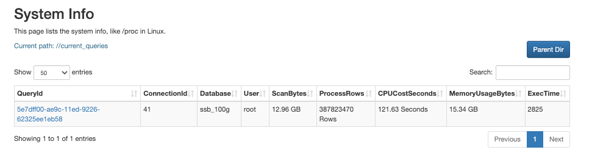

# 大規模クエリの監視と管理

このトピックでは、StarRocks クラスターで大規模クエリを監視および管理する方法について説明します。

大規模クエリには、非常に多くの行をスキャンしたり、CPU やメモリリソースを大量に占有したりするクエリが含まれます。これらは制限がないとクラスターリソースを簡単に使い果たし、システムの過負荷を引き起こす可能性があります。この問題に対処するために、StarRocks は大規模クエリを監視および管理し、クラスターリソースの独占を防ぐための一連の手段を提供します。

StarRocks における大規模クエリの処理の全体的な考え方は次のとおりです。

1. リソースグループとクエリキューを使用して、大規模クエリに対する自動的な予防策を設定します。
2. 大規模クエリをリアルタイムで監視し、予防策を回避するものを終了させます。
3. 監査ログと Big Query Logs を分析して、大規模クエリのパターンを研究し、以前に設定した予防メカニズムを微調整します。

この機能は v3.0 からサポートされています。

## 大規模クエリに対する予防策を設定する

StarRocks は、大規模クエリに対処するための 2 つの予防手段を提供しています - リソースグループとクエリキューです。リソースグループを使用して、大規模クエリの実行を停止することができます。一方、クエリキューは、同時実行のしきい値やリソース制限に達したときに、システムの過負荷を防ぐために、受信クエリをキューに入れるのに役立ちます。

### リソースグループを介して大規模クエリをフィルタリングする

リソースグループは、大規模クエリを自動的に識別して終了させることができます。リソースグループを作成する際に、クエリが使用できる CPU 時間、メモリ使用量、またはスキャン行数の上限を指定できます。リソースグループにヒットしたすべてのクエリの中で、より多くのリソースを必要とするクエリは拒否され、エラーが返されます。リソースグループの詳細と手順については、[Resource Isolation](../../administration/management/resource_management/resource_group.md) を参照してください。

リソースグループを作成する前に、Resource Group 機能が依存する Pipeline Engine を有効にするために、次のステートメントを実行する必要があります。

```SQL
SET GLOBAL enable_pipeline_engine = true;
```

次の例では、CPU 時間の上限を `100` 秒、スキャン行数の上限を `100000`、メモリ使用量の上限を `1073741824` バイト (1 GB) に制限するリソースグループ `bigQuery` を作成します。

```SQL
CREATE RESOURCE GROUP bigQuery
TO 
    (db='sr_hub')
WITH (
    'cpu_weight' = '10',
    'mem_limit' = '20%',
    'big_query_cpu_second_limit' = '100',
    'big_query_scan_rows_limit' = '100000',
    'big_query_mem_limit' = '1073741824'
);
```

クエリの必要なリソースがいずれかの制限を超える場合、そのクエリは実行されず、エラーが返されます。次の例は、クエリがスキャン行数を超える要求をしたときに返されるエラーメッセージを示しています。

```Plain
ERROR 1064 (HY000): exceed big query scan_rows limit: current is 4 but limit is 1
```

リソースグループを初めて設定する場合、通常のクエリを妨げないように、比較的高い制限を設定することをお勧めします。大規模クエリのパターンについての理解が深まった後に、これらの制限を微調整することができます。

### クエリキューを介してシステムの過負荷を緩和する

クエリキューは、クラスターリソースの占有が事前に指定されたしきい値を超えたときに、システムの過負荷の悪化を緩和するために設計されています。最大同時実行数、メモリ使用量、CPU 使用量のしきい値を設定できます。StarRocks は、これらのしきい値のいずれかに達したときに、受信クエリを自動的にキューに入れます。保留中のクエリは、キューで実行を待つか、事前に指定されたリソースしきい値に達したときにキャンセルされます。詳細については、[Query Queues](../../administration/management/resource_management/query_queues.md) を参照してください。

SELECT クエリに対してクエリキューを有効にするには、次のステートメントを実行します。

```SQL
SET GLOBAL enable_query_queue_select = true;
```

クエリキュー機能が有効になった後、クエリキューをトリガーするルールを定義できます。

- クエリキューをトリガーするための同時実行しきい値を指定します。

  次の例では、同時実行しきい値を `100` に設定します。

  ```SQL
  SET GLOBAL query_queue_concurrency_limit = 100;
  ```

- クエリキューをトリガーするためのメモリ使用率のしきい値を指定します。

  次の例では、メモリ使用率のしきい値を `0.9` に設定します。

  ```SQL
  SET GLOBAL query_queue_mem_used_pct_limit = 0.9;
  ```

- クエリキューをトリガーするための CPU 使用率のしきい値を指定します。

  次の例では、CPU 使用率のパーミル (CPU 使用率 * 1000) のしきい値を `800` に設定します。

  ```SQL
  SET GLOBAL query_queue_cpu_used_permille_limit = 800;
  ```

キューに入れられたクエリをどのように処理するかを、最大キュー長とキュー内の各保留中クエリのタイムアウトを設定することで決定できます。

- 最大クエリキュー長を指定します。このしきい値に達すると、受信クエリは拒否されます。

  次の例では、クエリキュー長を `100` に設定します。

  ```SQL
  SET GLOBAL query_queue_max_queued_queries = 100;
  ```

- キュー内の保留中クエリの最大タイムアウトを指定します。このしきい値に達すると、対応するクエリは拒否されます。

  次の例では、最大タイムアウトを `480` 秒に設定します。

  ```SQL
  SET GLOBAL query_queue_pending_timeout_second = 480;
  ```

クエリが保留中かどうかを [SHOW PROCESSLIST](../../sql-reference/sql-statements/cluster-management/nodes_processes/SHOW_PROCESSLIST.md) を使用して確認できます。

```Plain
mysql> SHOW PROCESSLIST;
+------+------+---------------------+-------+---------+---------------------+------+-------+-------------------+-----------+
| Id   | User | Host                | Db    | Command | ConnectionStartTime | Time | State | Info              | IsPending |
+------+------+---------------------+-------+---------+---------------------+------+-------+-------------------+-----------+
|    2 | root | xxx.xx.xxx.xx:xxxxx |       | Query   | 2022-11-24 18:08:29 |    0 | OK    | SHOW PROCESSLIST  | false     |
+------+------+---------------------+-------+---------+---------------------+------+-------+-------------------+-----------+
```

`IsPending` が `true` の場合、対応するクエリはクエリキューで保留中です。

## 大規模クエリをリアルタイムで監視する

v3.0 以降、StarRocks はクラスター内で現在処理されているクエリとそれらが占有するリソースを表示することをサポートしています。これにより、予防策を回避して予期しないシステム過負荷を引き起こす大規模クエリを監視することができます。

### MySQL クライアントを介して監視する

1. [SHOW PROC](../../sql-reference/sql-statements/cluster-management/nodes_processes/SHOW_PROC.md) を使用して、現在処理されているクエリ (`current_queries`) を表示できます。

   ```SQL
   SHOW PROC '/current_queries';
   ```

   StarRocks は、各クエリのクエリ ID (`QueryId`)、接続 ID (`ConnectionId`)、およびリソース消費量を返します。これには、スキャンされたデータサイズ (`ScanBytes`)、処理された行数 (`ProcessRows`)、CPU 時間 (`CPUCostSeconds`)、メモリ使用量 (`MemoryUsageBytes`)、および実行時間 (`ExecTime`) が含まれます。

   ```Plain
   mysql> SHOW PROC '/current_queries';
   +--------------------------------------+--------------+------------+------+-----------+----------------+----------------+------------------+----------+
   | QueryId                              | ConnectionId | Database   | User | ScanBytes | ProcessRows    | CPUCostSeconds | MemoryUsageBytes | ExecTime |
   +--------------------------------------+--------------+------------+------+-----------+----------------+----------------+------------------+----------+
   | 7c56495f-ae8b-11ed-8ebf-00163e00accc | 4            | tpcds_100g | root | 37.88 MB  | 1075769 Rows   | 11.13 Seconds  | 146.70 MB        | 3804     |
   | 7d543160-ae8b-11ed-8ebf-00163e00accc | 6            | tpcds_100g | root | 13.02 GB  | 487873176 Rows | 81.23 Seconds  | 6.37 GB          | 2090     |
   +--------------------------------------+--------------+------------+------+-----------+----------------+----------------+------------------+----------+
   2 rows in set (0.01 sec)
   ```

2. クエリ ID を指定して、各 BE ノードでのクエリのリソース消費量をさらに調べることができます。

   ```SQL
   SHOW PROC '/current_queries/<QueryId>/hosts';
   ```

   StarRocks は、各 BE ノードでのクエリのスキャンされたデータサイズ (`ScanBytes`)、スキャンされた行数 (`ScanRows`)、CPU 時間 (`CPUCostSeconds`)、およびメモリ使用量 (`MemUsageBytes`) を返します。

   ```Plain
   mysql> show proc '/current_queries/7c56495f-ae8b-11ed-8ebf-00163e00accc/hosts';
   +--------------------+-----------+-------------+----------------+---------------+
   | Host               | ScanBytes | ScanRows    | CpuCostSeconds | MemUsageBytes |
   +--------------------+-----------+-------------+----------------+---------------+
   | 172.26.34.185:8060 | 11.61 MB  | 356252 Rows | 52.93 Seconds  | 51.14 MB      |
   | 172.26.34.186:8060 | 14.66 MB  | 362646 Rows | 52.89 Seconds  | 50.44 MB      |
   | 172.26.34.187:8060 | 11.60 MB  | 356871 Rows | 52.91 Seconds  | 48.95 MB      |
   +--------------------+-----------+-------------+----------------+---------------+
   3 rows in set (0.00 sec)
   ```

### FE コンソールを介して監視する

MySQL クライアントに加えて、FE コンソールを使用して視覚的でインタラクティブな監視を行うことができます。

1. 次の URL を使用してブラウザで FE コンソールに移動します。

   ```Bash
   http://<fe_IP>:<fe_http_port>/system?path=//current_queries
   ```

   

   **System Info** ページで、現在処理されているクエリとそのリソース消費量を確認できます。

2. クエリの **QueryID** をクリックします。

   

   表示されるページで、詳細なノード固有のリソース消費情報を確認できます。

### 大規模クエリを手動で終了する

設定した予防策を回避し、システムの可用性を脅かす大規模クエリがある場合、[KILL](../../sql-reference/sql-statements/cluster-management/nodes_processes/KILL.md) ステートメントで対応する接続 ID を使用して手動で終了させることができます。

```SQL
KILL QUERY <ConnectionId>;
```

## Big Query Logs を分析する

v3.0 以降、StarRocks は Big Query Logs をサポートしており、これらはファイル **fe/log/fe.big_query.log** に保存されます。StarRocks の監査ログと比較して、Big Query Logs は追加の 3 つのフィールドを出力します。

- `bigQueryLogCPUSecondThreshold`
- `bigQueryLogScanBytesThreshold`
- `bigQueryLogScanRowsThreshold`

これらの 3 つのフィールドは、クエリが大規模クエリであるかどうかを判断するために定義したリソース消費のしきい値に対応しています。

Big Query Logs を有効にするには、次のステートメントを実行します。

```SQL
SET GLOBAL enable_big_query_log = true;
```

Big Query Logs が有効になった後、Big Query Logs をトリガーするルールを定義できます。

- Big Query Logs をトリガーするための CPU 時間のしきい値を指定します。

  次の例では、CPU 時間のしきい値を `600` 秒に設定します。

  ```SQL
  SET GLOBAL big_query_log_cpu_second_threshold = 600;
  ```

- Big Query Logs をトリガーするためのスキャンデータサイズのしきい値を指定します。

  次の例では、スキャンデータサイズのしきい値を `10737418240` バイト (10 GB) に設定します。

  ```SQL
  SET GLOBAL big_query_log_scan_bytes_threshold = 10737418240;
  ```
  
- Big Query Logs をトリガーするためのスキャン行数のしきい値を指定します。

  次の例では、スキャン行数のしきい値を `1500000000` に設定します。

  ```SQL
  SET GLOBAL big_query_log_scan_rows_threshold = 1500000000;
  ```

## 予防策を微調整する

リアルタイム監視と Big Query Logs から得られた統計を基に、クラスター内で見逃された大規模クエリ (または誤って大規模クエリと診断された通常のクエリ) のパターンを研究し、リソースグループとクエリキューの設定を最適化できます。

大規模クエリのかなりの割合が特定の SQL パターンに従っており、この SQL パターンを永久に禁止したい場合、そのパターンを SQL Blacklist に追加できます。StarRocks は、SQL Blacklist に指定されたパターンに一致するすべてのクエリを拒否し、エラーを返します。詳細については、[Manage SQL Blacklist](../../administration/management/resource_management/Blacklist.md) を参照してください。

SQL Blacklist を有効にするには、次のステートメントを実行します。

```SQL
ADMIN SET FRONTEND CONFIG ("enable_sql_blacklist" = "true");
```

その後、[ADD SQLBLACKLIST](../../sql-reference/sql-statements/cluster-management/sql_blacklist/ADD_SQLBLACKLIST.md) を使用して、SQL パターンを表す正規表現を SQL Blacklist に追加できます。

次の例では、`COUNT(DISTINCT)` を SQL Blacklist に追加します。

```SQL
ADD SQLBLACKLIST "SELECT COUNT(DISTINCT .+) FROM .+";
```