# Prometheus と Grafana を使用した監視とアラート

StarRocks は、Prometheus と Grafana を使用して監視とアラートのソリューションを提供します。これにより、クラスターの稼働状況を可視化し、監視とトラブルシューティングを容易にします。

## 概要

StarRocks は、Prometheus 互換の情報収集インターフェースを提供します。Prometheus は、BE および FE ノードの HTTP ポートに接続して StarRocks のメトリック情報を取得し、自身の時系列データベースに情報を保存します。Grafana は、Prometheus をデータソースとして使用してメトリック情報を可視化できます。StarRocks が提供するダッシュボードテンプレートを使用することで、StarRocks クラスターを簡単に監視し、Grafana でアラートを設定できます。

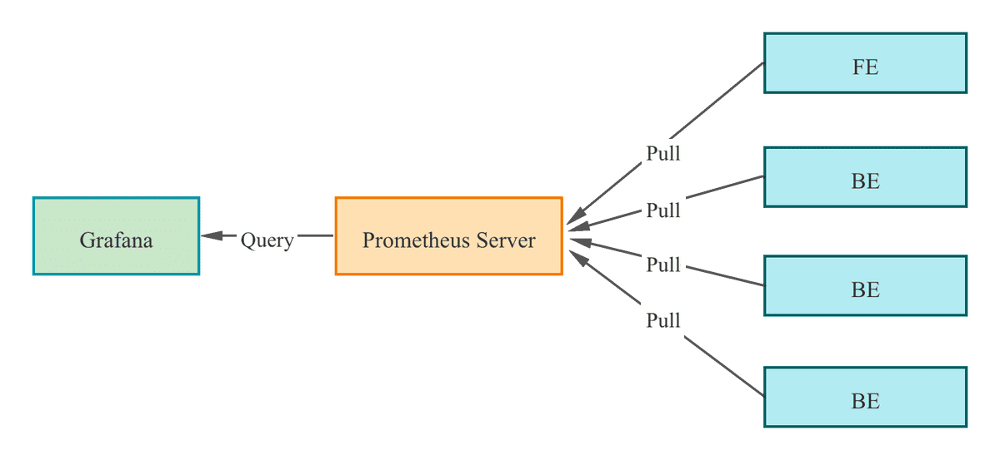

StarRocks クラスターを Prometheus と Grafana に統合する手順は次のとおりです。

1. 必要なコンポーネントをインストールする - Prometheus と Grafana。
2. StarRocks のコア監視メトリックを理解する。
3. アラートチャネルとアラートルールを設定する。

## ステップ 1: 監視コンポーネントのインストール

Prometheus と Grafana のデフォルトポートは StarRocks のポートと競合しません。ただし、プロダクション環境では、StarRocks クラスターとは異なるサーバーにデプロイすることをお勧めします。これにより、リソース競合のリスクが軽減され、サーバーの異常なシャットダウンによるアラートの失敗を回避できます。

さらに、Prometheus と Grafana は自身のサービスの可用性を監視できないことに注意してください。そのため、プロダクション環境では、Supervisor を使用してハートビートサービスを設定することをお勧めします。

以下のチュートリアルでは、監視ノード (IP: 192.168.110.23) に監視コンポーネントを root OS ユーザーを使用してデプロイします。これらは、次の StarRocks クラスター (デフォルトポートを使用) を監視します。このチュートリアルに基づいて独自の StarRocks クラスターの監視サービスを設定する場合は、IP アドレスを置き換えるだけです。

| **ホスト** | **IP**          | **OS ユーザー** | **サービス** |
| -------- | --------------- | --------------- | ------------ |
| node01   | 192.168.110.101 | root            | 1 FE + 1 BE  |
| node02   | 192.168.110.102 | root            | 1 FE + 1 BE  |
| node03   | 192.168.110.103 | root            | 1 FE + 1 BE  |

> **注意**
>
> Prometheus と Grafana は、FE、BE、CN ノードのみを監視でき、Broker ノードは監視できません。

### 1.1 Prometheus のデプロイ

#### 1.1.1 Prometheus のダウンロード

StarRocks の場合、Prometheus サーバーのインストールパッケージをダウンロードするだけで済みます。パッケージを監視ノードにダウンロードします。

[Prometheus をダウンロードするにはこちらをクリック](https://prometheus.io/download/)。

LTS バージョン v2.45.0 を例にとると、パッケージをクリックしてダウンロードします。

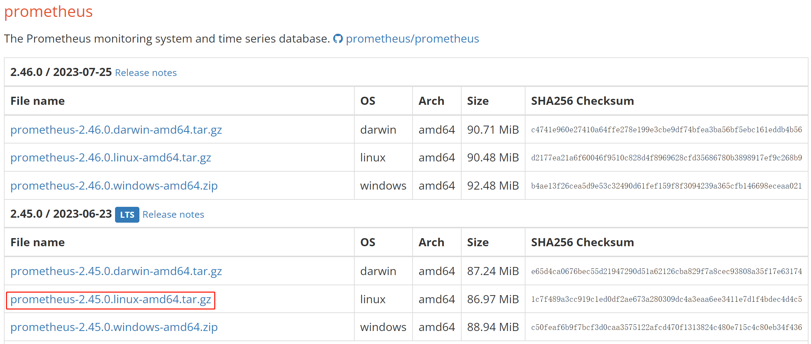

または、`wget` コマンドを使用してダウンロードすることもできます。

```Bash
# 以下の例では、LTS バージョン v2.45.0 をダウンロードします。
# コマンド内のバージョン番号を置き換えることで、他のバージョンをダウンロードできます。
wget https://github.com/prometheus/prometheus/releases/download/v2.45.0/prometheus-2.45.0.linux-amd64.tar.gz
```

ダウンロードが完了したら、インストールパッケージを監視ノードのディレクトリ **/opt** にアップロードまたはコピーします。

#### 1.1.2 Prometheus のインストール

1. **/opt** に移動し、Prometheus インストールパッケージを解凍します。

   ```Bash
   cd /opt
   tar xvf prometheus-2.45.0.linux-amd64.tar.gz
   ```

2. 管理を容易にするため、解凍したディレクトリの名前を **prometheus** に変更します。

   ```Bash
   mv prometheus-2.45.0.linux-amd64 prometheus
   ```

3. Prometheus のデータストレージパスを作成します。

   ```Bash
   mkdir prometheus/data
   ```

4. 管理を容易にするため、Prometheus のシステムサービス起動ファイルを作成できます。

   ```Bash
   vim /etc/systemd/system/prometheus.service
   ```

   ファイルに次の内容を追加します。

   ```Properties
   [Unit]
   Description=Prometheus service
   After=network.target

   [Service]
   User=root
   Type=simple
   ExecReload=/bin/sh -c "/bin/kill -1 `/usr/bin/pgrep prometheus`"
   ExecStop=/bin/sh -c "/bin/kill -9 `/usr/bin/pgrep prometheus`"
   ExecStart=/opt/prometheus/prometheus --config.file=/opt/prometheus/prometheus.yml --storage.tsdb.path=/opt/prometheus/data --storage.tsdb.retention.time=30d --storage.tsdb.retention.size=30GB

   [Install]
   WantedBy=multi-user.target
   ```

   その後、エディタを保存して終了します。

   > **注意**
   >
   > Prometheus を異なるパスにデプロイする場合は、上記のファイル内の ExecStart コマンドでパスを同期することを確認してください。さらに、ファイルは Prometheus データストレージの有効期限条件を「30 日以上」または「30 GB を超える」と設定しています。必要に応じてこれを変更できます。

5. Prometheus の設定ファイル **prometheus/prometheus.yml** を変更します。このファイルは、内容のフォーマットに厳しい要件があります。変更を行う際には、スペースとインデントに特に注意してください。

   ```Bash
   vim prometheus/prometheus.yml
   ```

   ファイルに次の内容を追加します。

   ```YAML
   global:
     scrape_interval: 15s # グローバルなスクレイプ間隔を 15 秒に設定します。デフォルトは 1 分です。
     evaluation_interval: 15s # グローバルなルール評価間隔を 15 秒に設定します。デフォルトは 1 分です。
   scrape_configs:
     - job_name: 'StarRocks_Cluster01' # 監視されるクラスターはジョブに対応します。ここで StarRocks クラスター名をカスタマイズできます。
       metrics_path: '/metrics'    # 監視メトリックを取得するための Restful API を指定します。
       static_configs:
       # 以下の設定は、3 つの FE ノードを含む FE グループを指定します。
       # ここでは、各 FE に対応する IP と HTTP ポートを入力する必要があります。
       # クラスターのデプロイ中に HTTP ポートを変更した場合は、それに応じて調整してください。
         - targets: ['192.168.110.101:8030','192.168.110.102:8030','192.168.110.103:8030']
           labels:
             group: fe
       # 以下の設定は、3 つの BE ノードを含む BE グループを指定します。
       # ここでは、各 BE に対応する IP と HTTP ポートを入力する必要があります。
       # クラスターのデプロイ中に HTTP ポートを変更した場合は、それに応じて調整してください。
         - targets: ['192.168.110.101:8040','192.168.110.102:8040','192.168.110.103:8040']
           labels:
             group: be
   ```

   設定ファイルを変更した後、`promtool` を使用して変更が有効かどうかを確認できます。

   ```Bash
   ./prometheus/promtool check config prometheus/prometheus.yml
   ```

   次のプロンプトが表示されれば、チェックが合格したことを示します。その後、次に進むことができます。

   ```Bash
   SUCCESS: prometheus/prometheus.yml is valid prometheus config file syntax
   ```

6. Prometheus を起動します。

   ```Bash
   systemctl daemon-reload
   systemctl start prometheus.service
   ```

7. Prometheus のステータスを確認します。

   ```Bash
   systemctl status prometheus.service
   ```

   `Active: active (running)` が返されれば、Prometheus が正常に起動したことを示します。

   また、`netstat` を使用してデフォルトの Prometheus ポート (9090) のステータスを確認することもできます。

   ```Bash
   netstat -nltp | grep 9090
   ```

8. Prometheus を起動時に自動起動するように設定します。

   ```Bash
   systemctl enable prometheus.service
   ```

**その他のコマンド**:

- Prometheus を停止します。

  ```Bash
  systemctl stop prometheus.service
  ```

- Prometheus を再起動します。

  ```Bash
  systemctl restart prometheus.service
  ```

- 実行時に設定をリロードします。

  ```Bash
  systemctl reload prometheus.service
  ```

- 起動時の自動起動を無効にします。

  ```Bash
  systemctl disable prometheus.service
  ```

#### 1.1.3 Prometheus へのアクセス

ブラウザを通じて Prometheus Web UI にアクセスでき、デフォルトポートは 9090 です。このチュートリアルの監視ノードの場合、`192.168.110.23:9090` にアクセスする必要があります。

Prometheus のホームページで、上部メニューの **Status** --> **Targets** に移動します。ここで、**prometheus.yml** ファイルに設定された各グループジョブの監視ノードをすべて確認できます。通常、すべてのノードのステータスは UP であるべきで、これはサービス通信が正常であることを示します。

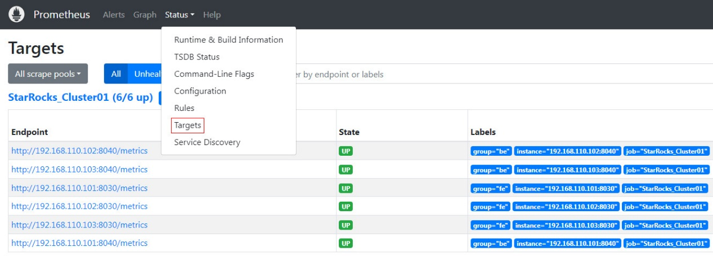

この時点で、Prometheus は設定され、セットアップされています。詳細については、[Prometheus Documentation](https://prometheus.io/docs/) を参照してください。

### 1.2 Grafana のデプロイ

#### 1.2.1 Grafana のダウンロード

[Grafana をダウンロードするにはこちらをクリック](https://grafana.com/grafana/download)。

または、`wget` コマンドを使用して Grafana RPM インストールパッケージをダウンロードすることもできます。

```Bash
# 以下の例では、LTS バージョン v10.0.3 をダウンロードします。
# コマンド内のバージョン番号を置き換えることで、他のバージョンをダウンロードできます。
wget https://dl.grafana.com/enterprise/release/grafana-enterprise-10.0.3-1.x86_64.rpm
```

#### 1.2.2 Grafana のインストール

1. `yum` コマンドを使用して Grafana をインストールします。このコマンドは、Grafana に必要な依存関係を自動的にインストールします。

   ```Bash
   yum -y install grafana-enterprise-10.0.3-1.x86_64.rpm
   ```

2. Grafana を起動します。

   ```Bash
   systemctl start grafana-server.service
   ```

3. Grafana のステータスを確認します。

   ```Bash
   systemctl status grafana-server.service
   ```

   `Active: active (running)` が返されれば、Grafana が正常に起動したことを示します。

   また、`netstat` を使用してデフォルトの Grafana ポート (3000) のステータスを確認することもできます。

   ```Bash
   netstat -nltp | grep 3000
   ```

4. Grafana を起動時に自動起動するように設定します。

   ```Bash
   systemctl enable grafana-server.service
   ```

**その他のコマンド**:

- Grafana を停止します。

  ```Bash
  systemctl stop grafana-server.service
  ```

- Grafana を再起動します。

  ```Bash
  systemctl restart grafana-server.service
  ```

- 起動時の自動起動を無効にします。

  ```Bash
  systemctl disable grafana-server.service
  ```

詳細については、[Grafana Documentation](https://grafana.com/docs/grafana/latest/) を参照してください。

#### 1.2.3 Grafana へのアクセス

ブラウザを通じて Grafana Web UI にアクセスでき、デフォルトポートは 3000 です。このチュートリアルの監視ノードの場合、`192.168.110.23:3000` にアクセスする必要があります。ログインに必要なデフォルトのユーザー名とパスワードはどちらも `admin` に設定されています。初回ログイン時に、Grafana はデフォルトのログインパスワードを変更するよう促します。今はこれをスキップしたい場合は、`Skip` をクリックできます。その後、Grafana Web UI のホームページにリダイレクトされます。


#### 1.2.4 データソースの設定

左上のメニューボタンをクリックし、**Administration** を展開してから **Data sources** をクリックします。

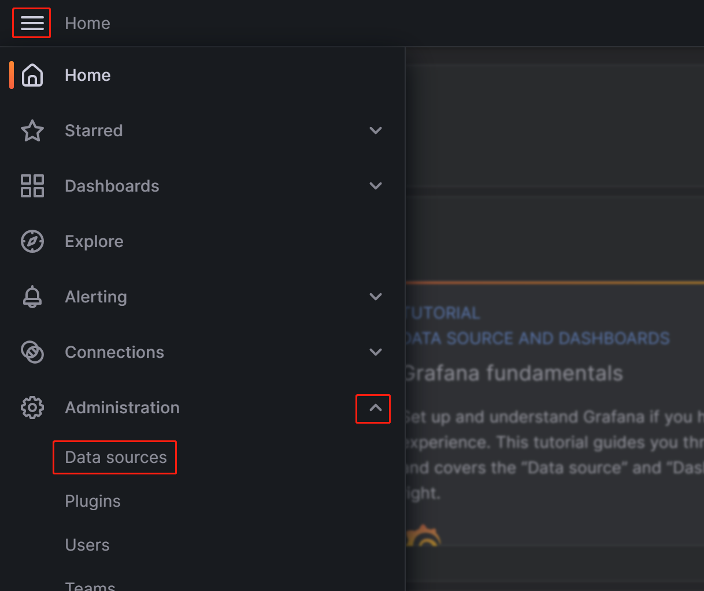

表示されるページで **Add data source** をクリックし、**Prometheus** を選択します。

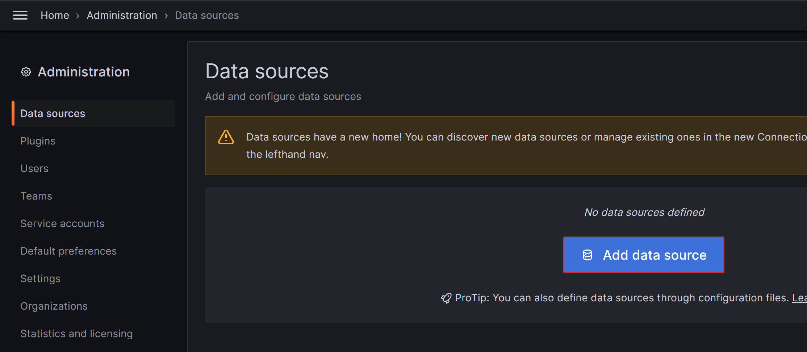


Grafana を Prometheus サービスと統合するには、次の設定を変更する必要があります。

- **Name**: データソースの名前。データソースの名前をカスタマイズできます。

  

- **Prometheus Server URL**: Prometheus サーバーの URL。このチュートリアルでは `http://192.168.110.23:9090` です。

  

設定が完了したら、**Save & Test** をクリックして設定を保存し、テストします。**Successfully queried the Prometheus API** と表示されれば、データソースにアクセスできることを意味します。

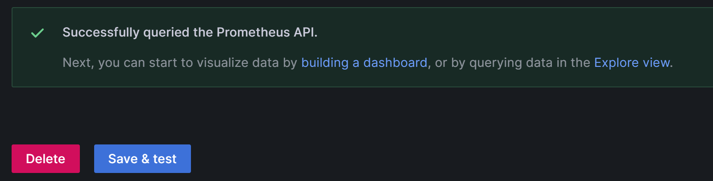

#### 1.2.5 ダッシュボードの設定

1. StarRocks バージョンに基づいて対応するダッシュボードテンプレートをダウンロードします。

   - [StarRocks-2.4.0 以降のダッシュボードテンプレート](http://starrocks-thirdparty.oss-cn-zhangjiakou.aliyuncs.com/StarRocks-Overview-24-new.json)
   - [共有データダッシュボードテンプレート - General](http://starrocks-thirdparty.oss-cn-zhangjiakou.aliyuncs.com/StarRocks-Shared_data-General.json)
   - [共有データダッシュボードテンプレート - Starlet](http://starrocks-thirdparty.oss-cn-zhangjiakou.aliyuncs.com/StarRocks-Shared_data-Starlet.json)

   > **注意**
   >
   > テンプレートファイルは Grafana Web UI を通じてアップロードする必要があります。そのため、テンプレートファイルを Grafana にアクセスするために使用するマシンにダウンロードする必要があります。監視ノード自体にはダウンロードしないでください。

2. ダッシュボードテンプレートを設定します。

   左上のメニューボタンをクリックし、**Dashboards** をクリックします。

   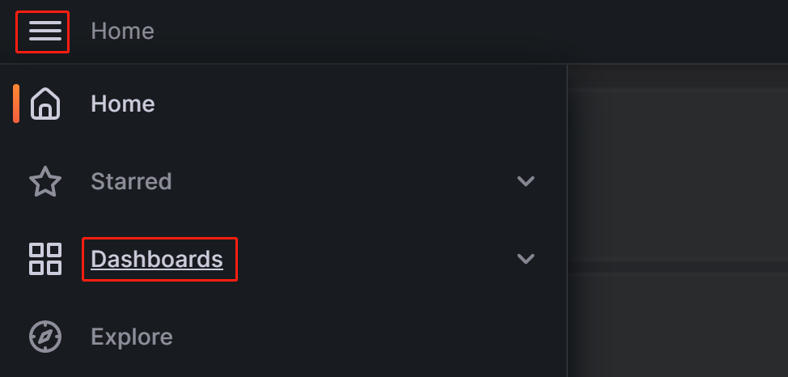

   表示されるページで **New** ボタンを展開し、**Import** をクリックします。

   

   新しいページで **Upload Dashboard JSON file** をクリックし、先ほどダウンロードしたテンプレートファイルをアップロードします。

   

   ファイルをアップロードした後、ダッシュボードの名前を変更できます。デフォルトでは `StarRocks Overview` と名付けられています。その後、先ほど作成したデータソース (`starrocks_monitor`) を選択し、**Import** をクリックします。


インポートが完了すると、StarRocks ダッシュボードが表示されるはずです。

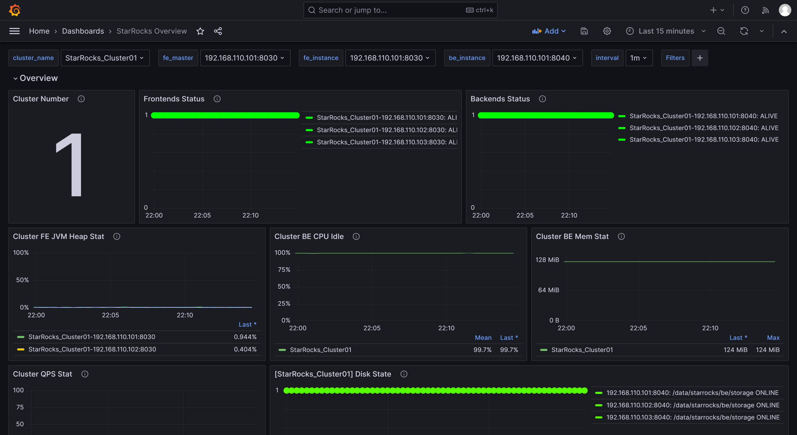

#### 1.2.6 Grafana を介した StarRocks の監視

Grafana Web UI にログインし、左上のメニューボタンをクリックして **Dashboards** を選択します。

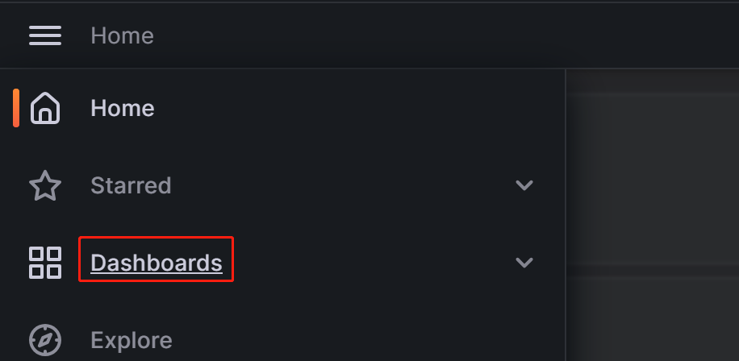

表示されるページで、**General** ディレクトリから **StarRocks Overview** を選択します。

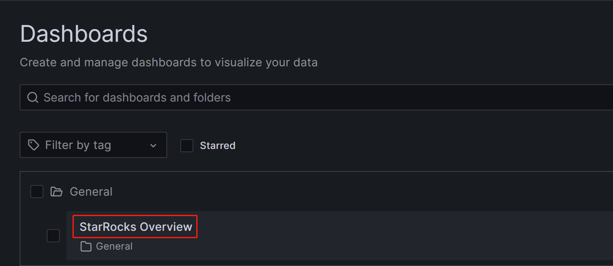

StarRocks 監視ダッシュボードに入った後、ページを手動で更新するか、StarRocks クラスターの状態を監視するための自動更新間隔を設定できます。

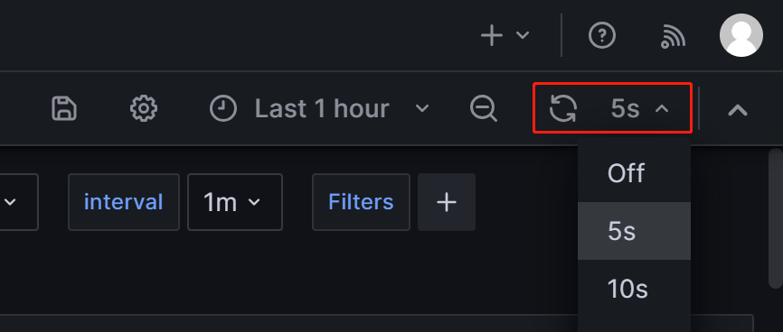

## ステップ 2: コア監視メトリックを理解する

開発、運用、DBA などのニーズに対応するために、StarRocks は幅広い監視メトリックを提供します。このセクションでは、ビジネスで一般的に使用される重要なメトリックとそのアラートルールのみを紹介します。他のメトリックの詳細については、[Monitoring Metrics](./metrics.md) を参照してください。

### 2.1 FE と BE のステータスのメトリック

| **メトリック**       | **説明**                                              | **アラートルール**                                               | **注意**                                                     |
| ---------------- | ------------------------------------------------------------ | ------------------------------------------------------------ | ------------------------------------------------------------ |
| Frontends Status | FE ノードのステータス。ライブノードのステータスは `1` で表され、ダウンしているノード (DEAD) は `0` と表示されます。 | すべての FE ノードのステータスはライブであるべきで、DEAD のステータスを持つ FE ノードはアラートをトリガーするべきです。 | いずれかの FE または BE ノードの障害は重大と見なされ、障害の原因を特定するために迅速なトラブルシューティングが必要です。 |
| Backends Status  | BE ノードのステータス。ライブノードのステータスは `1` で表され、ダウンしているノード (DEAD) は `0` と表示されます。 | すべての BE ノードのステータスはライブであるべきで、DEAD のステータスを持つ BE ノードはアラートをトリガーするべきです。 |                                                              |

### 2.2 クエリ失敗のメトリック

| **メトリック**  | **説明**                                              | **アラートルール**                                               | **注意**                                                     |
| ----------- | ------------------------------------------------------------ | ------------------------------------------------------------ | ------------------------------------------------------------ |
| Query Error | 1 分間のクエリ失敗 (タイムアウトを含む) 率。その値は、1 分間の失敗したクエリの数を 60 秒で割ったものとして計算されます。 | ビジネスの実際の QPS に基づいてこれを設定できます。たとえば、0.05 を初期設定として使用できます。必要に応じて後で調整できます。 | 通常、クエリ失敗率は低く保たれるべきです。このしきい値を 0.05 に設定することは、1 分あたり最大 3 件の失敗したクエリを許可することを意味します。この項目からアラートを受け取った場合、リソース利用率を確認するか、クエリタイムアウトを適切に設定することができます。 |

### 2.3 外部操作失敗のメトリック

| **メトリック**    | **説明**                           | **アラートルール**                                               | **注意**                                                     |
| ------------- | ----------------------------------------- | ------------------------------------------------------------ | ------------------------------------------------------------ |
| Schema Change | Schema Change 操作失敗率。 | Schema Change は低頻度の操作です。この項目を設定して、失敗時に即座にアラートを送信することができます。 | 通常、Schema Change 操作は失敗しないはずです。この項目でアラートがトリガーされた場合、Schema Change 操作のメモリ制限を増やすことを検討できます。デフォルトでは 2GB に設定されています。 |

### 2.4 内部操作失敗のメトリック

| **メトリック**          | **説明**                                              | **アラートルール**                                               | **注意**                                                     |
| ------------------- | ------------------------------------------------------------ | ------------------------------------------------------------ | ------------------------------------------------------------ |
| BE Compaction Score | すべての BE ノードの中で最も高い Compaction Score を示し、現在のコンパクション圧力を示します。 | 通常のオフラインシナリオでは、この値は通常 100 未満です。ただし、多数のロードタスクがある場合、Compaction Score は大幅に増加する可能性があります。ほとんどの場合、この値が 800 を超えると介入が必要です。 | 通常、Compaction Score が 1000 を超えると、StarRocks は「Too many versions」というエラーを返します。このような場合、ロードの同時実行性と頻度を減らすことを検討できます。 |
| Clone               | タブレットクローン操作の失敗率。                     | この項目を設定して、失敗時に即座にアラートを送信することができます。 | この項目でアラートがトリガーされた場合、BE ノードのステータス、ディスクの状態、ネットワークの状態を確認できます。 |

### 2.5 サービス可用性のメトリック

| **メトリック**     | **説明**                                        | **アラートルール**                                               | **注意**                                                     |
| -------------- | ------------------------------------------------------ | ------------------------------------------------------------ | ------------------------------------------------------------ |
| Meta Log Count | FE ノード上の BDB メタデータログエントリの数。 | この項目を設定して、10 万を超えた場合に即座にアラートをトリガーすることをお勧めします。 | デフォルトでは、リーダー FE ノードは、ログの数が 5 万を超えるとチェックポイントをトリガーしてログをディスクにフラッシュします。この値が 5 万を大幅に超える場合、通常はチェックポイントの失敗を示します。**fe.conf** で Xmx ヒープメモリの設定が適切かどうかを確認できます。 |

### 2.6 システム負荷のメトリック

| **メトリック**           | **説明**                                              | **アラートルール**                                               | **注意**                                                     |
| -------------------- | ------------------------------------------------------------ | ------------------------------------------------------------ | ------------------------------------------------------------ |
| BE CPU Idle          | BE ノードの CPU アイドル率。                                | この項目を設定して、30 秒間連続してアイドル率が 10% 未満の場合にアラートをトリガーすることをお勧めします。 | この項目は CPU リソースのボトルネックを監視するために使用されます。CPU 使用率は大きく変動する可能性があり、小さなポーリング間隔を設定すると誤アラートが発生する可能性があります。そのため、実際のビジネス条件に基づいてこの項目を調整する必要があります。複数のバッチ処理タスクや多数のクエリがある場合、より低いしきい値を設定することを検討できます。 |
| BE Mem               | BE ノードのメモリ使用量。                                | この項目を各 BE の利用可能なメモリサイズの 90% に設定することをお勧めします。 | この値はプロセスメモリの値に相当し、BE のデフォルトのメモリ制限はサーバーのメモリサイズの 90% です (**be.conf** の設定 `mem_limit` によって制御されます)。同じサーバーに他のサービスをデプロイしている場合は、OOM を避けるためにこの値を調整することを確認してください。この項目のアラートしきい値は、BE の実際のメモリ制限の 90% に設定し、BE メモリリソースがボトルネックに達したかどうかを確認できます。 |
| Disks Avail Capacity | 各 BE ノードのローカルディスクの利用可能なディスクスペース比率 (パーセンテージ)。 | この項目を設定して、値が 20% 未満の場合にアラートをトリガーすることをお勧めします。 | ビジネス要件に基づいて、StarRocks のために十分な利用可能スペースを確保することをお勧めします。 |
| FE JVM Heap Stat     | クラスター内の各 FE ノードの JVM ヒープメモリ使用率。 | この項目を設定して、値が 80% 以上の場合にアラートをトリガーすることをお勧めします。 | この項目でアラートがトリガーされた場合、**fe.conf** で Xmx ヒープメモリの設定を増やすことをお勧めします。そうしないと、クエリ効率に影響を与えたり、FE OOM の問題を引き起こす可能性があります。 |

## ステップ 3: メールによるアラートの設定

### 3.1 SMTP サービスの設定

Grafana は、メールや Webhook など、さまざまなアラートソリューションをサポートしています。このチュートリアルでは、メールを例に使用します。

メールアラートを有効にするには、まず Grafana に SMTP 情報を設定し、Grafana がメールをあなたのメールボックスに送信できるようにする必要があります。一般的に使用されるメールプロバイダーは SMTP サービスをサポートしており、メールアカウントの SMTP サービスを有効にし、認証コードを取得する必要があります。

これらの手順を完了した後、Grafana がデプロイされているノードの Grafana 設定ファイルを変更します。

```bash
vim /usr/share/grafana/conf/defaults.ini
```

例:

```Properties
###################### SMTP / Emailing #####################
[smtp]
enabled = true
host = <smtp_server_address_and_port>
user = johndoe@gmail.com
# パスワードに # または ; が含まれている場合は、トリプルクォートで囲む必要があります。例 """#password;"""
password = ABCDEFGHIJKLMNOP  # SMTP を有効にした後に取得した認証パスワード。
cert_file =
key_file =
skip_verify = true  ## SMTP サーバーの SSL を検証する
from_address = johndoe@gmail.com  ## メールを送信する際に使用されるアドレス。
from_name = Grafana
ehlo_identity =
startTLS_policy =

[emails]
welcome_email_on_sign_up = false
templates_pattern = emails/*.html, emails/*.txt
content_types = text/html
```

次の設定項目を変更する必要があります。

- `enabled`: Grafana がメールアラートを送信できるかどうか。`true` に設定します。
- `host`: メールの SMTP サーバーアドレスとポートをコロン (`:`) で区切って指定します。例: `smtp.gmail.com:465`。
- `user`: SMTP ユーザー名。
- `password`: SMTP を有効にした後に取得した認証パスワード。
- `skip_verify`: SMTP サーバーの SSL 検証をスキップするかどうか。`true` に設定します。
- `from_address`: アラートメールを送信する際に使用されるメールアドレス。

設定が完了したら、Grafana を再起動します。

```bash
systemctl daemon-reload
systemctl restart grafana-server.service
```

### 3.2 アラートチャネルの作成

Grafana でアラートがトリガーされたときに連絡先に通知する方法を指定するために、アラートチャネル (Contact Point) を作成する必要があります。

1. Grafana Web UI にログインし、左上のメニューボタンをクリックして **Alerting** を展開し、**Contact Points** を選択します。**Contact points** ページで **Add contact point** をクリックして新しいアラートチャネルを作成します。

   

2. **Name** フィールドで、コンタクトポイントの名前をカスタマイズします。その後、**Integration** ドロップダウンリストから **Email** を選択します。

   

3. **Addresses** フィールドに、アラートを受信する連絡先のメールアドレスを入力します。複数のメールアドレスがある場合は、セミコロン (`;`)、カンマ (`,`)、または改行でアドレスを区切ります。

   ページの設定は、次の 2 つの項目を除いてデフォルト値のままにできます。

   - **Single email**: 有効にすると、複数の連絡先がある場合、アラートは単一のメールで送信されます。この項目を有効にすることをお勧めします。
   - **Disable resolved message**: デフォルトでは、アラートの原因が解決されたときに、Grafana はサービスの復旧を通知する別の通知を送信します。この復旧通知が不要な場合は、この項目を無効にできます。このオプションを無効にすることはお勧めしません。

4. 設定が完了したら、ページの右上にある **Test** ボタンをクリックします。表示されるプロンプトで **Sent test notification** をクリックします。SMTP サービスとアドレス設定が正しい場合、ターゲットのメールアカウントは「TestAlert Grafana」という件名のテストメールを受信するはずです。テストアラートメールを正常に受信できることを確認したら、ページ下部の **Save contact point** ボタンをクリックして設定を完了します。

   

   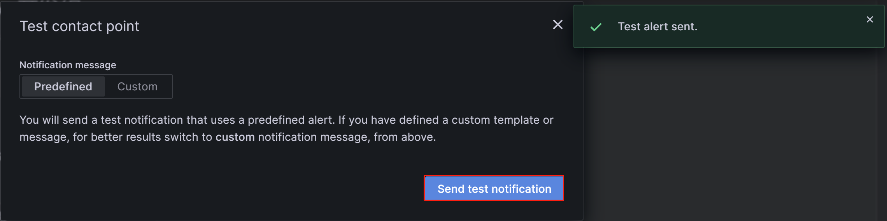

各コンタクトポイントに対して「Add contact point integration」を通じて複数の通知方法を設定できますが、ここでは詳細を省略します。Contact Points の詳細については、[Grafana Documentation](https://grafana.com/docs/grafana-cloud/alerting-and-irm/alerting/fundamentals/notifications/contact-points/) を参照してください。

以降のデモンストレーションでは、このステップで異なるメールアドレスを使用して「StarRocksDev」と「StarRocksOp」という 2 つのコンタクトポイントを作成したと仮定します。

### 3.3 通知ポリシーの設定

Grafana は通知ポリシーを使用してコンタクトポイントとアラートルールを関連付けます。通知ポリシーは、ラベルを使用して異なるアラートを異なる連絡先にルーティングする柔軟な方法を提供し、運用管理中のアラートのグループ化を可能にします。

1. Grafana Web UI にログインし、左上のメニューボタンをクリックして **Alerting** を展開し、**Notification policies** を選択します。

   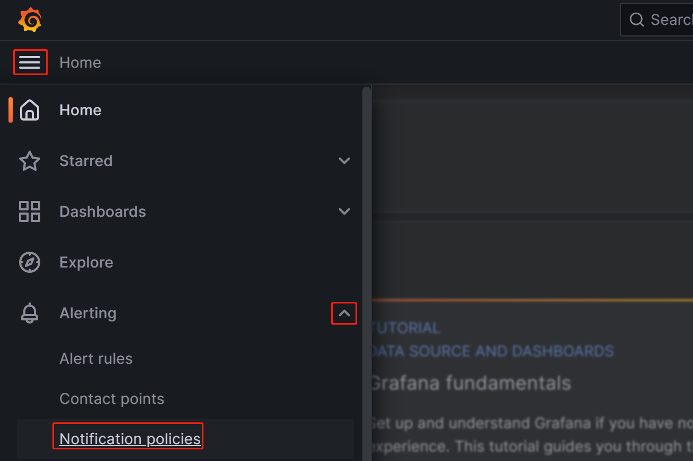

2. **Notification policies** ページで、**Default policy** の右にあるその他 (**...**) アイコンをクリックし、**Edit** をクリックして Default policy を変更します。

   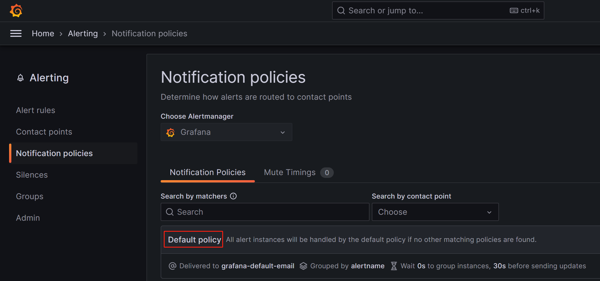

   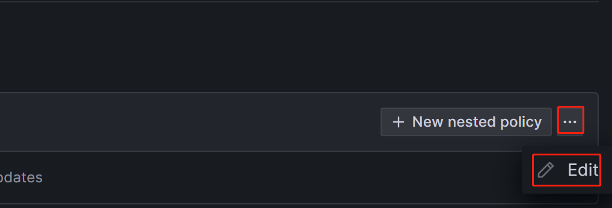

   通知ポリシーはツリー構造を使用しており、Default policy は通知のデフォルトのルートポリシーを表します。他のポリシーが設定されていない場合、すべてのアラートルールはデフォルトでこのポリシーに一致します。その後、デフォルトポリシー内で設定されたデフォルトのコンタクトポイントを使用して通知を行います。

   1. **Default contact point** フィールドで、以前に作成したコンタクトポイントを選択します。たとえば、「StarRocksOp」。

   2. **Group by** は Grafana Alerting の重要な概念であり、類似の特性を持つアラートインスタンスを 1 つのファネルにグループ化します。このチュートリアルではグループ化を行わないため、デフォルト設定を使用できます。

      

   3. **Timing options** フィールドを展開し、**Group wait**、**Group interval**、**Repeat interval** を設定します。

- **Group wait**: 新しいアラートが新しいグループを作成した後、最初の通知を送信するまでの待機時間。デフォルトは 30 秒です。
- **Group interval**: 既存のグループに対してアラートが送信される間隔。デフォルトは 5 分で、これは前回のアラートが送信されてから 5 分以内にこのグループに通知が送信されないことを意味します。これは、これらのアラートインスタンスのアラートルール間隔が低かったとしても、最後のバッチの更新が配信されてから 5 分 (デフォルト) 以内に通知が送信されないことを意味します。デフォルトは 5 分です。
- **Repeat interval**: アラートが正常に送信された後に再送信するまでの待機時間。既存のグループに対してアラートが送信される間隔。デフォルトは 5 分で、これは前回のアラートが送信されてから 5 分以内にこのグループに通知が送信されないことを意味します。

以下のようにパラメータを設定することで、Grafana は次のルールに従ってアラートを送信します: **アラート条件が満たされた**後、0 秒 (Group wait) で最初のアラートメールを送信します。その後、Grafana は 1 分ごとにアラートを再送信します (Group interval + Repeat interval)。

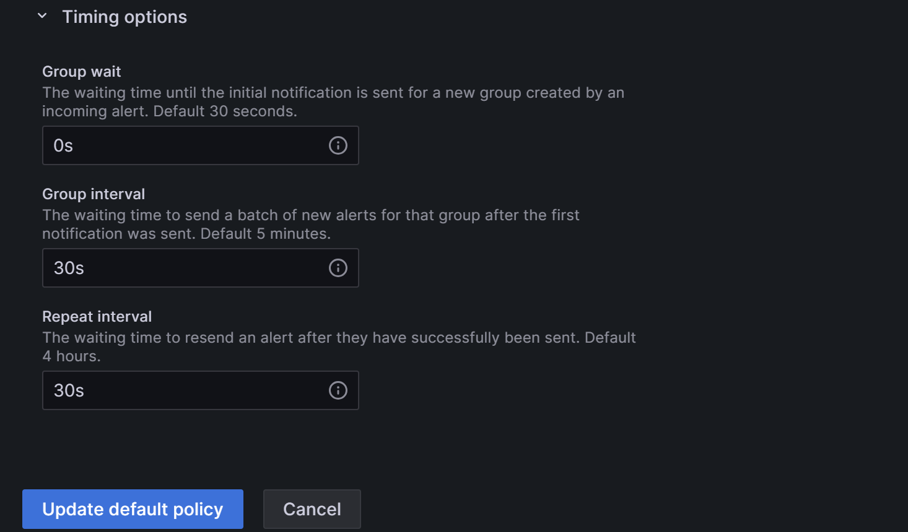

> **注意**
>
> 前述のアラートチャネル設定セクションでの「Disable resolved message」オプションは、クラスタサービスの復旧に関するメールの送信タイミングを制御しますが、これは上記の「Evaluate every」パラメータにも影響されます。つまり、Grafana が新しいチェックを行い、サービスが復旧したことを検出すると、連絡先に通知するためのメールを送信します。

3. 設定が完了したら、**Update default policy** をクリックします。

4. ネストされたポリシーを作成する必要がある場合は、**Notification policies** ページで **New nested policy** をクリックします。

   ネストされたポリシーは、ラベルを使用して一致ルールを定義します。ネストされたポリシーで定義されたラベルは、後でアラートルールを設定するときに条件として使用できます。以下の例では、ラベルを `Group=Development_team` として設定します。

   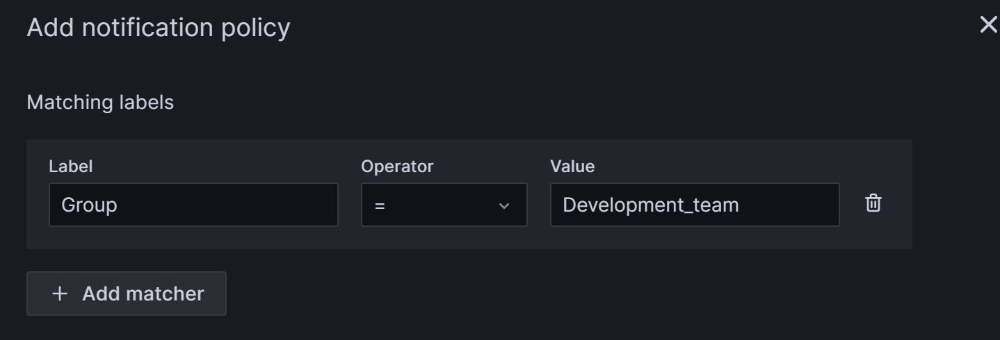

   **Contact point** フィールドで「StarRocksDev」を選択します。これにより、`Group=Development_team` というラベルを持つアラートルールを設定すると、「StarRocksDev」がアラートを受信するようになります。

   ネストされたポリシーは、親ポリシーからタイミングオプションを継承できます。設定が完了したら、**Save policy** をクリックしてポリシーを保存します。

   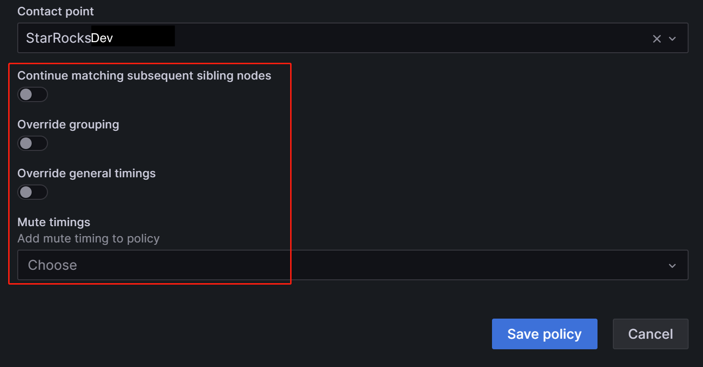

通知ポリシーの詳細や、ビジネスにより複雑なアラートシナリオがある場合は、[Grafana Documentation](https://grafana.com/docs/grafana-cloud/alerting-and-irm/alerting/fundamentals/notifications/contact-points/) を参照してください。

### 3.4 アラートルールの定義

通知ポリシーを設定した後、StarRocks のアラートルールを定義する必要があります。

Grafana Web UI にログインし、以前に設定した StarRocks Overview ダッシュボードを検索して移動します。

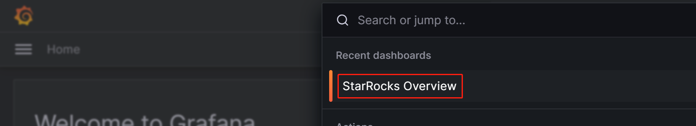

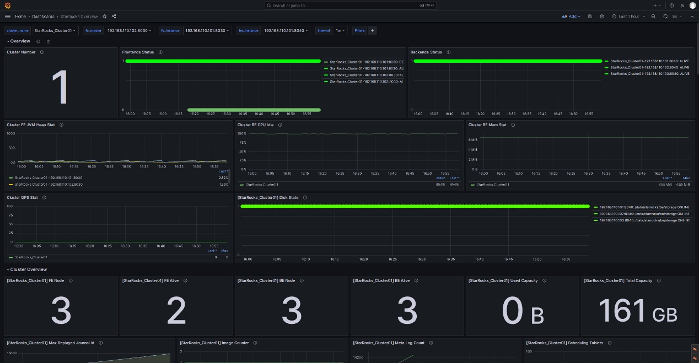

#### 3.4.1 FE と BE のステータスアラートルール

StarRocks クラスターでは、すべての FE および BE ノードのステータスがライブである必要があります。DEAD のステータスを持つノードはアラートをトリガーする必要があります。

以下の例では、StarRocks Overview の下にある Frontends Status と Backends Status メトリックを使用して FE と BE のステータスを監視します。Prometheus で複数の StarRocks クラスターを設定できるため、Frontends Status と Backends Status メトリックは登録したすべてのクラスターに対応しています。

##### FE のアラートルールを設定する

**Frontends Status** のアラートを設定する手順は次のとおりです。

1. **Frontends Status** 監視項目の右にあるその他 (...) アイコンをクリックし、**Edit** をクリックします。

   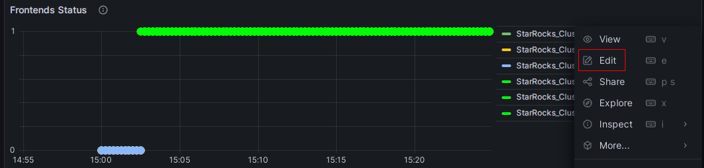

2. 新しいページで、**Alert** を選択し、このパネルから **Create alert rule** をクリックしてルール作成ページに移動します。

   

3. **Rule name** フィールドでルール名を設定します。デフォルト値は監視メトリックのタイトルです。複数のクラスターがある場合は、区別のためにクラスター名をプレフィックスとして追加できます。たとえば、"[PROD]Frontends Status"。

   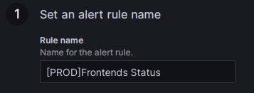

4. アラートルールを次のように設定します。

   1. **Grafana managed alert** を選択します。
   2. セクション **B** でルールを `(up{group="fe"})` に変更します。
   3. セクション **A** の右にある削除アイコンをクリックしてセクション **A** を削除します。
   4. セクション **C** で **Input** フィールドを **B** に変更します。
   5. セクション **D** で条件を `IS BELOW 1` に変更します。

   これらの設定を完了すると、ページは次のように表示されます。

   

   <details>
     <summary>詳細な手順を表示するにはクリックしてください</summary>

   Grafana でアラートルールを設定する際には、通常、次の 3 つのステップが含まれます。

   1. PromQL クエリを通じて Prometheus からメトリック値を取得します。PromQL は Prometheus によって開発されたデータクエリ DSL 言語であり、ダッシュボードの JSON テンプレートでも使用されます。各監視項目の `expr` プロパティは、それぞれの PromQL に対応しています。ルール設定ページで **Run queries** をクリックしてクエリ結果を確認できます。
   2. 上記のクエリからの結果データを処理するために関数とモードを適用します。通常、最新の値を取得するために Last 関数を使用し、Strict モードを使用して、返された値が数値データでない場合に `NaN` として表示されるようにします。
   3. 処理されたクエリ結果に対してルールを設定します。FE を例にとると、FE ノードのステータスがライブの場合、出力結果は `1` です。FE ノードがダウンしている場合、結果は `0` です。したがって、ルールを `IS BELOW 1` に設定し、この条件が発生したときにアラートがトリガーされるようにします。
   </details>

5. アラート評価ルールを設定します。

   Grafana のドキュメントによれば、アラートルールを評価する頻度とそのステータスが変化する頻度を設定する必要があります。簡単に言えば、「アラートルールをどのくらいの頻度でチェックするか」と「異常状態が検出された後、アラートをトリガーするまでの持続時間 (一時的なスパイクによる誤アラートを避けるため)」を設定することを含みます。各 Evaluation group には、アラートルールをチェックする頻度を決定する独立した評価間隔が含まれています。StarRocks プロダクションクラスター専用に **PROD** という新しいフォルダーを作成し、その中に新しい Evaluation group `01` を作成できます。その後、このグループを `10` 秒ごとにチェックし、異常が `30` 秒間持続した場合にアラートをトリガーするように設定します。

   

   > **注意**
   >
   > 前述のアラートチャネル設定セクションでの「Disable resolved message」オプションは、クラスタサービスの復旧に関するメールの送信タイミングを制御しますが、これは上記の「Evaluate every」パラメータにも影響されます。つまり、Grafana が新しいチェックを行い、サービスが復旧したことを検出すると、連絡先に通知するためのメールを送信します。

6. アラート注釈を追加します。

   **Add details for your alert rule** セクションで **Add annotation** をクリックして、アラートメールの内容を設定します。**Dashboard UID** と **Panel ID** フィールドを変更しないように注意してください。

   

   **Choose** ドロップダウンリストで **Description** を選択し、アラートメールの説明内容を追加します。たとえば、「FE ノードが StarRocks プロダクションクラスターで失敗しました。確認してください！」。

7. 通知ポリシーを一致させます。

   アラートルールの通知ポリシーを指定します。デフォルトでは、すべてのアラートルールは Default policy に一致します。アラート条件が満たされた場合、Grafana は Default policy の「StarRocksOp」コンタクトポイントを使用して、設定されたメールグループにアラートメッセージを送信します。

   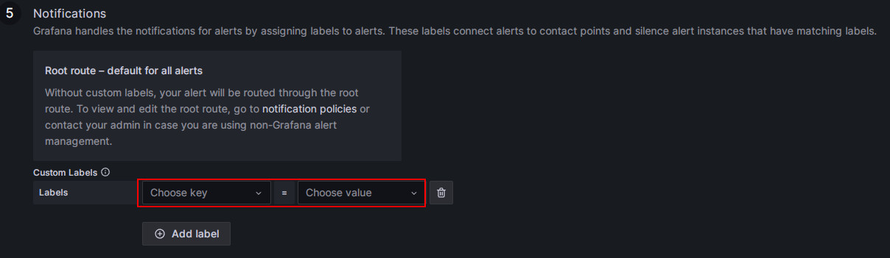

   ネストされたポリシーを使用したい場合は、**Label** フィールドを対応するネストされたポリシーに設定します。たとえば、`Group=Development_team`。

   例:

   

   アラート条件が満たされた場合、Default policy の「StarRocksOp」ではなく、「StarRocksDev」にメールが送信されます。

8. すべての設定が完了したら、**Save rule and exit** をクリックします。

   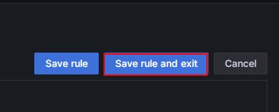

##### アラートトリガーをテストする

FE ノードを手動で停止してアラートをテストできます。この時点で、Frontends Status の右側にあるハート型のシンボルは緑から黄色、そして赤に変わります。

**緑**: 最後の定期チェック中に、メトリック項目の各インスタンスのステータスが正常であり、アラートがトリガーされなかったことを示します。緑のステータスは、現在のノードが正常な状態にあることを保証するものではありません。ノードサービスの異常後にステータスの変化に遅延があるかもしれませんが、通常、遅延は数分単位ではありません。

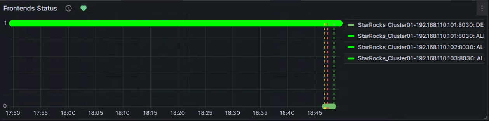

**黄色**: 最後の定期チェック中に、メトリック項目のインスタンスが異常であることが発見されましたが、異常状態の持続時間がまだ上記で設定された「Duration」に達していません。この時点で、Grafana はアラートを送信せず、異常状態の持続時間が設定された「Duration」に達するまで定期チェックを続けます。この期間中にステータスが回復した場合、シンボルは緑に戻ります。

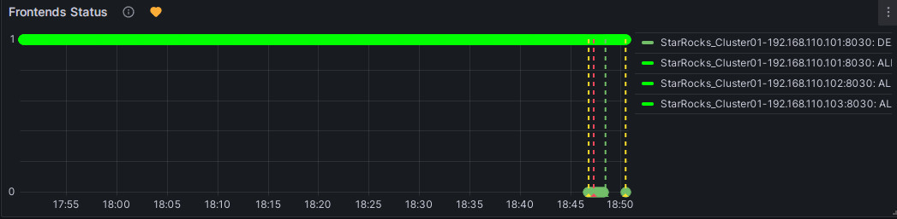

**赤**: 異常状態の持続時間が設定された「Duration」に達すると、シンボルは赤に変わり、Grafana はメールアラートを送信します。異常状態が解決されるまでシンボルは赤のままで、その後緑に戻ります。

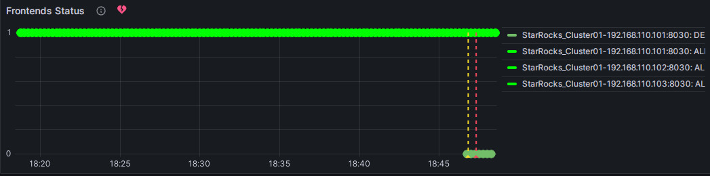

##### アラートを手動で一時停止する

異常の解決に長時間が必要な場合や、異常以外の理由でアラートが継続的にトリガーされる場合、Grafana がアラートメールを継続的に送信するのを防ぐために、アラートルールの評価を一時的に停止できます。

ダッシュボードのメトリック項目に対応する Alert タブに移動し、編集アイコンをクリックします。


**Alert Evaluation Behavior** セクションで、**Pause Evaluation** スイッチを ON の位置に切り替えます。


> **注意**
>
> 評価を一時停止した後、サービスが復旧したことを通知するメールを受け取ります。

##### BE のアラートルールを設定する

上記のプロセスに従って BE のアラートルールを設定できます。

Backends Status メトリック項目の設定を編集します。

1. **Set an alert rule name** セクションで、名前を "[PROD]Backends Status" に設定します。
2. **Set a query and alert condition** セクションで、PromSQL を `(up{group="be"})` に設定し、他の項目については FE アラートルールと同じ設定を使用します。
3. **Alert evaluation behavior** セクションで、以前に作成した **PROD** ディレクトリと Evaluation group **01** を選択し、持続時間を 30 秒に設定します。
4. **Add details for your alert rule** セクションで、**Add annotation** をクリックし、**Description** を選択してアラート内容を入力します。たとえば、「StarRocks プロダクションクラスターの BE ノードが失敗しました。確認してください！BE の失敗に関するスタック情報は BE ログファイル **be.out** に出力されます。ログに基づいて原因を特定できます」。
5. **Notifications** セクションで、FE アラートルールと同じように **Labels** を設定します。Labels が設定されていない場合、Grafana は Default policy を使用し、「StarRocksOp」アラートチャネルにアラートメールを送信します。

#### 3.4.2 クエリアラートルール

クエリ失敗のメトリック項目は **Query Statistic** の下にある **Query Error** です。

「Query Error」メトリック項目のアラートルールを次のように設定します。

1. **Set an alert rule name** セクションで、名前を "[PROD] Query Error" に設定します。
2. **Set a query and alert condition** セクションで、セクション **B** を削除します。セクション **A** の **Input** を **C** に設定します。セクション **C** では、PromQL のデフォルト値を使用します。これは `rate(starrocks_fe_query_err{job="StarRocks_Cluster01"}[1m])` で、1 分間の失敗したクエリの数を 60 秒で割ったものを表します。これには、失敗したクエリとタイムアウトを超えたクエリの両方が含まれます。その後、セクション **D** でルールを `A IS ABOVE 0.05` に設定します。
3. **Alert evaluation behavior** セクションで、以前に作成した **PROD** ディレクトリと Evaluation group **01** を選択し、持続時間を 30 秒に設定します。
4. **Add details for your alert rule** セクションで、**Add annotation** をクリックし、**Description** を選択してアラート内容を入力します。たとえば、「高いクエリ失敗率が検出されました。リソース使用状況を確認するか、クエリタイムアウトを適切に設定してください。クエリがタイムアウトのために失敗している場合、システム変数 `query_timeout` を設定してクエリタイムアウトを調整できます」。
5. **Notifications** セクションで、FE アラートルールと同じように **Labels** を設定します。Labels が設定されていない場合、Grafana は Default policy を使用し、「StarRocksOp」アラートチャネルにアラートメールを送信します。

#### 3.4.3 ユーザー操作失敗アラートルール

この項目は、Schema Change 操作の失敗率を監視し、**BE tasks** の下にある **Schema Change** メトリック項目に対応しています。0 を超えた場合にアラートを設定する必要があります。

1. **Set an alert rule name** セクションで、名前を "[PROD] Schema Change" に設定します。
2. **Set a query and alert condition** セクションで、セクション **A** を削除します。セクション **C** の **Input** を **B** に設定します。セクション **B** では、PromQL のデフォルト値を使用します。これは `irate(starrocks_be_engine_requests_total{job="StarRocks_Cluster01", type="create_rollup", status="failed"}[1m])` で、1 分間の失敗した Schema Change タスクの数を 60 秒で割ったものを表します。その後、セクション **D** でルールを `C IS ABOVE 0` に設定します。
3. **Alert evaluation behavior** セクションで、以前に作成した **PROD** ディレクトリと Evaluation group **01** を選択し、持続時間を 30 秒に設定します。
4. **Add details for your alert rule** セクションで、**Add annotation** をクリックし、**Description** を選択してアラート内容を入力します。たとえば、「失敗した Schema Change タスクが検出されました。すぐに確認してください。BE 設定パラメータ `memory_limitation_per_thread_for_schema_change` を調整して、Schema Change に利用可能なメモリ制限を増やすことができます。デフォルトでは 2GB に設定されています」。
5. **Notifications** セクションで、FE アラートルールと同じように **Labels** を設定します。Labels が設定されていない場合、Grafana は Default policy を使用し、「StarRocksOp」アラートチャネルにアラートメールを送信します。

#### 3.4.4 StarRocks 操作失敗アラートルール

##### BE Compaction Score

この項目は **Cluster Overview** の下にある **BE Compaction Score** に対応しており、クラスターのコンパクション圧力を監視するために使用されます。

1. **Set an alert rule name** セクションで、名前を "[PROD] BE Compaction Score" に設定します。
2. **Set a query and alert condition** セクションで、セクション C のルールを `B IS ABOVE 0` に設定します。他の項目についてはデフォルト値を使用できます。
3. **Alert evaluation behavior** セクションで、以前に作成した **PROD** ディレクトリと Evaluation group **01** を選択し、持続時間を 30 秒に設定します。
4. **Add details for your alert rule** セクションで、**Add annotation** をクリックし、**Description** を選択してアラート内容を入力します。たとえば、「高いコンパクション圧力が検出されました。高頻度または高同時実行のロードタスクがあるかどうかを確認し、ロード頻度を減らしてください。クラスターに十分な CPU、メモリ、および I/O リソースがある場合、クラスターのコンパクション戦略を調整することを検討してください」。
5. **Notifications** セクションで、FE アラートルールと同じように **Labels** を設定します。Labels が設定されていない場合、Grafana は Default policy を使用し、「StarRocksOp」アラートチャネルにアラートメールを送信します。

##### Clone

この項目は **BE tasks** の下にある **Clone** に対応しており、通常は失敗しない StarRocks 内のレプリカバランシングまたはレプリカ修復操作を監視するために使用されます。

1. **Set an alert rule name** セクションで、名前を "[PROD] Clone" に設定します。
2. **Set a query and alert condition** セクションで、セクション A を削除します。セクション **C** の **Input** を **B** に設定します。セクション **B** では、PromQL のデフォルト値を使用します。これは `irate(starrocks_be_engine_requests_total{job="StarRocks_Cluster01", type="clone", status="failed"}[1m])` で、1 分間の失敗した Clone タスクの数を 60 秒で割ったものを表します。その後、セクション **D** でルールを `C IS ABOVE 0` に設定します。
3. **Alert evaluation behavior** セクションで、以前に作成した **PROD** ディレクトリと Evaluation group **01** を選択し、持続時間を 30 秒に設定します。
4. **Add details for your alert rule** セクションで、**Add annotation** をクリックし、**Description** を選択してアラート内容を入力します。たとえば、「クローンタスクの失敗が検出されました。クラスターの BE ステータス、ディスクステータス、およびネットワークステータスを確認してください」。
5. **Notifications** セクションで、FE アラートルールと同じように **Labels** を設定します。Labels が設定されていない場合、Grafana は Default policy を使用し、「StarRocksOp」アラートチャネルにアラートメールを送信します。

#### 3.4.5 サービス可用性アラートルール

この項目は BDB のメタデータログ数を監視し、**Cluster Overview** の下にある **Meta Log Count** 監視項目に対応しています。

1. **Set an alert rule name** セクションで、名前を "[PROD] Meta Log Count" に設定します。
2. **Set a query and alert condition** セクションで、セクション **C** のルールを `B IS ABOVE 100000` に設定します。他の項目についてはデフォルト値を使用できます。
3. **Alert evaluation behavior** セクションで、以前に作成した **PROD** ディレクトリと Evaluation group **01** を選択し、持続時間を 30 秒に設定します。
4. **Add details for your alert rule** セクションで、**Add annotation** をクリックし、**Description** を選択してアラート内容を入力します。たとえば、「FE BDB のメタデータ数が予想値を大幅に超えていることが検出されました。これは Checkpoint 操作の失敗を示す可能性があります。FE 設定ファイル **fe.conf** の Xmx ヒープメモリ設定が適切かどうかを確認してください」。
5. **Notifications** セクションで、FE アラートルールと同じように **Labels** を設定します。Labels が設定されていない場合、Grafana は Default policy を使用し、「StarRocksOp」アラートチャネルにアラートメールを送信します。

#### 3.4.6 システム過負荷アラートルール

##### BE CPU Idle

この項目は BE ノードの CPU アイドル率を監視します。

1. **Set an alert rule name** セクションで、名前を "[PROD] BE CPU Idle" に設定します。
2. **Set a query and alert condition** セクションで、セクション C のルールを `B IS BELOW 10` に設定します。他の項目についてはデフォルト値を使用できます。
3. **Alert evaluation behavior** セクションで、以前に作成した **PROD** ディレクトリと Evaluation group **01** を選択し、持続時間を 30 秒に設定します。
4. **Add details for your alert rule** セクションで、**Add annotation** をクリックし、**Description** を選択してアラート内容を入力します。たとえば、「BE CPU 負荷が一貫して高いことが検出されました。これはクラスター内の他のタスクに影響を与える可能性があります。クラスターが異常であるか、CPU リソースのボトルネックがあるかどうかを確認してください」。
5. **Notifications** セクションで、FE アラートルールと同じように **Labels** を設定します。Labels が設定されていない場合、Grafana は Default policy を使用し、「StarRocksOp」アラートチャネルにアラートメールを送信します。

##### BE Memory

この項目は **BE** の下にある **BE Mem** に対応しており、BE ノードのメモリ使用量を監視します。

1. **Set an alert rule name** セクションで、名前を "[PROD] BE Mem" に設定します。
2. **Set a query and alert condition** セクションで、PromSQL を `starrocks_be_process_mem_bytes{job="StarRocks_Cluster01"}/(<be_mem_limit>*1024*1024*1024)` に設定します。ここで `<be_mem_limit>` は現在の BE ノードの利用可能なメモリ制限に置き換える必要があります。つまり、サーバーのメモリサイズに BE 設定項目 `mem_limit` の値を掛けたものです。例: `starrocks_be_process_mem_bytes{job="StarRocks_Cluster01"}/(49*1024*1024*1024)`。その後、セクション **C** でルールを `B IS ABOVE 0.9` に設定します。
3. **Alert evaluation behavior** セクションで、以前に作成した **PROD** ディレクトリと Evaluation group **01** を選択し、持続時間を 30 秒に設定します。
4. **Add details for your alert rule** セクションで、**Add annotation** をクリックし、**Description** を選択してアラート内容を入力します。たとえば、「BE メモリ使用量が一貫して高いことが検出されました。クエリの失敗を防ぐために、メモリサイズを拡張するか、BE ノードを追加することを検討してください」。
5. **Notifications** セクションで、FE アラートルールと同じように **Labels** を設定します。Labels が設定されていない場合、Grafana は Default policy を使用し、「StarRocksOp」アラートチャネルにアラートメールを送信します。

##### Disks Avail Capacity

この項目は **BE** の下にある **Disk Usage** に対応しており、BE ストレージパスがあるディレクトリの残りスペース比率を監視します。

1. **Set an alert rule name** セクションで、名前を "[PROD] Disks Avail Capacity" に設定します。
2. **Set a query and alert condition** セクションで、セクション **C** のルールを `B IS BELOW 0.2` に設定します。他の項目についてはデフォルト値を使用できます。
3. **Alert evaluation behavior** セクションで、以前に作成した **PROD** ディレクトリと Evaluation group **01** を選択し、持続時間を 30 秒に設定します。
4. **Add details for your alert rule** セクションで、**Add annotation** をクリックし、**Description** を選択してアラート内容を入力します。たとえば、「BE ディスクの利用可能スペースが 20% 未満であることが検出されました。ディスクスペースを解放するか、ディスクを拡張してください」。
5. **Notifications** セクションで、FE アラートルールと同じように **Labels** を設定します。Labels が設定されていない場合、Grafana は Default policy を使用し、「StarRocksOp」アラートチャネルにアラートメールを送信します。

##### FE JVM Heap Stat

この項目は **Overview** の下にある **Cluster FE JVM Heap Stat** に対応しており、FE の JVM メモリ使用率と FE ヒープメモリ制限の割合を監視します。

1. **Set an alert rule name** セクションで、名前を "[PROD] FE JVM Heap Stat" に設定します。
2. **Set a query and alert condition** セクションで、セクション **C** のルールを `B IS ABOVE 80` に設定します。他の項目についてはデフォルト値を使用できます。
3. **Alert evaluation behavior** セクションで、以前に作成した **PROD** ディレクトリと Evaluation group **01** を選択し、持続時間を 30 秒に設定します。
4. **Add details for your alert rule** セクションで、**Add annotation** をクリックし、**Description** を選択してアラート内容を入力します。たとえば、「FE ヒープメモリ使用量が高いことが検出されました。FE 設定ファイル **fe.conf** でヒープメモリ制限を調整してください」。
5. **Notifications** セクションで、FE アラートルールと同じように **Labels** を設定します。Labels が設定されていない場合、Grafana は Default policy を使用し、「StarRocksOp」アラートチャネルにアラートメールを送信します。

## Q&A

### Q: なぜダッシュボードが異常を検出できないのですか？

A: Grafana ダッシュボードは、ホストされているサーバーのシステム時間に依存して監視項目の値を取得します。クラスターの異常後に Grafana ダッシュボードページが変化しない場合、サーバーのシステムクロックが同期されているかどうかを確認し、その後クラスターの時間校正を行うことができます。

### Q: アラートのグレード分けをどのように実装できますか？

A: Query Error 項目を例にとると、異なるアラートしきい値を持つ 2 つのアラートルールを作成できます。たとえば：

- **リスクレベル**: 失敗率を 0.05 より大きく設定し、リスクを示します。アラートを開発チームに送信します。
- **重大度レベル**: 失敗率を 0.20 より大きく設定し、重大度を示します。この時点で、アラート通知は開発チームと運用チームの両方に同時に送信されます。