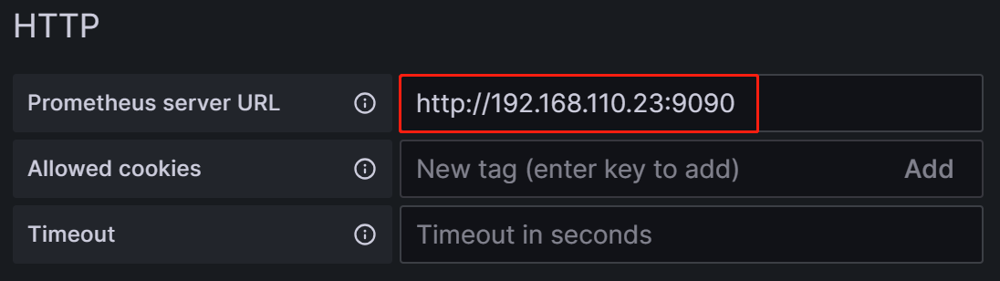
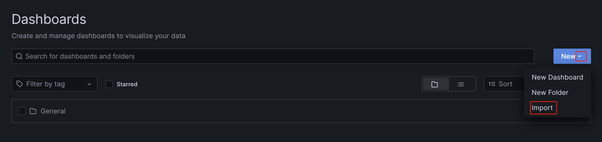
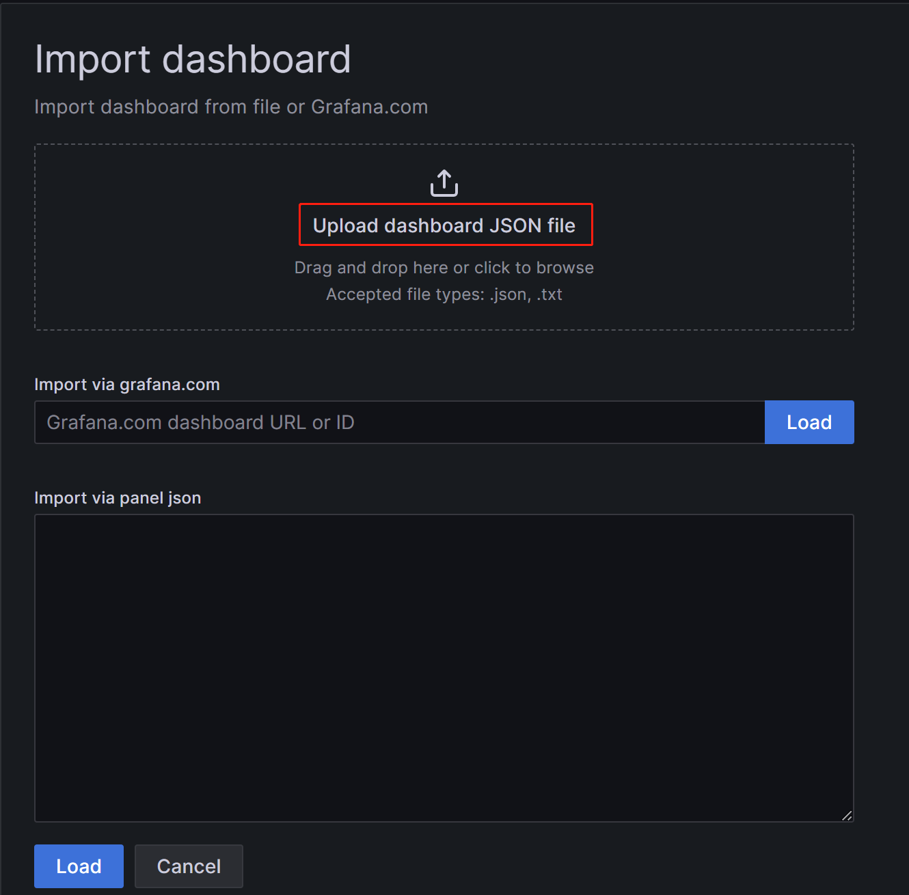
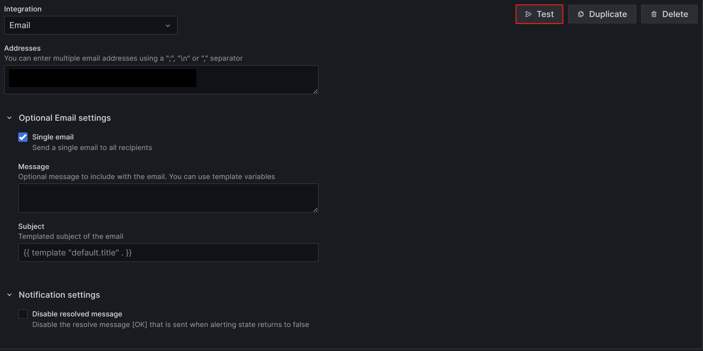
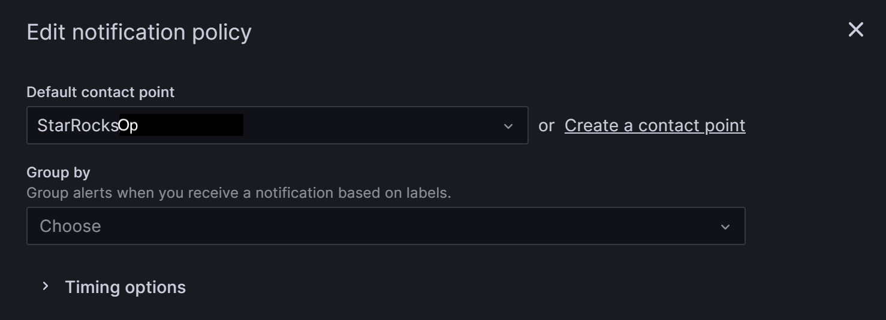
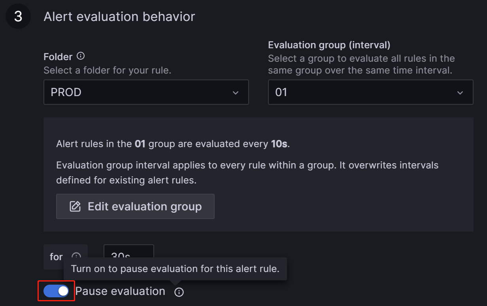

# Prometheus と Grafana を使ったモニタリングとアラート

StarRocks は、Prometheus と Grafana を使用してモニタリングとアラートのソリューションを提供します。これにより、クラスタの稼働状況を可視化し、モニタリングとトラブルシューティングを容易にします。

## 概要

StarRocks は、Prometheus 互換の情報収集インターフェースを提供します。Prometheus は、BE および FE ノードの HTTP ポートに接続して StarRocks のメトリック情報を取得し、自身の時系列データベースに情報を保存します。Grafana は、Prometheus をデータソースとして使用し、メトリック情報を可視化できます。StarRocks が提供するダッシュボードテンプレートを使用することで、StarRocks クラスタを簡単にモニタリングし、Grafana でアラートを設定できます。


Prometheus と Grafana を StarRocks クラスタに統合するための手順は次のとおりです。

1. 必要なコンポーネントをインストールする - Prometheus と Grafana。
2. StarRocks のコアモニタリングメトリックを理解する。
3. アラートチャネルとアラートルールを設定する。

## ステップ 1: モニタリングコンポーネントのインストール

Prometheus と Grafana のデフォルトポートは StarRocks のポートと競合しません。ただし、プロダクション環境では、StarRocks クラスタとは異なるサーバーにデプロイすることをお勧めします。これにより、リソースの競合リスクが軽減され、サーバーの異常なシャットダウンによるアラートの失敗を回避できます。

さらに、Prometheus と Grafana は自身のサービスの可用性をモニタリングできません。したがって、プロダクション環境では、Supervisor を使用してハートビートサービスを設定することをお勧めします。

次のチュートリアルでは、モニタリングノード（IP: 192.168.110.23）にモニタリングコンポーネントをデプロイし、root OS ユーザーを使用します。これらは、次の StarRocks クラスタ（デフォルトポートを使用）をモニタリングします。このチュートリアルに基づいて独自の StarRocks クラスタのモニタリングサービスを設定する場合は、IP アドレスを置き換えるだけです。

| **ホスト** | **IP**          | **OS ユーザー** | **サービス** |
| -------- | --------------- | --------------- | ------------ |
| node01   | 192.168.110.101 | root            | 1 FE + 1 BE  |
| node02   | 192.168.110.102 | root            | 1 FE + 1 BE  |
| node03   | 192.168.110.103 | root            | 1 FE + 1 BE  |

> **注意**
>
> Prometheus と Grafana は、FE、BE、CN ノードのみをモニタリングでき、Broker ノードはモニタリングできません。

### 1.1 Prometheus のデプロイ

#### 1.1.1 Prometheus のダウンロード

StarRocks の場合、Prometheus サーバーのインストールパッケージをダウンロードするだけで済みます。モニタリングノードにパッケージをダウンロードします。

[Prometheus をダウンロードするにはこちらをクリック](https://prometheus.io/download/)。

LTS バージョン v2.45.0 を例にとり、パッケージをクリックしてダウンロードします。


または、`wget` コマンドを使用してダウンロードすることもできます。

```Bash
# 以下の例では、LTS バージョン v2.45.0 をダウンロードします。
# コマンド内のバージョン番号を置き換えることで、他のバージョンをダウンロードできます。
wget https://github.com/prometheus/prometheus/releases/download/v2.45.0/prometheus-2.45.0.linux-amd64.tar.gz
```

ダウンロードが完了したら、インストールパッケージをモニタリングノードのディレクトリ **/opt** にアップロードまたはコピーします。

#### 1.1.2 Prometheus のインストール

1. **/opt** に移動し、Prometheus のインストールパッケージを解凍します。

   ```Bash
   cd /opt
   tar xvf prometheus-2.45.0.linux-amd64.tar.gz
   ```

2. 管理を容易にするため、解凍したディレクトリの名前を **prometheus** に変更します。

   ```Bash
   mv prometheus-2.45.0.linux-amd64 prometheus
   ```

3. Prometheus のデータストレージパスを作成します。

   ```Bash
   mkdir prometheus/data
   ```

4. 管理を容易にするため、Prometheus のシステムサービス起動ファイルを作成します。

   ```Bash
   vim /etc/systemd/system/prometheus.service
   ```

   ファイルに次の内容を追加します。

   ```Properties
   [Unit]
   Description=Prometheus service
   After=network.target

   [Service]
   User=root
   Type=simple
   ExecReload=/bin/sh -c "/bin/kill -1 `/usr/bin/pgrep prometheus`"
   ExecStop=/bin/sh -c "/bin/kill -9 `/usr/bin/pgrep prometheus`"
   ExecStart=/opt/prometheus/prometheus --config.file=/opt/prometheus/prometheus.yml --storage.tsdb.path=/opt/prometheus/data --storage.tsdb.retention.time=30d --storage.tsdb.retention.size=30GB

   [Install]
   WantedBy=multi-user.target
   ```

   編集を保存して終了します。

   > **注意**
   >
   > Prometheus を異なるパスにデプロイする場合は、上記のファイル内の ExecStart コマンドのパスを同期することを確認してください。また、ファイルは Prometheus のデータストレージの有効期限条件を「30 日以上」または「30 GB 以上」に設定しています。必要に応じてこれを変更できます。

5. Prometheus の設定ファイル **prometheus/prometheus.yml** を変更します。このファイルは、内容のフォーマットに厳しい要件があります。変更を行う際は、スペースとインデントに特に注意してください。

   ```Bash
   vim prometheus/prometheus.yml
   ```

   ファイルに次の内容を追加します。

   ```YAML
   global:
     scrape_interval: 15s # グローバルなスクレイプ間隔を 15 秒に設定します。デフォルトは 1 分です。
     evaluation_interval: 15s # グローバルなルール評価間隔を 15 秒に設定します。デフォルトは 1 分です。
   scrape_configs:
     - job_name: 'StarRocks_Cluster01' # 監視されるクラスタはジョブに対応します。ここで StarRocks クラスタ名をカスタマイズできます。
       metrics_path: '/metrics'    # 監視メトリックを取得するための Restful API を指定します。
       static_configs:
       # 以下の設定は、3 つの FE ノードを含む FE グループを指定します。
       # ここで、各 FE に対応する IP と HTTP ポートを記入する必要があります。
       # クラスタ展開中に HTTP ポートを変更した場合は、それに応じて調整してください。
         - targets: ['192.168.110.101:8030','192.168.110.102:8030','192.168.110.103:8030']
           labels:
             group: fe
       # 以下の設定は、3 つの BE ノードを含む BE グループを指定します。
       # ここで、各 BE に対応する IP と HTTP ポートを記入する必要があります。
       # クラスタ展開中に HTTP ポートを変更した場合は、それに応じて調整してください。
         - targets: ['192.168.110.101:8040','192.168.110.102:8040','192.168.110.103:8040']
           labels:
             group: be
   ```

   :::note
   クラスタのスケーリング（スケールイン/スケールアウト）後、Prometheus はサービス（`targets`）変更を検出できないことにご注意ください。例えば、AWS 上にデプロイされたクラスターの場合、Prometheus サービスをホストする EC2 インスタンスに `ec2:DescribeInstances` および `ec2:DescribeTags` 権限を付与し、**prometheus/prometheus.yml** に `ec2_sd_configs` および `relabel_configs` プロパティを追加できます。詳細な手順については、[付録 - Prometheus のサービス検出を有効にする](#prometheus-のサービス検出を有効にする)を参照してください。
   :::

   設定ファイルを変更した後、`promtool` を使用して変更が有効かどうかを確認できます。

   ```Bash
   ./prometheus/promtool check config prometheus/prometheus.yml
   ```

   次のプロンプトが表示された場合、チェックが合格したことを示します。次に進むことができます。

   ```Bash
   SUCCESS: prometheus/prometheus.yml is valid prometheus config file syntax
   ```

6. Prometheus を起動します。

   ```Bash
   systemctl daemon-reload
   systemctl start prometheus.service
   ```

7. Prometheus のステータスを確認します。

   ```Bash
   systemctl status prometheus.service
   ```

   `Active: active (running)` が返された場合、Prometheus が正常に起動したことを示します。

   また、`netstat` を使用してデフォルトの Prometheus ポート（9090）のステータスを確認することもできます。

   ```Bash
   netstat -nltp | grep 9090
   ```

8. Prometheus を起動時に自動的に開始するように設定します。

   ```Bash
   systemctl enable prometheus.service
   ```

**その他のコマンド**:

- Prometheus を停止します。

  ```Bash
  systemctl stop prometheus.service
  ```

- Prometheus を再起動します。

  ```Bash
  systemctl restart prometheus.service
  ```

- 実行時に設定をリロードします。

  ```Bash
  systemctl reload prometheus.service
  ```

- 起動時の自動開始を無効にします。

  ```Bash
  systemctl disable prometheus.service
  ```

#### 1.1.3 Prometheus へのアクセス

ブラウザを通じて Prometheus Web UI にアクセスできます。デフォルトポートは 9090 です。このチュートリアルのモニタリングノードの場合、`192.168.110.23:9090` にアクセスする必要があります。

Prometheus のホームページで、上部メニューの **Status** --> **Targets** に移動します。ここで、**prometheus.yml** ファイルに設定された各グループジョブの監視ノードをすべて確認できます。通常、すべてのノードのステータスは UP であるべきで、サービスの通信が正常であることを示します。


この時点で、Prometheus は設定され、セットアップされています。詳細情報については、[Prometheus ドキュメント](https://prometheus.io/docs/)を参照してください。

### 1.2 Grafana のデプロイ

#### 1.2.1 Grafana のダウンロード

[Grafana をダウンロードするにはこちらをクリック](https://grafana.com/grafana/download)。

または、`wget` コマンドを使用して Grafana RPM インストールパッケージをダウンロードすることもできます。

```Bash
# 以下の例では、LTS バージョン v10.0.3 をダウンロードします。
# コマンド内のバージョン番号を置き換えることで、他のバージョンをダウンロードできます。
wget https://dl.grafana.com/enterprise/release/grafana-enterprise-10.0.3-1.x86_64.rpm
```

#### 1.2.2 Grafana のインストール

1. `yum` コマンドを使用して Grafana をインストールします。このコマンドは、Grafana に必要な依存関係を自動的にインストールします。

   ```Bash
   yum -y install grafana-enterprise-10.0.3-1.x86_64.rpm
   ```

2. Grafana を起動します。

   ```Bash
   systemctl start grafana-server.service
   ```

3. Grafana のステータスを確認します。

   ```Bash
   systemctl status grafana-server.service
   ```

   `Active: active (running)` が返された場合、Grafana が正常に起動したことを示します。

   また、`netstat` を使用してデフォルトの Grafana ポート（3000）のステータスを確認することもできます。

   ```Bash
   netstat -nltp | grep 3000
   ```

4. Grafana を起動時に自動的に開始するように設定します。

   ```Bash
   systemctl enable grafana-server.service
   ```

**その他のコマンド**:

- Grafana を停止します。

  ```Bash
  systemctl stop grafana-server.service
  ```

- Grafana を再起動します。

  ```Bash
  systemctl restart grafana-server.service
  ```

- 起動時の自動開始を無効にします。

  ```Bash
  systemctl disable grafana-server.service
  ```

詳細については、[Grafana ドキュメント](https://grafana.com/docs/grafana/latest/)を参照してください。

#### 1.2.3 Grafana へのアクセス

ブラウザを通じて Grafana Web UI にアクセスできます。デフォルトポートは 3000 です。このチュートリアルのモニタリングノードの場合、`192.168.110.23:3000` にアクセスする必要があります。ログインに必要なデフォルトのユーザー名とパスワードはどちらも `admin` に設定されています。初回ログイン時に、Grafana はデフォルトのログインパスワードを変更するよう促します。今はこれをスキップしたい場合は、`Skip` をクリックできます。その後、Grafana Web UI のホームページにリダイレクトされます。


#### 1.2.4 データソースの設定

左上のメニューボタンをクリックし、**Administration** を展開して、**Data sources** をクリックします。


表示されたページで、**Add data source** をクリックし、**Prometheus** を選択します。


Grafana を Prometheus サービスと統合するには、次の設定を変更する必要があります。

- **Name**: データソースの名前。データソースの名前をカスタマイズできます。

  

- **Prometheus Server URL**: Prometheus サーバーの URL。このチュートリアルでは `http://192.168.110.23:9090` です。

  

設定が完了したら、**Save & Test** をクリックして設定を保存し、テストします。**Successfully queried the Prometheus API** と表示された場合、データソースがアクセス可能であることを意味します。


#### 1.2.5 ダッシュボードの設定

1. StarRocks のバージョンに基づいて対応するダッシュボードテンプレートをダウンロードします。

   - [StarRocks-2.4.0 以降のダッシュボードテンプレート](http://starrocks-thirdparty.oss-cn-zhangjiakou.aliyuncs.com/StarRocks-Overview-24-new.json)
   - [共有データダッシュボードテンプレート - 一般](http://starrocks-thirdparty.oss-cn-zhangjiakou.aliyuncs.com/StarRocks-Shared_data-General.json)
   - [共有データダッシュボードテンプレート - Starlet](http://starrocks-thirdparty.oss-cn-zhangjiakou.aliyuncs.com/StarRocks-Shared_data-Starlet.json)

   > **注意**
   >
   > テンプレートファイルは Grafana Web UI を通じてアップロードする必要があります。したがって、テンプレートファイルを Grafana にアクセスするために使用するマシンにダウンロードする必要があります。モニタリングノード自体ではありません。

2. ダッシュボードテンプレートを設定します。

   左上のメニューボタンをクリックし、**Dashboards** をクリックします。

   

   表示されたページで、**New** ボタンを展開し、**Import** をクリックします。

   

   新しいページで、**Upload Dashboard JSON file** をクリックし、先ほどダウンロードしたテンプレートファイルをアップロードします。

   

アップロードが完了したら、ダッシュボードの名前を変更できます。デフォルトでは `StarRocks Overview` と名付けられています。その後、先ほど作成したデータソース（`starrocks_monitor`）を選択し、**Import** をクリックします。


インポートが完了すると、StarRocks ダッシュボードが表示されるはずです。


#### 1.2.6 Grafana を通じた StarRocks のモニタリング

Grafana Web UI にログインし、左上のメニューボタンをクリックして **Dashboards** を選択します。


表示されたページで、**General** ディレクトリから **StarRocks Overview** を選択します。


StarRocks モニタリングダッシュボードに入った後、ページを手動で更新するか、StarRocks クラスタのステータスを監視するための自動更新間隔を設定できます。


## ステップ 2: コアモニタリングメトリックを理解する

開発、運用、DBA などのニーズに対応するために、StarRocks は幅広いモニタリングメトリックを提供します。このセクションでは、ビジネスで一般的に使用される重要なメトリックとそのアラートルールを紹介します。他のメトリックの詳細については、[Monitoring Metrics](./metrics.md) を参照してください。

### 2.1 FE と BE のステータスに関するメトリック

| **メトリック**       | **説明**                                              | **アラートルール**                                               | **備考**                                                     |
| ---------------- | ------------------------------------------------------------ | ------------------------------------------------------------ | ------------------------------------------------------------ |
| Frontends Status | FE ノードのステータス。ライブノードのステータスは `1` で表され、ダウンしているノード（DEAD）は `0` と表示されます。 | すべての FE ノードのステータスはライブであるべきで、DEAD のステータスを持つ FE ノードはアラートをトリガーする必要があります。 | いずれかの FE または BE ノードの障害は重大と見なされ、障害の原因を特定するために迅速なトラブルシューティングが必要です。 |
| Backends Status  | BE ノードのステータス。ライブノードのステータスは `1` で表され、ダウンしているノード（DEAD）は `0` と表示されます。 | すべての BE ノードのステータスはライブであるべきで、DEAD のステータスを持つ BE ノードはアラートをトリガーする必要があります。 |                                                              |

### 2.2 クエリ失敗に関するメトリック

| **メトリック**  | **説明**                                              | **アラートルール**                                               | **備考**                                                     |
| ----------- | ------------------------------------------------------------ | ------------------------------------------------------------ | ------------------------------------------------------------ |
| Query Error | 1 分間のクエリ失敗（タイムアウトを含む）率。この値は、1 分間の失敗したクエリの数を 60 秒で割ったものです。 | ビジネスの実際の QPS に基づいてこれを設定できます。例えば、0.05 を初期設定として使用できます。必要に応じて後で調整できます。 | 通常、クエリ失敗率は低く保たれるべきです。この閾値を 0.05 に設定することは、1 分間に最大 3 件の失敗したクエリを許容することを意味します。この項目からアラートを受け取った場合、リソースの利用状況を確認するか、クエリタイムアウトを適切に設定してください。 |

### 2.3 外部操作失敗に関するメトリック

| **メトリック**    | **説明**                           | **アラートルール**                                               | **備考**                                                     |
| ------------- | ----------------------------------------- | ------------------------------------------------------------ | ------------------------------------------------------------ |
| Schema Change | Schema Change 操作の失敗率。 | Schema Change は低頻度の操作です。この項目を失敗時に即座にアラートを送信するように設定できます。 | 通常、Schema Change 操作は失敗しないはずです。この項目でアラートがトリガーされた場合、Schema Change 操作のメモリ制限を増やすことを検討できます。デフォルトでは 2GB に設定されています。 |

### 2.4 内部操作失敗に関するメトリック

| **メトリック**          | **説明**                                              | **アラートルール**                                               | **備考**                                                     |
| ------------------- | ------------------------------------------------------------ | ------------------------------------------------------------ | ------------------------------------------------------------ |
| BE Compaction Score | すべての BE ノードの中で最も高い Compaction Score を示し、現在のコンパクション圧力を示します。 | 通常のオフラインシナリオでは、この値は通常 100 未満です。ただし、多数のロードタスクがある場合、Compaction Score は大幅に増加する可能性があります。ほとんどの場合、この値が 800 を超えた場合には介入が必要です。 | 通常、Compaction Score が 1000 を超えると、StarRocks は「Too many versions」というエラーを返します。このような場合、ロードの同時実行数と頻度を減らすことを検討できます。 |
| Clone               | タブレットクローン操作の失敗率。                     | この項目を失敗時に即座にアラートを送信するように設定できます。 | この項目でアラートがトリガーされた場合、BE ノードのステータス、ディスクステータス、ネットワークステータスを確認できます。 |

### 2.5 サービス可用性に関するメトリック

| **メトリック**     | **説明**                                        | **アラートルール**                                               | **備考**                                                     |
| -------------- | ------------------------------------------------------ | ------------------------------------------------------------ | ------------------------------------------------------------ |
| Meta Log Count | FE ノード上の BDB メタデータログエントリの数。 | この項目が 100,000 を超えた場合に即座にアラートをトリガーするように設定することをお勧めします。 | デフォルトでは、リーダー FE ノードは、ログの数が 50,000 を超えた場合にチェックポイントをトリガーしてログをディスクにフラッシュします。この値が 50,000 を大幅に超える場合、通常はチェックポイントの失敗を示します。**fe.conf** で Xmx ヒープメモリの設定が適切かどうかを確認できます。 |

### 2.6 システム負荷に関するメトリック

| **メトリック**           | **説明**                                              | **アラートルール**                                               | **備考**                                                     |
| -------------------- | ------------------------------------------------------------ | ------------------------------------------------------------ | ------------------------------------------------------------ |
| BE CPU Idle          | BE ノードの CPU アイドル率。                                | この項目を 30 秒間連続してアイドル率が 10% 未満の場合にアラートをトリガーするように設定することをお勧めします。 | この項目は CPU リソースのボトルネックを監視するために使用されます。CPU 使用率は大きく変動する可能性があり、小さなポーリング間隔を設定すると誤ったアラートが発生する可能性があります。したがって、実際のビジネス条件に基づいてこの項目を調整する必要があります。複数のバッチ処理タスクや多数のクエリがある場合、より低い閾値を設定することを検討できます。 |
| BE Mem               | BE ノードのメモリ使用量。                                | この項目を各 BE の利用可能なメモリサイズの 90% に設定することをお勧めします。 | この値は Process Mem の値に相当し、BE のデフォルトのメモリ制限はサーバーのメモリサイズの 90% です（**be.conf** の設定 `mem_limit` によって制御されます）。同じサーバーに他のサービスをデプロイしている場合は、OOM を回避するためにこの値を調整することを確認してください。この項目のアラート閾値は、BE の実際のメモリ制限の 90% に設定する必要があります。これにより、BE メモリリソースがボトルネックに達しているかどうかを確認できます。 |
| Disks Avail Capacity | 各 BE ノードのローカルディスクの利用可能なディスクスペース比率（パーセンテージ）。 | この項目を 20% 未満の場合にアラートをトリガーするように設定することをお勧めします。 | ビジネス要件に基づいて、StarRocks のために十分な利用可能スペースを確保することをお勧めします。 |
| FE JVM Heap Stat     | クラスタ内の各 FE ノードの JVM ヒープメモリ使用率。 | この項目を 80% 以上の場合にアラートをトリガーするように設定することをお勧めします。 | この項目でアラートがトリガーされた場合、**fe.conf** で Xmx ヒープメモリの設定を増やすことをお勧めします。そうしないと、クエリの効率に影響を与えたり、FE の OOM 問題を引き起こす可能性があります。 |

## ステップ 3: Email を通じたアラートの設定

### 3.1 SMTP サービスの設定

Grafana は、メールやウェブフックなど、さまざまなアラートソリューションをサポートしています。このチュートリアルでは、メールを例として使用します。

メールアラートを有効にするには、まず Grafana に SMTP 情報を設定し、Grafana がメールをあなたのメールボックスに送信できるようにする必要があります。ほとんどの一般的なメールプロバイダーは SMTP サービスをサポートしており、メールアカウントの SMTP サービスを有効にして認証コードを取得する必要があります。

これらの手順を完了した後、Grafana がデプロイされているノードの Grafana 設定ファイルを変更します。

```bash
vim /usr/share/grafana/conf/defaults.ini
```

例:

```Properties
###################### SMTP / Emailing #####################
[smtp]
enabled = true
host = <smtp_server_address_and_port>
user = johndoe@gmail.com
# If the password contains # or ; you have to wrap it with triple quotes.Ex """#password;"""
password = ABCDEFGHIJKLMNOP  # SMTP を有効にした後に取得した認証パスワード。
cert_file =
key_file =
skip_verify = true  ## SMTP サーバーの SSL を検証
from_address = johndoe@gmail.com  ## メール送信時に使用されるアドレス。
from_name = Grafana
ehlo_identity =
startTLS_policy =

[emails]
welcome_email_on_sign_up = false
templates_pattern = emails/*.html, emails/*.txt
content_types = text/html
```

次の設定項目を変更する必要があります。

- `enabled`: Grafana がメールアラートを送信できるかどうか。`true` に設定します。
- `host`: メールの SMTP サーバーアドレスとポートをコロン（`:`）で区切って指定します。例: `smtp.gmail.com:465`。
- `user`: SMTP ユーザー名。
- `password`: SMTP を有効にした後に取得した認証パスワード。
- `skip_verify`: SMTP サーバーの SSL 検証をスキップするかどうか。`true` に設定します。
- `from_address`: アラートメールを送信する際に使用されるメールアドレス。

設定が完了したら、Grafana を再起動します。

```bash
systemctl daemon-reload
systemctl restart grafana-server.service
```

### 3.2 アラートチャネルの作成

Grafana でアラートがトリガーされたときに連絡先に通知する方法を指定するために、アラートチャネル（Contact Point）を作成する必要があります。

1. Grafana Web UI にログインし、左上のメニューボタンをクリックして **Alerting** を展開し、**Contact Points** を選択します。**Contact points** ページで、**Add contact point** をクリックして新しいアラートチャネルを作成します。

   

2. **Name** フィールドで、コンタクトポイントの名前をカスタマイズします。その後、**Integration** ドロップダウンリストから **Email** を選択します。

   

3. **Addresses** フィールドに、アラートを受け取る連絡先のメールアドレスを入力します。複数のメールアドレスがある場合は、セミコロン（`;`）、カンマ（`,`）、または改行でアドレスを区切ります。

   ページの設定は、次の 2 つの項目を除いてデフォルト値のままにできます。

   - **Single email**: 有効にすると、複数の連絡先がある場合、アラートは単一のメールで送信されます。この項目を有効にすることをお勧めします。
   - **Disable resolved message**: デフォルトでは、アラートの原因が解決されたときに、Grafana はサービスの復旧を通知する別の通知を送信します。この復旧通知が不要な場合は、この項目を無効にできます。このオプションを無効にすることはお勧めしません。

4. 設定が完了したら、ページの右上にある **Test** ボタンをクリックします。表示されたプロンプトで **Sent test notification** をクリックします。SMTP サービスとアドレスの設定が正しい場合、ターゲットのメールアカウントは「TestAlert Grafana」という件名のテストメールを受信するはずです。テストアラートメールを正常に受信できることを確認したら、ページ下部の **Save contact point** ボタンをクリックして設定を完了します。

   

   

各コンタクトポイントに対して「Add contact point integration」を通じて複数の通知方法を設定できますが、ここでは詳細を省略します。Contact Points の詳細については、[Grafana ドキュメント](https://grafana.com/docs/grafana-cloud/alerting-and-irm/alerting/fundamentals/notifications/contact-points/)を参照してください。

以降のデモンストレーションでは、このステップで異なるメールアドレスを使用して「StarRocksDev」と「StarRocksOp」という 2 つのコンタクトポイントを作成したと仮定します。

### 3.3 通知ポリシーの設定

Grafana は通知ポリシーを使用してコンタクトポイントとアラートルールを関連付けます。通知ポリシーは、ラベルを使用して異なるアラートを異なる連絡先にルーティングする柔軟な方法を提供し、O&M 中のアラートのグループ化を可能にします。

1. Grafana Web UI にログインし、左上のメニューボタンをクリックして **Alerting** を展開し、**Notification policies** を選択します。

   

2. **Notification policies** ページで、**Default policy** の右にあるその他（**...**）アイコンをクリックし、**Edit** をクリックして Default policy を変更します。

   

   

   通知ポリシーはツリー構造を使用し、Default policy は通知のデフォルトのルートポリシーを表します。他のポリシーが設定されていない場合、すべてのアラートルールはデフォルトでこのポリシーに一致します。その後、ポリシー内で設定されたデフォルトのコンタクトポイントを使用して通知を行います。

   1. **Default contact point** フィールドで、以前に作成したコンタクトポイントを選択します。例: "StarRocksOp"。

   2. **Group by** は Grafana Alerting の重要な概念で、類似の特性を持つアラートインスタンスを単一のファネルにグループ化します。このチュートリアルではグループ化を行わないため、デフォルト設定を使用できます。

   

   3. **Timing options** フィールドを展開し、**Group wait**、**Group interval**、**Repeat interval** を設定します。

      - **Group wait**: 新しいアラートが新しいグループを作成した後、最初の通知を送信するまでの待機時間。デフォルトは 30 秒。
      - **Group interval**: 既存のグループに対してアラートが送信される間隔。デフォルトは 5 分で、これは前回のアラートが送信されてから 5 分以内にこのグループに通知が送信されないことを意味します。これは、これらのアラートインスタンスのアラートルール間隔が低かったとしても、最後の更新バッチが配信されてから 5 分（デフォルト）以内に通知が送信されないことを意味します。デフォルトは 5 分。
      - **Repeat interval**: アラートが正常に送信された後に再送信するまでの待機時間。既存のグループに対してアラートが送信される間隔。デフォルトは 5 分で、これは前回のアラートが送信されてから 5 分以内にこのグループに通知が送信されないことを意味します。

      以下のようにパラメータを設定することで、Grafana は次のルールに従ってアラートを送信します：**アラート条件が満たされた**後、0 秒（Group wait）で最初のアラートメールを送信します。その後、Grafana は 1 分ごとにアラートを再送信します（Group interval + Repeat interval）。

      

      > **注意**
      >
      > 前の段落では、「アラート条件が満たされた」と「アラート閾値に達した」を区別して使用しています。これは、誤ったアラートを避けるためです。閾値に達した後、一定の期間が経過してからアラートがトリガーされるように設定することをお勧めします。

3. 設定が完了したら、**Update default policy** をクリックします。

4. ネストされたポリシーを作成する必要がある場合は、**Notification policies** ページで **New nested policy** をクリックします。

   ネストされたポリシーは、ラベルを使用して一致ルールを定義します。ネストされたポリシーで定義されたラベルは、後でアラートルールを設定する際に条件として使用できます。以下の例では、ラベルを `Group=Development_team` として設定しています。

   

   **Contact point** フィールドで「StarRocksDev」を選択します。これにより、ラベル `Group=Development_team` を持つアラートルールを設定する際に、「StarRocksDev」がアラートを受け取るように設定されます。

   ネストされたポリシーに親ポリシーからタイミングオプションを継承させることができます。設定が完了したら、**Save policy** をクリックしてポリシーを保存します。

   

通知ポリシーの詳細や、ビジネスにより複雑なアラートシナリオがある場合は、[Grafana ドキュメント](https://grafana.com/docs/grafana-cloud/alerting-and-irm/alerting/fundamentals/notifications/contact-points/)を参照してください。

### 3.4 アラートルールの定義

通知ポリシーを設定した後、StarRocks のアラートルールも定義する必要があります。

Grafana Web UI にログインし、以前に設定した StarRocks Overview ダッシュボードを検索して移動します。


#### 3.4.1 FE と BE のステータスアラートルール

StarRocks クラスタでは、すべての FE および BE ノードのステータスがライブである必要があります。DEAD のステータスを持つノードはアラートをトリガーする必要があります。

以下の例では、StarRocks Overview の下にある Frontends Status と Backends Status メトリックを使用して FE と BE のステータスを監視します。Prometheus で複数の StarRocks クラスタを設定できるため、Frontends Status と Backends Status メトリックは登録したすべてのクラスタに対するものです。

##### FE のアラートルールを設定する

**Frontends Status** のアラートを設定する手順は次のとおりです。

1. **Frontends Status** 監視項目の右にあるその他（...）アイコンをクリックし、**Edit** をクリックします。

   

2. 新しいページで **Alert** を選択し、このパネルから **Create alert rule** をクリックしてルール作成ページに移動します。

   

3. **Rule name** フィールドでルール名を設定します。デフォルト値は監視メトリックのタイトルです。複数のクラスタがある場合、区別のためにクラスタ名をプレフィックスとして追加できます。例: "[PROD]Frontends Status"。

   

4. アラートルールを次のように設定します。

   1. **Grafana managed alert** を選択します。
   2. セクション **B** でルールを `(up{group="fe"})` に変更します。
   3. セクション **A** の右にある削除アイコンをクリックしてセクション **A** を削除します。
   4. セクション **C** で **Input** フィールドを **B** に変更します。
   5. セクション **D** で条件を `IS BELOW 1` に変更します。

   これらの設定を完了すると、ページは次のように表示されます。

   

   <details>
     <summary>詳細な手順を見るにはクリックしてください</summary>

   Grafana でアラートルールを設定する際には通常、次の 3 つのステップがあります。

   1. PromQL クエリを通じて Prometheus からメトリック値を取得します。PromQL は Prometheus によって開発されたデータクエリ DSL 言語であり、ダッシュボードの JSON テンプレートでも使用されます。各監視項目の `expr` プロパティは、それぞれの PromQL に対応しています。ルール設定ページで **Run queries** をクリックしてクエリ結果を表示できます。
   2. 上記のクエリから得られた結果データを処理するために関数とモードを適用します。通常、最新の値を取得するために Last 関数を使用し、Strict モードを使用して、返された値が数値データでない場合に `NaN` と表示されるようにします。
   3. 処理されたクエリ結果に対してルールを設定します。FE を例にとると、FE ノードのステータスがライブの場合、出力結果は `1` です。FE ノードがダウンしている場合、結果は `0` です。したがって、ルールを `IS BELOW 1` に設定し、この条件が発生したときにアラートがトリガーされるようにします。
   </details>

5. アラート評価ルールを設定します。

   Grafana ドキュメントによると、アラートルールを評価する頻度とそのステータスが変化する頻度を設定する必要があります。簡単に言えば、これは「アラートルールをどのくらいの頻度でチェックするか」と「異常状態が検出された後、アラートをトリガーするまでの持続時間（短期間のスパイクによる誤ったアラートを避けるため）」を設定することを意味します。各 Evaluation group には、アラートルールをチェックする頻度を決定する独立した評価間隔があります。StarRocks のプロダクションクラスタ専用の **PROD** という新しいフォルダを作成し、その中に新しい Evaluation group `01` を作成します。その後、このグループを `10` 秒ごとにチェックし、異常が `30` 秒間持続した場合にアラートをトリガーするように設定します。

   

   > **注意**
   >
   > アラートチャネル設定セクションで言及した「Disable resolved message」オプションは、クラスタサービスの復旧に関するメール送信のタイミングを制御しますが、上記の「Evaluate every」パラメータにも影響されます。つまり、Grafana が新しいチェックを実行し、サービスが復旧したことを検出した場合、連絡先に通知するためのメールを送信します。

6. アラート注釈を追加します。

   **Add details for your alert rule** セクションで **Add annotation** をクリックし、アラートメールの内容を設定します。**Dashboard UID** と **Panel ID** フィールドを変更しないように注意してください。

   

   **Choose** ドロップダウンリストで **Description** を選択し、アラートメールの説明内容を追加します。例: "FE node in your StarRocks production cluster failed, please check!"

7. 通知ポリシーを一致させます。

   アラートルールの通知ポリシーを指定します。デフォルトでは、すべてのアラートルールは Default policy に一致します。アラート条件が満たされた場合、Grafana は Default policy の「StarRocksOp」コンタクトポイントを使用して、設定されたメールグループにアラートメッセージを送信します。

   

   ネストされたポリシーを使用したい場合は、**Label** フィールドを対応するネストされたポリシーに設定します。例: `Group=Development_team`。

   例:

   

   アラート条件が満たされた場合、Default policy の「StarRocksOp」ではなく「StarRocksDev」にメールが送信されます。

8. すべての設定が完了したら、**Save rule and exit** をクリックします。

   

##### アラートトリガーのテスト

FE ノードを手動で停止してアラートをテストできます。この時点で、Frontends Status の右にあるハート型のシンボルが緑から黄色、そして赤に変わります。

**緑**: 最後の定期チェック時に、メトリック項目の各インスタンスのステータスが正常であり、アラートがトリガーされなかったことを示します。緑のステータスは、現在のノードが正常であることを保証するものではありません。ノードサービスの異常後にステータスが変化するまでに遅延がある場合がありますが、通常、遅延は数分単位ではありません。


**黄色**: 最後の定期チェック時に、メトリック項目のインスタンスが異常であることが検出されましたが、異常状態の持続時間がまだ上記で設定した「Duration」に達していません。この時点で、Grafana はアラートを送信せず、異常状態の持続時間が設定された「Duration」に達するまで定期的にチェックを続けます。この期間中にステータスが復元された場合、シンボルは再び緑に変わります。


**赤**: 異常状態の持続時間が設定された「Duration」に達すると、シンボルは赤に変わり、Grafana はメールアラートを送信します。異常状態が解決されるまでシンボルは赤のままで、その後緑に戻ります。


##### アラートを手動で一時停止する

異常の解決に長時間を要する場合や、異常以外の理由でアラートが継続的にトリガーされる場合、Grafana がアラートメールを継続的に送信しないように、アラートルールの評価を一時的に停止できます。

ダッシュボードのメトリック項目に対応する Alert タブに移動し、編集アイコンをクリックします。


**Alert Evaluation Behavior** セクションで、**Pause Evaluation** スイッチを ON に切り替えます。



> **注意**
>
> 評価を一時停止した後、サービスが復旧したことを通知するメールを受け取ります。

##### BE のアラートルールを設定する

上記のプロセスに従って BE のアラートルールを設定できます。

Backends Status メトリック項目の設定を編集します。

1. **Set an alert rule name** セクションで、名前を "[PROD]Backends Status" に設定します。
2. **Set a query and alert condition** セクションで、PromSQL を `(up{group="be"})` に設定し、他の項目は FE アラートルールと同じ設定を使用します。
3. **Alert evaluation behavior** セクションで、以前に作成した **PROD** ディレクトリと Evaluation group **01** を選択し、持続時間を 30 秒に設定します。
4. **Add details for your alert rule** セクションで、**Add annotation** をクリックし、**Description** を選択してアラート内容を入力します。例: "BE node in your StarRocks production cluster failed, please check! Stack information for BE failure will be printed in the BE log file **be.out**. You can identify the cause based on the logs"。
5. **Notifications** セクションで、**Labels** を FE アラートルールと同じように設定します。Labels が設定されていない場合、Grafana は Default policy を使用し、「StarRocksOp」アラートチャネルにアラートメールを送信します。

#### 3.4.2 クエリアラートルール

クエリ失敗のメトリック項目は **Query Statistic** の下にある **Query Error** です。

「Query Error」メトリック項目のアラートルールを次のように設定します。

1. **Set an alert rule name** セクションで、名前を "[PROD] Query Error" に設定します。
2. **Set a query and alert condition** セクションで、セクション **B** を削除します。セクション **A** の **Input** を **C** に設定します。セクション **C** では、PromQL のデフォルト値を使用します。これは `rate(starrocks_fe_query_err{job="StarRocks_Cluster01"}[1m])` で、1 分間の失敗したクエリ数を 60 秒で割ったものです。これは、失敗したクエリとタイムアウトを超えたクエリの両方を含みます。その後、セクション **D** でルールを `A IS ABOVE 0.05` に設定します。
3. **Alert evaluation behavior** セクションで、以前に作成した **PROD** ディレクトリと Evaluation group **01** を選択し、持続時間を 30 秒に設定します。
4. **Add details for your alert rule** セクションで、**Add annotation** をクリックし、**Description** を選択してアラート内容を入力します。例: "High query failure rate, please check the resource usage or configure query timeout reasonably. If queries are failing due to timeouts, you can adjust the query timeout by setting the system variable `query_timeout`"。
5. **Notifications** セクションで、**Labels** を FE アラートルールと同じように設定します。Labels が設定されていない場合、Grafana は Default policy を使用し、「StarRocksOp」アラートチャネルにアラートメールを送信します。

#### 3.4.3 ユーザー操作失敗アラートルール

この項目は Schema Change 操作の失敗率を監視し、**BE tasks** の下にある **Schema Change** メトリック項目に対応しています。0 を超えた場合にアラートを設定する必要があります。

1. **Set an alert rule name** セクションで、名前を "[PROD] Schema Change" に設定します。
2. **Set a query and alert condition** セクションで、セクション **A** を削除します。セクション **C** の **Input** を **B** に設定します。セクション **B** では、PromQL のデフォルト値を使用します。これは `irate(starrocks_be_engine_requests_total{job="StarRocks_Cluster01", type="create_rollup", status="failed"}[1m])` で、1 分間の失敗した Schema Change タスク数を 60 秒で割ったものです。その後、セクション **D** でルールを `C IS ABOVE 0` に設定します。
3. **Alert evaluation behavior** セクションで、以前に作成した **PROD** ディレクトリと Evaluation group **01** を選択し、持続時間を 30 秒に設定します。
4. **Add details for your alert rule** セクションで、**Add annotation** をクリックし、**Description** を選択してアラート内容を入力します。例: "Failed Schema Change tasks detected, please check promptly. You can increase the memory limit available for Schema Change by adjusting the BE configuration parameter `memory_limitation_per_thread_for_schema_change`, which is set to 2GB by default"。
5. **Notifications** セクションで、**Labels** を FE アラートルールと同じように設定します。Labels が設定されていない場合、Grafana は Default policy を使用し、「StarRocksOp」アラートチャネルにアラートメールを送信します。

#### 3.4.4 StarRocks 操作失敗アラートルール

##### BE Compaction Score

この項目は **Cluster Overview** の下にある **BE Compaction Score** に対応し、クラスタのコンパクション圧力を監視します。

1. **Set an alert rule name** セクションで、名前を "[PROD] BE Compaction Score" に設定します。
2. **Set a query and alert condition** セクションで、セクション C のルールを `B IS ABOVE 0` に設定します。他の項目にはデフォルト値を使用できます。
3. **Alert evaluation behavior** セクションで、以前に作成した **PROD** ディレクトリと Evaluation group **01** を選択し、持続時間を 30 秒に設定します。
4. **Add details for your alert rule** セクションで、**Add annotation** をクリックし、**Description** を選択してアラート内容を入力します。例: "High compaction pressure. Please check whether there are high-frequency or high-concurrency loading tasks and reduce the loading frequency. If the cluster has sufficient CPU, memory, and I/O resources, consider adjusting the cluster compaction strategy"。
5. **Notifications** セクションで、**Labels** を FE アラートルールと同じように設定します。Labels が設定されていない場合、Grafana は Default policy を使用し、「StarRocksOp」アラートチャネルにアラートメールを送信します。

##### Clone

この項目は **BE tasks** の **Clone** に対応し、通常失敗しない StarRocks 内のレプリカバランシングまたはレプリカ修復操作を監視します。

1. **Set an alert rule name** セクションで、名前を "[PROD] Clone" に設定します。
2. **Set a query and alert condition** セクションで、セクション A を削除します。セクション **C** の **Input** を **B** に設定します。セクション **B** では、PromQL のデフォルト値を使用します。これは `irate(starrocks_be_engine_requests_total{job="StarRocks_Cluster01", type="clone", status="failed"}[1m])` で、1 分間の失敗した Clone タスク数を 60 秒で割ったものです。その後、セクション **D** でルールを `C IS ABOVE 0` に設定します。
3. **Alert evaluation behavior** セクションで、以前に作成した **PROD** ディレクトリと Evaluation group **01** を選択し、持続時間を 30 秒に設定します。
4. **Add details for your alert rule** セクションで、**Add annotation** をクリックし、**Description** を選択してアラート内容を入力します。例: "Detected a failure in the clone task. Please check the cluster BE status, disk status, and network status"。
5. **Notifications** セクションで、**Labels** を FE アラートルールと同じように設定します。Labels が設定されていない場合、Grafana は Default policy を使用し、「StarRocksOp」アラートチャネルにアラートメールを送信します。

#### 3.4.5 サービス可用性アラートルール

この項目は BDB のメタデータログ数を監視し、**Cluster Overview** の **Meta Log Count** 監視項目に対応しています。

1. **Set an alert rule name** セクションで、名前を "[PROD] Meta Log Count" に設定します。
2. **Set a query and alert condition** セクションで、セクション **C** のルールを `B IS ABOVE 100000` に設定します。他の項目にはデフォルト値を使用できます。
3. **Alert evaluation behavior** セクションで、以前に作成した **PROD** ディレクトリと Evaluation group **01** を選択し、持続時間を 30 秒に設定します。
4. **Add details for your alert rule** セクションで、**Add annotation** をクリックし、**Description** を選択してアラート内容を入力します。例: "Detected that the metadata count in FE BDB is significantly higher than the expected value, which can indicate a failed Checkpoint operation. Please check whether the Xmx heap memory configuration in the FE configuration file **fe.conf** is reasonable"。
5. **Notifications** セクションで、**Labels** を FE アラートルールと同じように設定します。Labels が設定されていない場合、Grafana は Default policy を使用し、「StarRocksOp」アラートチャネルにアラートメールを送信します。

#### 3.4.6 システムオーバーロードアラートルール

##### BE CPU Idle

この項目は BE ノードの CPU アイドル率を監視します。

1. **Set an alert rule name** セクションで、名前を "[PROD] BE CPU Idle" に設定します。
2. **Set a query and alert condition** セクションで、セクション C のルールを `B IS BELOW 10` に設定します。他の項目にはデフォルト値を使用できます。
3. **Alert evaluation behavior** セクションで、以前に作成した **PROD** ディレクトリと Evaluation group **01** を選択し、持続時間を 30 秒に設定します。
4. **Add details for your alert rule** セクションで、**Add annotation** をクリックし、**Description** を選択してアラート内容を入力します。例: "Detected that BE CPU load is consistently high. It will impact other tasks in the cluster. Please check whether the cluster is abnormal or if there is a CPU resource bottleneck"。
5. **Notifications** セクションで、**Labels** を FE アラートルールと同じように設定します。Labels が設定されていない場合、Grafana は Default policy を使用し、「StarRocksOp」アラートチャネルにアラートメールを送信します。

##### BE Memory

この項目は **BE** の **BE Mem** に対応し、BE ノードのメモリ使用量を監視します。

1. **Set an alert rule name** セクションで、名前を "[PROD] BE Mem" に設定します。
2. **Set a query and alert condition** セクションで、PromSQL を `starrocks_be_process_mem_bytes{job="StarRocks_Cluster01"}/(<be_mem_limit>*1024*1024*1024)` に設定します。ここで `<be_mem_limit>` は現在の BE ノードの利用可能なメモリ制限に置き換える必要があります。これはサーバーのメモリサイズに BE 設定項目 `mem_limit` の値を掛けたものです。例: `starrocks_be_process_mem_bytes{job="StarRocks_Cluster01"}/(49*1024*1024*1024)`。その後、セクション **C** でルールを `B IS ABOVE 0.9` に設定します。
3. **Alert evaluation behavior** セクションで、以前に作成した **PROD** ディレクトリと Evaluation group **01** を選択し、持続時間を 30 秒に設定します。
4. **Add details for your alert rule** セクションで、**Add annotation** をクリックし、**Description** を選択してアラート内容を入力します。例: "Detected that BE memory usage is consistently high. To prevent query failure, please consider expanding memory size or adding BE nodes"。
5. **Notifications** セクションで、**Labels** を FE アラートルールと同じように設定します。Labels が設定されていない場合、Grafana は Default policy を使用し、「StarRocksOp」アラートチャネルにアラートメールを送信します。

##### Disks Avail Capacity

この項目は **BE** の **Disk Usage** に対応し、BE ストレージパスがあるディレクトリの残りスペース比率を監視します。

1. **Set an alert rule name** セクションで、名前を "[PROD] Disks Avail Capacity" に設定します。
2. **Set a query and alert condition** セクションで、セクション **C** のルールを `B IS BELOW 0.2` に設定します。他の項目にはデフォルト値を使用できます。
3. **Alert evaluation behavior** セクションで、以前に作成した **PROD** ディレクトリと Evaluation group **01** を選択し、持続時間を 30 秒に設定します。
4. **Add details for your alert rule** セクションで、**Add annotation** をクリックし、**Description** を選択してアラート内容を入力します。例: "Detected that BE disk available space is below 20%, please release disk space or expand the disk"。
5. **Notifications** セクションで、**Labels** を FE アラートルールと同じように設定します。Labels が設定されていない場合、Grafana は Default policy を使用し、「StarRocksOp」アラートチャネルにアラートメールを送信します。

##### FE JVM Heap Stat

この項目は **Overview** の **Cluster FE JVM Heap Stat** に対応し、FE の JVM メモリ使用量が FE ヒープメモリ制限に対する割合を監視します。

1. **Set an alert rule name** セクションで、名前を "[PROD] FE JVM Heap Stat" に設定します。
2. **Set a query and alert condition** セクションで、セクション **C** のルールを `B IS ABOVE 80` に設定します。他の項目にはデフォルト値を使用できます。
3. **Alert evaluation behavior** セクションで、以前に作成した **PROD** ディレクトリと Evaluation group **01** を選択し、持続時間を 30 秒に設定します。
4. **Add details for your alert rule** セクションで、**Add annotation** をクリックし、**Description** を選択してアラート内容を入力します。例: "Detected that FE heap memory usage is high, please adjust the heap memory limit in the FE configuration file **fe.conf**"。
5. **Notifications** セクションで、**Labels** を FE アラートルールと同じように設定します。Labels が設定されていない場合、Grafana は Default policy を使用し、「StarRocksOp」アラートチャネルにアラートメールを送信します。

## 付録

### Prometheus のサービス検出を有効にする

Prometheus のサービス検出を有効にすると、クラスタのスケーリング（スケールイン/スケールアウト）後にサービス（ノード）を自動的に検出できるようになります。

:::note
以下の部分では、AWSを例として使用します。
:::

1. IAM Policy を使用して、Prometheus サービスをホストする EC2 インスタンスに以下の権限を付与してください：

   ```JSON
   {
         "Version": "2012-10-17",
         "Statement": [
                  {
                           "Effect": "Allow",
                           "Action": [
                                 "ec2:DescribeInstances",
                                 "ec2:DescribeTags"
                           ],
                           "Resource": "*"
                  }
         ]
   }
   ```

   AWS リソースへの認証に関する詳細な手順については、[AWS リソースへの認証](../../../integrations/authenticate_to_aws_resources.md)を参照してください。

   これらの権限により、Prometheus はリージョン内のインスタンスとそのタグを一覧表示できます。

2. **prometheus/prometheus.yml** に `ec2_sd_configs` セクションと `relabel_configs` セクションを追加してください。

   例：

   ```Yaml
   global:
   scrape_interval: 15s # Set the global scrape interval to 15s. The default is 1 min.
   evaluation_interval: 15s # Set the global rule evaluation interval to 15s. The default is 1 min.
   scrape_configs:
   - job_name: 'StarRocks_Cluster01'
      metrics_path: '/metrics'
      # highlight-start
      ec2_sd_configs:
         - region: us-west-2
         port: 8030
         filters:
            - name: tag:ClusterName
               values: ['test-stage-20251021']
            - name: tag:ProcessType
               values: ['FE']
         - region: us-west-2
         port: 8040
         filters:
            - name: tag:ClusterName
               values: ['test-stage-20251021']
            - name: tag:ProcessType
               values: ['BE']
      relabel_configs:
         - source_labels: [__meta_ec2_tag_ClusterName]
         regex: test-stage-20251021
         target_label: cluster
         replacement: test-stage-20251021
         - source_labels: [__meta_ec2_tag_ProcessType]
         regex: FE
         target_label: group
         replacement: fe
         - source_labels: [__meta_ec2_tag_ProcessType]
         regex: BE
         target_label: group
         replacement: be
      # highlight-end
   ```

## Q&A

### Q: ダッシュボードが異常を検出できないのはなぜですか？

A: Grafana ダッシュボードは、ホストされているサーバーのシステム時間に依存して、監視項目の値を取得します。クラスタの異常後に Grafana ダッシュボードページが変化しない場合、サーバーのシステムクロックが同期されているかどうかを確認し、その後クラスタの時間校正を行うことができます。

### Q: アラートのグレード化をどのように実装できますか？

A: Query Error 項目を例にとると、異なるアラート閾値を持つ 2 つのアラートルールを作成できます。例えば：

- **リスクレベル**: 失敗率を 0.05 より大きく設定し、リスクを示します。アラートを開発チームに送信します。
- **重大度レベル**: 失敗率を 0.20 より大きく設定し、重大度を示します。この時点で、アラート通知は開発チームと運用チームの両方に同時に送信されます。