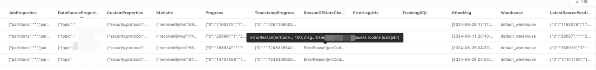
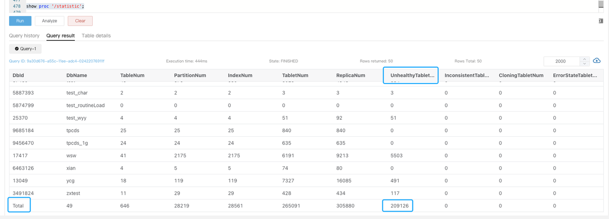
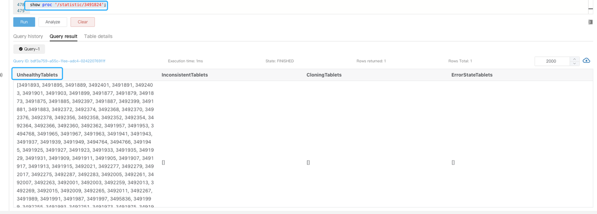
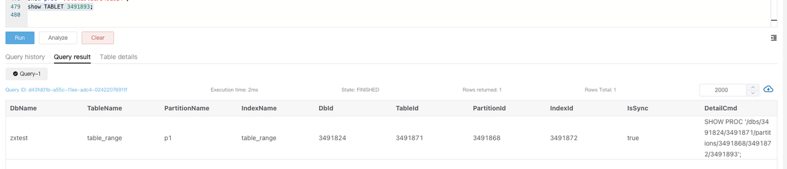
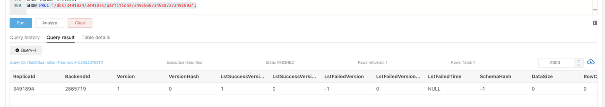

# アラートの管理

このトピックでは、ビジネス継続性、クラスタの可用性、マシンの負荷など、さまざまな次元からのアラート項目を紹介し、それに対応する解決策を提供します。

:::note

以下の例では、すべての変数は `$` で始まります。これらはビジネス環境に応じて置き換える必要があります。たとえば、`$job_name` は Prometheus の設定で対応するジョブ名に置き換え、`$fe_leader` は Leader FE の IP アドレスに置き換えてください。

:::

## サービス停止アラート

### FE サービス停止

**PromSQL**

```Plain
count(up{group="fe", job="$job_name"}) >= 3
```

**アラート説明**

アクティブな FE ノードの数が指定された値を下回るとアラートが発生します。この値は実際の FE ノードの数に基づいて調整できます。

**解決策**

停止した FE ノードを再起動してみてください。

### BE サービス停止

**PromSQL**

```Plain
node_info{type="be_node_num", job="$job_name",state="dead"} > 1
```

**アラート説明**

複数の BE ノードが停止するとアラートが発生します。

**解決策**

停止した BE ノードを再起動してみてください。

## マシン負荷アラート

### BE CPU アラート

**PromSQL**

```Plain
(1-(sum(rate(starrocks_be_cpu{mode="idle", job="$job_name",instance=~".*"}[5m])) by (job, instance)) / (sum(rate(starrocks_be_cpu{job="$job_name",host=~".*"}[5m])) by (job, instance))) * 100 > 90
```

**アラート説明**

BE CPU 使用率が 90% を超えるとアラートが発生します。

**解決策**

大規模なクエリや大規模なデータロードがあるかどうかを確認し、詳細をサポートチームに転送してさらなる調査を行います。

1. `top` コマンドを使用してプロセスによるリソース使用状況を確認します。

   ```Bash
   top -Hp $be_pid
   ```

2. `perf` コマンドを使用してパフォーマンスデータを収集し、分析します。

   ```Bash
   # コマンドを1〜2分間実行し、CTRL+Cを押して終了します。
   sudo perf top -p $be_pid -g >/tmp/perf.txt
   ```

:::note

緊急時には、スタックを保存した後、対応する BE ノードを再起動してサービスを迅速に復元することができます。ここでの緊急事態とは、BE ノードの CPU 使用率が異常に高いままであり、CPU 使用率を下げる効果的な手段がない状況を指します。

:::

### メモリアラート

**PromSQL**

```Plain
(1-node_memory_MemAvailable_bytes{instance=~".*"}/node_memory_MemTotal_bytes{instance=~".*"})*100 > 90
```

**アラート説明**

メモリ使用率が 90% を超えるとアラートが発生します。

**解決策**

トラブルシューティングのために [Get Heap Profile](https://github.com/StarRocks/starrocks/pull/35322) を参照してください。

:::note

- 緊急時には、対応する BE サービスを再起動してサービスを復元することができます。ここでの緊急事態とは、BE ノードのメモリ使用率が異常に高いままであり、メモリ使用率を下げる効果的な手段がない状況を指します。
- 他の混在デプロイされたサービスがシステムに影響を与えている場合、緊急時にはそれらのサービスを終了することを検討してください。

:::

### ディスクアラート

#### ディスク負荷アラート

**PromSQL**

```SQL
rate(node_disk_io_time_seconds_total{instance=~".*"}[1m]) * 100 > 90
```

**アラート説明**

ディスク負荷が 90% を超えるとアラートが発生します。

**解決策**

クラスタが `node_disk_io_time_seconds_total` アラートをトリガーした場合、まずビジネスの変更があるかどうかを確認します。変更がある場合は、以前のリソースバランスを維持するために変更をロールバックすることを検討してください。変更が特定されないか、ロールバックが不可能な場合は、通常のビジネス成長がリソース拡張の必要性を引き起こしているかどうかを検討してください。`iotop` ツールを使用してディスク I/O 使用状況を分析できます。`iotop` は `top` に似た UI を持ち、`pid`、`user`、I/O などの情報を含みます。

また、以下の SQL クエリを使用して、かなりの I/O を消費しているタブレットを特定し、特定のタスクやテーブルに追跡することができます。

```SQL
-- "all" はすべてのサービスを示します。10 は収集が10秒間続くことを示します。3 は上位3つの結果を取得することを示します。
ADMIN EXECUTE ON $backend_id 'System.print(ExecEnv.io_profile_and_get_topn_stats("all", 10, 3))';
```

#### ルートパス容量アラート

**PromSQL**

```SQL
node_filesystem_free_bytes{mountpoint="/"} /1024/1024/1024 < 5
```

**アラート説明**

ルートディレクトリの空き容量が 5GB 未満になるとアラートが発生します。

**解決策**

大きなスペースを占める可能性のある一般的なディレクトリには **/var**、**/opt**、**/tmp** があります。以下のコマンドを使用して大きなファイルを確認し、不要なファイルをクリアします。

```Bash
du -sh / --max-depth=1
```

#### データディスク容量アラート

**PromSQL**

```Bash
(SUM(starrocks_be_disks_total_capacity{job="$job"}) by (host, path) - SUM(starrocks_be_disks_avail_capacity{job="$job"}) by (host, path)) / SUM(starrocks_be_disks_total_capacity{job="$job"}) by (host, path) * 100 > 90
```

**アラート説明**

ディスク容量の使用率が 90% を超えるとアラートが発生します。

**解決策**

1. ロードされたデータ量に変更があるかどうかを確認します。

   Grafana で `load_bytes` メトリックを監視します。データロード量が大幅に増加している場合は、システムリソースを拡張する必要があるかもしれません。

2. DROP 操作があるかどうかを確認します。

   データロード量があまり変わっていない場合は、`SHOW BACKENDS` を実行します。報告されたディスク使用量が実際の使用量と一致しない場合は、最近の DROP DATABASE、TABLE、または PARTITION 操作のために FE Audit Log を確認します。

   これらの操作のメタデータは FE メモリに 1 日間保持され、24 時間以内に RECOVER ステートメントを使用してデータを復元することで誤操作を回避できます。復元後、実際のディスク使用量は `SHOW BACKENDS` に表示されるものを超える可能性があります。

   メモリ内の削除されたデータの保持期間は、FE 動的パラメータ `catalog_trash_expire_second` を使用して調整できます（デフォルト値: 86400）。

   ```Bash
   ADMIN SET FRONTEND CONFIG ("catalog_trash_expire_second"="86400");
   ```

   この変更を永続化するには、FE 設定ファイル **fe.conf** に設定項目を追加します。

   その後、削除されたデータは BE ノードの **trash** ディレクトリ（`$storage_root_path/trash`）に移動されます。デフォルトでは、削除されたデータは **trash** ディレクトリに 1 日間保持され、これにより実際のディスク使用量が `SHOW BACKENDS` に表示されるものを超える可能性があります。

   **trash** ディレクトリ内の削除されたデータの保持時間は、BE 動的パラメータ `trash_file_expire_time_sec` を使用して調整できます（デフォルト値: 86400）。

   ```Bash
   curl http://$be_ip:$be_http_port/api/update_config?trash_file_expire_time_sec=86400
   ```

#### FE メタデータディスク容量アラート

**PromSQL**

```Bash
node_filesystem_free_bytes{mountpoint="${meta_path}"} /1024/1024/1024 < 10
```

**アラート説明**

FE メタデータのディスク空き容量が 10GB 未満になるとアラートが発生します。

**解決策**

以下のコマンドを使用して、大量のスペースを占めるディレクトリを確認し、不要なファイルをクリアします。メタデータパスは **fe.conf** の `meta_dir` 設定で指定されています。

```Bash
du -sh /${meta_dir} --max-depth=1
```

メタデータディレクトリが多くのスペースを占めている場合、通常は **bdb** ディレクトリが大きく、CheckPoint の失敗が原因である可能性があります。[CheckPoint Failure Alert](#checkpoint-failure-alert) を参照してトラブルシューティングを行います。この方法で問題が解決しない場合は、技術サポートチームに連絡してください。

## クラスタサービス例外アラート

### Compaction 失敗アラート

#### Cumulative Compaction 失敗アラート

**PromSQL**

```Bash
increase(starrocks_be_engine_requests_total{job="$job_name" ,status="failed",type="cumulative_compaction"}[1m]) > 3
increase(starrocks_be_engine_requests_total{job="$job_name" ,status="failed",type="base_compaction"}[1m]) > 3
```

**アラート説明**

Cumulative Compaction または Base Compaction が過去 1 分間に 3 回失敗するとアラートが発生します。

**解決策**

対応する BE ノードのログを検索し、関与しているタブレットを特定するために以下のキーワードを探します。

```Bash
grep -E 'compaction' be.INFO | grep failed
```

次のようなログ記録は Compaction の失敗を示します。

```Plain
W0924 17:52:56:537041 123639 comaction_task_cpp:193] compaction task:8482. tablet:8423674 failed.
```

ログのコンテキストを確認して失敗の原因を分析できます。通常、失敗は Compaction プロセス中の DROP TABLE または PARTITION 操作によって引き起こされる可能性があります。システムには Compaction の内部リトライメカニズムがあり、手動でタブレットのステータスを BAD に設定し、Clone タスクをトリガーして修復することもできます。

:::note

以下の操作を行う前に、テーブルに少なくとも 3 つの完全なレプリカがあることを確認してください。

:::

```Bash
ADMIN SET REPLICA STATUS PROPERTIES("tablet_id" = "$tablet_id", "backend_id" = "$backend_id", "status" = "bad");
```

#### 高 Compaction 圧力アラート

**PromSQL**

```Bash
starrocks_fe_max_tablet_compaction_score{job="$job_name",instance="$fe_leader"} > 100
```

**アラート説明**

最高の Compaction スコアが 100 を超えるとアラートが発生し、高い Compaction 圧力を示します。

**解決策**

このアラートは通常、頻繁なロード、`INSERT INTO VALUES`、または `DELETE` 操作（1 秒あたり 1 回のレート）によって引き起こされます。ロードまたは DELETE タスクの間隔を 5 秒以上に設定し、高い同時実行の DELETE タスクを提出しないことをお勧めします。

#### バージョン数超過アラート

**PromSQL**

```Bash
starrocks_be_max_tablet_rowset_num{job="$job_name"} > 700
```

**アラート説明**

BE ノード上のタブレットが 700 を超えるデータバージョンを持つとアラートが発生します。

**解決策**

以下のコマンドを使用して、バージョンが過剰なタブレットを確認します。

```SQL
SELECT BE_ID,TABLET_ID FROM information_schema.be_tablets WHERE NUM_ROWSET>700;
```

タブレット ID `2889156` の例:

```SQL
SHOW TABLET 2889156;
```

`DetailCmd` フィールドに返されたコマンドを実行します。

```SQL
SHOW PROC '/dbs/2601148/2889154/partitions/2889153/2889155/2889156';
```


通常、示されているように、すべての 3 つのレプリカは `NORMAL` ステータスであるべきであり、`RowCount` や `DataSize` などの他のメトリックは一貫しているべきです。1 つのレプリカのみがバージョン制限の 700 を超える場合、以下のコマンドを使用して他のレプリカに基づいて Clone タスクをトリガーできます。

```SQL
ADMIN SET REPLICA STATUS PROPERTIES("tablet_id" = "$tablet_id", "backend_id" = "$backend_id", "status" = "bad");
```

2 つ以上のレプリカがバージョン制限を超える場合、一時的にバージョン数制限を増やすことができます。

```Bash
# バージョン制限を超えるタブレットを格納している BE ノードの IP を be_ip に置き換えます。
# デフォルトの be_http_port は 8040 です。
# tablet_max_versions のデフォルト値は 1000 です。
curl -XPOST http://$be_ip:$be_http_port/api/update_config?tablet_max_versions=2000
```

### CheckPoint 失敗アラート

**PromSQL**

```Bash
starrocks_fe_meta_log_count{job="$job_name",instance="$fe_master"} > 100000
```

**アラート説明**

FE ノードの BDB ログ数が 100,000 を超えるとアラートが発生します。デフォルトでは、BDB ログ数が 50,000 を超えるとシステムは CheckPoint を実行し、その後カウントを 0 にリセットします。

**解決策**

このアラートは CheckPoint が実行されなかったことを示しています。FE ログを調査して CheckPoint プロセスを分析し、問題を解決する必要があります。

Leader FE ノードの **fe.log** で、`begin to generate new image: image.xxxx` のような記録を検索します。見つかった場合、システムが新しいイメージの生成を開始したことを意味します。`checkpoint finished save image.xxxx` のような記録を確認して、イメージの作成が成功したことを確認します。`Exception when generate new image file` が見つかった場合、イメージの生成が失敗しました。特定のエラーに基づいてメタデータを慎重に処理する必要があります。さらなる分析のためにサポートチームに連絡することをお勧めします。

### 過剰な FE スレッド数アラート

**PromSQL**

```Bash
starrocks_fe_thread_pool{job="$job_name", type!="completed_task_count"} > 3000
```

**アラート説明**

FE のスレッド数が 3000 を超えるとアラートが発生します。

**解決策**

FE および BE ノードのデフォルトのスレッド数制限は 4096 です。大量の UNION ALL クエリが通常、過剰なスレッド数を引き起こします。UNION ALL クエリの同時実行数を減らし、システム変数 `pipeline_dop` を調整することをお勧めします。SQL クエリの粒度を調整できない場合は、`pipeline_dop` をグローバルに調整できます。

```SQL
SET GLOBAL pipeline_dop=8;
```

:::note

緊急時には、サービスを迅速に復元するために、FE 動的パラメータ `thrift_server_max_worker_threads` を増やすことができます（デフォルト値: 4096）。

```SQL
ADMIN SET FRONTEND CONFIG ("thrift_server_max_worker_threads"="8192");
```

:::

### 高 FE JVM 使用率アラート

**PromSQL**

```SQL
sum(jvm_heap_size_bytes{job="$job_name", type="used"}) * 100 / sum(jvm_heap_size_bytes{job="$job_name", type="max"}) > 90
```

**アラート説明**

FE ノードの JVM 使用率が 90% を超えるとアラートが発生します。

**解決策**

このアラートは JVM 使用率が高すぎることを示しています。`jmap` コマンドを使用して状況を分析できます。このメトリックの詳細な監視情報はまだ開発中であるため、直接的な洞察は限られています。以下の操作を実行し、結果をサポートチームに送信して分析を依頼します。

```Bash
# コマンドで `live` を指定すると FE が再起動する可能性があることに注意してください。
jmap -histo[:live] $fe_pid > jmap.dump
```

:::note

緊急時には、対応する FE ノードを再起動するか、JVM (Xmx) サイズを増やしてから FE サービスを再起動することで、サービスを迅速に復元できます。

:::

## サービス可用性アラート

### ロード例外アラート

#### ロード失敗アラート

**PromSQL**

```SQL
rate(starrocks_fe_txn_failed{job="$job_name",instance="$fe_master"}[5m]) * 100 > 5
```

**アラート説明**

失敗したロードトランザクションの数が合計の 5% を超えるとアラートが発生します。

**解決策**

Leader FE ノードのログを確認して、ロードエラーに関する情報を見つけます。キーワード `status: ABORTED` を検索して、失敗したロードタスクを特定します。

```Plain
2024-04-09 18:34:02.363+08:00 INFO (thrift-server-pool-8845163|12111749) [DatabaseTransactionMgr.abortTransaction():1279] transaction:[TransactionState. txn_id: 7398864, label: 967009-2f20a55e-368d-48cf-833a-762cf1fe07c5, db id: 10139, table id list: 155532, callback id: 967009, coordinator: FE: 192.168.2.1, transaction status: ABORTED, error replicas num: 0, replica ids: , prepare time: 1712658795053, commit time: -1, finish time: 1712658842360, total cost: 47307ms, reason: [E1008]Reached timeout=30000ms @192.168.1.1:8060 attachment: RLTaskTxnCommitAttachment [filteredRows=0, loadedRows=0, unselectedRows=0, receivedBytes=1033110486, taskExecutionTimeMs=0, taskId=TUniqueId(hi:3395895943098091727, lo:-8990743770681178171), jobId=967009, progress=KafkaProgress [partitionIdToOffset=2_1211970882|7_1211893755]]] successfully rollback
```

#### Routine Load 消費遅延アラート

**PromSQL**

```SQL
(sum by (job_name)(starrocks_fe_routine_load_max_lag_of_partition{job="$job_name",instance="$fe_mater"})) > 300000
starrocks_fe_routine_load_jobs{job="$job_name",host="$fe_mater",state="NEED_SCHEDULE"} > 3
starrocks_fe_routine_load_jobs{job="$job_name",host="$fe_mater",state="PAUSED"} > 0
starrocks_fe_routine_load_jobs{job="$job_name",host="$fe_mater",state="UNSTABLE"} > 0
```

**アラート説明**

- 30 万件以上のエントリが消費遅延している場合にアラートが発生します。
- 保留中の Routine Load タスクの数が 3 を超える場合にアラートが発生します。
- `PAUSED` 状態のタスクがある場合にアラートが発生します。
- `UNSTABLE` 状態のタスクがある場合にアラートが発生します。

**解決策**

1. まず、Routine Load タスクのステータスが `RUNNING` であるかを確認します。

   ```SQL
   SHOW ROUTINE LOAD FROM $db;
   ```

   返されたデータの `State` フィールドに注意を払います。

2. Routine Load タスクが `PAUSED` 状態にある場合、`ReasonOfStateChanged`、`ErrorLogUrls`、`TrackingSQL` フィールドを調べます。通常、`TrackingSQL` にある SQL クエリを実行することで、特定のエラーを明らかにすることができます。

   例:

   

3. Routine Load タスクのステータスが `RUNNING` の場合、タスクの同時実行数を増やすことを試みることができます。個々の Routine Load ジョブの同時実行数は、次の 4 つのパラメータの最小値によって決まります。

   - `kafka_partition_num`: Kafka トピックのパーティション数。
   - `desired_concurrent_number`: タスクに設定された同時実行数。
   - `alive_be_num`: 稼働中の BE ノードの数。
   - `max_routine_load_task_concurrent_num`: FE 設定パラメータで、デフォルト値は 5。

多くの場合、タスクの同時実行数や Kafka トピックのパーティション数を調整する必要があります（必要に応じて Kafka サポートに連絡してください）。

以下の例は、タスクの同時実行数を設定する方法を示しています。

```SQL
ALTER ROUTINE LOAD FOR ${routine_load_jobname}
PROPERTIES
(
    "desired_concurrent_number" = "5"
);
```

#### 単一データベースのロードトランザクション制限アラート

**PromSQL**

```SQL
sum(starrocks_fe_txn_running{job="$job_name"}) by(db) > 900
```

**アラート説明**

単一データベースのロードトランザクション数が 900 を超えるとアラートが発生します（v3.1 より前のバージョンでは 100）。

**解決策**

このアラートは通常、新たに追加された大量のロードタスクによってトリガーされます。単一データベースのロードトランザクションの制限を一時的に増やすことができます。

```SQL
ADMIN SET FRONTEND CONFIG ("max_running_txn_num_per_db" = "2000");
```

### クエリ例外アラート

#### クエリ遅延アラート

**PromSQL**

```SQL
starrocks_fe_query_latency_ms{job="$job_name", quantile="0.95"} > 5000
```

**アラート説明**

P95 クエリ遅延が 5 秒を超えるとアラートが発生します。

**解決策**

1. 大規模なクエリがあるかどうかを調査します。

   大規模なクエリが例外時に大量のマシンリソースを消費し、他のクエリがタイムアウトまたは失敗する原因となっているかどうかを確認します。

   - `show proc '/current_queries';` を実行して、大規模なクエリの `QueryId` を表示します。サービスを迅速に復元する必要がある場合は、`KILL` コマンドを使用して長時間実行されているクエリを終了できます。

      ```SQL
      mysql> SHOW PROC '/current_queries';
      +--------------------------------------+--------------+------------+------+-----------+----------------+----------------+------------------+----------+
      | QueryId                              | ConnectionId | Database   | User | ScanBytes | ProcessRows    | CPUCostSeconds | MemoryUsageBytes | ExecTime |
      +--------------------------------------+--------------+------------+------+-----------+----------------+----------------+------------------+----------+
      | 7c56495f-ae8b-11ed-8ebf-00163e00accc | 4            | tpcds_100g | root | 37.88 MB  | 1075769 Rows   | 11.13 Seconds  | 146.70 MB        | 3804     |
      | 7d543160-ae8b-11ed-8ebf-00163e00accc | 6            | tpcds_100g | root | 13.02 GB  | 487873176 Rows | 81.23 Seconds  | 6.37 GB          | 2090     |
      +--------------------------------------+--------------+------------+------+-----------+----------------+----------------+------------------+----------+
      2 rows in set (0.01 sec)
      ```

   - 高い CPU 使用率の BE ノードを再起動して問題を解決することもできます。

2. マシンリソースが十分であるかどうかを確認します。

   例外時に CPU、メモリ、ディスク I/O、ネットワークトラフィックが正常であるかどうかを確認します。異常が検出された場合、ピークトラフィックの変動やクラスタリソースの使用状況を調査して根本原因を特定します。問題が解決しない場合は、影響を受けたノードを再起動することを検討してください。

:::note

緊急時には、以下の方法で問題を解決できます。

- 突然のトラフィックスパイクがリソースの過剰使用とクエリの失敗を引き起こした場合、ビジネストラフィックを減らし、影響を受けた BE ノードを再起動します。
- 通常の操作による高いリソース使用率の場合、ノードの容量を拡張します。

:::

#### クエリ失敗アラート

**PromSQL**

```Plain
sum by (job,instance)(starrocks_fe_query_err_rate{job="$job_name"}) * 100 > 10

# この PromSQL は v3.1.15、v3.2.11、および v3.3.3 以降でサポートされています。
increase(starrocks_fe_query_internal_err{job="$job_name"})[1m] >10
```

**アラート説明**

クエリ失敗率が 0.1/秒を超えるか、1 分間に 10 件の失敗したクエリが発生するとアラートが発生します。

**解決策**

このアラートがトリガーされた場合、ログを確認して失敗したクエリを特定します。

```Bash
grep 'State=ERR' fe.audit.log
```

AuditLoader プラグインがインストールされている場合、以下のクエリを使用して対応するクエリを特定できます。

```Bash
SELECT stmt FROM starrocks_audit_db__.starrocks_audit_tbl__ WHERE state='ERR';
```

構文エラーやタイムアウトによる失敗したクエリも `starrocks_fe_query_err_rate` に記録されます。

カーネルの問題によるクエリ失敗の場合、`fe.log` でエラーを検索し、完全なスタックトレースと [Query Dump](../../../faq/Dump_query.md) を取得し、サポートチームにトラブルシューティングを依頼します。

#### クエリ過負荷アラート

**PromSQL**

```Bash
abs((sum by (exported_job)(rate(starrocks_fe_query_total{process="FE",job="$job_name"}[3m]))-sum by (exported_job)(rate(starrocks_fe_query_total{process="FE",job="$job_name"}[3m] offset 1m)))/sum by (exported_job)(rate(starrocks_fe_query_total{process="FE",job="$job_name"}[3m]))) * 100 > 100
abs((sum(starrocks_fe_connection_total{job="$job_name"})-sum(starrocks_fe_connection_total{job="$job_name"} offset 3m))/sum(starrocks_fe_connection_total{job="$job_name"})) * 100 > 100
```

**アラート説明**

QPS または接続数が直近 1 分間で 100% 増加するとアラートが発生します。

**解決策**

`fe.audit.log` の高頻度クエリが予期されたものであるかを確認します。ビジネスの行動に正当な変更がある場合（たとえば、新しいサービスの稼働やデータ量の増加）、マシン負荷を監視し、必要に応じて BE ノードをスケールします。

#### ユーザー接続制限超過アラート

**PromSQL**

```Bash
sum(starrocks_fe_connection_total{job="$job_name"}) by(user) > 90
```

**アラート説明**

ユーザー接続数が 90 を超えるとアラートが発生します。（ユーザー接続制限は v3.1.16、v3.2.12、および v3.3.4 以降でサポートされています。）

**解決策**

SQL コマンド `SHOW PROCESSLIST` を使用して、現在の接続数が予期されたものであるかを確認します。`KILL` コマンドを使用して予期しない接続を終了できます。さらに、フロントエンドサービスが接続を長時間開いたままにしないようにし、システム変数 `wait_timeout`（単位: 秒）を調整して、アイドル接続の自動終了を加速することを検討してください。

```Bash
SET wait_timeout = 3600;
```

:::note

緊急時には、ユーザー接続制限を一時的に増やしてサービスを復元できます。

- v3.1.16、v3.2.12、および v3.3.4 以降の場合:

  ```Bash
  ALTER USER 'jack' SET PROPERTIES ("max_user_connections" = "1000");
  ```

- v2.5 以前の場合:

  ```Bash
  SET PROPERTY FOR 'jack' 'max_user_connections' = '1000';
  ```

:::

### Schema Change 例外アラート

**PromSQL**

```Bash
increase(starrocks_be_engine_requests_total{job="$job_name",type="schema_change", status="failed"}[1m]) > 1
```

**アラート説明**

過去 1 分間に 1 つ以上の Schema Change タスクが失敗するとアラートが発生します。

**解決策**

以下のステートメントを実行して、`Msg` フィールドにエラーメッセージが含まれているかどうかを確認します。

```Bash
SHOW ALTER COLUMN FROM $db;
```

メッセージが見つからない場合、Leader FE ログで前のステップの JobId を検索してコンテキストを取得します。

- Schema Change のメモリ不足

  Schema Change がメモリ不足で失敗した場合、**be.WARNING** ログで `failed to process the version`、`failed to process the schema change from tablet`、または `Memory of schema change task exceeded limit` を検索して、以下のようなログ記録を特定します。

  ```Bash
  fail to execute schema change: Memory of schema change task exceed limit. DirectSchemaChange Used: 2149621304, Limit: 2147483648. You can change the limit by modify BE config [memory_limitation_per_thread_for_schema_change]
  ```

  メモリ制限エラーは通常、単一の Schema Change の 2GB メモリ制限を超えることによって引き起こされ、BE 動的パラメータ `memory_limitation_per_thread_for_schema_change` によって制御されます。このパラメータを変更して問題を解決できます。

  ```Bash
  curl -XPOST http://be_host:http_port/api/update_config?memory_limitation_per_thread_for_schema_change=8
  ```

- Schema Change のタイムアウト

  列の追加を除いて、ほとんどの Schema Change は大量の新しいタブレットの作成、元のデータの書き換え、および SWAP を介した操作の実装を含みます。

  ```Plain
  Create replicas failed. Error: Error replicas:21539953=99583471, 21539953=99583467, 21539953=99599851
  ```

  以下の方法で対処できます。

  - タブレット作成のタイムアウトを増やす（デフォルト: 10 秒）。

    ```Bash
    ADMIN SET FRONTEND CONFIG ("tablet_create_timeout_second"="60");
    ```

  - タブレット作成のスレッド数を増やす（デフォルト: 3）。

    ```Bash
    curl -XPOST http://be_host:http_port/api/update_config?alter_tablet_worker_count=6
    ```

- 非正常なタブレット状態

1. タブレットが非正常な状態にある場合、**be.WARNING** ログで `tablet is not normal` を検索し、`SHOW PROC '/statistic'` を実行してクラスタレベルの `UnhealthyTabletNum` を確認します。

     

  2. 指定されたデータベース内の不健康なタブレット数を確認するために、`SHOW PROC '/statistic/$DbId'` を実行します。

     

  3. 対応するタブレットのテーブル情報を表示するために、`SHOW TABLET $tablet_id` を実行します。

     

  4. 不健康なタブレットの原因を特定するために、`DetailCmd` フィールドに返されたコマンドを実行します。

     

  通常、不健康および不一致のレプリカは、高頻度のロードによって引き起こされ、異なるレプリカへの書き込みの進行が同期されていないことが原因です。テーブルに大量のリアルタイム書き込みがあるかどうかを確認し、ロードの頻度を減らすか、サービスを一時的に停止してタスクを再試行することで異常なレプリカの数を減らすことができます。

:::note

緊急時には、サービスを復元するために、非正常なレプリカを Bad として設定し、Clone タスクをトリガーすることができます。

```Bash
ADMIN SET REPLICA STATUS PROPERTIES("tablet_id" = "$tablet_id", "backend_id" = "$backend_id", "status" = "bad");
```

この操作を行う前に、テーブルに少なくとも 3 つの完全なレプリカがあり、非正常なレプリカが 1 つだけであることを確認してください。

:::

### マテリアライズドビューのリフレッシュ例外アラート

**PromSQL**

```Bash
increase(starrocks_fe_mv_refresh_total_failed_jobs[5m]) > 0
```

**アラート説明**

過去 5 分間に 1 つ以上のマテリアライズドビューのリフレッシュが失敗するとアラートが発生します。

**解決策**

1. リフレッシュに失敗したマテリアライズドビューを確認します。

   ```SQL
   SELECT TABLE_NAME,IS_ACTIVE,INACTIVE_REASON,TASK_NAME FROM information_schema.materialized_views WHERE LAST_REFRESH_STATE !=" SUCCESS";
   ```

2. マテリアライズドビューを手動でリフレッシュしてみてください。

   ```SQL
   REFRESH MATERIALIZED VIEW $mv_name;
   ```

3. マテリアライズドビューが `INACTIVE` 状態の場合、手動でアクティブ化してみてください。

   ```SQL
   ALTER MATERIALIZED VIEW $mv_name ACTIVE;
   ```

4. リフレッシュ失敗の原因を調査します。

   ```SQL
   SELECT * FROM information_schema.task_runs WHERE task_name ='mv-112517' \G
   ```