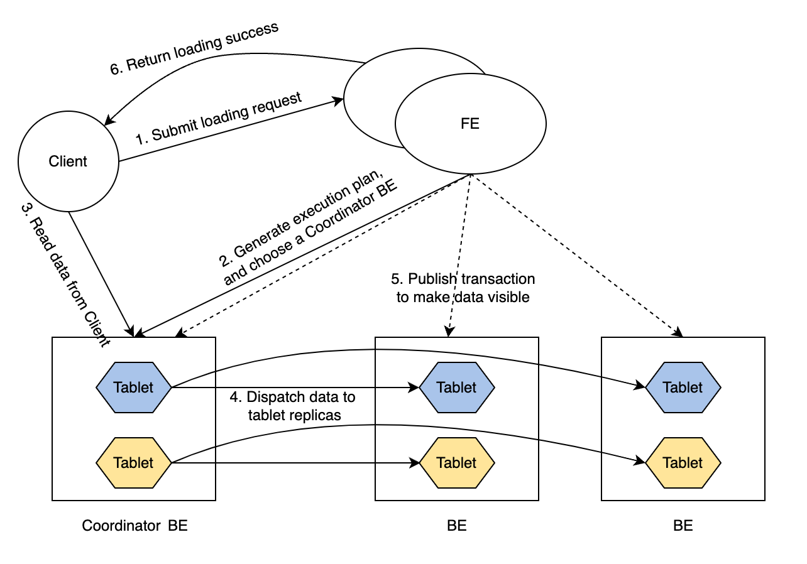
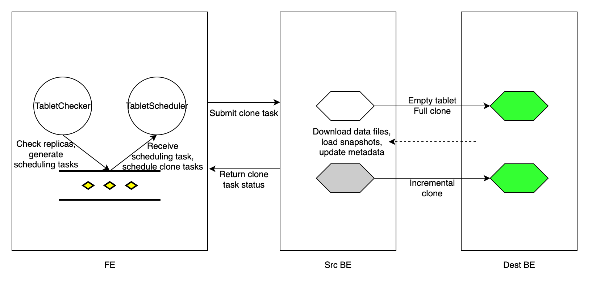

# レプリカの管理

このトピックでは、StarRocks クラスター内でデータレプリカを管理する方法について説明します。

## 概要

StarRocks はデータの高可用性を保証するために、マルチレプリカ戦略を採用しています。テーブルを作成する際には、テーブルプロパティ `replication_num` を使用してテーブルのレプリカ数を指定する必要があります（デフォルト値: `3`）。ロードトランザクションが開始されると、データは指定された数のレプリカに同時にロードされます。データが大多数のレプリカに保存された後にのみ、トランザクションは成功として返されます。詳細については、[Write quorum](#write-quorum) を参照してください。それでも、StarRocks では、より良いロードパフォーマンスを達成するために、テーブルに対して低い書き込みクォーラムを指定することができます。

StarRocks は複数のレプリカを異なる BE ノードに分散して保存します。例えば、テーブルに 3 つのレプリカを保存したい場合、StarRocks クラスターに少なくとも 3 つの BE ノードをデプロイする必要があります。レプリカのいずれかが故障した場合、StarRocks は他の BE ノードから健全なレプリカを部分的または完全にクローンして、故障したレプリカを修復します。マルチバージョン同時実行制御 (MVCC) 技術を使用することで、StarRocks はこれらのマルチバージョンデータの物理コピーを複製することにより、レプリカの修復を加速します。

### マルチレプリカテーブルへのデータロード



ロードトランザクションのルーチンは次のとおりです。

1. クライアントが FE にロードリクエストを送信します。

2. FE はこのロードトランザクションのコーディネータ BE ノードを選択し、トランザクションの実行計画を生成します。

3. コーディネータ BE ノードがクライアントからロードするデータを読み込みます。

4. コーディネータ BE ノードがデータをすべての tablet のレプリカに配信します。

   > **注意**
   >
   > tablet はテーブルの論理的なスライスです。テーブルには複数の tablet があり、各 tablet は `replication_num` のレプリカを持ちます。テーブル内の tablet の数は、テーブルの `bucket_size` プロパティによって決まります。

5. データがすべての tablet にロードされ保存された後、FE はロードされたデータを可視化します。

6. FE はクライアントにロード成功を返します。

このようなルーチンは、極端なシナリオでもサービスの可用性を保証します。

### Write quorum

マルチレプリカテーブルへのデータロードは非常に時間がかかることがあります。ロードパフォーマンスを向上させたい場合、または比較的低いデータ可用性を許容できる場合は、テーブルに対して低い書き込みクォーラムを設定できます。書き込みクォーラムとは、書き込み操作が成功と見なされる前に確認が必要なレプリカの最小数を指します。書き込みクォーラムは、[CREATE TABLE](../../../sql-reference/sql-statements/table_bucket_part_index/CREATE_TABLE.md) 時にプロパティ `write_quorum` を追加するか、[ALTER TABLE](../../../sql-reference/sql-statements/table_bucket_part_index/ALTER_TABLE.md) を使用して既存のテーブルにこのプロパティを追加することで指定できます。このプロパティは v2.5 からサポートされています。

`write_quorum` は次の値をサポートしています：

- `MAJORITY`: デフォルト値。データレプリカの大多数がロード成功を返すと、StarRocks はロードタスク成功を返します。それ以外の場合、StarRocks はロードタスク失敗を返します。
- `ONE`: データレプリカのいずれかがロード成功を返すと、StarRocks はロードタスク成功を返します。それ以外の場合、StarRocks はロードタスク失敗を返します。
- `ALL`: すべてのデータレプリカがロード成功を返すと、StarRocks はロードタスク成功を返します。それ以外の場合、StarRocks はロードタスク失敗を返します。

## 自動レプリカ修復

レプリカは、特定の BE ノードがクラッシュしたり、いくつかのロードタスクが失敗したりすることで故障することがあります。StarRocks はこれらの故障したレプリカを自動的に修復します。

`tablet_sched_checker_interval_seconds` ごとに、デフォルトで 20 秒、FE の Tablet Checker は StarRocks クラスター内のすべてのテーブルのすべての tablet レプリカをスキャンし、現在可視のデータのバージョン番号と BE ノードの健康状態をチェックしてレプリカが健全かどうかを判断します。レプリカの可視バージョンが他のレプリカよりも遅れている場合、StarRocks はインクリメンタルクローンを実行して故障したレプリカを修復します。BE ノードがハートビートを受信できない場合やクラスターから削除された場合、またはレプリカがインクリメンタルクローンで修復できないほど遅れている場合、StarRocks はフルクローンを実行して失われたレプリカを修復します。

修復が必要な tablet レプリカを検出した後、FE は tablet スケジューリングタスクを生成し、タスクをスケジューリングタスクキューに追加します。FE の Tablet Scheduler はキューからスケジューリングタスクを受け取り、必要なクローンタイプに応じて各故障したレプリカのクローンタスクを作成し、タスクを実行する BE ノードに割り当てます。

クローンタスクは、本質的にソース BE ノード（健全なレプリカを持つ）からデータをコピーし、デスティネーション BE ノード（故障したレプリカを持つ）にデータをロードすることです。データバージョンが遅れているレプリカの場合、FE は故障したレプリカを保存している BE 実行ノードにインクリメンタルクローンタスクを割り当て、どのピア BE ノードから健全なレプリカを見つけて新しいデータをクローンできるかを実行ノードに通知します。レプリカが失われた場合、FE は生存している BE ノードを実行ノードとして選択し、BE ノードに空のレプリカを作成し、フルクローンタスクを BE ノードに割り当てます。

クローンタスクのタイプに関係なく、実行 BE ノードは健全なレプリカから物理データファイルを複製し、その後メタデータを適切に更新します。クローンタスクが完了すると、実行 BE ノードは FE の Tablet Scheduler にタスク成功を報告します。冗長な tablet レプリカを削除した後、FE はメタデータを更新し、レプリカ修復の完了をマークします。



tablet 修復中でも、StarRocks はクエリを実行できます。`write_quorum` を満たす健全なレプリカの数があれば、StarRocks はテーブルにデータをロードできます。

## レプリカの手動修復

手動レプリカ修復は次の 2 つのステップで構成されます：

1. レプリカのステータスを確認します。
2. レプリカの優先度レベルを設定します。

### レプリカのステータスを確認する

tablet のレプリカステータスを確認して、健全でない（故障した）tablet を特定します。

1. **クラスター内のすべての tablet のステータスを確認します。**

   ```SQL
   SHOW PROC '/statistic';
   ```

   例：

   ```Plain
   mysql> SHOW PROC '/statistic';
   +----------+-----------------------------+----------+--------------+----------+-----------+------------+--------------------+-----------------------+
   | DbId     | DbName                      | TableNum | PartitionNum | IndexNum | TabletNum | ReplicaNum | UnhealthyTabletNum | InconsistentTabletNum |
   +----------+-----------------------------+----------+--------------+----------+-----------+------------+--------------------+-----------------------+
   | 35153636 | default_cluster:DF_Newrisk  | 3        | 3            | 3        | 96        | 288        | 0                  | 0                     |
   | 48297972 | default_cluster:PaperData   | 0        | 0            | 0        | 0         | 0          | 0                  | 0                     |
   | 5909381  | default_cluster:UM_TEST     | 7        | 7            | 10       | 320       | 960        | 1                  | 0                     |
   | Total    | 240                         | 10       | 10           | 13       | 416       | 1248       | 1                  | 0                     |
   +----------+-----------------------------+----------+--------------+----------+-----------+------------+--------------------+-----------------------+
   ```

   - `UnhealthyTabletNum`: 対応するデータベース内の健全でない tablet の数を示します。
   - `InconsistentTabletNum`: レプリカが不一致の tablet の数を示します。

   特定のデータベースで `UnhealthyTabletNum` または `InconsistentTabletNum` の値が `0` でない場合、そのデータベースの `DbId` を使用して健全でない tablet を確認できます。

   ```SQL
   SHOW PROC '/statistic/<DbId>'
   ```

   例：

   ```Plain
   mysql> SHOW PROC '/statistic/5909381';
   +------------------+---------------------+
   | UnhealthyTablets | InconsistentTablets |
   +------------------+---------------------+
   | [40467980]       | []                  |
   +------------------+---------------------+
   ```

   健全でない tablet の ID はフィールド `UnhealthyTablets` に返されます。

2. **特定のテーブルまたはパーティション内の tablet ステータスを確認します。**

   WHERE 句を使用して、特定の `STATUS` を持つ tablet をフィルタリングできます。

   ```SQL
   ADMIN SHOW REPLICA STATUS FROM <table_name> 
   [PARTITION (<partition_name_1>[, <partition_name_2>, ...])]
   [WHERE STATUS = {'OK'|'DEAD'|'VERSION_ERROR'|'SCHEMA_ERROR'|'MISSING'}]
   ```

   例：

   ```Plain
   mysql> ADMIN SHOW REPLICA STATUS FROM tbl PARTITION (p1, p2) WHERE STATUS = "OK";
   +----------+-----------+-----------+---------+-------------------+--------------------+------------------+------------+------------+-------+--------+--------+
   | TabletId | ReplicaId | BackendId | Version | LastFailedVersion | LastSuccessVersion | CommittedVersion | SchemaHash | VersionNum | IsBad | State  | Status |
   +----------+-----------+-----------+---------+-------------------+--------------------+------------------+------------+------------+-------+--------+--------+
   | 29502429 | 29502432  | 10006     | 2       | -1                | 2                  | 1                | -1         | 2          | false | NORMAL | OK     |
   | 29502429 | 36885996  | 10002     | 2       | -1                | -1                 | 1                | -1         | 2          | false | NORMAL | OK     |
   | 29502429 | 48100551  | 10007     | 2       | -1                | -1                 | 1                | -1         | 2          | false | NORMAL | OK     |
   | 29502433 | 29502434  | 10001     | 2       | -1                | 2                  | 1                | -1         | 2          | false | NORMAL | OK     |
   | 29502433 | 44900737  | 10004     | 2       | -1                | -1                 | 1                | -1         | 2          | false | NORMAL | OK     |
   | 29502433 | 48369135  | 10006     | 2       | -1                | -1                 | 1                | -1         | 2          | false | NORMAL | OK     |
   +----------+-----------+-----------+---------+-------------------+--------------------+------------------+------------+------------+-------+--------+--------+
   ```

   フィールド `IsBad` が `true` の場合、この tablet は破損しています。

   フィールド `Status` に提供される詳細情報については、[ADMIN SHOW REPLICA STATUS](../../../sql-reference/sql-statements/cluster-management/tablet_replica/ADMIN_SHOW_REPLICA_STATUS.md) を参照してください。

   [SHOW TABLET](../../../sql-reference/sql-statements/table_bucket_part_index/SHOW_TABLET.md) を使用して、テーブル内の tablet の詳細をさらに調べることができます。

   ```SQL
   SHOW TABLET FROM <table_name>
   ```

   例：

   ```Plain
   mysql> SHOW TABLET FROM tbl1;
   +----------+-----------+-----------+------------+---------+-------------+-------------------+-----------------------+------------------+----------------------+---------------+----------+----------+--------+-------------------------+--------------+----------------------+--------------+----------------------+----------------------+----------------------+
   | TabletId | ReplicaId | BackendId | SchemaHash | Version | VersionHash | LstSuccessVersion | LstSuccessVersionHash | LstFailedVersion | LstFailedVersionHash | LstFailedTime | DataSize | RowCount | State  | LstConsistencyCheckTime | CheckVersion |     CheckVersionHash | VersionCount | PathHash             | MetaUrl              | CompactionStatus     |
   +----------+-----------+-----------+------------+---------+-------------+-------------------+-----------------------+------------------+----------------------+---------------+----------+----------+--------+-------------------------+--------------+----------------------+--------------+----------------------+----------------------+----------------------+
   | 29502429 | 29502432  | 10006     | 1421156361 | 2       | 0           | 2                 | 0                     | -1               | 0                    | N/A           | 784      | 0        | NORMAL | N/A                     | -1           |     -1               | 2            | -5822326203532286804 | url                  | url                  |
   | 29502429 | 36885996  | 10002     | 1421156361 | 2       | 0           | -1                | 0                     | -1               | 0                    | N/A           | 784      | 0        | NORMAL | N/A                     | -1           |     -1               | 2            | -1441285706148429853 | url                  | url                  |
   | 29502429 | 48100551  | 10007     | 1421156361 | 2       | 0           | -1                | 0                     | -1               | 0                    | N/A           | 784      | 0        | NORMAL | N/A                     | -1           |     -1               | 2            | -4784691547051455525 | url                  | url                  |
   +----------+-----------+-----------+------------+---------+-------------+-------------------+-----------------------+------------------+----------------------+---------------+----------+----------+--------+-------------------------+--------------+----------------------+--------------+----------------------+----------------------+----------------------+
   ```

   返された結果は、tablet のサイズ、行数、バージョン、URL を示します。

   SHOW TABLET によって返されるフィールド `State` は、tablet のタスク状態を示し、`CLONE`、`SCHEMA_CHANGE`、`ROLLUP` を含みます。

   [ADMIN SHOW REPLICA DISTRIBUTION](../../../sql-reference/sql-statements/cluster-management/tablet_replica/ADMIN_SHOW_REPLICA_DISTRIBUTION.md) を使用して、特定のテーブルまたはパーティションのレプリカ分布を確認し、これらのレプリカが均等に分布しているかどうかを確認できます。

   ```SQL
   ADMIN SHOW REPLICA DISTRIBUTION FROM <table_name>
   ```

   例：

```Plain
   mysql> ADMIN SHOW REPLICA DISTRIBUTION FROM tbl1;
   +-----------+------------+-------+---------+
   | BackendId | ReplicaNum | Graph | Percent |
   +-----------+------------+-------+---------+
   | 10000     | 7          |       | 7.29 %  |
   | 10001     | 9          |       | 9.38 %  |
   | 10002     | 7          |       | 7.29 %  |
   | 10003     | 7          |       | 7.29 %  |
   | 10004     | 9          |       | 9.38 %  |
   | 10005     | 11         | >     | 11.46 % |
   | 10006     | 18         | >     | 18.75 % |
   | 10007     | 15         | >     | 15.62 % |
   | 10008     | 13         | >     | 13.54 % |
   +-----------+------------+-------+---------+
   ```

   返された結果は、各 BE ノード上の tablet レプリカの数とそれに対応する割合を示します。

3. **特定の tablet のレプリカステータスを確認します。**

   前の手順で取得した健全でない tablet の `TabletId` を使用して、それらのレプリカステータスを調べることができます。

   ```SQL
   SHOW TABLET <TabletId>
   ```

   例：

   ```Plain
   mysql> SHOW TABLET 29502553;
   +------------------------+-----------+---------------+-----------+----------+----------+-------------+----------+--------+---------------------------------------------------------------------------+
   | DbName                 | TableName | PartitionName | IndexName | DbId     | TableId  | PartitionId | IndexId  | IsSync | DetailCmd                                                                 |
   +------------------------+-----------+---------------+-----------+----------+----------+-------------+----------+--------+---------------------------------------------------------------------------+
   | default_cluster:test   | test      | test          | test      | 29502391 | 29502428 | 29502427    | 29502428 | true   | SHOW PROC '/dbs/29502391/29502428/partitions/29502427/29502428/29502553'; |
   +------------------------+-----------+---------------+-----------+----------+----------+-------------+----------+--------+---------------------------------------------------------------------------+
   ```

   返された結果は、tablet のデータベース、テーブル、パーティション、およびインデックス（Rollup）に関する詳細情報を示します。

   フィールド `DetailCmd` にある SQL 文をコピーして、tablet のレプリカステータスをさらに調べることができます。

   例：

   ```Plain
   mysql> SHOW PROC '/dbs/29502391/29502428/partitions/29502427/29502428/29502553';
   +-----------+-----------+---------+-------------+-------------------+-----------------------+------------------+----------------------+---------------+------------+----------+----------+--------+-------+--------------+----------------------+----------+------------------+
   | ReplicaId | BackendId | Version | VersionHash | LstSuccessVersion | LstSuccessVersionHash | LstFailedVersion | LstFailedVersionHash | LstFailedTime | SchemaHash | DataSize | RowCount | State  | IsBad | VersionCount | PathHash             | MetaUrl  | CompactionStatus |
   +-----------+-----------+---------+-------------+-------------------+-----------------------+------------------+----------------------+---------------+------------+----------+----------+--------+-------+--------------+----------------------+----------+------------------+
   | 43734060  | 10004     | 2       | 0           | -1                | 0                     | -1               | 0                    | N/A           | -1         | 784      | 0        | NORMAL | false | 2            | -8566523878520798656 | url      | url              |
   | 29502555  | 10002     | 2       | 0           | 2                 | 0                     | -1               | 0                    | N/A           | -1         | 784      | 0        | NORMAL | false | 2            | 1885826196444191611  | url      | url              |
   | 39279319  | 10007     | 2       | 0           | -1                | 0                     | -1               | 0                    | N/A           | -1         | 784      | 0        | NORMAL | false | 2            | 1656508631294397870  | url      | url              |
   +-----------+-----------+---------+-------------+-------------------+-----------------------+------------------+----------------------+---------------+------------+----------+----------+--------+-------+--------------+----------------------+----------+------------------+
   ```

   返された結果は、tablet のすべてのレプリカを示します。

### レプリカの優先度レベルを設定する

Tablet Scheduler は、異なるタイプのクローンタスクに異なる優先度レベルを自動的に割り当てます。

特定のテーブルまたは特定のパーティションからの tablet を最優先で修復したい場合、[ADMIN REPAIR TABLE](../../../sql-reference/sql-statements/cluster-management/tablet_replica/ADMIN_REPAIR.md) を使用して手動で `VERY_HIGH` 優先度レベルを割り当てることができます。

```SQL
ADMIN REPAIR TABLE <table_name>
[PARTITION (<partition_name_1>[, <partition_name_2>, ...])]
```

> **注意**
>
> - この SQL 文を実行することは、修復されるべき tablet の優先度レベルを変更するヒントを送信するだけです。これらの tablet が正常に修復されることを保証するものではありません。
> - この SQL 文を実行した後でも、Tablet Scheduler はこれらの tablet に異なる優先度レベルを割り当てることがあります。
> - Leader FE ノードが変更されたり再起動されたりすると、この SQL 文が送信したヒントは期限切れになります。

この操作をキャンセルするには、[ADMIN CANCEL REPAIR TABLE](../../../sql-reference/sql-statements/cluster-management/tablet_replica/ADMIN_CANCEL_REPAIR.md) を使用できます。

```SQL
ADMIN CANCEL REPAIR TABLE <table_name>
[PARTITION (<partition_name_1>[, <partition_name_2>, ...])]
```

## レプリカのバランシング

StarRocks は BE ノード間で tablet を自動的にバランスします。

高負荷ノードから低負荷ノードに tablet を移動するために、StarRocks はまず低負荷ノードに tablet のレプリカを作成し、その後高負荷ノード上の対応するレプリカを削除します。クラスター内で異なるタイプの記憶媒体が使用されている場合、StarRocks はすべての BE ノードを記憶媒体タイプに応じて分類します。可能な限り、StarRocks は同じ記憶媒体タイプの BE ノード間で tablet を移動します。同じ tablet のレプリカは異なる BE ノードに保存されます。

### BE の負荷

StarRocks は `ClusterLoadStatistics` (CLS) を使用してクラスター内の各 BE ノードの負荷統計を表示します。Tablet Scheduler は `ClusterLoadStatistics` に基づいてレプリカのバランシングをトリガーします。StarRocks は各 BE ノードの **ディスク使用率** と **レプリカ数** を評価し、それに応じて `loadScore` を計算します。BE ノードの `loadScore` が高いほど、そのノードの負荷が高いことを示します。Tablet Scheduler は `ClusterLoadStatistics` を毎分更新します。

`capacityCoefficient` と `replicaNumCoefficient` は、ディスク使用率とレプリカ数の重み付け係数です。`capacityCoefficient` と `replicaNumCoefficient` の合計は 1 です。`capacityCoefficient` は実際のディスク使用量に応じて動的に調整されます。BE ノードの全体的なディスク使用率が 50% 未満の場合、`capacityCoefficient` の値は 0.5 です。ディスク使用率が 75% を超える場合、その値は 1 です。この制限は FE 設定項目 `capacity_used_percent_high_water` を介して設定できます。使用率が 50% から 75% の間の場合、`capacityCoefficient` は次の式に基づいてスムーズに増加します：

```SQL
capacityCoefficient= 2 * Disk utilization - 0.5
```

`capacityCoefficient` は、ディスク使用量が非常に高い場合に、この BE ノードの `loadScore` を高くし、システムがこの BE ノードの負荷を最優先で減らすようにします。

### バランシングポリシー

Tablet Scheduler が tablet をスケジュールするたびに、Load Balancer を通じてバランスされる候補の tablet として一定数の健全な tablet を選択します。次回 tablet をスケジュールする際、Tablet Scheduler はこれらの健全な tablet をバランスします。

### tablet スケジューリングタスクを確認する

保留中、実行中、および完了した tablet スケジューリングタスクを確認できます。

- **保留中の tablet スケジューリングタスクを確認する**

  ```SQL
  SHOW PROC '/cluster_balance/pending_tablets';
  ```

  例：

   ```Plain
   +----------+--------+-----------------+---------+----------+----------+-------+---------+--------+----------+---------+---------------------+---------------------+---------------------+----------+------+-------------+---------------+---------------------+------------+---------------------+--------+---------------------+-------------------------------+
   | TabletId | Type   | Status          | State   | OrigPrio | DynmPrio | SrcBe | SrcPath | DestBe | DestPath | Timeout | Create              | LstSched            | LstVisit            | Finished | Rate | FailedSched | FailedRunning | LstAdjPrio          | VisibleVer | VisibleVerHash      | CmtVer | CmtVerHash          | ErrMsg                        |
   +----------+--------+-----------------+---------+----------+----------+-------+---------+--------+----------+---------+---------------------+---------------------+---------------------+----------+------+-------------+---------------+---------------------+------------+---------------------+--------+---------------------+-------------------------------+
   | 4203036  | REPAIR | REPLICA_MISSING | PENDING | HIGH     | LOW      | -1    | -1      | -1     | -1       | 0       | 2019-02-21 15:00:20 | 2019-02-24 11:18:41 | 2019-02-24 11:18:41 | N/A      | N/A  | 2           | 0             | 2019-02-21 15:00:43 | 1          | 0                   | 2      | 0                   | unable to find source replica |
   +----------+--------+-----------------+---------+----------+----------+-------+---------+--------+----------+---------+---------------------+---------------------+---------------------+----------+------+-------------+---------------+---------------------+------------+---------------------+--------+---------------------+-------------------------------+
   ```

  - `TabletId`: スケジュールされる予定の tablet の ID。スケジュールされたタスクは 1 つの tablet のみを対象とします。
  - `Type`: タスクのタイプ。有効な値：REPAIR および BALANCE。
  - `Status`: tablet の現在のステータス、例：REPLICA_MISSING。
  - `State`: スケジューリングタスクの状態。有効な値：PENDING、RUNNING、FINISHED、CANCELLED、TIMEOUT、および UNEXPECTED。
  - `OrigPrio`: タスクの元の優先度。
  - `DynmPrio`: 動的調整後のタスクの現在の優先度。
  - `SrcBe`: ソース BE ノードの ID。
  - `SrcPath`: ソース BE ノードへのパスのハッシュ値。
  - `DestBe`: デスティネーション BE ノードの ID。
  - `DestPath`: デスティネーション BE ノードへのパスのハッシュ値。
  - `Timeout`: タスクが正常にスケジュールされたときのタイムアウト。単位：秒。
  - `Create`: タスクが作成された時刻。
  - `LstSched`: タスクが最近スケジュールされた時刻。
  - `LstVisit`: タスクが最近訪問された時刻。ここでタスクを訪問するとは、タスクをスケジュールするか、その実行を報告することを意味します。
  - `Finished`: タスクが完了した時刻。
  - `Rate`: データがクローンされる速度。
  - `FailedSched`: タスクスケジューリングの失敗回数。
  - `FailedRunning`: タスク実行の失敗回数。
  - `LstAdjPrio`: タスクの優先度が最近調整された時刻。
  - `CmtVer`, `CmtVerHash`, `VisibleVer`, および `VisibleVerHash`: クローンタスクを実行するために使用されるバージョン情報。
  - `ErrMsg`: タスクがスケジュールされ実行される際に発生するエラーメッセージ。

- **実行中の tablet スケジューリングタスクを確認する**

  ```SQL
  SHOW PROC '/cluster_balance/running_tablets';
  ```

  返された結果は保留中のタスクと同一です。

- **完了した tablet スケジューリングタスクを確認する**

  ```SQL
  SHOW PROC '/cluster_balance/history_tablets';
  ```

  返された結果は保留中のタスクと同一です。タスクの `State` が `FINISHED` の場合、タスクは正常に完了しています。そうでない場合は、タスク失敗の原因を確認するために `ErrMsg` フィールドを確認してください。

## リソース制御

StarRocks は、ある BE ノードから別の BE ノードに tablet をクローンすることで tablet を修復およびバランスしますが、ノードが短時間でこのようなタスクを頻繁に実行すると、BE ノードの I/O 負荷が急増する可能性があります。この状況を避けるために、StarRocks は各 BE ノードに対してクローンタスクの同時実行制限を設定します。リソース制御の最小単位はディスクであり、BE 設定ファイルで指定したデータストレージパス (`storage_root_path`) です。デフォルトでは、StarRocks は各ディスクに対して 2 つのスロットを割り当てて tablet 修復タスクを処理します。クローンタスクは、ソース BE ノードとデスティネーション BE ノードのそれぞれで 1 つのスロットを占有します。BE ノード上のすべてのスロットが占有されている場合、StarRocks はそのノードへのタスクのスケジューリングを停止します。BE ノード上のスロット数を増やすには、FE 動的パラメータ `tablet_sched_slot_num_per_path` の値を増やすことができます。

StarRocks は、tablet バランシングタスク専用に 2 つのスロットを割り当て、高負荷の BE ノードが tablet 修復タスクによってスロットが常に占有されるためにディスクスペースを解放できない状況を回避します。
```