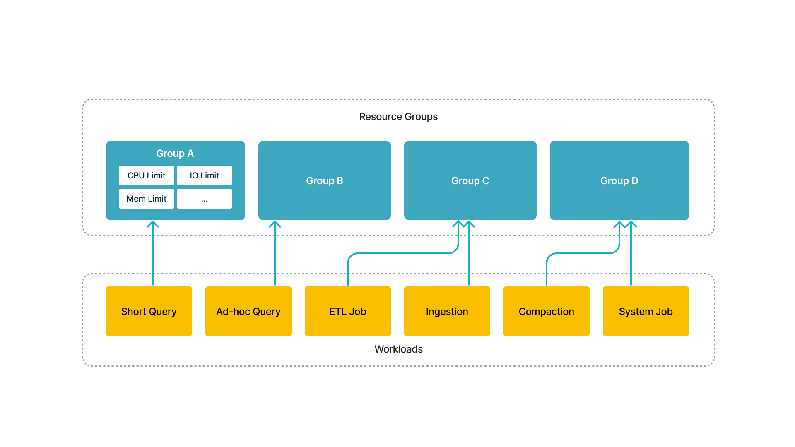

# リソースグループ

このトピックでは、StarRocks のリソースグループ機能について説明します。



この機能を使用すると、短いクエリ、アドホッククエリ、ETL ジョブなど、複数のワークロードを単一のクラスターで同時に実行でき、複数のクラスターを展開するための追加コストを節約できます。技術的な観点から見ると、実行エンジンはユーザーの指定に従って同時にワークロードをスケジュールし、それらの間の干渉を分離します。

リソースグループのロードマップ:

- v2.2 以降、StarRocks はクエリのリソース消費を制限し、同じクラスター内のテナント間でのリソースの分離と効率的な使用を実現します。
- StarRocks v2.3 では、大規模クエリのリソース消費をさらに制限し、過大なクエリ要求によってクラスターリソースが枯渇するのを防ぎ、システムの安定性を保証します。
- StarRocks v2.5 は、データロード（INSERT）の計算リソース消費を制限します。
- v3.3.5 以降、StarRocks は CPU リソースに対する厳しい制限を課すことをサポートします。

|                 | Internal Table | External Table | Big Query Restriction | INSERT INTO | Broker Load | Routine Load, Stream Load, Schema Change | CPU Hard Limit |
| --------------- | -------------- | -------------- | --------------------- | ----------- | ----------- | ---------------------------------------- | -------------- |
| 2.2             | √              | ×              | ×                     | ×           | ×           | ×                                        | x              |
| 2.3             | √              | √              | √                     | ×           | ×           | ×                                        | x              |
| 2.5             | √              | √              | √                     | √           | ×           | ×                                        | x              |
| 3.1 & 3.2       | √              | √              | √                     | √           | √           | ×                                        | x              |
| 3.3.5 and later | √              | √              | √                     | √           | √           | ×                                        | √              |

## 用語

このセクションでは、リソースグループ機能を使用する前に理解しておくべき用語について説明します。

### リソースグループ

各リソースグループは、特定の BE からの計算リソースのセットです。クラスターの各 BE を複数のリソースグループに分割できます。クエリがリソースグループに割り当てられると、StarRocks は指定されたリソースクォータに基づいて、そのリソースグループに CPU とメモリリソースを割り当てます。

BE 上のリソースグループに対して、次のパラメータを使用して CPU とメモリのリソースクォータを指定できます。

| パラメータ                  | 説明                                                    | 値の範囲                                                    | デフォルト |
| -------------------------- | -------------------------------------------------------------- | -------------------------------------------------------------- | ------- |
| cpu_weight                 | BE ノード上のこのリソースグループの CPU スケジューリングの重み。 | (0, `avg_be_cpu_cores`] (0 より大きい場合に有効)     | 0       |
| exclusive_cpu_cores        | このリソースグループの CPU ハードアイソレーションパラメータ。          | (0, `min_be_cpu_cores - 1`] (0 より大きい場合に有効) | 0       |
| mem_limit                  | 現在の BE ノード上でこのリソースグループがクエリに利用できるメモリの割合。 | (0, 1] (必須)               | -       |
| spill_mem_limit_threshold  | ディスクへのスピリングをトリガーするメモリ使用量のしきい値。         | (0, 1]                                                         | 1.0     |
| concurrency_limit          | このリソースグループでの同時クエリの最大数。   | 整数 (0 より大きい場合に有効)                     | 0       |
| big_query_cpu_second_limit | 各 BE ノードでの大規模クエリタスクの最大 CPU 時間（秒単位）。   | 整数 (0 より大きい場合に有効)               | 0       |
| big_query_scan_rows_limit  | 各 BE ノードで大規模クエリタスクがスキャンできる最大行数。   | 整数 (0 より大きい場合に有効)                 | 0       |
| big_query_mem_limit        | 各 BE ノードで大規模クエリタスクが使用できる最大メモリ。        | 整数 (0 より大きい場合に有効)                     | 0       |

#### CPU リソースパラメータ

##### `cpu_weight`

このパラメータは、単一の BE ノード上のリソースグループの CPU スケジューリングの重みを指定し、このグループからのタスクに割り当てられる CPU 時間の相対的なシェアを決定します。v3.3.5 以前では、これは `cpu_core_limit` と呼ばれていました。

その値の範囲は (0, `avg_be_cpu_cores`] で、`avg_be_cpu_cores` はすべての BE ノードにおける CPU コアの平均数です。このパラメータは、0 より大きい値に設定された場合にのみ有効です。`cpu_weight` または `exclusive_cpu_cores` のいずれかが 0 より大きくなければなりませんが、両方ではありません。

> **注意**
>
> 例えば、3 つのリソースグループ rg1、rg2、rg3 がそれぞれ cpu_weight 値 2、6、8 を持っているとします。完全に負荷がかかっている BE ノードでは、これらのグループはそれぞれ 12.5%、37.5%、50% の CPU 時間を受け取ります。ノードが完全に負荷がかかっていない場合、rg1 と rg2 が負荷を受けている間、rg3 がアイドル状態である場合、rg1 と rg2 はそれぞれ 25% と 75% の CPU 時間を受け取ります。

##### `exclusive_cpu_cores`

このパラメータは、リソースグループの CPU ハード制限を定義します。これには 2 つの意味があります。

- **専用**: `exclusive_cpu_cores` CPU コアをこのリソースグループ専用に予約し、アイドル状態でも他のグループには利用できません。
- **クォータ**: リソースグループをこれらの予約された CPU コアのみを使用するように制限し、他のグループから利用可能な CPU リソースを使用できないようにします。

値の範囲は (0, `min_be_cpu_cores - 1`] で、`min_be_cpu_cores` はすべての BE ノードにおける CPU コアの最小数です。0 より大きい場合にのみ有効です。`cpu_weight` または `exclusive_cpu_cores` のいずれかのみが 0 より大きく設定できます。

- `exclusive_cpu_cores` が 0 より大きいリソースグループは専用リソースグループと呼ばれ、それに割り当てられた CPU コアは専用コアと呼ばれます。他のグループは共有リソースグループと呼ばれ、共有コアで実行されます。
- すべてのリソースグループにわたる `exclusive_cpu_cores` の合計数は `min_be_cpu_cores - 1` を超えることはできません。上限は、少なくとも 1 つの共有コアを利用可能にするために設定されています。

`exclusive_cpu_cores` と `cpu_weight` の関係:

`cpu_weight` または `exclusive_cpu_cores` のいずれかのみが一度にアクティブにできます。専用リソースグループは、`cpu_weight` を介して CPU 時間のシェアを要求することなく、独自の予約された専用コアで動作します。

共有リソースグループが専用リソースグループから専用コアを借りることができるかどうかを BE 設定 `enable_resource_group_cpu_borrowing` を使用して設定できます。デフォルトでは `true` に設定されており、専用グループがアイドル状態のときに共有グループが CPU リソースを借りることができます。

この設定を動的に変更するには、次のコマンドを使用します。

```SQL
UPDATE information_schema.be_configs SET VALUE = "false" WHERE NAME = "enable_resource_group_cpu_borrowing";
```

#### メモリリソースパラメータ

##### `mem_limit`

現在の BE ノードでリソースグループが利用できるメモリ（クエリプール）の割合を指定します。値の範囲は (0,1] です。

##### `spill_mem_limit_threshold`

ディスクへのスピリングをトリガーするメモリ使用量のしきい値を定義します。値の範囲は (0,1] で、デフォルトは 1（非アクティブ）です。v3.1.7 で導入されました。

- 自動スピリングが有効（`spill_mode` が `auto` に設定）で、リソースグループが無効な場合、クエリのメモリ使用量が `query_mem_limit` の 80% を超えると、システムは中間結果をディスクにスピルします。
- リソースグループが有効な場合、次の場合にスピリングが発生します:
  - グループ内のすべてのクエリのメモリ使用量が `current BE memory limit * mem_limit * spill_mem_limit_threshold` を超える場合、または
  - 現在のクエリのメモリ使用量が `query_mem_limit` の 80% を超える場合。

#### クエリ同時実行パラメータ

##### `concurrency_limit`

システムの過負荷を防ぐために、リソースグループ内の同時クエリの最大数を定義します。0 より大きい場合にのみ有効で、デフォルト値は 0 です。

#### 大規模クエリリソースパラメータ

次のパラメータを使用して、大規模クエリに対するリソース制限を設定できます。

##### `big_query_cpu_second_limit`

各 BE ノードで大規模クエリタスクが使用できる最大 CPU 時間（秒単位）を指定し、並列タスクによって使用された実際の CPU 時間を合計します。0 より大きい場合にのみ有効で、デフォルト値は 0 です。

##### `big_query_scan_rows_limit`

各 BE ノードで大規模クエリタスクがスキャンできる行数の制限を設定します。0 より大きい場合にのみ有効で、デフォルト値は 0 です。

##### `big_query_mem_limit`

各 BE ノードで大規模クエリタスクが使用できる最大メモリをバイト単位で定義します。0 より大きい場合にのみ有効で、デフォルト値は 0 です。

> **注意**
>
> リソースグループで実行中のクエリが上記の大規模クエリ制限を超えた場合、そのクエリはエラーで終了します。エラーメッセージは FE ノードの **fe.audit.log** の `ErrorCode` 列でも確認できます。

##### タイプ（v3.3.5 以降非推奨）

v3.3.5 以前は、StarRocks はリソースグループの `type` を `short_query` に設定することができました。しかし、パラメータ `type` は非推奨となり、`exclusive_cpu_cores` に置き換えられました。このタイプの既存のリソースグループについては、システムは v3.3.5 にアップグレード後、`exclusive_cpu_cores` の値が `cpu_weight` と等しい専用リソースグループに自動的に変換します。

#### システム定義のリソースグループ

各 StarRocks インスタンスには、`default_wg` と `default_mv_wg` の 2 つのシステム定義のリソースグループがあります。システム定義のリソースグループの構成は ALTER RESOURCE GROUP コマンドを使用して変更できますが、それらに対してクラシファイアを定義したり、システム定義のリソースグループを削除したりすることはできません。

##### default_wg

`default_wg` は、リソースグループの管理下にあるが、どのクラシファイアにも一致しない通常のクエリに割り当てられます。`default_wg` のデフォルトのリソース制限は次のとおりです。

- `cpu_core_limit`: 1（v2.3.7 以前）または BE の CPU コア数（v2.3.7 以降）。
- `mem_limit`: 100%。
- `concurrency_limit`: 0。
- `big_query_cpu_second_limit`: 0。
- `big_query_scan_rows_limit`: 0。
- `big_query_mem_limit`: 0。
- `spill_mem_limit_threshold`: 1。

##### default_mv_wg

`default_mv_wg` は、マテリアライズドビューの作成時にプロパティ `resource_group` で対応するマテリアライズドビューにリソースグループが割り当てられていない場合、非同期マテリアライズドビューのリフレッシュタスクに割り当てられます。`default_mv_wg` のデフォルトのリソース制限は次のとおりです。

- `cpu_core_limit`: 1。
- `mem_limit`: 80%。
- `concurrency_limit`: 0。
- `spill_mem_limit_threshold`: 80%。

### クラシファイア（分類器）

各クラシファイアは、クエリのプロパティに一致する 1 つ以上の条件を保持します。StarRocks は、各クエリに最も適したクラシファイアを条件に基づいて特定し、クエリの実行に必要なリソースを割り当てます。

クラシファイアは次の条件をサポートします。

- `user`: ユーザーの名前。
- `role`: ユーザーの役割。
- `query_type`: クエリのタイプ。`SELECT` と `INSERT`（v2.5 以降）がサポートされています。INSERT INTO または BROKER LOAD タスクが `query_type` を `insert` とするリソースグループにヒットした場合、BE ノードはタスクのために指定された CPU リソースを予約します。
- `source_ip`: クエリが開始された CIDR ブロック。
- `db`: クエリがアクセスするデータベース。カンマ `,` で区切られた文字列で指定できます。
- `plan_cpu_cost_range`: クエリの推定 CPU コスト範囲。形式は `(DOUBLE, DOUBLE]` です。デフォルト値は NULL で、そのような制限がないことを示します。`PlanCpuCost` 列は、クエリの CPU コストに対するシステムの推定値を表します。このパラメータは v3.1.4 以降でサポートされています。
- `plan_mem_cost_range`: クエリのシステム推定メモリコスト範囲。形式は `(DOUBLE, DOUBLE]` です。デフォルト値は NULL で、そのような制限がないことを示します。`PlanMemCost` 列は、クエリのメモリコストに対するシステムの推定値を表します。このパラメータは v3.1.4 以降でサポートされています。

クラシファイアは、クラシファイアの条件のいずれかまたはすべてがクエリの情報と一致する場合にのみクエリに一致します。複数のクラシファイアがクエリに一致する場合、StarRocks はクエリと各クラシファイアの一致度を計算し、一致度が最も高いクラシファイアを特定します。

> **注意**
>
> クエリが属するリソースグループは、FE ノードの **fe.audit.log** の `ResourceGroup` 列で確認するか、`EXPLAIN VERBOSE <query>` を実行して確認できます。詳しくは [クエリのリソースグループを表示する](#view-the-resource-group-of-a-query) を参照してください。

StarRocks は、次のルールを使用してクエリとクラシファイアの一致度を計算します。

- クラシファイアがクエリと同じ `user` 値を持っている場合、クラシファイアの一致度は 1 増加します。
- クラシファイアがクエリと同じ `role` 値を持っている場合、クラシファイアの一致度は 1 増加します。
- クラシファイアがクエリと同じ `query_type` 値を持っている場合、クラシファイアの一致度は 1 増加し、次の計算から得られる数値も加算されます: 1/クラシファイア内の `query_type` フィールドの数。
- クラシファイアがクエリと同じ `source_ip` 値を持っている場合、クラシファイアの一致度は 1 増加し、次の計算から得られる数値も加算されます: (32 - `cidr_prefix`)/64。
- クラシファイアがクエリと同じ `db` 値を持っている場合、クラシファイアの一致度は 10 増加します。
- クエリの CPU コストが `plan_cpu_cost_range` 内にある場合、クラシファイアの一致度は 1 増加します。
- クエリのメモリコストが `plan_mem_cost_range` 内にある場合、クラシファイアの一致度は 1 増加します。

複数のクラシファイアがクエリに一致する場合、条件の数が多いクラシファイアの方が一致度が高くなります。

```Plain
-- クラシファイア B はクラシファイア A よりも多くの条件を持っています。したがって、クラシファイア B はクラシファイア A よりも一致度が高くなります。

クラシファイア A (user='Alice')

クラシファイア B (user='Alice', source_ip = '192.168.1.0/24')
```

複数の一致するクラシファイアが同じ条件数を持つ場合、条件がより正確に記述されているクラシファイアの方が一致度が高くなります。

```Plain
-- クラシファイア B に指定された CIDR ブロックは、クラシファイア A よりも範囲が小さいです。したがって、クラシファイア B はクラシファイア A よりも一致度が高くなります。
クラシファイア A (user='Alice', source_ip = '192.168.1.0/16')
クラシファイア B (user='Alice', source_ip = '192.168.1.0/24')

-- クラシファイア C はクラシファイア D よりも指定されたクエリタイプが少ないです。したがって、クラシファイア C はクラシファイア D よりも一致度が高くなります。
クラシファイア C (user='Alice', query_type in ('select'))
クラシファイア D (user='Alice', query_type in ('insert','select'))
```

複数のクラシファイアが同じ一致度を持つ場合、クラシファイアのいずれかがランダムに選択されます。

```Plain
-- クエリが同時に db1 と db2 をクエリし、クラシファイア E と F がヒットしたクラシファイアの中で最も一致度が高い場合、E と F のいずれかがランダムに選択されます。
クラシファイア E (db='db1')
クラシファイア F (db='db2')
```

## 計算リソースの分離

リソースグループとクラシファイアを設定することで、クエリ間の計算リソースを分離できます。

### リソースグループを有効にする

リソースグループを使用するには、StarRocks クラスターの Pipeline Engine を有効にする必要があります。

```SQL
-- 現在のセッションで Pipeline Engine を有効にします。
SET enable_pipeline_engine = true;
-- グローバルに Pipeline Engine を有効にします。
SET GLOBAL enable_pipeline_engine = true;
```

ロードタスクの場合、FE 設定項目 `enable_pipeline_load` を設定して、ロードタスクのために Pipeline エンジンを有効にする必要があります。この項目は v2.5.0 以降でサポートされています。

```sql
ADMIN SET FRONTEND CONFIG ("enable_pipeline_load" = "true");
```

> **注意**
>
> v3.1.0 以降、リソースグループはデフォルトで有効になっており、セッション変数 `enable_resource_group` は非推奨です。

### リソースグループとクラシファイアを作成する

次のステートメントを実行して、リソースグループを作成し、クラシファイアと関連付け、リソースグループに計算リソースを割り当てます。

```SQL
CREATE RESOURCE GROUP <group_name> 
TO (
    user='string', 
    role='string', 
    query_type in ('select'), 
    source_ip='cidr'
) -- クラシファイアを作成します。複数のクラシファイアを作成する場合、クラシファイアをカンマ（`,`）で区切ります。
WITH (
    "{ cpu_weight | exclusive_cpu_cores }" = "INT",
    "mem_limit" = "m%",
    "concurrency_limit" = "INT",
    "type" = "str" -- リソースグループのタイプ。値を normal に設定します。
);
```

例:

```SQL
CREATE RESOURCE GROUP rg1
TO 
    (user='rg1_user1', role='rg1_role1', query_type in ('select'), source_ip='192.168.x.x/24'),
    (user='rg1_user2', query_type in ('select'), source_ip='192.168.x.x/24'),
    (user='rg1_user3', source_ip='192.168.x.x/24'),
    (user='rg1_user4'),
    (db='db1')
WITH (
    'exclusive_cpu_cores' = '10',
    'mem_limit' = '20%',
    'big_query_cpu_second_limit' = '100',
    'big_query_scan_rows_limit' = '100000',
    'big_query_mem_limit' = '1073741824'
);
```

### リソースグループを指定する（オプション）

現在のセッションに対して、`default_wg` や `default_mv_wg` を含むリソースグループを直接指定できます。

```SQL
SET resource_group = 'group_name';
```

### リソースグループとクラシファイアを表示する

次のステートメントを実行して、すべてのリソースグループとクラシファイアをクエリします。

```SQL
SHOW RESOURCE GROUPS ALL;
```

次のステートメントを実行して、ログインしているユーザーのリソースグループとクラシファイアをクエリします。

```SQL
SHOW RESOURCE GROUPS;
```

次のステートメントを実行して、指定されたリソースグループとそのクラシファイアをクエリします。

```SQL
SHOW RESOURCE GROUP group_name;
```

例:

```plain
mysql> SHOW RESOURCE GROUPS ALL;
+---------------+-------+------------+---------------------+-----------+----------------------------+---------------------------+---------------------+-------------------+---------------------------+----------------------------------------+
| name          | id    | cpu_weight | exclusive_cpu_cores | mem_limit | big_query_cpu_second_limit | big_query_scan_rows_limit | big_query_mem_limit | concurrency_limit | spill_mem_limit_threshold | classifiers                            |
+---------------+-------+------------+---------------------+-----------+----------------------------+---------------------------+---------------------+-------------------+---------------------------+----------------------------------------+
| default_mv_wg | 3     | 1          | 0                   | 80.0%     | 0                          | 0                         | 0                   | null              | 80%                       | (id=0, weight=0.0)                     |
| default_wg    | 2     | 1          | 0                   | 100.0%    | 0                          | 0                         | 0                   | null              | 100%                      | (id=0, weight=0.0)                     |
| rge1          | 15015 | 0          | 6                   | 90.0%     | 0                          | 0                         | 0                   | null              | 100%                      | (id=15016, weight=1.0, user=rg1_user)  |
| rgs1          | 15017 | 8          | 0                   | 90.0%     | 0                          | 0                         | 0                   | null              | 100%                      | (id=15018, weight=1.0, user=rgs1_user) |
| rgs2          | 15019 | 8          | 0                   | 90.0%     | 0                          | 0                         | 0                   | null              | 100%                      | (id=15020, weight=1.0, user=rgs2_user) |
+---------------+-------+------------+---------------------+-----------+----------------------------+---------------------------+---------------------+-------------------+---------------------------+----------------------------------------+
```

> **注意**
>
> 上記の例では、`weight` は一致度を示しています。

リソースグループのすべてのフィールドをクエリするには、非推奨のフィールドも含めて、上記の 3 つのコマンドに `VERBOSE` キーワードを追加することで、`type` や `max_cpu_cores` などの非推奨フィールドを含むリソースグループのすべてのフィールドを表示できます。

```sql
SHOW VERBOSE RESOURCE GROUPS ALL;
SHOW VERBOSE RESOURCE GROUPS;
SHOW VERBOSE RESOURCE GROUP group_name;
```

### リソースグループとクラシファイアを管理する

各リソースグループのリソースクォータを変更できます。また、リソースグループからクラシファイアを追加または削除できます。

既存のリソースグループのリソースクォータを変更するには、次のステートメントを実行します。

```SQL
ALTER RESOURCE GROUP group_name WITH (
    'cpu_core_limit' = 'INT',
    'mem_limit' = 'm%'
);
```

リソースグループを削除するには、次のステートメントを実行します。

```SQL
DROP RESOURCE GROUP group_name;
```

リソースグループにクラシファイアを追加するには、次のステートメントを実行します。

```SQL
ALTER RESOURCE GROUP <group_name> ADD (user='string', role='string', query_type in ('select'), source_ip='cidr');
```

リソースグループからクラシファイアを削除するには、次のステートメントを実行します。

```SQL
ALTER RESOURCE GROUP <group_name> DROP (CLASSIFIER_ID_1, CLASSIFIER_ID_2, ...);
```

リソースグループのすべてのクラシファイアを削除するには、次のステートメントを実行します。

```SQL
ALTER RESOURCE GROUP <group_name> DROP ALL;
```

## リソースグループを観察する

### クエリのリソースグループを表示する

まだ実行されていないクエリについては、`EXPLAIN VERBOSE <query>` によって返される `RESOURCE GROUP` フィールドからクエリに一致するリソースグループを表示できます。

クエリが実行中の場合、`SHOW PROC '/current_queries'` および `SHOW PROC '/global_current_queries'` によって返される `ResourceGroup` フィールドから、クエリがヒットしたリソースグループを確認できます。

クエリが完了した後、FE ノードの **fe.audit.log** ファイルの `ResourceGroup` フィールドを確認することで、クエリが一致したリソースグループを表示できます。

- クエリがリソースグループの管理下にない場合、列の値は空の文字列 `""` です。
- クエリがリソースグループの管理下にあるが、どのクラシファイアにも一致しない場合、列の値は空の文字列 `""` です。ただし、このクエリはデフォルトのリソースグループ `default_wg` に割り当てられます。

### リソースグループの監視

リソースグループの[監視とアラート](../monitoring/Monitor_and_Alert.md)を設定できます。

リソースグループ関連の FE および BE メトリクスは次のとおりです。以下のすべてのメトリクスには、対応するリソースグループを示す `name` ラベルがあります。

### FE メトリクス

次の FE メトリクスは、現在の FE ノード内の統計のみを提供します。

| メトリクス                                          | 単位 | タイプ          | 説明                                                        |
| ----------------------------------------------- | ---- | ------------- | ------------------------------------------------------------------ |
| starrocks_fe_query_resource_group               | カウント | 瞬時値 | このリソースグループで歴史的に実行されたクエリの数（現在実行中のものを含む）。 |
| starrocks_fe_query_resource_group_latency       | ms    | 瞬時値 | このリソースグループのクエリ遅延パーセンタイル。ラベル `type` は、`mean`、`75_quantile`、`95_quantile`、`98_quantile`、`99_quantile`、`999_quantile` を含む特定のパーセンタイルを示します。 |
| starrocks_fe_query_resource_group_err           | カウント | 瞬時値 | このリソースグループでエラーが発生したクエリの数。 |
| starrocks_fe_resource_group_query_queue_total   | カウント | 瞬時値 | このリソースグループで歴史的にキューに入れられたクエリの総数（現在実行中のものを含む）。このメトリクスは v3.1.4 以降でサポートされています。クエリキューが有効な場合にのみ有効です。 |
| starrocks_fe_resource_group_query_queue_pending | カウント | 瞬時値 | このリソースグループの現在のキューにあるクエリの数。このメトリクスは v3.1.4 以降でサポートされています。クエリキューが有効な場合にのみ有効です。 |
| starrocks_fe_resource_group_query_queue_timeout | カウント | 瞬時値 | このリソースグループでキューに入れられている間にタイムアウトしたクエリの数。このメトリクスは v3.1.4 以降でサポートされています。クエリキューが有効な場合にのみ有効です。 |

### BE メトリクス

| メトリクス                                      | 単位     | タイプ          | 説明                                                        |
| ----------------------------------------- | -------- | ------------- | ------------------------------------------------------------------ |
| resource_group_running_queries            | カウント    | 瞬時値 | このリソースグループで現在実行中のクエリの数。   |
| resource_group_total_queries              | カウント    | 瞬時値 | このリソースグループで歴史的に実行されたクエリの数（現在実行中のものを含む）。 |
| resource_group_bigquery_count             | カウント    | 瞬時値 | このリソースグループで大規模クエリ制限をトリガーしたクエリの数。 |
| resource_group_concurrency_overflow_count | カウント    | 瞬時値 | このリソースグループで `concurrency_limit` 制限をトリガーしたクエリの数。 |
| resource_group_mem_limit_bytes            | バイト    | 瞬時値 | このリソースグループのメモリ制限。                         |
| resource_group_mem_inuse_bytes            | バイト    | 瞬時値 | このリソースグループが現在使用しているメモリ。               |
| resource_group_cpu_limit_ratio            | パーセンテージ | 瞬時値 | このリソースグループの `cpu_core_limit` がすべてのリソースグループの `cpu_core_limit` に対する割合。 |
| resource_group_inuse_cpu_cores            | カウント     | 平均     | このリソースグループが使用している CPU コアの推定数。この値はおおよその推定値です。これは、2 回の連続したメトリック収集からの統計に基づいて計算された平均値を表します。このメトリクスは v3.1.4 以降でサポートされています。 |
| resource_group_cpu_use_ratio              | パーセンテージ | 平均     | **非推奨** このリソースグループが使用した Pipeline スレッドのタイムスライスがすべてのリソースグループが使用した Pipeline スレッドのタイムスライスに対する割合。これは、2 回の連続したメトリック収集からの統計に基づいて計算された平均値を表します。 |
| resource_group_connector_scan_use_ratio   | パーセンテージ | 平均     | **非推奨** このリソースグループが使用した外部テーブルスキャンスレッドのタイムスライスがすべてのリソースグループが使用した Pipeline スレッドのタイムスライスに対する割合。これは、2 回の連続したメトリック収集からの統計に基づいて計算された平均値を表します。 |
| resource_group_scan_use_ratio             | パーセンテージ | 平均     | **非推奨** このリソースグループが使用した内部テーブルスキャンスレッドのタイムスライスがすべてのリソースグループが使用した Pipeline スレッドのタイムスライスに対する割合。これは、2 回の連続したメトリック収集からの統計に基づいて計算された平均値を表します。 |

### リソースグループの使用情報を表示する

v3.1.4 以降、StarRocks は SQL ステートメント [SHOW USAGE RESOURCE GROUPS](../../../sql-reference/sql-statements/cluster-management/resource_group/SHOW_USAGE_RESOURCE_GROUPS.md) をサポートしており、BE にわたる各リソースグループの使用情報を表示するために使用されます。各フィールドの説明は次のとおりです。

- `Name`: リソースグループの名前。
- `Id`: リソースグループの ID。
- `Backend`: BE の IP または FQDN。
- `BEInUseCpuCores`: この BE 上でこのリソースグループが現在使用している CPU コアの数。この値はおおよその推定値です。
- `BEInUseMemBytes`: この BE 上でこのリソースグループが現在使用しているメモリバイト数。
- `BERunningQueries`: この BE 上でこのリソースグループからのクエリがまだ実行中の数。

注意事項:

- BE は `report_resource_usage_interval_ms` で指定された間隔でこのリソース使用情報を Leader FE に定期的に報告します。デフォルトでは 1 秒に設定されています。
- 結果には、`BEInUseCpuCores`/`BEInUseMemBytes`/`BERunningQueries` のいずれかが正の数である行のみが表示されます。つまり、リソースグループが BE 上で積極的にリソースを使用している場合にのみ情報が表示されます。

例:

```Plain
MySQL [(none)]> SHOW USAGE RESOURCE GROUPS;
+------------+----+-----------+-----------------+-----------------+------------------+
| Name       | Id | Backend   | BEInUseCpuCores | BEInUseMemBytes | BERunningQueries |
+------------+----+-----------+-----------------+-----------------+------------------+
| default_wg | 0  | 127.0.0.1 | 0.100           | 1               | 5                |
+------------+----+-----------+-----------------+-----------------+------------------+
| default_wg | 0  | 127.0.0.2 | 0.200           | 2               | 6                |
+------------+----+-----------+-----------------+-----------------+------------------+
| wg1        | 0  | 127.0.0.1 | 0.300           | 3               | 7                |
+------------+----+-----------+-----------------+-----------------+------------------+
| wg2        | 0  | 127.0.0.1 | 0.400           | 4               | 8                |
+------------+----+-----------+-----------------+-----------------+------------------+
```

### 専用および共有リソースグループのスレッド情報を表示する

クエリの実行には主に 3 つのスレッドプールが関与します: `pip_exec`、`pip_scan`、および `pip_con_scan`。

- 専用リソースグループは、専用のスレッドプールで実行され、割り当てられた専用 CPU コアにバインドされます。
- 共有リソースグループは、共有スレッドプールで実行され、残りの共有 CPU コアにバインドされます。

これらの 3 つのプールのスレッドは、`{ pip_exec | pip_scan | pip_con_scan }_{ com | <resource_group_id> }` という命名規則に従います。ここで、`com` は共有スレッドプールを指し、`<resource_group_id>` は専用リソースグループの ID を指します。

各 BE スレッドにバインドされた CPU 情報は、システム定義ビュー `information_schema.be_threads` を通じて表示できます。フィールド `BE_ID`、`NAME`、および `BOUND_CPUS` は、BE の ID、スレッドの名前、およびそのスレッドにバインドされた CPU コアの数を表します。

```sql
select * from information_schema.be_threads where name like '%pip_exec%';
select * from information_schema.be_threads where name like '%pip_scan%';
select * from information_schema.be_threads where name like '%pip_con_scan%';
```

例:

```sql
select BE_ID, NAME, FINISHED_TASKS, BOUND_CPUS from information_schema.be_threads where name like '%pip_exec_com%' and be_id = 10223;
+-------+--------------+----------------+------------+
| BE_ID | NAME         | FINISHED_TASKS | BOUND_CPUS |
+-------+--------------+----------------+------------+
| 10223 | pip_exec_com | 2091295        | 10         |
| 10223 | pip_exec_com | 2088025        | 10         |
| 10223 | pip_exec_com | 1637603        | 6          |
| 10223 | pip_exec_com | 1641260        | 6          |
| 10223 | pip_exec_com | 1634197        | 6          |
| 10223 | pip_exec_com | 1633804        | 6          |
| 10223 | pip_exec_com | 1638184        | 6          |
| 10223 | pip_exec_com | 1636374        | 6          |
| 10223 | pip_exec_com | 2095951        | 10         |
| 10223 | pip_exec_com | 2095248        | 10         |
| 10223 | pip_exec_com | 2098745        | 10         |
| 10223 | pip_exec_com | 2085338        | 10         |
| 10223 | pip_exec_com | 2101221        | 10         |
| 10223 | pip_exec_com | 2093901        | 10         |
| 10223 | pip_exec_com | 2092364        | 10         |
| 10223 | pip_exec_com | 2091366        | 10         |
+-------+--------------+----------------+------------+
```