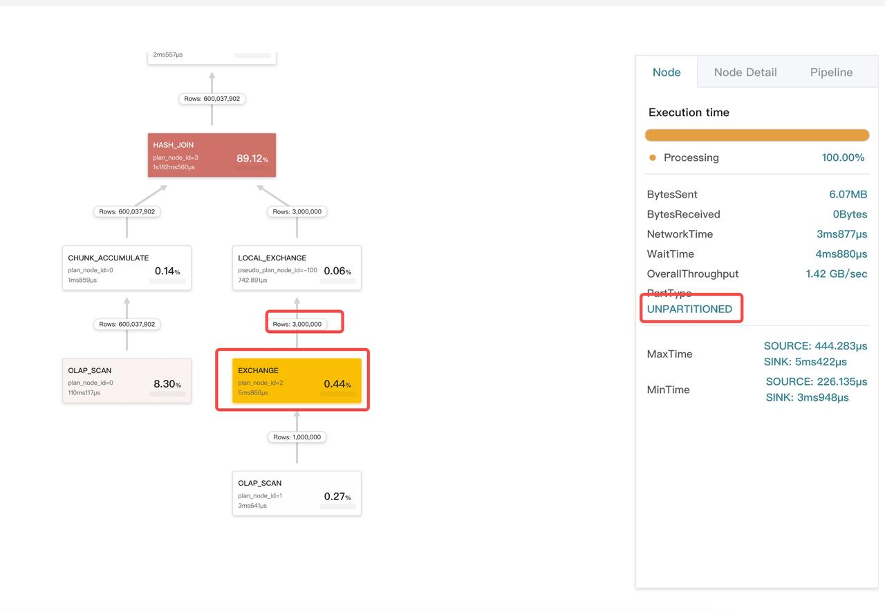

# クエリプロファイルの分析

このトピックでは、クエリプロファイルの確認方法について説明します。クエリプロファイルは、クエリに関与するすべてのワーカーノードの実行情報を記録します。クエリプロファイルは、StarRocks クラスターのクエリパフォーマンスに影響を与えるボトルネックを迅速に特定するのに役立ちます。

## クエリプロファイルの有効化

StarRocks バージョン v2.5 より前のバージョンでは、変数 `is_report_success` を `true` に設定することでクエリプロファイルを有効にできます。

```SQL
set is_report_success = true;
```

StarRocks v2.5 以降のバージョンでは、変数 `enable_profile` を `true` に設定することでクエリプロファイルを有効にできます。

```SQL
set enable_profile = true;
```

## クエリプロファイルへのアクセス

クエリプロファイルにアクセスするには、次の手順に従います。

1. ブラウザに `http://<fe_ip>:<fe_http_port>` を入力します。
2. 表示されたページで、上部のナビゲーションペインの **queries** をクリックします。
3. **Finished Queries** リストで確認したいクエリを選択し、**Profile** 列のリンクをクリックします。


ブラウザは対応するクエリプロファイルを含む新しいページにリダイレクトします。


## クエリプロファイルの解釈

### クエリプロファイルの構造

以下はクエリプロファイルの例です。

```SQL
Query:
  Summary:
  Planner:
  Execution Profile 7de16a85-761c-11ed-917d-00163e14d435:
    Fragment 0:
      Pipeline (id=2):
        EXCHANGE_SINK (plan_node_id=18):
        LOCAL_MERGE_SOURCE (plan_node_id=17):
      Pipeline (id=1):
        LOCAL_SORT_SINK (plan_node_id=17):
        AGGREGATE_BLOCKING_SOURCE (plan_node_id=16):
      Pipeline (id=0):
        AGGREGATE_BLOCKING_SINK (plan_node_id=16):
        EXCHANGE_SOURCE (plan_node_id=15):
    Fragment 1:
       ...
    Fragment 2:
       ...
```

クエリプロファイルは3つのセクションで構成されています。

- Fragment: 実行ツリー。1つのクエリは1つ以上のフラグメントに分割されます。
- Pipeline: 実行チェーン。実行チェーンには分岐がありません。1つのフラグメントは複数のパイプラインに分割できます。
- Operator: パイプラインは複数のオペレーターで構成されます。


*フラグメントは複数のパイプラインで構成されています。*

### 主要なメトリクス

クエリプロファイルには、クエリ実行の詳細を示す大量のメトリクスが含まれています。ほとんどの場合、オペレーターの実行時間と処理したデータのサイズを観察するだけで十分です。ボトルネックを見つけたら、それに応じて対処できます。

#### サマリー

| メトリクス       | 説明                                                              |
| ---------------- | ---------------------------------------------------------------- |
| Total            | クエリに消費された総時間。計画、実行、プロファイリングに費やされた時間を含みます。 |
| QueryCpuCost     | クエリの総CPU時間コスト。CPU時間コストは並行プロセスに対して集計されます。その結果、このメトリクスの値はクエリの実際の実行時間よりも大きくなる場合があります。 |
| QueryMemCost     | クエリの総メモリコスト。                                          |

#### オペレーターの共通メトリクス

| メトリクス            | 説明                                           |
| --------------------- | --------------------------------------------- |
| OperatorTotalTime     | オペレーターの総CPU時間コスト。               |
| PushRowNum            | オペレーターがプッシュしたデータの総行数。     |
| PullRowNum            | オペレーターがプルしたデータの総行数。         |

#### スキャンオペレーター

| メトリクス                          | 説明                                                              |
| ----------------------------------- | ---------------------------------------------------------------- |
| Table                               | テーブル名。                                                      |
| ScanTime                            | 総スキャン時間。スキャンは非同期I/Oスレッドプールで実行されます。 |
| TabletCount                         | タブレットの数。                                                  |
| PushdownPredicates                  | プッシュダウンされた述語の数。                                    |
| BytesRead                           | StarRocks が読み取ったデータのサイズ。                            |
| CompressedBytesRead                 | StarRocks が読み取った圧縮データのサイズ。                        |
| IOTime                              | 総I/O時間。                                                      |
| BitmapIndexFilterRows               | ビットマップインデックスでフィルタリングされたデータの行数。      |
| BloomFilterFilterRows               | ブルームフィルターでフィルタリングされたデータの行数。            |
| SegmentRuntimeZoneMapFilterRows     | ランタイムゾーンマップでフィルタリングされたデータの行数。        |
| SegmentZoneMapFilterRows            | ゾーンマップでフィルタリングされたデータの行数。                  |
| ShortKeyFilterRows                  | ショートキーでフィルタリングされたデータの行数。                  |
| ZoneMapIndexFilterRows              | ゾーンマップインデックスでフィルタリングされたデータの行数。      |

#### エクスチェンジオペレーター

| メトリクス            | 説明                                                              |
| --------------------- | ---------------------------------------------------------------- |
| PartType              | データ分布タイプ。 有効な値: `UNPARTITIONED`, `RANDOM`, `HASH_PARTITIONED`, `BUCKET_SHUFFLE_HASH_PARTITIONED`。 |
| BytesSent             | 送信されたデータのサイズ。                                        |
| OverallThroughput     | 全体のスループット。                                              |
| NetworkTime           | データパッケージの送信時間（受信後の処理時間を除く）。このメトリクスの計算方法や例外が発生する理由については、以下のFAQを参照してください。 |
| WaitTime              | 送信側のキューが満杯のために待機する時間。                        |

#### 集計オペレーター

| メトリクス             | 説明                                           |
| ---------------------- | --------------------------------------------- |
| GroupingKeys           | グループ化キーの名前（GROUP BY 列）。         |
| AggregateFunctions     | 集計関数。                                    |
| AggComputeTime         | 集計関数によって消費された計算時間。           |
| ExprComputeTime        | 式によって消費された計算時間。                 |
| HashTableSize          | ハッシュテーブルのサイズ。                     |

#### ジョインオペレーター

| メトリクス                    | 説明                                   |
| ----------------------------- | ------------------------------------- |
| JoinPredicates                | ジョイン操作の述語。                  |
| JoinType                      | ジョインタイプ。                      |
| BuildBuckets                  | ハッシュテーブルのバケット数。        |
| BuildHashTableTime            | ハッシュテーブルの構築に使用された時間。 |
| ProbeConjunctEvaluateTime     | プローブ結合によって消費された時間。   |
| SearchHashTableTimer          | ハッシュテーブルの検索に使用された時間。 |

#### ウィンドウ関数オペレーター

| メトリクス             | 説明                                           |
| ---------------------- | --------------------------------------------- |
| ComputeTime            | ウィンドウ関数によって消費された計算時間。     |
| PartitionKeys          | パーティションキーの名前（PARTITION BY 列）。 |
| AggregateFunctions     | 集計関数。                                    |

#### ソートオペレーター

| メトリクス   | 説明                                                              |
| ------------ | ---------------------------------------------------------------- |
| SortKeys     | ソートキーの名前（ORDER BY 列）。                                |
| SortType     | 結果のソートタイプ: すべての結果をリストするか、上位 n の結果をリストするか。 |

#### テーブル関数オペレーター

| メトリクス                 | 説明                                           |
| -------------------------- | --------------------------------------------- |
| TableFunctionExecTime      | テーブル関数によって消費された計算時間。       |
| TableFunctionExecCount     | テーブル関数が実行された回数。                 |

#### プロジェクトオペレーター

| メトリクス                   | 説明                                           |
| ---------------------------- | --------------------------------------------- |
| ExprComputeTime              | 式によって消費された計算時間。                 |
| CommonSubExprComputeTime     | 共通部分式によって消費された計算時間。         |

#### ローカルエクスチェンジオペレーター

| メトリクス     | 説明                                                              |
| -------------- | ---------------------------------------------------------------- |
| Type           | ローカルエクスチェンジタイプ。 有効な値: `Passthrough`, `Partition`, `Broadcast`。 |
| ShuffleNum     | シャッフルの数。このメトリクスは `Type` が `Partition` の場合にのみ有効です。 |

### オペレーターによる消費時間

- OlapScan および ConnectorScan オペレーターの場合、その消費時間は `OperatorTotalTime + ScanTime` に相当します。スキャンオペレーターは非同期I/OスレッドプールでI/O操作を行うため、ScanTime は非同期I/O時間を表します。
- エクスチェンジオペレーターの消費時間は `OperatorTotalTime + NetworkTime` に相当します。エクスチェンジオペレーターは bRPC スレッドプールでデータパッケージを送受信するため、NetworkTime はネットワーク送信に消費された時間を表します。
- その他のすべてのオペレーターの時間コストは `OperatorTotalTime` です。

### メトリクスのマージと MIN/MAX

パイプラインエンジンは並列計算エンジンです。各フラグメントは並列処理のために複数のマシンに分散され、各マシンのパイプラインは複数の並行インスタンスとして並列に実行されます。したがって、プロファイリング中に StarRocks は同じメトリクスをマージし、すべての並行インスタンス間の各メトリクスの最小値と最大値を記録します。

異なるタイプのメトリクスに対して異なるマージ戦略が採用されています。

- 時間メトリクスは平均です。例えば:
  - `OperatorTotalTime` はすべての並行インスタンスの平均時間コストを表します。
  - `__MAX_OF_OperatorTotalTime` はすべての並行インスタンスの中で最大の時間コストです。
  - `__MIN_OF_OperatorTotalTime` はすべての並行インスタンスの中で最小の時間コストです。

```SQL
             - OperatorTotalTime: 2.192us
               - __MAX_OF_OperatorTotalTime: 2.502us
               - __MIN_OF_OperatorTotalTime: 1.882us
```

- 非時間メトリクスは合計されます。例えば:
  - `PullChunkNum` はすべての並行インスタンスの合計数を表します。
  - `__MAX_OF_PullChunkNum` はすべての並行インスタンスの中で最大の値です。
  - `__MIN_OF_PullChunkNum` はすべての並行インスタンスの中で最小の値です。

  ```SQL
                 - PullChunkNum: 146.66K (146660)
                   - __MAX_OF_PullChunkNum: 24.45K (24450)
                   - __MIN_OF_PullChunkNum: 24.435K (24435)
  ```

- 最小値と最大値を持たない特別なメトリクスは、すべての並行インスタンス間で同一の値を持ちます（例えば、`DegreeOfParallelism`）。

#### MIN と MAX の間の大きな差異

通常、MIN と MAX の値の間に顕著な差異がある場合、データが偏っていることを示しています。これは集計またはジョイン操作中に発生する可能性があります。

```SQL
             - OperatorTotalTime: 2m48s
               - __MAX_OF_OperatorTotalTime: 10m30s
               - __MIN_OF_OperatorTotalTime: 279.170us
```

## クエリプロファイルの可視化

StarRocks Enterprise Edition のユーザーであれば、StarRocks Manager を通じてクエリプロファイルを可視化できます。

**Profile Overview** ページには、総実行時間 `ExecutionWallTime`、I/O メトリクス、ネットワーク送信サイズ、CPU と I/O 時間の割合などのサマリーメトリクスが表示されます。


オペレーター（ノード）のカードをクリックすると、その詳細情報がページの右ペインに表示されます。3つのタブがあります。

- **Node**: このオペレーターのコアメトリクス。
- **Node Detail**: このオペレーターのすべてのメトリクス。
- **Pipeline**: オペレーターが属するパイプラインのメトリクス。このタブはスケジューリングにのみ関連しているため、あまり注意を払う必要はありません。


### ボトルネックの特定

オペレーターが占める時間の割合が大きいほど、そのカードの色が濃くなります。これにより、クエリのボトルネックを簡単に特定できます。


### データが偏っているかどうかの確認

時間の割合が大きいオペレーターのカードをクリックし、その `MaxTime` と `MinTime` を確認します。`MaxTime` と `MinTime` の間に顕著な差異がある場合、通常データが偏っていることを示しています。


次に、**Node Detail** タブをクリックし、どのメトリクスが例外を示しているかを確認します。この例では、Aggregate オペレーターのメトリクス `PushRowNum` がデータの偏りを示しています。


### パーティショニングまたはバケッティング戦略が有効かどうかの確認

対応するクエリプランを `EXPLAIN <sql_statement>` を使用して表示することで、パーティショニングまたはバケッティング戦略が有効かどうかを確認できます。


### 正しいマテリアライズドビューが使用されているかの確認

対応するスキャンオペレーターをクリックし、**Node Detail** タブの `Rollup` フィールドを確認します。


### 左右のテーブルに対するジョインプランが適切かどうかの確認

通常、StarRocks はジョインの右テーブルとして小さいテーブルを選択します。クエリプロファイルがそれ以外を示している場合、例外が発生します。


### ジョインの分布タイプが正しいかどうかの確認

エクスチェンジオペレーターは、データ分布タイプに応じて3つのタイプに分類されます。

- `UNPARTITIONED`: ブロードキャスト。データは複数のコピーにされ、複数の BEs に分配されます。
- `RANDOM`: ラウンドロビン。
- `HASH_PARTITIONED` および `BUCKET_SHUFFLE_HASH_PARTITIONED`: シャッフル。`HASH_PARTITIONED` と `BUCKET_SHUFFLE_HASH_PARTITIONED` の違いは、ハッシュコードを計算するために使用されるハッシュ関数にあります。

Inner Join の場合、右テーブルは `HASH_PARTITIONED` および `BUCKET_SHUFFLE_HASH_PARTITIONED` タイプまたは `UNPARTITIONED` タイプにすることができます。通常、右テーブルに 100K 行未満の場合にのみ `UNPARTITIONED` タイプが採用されます。

次の例では、エクスチェンジオペレーターのタイプはブロードキャストですが、オペレーターによって送信されたデータのサイズがしきい値を大幅に超えています。



### JoinRuntimeFilter が有効かどうかの確認

ジョインの右側の子がハッシュテーブルを構築する際、ランタイムフィルターを作成します。このランタイムフィルターは左側の子ツリーに送信され、可能であればスキャンオペレーターにプッシュダウンされます。スキャンオペレーターの **Node Detail** タブで `JoinRuntimeFilter` に関連するメトリクスを確認できます。


## FAQ

### エクスチェンジオペレーターの時間コストが異常なのはなぜですか？


エクスチェンジオペレーターの時間コストは、CPU時間とネットワーク時間の2つの部分で構成されています。ネットワーク時間はシステムクロックに依存します。ネットワーク時間は次のように計算されます。

1. 送信者は、パッケージを送信するために bRPC インターフェースを呼び出す前に `send_timestamp` を記録します。
2. 受信者は、bRPC インターフェースからパッケージを受信した後（受信後の処理時間を除く）に `receive_timestamp` を記録します。
3. 処理が完了すると、受信者は応答を送信し、ネットワーク遅延を計算します。パッケージ送信遅延は `receive_timestamp` - `send_timestamp` に相当します。

マシン間でシステムクロックが一致しない場合、エクスチェンジオペレーターの時間コストに例外が発生します。

### すべてのオペレーターの総時間コストがクエリ実行時間よりも大幅に少ないのはなぜですか？

可能な原因: 高並行性シナリオでは、一部のパイプラインドライバーがスケジュール可能であっても、キューに入れられているためにタイムリーに処理されない場合があります。待機時間はオペレーターのメトリクスには記録されず、`PendingTime`、`ScheduleTime`、および `IOTaskWaitTime` に記録されます。

例:

プロファイルから、`ExecutionWallTime` が約 55 ms であることがわかります。しかし、すべてのオペレーターの総時間コストは 10 ms 未満であり、`ExecutionWallTime` よりも大幅に少ないです。

