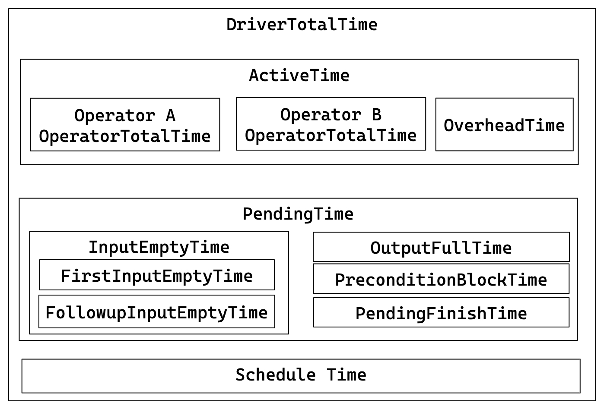
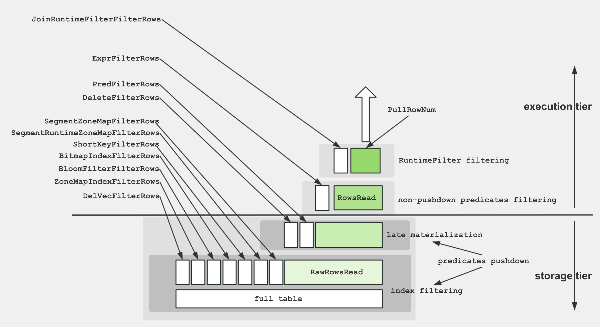

# クエリプロファイルの構造とメトリクス

## クエリプロファイルの構造

クエリプロファイルの構造は、StarRocks の実行エンジンの設計に密接に関連しており、以下の5つの部分で構成されています：

- **Fragment**: 実行ツリー。クエリは1つ以上のフラグメントで構成されます。
- **FragmentInstance**: 各フラグメントは複数のインスタンスを持つことができ、各インスタンスは異なるコンピュートノードによって実行されます。
- **Pipeline**: FragmentInstance は複数のパイプラインに分割されます。パイプラインは、一連の接続された Operator インスタンスで構成される実行チェーンです。
- **PipelineDriver**: パイプラインは複数のインスタンスを持つことができ、各インスタンスは PipelineDriver と呼ばれ、複数の計算コアを最大限に活用します。
- **Operator**: PipelineDriver は複数の Operator インスタンスで構成されています。


### クエリプロファイルのマージ戦略

クエリプロファイルの構造を分析することで、同じフラグメントに関連する複数の FragmentInstance が構造的に高い類似性を持っていることが容易に観察できます。同様に、同じパイプラインに属する複数の PipelineDriver も類似した構造的特徴を示します。クエリプロファイルのボリュームを減らすために、StarRocks はデフォルトで FragmentInstance レイヤーと PipelineDriver レイヤーをマージします。その結果、元の5層構造は3層に簡略化されます：

- Fragment
- Pipeline
- Operator

このマージ動作は、セッション変数 `pipeline_profile_level` を通じて制御できます。この変数には2つの有効な値があります：

- `1` (デフォルト): StarRocks はメトリクスを3層構造にマージします。
- `2`: StarRocks はメトリクスをマージしません。元の5層構造が保持されます。
- その他の値はデフォルト値 `1` として扱われます。

一般的に、このパラメータを `2` に設定することは推奨しません。5層構造のクエリプロファイルには多くの制限があります。例えば、プロファイルを視覚的に分析するためのツールを使用できません。そのため、マージプロセスが重要な情報の損失を引き起こさない限り、このパラメータを調整する必要はありません。

### メトリクスのマージと MIN/MAX 値

FragmentInstance と PipelineDriver をマージする際、同じ名前のすべてのメトリクスがマージされます。すべての同時インスタンスにおける各メトリクスの最小値と最大値のみが記録されます。異なるタイプのメトリクスは異なるマージ戦略を使用します：

- 時間関連のメトリクスは平均を取ります。例えば：
  - `OperatorTotalTime` はすべての同時インスタンスの平均時間消費です。
  - `__MAX_OF_OperatorTotalTime` はすべての同時インスタンスの最大時間消費です。
  - `__MIN_OF_OperatorTotalTime` はすべての同時インスタンスの最小時間消費です。

```SQL
             - OperatorTotalTime: 2.192us
               - __MAX_OF_OperatorTotalTime: 2.502us
               - __MIN_OF_OperatorTotalTime: 1.882us
```

- 非時間関連のメトリクスは合計されます。例えば：
  - `PullChunkNum` はすべての同時インスタンスにおけるこのメトリクスの合計です。
  - `__MAX_OF_PullChunkNum` はすべての同時インスタンスにおけるこのメトリクスの最大値です。
  - `__MIN_OF_PullChunkNum` はすべての同時インスタンスにおけるこのメトリクスの最小値です。

```SQL
             - PullChunkNum: 146.66K (146660)
               - __MAX_OF_PullChunkNum: 24.45K (24450)
               - __MIN_OF_PullChunkNum: 24.435K (24435)
```

- 極値のない一部のメトリクスは、すべての同時インスタンスで同じ値を持ちます。例えば：`DegreeOfParallelism`。

通常、MIN と MAX の値に大きな差がある場合、データの偏りが高い確率で示されます。考えられるシナリオには、集計やジョイン操作が含まれます。

```SQL
             - OperatorTotalTime: 2m48s
               - __MAX_OF_OperatorTotalTime: 10m30s
               - __MIN_OF_OperatorTotalTime: 279.170us
```

## クエリプロファイルメトリクスリスト

クエリプロファイルには、クエリ実行に関する詳細情報を提供する多くのメトリクスが含まれています。ほとんどの場合、オペレーターの実行時間と処理されたデータのサイズに注目するだけで十分です。ボトルネックを特定したら、それに特化して対処できます。

### サマリーメトリクス

##### Total

説明: クエリに消費された総時間。計画、実行、プロファイリングフェーズの期間を含みます。

##### Query State

説明: クエリの状態。可能な状態には、Finished、Error、Running があります。

### 実行概要メトリクス

##### FrontendProfileMergeTime

説明: フロントエンド (FE) 側でのクエリプロファイル処理時間。

##### QueryAllocatedMemoryUsage

説明: すべてのコンピュートノードにおける累積割り当てメモリ。

##### QueryDeallocatedMemoryUsage

説明: すべてのコンピュートノードにおける累積解放メモリ。

##### QueryPeakMemoryUsagePerNode

説明: すべてのコンピュートノードにおける最大ピークメモリ。

##### QuerySumMemoryUsage

説明: すべてのコンピュートノードにおけるピークメモリの合計。

##### QueryExecutionWallTime

説明: 実行のウォールタイム。

##### QueryCumulativeCpuTime

説明: すべてのコンピュートノードにおける累積 CPU 時間。

##### QueryCumulativeOperatorTime

説明: すべてのノードにおける累積時間。これは単純な線形累積ですが、実際には異なるオペレーターの実行時間が重なることがあります。このパラメータは、各オペレーターに費やされた時間の割合を計算するための分母として機能します。

##### QueryCumulativeNetworkTime

説明: すべての Exchange ノードにおける累積ネットワーク時間。累積オペレーター時間と同様に、異なる Exchange の実際の実行時間が重なることがあります。

##### QueryCumulativeScanTime

説明: すべての Scan ノードにおける累積 IO 時間。累積オペレーター時間と同様に、異なる Scan 操作の実際の実行時間が重なることがあります。

##### QueryPeakScheduleTime

説明: すべてのパイプラインにおける最大 ScheduleTime メトリクス。

##### QuerySpillBytes

説明: ローカルディスクにスピルされたデータのサイズ。

##### ResultDeliverTime

説明: 結果を転送するための追加時間。クエリ文の場合、このパラメータはクライアントにデータを送信するのにかかる時間を指し、挿入文の場合はストレージ層にデータを書き込むのにかかる時間を指します。

### フラグメントメトリクス

##### InstanceNum

説明: このフラグメントのすべての FragmentInstance の数。

##### InstanceIds

説明: このフラグメントのすべての FragmentInstance の ID。

##### BackendNum

説明: このフラグメントの実行に参加している BEs の数。

##### BackendAddresses

説明: このフラグメントの実行に参加しているすべての BEs のアドレス。

##### FragmentInstancePrepareTime

説明: フラグメントの準備フェーズに費やされた時間。

##### InstanceAllocatedMemoryUsage

説明: このフラグメントのすべての FragmentInstance における累積割り当てメモリ。

##### InstanceDeallocatedMemoryUsage

説明: このフラグメントのすべての FragmentInstance における累積解放メモリ。

##### InstancePeakMemoryUsage

説明: このフラグメントのすべての FragmentInstance におけるピークメモリ使用量。

### パイプラインメトリクス

コアメトリクス間の関係は、以下の図で示されています：

- DriverTotalTime = ActiveTime + PendingTime + ScheduleTime
- ActiveTime = ∑ OperatorTotalTime + OverheadTime
- PendingTime = InputEmptyTime + OutputFullTime + PreconditionBlockTime + PendingFinishTime
- InputEmptyTime = FirstInputEmptyTime + FollowupInputEmptyTime



##### DegreeOfParallelism

説明: パイプライン実行の並行性の度合い。

##### TotalDegreeOfParallelism

説明: 並行性の度合いの合計。同じパイプラインが複数のマシンで実行される可能性があるため、この項目はすべての値を集計します。

##### DriverPrepareTime

説明: 準備フェーズにかかる時間。このメトリクスは DriverTotalTime に含まれません。

##### DriverTotalTime

説明: 準備フェーズを除くパイプラインの総実行時間。

##### ActiveTime

説明: パイプラインの実行時間。各オペレーターの実行時間と、has_output、need_input などのメソッド呼び出しに費やされる全体的なフレームワークオーバーヘッドを含みます。

##### PendingTime

説明: 様々な理由でスケジュールされるのをブロックされているパイプラインの時間。

##### InputEmptyTime

説明: 空の入力キューのためにブロックされているパイプラインの時間。

##### FirstInputEmptyTime

説明: 空の入力キューのために最初にブロックされたパイプラインの時間。最初のブロック時間は、主にパイプラインの依存関係によって引き起こされるため、別途計算されます。

##### FollowupInputEmptyTime

説明: 空の入力キューのためにその後ブロックされたパイプラインの時間。

##### OutputFullTime

説明: 出力キューがいっぱいのためにブロックされているパイプラインの時間。

##### PreconditionBlockTime

説明: 依存関係が満たされていないためにブロックされているパイプラインの時間。

##### PendingFinishTime

説明: 非同期タスクの終了を待つためにブロックされているパイプラインの時間。

##### ScheduleTime

説明: 準備キューに入ってから実行のためにスケジュールされるまでのパイプラインのスケジュール時間。

##### BlockByInputEmpty

説明: InputEmpty のためにパイプラインがブロックされた回数。

##### BlockByOutputFull

説明: OutputFull のためにパイプラインがブロックされた回数。

##### BlockByPrecondition

説明: 依存関係が満たされていないためにパイプラインがブロックされた回数。

### オペレーター一般メトリクス

##### PrepareTime

説明: 準備に費やされた時間。

##### OperatorTotalTime

説明: オペレーターによって消費された総時間。次の方程式を満たします：OperatorTotalTime = PullTotalTime + PushTotalTime + SetFinishingTime + SetFinishedTime + CloseTime。準備に費やされた時間は含まれません。

##### PullTotalTime

説明: オペレーターが push_chunk を実行するのに費やす総時間。

##### PushTotalTime

説明: オペレーターが pull_chunk を実行するのに費やす総時間。

##### SetFinishingTime

説明: オペレーターが set_finishing を実行するのに費やす総時間。

##### SetFinishedTime

説明: オペレーターが set_finished を実行するのに費やす総時間。

##### PushRowNum

説明: オペレーターの入力行の累積数。

##### PullRowNum

説明: オペレーターの出力行の累積数。

##### JoinRuntimeFilterEvaluate

説明: ジョインランタイムフィルターが評価された回数。

##### JoinRuntimeFilterHashTime

説明: ジョインランタイムフィルターのハッシュ計算に費やされた時間。

##### JoinRuntimeFilterInputRows

説明: ジョインランタイムフィルターの入力行数。

##### JoinRuntimeFilterOutputRows

説明: ジョインランタイムフィルターの出力行数。

##### JoinRuntimeFilterTime

説明: ジョインランタイムフィルターに費やされた時間。

### ユニークメトリクス

### スキャンオペレーター

スキャンオペレーターは、IOタスクを実行するための追加のスレッドプールを利用します。したがって、このノードの時間メトリクス間の関係は以下の通りです：

#### OLAP スキャンオペレーター

スキャンオペレーター内のさまざまなメトリクスをよりよく理解するために、以下の図はこれらのメトリクスとストレージ構造との関連を示しています。



##### Table

- 説明: テーブル名。
- レベル: プライマリメトリック

##### Rollup

- 説明: マテリアライズドビュー名。マテリアライズドビューがヒットしない場合、テーブル名と同じです。
- レベル: プライマリメトリック

##### SharedScan

- 説明: `enable_shared_scan` セッション変数が有効かどうか。
- レベル: プライマリメトリック

##### TabletCount

- 説明: タブレットの数。
- レベル: プライマリメトリック

##### MorselsCount

- 説明: モーセルの数。
- レベル: プライマリメトリック

##### PushdownPredicates

- 説明: プッシュダウン述語の数。
- レベル: プライマリメトリック

##### Predicates

- 説明: 述語式。
- レベル: プライマリメトリック

##### BytesRead

- 説明: 読み取られたデータのサイズ。
- レベル: プライマリメトリック

##### CompressedBytesRead

- 説明: ディスクから読み取られた圧縮データのサイズ。
- レベル: プライマリメトリック

##### UncompressedBytesRead

- 説明: ディスクから読み取られた非圧縮データのサイズ。
- レベル: プライマリメトリック

##### RowsRead

- 説明: 読み取られた行数（述語フィルタリング後）。
- レベル: プライマリメトリック

##### RawRowsRead

- 説明: 読み取られた生の行数（述語フィルタリング前）。
- レベル: プライマリメトリック

##### ReadPagesNum

- 説明: 読み取られたページ数。
- レベル: プライマリメトリック

##### CachedPagesNum

- 説明: キャッシュされたページ数。
- レベル: プライマリメトリック

##### ChunkBufferCapacity

- 説明: チャンクバッファの容量。
- レベル: プライマリメトリック

##### DefaultChunkBufferCapacity

- 説明: チャンクバッファのデフォルト容量。
- レベル: プライマリメトリック

##### PeakChunkBufferMemoryUsage

- 説明: チャンクバッファのピークメモリ使用量。
- レベル: プライマリメトリック

##### PeakChunkBufferSize

- 説明: チャンクバッファのピークサイズ。
- レベル: プライマリメトリック

##### PrepareChunkSourceTime

- 説明: チャンクソースの準備に費やされた時間。
- レベル: プライマリメトリック

##### ScanTime

- 説明: 累積スキャン時間。スキャン操作は非同期 I/O スレッドプールで完了します。
- レベル: プライマリメトリック

##### IOTaskExecTime

- 説明: IO タスクの実行時間。
- レベル: プライマリメトリック
- サブメトリック: CreateSegmentIter, DictDecode, GetDelVec, GetDeltaColumnGroup, GetRowsets, IOTime, LateMaterialize, ReadPKIndex, SegmentInit, SegmentRead

##### CreateSegmentIter

- 説明: セグメントイテレータの作成に費やされた時間。
- レベル: セカンダリメトリック

##### DictDecode

- 説明: 低基数最適化のための辞書デコードに費やされた時間。
- レベル: セカンダリメトリック

##### GetDelVec

- 説明: DelVec (削除ベクトル) のロードに費やされた時間。
- レベル: セカンダリメトリック

##### GetDeltaColumnGroup

- 説明: DelVecColumnGroup のロードに費やされた時間。
- レベル: セカンダリメトリック

##### GetRowsets

- 説明: RowSet のロードに費やされた時間。
- レベル: セカンダリメトリック

##### IOTime

- 説明: ファイル I/O に費やされた時間。
- レベル: セカンダリメトリック

##### LateMaterialize

- 説明: 後期実体化に費やされた時間。
- レベル: セカンダリメトリック

##### ReadPKIndex

- 説明: プライマリキーインデックスの読み取りに費やされた時間。
- レベル: セカンダリメトリック

##### SegmentInit

- 説明: セグメントの初期化に費やされた時間。
- レベル: セカンダリメトリック
- サブメトリック: BitmapIndexFilter, BitmapIndexFilterRows, BloomFilterFilter, BloomFilterFilterRows, ColumnIteratorInit, ShortKeyFilter, ShortKeyFilterRows, ShortKeyRangeNumber, RemainingRowsAfterShortKeyFilter, ZoneMapIndexFilter, ZoneMapIndexFilterRows, SegmentZoneMapFilterRows, SegmentRuntimeZoneMapFilterRows

##### BitmapIndexFilter

- 説明: ビットマップインデックスフィルタリングに費やされた時間。
- レベル: ターシャリメトリック

##### BitmapIndexFilterRows

- 説明: ビットマップインデックスによってフィルタリングされた行数。
- レベル: ターシャリメトリック

##### BloomFilterFilter

- 説明: ブルームフィルターインデックスに費やされた時間。
- レベル: ターシャリメトリック

##### BloomFilterFilterRows

- 説明: ブルームフィルターによってフィルタリングされた行数。
- レベル: ターシャリメトリック

##### ColumnIteratorInit

- 説明: カラムイテレータの初期化に費やされた時間。
- レベル: ターシャリメトリック

##### ShortKeyFilter

- 説明: ショートキーインデックスフィルタリングに費やされた時間。
- レベル: ターシャリメトリック

##### ShortKeyFilterRows

- 説明: ショートキーインデックスによってフィルタリングされた行数。
- レベル: ターシャリメトリック

##### ShortKeyRangeNumber

- 説明: ショートキー範囲の数。
- レベル: ターシャリメトリック

##### RemainingRowsAfterShortKeyFilter

- 説明: ショートキーインデックスフィルタリング後に残る行数。
- レベル: ターシャリメトリック

##### ZoneMapIndexFilter

- 説明: ゾーンマップインデックスフィルタリングに費やされた時間。
- レベル: ターシャリメトリック

##### ZoneMapIndexFilterRows

- 説明: ゾーンマップインデックスによってフィルタリングされた行数。
- レベル: ターシャリメトリック

##### SegmentZoneMapFilterRows

- 説明: セグメントゾーンマップインデックスによってフィルタリングされた行数。
- レベル: ターシャリメトリック

##### SegmentRuntimeZoneMapFilterRows

- 説明: セグメントランタイムゾーンマップインデックスによってフィルタリングされた行数。
- レベル: ターシャリメトリック

##### SegmentRead

- 説明: セグメントの読み取りに費やされた時間。
- レベル: セカンダリメトリック
- サブメトリック: BlockFetch, BlockFetchCount, BlockSeek, BlockSeekCount, ChunkCopy, DecompressT, DelVecFilterRows, PredFilter, PredFilterRows, RowsetsReadCount, SegmentsReadCount, TotalColumnsDataPageCount

##### BlockFetch

- 説明: ブロックフェッチに費やされた時間。
- レベル: ターシャリメトリック

##### BlockFetchCount

- 説明: ブロックフェッチの回数。
- レベル: ターシャリメトリック

##### BlockSeek

- 説明: ブロックシークに費やされた時間。
- レベル: ターシャリメトリック

##### BlockSeekCount

- 説明: ブロックシークの回数。
- レベル: ターシャリメトリック

##### ChunkCopy

- 説明: チャンクコピーに費やされた時間。
- レベル: ターシャリメトリック

##### DecompressT

- 説明: データの解凍に費やされた時間。
- レベル: ターシャリメトリック

##### DelVecFilterRows

- 説明: DELETE ベクトルによってフィルタリングされた行数。
- レベル: ターシャリメトリック

##### PredFilter

- 説明: 述語フィルタリングに費やされた時間。
- レベル: ターシャリメトリック

##### PredFilterRows

- 説明: 述語によってフィルタリングされた行数。
- レベル: ターシャリメトリック

##### RowsetsReadCount

- 説明: Rowsets の読み取り回数。
- レベル: ターシャリメトリック

##### SegmentsReadCount

- 説明: セグメントの読み取り回数。
- レベル: ターシャリメトリック

##### TotalColumnsDataPageCount

- 説明: カラムデータページの数。
- レベル: ターシャリメトリック

##### IOTaskWaitTime

- 説明: IO タスクのスケジュール実行までの待機時間。
- レベル: プライマリメトリック

##### SubmitTaskCount

- 説明: IO タスクが提出された回数。
- レベル: プライマリメトリック

##### SubmitTaskTime

- 説明: タスク提出に費やされた時間。
- レベル: プライマリメトリック

##### PeakIOTasks

- 説明: IO タスクのピーク数。
- レベル: プライマリメトリック

##### PeakScanTaskQueueSize

- 説明: IO タスクキューのピークサイズ。
- レベル: プライマリメトリック

#### コネクタースキャンオペレーター

##### DataSourceType

- 説明: データソースタイプ。HiveDataSource、ESDataSource など。
- レベル: プライマリメトリック

##### Table

- 説明: テーブル名。
- レベル: プライマリメトリック

##### TabletCount

- 説明: タブレットの数。
- レベル: プライマリメトリック

##### MorselsCount

- 説明: モーセルの数。
- レベル: プライマリメトリック

##### Predicates

- 説明: 述語式。
- レベル: プライマリメトリック

##### PredicatesPartition

- 説明: パーティションに適用される述語式。
- レベル: プライマリメトリック

##### SharedScan

- 説明: `enable_shared_scan` セッション変数が有効かどうか。
- レベル: プライマリメトリック

##### ChunkBufferCapacity

- 説明: チャンクバッファの容量。
- レベル: プライマリメトリック

##### DefaultChunkBufferCapacity

- 説明: チャンクバッファのデフォルト容量。
- レベル: プライマリメトリック

##### PeakChunkBufferMemoryUsage

- 説明: チャンクバッファのピークメモリ使用量。
- レベル: プライマリメトリック

##### PeakChunkBufferSize

- 説明: チャンクバッファのピークサイズ。
- レベル: プライマリメトリック

##### PrepareChunkSourceTime

- 説明: チャンクソースの準備にかかる時間。
- レベル: プライマリメトリック

##### ScanTime

- 説明: スキャンの累積時間。スキャン操作は非同期 I/O スレッドプールで完了します。
- レベル: プライマリメトリック

##### IOTaskExecTime

- 説明: I/O タスクの実行時間。
- レベル: プライマリメトリック
- サブメトリック: ColumnConvertTime, ColumnReadTime, ExprFilterTime, InputStream, ORC, OpenFile, ReaderInit, RowsRead, RowsSkip, ScanRanges, SharedBuffered

##### ColumnConvertTime

- 説明: カラム変換にかかる時間。
- レベル: セカンダリメトリック

##### ColumnReadTime

- 説明: リーダーによるデータの読み取りと解析にかかる時間。
- レベル: セカンダリメトリック

##### ExprFilterTime

- 説明: 式フィルタリングにかかる時間。
- レベル: セカンダリメトリック

##### InputStream

- 説明: 分類目的で使用されます。特定の意味はありません。
- レベル: セカンダリメトリック
- サブメトリック: AppIOBytesRead, AppIOCounter, AppIOTime, FSIOBytesRead, FSIOCounter, FSIOTime

##### AppIOBytesRead

- 説明: アプリケーション層で読み取られたデータ量。
- レベル: ターシャリメトリック

##### AppIOCounter

- 説明: アプリケーション層で読み取られた I/O 操作の回数。
- レベル: ターシャリメトリック

##### AppIOTime

- 説明: アプリケーション層での累積読み取り時間。
- レベル: ターシャリメトリック

##### FSIOBytesRead

- 説明: ストレージシステムによって読み取られたデータ量。
- レベル: ターシャリメトリック

##### FSIOCounter

- 説明: ストレージ層で読み取られた I/O 操作の回数。
- レベル: ターシャリメトリック

##### FSIOTime

- 説明: ストレージ層での累積読み取り時間。
- レベル: ターシャリメトリック

##### ORC

- 説明: 分類目的で使用されます。特定の意味はありません。
- レベル: セカンダリメトリック
- サブメトリック: IcebergV2FormatTimer, StripeNumber, StripeSizes

##### IcebergV2FormatTimer

- 説明: フォーマット変換にかかる時間。
- レベル: ターシャリメトリック

##### StripeNumber

- 説明: ORC ファイルの数。
- レベル: ターシャリメトリック

##### StripeSizes

- 説明: ORC ファイル内の各ストライプの平均サイズ。
- レベル: ターシャリメトリック

##### OpenFile

- 説明: ファイルを開くのにかかる時間。
- レベル: セカンダリメトリック

##### ReaderInit

- 説明: リーダーの初期化にかかる時間。
- レベル: セカンダリメトリック

##### RowsRead

- 説明: 読み取られた行数。
- レベル: セカンダリメトリック

##### RowsSkip

- 説明: スキップされた行数。
- レベル: セカンダリメトリック

##### ScanRanges

- 説明: スキャンされたデータ範囲の総数。
- レベル: セカンダリメトリック

##### SharedBuffered

- 説明: 分類目的で使用されます。特定の意味はありません。
- レベル: セカンダリメトリック
- サブメトリック: DirectIOBytes, DirectIOCount, DirectIOTime, SharedIOBytes, SharedIOCount, SharedIOTime

##### DirectIOBytes

- 説明: IO によって直接読み取られたデータ量。
- レベル: ターシャリメトリック

##### DirectIOCount

- 説明: 直接 IO が実行された回数。
- レベル: ターシャリメトリック

##### DirectIOTime

- 説明: 直接 IO にかかる時間。
- レベル: ターシャリメトリック

##### SharedIOBytes

- 説明: 共有 IO によって読み取られたデータ量。
- レベル: ターシャリメトリック

##### SharedIOCount

- 説明: 共有 IO が実行された回数。
- レベル: ターシャリメトリック

##### SharedIOTime

- 説明: 共有 IO にかかる時間。
- レベル: ターシャリメトリック

##### IOTaskWaitTime

- 説明: IO タスクのスケジュール実行までの待機時間。
- レベル: プライマリメトリック

##### SubmitTaskCount

- 説明: IO タスクが提出された回数。
- レベル: プライマリメトリック

##### SubmitTaskTime

- 説明: タスク提出にかかる時間。
- レベル: プライマリメトリック

##### PeakIOTasks

- 説明: IO タスクのピーク数。
- レベル: プライマリメトリック

##### PeakScanTaskQueueSize

- 説明: IO タスクキューのピークサイズ。
- レベル: プライマリメトリック

### Exchange オペレーター

#### Exchange Sink オペレーター

##### ChannelNum

説明: チャネルの数。通常、チャネルの数は受信者の数と等しいです。

##### DestFragments

説明: 目的地の FragmentInstance ID のリスト。

##### DestID

説明: 目的地のノード ID。

##### PartType

説明: データ分配モード。UNPARTITIONED、RANDOM、HASH_PARTITIONED、BUCKET_SHUFFLE_HASH_PARTITIONED などがあります。

##### SerializeChunkTime

説明: チャンクのシリアル化にかかる時間。

##### SerializedBytes

説明: シリアル化されたデータのサイズ。

##### ShuffleChunkAppendCounter

説明: PartType が HASH_PARTITIONED または BUCKET_SHUFFLE_HASH_PARTITIONED の場合のチャンク追加操作の回数。

##### ShuffleChunkAppendTime

説明: PartType が HASH_PARTITIONED または BUCKET_SHUFFLE_HASH_PARTITIONED の場合のチャンク追加操作にかかる時間。

##### ShuffleHashTime

説明: PartType が HASH_PARTITIONED または BUCKET_SHUFFLE_HASH_PARTITIONED の場合のハッシュ計算にかかる時間。

##### RequestSent

説明: 送信されたデータパケットの数。

##### RequestUnsent

説明: 未送信のデータパケットの数。このメトリクスはショートサーキットロジックがある場合にゼロではありません。それ以外の場合はゼロです。

##### BytesSent

説明: 送信されたデータのサイズ。

##### BytesUnsent

説明: 未送信のデータのサイズ。このメトリクスはショートサーキットロジックがある場合にゼロではありません。それ以外の場合はゼロです。

##### BytesPassThrough

説明: 目的地のノードが現在のノードである場合、データはネットワークを介して送信されず、パススルーデータと呼ばれます。このメトリクスは、そのようなパススルーデータのサイズを示します。パススルーは `enable_exchange_pass_through` によって制御されます。

##### PassThroughBufferPeakMemoryUsage

説明: パススルーバッファのピークメモリ使用量。

##### CompressTime

説明: 圧縮時間。

##### CompressedBytes

説明: 圧縮されたデータのサイズ。

##### OverallThroughput

説明: スループット率。

##### NetworkTime

説明: データパケットの送信にかかる時間（受信後の処理時間を除く）。

##### NetworkBandwidth

説明: 推定ネットワーク帯域幅。

##### WaitTime

説明: 送信者キューがいっぱいのために待機する時間。

##### OverallTime

説明: 全体の送信プロセスにかかる総時間、つまり最初のデータパケットを送信してから最後のデータパケットの正しい受信を確認するまでの時間。

##### RpcAvgTime

説明: RPC の平均時間。

##### RpcCount

説明: RPC の総数。

#### Exchange Source オペレーター

##### RequestReceived

説明: 受信したデータパケットのサイズ。

##### BytesReceived

説明: 受信したデータのサイズ。

##### DecompressChunkTime

説明: チャンクの解凍にかかる時間。

##### DeserializeChunkTime

説明: チャンクのデシリアライズにかかる時間。

##### ClosureBlockCount

説明: ブロックされたクロージャの数。

##### ClosureBlockTime

説明: クロージャのブロック時間。

##### ReceiverProcessTotalTime

説明: 受信側の処理にかかる総時間。

##### WaitLockTime

説明: ロック待機時間。

### 集約オペレーター

##### GroupingKeys

説明: GROUP BY カラム。

##### AggregateFunctions

説明: 集計関数の計算にかかる時間。

##### AggComputeTime

説明: AggregateFunctions + Group By にかかる時間。

##### ChunkBufferPeakMem

説明: チャンクバッファのピークメモリ使用量。

##### ChunkBufferPeakSize

説明: チャンクバッファのピークサイズ。

##### ExprComputeTime

説明: 式の計算にかかる時間。

##### ExprReleaseTime

説明: 式の解放にかかる時間。

##### GetResultsTime

説明: 集計結果を抽出するのにかかる時間。

##### HashTableSize

説明: ハッシュテーブルのサイズ。

##### HashTableMemoryUsage

説明: ハッシュテーブルのメモリサイズ。

##### InputRowCount

説明: 入力行数。

##### PassThroughRowCount

説明: 自動モードで、低集約がストリーミングモードへの劣化を引き起こした後にストリーミングモードで処理されるデータ行数。

##### ResultAggAppendTime

説明: 集計結果カラムを追加するのにかかる時間。

##### ResultGroupByAppendTime

説明: Group By カラムを追加するのにかかる時間。

##### ResultIteratorTime

説明: ハッシュテーブルを反復処理するのにかかる時間。

##### StreamingTime

説明: ストリーミングモードでの処理時間。

### ジョインオペレーター

##### DistributionMode

説明: 分配タイプ。BROADCAST、PARTITIONED、COLOCATE など。

##### JoinPredicates

説明: ジョイン述語。

##### JoinType

説明: ジョインタイプ。

##### BuildBuckets

説明: ハッシュテーブルのバケット数。

##### BuildKeysPerBucket

説明: ハッシュテーブルの各バケットのキー数。

##### BuildConjunctEvaluateTime

説明: ビルドフェーズ中の結合評価にかかる時間。

##### BuildHashTableTime

説明: ハッシュテーブルの構築にかかる時間。

##### ProbeConjunctEvaluateTime

説明: プローブフェーズ中の結合評価にかかる時間。

##### SearchHashTableTimer

説明: ハッシュテーブルの検索にかかる時間。

##### CopyRightTableChunkTime

説明: 右テーブルからチャンクをコピーするのにかかる時間。

##### HashTableMemoryUsage

説明: ハッシュテーブルのメモリ使用量。

##### RuntimeFilterBuildTime

説明: ランタイムフィルターの構築にかかる時間。

##### RuntimeFilterNum

説明: ランタイムフィルターの数。

### ウィンドウ関数オペレーター

##### ProcessMode

説明: 実行モード。Materializing、Streaming、Cumulative、RemovableCumulative、ByDefinition などの部分を含みます。

##### ComputeTime

説明: ウィンドウ関数の計算にかかる時間。

##### PartitionKeys

説明: パーティションカラム。

##### AggregateFunctions

説明: 集計関数。

##### ColumnResizeTime

説明: カラムのリサイズにかかる時間。

##### PartitionSearchTime

説明: パーティション境界を検索するのにかかる時間。

##### PeerGroupSearchTime

説明: ピアグループ境界を検索するのにかかる時間。ウィンドウタイプが RANGE の場合にのみ意味があります。

##### PeakBufferedRows

説明: バッファ内のピーク行数。

##### RemoveUnusedRowsCount

説明: 未使用バッファが削除された回数。

##### RemoveUnusedTotalRows

説明: 未使用バッファから削除された行の総数。

### ソートオペレーター

##### SortKeys

説明: ソートキー。

##### SortType

説明: クエリ結果のソート方法。完全ソートまたは上位 N 結果のソート。

##### MaxBufferedBytes

説明: バッファされたデータのピークサイズ。

##### MaxBufferedRows

説明: バッファされた行のピーク数。

##### NumSortedRuns

説明: ソートされた実行の数。

##### BuildingTime

説明: ソート中に内部データ構造を維持するのにかかる時間。

##### MergingTime

説明: ソート中にソートされた実行をマージするのにかかる時間。

##### SortingTime

説明: ソートにかかる時間。

##### OutputTime

説明: 出力ソートシーケンスを構築するのにかかる時間。

### マージオペレーター

さまざまなメトリクスを理解しやすくするために、マージは以下の状態メカニズムとして表現できます：

```plaintext
               ┌────────── PENDING ◄──────────┐
               │                              │
               │                              │
               ├──────────────◄───────────────┤
               │                              │
               ▼                              │
   INIT ──► PREPARE ──► SPLIT_CHUNK ──► FETCH_CHUNK ──► FINISHED
               ▲
               |
               | one traverse from leaf to root
               |
               ▼
            PROCESS
```

##### Limit

- 説明: リミット。
- レベル: プライマリメトリック

##### Offset

- 説明: オフセット。
- レベル: プライマリメトリック

##### StreamingBatchSize

- 説明: ストリーミングモードでマージが実行される場合の各マージ操作で処理されるデータのサイズ。
- レベル: プライマリメトリック

##### LateMaterializationMaxBufferChunkNum

- 説明: 後期実体化が有効な場合のバッファ内の最大チャンク数。
- レベル: プライマリメトリック

##### OverallStageCount

- 説明: すべてのステージの総実行回数。
- レベル: プライマリメトリック
- サブメトリック: 1-InitStageCount, 2-PrepareStageCount, 3-ProcessStageCount, 4-SplitChunkStageCount, 5-FetchChunkStageCount, 6-PendingStageCount, 7-FinishedStageCount

##### 1-InitStageCount

- 説明: Init ステージの実行回数。
- レベル: セカンダリメトリック

##### 2-PrepareStageCount

- 説明: Prepare ステージの実行回数。
- レベル: セカンダリメトリック

##### 3-ProcessStageCount

- 説明: Process ステージの実行回数。
- レベル: セカンダリメトリック

##### 4-SplitChunkStageCount

- 説明: SplitChunk ステージの実行回数。
- レベル: セカンダリメトリック

##### 5-FetchChunkStageCount

- 説明: FetchChunk ステージの実行回数。
- レベル: セカンダリメトリック

##### 6-PendingStageCount

- 説明: Pending ステージの実行回数。
- レベル: セカンダリメトリック

##### 7-FinishedStageCount

- 説明: Finished ステージの実行回数。
- レベル: セカンダリメトリック

##### OverallStageTime

- 説明: 各ステージの総実行時間。
- レベル: プライマリメトリック
- サブメトリック: 1-InitStageTime, 2-PrepareStageTime, 3-ProcessStageTime, 4-SplitChunkStageTime, 5-FetchChunkStageTime, 6-PendingStageTime, 7-FinishedStageTime

##### 1-InitStageTime

- 説明: Init ステージの実行時間。
- レベル: セカンダリメトリック

##### 2-PrepareStageTime

- 説明: Prepare ステージの実行時間。
- レベル: セカンダリメトリック

##### 3-ProcessStageTime

- 説明: Process ステージの実行時間。
- レベル: セカンダリメトリック
- サブメトリック: LateMaterializationGenerateOrdinalTime, SortedRunProviderTime

##### LateMaterializationGenerateOrdinalTime

- 説明: 後期実体化中にオーディナルカラムを生成するのにかかる時間。
- レベル: ターシャリメトリック

##### SortedRunProviderTime

- 説明: Process ステージ中にプロバイダーからデータを取得するのにかかる時間。
- レベル: ターシャリメトリック

##### 4-SplitChunkStageTime

- 説明: Split ステージにかかる時間。
- レベル: セカンダリメトリック

##### 5-FetchChunkStageTime

- 説明: Fetch ステージにかかる時間。
- レベル: セカンダリメトリック

##### 6-PendingStageTime

- 説明: Pending ステージにかかる時間。
- レベル: セカンダリメトリック

##### 7-FinishedStageTime

- 説明: Finished ステージにかかる時間。
- レベル: セカンダリメトリック

#### テーブル関数オペレーター

##### TableFunctionExecTime

説明: テーブル関数の計算時間。

##### TableFunctionExecCount

説明: テーブル関数の実行回数。

#### プロジェクトオペレーター

##### ExprComputeTime

説明: 式の計算時間。

##### CommonSubExprComputeTime

説明: 共通部分式の計算時間。

#### ローカルエクスチェンジオペレーター

##### Type

説明: ローカルエクスチェンジのタイプ。`Passthrough`、`Partition`、`Broadcast` など。

##### ShuffleNum

説明: シャッフルの回数。このメトリクスは `Type` が `Partition` の場合にのみ有効です。

##### LocalExchangePeakMemoryUsage

説明: ピークメモリ使用量。

#### OlapTableSink オペレーター

OlapTableSink は、INSERT INTO FILES() および Broker Load でのデータロードをプロファイルするオペレーターです。この機能は v3.3.0 以降でサポートされています。

:::tip
- OlapTableSink の PushChunkNum メトリクスの最大値と最小値の差が大きい場合、上流オペレーターでのデータスキューを示しており、ロードパフォーマンスのボトルネックになる可能性があります。
- RpcClientSideTime は RpcServerSideTime にネットワーク伝送時間と RPC フレームワーク処理時間を加えたものです。RpcClientSideTime と RpcServerSideTime の間に大きな差がある場合、伝送時間を短縮するために圧縮を有効にすることを検討してください。
:::

##### IndexNum

説明: 目的のテーブルに対して作成された同期マテリアライズドビューの数。

##### ReplicatedStorage

説明: シングルリーダーレプリケーションが有効かどうか。

##### TxnID

説明: ロードトランザクションの ID。

##### RowsRead

説明: 上流オペレーターから読み取られた行数。

##### RowsFiltered

説明: データ品質が不十分なためにフィルタリングされた行数。

##### RowsReturned

説明: 目的のテーブルに書き込まれた行数。

##### RpcClientSideTime

説明: クライアント側で記録されたロードの総 RPC 時間消費。

##### RpcServerSideTime

説明: サーバー側で記録されたロードの総 RPC 時間消費。

##### PrepareDataTime

説明: データ準備フェーズの総時間消費。データフォーマット変換とデータ品質チェックを含みます。

##### SendDataTime

説明: データ送信のローカル時間消費。データのシリアル化と圧縮、送信者キューへのタスク提出時間を含みます。