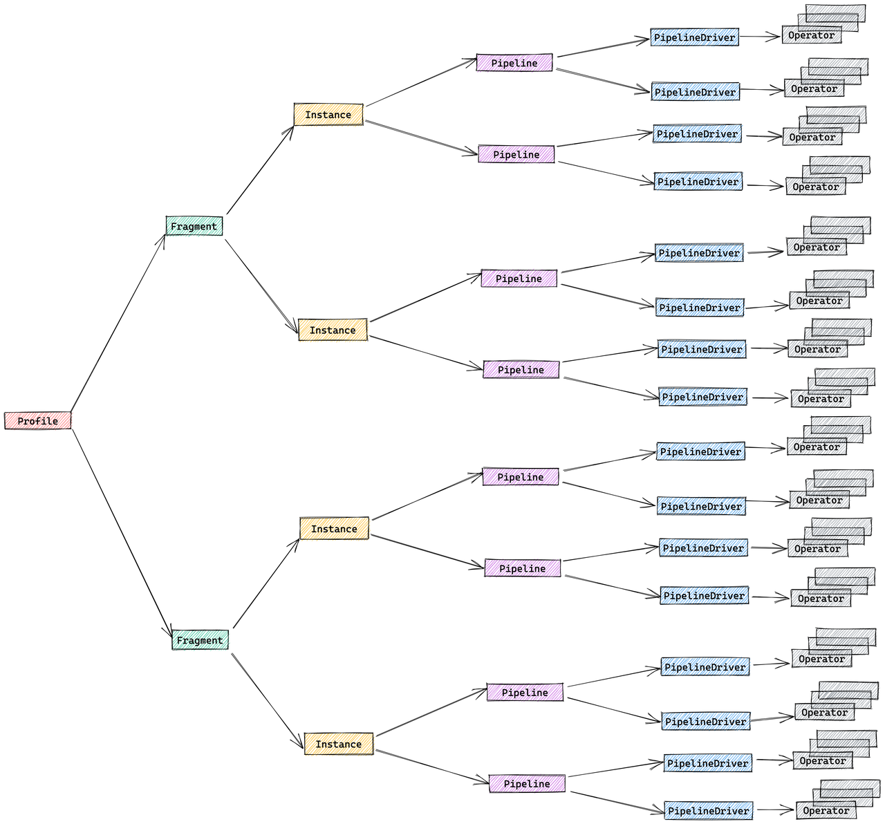

# クエリプロファイルの構造とメトリクス

## 概要

クエリプロファイルは、StarRocks 内で SQL クエリの実行に関する詳細なレポートを提供します。クエリのパフォーマンスに関する包括的なビューを提供し、各操作に費やされた時間、処理されたデータ量、その他の関連メトリクスを含みます。この情報は、クエリパフォーマンスの最適化、ボトルネックの特定、問題のトラブルシューティングに非常に役立ちます。

:::tip なぜ重要か
現実世界の遅いクエリの80%は、3つの警告メトリクスのいずれかを特定することで解決されます。このチートシートは、数値に溺れる前にあなたをそこに導きます。
:::

## クイックスタート

最近のクエリをプロファイルする:

### 1. 最近のクエリIDをリストする

クエリプロファイルを分析するには、クエリIDが必要です。`SHOW PROFILELIST;`を使用します:

```sql
SHOW PROFILELIST;
```

:::tip
`SHOW PROFILELIST`の詳細は [Text-based Query Profile Visualized Analysis](./query_profile_text_based_analysis.md) に記載されています。始める際はそのページを参照してください。
:::

### 2. SQLと並べてプロファイルを開く

`ANALYZE PROFILE FOR <query_id>\G`を実行するか、CelerData Web UIで**Profile**をクリックします。

### 3. 「Execution Overview」バナーをざっと見る

全体の実行パフォーマンスのための主要なメトリクスを調べます:
- QueryExecutionWallTime: クエリ実行の総ウォールクロック時間
- QueryPeakMemoryUsagePerNode: ノードごとのピークメモリ使用量で、BEメモリの80%を超える値はデータスピルやメモリエラー（OOM）のリスクを示します
- QueryCumulativeCpuTime / WallTime < 0.5 * num_cpu_cores はCPUが待機していることを意味します（おそらくI/Oまたはネットワーク）

どれも発火しない場合、通常クエリは問題ありません—ここで終了します。

### 4. さらに深く掘り下げる

最も時間やメモリを消費するオペレーターを特定し、そのメトリクスを分析し、パフォーマンスボトルネックを特定するための根本原因を突き止めます。

「Operator Metrics」セクションは、パフォーマンス問題の根本原因を特定するための多くのガイドラインを提供します。

## コアコンセプト

### クエリ実行フロー

SQLクエリの包括的な実行フローは以下のステージを含みます:
1. **計画**: クエリは解析、分析、最適化を経て、クエリプランの生成に至ります。
2. **スケジューリング**: スケジューラとコーディネータが協力して、クエリプランをすべての参加するバックエンドノードに分配します。
3. **実行**: クエリプランはパイプライン実行エンジンを使用して実行されます。


### クエリプランの構造

StarRocksの実行エンジンは、クエリを分散方式で実行するように設計されており、クエリプロファイルの構造はこの設計を反映しています。分散クエリプランを構成するコンポーネントは以下の通りです:

- **Fragment**: 実行ツリーの最上位レベルで、論理的な作業単位を表します。クエリは1つ以上のフラグメントに分割されることがあります。
- **FragmentInstance**: 各フラグメントは複数回インスタンス化され、各インスタンス（FragmentInstance）は異なる計算ノードで実行されます。これにより、ノード間での並列処理が可能になります。
- **Pipeline**: FragmentInstanceはさらに複数のパイプラインに分割され、これらは接続されたOperatorインスタンスのシーケンスです。パイプラインはFragmentInstanceの実行パスを定義します。
- **PipelineDriver**: 計算リソースの利用を最大化するために、各パイプラインは複数のインスタンス（PipelineDriver）を持つことができます。これらのドライバーは、複数の計算コアを活用してパイプラインを並列に実行します。
- **Operator**: 基本的な実行単位であり、OperatorインスタンスはPipelineDriverの一部です。オペレーターは、集計、ジョイン、スキャンなどの特定のアルゴリズムを実装してデータを処理します。



### パイプライン実行エンジンの概念

パイプラインエンジンは、StarRocks実行エンジンの主要コンポーネントです。クエリプランを並列かつ効率的に実行する責任を負っています。パイプラインエンジンは、複雑なクエリプランや大量のデータを処理するように設計されており、高いパフォーマンスとスケーラビリティを保証します。

パイプラインエンジンの主要な概念:
- **Operator**: 特定のアルゴリズム（例: 集計、ジョイン、スキャン）を実装する基本的な実行単位
- **Pipeline**: 実行パスを表す接続されたOperatorインスタンスのシーケンス
- **PipelineDriver**: 並列実行のためのパイプラインの複数のインスタンス
- **Schedule**: ユーザースペースのタイムスライシングを使用したパイプラインの非ブロッキングスケジューリング


### メトリクスマージ戦略

デフォルトでは、StarRocksはプロファイルボリュームを削減するためにFragmentInstanceとPipelineDriverレイヤーをマージし、簡略化された3層構造を生成します:
- Fragment
- Pipeline
- Operator

このマージ動作は、セッション変数`pipeline_profile_level`を通じて制御できます:
- `1` (デフォルト): マージされた3層構造
- `2`: 元の5層構造
- その他の値: `1`として扱われます

メトリクスをマージする際、メトリクスタイプに基づいて異なる戦略が使用されます:

- **時間関連のメトリクス**: 平均を取る
  - 例: `OperatorTotalTime`は平均時間消費
  - `__MAX_OF_OperatorTotalTime`と`__MIN_OF_OperatorTotalTime`は極値を記録

- **非時間関連のメトリクス**: 値を合計
  - 例: `PullChunkNum`はすべてのインスタンスの合計
  - `__MAX_OF_PullChunkNum`と`__MIN_OF_PullChunkNum`は極値を記録

- **定数メトリクス**: すべてのインスタンスで同じ値（例: `DegreeOfParallelism`）

MINとMAX値の間に大きな違いがある場合、特に集計やジョイン操作においてデータの偏りを示すことがよくあります。

## クエリプロファイルメトリクス

### サマリーメトリクス

クエリ実行に関する基本情報:

| メトリクス | 説明 |
|--------|-------------|
| Total | クエリによって消費された総時間で、計画、実行、プロファイリングフェーズの期間を含みます。 |
| Query State | クエリの状態。可能な状態には、Finished、Error、Runningがあります。 |
| Query ID | クエリの一意の識別子。 |
| Start Time | クエリが開始されたタイムスタンプ。 |
| End Time | クエリが終了したタイムスタンプ。 |
| Total | クエリの総期間。 |
| Query Type | クエリのタイプ。 |
| Query State | クエリの現在の状態。 |
| StarRocks Version | 使用されたStarRocksのバージョン。 |
| User | クエリを実行したユーザー。 |
| Default Db | クエリで使用されたデフォルトデータベース。 |
| Sql Statement | 実行されたSQLステートメント。 |
| Variables | クエリで使用された重要な変数。 |
| NonDefaultSessionVariables | クエリで使用された非デフォルトのセッション変数。 |
| Collect Profile Time | プロファイルを収集するのにかかった時間。 |
| IsProfileAsync | プロファイル収集が非同期であったかどうかを示します。 |

### プランナーメトリクス

プランナーの包括的な概要を提供します。通常、プランナーに費やされる総時間が10ms未満の場合、問題はありません。

特定のシナリオでは、プランナーがより多くの時間を必要とする場合があります:
1. 複雑なクエリは、最適な実行プランを確保するために、解析と最適化に追加の時間を必要とする場合があります。
2. 多数のマテリアライズドビューが存在する場合、クエリの書き換えに必要な時間が増加する可能性があります。
3. 複数の同時クエリがシステムリソースを使い果たし、クエリキューが使用される場合、`Pending`時間が長引く可能性があります。
4. 外部テーブルを含むクエリは、外部メタデータサーバーとの通信に追加の時間を要する可能性があります。

例:
```
     - -- Parser[1] 0
     - -- Total[1] 3ms
     -     -- Analyzer[1] 0
     -         -- Lock[1] 0
     -         -- AnalyzeDatabase[1] 0
     -         -- AnalyzeTemporaryTable[1] 0
     -         -- AnalyzeTable[1] 0
     -     -- Transformer[1] 0
     -     -- Optimizer[1] 1ms
     -         -- MVPreprocess[1] 0
     -         -- MVTextRewrite[1] 0
     -         -- RuleBaseOptimize[1] 0
     -         -- CostBaseOptimize[1] 0
     -         -- PhysicalRewrite[1] 0
     -         -- DynamicRewrite[1] 0
     -         -- PlanValidate[1] 0
     -             -- InputDependenciesChecker[1] 0
     -             -- TypeChecker[1] 0
     -             -- CTEUniqueChecker[1] 0
     -             -- ColumnReuseChecker[1] 0
     -     -- ExecPlanBuild[1] 0
     - -- Pending[1] 0
     - -- Prepare[1] 0
     - -- Deploy[1] 2ms
     -     -- DeployLockInternalTime[1] 2ms
     -         -- DeploySerializeConcurrencyTime[2] 0
     -         -- DeployStageByStageTime[6] 0
     -         -- DeployWaitTime[6] 1ms
     -             -- DeployAsyncSendTime[2] 0
     - DeployDataSize: 10916
    Reason:
```

### 実行概要メトリクス

高レベルの実行統計:

| メトリクス | 説明 | 目安 |
|--------|-------------|---------------|
| FrontendProfileMergeTime | FE側のプロファイル処理時間 | < 10ms 正常 |
| QueryAllocatedMemoryUsage | ノード全体での割り当てメモリの合計 | |
| QueryDeallocatedMemoryUsage | ノード全体での解放メモリの合計 | |
| QueryPeakMemoryUsagePerNode | ノードごとの最大ピークメモリ | < 80% 容量正常 |
| QuerySumMemoryUsage | ノード全体でのピークメモリの合計 | |
| QueryExecutionWallTime | 実行のウォール時間 | |
| QueryCumulativeCpuTime | ノード全体でのCPU時間の合計 | `walltime * totalCpuCores` と比較 |
| QueryCumulativeOperatorTime | オペレーター実行時間の合計 | オペレーター時間の割合の分母 |
| QueryCumulativeNetworkTime | Exchangeノードのネットワーク時間の合計 | |
| QueryCumulativeScanTime | ScanノードのIO時間の合計 | |
| QueryPeakScheduleTime | 最大パイプラインスケジュール時間 | 単純なクエリの場合 < 1s 正常 |
| QuerySpillBytes | ディスクにスピルされたデータ | < 1GB 正常 |

### フラグメントメトリクス

フラグメントレベルの実行詳細:

| メトリクス | 説明 |
|--------|-------------|
| InstanceNum | FragmentInstancesの数 |
| InstanceIds | すべてのFragmentInstancesのID |
| BackendNum | 参加しているBEsの数 |
| BackendAddresses | BEアドレス |
| FragmentInstancePrepareTime | フラグメント準備フェーズの期間 |
| InstanceAllocatedMemoryUsage | インスタンスの割り当てメモリの合計 |
| InstanceDeallocatedMemoryUsage | インスタンスの解放メモリの合計 |
| InstancePeakMemoryUsage | インスタンス全体でのピークメモリ |

### パイプラインメトリクス

パイプラインの実行詳細と関係:


主要な関係:
- DriverTotalTime = ActiveTime + PendingTime + ScheduleTime
- ActiveTime = ∑ OperatorTotalTime + OverheadTime
- PendingTime = InputEmptyTime + OutputFullTime + PreconditionBlockTime + PendingFinishTime
- InputEmptyTime = FirstInputEmptyTime + FollowupInputEmptyTime

| メトリクス | 説明 |
|--------|-------------|
| DegreeOfParallelism | パイプライン実行の並行度。 |
| TotalDegreeOfParallelism | 並行度の合計。同じパイプラインが複数のマシンで実行される可能性があるため、この項目はすべての値を集計します。 |
| DriverPrepareTime | 準備フェーズにかかる時間。このメトリクスはDriverTotalTimeには含まれません。 |
| DriverTotalTime | 準備フェーズを除くパイプラインの総実行時間。 |
| ActiveTime | 各オペレーターの実行時間と、has_output、need_inputなどのメソッドの呼び出しに費やされる全体的なフレームワークオーバーヘッドを含むパイプラインの実行時間。 |
| PendingTime | さまざまな理由でスケジュールされるのをブロックされているパイプラインの時間。 |
| InputEmptyTime | 入力キューが空であるためにブロックされているパイプラインの時間。 |
| FirstInputEmptyTime | 入力キューが空であるために最初にブロックされるパイプラインの時間。最初のブロック時間は、主にパイプラインの依存関係によって引き起こされるため、別途計算されます。 |
| FollowupInputEmptyTime | 入力キューが空であるためにその後ブロックされるパイプラインの時間。 |
| OutputFullTime | 出力キューが満杯であるためにブロックされるパイプラインの時間。 |
| PreconditionBlockTime | 依存関係が満たされていないためにブロックされるパイプラインの時間。 |
| PendingFinishTime | 非同期タスクの終了を待つためにブロックされているパイプラインの時間。 |
| ScheduleTime | 準備完了キューに入ってから実行のためにスケジュールされるまでのパイプラインのスケジュール時間。 |
| BlockByInputEmpty | InputEmptyのためにパイプラインがブロックされた回数。 |
| BlockByOutputFull | OutputFullのためにパイプラインがブロックされた回数。 |
| BlockByPrecondition | 未満の前提条件のためにパイプラインがブロックされた回数。 |

### オペレーターメトリクス

| メトリクス | 説明 |
|--------|-------------|
| PrepareTime | 準備に費やされた時間。 |
| OperatorTotalTime | オペレーターによって消費された総時間。これは次の式を満たします: OperatorTotalTime = PullTotalTime + PushTotalTime + SetFinishingTime + SetFinishedTime + CloseTime。準備に費やされた時間は含まれません。 |
| PullTotalTime | オペレーターがpush_chunkを実行するのに費やす総時間。 |
| PushTotalTime | オペレーターがpull_chunkを実行するのに費やす総時間。 |
| SetFinishingTime | オペレーターがset_finishingを実行するのに費やす総時間。 |
| SetFinishedTime | オペレーターがset_finishedを実行するのに費やす総時間。 |
| PushRowNum | オペレーターの入力行の累積数。 |
| PullRowNum | オペレーターの出力行の累積数。 |
| JoinRuntimeFilterEvaluate | ジョインランタイムフィルターが評価された回数。 |
| JoinRuntimeFilterHashTime | ジョインランタイムフィルターのハッシュを計算するのに費やされた時間。 |
| JoinRuntimeFilterInputRows | ジョインランタイムフィルターの入力行数。 |
| JoinRuntimeFilterOutputRows | ジョインランタイムフィルターの出力行数。 |
| JoinRuntimeFilterTime | ジョインランタイムフィルターに費やされた時間。 |

### スキャンオペレーター

スキャンオペレーター内のさまざまなメトリクスをよりよく理解するために、以下の図はこれらのメトリクスとストレージ構造との関連を示しています。


ディスクからデータを取得し、述語を適用するために、ストレージエンジンはいくつかの技術を利用します:
1. **データストレージ**: エンコードおよび圧縮されたデータは、さまざまなインデックスと共にセグメントに保存されます。
2. **インデックスフィルタリング**: エンジンは、BitmapIndex、BloomfilterIndex、ZonemapIndex、ShortKeyIndex、NGramIndexなどのインデックスを利用して不要なデータをスキップします。
3. **プッシュダウン述語**: `a > 1`のような単純な述語は、特定の列で評価するためにプッシュダウンされます。
4. **後期実体化**: 必要な列とフィルタリングされた行のみがディスクから取得されます。
5. **非プッシュダウン述語**: プッシュダウンできない述語が評価されます。
6. **プロジェクション式**: `SELECT a + 1`のような式が計算されます。

#### 一般的なパフォーマンスボトルネックとその解決策:

#####  重い生I/Oまたは遅いストレージ

**警告メトリクス/症状**:  BytesRead、RawRowsRead、CompressedBytesRead、ScanTime、IOTaskExecTimeが支配的

**OLAPスキャンを遅くする理由**:  ディスク（またはオブジェクトストア）の読み取り帯域幅が制約になる

**解決策**:  ホットデータをNVMe/SSDに配置、ストレージキャッシュを有効化

#####  不十分な述語

**警告メトリクス/症状**:  PushdownPredicates≈0; ExprFilterRowsが支配的; LIKE '%x%'または他の複雑な述語

**OLAPスキャンを遅くする理由**:  フィルタがストレージレイヤーで適用されないため、より多くの行がCPUスレッドプールに流れ込む

**解決策**:  フィルタを単純な比較に書き換える、ターゲットとなるMVs/インデックスを構築

#####  低DOPまたはスレッドプールの飽和

**警告メトリクス/症状**:  高いIOTaskWaitTime; 低いPeakIOTasks

**OLAPスキャンを遅くする理由**:  並列スキャンタスクが少なすぎるか、スレッドがI/Oスロットを待ってブロックされる

**解決策**:  ディスク帯域幅を増やすか、キャッシュを拡大

#####  BEs間のタブレット/データの偏り

**警告メトリクス/症状**:  OperatorTotalTimeまたはBytesReadの大きな最大-最小ギャップ; 1つのタブレットがほとんどのデータを所有

**OLAPスキャンを遅くする理由**:  1つのスレッドが不均衡な作業を行い、他のスレッドはアイドル状態

**解決策**:  高カーディナリティキーでハッシュバケットを作成; バケット数を増やす

#####  断片化されたRowsetsと小さなセグメント

**警告メトリクス/症状**:  高いRowsetsReadCount / SegmentsReadCount; 長いSegmentInit時間

**OLAPスキャンを遅くする理由**:  多くの小さなファイルが頻繁なオープン/シーク呼び出しを強制

**解決策**:  コンパクションスレッドを増やすか、手動でコンパクションを実行; ミニロードをバッチ処理

#####  ソフト削除されたレコードの数が多い

**警告メトリクス/症状**:  高いDeleteFilterRows

**OLAPスキャンを遅くする理由**:  ソフト削除は読み取り時に削除述語を適用

**解決策**:  データを圧縮; 削除操作の頻度を減らす

スキャンオペレーターは、IOタスクを実行するための追加のスレッドプールを利用します。したがって、このノードの時間メトリクス間の関係は以下のように示されます:


#### OLAPスキャンオペレーター

OLAP_SCANオペレーターは、StarRocks内部テーブルからデータを読み取る責任を負います。

| メトリクス | 説明 |
|--------|-------------|
| Table | テーブル名。 |
| Rollup | マテリアライズドビュー名。マテリアライズドビューがヒットしない場合、テーブル名と同じです。 |
| SharedScan | enable_shared_scanセッション変数が有効かどうか。 |
| TabletCount | タブレットの数。 |
| MorselsCount | 基本的なIO実行単位であるモーセルの数。 |
| PushdownPredicates | プッシュダウン述語の数。 |
| Predicates | 述語式。 |
| BytesRead | 読み取られたデータのサイズ。 |
| CompressedBytesRead | ディスクから読み取られた圧縮データのサイズ。 |
| UncompressedBytesRead | ディスクから読み取られた非圧縮データのサイズ。 |
| RowsRead | 述語フィルタリング後に読み取られた行数。 |
| RawRowsRead | 述語フィルタリング前に読み取られた生の行数。 |
| ReadPagesNum | 読み取られたページ数。 |
| CachedPagesNum | キャッシュされたページ数。 |
| ChunkBufferCapacity | チャンクバッファの容量。 |
| DefaultChunkBufferCapacity | チャンクバッファのデフォルト容量。 |
| PeakChunkBufferMemoryUsage | チャンクバッファのピークメモリ使用量。 |
| PeakChunkBufferSize | チャンクバッファのピークサイズ。 |
| PrepareChunkSourceTime | チャンクソースの準備に費やされた時間。 |
| ScanTime | 累積スキャン時間。スキャン操作は非同期I/Oスレッドプールで完了します。 |
| IOTaskExecTime | IOタスクの実行時間。 |
| IOTaskWaitTime | IOタスクのスケジュール実行までの待機時間。 |
| SubmitTaskCount | IOタスクが提出された回数。 |
| SubmitTaskTime | タスク提出に費やされた時間。 |
| PeakIOTasks | IOタスクのピーク数。 |
| PeakScanTaskQueueSize | IOタスクキューのピークサイズ。 |

#### コネクタースキャンオペレーター

OLAP_SCANオペレーターに似ていますが、Iceberg/Hive/Hudi/Detalなどの外部テーブルをスキャンするために使用されます。

| メトリクス | 説明 |
|--------|-------------|
| DataSourceType | データソースタイプ。HiveDataSource、ESDataSourceなどが含まれます。 |
| Table | テーブル名。 |
| TabletCount | タブレットの数。 |
| MorselsCount | モーセルの数。 |
| Predicates | 述語式。 |
| PredicatesPartition | パーティションに適用される述語式。 |
| SharedScan | `enable_shared_scan`セッション変数が有効かどうか。 |
| ChunkBufferCapacity | チャンクバッファの容量。 |
| DefaultChunkBufferCapacity | チャンクバッファのデフォルト容量。 |
| PeakChunkBufferMemoryUsage | チャンクバッファのピークメモリ使用量。 |
| PeakChunkBufferSize | チャンクバッファのピークサイズ。 |
| PrepareChunkSourceTime | チャンクソースの準備にかかる時間。 |
| ScanTime | スキャンの累積時間。スキャン操作は非同期I/Oスレッドプールで完了します。 |
| IOTaskExecTime | I/Oタスクの実行時間。 |
| IOTaskWaitTime | I/Oタスクのスケジュール実行までの待機時間。 |
| SubmitTaskCount | I/Oタスクが提出された回数。 |
| SubmitTaskTime | タスク提出にかかる時間。 |
| PeakIOTasks | I/Oタスクのピーク数。 |
| PeakScanTaskQueueSize | I/Oタスクキューのピークサイズ。 |

### Exchangeオペレーター

Exchangeオペレーターは、BEノード間でデータを送信する役割を担います。いくつかの種類のExchange操作があります: GATHER/BROADCAST/SHUFFLE。

Exchangeオペレーターがクエリのボトルネックになる典型的なシナリオ:
1. Broadcast Join: これは小さなテーブルに適した方法です。しかし、例外的な場合にオプティマイザが最適でないクエリプランを選択すると、ネットワーク帯域幅が大幅に増加する可能性があります。
2. Shuffle Aggregation/Join: 大きなテーブルをシャッフルすると、ネットワーク帯域幅が大幅に増加する可能性があります。

#### Exchange Sinkオペレーター

| メトリクス | 説明 |
|--------|-------------|
| ChannelNum | チャネルの数。通常、チャネルの数は受信者の数と等しいです。 |
| DestFragments | 送信先FragmentInstanceのIDリスト。 |
| DestID | 送信先ノードID。 |
| PartType | データ分配モード。UNPARTITIONED、RANDOM、HASH_PARTITIONED、BUCKET_SHUFFLE_HASH_PARTITIONEDが含まれます。 |
| SerializeChunkTime | チャンクをシリアライズするのにかかる時間。 |
| SerializedBytes | シリアライズされたデータのサイズ。 |
| ShuffleChunkAppendCounter | PartTypeがHASH_PARTITIONEDまたはBUCKET_SHUFFLE_HASH_PARTITIONEDのときのチャンク追加操作の回数。 |
| ShuffleChunkAppendTime | PartTypeがHASH_PARTITIONEDまたはBUCKET_SHUFFLE_HASH_PARTITIONEDのときのチャンク追加操作にかかる時間。 |
| ShuffleHashTime | PartTypeがHASH_PARTITIONEDまたはBUCKET_SHUFFLE_HASH_PARTITIONEDのときのハッシュ計算にかかる時間。 |
| RequestSent | 送信されたデータパケットの数。 |
| RequestUnsent | 未送信のデータパケットの数。このメトリクスはショートサーキットロジックがある場合にゼロ以外になります。それ以外の場合はゼロです。 |
| BytesSent | 送信されたデータのサイズ。 |
| BytesUnsent | 未送信のデータのサイズ。このメトリクスはショートサーキットロジックがある場合にゼロ以外になります。それ以外の場合はゼロです。 |
| BytesPassThrough | 送信先ノードが現在のノードである場合、データはネットワークを介して送信されず、パススルーデータと呼ばれます。このメトリクスはそのようなパススルーデータのサイズを示します。パススルーは`enable_exchange_pass_through`によって制御されます。 |
| PassThroughBufferPeakMemoryUsage | パススルーバッファのピークメモリ使用量。 |
| CompressTime | 圧縮時間。 |
| CompressedBytes | 圧縮データのサイズ。 |
| OverallThroughput | スループット率。 |
| NetworkTime | データパケットの送信にかかる時間（受信後の処理時間を除く）。 |
| NetworkBandwidth | 推定ネットワーク帯域幅。 |
| WaitTime | 送信者キューが満杯のための待機時間。 |
| OverallTime | 全体の送信プロセスの総時間、つまり最初のデータパケットを送信してから最後のデータパケットの正しい受信を確認するまでの時間。 |
| RpcAvgTime | RPCの平均時間。 |
| RpcCount | RPCの総数。 |

#### Exchange Sourceオペレーター

| メトリクス | 説明 |
|--------|-------------|
| RequestReceived | 受信したデータパケットのサイズ。 |
| BytesReceived | 受信したデータのサイズ。 |
| DecompressChunkTime | チャンクを解凍するのにかかる時間。 |
| DeserializeChunkTime | チャンクをデシリアライズするのにかかる時間。 |
| ClosureBlockCount | ブロックされたクロージャの数。 |
| ClosureBlockTime | クロージャのブロック時間。 |
| ReceiverProcessTotalTime | 受信側の処理にかかる総時間。 |
| WaitLockTime | ロック待機時間。 |

### 集計オペレーター


集計オペレーターは、集計関数、`GROUP BY`、および`DISTINCT`を実行する役割を担います。

**集計アルゴリズムの多様な形式**

| 形式 | プランナーが選択する場合 | 内部データ構造 | 特徴/注意点 |
|------|----------------------------|-------------------------|-----------------------|
| ハッシュ集計 | キーがメモリに収まる場合; カーディナリティが極端でない場合 | SIMDプロービングを備えたコンパクトハッシュテーブル | デフォルトパス、適度なキー数に最適 |
| ソート集計 | 入力がすでに`GROUP BY`キーで順序付けされている場合 | 単純な行比較 + 実行状態 | ハッシュテーブルコストゼロ、プロービングが重い偏りで通常2-3倍速い |
| スピル可能集計 (3.2+) | ハッシュテーブルがメモリ制限を超える場合 | ディスクスピルパーティションを備えたハイブリッドハッシュ/マージ | OOMを防ぎ、パイプライン並列性を維持 |

**多段階分散集計**

StarRocksでは、集計は分散方式で実装されており、クエリパターンとオプティマイザの決定に応じて多段階になることがあります。

```
┌─────────┐        ┌──────────┐        ┌────────────┐        ┌────────────┐
│ Stage 0 │ local  │ Stage 1  │ shard/ │ Stage 2    │ gather/│ Stage 3    │ final
│ Partial │───►    │ Update   │ hash   │ Merge      │ shard  │ Finalize   │ output
└─────────┘        └──────────┘        └────────────┘        └────────────┘
```

| ステージ | 使用される場合 | 何が起こるか |
|--------|------------|--------------|
| 一段階 | `DISTRIBUTED BY`が`GROUP BY`のサブセットであり、パーティションがコロケートされている場合 | 部分集計が即座に最終結果になります。 |
| 二段階 (ローカル + グローバル) | 典型的な分散`GROUP BY` | ステージ0は各BE内で重複を適応的に圧縮します; ステージ1は`GROUP BY`に基づいてデータをシャッフルし、グローバル集計を実行します |
| 三段階 (ローカル + シャッフル + ファイナル) | 重い`DISTINCT`と高カーディナリティの`GROUP BY` | ステージ0は上記のように; ステージ1は`GROUP BY`でシャッフルし、次に`GROUP BY`と`DISTINCT`で集計します; ステージ2は`GROUP BY`として部分状態をマージします |
| 四段階 (ローカル + 部分 + 中間 + ファイナル) | 重い`DISTINCT`と低カーディナリティの`GROUP BY` | 単一ポイントのボトルネックを避けるために`GROUP BY`と`DISTINCT`でシャッフルする追加のステージを導入 |

**一般的なパフォーマンスボトルネックとその解決策:**

### ボトルネックの原因

#### 高カーディナリティの`GROUP BY` → オーバーサイズのハッシュテーブル

**警告メトリクス/症状**:  HashTableSize、HashTableMemoryUsage、AggComputeTimeが膨らむ; クエリがメモリ制限に近づく

**Aggオペレーターに悪影響を与える理由**:  ハッシュ集計はグループごとに1つのエントリを構築します; 数百万のグループがRAMに収まると、ハッシュテーブルはCPUとメモリに負担をかけ、スピルすることもあります

**解決策**:  ソートストリーミング集計を有効化; 事前集計されたMVsまたはロールアップを追加; キーの幅を減らす/`INT`にキャスト

#### 部分→最終ステージ間のデータの偏り

**警告メトリクス/症状**:  インスタンス間でHashTableSizeまたはInputRowCountの大きなギャップ; 1つのフラグメントのAggComputeTimeが他を圧倒

**Aggオペレーターに悪影響を与える理由**:  単一のバックエンドがほとんどのホットキーを受け取り、パイプラインをブロック

**解決策**:  集計にソルト列を追加; `DISTINCT [skew]`ヒントを使用

#### 高価または`DISTINCT`スタイルの集計関数（例: `ARRAY_AGG`, `HLL_UNION`, `BITMAP_UNION`, `COUNT(DISTINCT)`）

**警告メトリクス/症状**:  AggregateFunctionsがオペレーター時間を支配; ハッシュ構築が終了した後もCPUが100%近く

**Aggオペレーターに悪影響を与える理由**:  状態の重い集計関数はかなりのスケッチを保持し、各行でSIMD重いループを実行

**解決策**:  HLL/ビットマップ列をインジェスト時に事前計算; 精度が許す場合はapprox_count_distinctまたはmulti_distinct_*を使用

#### 初段階（部分）集計の不十分

**警告メトリクス/症状**:  非常に大きなInputRowCountだがAggComputeTimeは控えめ; PassThroughRowCountが高い; 上流のEXCHANGEが大量のBytesSentを示す

**Aggオペレーターに悪影響を与える理由**:  各BEでの部分集計がデータセットをうまく事前集計しない場合、ほとんどの生の行がネットワークを通過し、最終AGGに積み上がる

**解決策**:  プランが二段階または三段階の集計を示していることを確認; オプティマイザが部分AGGをプッシュできるようにクエリを単純な`GROUP BY`キーに書き換える; streaming_preaggregation_mode = 'force_preaggregation'を設定

#### `GROUP BY`キーでの重い式評価

**警告メトリクス/症状**:  ExprComputeTimeが`AggComputeTime`に対して高い

**Aggオペレーターに悪影響を与える理由**:  ハッシュ化の前に各行で複雑な関数がCPUを支配

**解決策**:  サブクエリまたは生成列で計算されたキーを実体化; カラム辞書/事前エンコードされた値を使用; 下流でプロジェクト

**メトリクスリスト**

| メトリクス | 説明 |
|--------|-------------|
| `GroupingKeys` | `GROUP BY`列。 |
| `AggregateFunctions` | 集計関数計算にかかる時間。 |
| `AggComputeTime` | AggregateFunctions + Group Byの時間。 |
| `ChunkBufferPeakMem` | チャンクバッファのピークメモリ使用量。 |
| `ChunkBufferPeakSize` | チャンクバッファのピークサイズ。 |
| `ExprComputeTime` | 式計算の時間。 |
| `ExprReleaseTime` | 式解放の時間。 |
| `GetResultsTime` | 集計結果を抽出する時間。 |
| `HashTableSize` | ハッシュテーブルのサイズ。 |
| `HashTableMemoryUsage` | ハッシュテーブルのメモリサイズ。 |
| `InputRowCount` | 入力行数。 |
| `PassThroughRowCount` | 自動モードで、低集計後にストリーミングモードに劣化してストリーミングモードで処理されたデータ行数。 |
| `ResultAggAppendTime` | 集計結果列を追加するのにかかる時間。 |
| `ResultGroupByAppendTime` | Group By列を追加するのにかかる時間。 |
| `ResultIteratorTime` | ハッシュテーブルを反復する時間。 |
| `StreamingTime` | ストリーミングモードでの処理時間。 |

### ジョインオペレーター


ジョインオペレーターは、明示的なジョインまたは暗黙のジョインを実装する役割を担います。

実行中、ジョインオペレーターはパイプラインエンジン内で並行して実行されるビルド（ハッシュテーブル構築）とプローブフェーズに分割されます。ベクトルチャンク（最大4096行）はSIMDでバッチハッシュされ、消費されたキーはランタイムフィルター（ブルームまたはINフィルター）を生成し、上流のスキャンにプッシュバックしてプローブ入力を早期にカットします。

**ジョイン戦略**

StarRocksは、ベクトル化されたパイプラインフレンドリーなハッシュジョインコアに依存しており、コストベースオプティマイザがプラン時に評価する4つの物理戦略に接続できます:

| 戦略 | オプティマイザが選択する場合 | 速さの理由 |
|----------|-----------------------------|---------------------|
| Colocate Join | 両方のテーブルが同じコロケーショングループに属している（同一のバケットキー、バケット数、レプリカレイアウト）。 | ネットワークシャッフルなし: 各BEはローカルバケットのみをジョインします。 |
| Bucket-Shuffle Join | ジョインテーブルの1つがジョインキーと同じバケットキーを持っている | 1つのジョインテーブルのみをシャッフルする必要があり、ネットワークコストを削減できます |
| Broadcast Join | ビルド側が非常に小さい（行/バイトのしきい値または明示的なヒント）。 | 小さなテーブルがすべてのプローブノードに複製され、大きなテーブルのシャッフルを回避します。 |
| Shuffle (Hash) Join | 一般的なケース、キーが一致しない。 | 各行をジョインキーでハッシュパーティションし、プローブをBEs全体でバランスさせます。 |

**ジョインがボトルネックになる場合**

#### ビルド側のテーブルがRAMに収まりきらない

**プロファイルの症状/ホットメトリクス**:  BuildRows、HashTableSize、BuildHashTableTimeが支配的; メモリが制限に近いかスピルする

**なぜ悪影響を与えるか**:  ハッシュテーブルはメモリに存在する必要があり、CPUキャッシュに収まらないと遅くなる可能性があります

**解決策**:
- 小さいテーブルをビルド側にする
- 事前集計または選択的プロジェクションを追加
- クエリ/BEメモリを増やすかハッシュスピルを有効化

#### 大きなジョインプローブ時間

**プロファイルの症状/ホットメトリクス**:  高いSearchHashTableTime

**なぜ悪影響を与えるか**:  非効率なデータクラスタリングがCPUキャッシュの局所性を悪化させる可能性があります

**解決策**:  ジョインキーでプローブテーブルをソートしてデータクラスタリングを最適化

#### 出力列が多すぎる

**プロファイルの症状/ホットメトリクス**:  高いOutputBuildColumnTimeまたはOutputProbeColumnTime

**なぜ悪影響を与えるか**:  多数の出力列の処理には多くのデータコピーが必要で、CPU集約的になる可能性があります

**解決策**:  出力列を最適化してその数を減らす; 重い列を出力から除外; 不要な列をジョイン後に取得することを検討

#### シャッフル後のデータの偏り

**プロファイルの症状/ホットメトリクス**:  1つのフラグメントのProbeRowsが他よりも大きい; OperatorTotalTimeが非常に不均衡

**なぜ悪影響を与えるか**:  単一のBEがほとんどのホットキーを受け取り、他のBEはアイドル状態になる

**解決策**: 
- 高カーディナリティキーを使用
- 複合キーをパッド（concat(key,'-',mod(id,16)))

#### それほど小さくないテーブルをブロードキャストしている

**プロファイルの症状/ホットメトリクス**:  ジョインタイプがBROADCAST; 各BEでBytesSentとSendBatchTimeが急上昇

**なぜ悪影響を与えるか**:  O(N²)のネットワークトラフィックとデシリアライズ

**解決策**: 
- オプティマイザにシャッフルを選ばせる（`SET broadcast_row_limit = lower`）
- シャッフルヒントを強制
- 統計を収集するためにテーブルを分析

#### ランタイムフィルターがないか効果がない

**プロファイルの症状/ホットメトリクス**:  JoinRuntimeFilterEvaluateが小さいが、スキャンはまだフルテーブルを読み込む

**なぜ悪影響を与えるか**:  スキャンがすべての行をプローブ側にプッシュし、CPUとI/Oを無駄にする

**解決策**:  ジョイン述語を純粋な等価性に書き換えてRFを生成できるようにする; ジョインキーでの型キャストを避ける

#### 非等価（ネストループ）ジョインの潜入

**プロファイルの症状/ホットメトリクス**:  ジョインノードが`CROSS`または`NESTLOOP`を示す; ProbeRows*BuildRowsが急増

**なぜ悪影響を与えるか**:  O(rows×rows)の比較; ハッシュキーなし

**解決策**: 
- 適切な等価述語または事前フィルターを追加
- 一時テーブルに述語結果を実体化し、再ジョイン

#### ハッシュキーのキャスト/式コスト

**プロファイルの症状/ホットメトリクス**:  高いExprComputeTime; ハッシュ関数の時間がプローブ時間に匹敵

**なぜ悪影響を与えるか**:  キーはハッシュ化の前に各行でキャストまたは評価される必要がある

**解決策**: 
- 一致する型でキーを保存
- 複雑な式を生成列に事前計算

#### 大きなジョインでのコロケーションなし

**プロファイルの症状/ホットメトリクス**:  バケットが一致しているのにファクトとディメンション間でシャッフルジョイン

**なぜ悪影響を与えるか**:  ランダムな配置が毎回シャッフルを強制

**解決策**: 
- 2つのテーブルを同じコロケーショングループに配置
- インジェスト前に同一のバケット数/キーを確認

**メトリクスリスト**

| メトリクス | 説明 |
|--------|-------------|
| `DistributionMode` | 分配タイプ。BROADCAST、PARTITIONED、COLOCATEなどが含まれます。 |
| `JoinPredicates` | ジョイン述語。 |
| `JoinType` | ジョインタイプ。 |
| `BuildBuckets` | ハッシュテーブル内のバケット数。 |
| `BuildKeysPerBucket` | ハッシュテーブル内のバケットごとのキー数。 |
| `BuildConjunctEvaluateTime` | ビルドフェーズ中の結合評価にかかる時間。 |
| `BuildHashTableTime` | ハッシュテーブルを構築するのにかかる時間。 |
| `ProbeConjunctEvaluateTime` | プローブフェーズ中の結合評価にかかる時間。 |
| `SearchHashTableTimer` | ハッシュテーブルを検索するのにかかる時間。 |
| `CopyRightTableChunkTime` | 右テーブルからチャンクをコピーするのにかかる時間。 |
| `OutputBuildColumnTime` | ビルド側の列を出力するのにかかる時間。 |
| `OutputProbeColumnTime` | プローブ側の列を出力するのにかかる時間。 |
| `HashTableMemoryUsage` | ハッシュテーブルのメモリ使用量。 |
| `RuntimeFilterBuildTime` | ランタイムフィルターを構築するのにかかる時間。 |
| `RuntimeFilterNum` | ランタイムフィルターの数。 |

### ウィンドウ関数オペレーター

| メトリクス | 説明 |
|--------|-------------|
| `ProcessMode` | 実行モード。MaterializingとStreamingの2つの部分を含みます。 |
| `ComputeTime` | ウィンドウ関数計算にかかる時間。 |
| `PartitionKeys` | パーティション列。 |
| `AggregateFunctions` | 集計関数。 |
| `ColumnResizeTime` | 列のリサイズにかかる時間。 |
| `PartitionSearchTime` | パーティション境界を検索するのにかかる時間。 |
| `PeerGroupSearchTime` | ピアグループ境界を検索するのにかかる時間。ウィンドウタイプが`RANGE`の場合にのみ意味があります。 |
| `PeakBufferedRows` | バッファ内のピーク行数。 |
| `RemoveUnusedRowsCount` | 未使用バッファが削除された回数。 |
| `RemoveUnusedTotalRows` | 未使用バッファから削除された行の総数。 |

### ソートオペレーター

| メトリクス | 説明 |
|--------|-------------|
| `SortKeys` | ソートキー。 |
| `SortType` | クエリ結果のソート方法: 完全ソートまたはトップN結果のソート。 |
| `MaxBufferedBytes` | バッファされたデータのピークサイズ。 |
| `MaxBufferedRows` | バッファされた行のピーク数。 |
| `NumSortedRuns` | ソートされたランの数。 |
| `BuildingTime` | ソート中の内部データ構造を維持するのにかかる時間。 |
| `MergingTime` | ソート中にソートされたランをマージするのにかかる時間。 |
| `SortingTime` | ソートにかかる時間。 |
| `OutputTime` | 出力ソートシーケンスを構築するのにかかる時間。 |

### マージオペレーター

さまざまなメトリクスを理解しやすくするために、マージは以下の状態メカニズムとして表現できます:

```plaintext
               ┌────────── PENDING ◄──────────┐
               │                              │
               │                              │
               ├──────────────◄───────────────┤
               │                              │
               ▼                              │
   INIT ──► PREPARE ──► SPLIT_CHUNK ──► FETCH_CHUNK ──► FINISHED
               ▲
               |
               | one traverse from leaf to root
               |
               ▼
            PROCESS
```

| メトリクス | 説明 | レベル |
|--------|-------------|-------|
| `Limit` | リミット。 | プライマリ |
| `Offset` | オフセット。 | プライマリ |
| `StreamingBatchSize` | ストリーミングモードでマージが実行される際に処理されるデータのサイズ | プライマリ |
| `LateMaterializationMaxBufferChunkNum` | 後期実体化が有効な場合のバッファ内の最大チャンク数。 | プライマリ |
| `OverallStageCount` | すべてのステージの総実行回数。 | プライマリ |
| `OverallStageTime` | 各ステージの総実行時間。 | プライマリ |
| `1-InitStageCount` | Initステージの実行回数。 | セカンダリ |
| `2-PrepareStageCount` | Prepareステージの実行回数。 | セカンダリ |
| `3-ProcessStageCount` | Processステージの実行回数。 | セカンダリ |
| `4-SplitChunkStageCount` | SplitChunkステージの実行回数。 | セカンダリ |
| `5-FetchChunkStageCount` | FetchChunkステージの実行回数。 | セカンダリ |
| `6-PendingStageCount` | Pendingステージの実行回数。 | セカンダリ |
| `7-FinishedStageCount` | Finishedステージの実行回数。 | セカンダリ |
| `1-InitStageTime` | Initステージの実行時間。 | セカンダリ |
| `2-PrepareStageTime` | Prepareステージの実行時間。 | セカンダリ |
| `3-ProcessStageTime` | Processステージの実行時間。 | セカンダリ |
| `4-SplitChunkStageTime` | Splitステージにかかる時間。 | セカンダリ |
| `5-FetchChunkStageTime` | Fetchステージにかかる時間。 | セカンダリ |
| `6-PendingStageTime` | Pendingステージにかかる時間。 | セカンダリ |
| `7-FinishedStageTime` | Finishedステージにかかる時間。 | セカンダリ |
| `LateMaterializationGenerateOrdinalTime` | 後期実体化中に順序列を生成するのにかかる時間。 | ターシャリ |
| `SortedRunProviderTime` | Processステージ中にプロバイダーからデータを取得するのにかかる時間。 | ターシャリ |

### テーブルファンクションオペレーター

| メトリクス | 説明 |
|--------|-------------|
| `TableFunctionExecTime` | テーブルファンクションの計算時間。 |
| `TableFunctionExecCount` | テーブルファンクションの実行回数。 |

### プロジェクトオペレーター

プロジェクトオペレーターは`SELECT <expr>`を実行する役割を担います。クエリに高価な式が含まれている場合、このオペレーターはかなりの時間を要することがあります。

| メトリクス | 説明 |
|--------|-------------|
| `ExprComputeTime` | 式の計算時間。 |
| `CommonSubExprComputeTime` | 共通部分式の計算時間。 |

### ローカルエクスチェンジオペレーター

| メトリクス | 説明 |
|--------|-------------|
| Type | ローカルエクスチェンジのタイプ。`Passthrough`、`Partition`、`Broadcast`が含まれます。 |
| `ShuffleNum` | シャッフルの数。このメトリクスは`Type`が`Partition`のときのみ有効です。 |
| `LocalExchangePeakMemoryUsage` | ピークメモリ使用量。 |
| `LocalExchangePeakBufferSize` | バッファのピークサイズ。 |
| `LocalExchangePeakBufferMemoryUsage` | バッファのピークメモリ使用量。 |
| `LocalExchangePeakBufferChunkNum` | バッファ内のピークチャンク数。 |
| `LocalExchangePeakBufferRowNum` | バッファ内のピーク行数。 |
| `LocalExchangePeakBufferBytes` | バッファ内のデータのピークサイズ。 |
| `LocalExchangePeakBufferChunkSize` | バッファ内のチャンクのピークサイズ。 |
| `LocalExchangePeakBufferChunkRowNum` | バッファ内のチャンクごとのピーク行数。 |
| `LocalExchangePeakBufferChunkBytes` | バッファ内のチャンクごとのデータのピークサイズ。 |

### OlapTableSinkオペレーター

OlapTableSinkオペレーターは`INSERT INTO <table>`操作を実行する役割を担います。

:::tip
- `OlapTableSink`の`PushChunkNum`メトリクスの最大値と最小値の間に過剰な差がある場合、上流のオペレーターでのデータの偏りを示し、ロードパフォーマンスのボトルネックになる可能性があります。
- `RpcClientSideTime`は`RpcServerSideTime`にネットワーク伝送時間とRPCフレームワーク処理時間を加えたものです。`RpcClientSideTime`と`RpcServerSideTime`の間に大きな差がある場合、伝送時間を短縮するために圧縮を有効にすることを検討してください。
:::

| メトリクス | 説明 |
|--------|-------------|
| `IndexNum` | 送信先テーブルのために作成された同期マテリアライズドビューの数。 |
| `ReplicatedStorage` | シングルリーダーレプリケーションが有効かどうか。 |
| `TxnID` | ロードトランザクションのID。 |
| `RowsRead` | 上流のオペレーターから読み取られた行数。 |
| `RowsFiltered` | データ品質が不十分なためにフィルタリングされた行数。 |
| `RowsReturned` | 送信先テーブルに書き込まれた行数。 |
| `RpcClientSideTime` | クライアント側で記録されたロードの総RPC時間消費。 |
| `RpcServerSideTime` | サーバー側で記録されたロードの総RPC時間消費。 |
| `PrepareDataTime` | データ準備フェーズの総時間消費。データ形式の変換とデータ品質チェックを含む。 |
| `SendDataTime` | データ送信のローカル時間消費。データのシリアライズと圧縮、および送信者キューへのタスクの提出時間を含む。 |