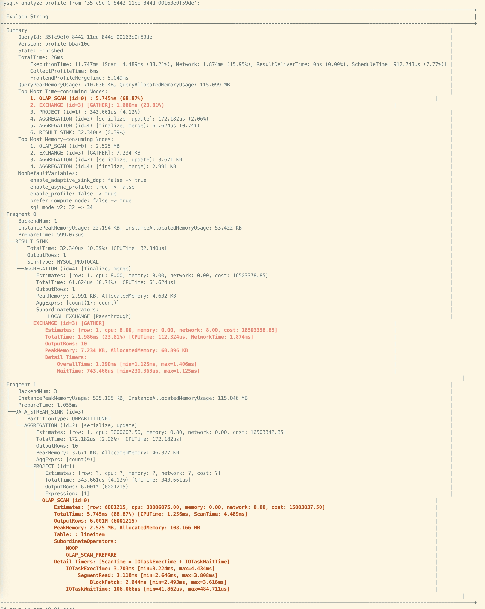

# テキストベースの Query Profile の可視化分析

このトピックでは、MySQL クライアントを使用してテキストベースの Query Profile を取得し、分析する方法を紹介します。

## ANALYZE PROFILE を使用して既存クエリのプロファイルを分析する

クラスター内の既存（履歴または実行中）のクエリのテキストベースのプロファイルを分析するには、まず [SHOW PROFILELIST](../sql-reference/sql-statements/cluster-management/plan_profile/SHOW_PROFILELIST.md) ステートメントを使用してクエリの概要を取得する必要があります。このコマンドは、正常に終了したクエリ、エラーで失敗したクエリ、およびまだ実行中（10 秒以上経過してまだ終了していない）のクエリを一覧表示します。このステートメントを通じて、後続の分析のための対応する Query ID を取得できます。構文は次のとおりです。

```SQL
SHOW PROFILELIST [LIMIT <num>];
```

例:

```SQL
SHOW PROFILELIST;
SHOW PROFILELIST LIMIT 5;
```

出力:

```plaintext
+--------------------------------------+---------------------+-------+----------+-----------------------------------------------------------------------------------------------------------------------------------+
| QueryId                              | StartTime           | Time  | State    | Statement                                                                                                                         |
+--------------------------------------+---------------------+-------+----------+-----------------------------------------------------------------------------------------------------------------------------------+
| a40456b2-8428-11ee-8d02-6a32f8c68848 | 2023-11-16 10:34:18 | 21ms  | Finished | SELECT ROUTINE_NAME FROM INFORMATION_SCHEMA.ROUTINES\n    WHERE ROUTINE_TYPE="FUNCTION" AND ROUTINE_SCHEMA = "None"               |
| a3fc4060-8428-11ee-8d02-6a32f8c68848 | 2023-11-16 10:34:17 | 39ms  | Finished | select TABLE_NAME, COLUMN_NAME from information_schema.columns\n                                    where table_schema = 'Non ... |
| a3f7d38d-8428-11ee-8d02-6a32f8c68848 | 2023-11-16 10:34:17 | 15ms  | Finished | select connection_id()                                                                                                            |
| a3efbd3b-8428-11ee-8d02-6a32f8c68848 | 2023-11-16 10:34:17 | 16ms  | Finished | select connection_id()                                                                                                            |
| a26ec286-8428-11ee-8d02-6a32f8c68848 | 2023-11-16 10:34:15 | 269ms | Error    | EXPLAIN ANALYZE  SELECT c_nation, s_nation, year(lo_orderdate) AS year , SUM(lo_revenue) AS revenue FROM lineorder_flat WHERE ...  |
+--------------------------------------+---------------------+-------+----------+-----------------------------------------------------------------------------------------------------------------------------------+
```

Query ID を取得したら、[ANALYZE PROFILE](../sql-reference/sql-statements/cluster-management/plan_profile/ANALYZE_PROFILE.md) ステートメントを使用して Query Profile の分析を進めることができます。構文は次のとおりです。

```SQL
ANALYZE PROFILE FROM '<Query_ID>' [, <Node_ID> [, ...] ]
```

- `Query_ID`: `SHOW PROFILELIST` ステートメントから取得したクエリに対応する ID。
- `Node_ID`: プロファイルノード ID。ID が指定されたノードについては、StarRocks はそのノードの詳細なメトリック情報を返します。ID が指定されていないノードについては、StarRocks は要約情報のみを返します。

プロファイルには次のセクションが含まれます。

- Summary: プロファイルの概要情報。
  - QueryID
  - バージョン情報
  - クエリの状態、`Finished`、`Error`、`Running` を含む。
  - クエリの総時間。
  - メモリ使用量
  - CPU 使用率が最も高いトップ 10 ノード。
  - メモリ使用率が最も高いトップ 10 ノード。
  - デフォルト値と異なる値を持つセッション変数。
- Fragments: 各フラグメント内の各ノードのメトリクスを表示。
  - 各ノードの時間、メモリ使用量、コスト見積もり情報、出力行。
  - 時間使用率が 30% を超えるノードは赤で強調表示されます。
  - 時間使用率が 15% を超え、30% 未満のノードはピンクで強調表示されます。

例 1: ノード ID を指定せずに Query Profile をクエリ。


例 2: ノード ID を `0` として指定して Query Profile をクエリ。StarRocks はノード ID `0` のすべての詳細なメトリクスを返し、問題の特定を容易にするために高使用率のメトリクスを強調表示します。


さらに、上記の方法は、実行中のクエリのために生成されたプロファイルである Runtime Query Profile の表示と分析もサポートしています。Query Profile 機能が有効になっている場合、この方法を使用して 10 秒以上実行中のクエリのプロファイルを取得できます。

終了したクエリのものと比較して、実行中のクエリのテキストベースの Query Profile には次の情報が含まれます。

- オペレーターの状態:
  - ⏳: オペレーターが開始されていません。これらのオペレーターは依存関係のために実行を開始していない可能性があります。
  - 🚀: 実行中のオペレーター。
  - ✅: 実行が終了したオペレーター。

- 全体の進捗状況: `実行が終了したオペレーターの数 / オペレーターの総数` に基づいて計算されます。データ行の詳細情報が不足しているため、この値は若干歪む可能性があります。

- オペレーターの進捗状況: `処理された行数 / 総行数` に基づいて計算されます。総行数を計算できない場合、進捗は `?` と表示されます。

例:


## EXPLAIN ANALYZE を使用してプロファイル分析のためのクエリをシミュレートする

StarRocks は [EXPLAIN ANALYZE](../sql-reference/sql-statements/cluster-management/plan_profile/EXPLAIN_ANALYZE.md) ステートメントを提供し、クエリのプロファイルを直接シミュレートして分析することができます。構文は次のとおりです。

```SQL
EXPLAIN ANALYZE <sql_statement>
```

`EXPLAIN ANALYZE` を実行すると、StarRocks はデフォルトで現在のセッションに対して Query Profile 機能を有効にします。

現在、`EXPLAIN ANALYZE` は 2 種類の SQL ステートメントをサポートしています: SELECT ステートメントと INSERT INTO ステートメント。StarRocks のデフォルトカタログ内の内部テーブルに対する INSERT INTO ステートメントの Query Profile のシミュレーションと分析のみが可能です。INSERT INTO ステートメントの Query Profile をシミュレートして分析する際には、実際のデータはロードされません。デフォルトで、インポートトランザクションは中止され、分析中にデータに意図しない変更が加えられないようにします。

例 1: SELECT ステートメントをシミュレートして分析。クエリ結果は破棄されます。


例 2: INSERT INTO ステートメントをシミュレートして分析。ロードトランザクションは中止されます。


## 制限事項

- `EXPLAIN ANALYZE INSERT INTO` ステートメントはデフォルトカタログ内のテーブルに対してのみサポートされています。
- より良い視覚効果を得るために、出力テキストには色付け、ハイライト、その他の機能を提供するために ANSI 文字が含まれています。MyCLI クライアントの使用を推奨します。ANSI 機能をサポートしていないクライアント（MySQL クライアントなど）では、表示が若干乱れることがありますが、通常、使用に影響はありません。例えば:

