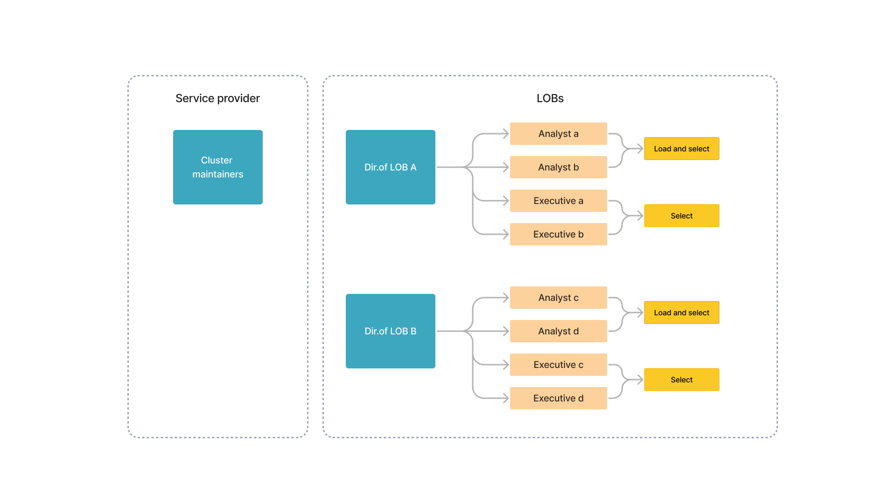
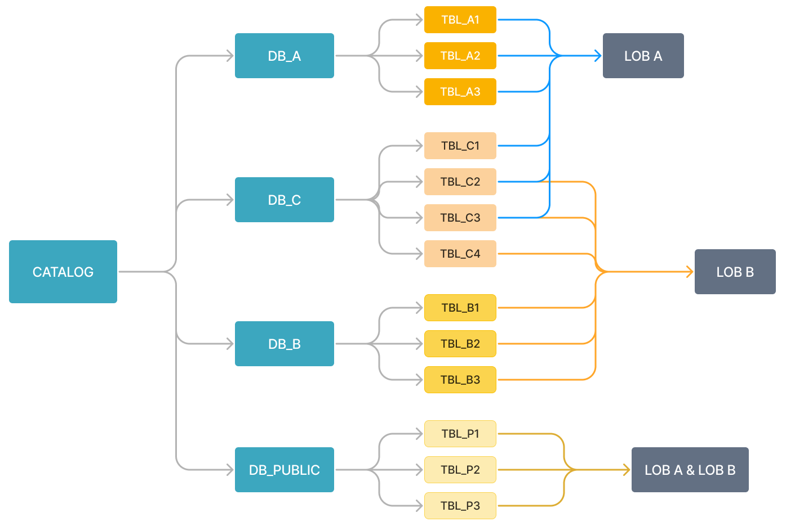
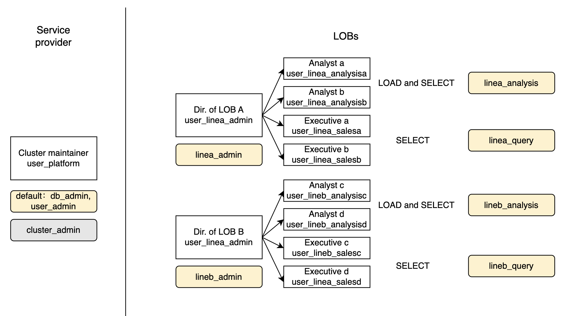

# ユーザー権限の管理

import UserPrivilegeCase from '../../_assets/commonMarkdown/userPrivilegeCase.md'

このトピックでは、StarRocks におけるユーザー、ロール、および権限の管理方法について説明します。

StarRocks は、StarRocks クラスター内の権限を管理するために、ロールベースのアクセス制御 (RBAC) とアイデンティティベースのアクセス制御 (IBAC) の両方を採用しており、クラスター管理者が異なる粒度レベルでクラスター内の権限を簡単に制限できるようにしています。

StarRocks クラスター内では、権限をユーザーまたはロールに付与できます。ロールは、必要に応じてクラスター内のユーザーや他のロールに割り当てることができる権限の集合です。ユーザーには 1 つ以上のロールを付与でき、それにより異なるオブジェクトに対する権限が決まります。

## ユーザーとロールの情報を表示する

システム定義のロール `user_admin` を持つユーザーは、StarRocks クラスター内のすべてのユーザーとロールの情報を表示できます。

### 権限情報を表示する

[SHOW GRANTS](../../sql-reference/sql-statements/account-management/SHOW_GRANTS.md) を使用して、ユーザーまたはロールに付与された権限を表示できます。

- 現在のユーザーの権限を表示する。

  ```SQL
  SHOW GRANTS;
  ```

  > **注意**
  >
  > すべてのユーザーは、自分の権限を表示することができます。

- 特定のユーザーの権限を表示する。

  次の例は、ユーザー `jack` の権限を示しています。

  ```SQL
  SHOW GRANTS FOR jack@'172.10.1.10';
  ```

- 特定のロールの権限を表示する。

  次の例は、ロール `example_role` の権限を示しています。

  ```SQL
  SHOW GRANTS FOR ROLE example_role;
  ```

### ユーザーのプロパティを表示する

[SHOW PROPERTY](../../sql-reference/sql-statements/account-management/SHOW_PROPERTY.md) を使用して、ユーザーのプロパティを表示できます。

次の例は、ユーザー `jack` のプロパティを示しています。

```SQL
SHOW PROPERTY FOR jack@'172.10.1.10';
```

### ロールを表示する

[SHOW ROLES](../../sql-reference/sql-statements/account-management/SHOW_ROLES.md) を使用して、StarRocks クラスター内のすべてのロールを表示できます。

```SQL
SHOW ROLES;
```

### ユーザーを表示する

SHOW USERS を使用して、StarRocks クラスター内のすべてのユーザーを表示できます。

```SQL
SHOW USERS;
```

## ユーザーの管理

システム定義のロール `user_admin` を持つユーザーは、StarRocks でユーザーを作成、変更、削除できます。

### ユーザーの作成

ユーザーのアイデンティティ、認証方法、およびデフォルトのロールを指定してユーザーを作成できます。

StarRocks は、ログイン資格情報または LDAP 認証によるユーザー認証をサポートしています。StarRocks の認証に関する詳細は、[Authentication](./Authentication.md) を参照してください。ユーザーの作成に関する詳細および高度な手順については、[CREATE USER](../../sql-reference/sql-statements/account-management/CREATE_USER.md) を参照してください。

次の例では、ユーザー `jack` を作成し、IP アドレス `172.10.1.10` からのみ接続を許可し、パスワードを `12345` に設定し、デフォルトのロールとして `example_role` を割り当てます。

```SQL
CREATE USER jack@'172.10.1.10' IDENTIFIED BY '12345' DEFAULT ROLE 'example_role';
```

> **注意**
>
> - StarRocks は、ユーザーのパスワードを保存する前に暗号化します。暗号化されたパスワードは password() 関数を使用して取得できます。
> - ユーザー作成時にデフォルトのロールが指定されていない場合、システム定義のデフォルトロール `PUBLIC` がユーザーに割り当てられます。

### ユーザーの変更

ユーザーのパスワード、デフォルトのロール、またはプロパティを変更できます。

ユーザーのデフォルトロールは、ユーザーが StarRocks に接続すると自動的に有効になります。接続後にユーザーのすべてのロール（デフォルトおよび付与されたロール）を有効にする方法については、[すべてのロールを有効にする](#enable-all-roles) を参照してください。

#### ユーザーのデフォルトロールを変更する

[SET DEFAULT ROLE](../../sql-reference/sql-statements/account-management/SET_DEFAULT_ROLE.md) または [ALTER USER](../../sql-reference/sql-statements/account-management/ALTER_USER.md) を使用して、ユーザーのデフォルトロールを設定できます。

次の例は、`jack` のデフォルトロールを `db1_admin` に設定します。`db1_admin` は `jack` に割り当てられている必要があります。

- SET DEFAULT ROLE を使用してデフォルトロールを設定する:

  ```SQL
  SET DEFAULT ROLE 'db1_admin' TO jack@'172.10.1.10';
  ```

- ALTER USER を使用してデフォルトロールを設定する:

  ```SQL
  ALTER USER jack@'172.10.1.10' DEFAULT ROLE 'db1_admin';
  ```

#### ユーザーのプロパティを変更する

[ALTER USER](../../sql-reference/sql-statements/account-management/ALTER_USER.md) を使用して、ユーザーのプロパティを設定できます。

次の例では、ユーザー `jack` の最大接続数を `1000` に設定します。同じユーザー名を持つユーザーアイデンティティは同じプロパティを共有します。

したがって、`jack` のプロパティを設定するだけで、この設定はユーザー名 `jack` を持つすべてのユーザーアイデンティティに対して有効になります。

```SQL
ALTER USER 'jack' SET PROPERTIES ("max_user_connections" = "1000");
```

#### ユーザーのパスワードをリセットする

[SET PASSWORD](../../sql-reference/sql-statements/account-management/SET_PASSWORD.md) または [ALTER USER](../../sql-reference/sql-statements/account-management/ALTER_USER.md) を使用して、ユーザーのパスワードをリセットできます。

> **注意**
>
> - すべてのユーザーは、自分のパスワードをリセットすることができます。
> - `root` ユーザー自身のみがそのパスワードを設定できます。パスワードを忘れて StarRocks に接続できない場合は、[失われた root パスワードをリセットする](#reset-lost-root-password) を参照してください。

次の例は、`jack` のパスワードを `54321` にリセットします。

- SET PASSWORD を使用してパスワードをリセットする:

  ```SQL
  SET PASSWORD FOR jack@'172.10.1.10' = PASSWORD('54321');
  ```

- ALTER USER を使用してパスワードをリセットする:

  ```SQL
  ALTER USER jack@'172.10.1.10' IDENTIFIED BY '54321';
  ```

#### 失われた root パスワードをリセットする

`root` ユーザーのパスワードを忘れて StarRocks に接続できない場合は、次の手順に従ってリセットできます。

1. ユーザー認証を無効にするために、すべての **FE ノード** の構成ファイル **fe/conf/fe.conf** に次の構成項目を追加します。

   ```YAML
   enable_auth_check = false
   ```

2. 構成を有効にするために、すべての **FE ノード** を再起動します。

   ```Bash
   ./fe/bin/stop_fe.sh
   ./fe/bin/start_fe.sh
   ```

3. MySQL クライアントから `root` ユーザーを介して StarRocks に接続します。ユーザー認証が無効な場合、パスワードを指定する必要はありません。

   ```Bash
   mysql -h <fe_ip_or_fqdn> -P<fe_query_port> -uroot
   ```

4. `root` ユーザーのパスワードをリセットします。

   ```SQL
   SET PASSWORD for root = PASSWORD('xxxxxx');
   ```

5. すべての **FE ノード** の構成ファイル **fe/conf/fe.conf** で構成項目 `enable_auth_check` を `true` に設定して、ユーザー認証を再度有効にします。

   ```YAML
   enable_auth_check = true
   ```

6. 構成を有効にするために、すべての **FE ノード** を再起動します。

   ```Bash
   ./fe/bin/stop_fe.sh
   ./fe/bin/start_fe.sh
   ```

7. MySQL クライアントから `root` ユーザーと新しいパスワードを使用して StarRocks に接続し、パスワードが正常にリセットされたかどうかを確認します。

   ```Bash
   mysql -h <fe_ip_or_fqdn> -P<fe_query_port> -uroot -p<xxxxxx>
   ```

### ユーザーの削除

[DROP USER](../../sql-reference/sql-statements/account-management/DROP_USER.md) を使用して、ユーザーを削除できます。

次の例は、ユーザー `jack` を削除します。

```SQL
DROP USER jack@'172.10.1.10';
```

## ロールの管理

システム定義のロール `user_admin` を持つユーザーは、StarRocks でロールを作成、付与、取り消し、または削除できます。

### ロールの作成

[CREATE ROLE](../../sql-reference/sql-statements/account-management/CREATE_ROLE.md) を使用してロールを作成できます。デフォルトでは、ユーザーは最大 64 のロールを持つことができます。この設定は、FE 動的パラメータ `privilege_max_total_roles_per_user` を使用して調整できます。ロールは最大 16 の継承レベルを持つことができます。この設定は、FE 動的パラメータ `privilege_max_role_depth` を使用して調整できます。

次の例は、ロール `example_role` を作成します。

```SQL
CREATE ROLE example_role;
```

### ロールの付与

[GRANT](../../sql-reference/sql-statements/account-management/GRANT.md) を使用して、ユーザーまたは他のロールにロールを付与できます。

- ユーザーにロールを付与する。

  次の例は、ユーザー `jack` にロール `example_role` を付与します。

  ```SQL
  GRANT example_role TO USER jack@'172.10.1.10';
  ```

- 他のロールにロールを付与する。

  次の例は、ロール `test_role` にロール `example_role` を付与します。

  ```SQL
  GRANT example_role TO ROLE test_role;
  ```

### ロールの取り消し

[REVOKE](../../sql-reference/sql-statements/account-management/REVOKE.md) を使用して、ユーザーまたは他のロールからロールを取り消すことができます。

> **注意**
>
> システム定義のデフォルトロール `PUBLIC` はユーザーから取り消すことができません。

- ユーザーからロールを取り消す。

  次の例は、ユーザー `jack` からロール `example_role` を取り消します。

  ```SQL
  REVOKE example_role FROM USER jack@'172.10.1.10';
  ```

- 他のロールからロールを取り消す。

  次の例は、ロール `test_role` からロール `example_role` を取り消します。

  ```SQL
  REVOKE example_role FROM ROLE test_role;
  ```

### ロールの削除

[DROP ROLE](../../sql-reference/sql-statements/account-management/DROP_ROLE.md) を使用してロールを削除できます。

次の例は、ロール `example_role` を削除します。

```SQL
DROP ROLE example_role;
```

> **注意**
>
> システム定義のロールは削除できません。

### すべてのロールを有効にする

ユーザーのデフォルトロールは、ユーザーが StarRocks クラスターに接続するたびに自動的に有効になります。

StarRocks クラスターに接続する際に、すべての StarRocks ユーザーのすべてのロール（デフォルトおよび付与されたロール）を有効にしたい場合は、次の操作を行うことができます。

この操作には、システム権限 OPERATE が必要です。

```SQL
SET GLOBAL activate_all_roles_on_login = TRUE;
```

また、SET ROLE を使用して割り当てられたロールを有効にすることもできます。たとえば、ユーザー `jack@'172.10.1.10'` はロール `db_admin` と `user_admin` を持っていますが、これらはユーザーのデフォルトロールではなく、ユーザーが StarRocks に接続したときに自動的に有効にはなりません。`jack@'172.10.1.10'` が `db_admin` と `user_admin` を有効にする必要がある場合、`SET ROLE db_admin, user_admin;` を実行できます。SET ROLE は元のロールを上書きすることに注意してください。すべてのロールを有効にしたい場合は、SET ROLE ALL を実行してください。

## 権限の管理

システム定義のロール `user_admin` を持つユーザーは、StarRocks で権限を付与または取り消すことができます。

### 権限の付与

[GRANT](../../sql-reference/sql-statements/account-management/GRANT.md) を使用して、ユーザーまたはロールに権限を付与できます。

- ユーザーに権限を付与する。

  次の例は、テーブル `sr_member` に対する SELECT 権限をユーザー `jack` に付与し、`jack` がこの権限を他のユーザーまたはロールに付与できるようにします（SQL で WITH GRANT OPTION を指定することによって）。

  ```SQL
  GRANT SELECT ON TABLE sr_member TO USER jack@'172.10.1.10' WITH GRANT OPTION;
  ```

- ロールに権限を付与する。

  次の例は、テーブル `sr_member` に対する SELECT 権限をロール `example_role` に付与します。

  ```SQL
  GRANT SELECT ON TABLE sr_member TO ROLE example_role;
  ```

### 権限の取り消し

[REVOKE](../../sql-reference/sql-statements/account-management/REVOKE.md) を使用して、ユーザーまたはロールから権限を取り消すことができます。

- ユーザーから権限を取り消す。

  次の例は、テーブル `sr_member` に対する SELECT 権限をユーザー `jack` から取り消し、`jack` がこの権限を他のユーザーまたはロールに付与することを禁止します。

  ```SQL
  REVOKE SELECT ON TABLE sr_member FROM USER jack@'172.10.1.10';
  ```

- ロールから権限を取り消す。

  次の例は、テーブル `sr_member` に対する SELECT 権限をロール `example_role` から取り消します。

  ```SQL
  REVOKE SELECT ON TABLE sr_member FROM ROLE example_role;
  ```

## ベストプラクティス

### マルチサービスアクセス制御

通常、企業所有の StarRocks クラスターは単一のサービスプロバイダーによって管理され、複数のビジネスライン (LOB) を維持しています。それぞれの LOB は 1 つ以上のデータベースを使用します。

以下に示すように、StarRocks クラスターのユーザーには、サービスプロバイダーと 2 つの LOB (A および B) のメンバーが含まれます。各 LOB は、アナリストとエグゼクティブの 2 つのロールによって運営されています。アナリストはビジネスレポートを生成および分析し、エグゼクティブはレポートを照会します。



LOB A はデータベース `DB_A` を独立して管理し、LOB B はデータベース `DB_B` を管理します。LOB A と LOB B は `DB_C` の異なるテーブルを使用します。`DB_PUBLIC` は、両方の LOB のすべてのメンバーがアクセスできます。



異なるメンバーが異なるデータベースやテーブルで異なる操作を行うため、サービスやポジションに応じてロールを作成し、各ロールに必要な権限のみを適用し、これらのロールを対応するメンバーに割り当てることをお勧めします。以下に示すように:



1. システム定義のロール `db_admin`、`user_admin`、および `cluster_admin` をクラスターのメンテナに割り当て、日常のメンテナンスのために `db_admin` と `user_admin` をデフォルトロールとして設定し、クラスターのノードを操作する必要があるときに手動で `cluster_admin` ロールを有効にします。

   例:

   ```SQL
   GRANT db_admin, user_admin, cluster_admin TO USER user_platform;
   ALTER USER user_platform DEFAULT ROLE db_admin, user_admin;
   ```

2. 各 LOB 内の各メンバーのためにユーザーを作成し、各ユーザーに複雑なパスワードを設定します。
3. 各 LOB 内の各ポジションのためにロールを作成し、各ロールに対応する権限を適用します。

   各 LOB のディレクターには、その LOB が必要とする最大の権限のコレクションと、対応する GRANT 権限（ステートメントで WITH GRANT OPTION を指定することによって）をそのロールに付与します。したがって、彼らはこれらの権限を彼らの LOB のメンバーに割り当てることができます。日常業務で必要な場合は、そのロールをデフォルトロールとして設定します。

   例:

   ```SQL
   GRANT SELECT, ALTER, INSERT, UPDATE, DELETE ON ALL TABLES IN DATABASE DB_A TO ROLE linea_admin WITH GRANT OPTION;
   GRANT SELECT, ALTER, INSERT, UPDATE, DELETE ON TABLE TABLE_C1, TABLE_C2, TABLE_C3 TO ROLE linea_admin WITH GRANT OPTION;
   GRANT linea_admin TO USER user_linea_admin;
   ALTER USER user_linea_admin DEFAULT ROLE linea_admin;
   ```

   アナリストとエグゼクティブには、対応する権限を持つロールを割り当てます。

   例:

   ```SQL
   GRANT SELECT ON ALL TABLES IN DATABASE DB_A TO ROLE linea_query;
   GRANT SELECT ON TABLE TABLE_C1, TABLE_C2, TABLE_C3 TO ROLE linea_query;
   GRANT linea_query TO USER user_linea_salesa;
   GRANT linea_query TO USER user_linea_salesb;
   ALTER USER user_linea_salesa DEFAULT ROLE linea_query;
   ALTER USER user_linea_salesb DEFAULT ROLE linea_query;
   ```

4. すべてのクラスター ユーザーがアクセスできるデータベース `DB_PUBLIC` については、システム定義のロール `public` に `DB_PUBLIC` に対する SELECT 権限を付与します。

   例:

   ```SQL
   GRANT SELECT ON ALL TABLES IN DATABASE DB_PUBLIC TO ROLE public;
   ```

複雑なシナリオでは、他の人にロールを割り当ててロールの継承を実現できます。

たとえば、アナリストが `DB_PUBLIC` のテーブルに書き込みおよびクエリを実行する権限を必要とし、エグゼクティブがこれらのテーブルをクエリすることしかできない場合、`public_analysis` および `public_sales` というロールを作成し、関連する権限をロールに適用し、それらをアナリストおよびエグゼクティブの元のロールに割り当てることができます。

例:

```SQL
CREATE ROLE public_analysis;
CREATE ROLE public_sales;
GRANT SELECT, ALTER, INSERT, UPDATE, DELETE ON ALL TABLES IN DATABASE DB_PUBLIC TO ROLE public_analysis;
GRANT SELECT ON ALL TABLES IN DATABASE DB_PUBLIC TO ROLE public_sales;
GRANT public_analysis TO ROLE linea_analysis;
GRANT public_analysis TO ROLE lineb_analysis;
GRANT public_sales TO ROLE linea_query;
GRANT public_sales TO ROLE lineb_query;
```

### シナリオに基づいてロールをカスタマイズする

<UserPrivilegeCase />