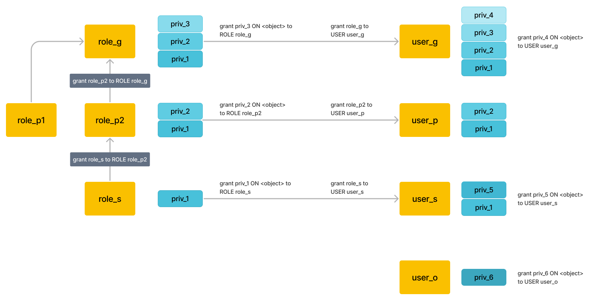
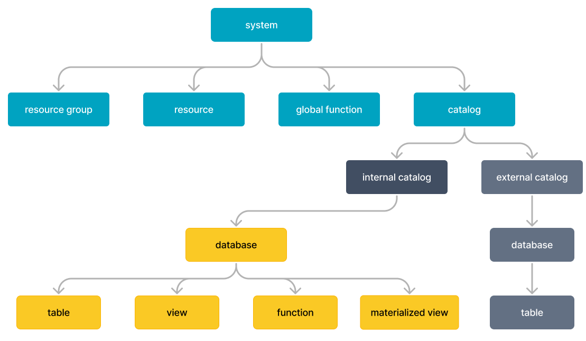
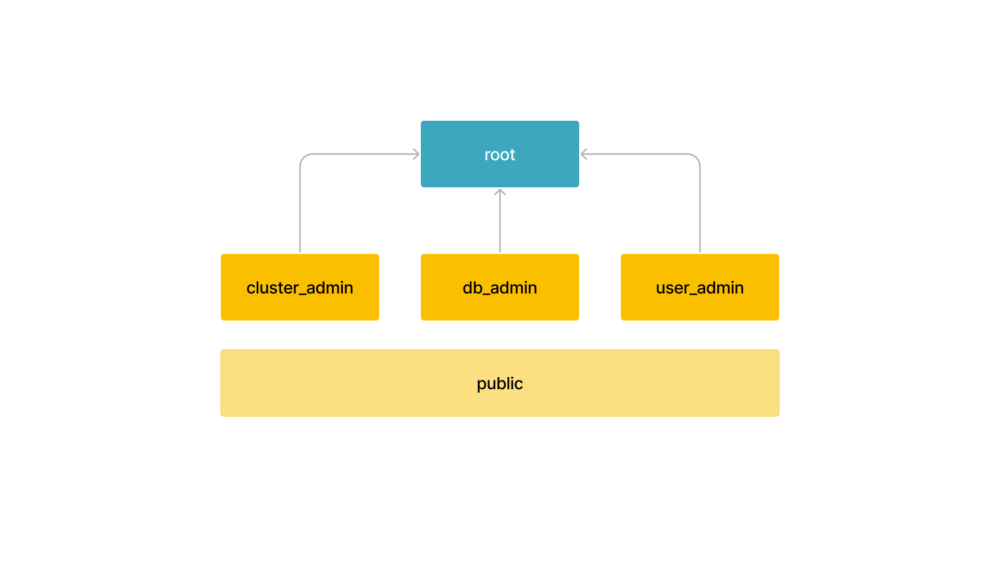
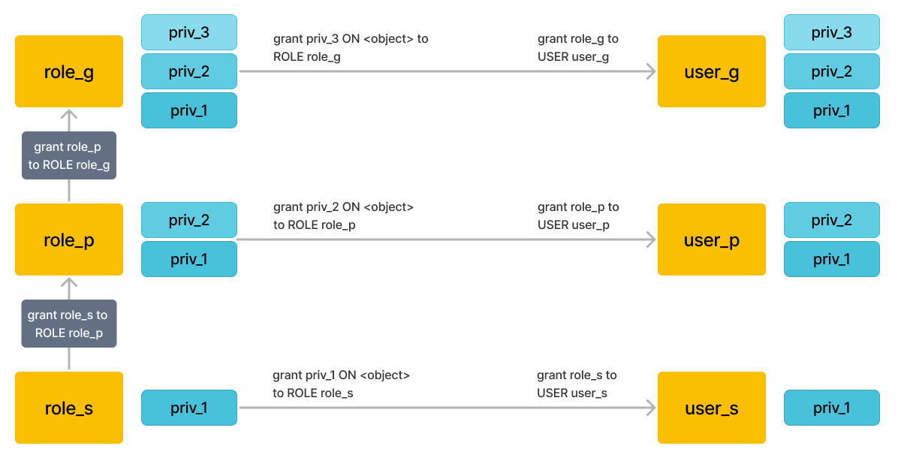

# 権限の概要

このトピックでは、StarRocks の権限システムの基本概念について説明します。権限は、どのユーザーがどのオブジェクトに対してどの操作を実行できるかを決定し、データとリソースをより細かく安全に管理できるようにします。

> 注意: このトピックで説明する権限は v3.0 以降でのみ利用可能です。v3.0 の権限フレームワークと構文は、以前のバージョンとは互換性がありません。v3.0 へのアップグレード後、特定の操作に関するものを除き、元の権限のほとんどは保持されます。詳細な違いについては、[Privileges supported in StarRocks](privilege_item.md) の [Upgrade notes] を参照してください。

StarRocks は、次の 2 つの権限モデルを採用しています。

- ロールベースのアクセス制御 (RBAC): 権限はロールに割り当てられ、その後ユーザーに割り当てられます。この場合、権限はロールを通じてユーザーに渡されます。
- アイデンティティベースのアクセス制御 (IBAC): 権限はユーザーのアイデンティティに直接割り当てられます。

したがって、各ユーザーアイデンティティの最大権限範囲は、その自身の権限とこのユーザーアイデンティティに割り当てられたロールの権限の合計です。

StarRocks の権限システムを理解するための**基本概念**:

- **オブジェクト**: アクセスを許可できるエンティティ。許可されていない限り、アクセスは拒否されます。オブジェクトの例には CATALOG、DATABASE、TABLE、VIEW などがあります。詳細については、[Privileges supported in StarRocks](privilege_item.md) を参照してください。
- **権限**: オブジェクトへのアクセスの定義されたレベル。複数の権限を使用して、オブジェクトに付与されるアクセスの粒度を制御できます。権限はオブジェクト固有です。異なるオブジェクトには異なる権限がある場合があります。権限の例には SELECT、ALTER、DROP などがあります。
- **ユーザーアイデンティティ**: ユーザーの一意のアイデンティティであり、権限を付与できるエンティティでもあります。ユーザーアイデンティティは `username@'userhost'` として表され、ユーザー名とユーザーがログインする IP で構成されます。ユーザーアイデンティティは属性設定を簡素化します。同じユーザー名を共有するユーザーアイデンティティは同じ属性を共有します。ユーザー名に属性を設定すると、この属性はそのユーザー名を共有するすべてのユーザーアイデンティティに適用されます。
- **ロール**: 権限を付与できるエンティティ。ロールは権限の抽象的な集合です。ロールはユーザーに割り当てることができ、他のロールに割り当てることもでき、ロール階層を作成します。データ管理を容易にするために、StarRocks はシステム定義のロールを提供します。ビジネス要件に応じてカスタムロールを作成することもできます。

以下の図は、RBAC および IBAC 権限モデルの下での権限管理の例を示しています。

これらのモデルでは、オブジェクトへのアクセスは、ロールおよびユーザーに割り当てられた権限を通じて許可されます。ロールは、他のロールまたはユーザーに割り当てられます。

## オブジェクトと権限

オブジェクトには、それが表す概念に関連する論理的な階層があります。たとえば、Database は Catalog に含まれ、Table、View、マテリアライズドビュー、Function は Database に含まれます。以下の図は、StarRocks システム内のオブジェクト階層を示しています。

各オブジェクトには、付与可能な権限項目のセットがあります。これらの権限は、これらのオブジェクトに対して実行できる操作を定義します。権限は、[GRANT](../../sql-reference/sql-statements/account-management/GRANT.md) および [REVOKE](../../sql-reference/sql-statements/account-management/REVOKE.md) コマンドを通じて、ロールまたはユーザーに付与および取り消すことができます。

## ユーザー

### ユーザーアイデンティティ

StarRocks では、各ユーザーは一意のユーザー ID で識別されます。これは、IP アドレス (ユーザーホスト) とユーザー名で構成され、`username @'userhost'` の形式です。StarRocks は、異なる IP アドレスからの同じユーザー名を持つユーザーを異なるユーザーアイデンティティとして識別します。たとえば、`user1@'starrocks.com'` と `user1@'mirrorship.com'` は 2 つのユーザーアイデンティティです。

ユーザーアイデンティティの別の表現は `username @['domain']` であり、`domain` は一連の IP アドレスとして DNS によって解決できるドメイン名です。`username @['domain']` は最終的に一連の `username@'userhost'` として表されます。`userhost` 部分には `%` を使用してあいまい一致を行うことができます。`userhost` が指定されていない場合、デフォルトで `'%'` となり、任意のホストからログインした同じ名前のユーザーを意味します。

### ユーザーへの権限の付与

ユーザーは権限を付与できるエンティティです。権限とロールの両方をユーザーに割り当てることができます。各ユーザーアイデンティティの最大権限範囲は、その自身の権限とこのユーザーアイデンティティに割り当てられたロールの権限の合計です。StarRocks は、各ユーザーが許可された操作のみを実行できるようにします。

ほとんどの場合、**ロールを使用して権限を渡す**ことをお勧めします。たとえば、ロールを作成した後、そのロールに権限を付与し、次にそのロールをユーザーに割り当てることができます。臨時または特別な権限を付与したい場合は、直接ユーザーに付与することができます。これにより、権限管理が簡素化され、柔軟性が提供されます。

## ロール

ロールは、権限を付与および取り消すことができるエンティティです。ロールは、ユーザーに割り当てられる権限の集合として見ることができ、必要な操作を実行できるようにします。ユーザーは複数のロールを割り当てられることができ、異なる権限セットを使用して異なる操作を実行できます。管理を簡素化するために、StarRocks は **ロールを通じて権限を管理する**ことを推奨しています。特別な権限や一時的な権限は、直接ユーザーに付与することができます。

管理を容易にするために、StarRocks は特定の権限を持ついくつかの **システム定義のロール** を提供しており、日常の管理および保守の要件を満たすのに役立ちます。また、特定のビジネスニーズやセキュリティニーズを満たすために、**カスタムロール**を柔軟に作成することもできます。システム定義のロールの権限範囲は変更できないことに注意してください。

ロールがアクティブ化されると、ユーザーはそのロールによって許可された操作を実行できます。**デフォルトロール**を設定すると、ユーザーがログインしたときに自動的にアクティブ化されます。ユーザーは、現在のセッションで所有するロールを手動でアクティブ化することもできます。

### システム定義のロール

StarRocks は、いくつかの種類のシステム定義のロールを提供しています。

- `root`: グローバルな権限を持ちます。デフォルトで、`root` ユーザーは `root` ロールを持ちます。
   StarRocks クラスターが作成されると、システムは自動的に root 権限を持つ root ユーザーを生成します。root ユーザーとロールはシステムのすべての権限を持っているため、新しいユーザーとロールを作成して、リスクのある操作を防ぐことをお勧めします。root ユーザーのパスワードを適切に管理してください。
- `cluster_admin`: ノードの追加や削除などのノード関連操作を実行するためのクラスター管理権限を持ちます。
  `cluster_admin` はクラスターのノードを追加、削除、退役させる権限を持っています。予期しないノードの変更を防ぐために、`cluster_admin` またはこのロールを含むカスタムロールをデフォルトロールとしてユーザーに割り当てないことをお勧めします。
- `db_admin`: カタログ、データベース、テーブル、ビュー、マテリアライズドビュー、関数、グローバル関数、リソースグループ、プラグインに対するすべての操作を行う権限を含むデータベース管理権限を持ちます。
- `user_admin`: ユーザーとロールに対する管理権限を持ち、ユーザー、ロール、権限を作成する権限を含みます。

  上記のシステム定義のロールは、複雑なデータベース権限を集約して日常の管理を容易にするように設計されています。**上記のロールの権限範囲は変更できません。**

  さらに、すべてのユーザーに特定の権限を付与する必要がある場合、StarRocks はシステム定義のロール `public` も提供しています。

- `public`: このロールはすべてのユーザーが所有し、新しいユーザーを含むすべてのセッションでデフォルトでアクティブ化されます。`public` ロールにはデフォルトで権限はありません。このロールの権限範囲を変更することができます。

### カスタムロール

特定のビジネス要件を満たすためにカスタムロールを作成し、その権限範囲を変更することができます。同時に、管理の便宜のために、他のロールにロールを割り当てて権限の階層と継承を作成することができます。すると、ロールに関連付けられた権限は他のロールによって継承されます。

#### ロール階層と権限の継承

以下の図は、権限の継承の例を示しています。

> 注意: ロールの継承レベルの最大数はデフォルトで 16 です。継承関係は双方向にはできません。

図に示されているように:

- `role_s` は `role_p` に割り当てられています。`role_p` は `role_s` の `priv_1` を暗黙的に継承します。
- `role_p` は `role_g` に割り当てられ、`role_g` は `role_p` の `priv_2` と `role_s` の `priv_1` を暗黙的に継承します。
- ロールがユーザーに割り当てられると、そのユーザーもこのロールの権限を持ちます。

### アクティブロール

アクティブロールを使用すると、ユーザーは現在のセッションでロールの権限を適用できます。現在のセッションでアクティブなロールを表示するには、`SELECT CURRENT_ROLE();` を使用します。詳細については、[current_role](../../sql-reference/sql-functions/utility-functions/current_role.md) を参照してください。

#### デフォルトロール

デフォルトロールは、ユーザーがクラスターにログインすると自動的にアクティブ化されます。これは、1 人以上のユーザーが所有するロールである可能性があります。管理者は、[CREATE USER](../../sql-reference/sql-statements/account-management/CREATE_USER.md) の `DEFAULT ROLE` キーワードを使用してデフォルトロールを設定し、[ALTER USER](../../sql-reference/sql-statements/account-management/ALTER_USER.md) を使用してデフォルトロールを変更できます。

ユーザーは [SET DEFAULT ROLE](../../sql-reference/sql-statements/account-management/SET_DEFAULT_ROLE.md) を使用してデフォルトロールを変更することもできます。

デフォルトロールは、ユーザーに基本的な権限保護を提供します。たとえば、ユーザー A は `role_query` と `role_delete` を持ち、それぞれクエリと削除の権限を持っています。`DELETE` や `TRUNCATE` などの高リスク操作によるデータ損失を防ぐために、デフォルトロールとして `role_query` のみを使用することをお勧めします。これらの操作を実行する必要がある場合は、アクティブロールを手動で設定した後に実行できます。

デフォルトロールを持たないユーザーでも、`public` ロールを持っており、クラスターにログインすると自動的にアクティブ化されます。

#### ロールの手動アクティブ化

デフォルトロールに加えて、ユーザーはセッション内で 1 つ以上の既存のロールを手動でアクティブ化することもできます。[SHOW GRANTS](../../sql-reference/sql-statements/account-management/SHOW_GRANTS.md) を使用してアクティブ化可能な権限とロールを表示し、[SET ROLE](../../sql-reference/sql-statements/account-management/SET_ROLE.md) を使用して現在のセッションで有効なアクティブロールを設定できます。

SET ROLE コマンドは互いに上書きされることに注意してください。たとえば、ユーザーがログインした後、`default_role` がデフォルトでアクティブ化されます。その後、ユーザーが `SET ROLE role_s` を実行します。この時点で、ユーザーは `role_s` の権限と自身の権限のみを持ちます。`default_role` は上書きされます。

## 参考文献

- [Privileges supported by StarRocks](privilege_item.md)
- [Manage user privileges](User_privilege.md)